# Windows Kernel Programming（第二版）
## Windows 内核编程
> 原书作者：Pavel Yosifovich
> 翻译日期：2026-05-11
---


# Chapter 1: Windows Internals Overview

# 第一章：Windows 内部原理概述

本章介绍 Windows 内部工作机制中最重要的概念。部分主题将在本书后续章节中结合相关内容进行更详细的阐述。请务必理解本章的概念，因为它们是构建任何驱动程序乃至用户模式底层代码的基础。

本章内容：
    • 进程
    • 虚拟内存
    • 线程
    • 系统服务
    • 系统架构
    • 句柄与对象

## 进程
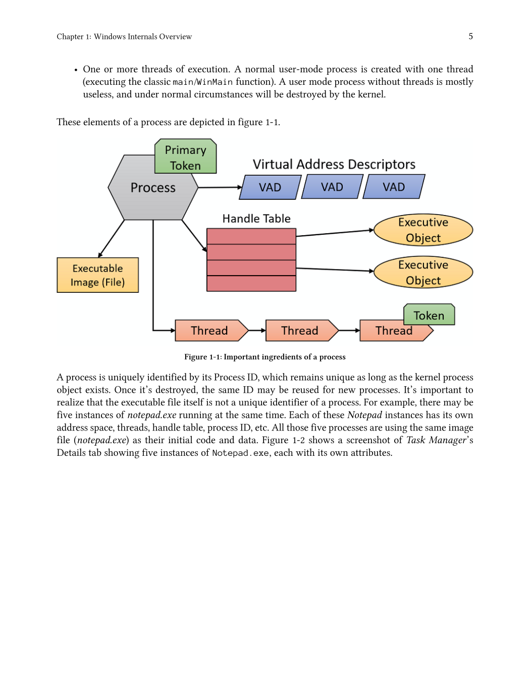

进程（process）是一个容器和管理对象，代表程序的运行实例。常说的“进程运行”其实并不准确——进程本身并不运行，它负责管理。真正执行代码、在技术上“运行”的是线程（thread）。从高层视角来看，一个进程拥有以下资源：

    • 一个可执行程序，其中包含用于在进程内执行代码的初始代码和数据。大多数进程都是如此，但某些特殊进程没有可执行映像（由内核直接创建）。
    • 一个私有的虚拟地址空间，用于按进程内代码的需求分配内存。
    • 一个访问令牌（称为主令牌），这是一个存储进程安全上下文的对象，供在进程内执行的线程使用（除非线程通过模拟使用不同的令牌）。
    • 一个私有的句柄表，用于访问执行体对象，如事件、信号量和文件。
    • 一个或多个执行线程。正常的用户模式进程在创建时带有一个线程（执行经典的 main/WinMain 函数）。没有线程的用户模式进程基本毫无用处，正常情况下会被内核销毁。

进程的这些组成元素如图 1-1 所示。

                                 图 1-1：进程的重要成分

进程由其进程 ID 唯一标识，只要内核进程对象存在，该 ID 就保持唯一。一旦对象被销毁，同一 ID 可能会被新进程重用。需要明确的是，可执行文件本身并不是进程的唯一标识。例如，可能同时运行着五个 notepad.exe 实例。每个记事本实例都拥有自己的地址空间、线程、句柄表、进程 ID 等。这五个进程都将相同的映像文件（notepad.exe）作为其初始代码和数据。图 1-2 是任务管理器“详细信息”选项卡的截图，显示了五个 Notepad.exe 实例，每个实例都有自己的属性。

                                       图 1-2：五个记事本实例

## 虚拟内存
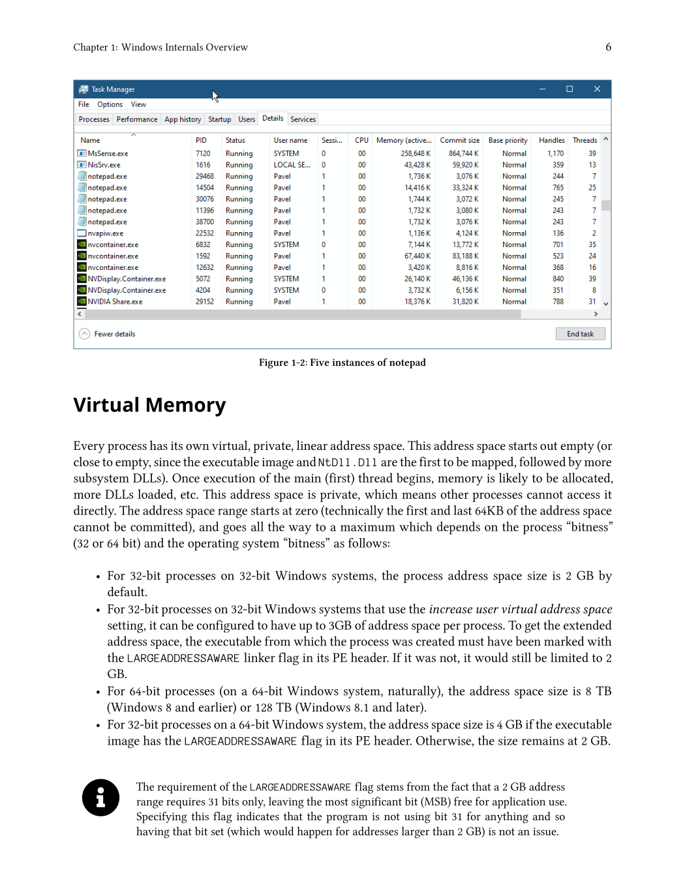
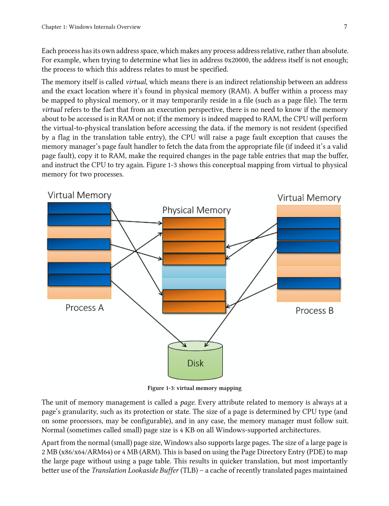
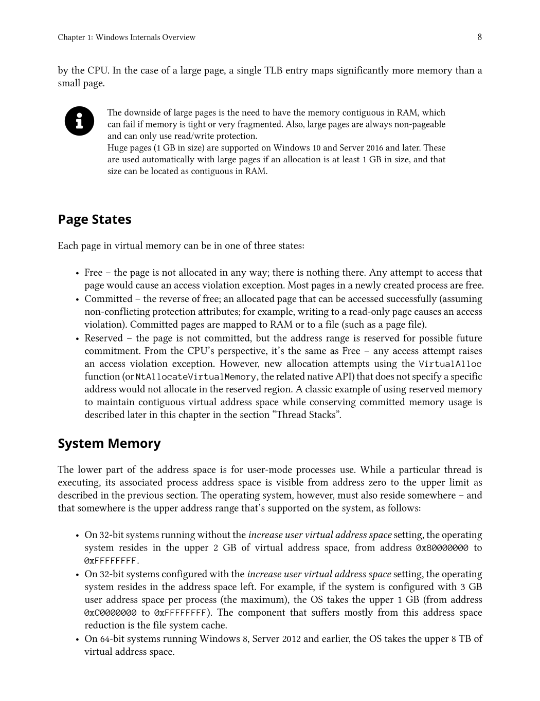

每个进程都拥有自己独立的私有线性地址空间。该地址空间初始为空（或接近空，因为可执行映像和 NtDll.Dll 最先被映射，随后是更多子系统 DLL）。一旦主（第一个）线程开始执行，就可能会分配内存、加载更多 DLL 等。这个地址空间是私有的，意味着其他进程无法直接访问它。地址空间的范围从零开始（从技术上讲，地址空间的首尾 64KB 区域无法提交），一直延伸到最大地址，具体取决于进程的“位数”（32 位或 64 位）以及操作系统的“位数”，规则如下：

    • 对于 32 位 Windows 系统上的 32 位进程，默认进程地址空间大小为 2 GB。
    • 对于启用了“增加用户虚拟地址空间”设置的 32 位 Windows 系统上的 32 位进程，每个进程的地址空间最多可配置为 3 GB。要获得扩展地址空间，创建该进程的可执行文件必须在其 PE 头中设置 LARGEADDRESSAWARE 链接器标志。如果未设置，地址空间仍将限制为 2 GB。
    • 对于 64 位进程（自然是在 64 位 Win

dows 系统上），地址空间大小为 8 TB（Windows 8 及更早版本）或 128 TB（Windows 8.1 及更高版本）。
    • 对于 64 位 Windows 系统上的 32 位进程，如果可执行映像的 PE 头中设置了 LARGEADDRESSAWARE 标志，地址空间大小为 4 GB。否则，大小仍为 2 GB。
             需要 LARGEADDRESSAWARE 标志的原因在于，2 GB 地址范围只需要 31 位，最高位（MSB）可留给应用程序自由使用。指定此标志表示程序没有将第 31 位用于任何用途，因此该位被置位（对于大于 2 GB 的地址就会发生）不会引发问题。

每个进程都有自己的地址空间，这使得任何进程地址都是相对的，而非绝对的。例如，要确定地址 0x20000 处的内容，仅靠地址本身是不够的；还必须指明该地址属于哪个进程。

内存本身被称为虚拟的（virtual），这意味着地址与其在物理内存（RAM）中的确切位置之间存在间接关系。进程内的缓冲区可能映射到物理内存，也可能临时驻留在文件（如页面文件）中。“虚拟”一词是指，从执行的角度来看，无需知道即将访问的内存是否在 RAM 中；如果内存确实映射到 RAM，CPU 在访问数据之前会执行虚拟地址到物理地址的转换。如果内存不在物理内存中（由转换表条目中的标志指明），CPU 将引发页错误异常（page fault exception），进而调用内存管理器的页错误处理程序，从相应的文件中取出数据（如果是有效页错误），将其复制到 RAM，在映射该缓冲区的页表条目中进行必要的更改，并指示 CPU 重试。图 1-3 展示了两个进程虚拟内存到物理内存的

概念映射。

                                       图 1-3：虚拟内存映射

内存管理的单位称为页（page）。与内存相关的每个属性（如保护或状态）始终以页为粒度。页的大小由 CPU 类型决定（在某些处理器上可能是可配置的），无论如何，内存管理器都必须遵循此规则。在所有 Windows 支持的架构上，普通（有时称为小页）页大小为 4 KB。

除了普通（小）页大小，Windows 还支持大页（large page）。大页的大小为 2 MB（x86/x64/ARM64）或 4 MB（ARM）。这是通过使用页目录项（PDE）来映射大页，而无需使用页表。这样可以加快转换速度，但更重要的是能更好地利用转换旁视缓冲区（TLB）——CPU 维护的最近转换页面的缓存。对于大页，单个 TLB 条目可映射比小页多得多的内存。

             大页的缺点是需要内存在 RAM 中保持连续，如果内存紧张或碎片化严重，可能无法满足。此外，大页始终是不可分页的，并且只能使用读/写保护。

             Windows 10 和 Server 2016 及更高版本支持巨页（huge page，大小为 1 GB）。如果分配的大小至少为 1 GB，且该大小能在 RAM 中连续找到，则会自动与巨页结合使用。

### 页状态

虚拟内存中的每个页可以处于以下三种状态之一：

    • 空闲（Free） – 页未以任何方式分配；没有任何内容。任何访问该页的尝试都会导致访问违规异常。新创建的进程中大多数页处于空闲状态。
    • 提交（Committed） – 与空闲相反；已分配的页可以成功访问（假设保护属性不冲突；例如，写入只读页会导致访问违规）。提交的页映射到 RAM 或文件（如页面文件）。
    • 保留（Reserved） – 页尚未提交，但地址范围已保留，以备将来提交。从 CPU 的角度看，它与空闲状态相同——任何访

问尝试都会引发访问违规异常。但是，使用 VirtualAlloc 函数（或相关的原生 API NtAllocateVirtualMemory）进行新分配时，如果未指定具体地址，则不会在保留区域内分配。本章后面“线程栈”一节将介绍一个典型的例子，即使用保留内存来保持连续的虚拟地址空间，同时节省已提交内存的使用。

### 系统内存

地址空间的低端部分供用户模式进程使用。当某个线程执行时，其关联进程的地址空间从地址零到上一节所述的上限都是可见的。然而，操作系统本身也必须驻留在某处——那就是系统支持的高端地址范围，具体如下：

    • 在未启用“增加用户虚拟地址空间”设置的 32 位系统上，操作系统驻留在虚拟地址空间的高 2 GB，即地址 0x80000000 到 0xFFFFFFFF。
    • 在配置了“增加用户虚拟地址空间”设置的 32 位系统上，操作系统驻留在剩余的地址空间中。例如，如果系统配置为每个进程 3 GB 用户地址空间（最大值），则操作系统占据高 1 GB（地址 0xC0000000 到 0xFFFFFFFF）。受这种地址空间缩减影响最大的组件是文件系统缓存。
    • 在运行 Windows 8、Server 2012 及更早版本的 64 位系统上，操作系统占据虚拟地址空间的高 8 TB。
    • 在运行 Windows 8.1、Server 2012 R2 及更高版本的 64 位系统上，操作系统占据虚拟地址空间的高 128 TB。

图 1-4 显示了两种“极端”情况下的虚拟内存布局：32 位系统上的 32 位进程（左）和 64 位系统上的 64 位进程（右）。

                                       图 1-4：虚拟内存布局

系统空间不是相对于进程的——毕竟，是同一个系统、同一个内核、同一组驱动程序为系统上的所有进程提供服务（例外情况是某些基于会话的系统内存，但与本讨论无关）。因此，系统空间中的任何地址都是绝对的，而非相对的，因为它在每个进程上下文中看起来都一样。当然，从用户模式实际访问系统空间会导致访问违规异常。

系统空间是内核本身、硬件抽象层（HAL）以及内核驱动程序加载后驻留的地方。因此，内核驱动程序自动受到保护，无法被用户模式直接访问。这也意味着它们可能产生系统范围的影响。例如，如果某个内核驱动程序泄漏了内存，即使驱动程序卸载后，该内存也不会被释放。而用户模式进程在其生命周期结束后绝不会泄漏任何资源。内核负责关闭和释放已终止进程的所有私有资源（所有句柄被关闭，所有私有内存被释放）。

## 线程
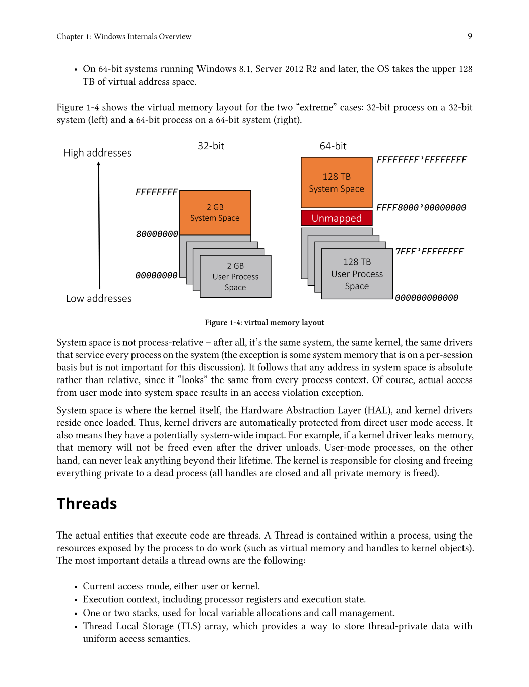
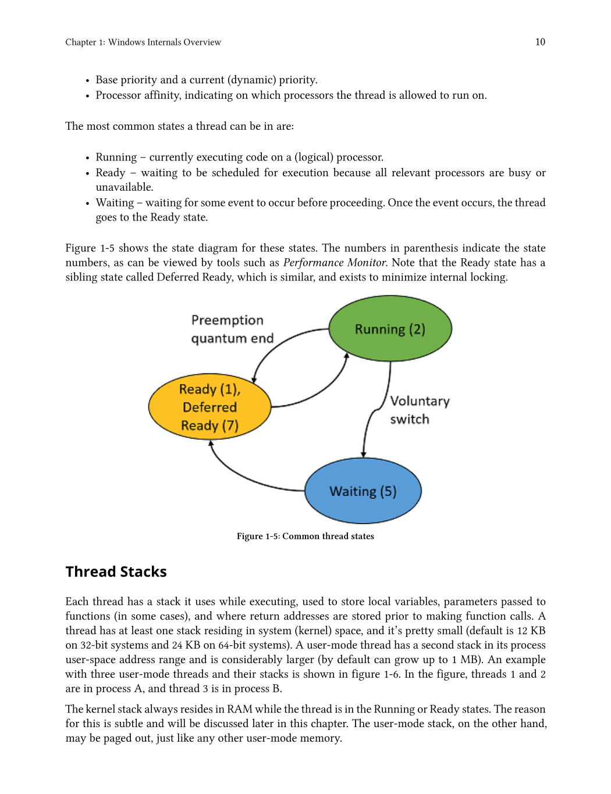
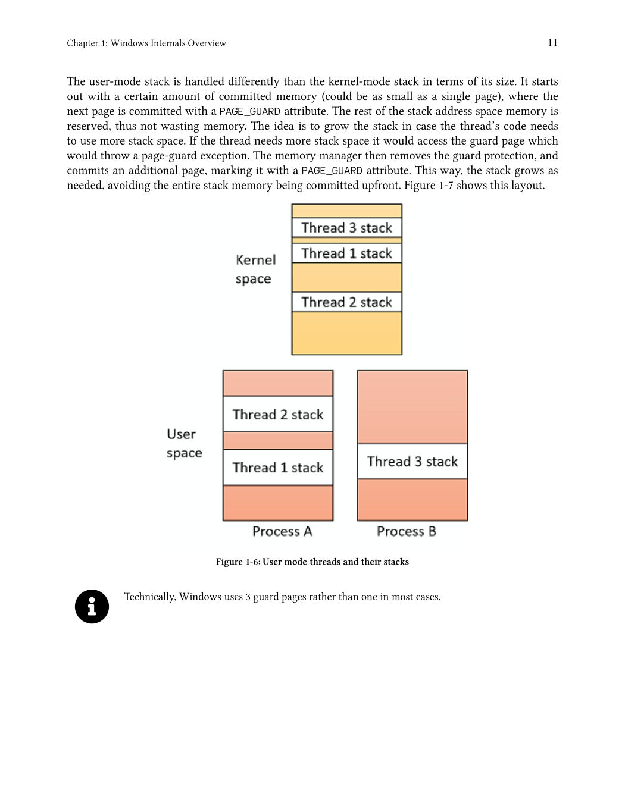

执行代码的实际实体是线程。线程包含在进程内部，利用进程提供的资源（如虚拟内存和内核对象的句柄）来工作。线程拥有的最重要的详细信息包括：

    • 当前访问模式，分为用户模式或内核模式。
    • 执行上下文，包括处理器寄存器和执行状态。
    • 一到两个栈，用于局部变量分配和调用管理。
    • 线程本地存储（TLS）数组，提供一种统一访问语义来存储线程私有数据的方式。
    • 基本优先级和当前（动态）优先级。
    • 处理器亲和性，指明线程允许在哪些处理器上运行。

线程最常见的状态有：

    • 运行（Running） – 当前在某个（逻辑）处理器上执行代码。
    • 就绪（Ready） – 等待被调度执行，因为所有相关处理器都忙或不可用。
    • 等待（Waiting） – 等待某个事件发生才能继续。一旦事件发生，线程转入就绪状态。

图 1-5 展示了这些状态的状态图。括号中的数字表示状态编号，可通过性能监视器等工具查看。注意，就绪状态有一个兄弟状态叫延迟就绪（Deferred Ready），类似但存在是为了尽量减少内部锁定。

                                       图 1-5：常见线程状态

### 线程栈

每个线程在执行时都拥有一个栈，用于存储局部变量、传递给函数的参数（某些情况下）以及进行函数调用前保存的返回地址。线程至少有一个驻留在系统（内核）空间中的栈，它相当小（32 位系统上默认为 12 KB，64 位系统上为 24 KB）。用户模式线程在其进程的用户空间地址范围内还有第二个栈，要大得多（默认可以增长到 1 MB）。图 1-6 展示了三个用户

模式线程及其栈的例子。图中，线程 1 和 2 在进程 A 中，线程 3 在进程 B 中。

内核栈在线程处于运行或就绪状态时始终驻留在 RAM 中。其原因很微妙，将在本章后面讨论。另一方面，用户模式栈可能像其他任何用户模式内存一样被分页出去。

用户模式栈在大小处理上与内核模式栈不同。它初始时包含一定量的提交内存（可能小至一个页面），下一个页面以 PAGE_GUARD 属性提交。栈地址空间的其余内存被保留，因此不浪费内存。其设计理念是在线程的代码需要使用更多栈空间时再增长栈。如果线程需要更多栈空间，它会访问保护页，从而引发页保护异常（page-guard exception）。然后内存管理器移除保护属性，并再提交一个页面，将其标记为 PAGE_GUARD 属性。这样，栈会根据需要增长，避免了预先提交整个栈内存。图 1-7 显示了这种布局。

                                 图 1-6：用户模式线程及其栈

             从技术上讲，Windows 在大多数情况下使用 3 个保护页而非一个。

                                       图 1-7：用户空间中线程的栈

线程用户模式栈的大小由以下因素决定：

    • 可执行映像在其可移植可执行文件（PE）头中有栈提交大小和保留大小值。如果线程未指定替代值，这些将作为默认值。这些值始终用于进程中的第一个线程。
    • 当使用 CreateThread（或类似函数）创建线程时，调用者可根据提供给函数的标志指定所需的栈大小，可以是预提交大小或保留大小（但不能同时指定两者）；指定零则使用 

PE 头中设置的默认值。

             有趣的是，CreateThread 和 CreateRemoteThread(Ex) 函数只允许为栈大小指定一个值，可以是提交大小或保留大小，但不能同时指定两者。而原生（未文档化的）函数 NtCreateThreadEx 则允许指定这两个值。

## 系统服务（又称系统调用）
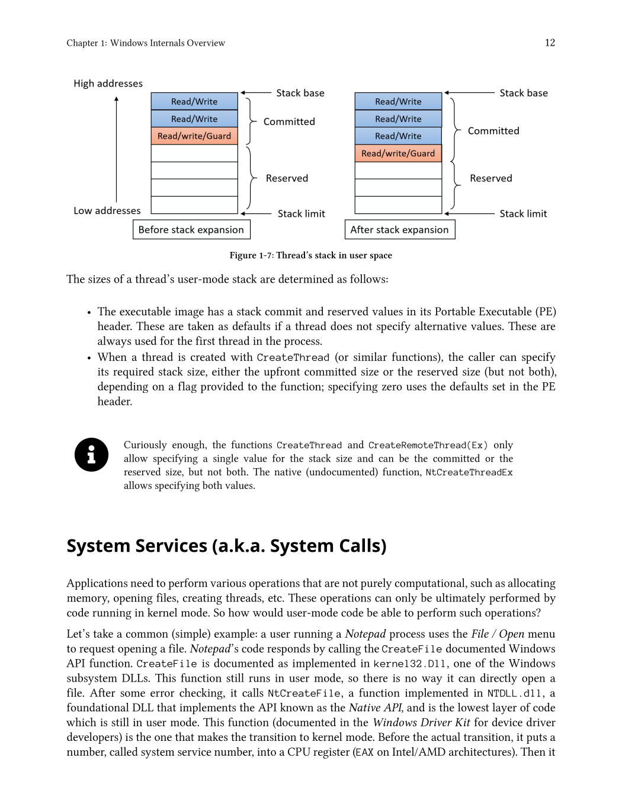
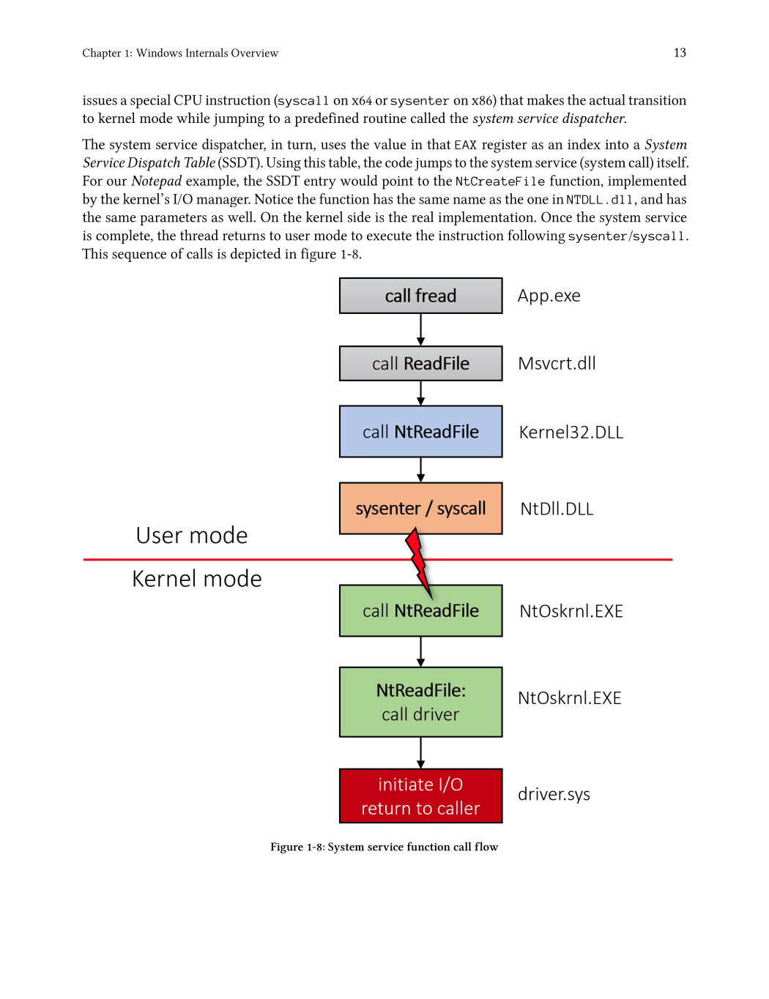
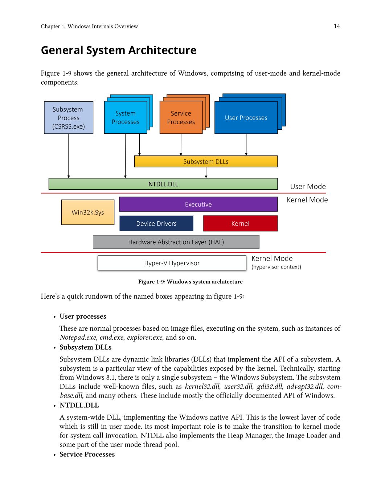

应用程序需要执行各种并非纯粹计算的操作，例如分配内存、打开文件、创建线程等。这些操作最终只能由在内核模式下运行的代码执行。那么用户模式代码如何才能执行此类操作呢？

让我们看一个常见（简单）的例

```text
子：运行记事本进程的用户使用“文件”/“打开”菜单请求打开文件。记事本的代码响应调用已文档化的 Windows API 函数 CreateFile。CreateFile 的文档说明由 kernel32.Dll 实现，这是 Windows 子系统 DLL 之一。此函数仍在用户模式下运行，因此无法直接打开文件。经过一些错误检查后，它调用 NtCreateFile，这个函数在 NTDLL.dll 中实现，NTDLL.dll 是一个基础 DLL，实现了所谓的原生 API（Native API），它是处于用户模式的最底层代码。此函数（在 Windows 驱动程序工具包中为设备驱动程序开发人员提供文档）负责执行到内核模式的转换。在实际转换之前，它将一个称为系统服务号的数字放入 CPU 寄存器（Intel/AMD 架构上是 EAX）。然后，它发出一个特殊的 CPU 指令（x64 上是 syscall，x86 上是 sysenter），该指令在跳转到一个名为系统服务分发器的预定义例程的同时，实际完成到内核模式的转换。

系统服务分发器则使用 EAX 寄存器中的值作为索引，查找系统服务分发表（SSDT）。通过该表，代码跳转到系统服务（系统调用）本身。对于我们的记事本例子，SSDT 条目将指向内核 I/O 管理器实现的 NtCreateFile 函数。注意，该函数与 NTDLL.dll 中的函数同名，并且参数也相同。内核一侧是真正的实现。系统服务完成后，线程返回用户模式，执行 sysenter/syscall 之后的指令。图 1-8 描绘了这一调用序列。
```
图 1-8：系统服务函数调用流程

## 常规系统架构
图 1-9 展示了 Windows 的总体架构，包含用户模式和内核模式组件。

                                       图 1-9：Windows 系统架构

以下是图 1-9 中出现的命名框的简要说明：

    • 用户进程
      这些是系统

中基于映像文件执行的常规进程，例如 notepad.exe、cmd.exe、explorer.exe 等的实例。
    • 子系统 DLL

      子系统 DLL 是实现子系统 API 的动态链接库（DLL）。子系统是内核提供的功能的特定视图。从技术上讲，从 Windows 8.1 开始，仅存在一个子系统——Windows 子系统。子系统 DLL 包括众所周知的文件，如 kernel32.dll、user32.dll、gdi32.dll、advapi32.dll、co

mbase.dll 等等。这些主要包括 Windows 的正式文档化 API。
    • NTDLL.DLL
      一个系统范围的 DLL，实现 Windows 原生 API。这是用户模式中的最底层代码。其最重要的作用是为系统调用执行到内核模式的转换。NTDLL 还实现了堆管理器、映像加载器以及用户模式线程池的部分功能。
    • 服务进程
      服务进程是正常的 Windows 进程，它们与服务控制管理器（SCM，在 services.exe 中实现）通信，并允许对其生命周期进行一定控制。SCM 可以启动、停止、暂停、恢复服务并向其发送其他消息。服务通常在 Windows 特殊账户之一下执行——Local System、Network Service 或 Local Service。
    • 执行体

      执行体是 NtOskrnl.exe（“内核”）的上层。它承载了内核模式中的大部分代码。主要包括各种“管理器”：对象管理器、内存管理器、I/O 管理器、即插即用管理器、电源管理器、配置管理器等。它比下层的 Kernel 层要大得多。
    • 内核
      内核层实现内核模式操作系统代码中最基本、最时间敏感的部分。这包括线程调度、中断和异常分发，以及各种内核原语（如互斥体和信号量）的实现。部分内核代码使用 CPU 特定的机器语言编写，以提高效率并直接访问 CPU 特定的细节。

    • 设备驱动程序
      设备驱动程序是可加载的内核模块。它们的代码在内核模式下执行，因此拥有内核的全部能力。本书专门介绍如何编写特定类型的内核驱动程序。
    • Win32k.sys
      这是 Windows 子系统的内核模式组件。本质上，它是一个内核模块（驱动程序），负责处理 Windows 的用户界面部分以及经典的图形设备接口（GDI）API。这意味着所有窗口操作（CreateWindowEx、GetMessage、PostMessage 等）都由该组件处理。系统的其余部分几乎不了解 UI。
    • 硬件抽象层（HAL）
      HAL 是位于 CPU 最接近的硬件之上的一个软件抽象层。它允许设备驱动程序使用不需要详细了解中断控制器或 DMA 控制器等细节的 API。当然，该层主要用于处理硬件设备的设备驱动程序。
    • 系统进程
      系统进程是一个统称，用来描述那些通常“只是存在那里”、做自己事情的进程，通常不直接与这些进程通信。但它们仍然很重要，有些甚至对系统的正常运行至关重要。终止其中一些进程是致命的，会导致系统崩溃。某些系统进程是原生进程，意味着它们只使用原生 API（NTDLL 实现的 API）。示例系统进程包括 Smss.exe、Lsass.exe、Winlogon.exe 和 Services.exe。
    • 子系统进程
       Windows 子系统进程（运行映像 Csrss.exe）可视为内核的助手，用于管理在 Windows 子系统下运行的进程。它是一个关键进程，这意味着如果被终止，系统会崩溃。每个会话有一个 Csrss.exe 实例，因此在标准系统上会存在两个实例——一个用于会话 0，一个用于登录用户会话（通常是会话 1）。尽管 Csrss.exe 是 Windows 子系统的“管理者”（目前是唯一剩下的），其重要性远不止于此角色。
    • Hyper-V Hypervisor
      在支持基于虚拟化的安全（VBS）的 Windows 10 和 Server 2016（及更高版本）系统上，存在 Hyper-V 虚拟机监控程序。VBS 提供了额外的安全层，使普通操作系统成为一个由 Hyper-V 控制的虚拟机。定义了两种不同的虚拟信任级别（VTL），其中 VTL 0 包含我们熟知的普通用户模式/内核模式，而 VTL 1 包含安全内核和隔离用户模式（IUM）。VBS 超出了本书的范围。有关更多信息，请查阅《Windows 内部原理》一书和/或 Microsoft 文档。
             Windows 10 版本 1607 引入了适用于 Linux 的 Windows 子系统（WSL）。尽管这看起来像是又一个子系统，类似于 Windows 过去支持的 POSIX 和 OS/2 子系统，但实际上完全不同。旧的子系统能够执行 POSIX 和 OS/2 应用程序，前提是这些应用程序使用 Windows 编译器编译，以使用 PE 格式和 Windows 系统调用。而 WSL 则没有此要求。现有的 Linux 可执行文件（以 ELF 格式存储）可以在 Windows 上直接运行，无需重新编译。
             为了实现这一点，创建了一种新的进程类型——Pico 进程以及 Pico 提供程序。简而言之，Pico 进程是一个空的地址空间（最小进程），用于 WSL 进程，其中每个系统调用（Linux 系统调用）都必须由 Pico 提供程序（一个设备驱动程序）拦截并转换为等效的 Windows 系统调用。Windows 机器上安装有一个真正的 Linux（用户模式部分）。
             以上描述适用于 WSL 版本 1。从 Windows 10 版本 2004 开始，Windows 支持新版本的 WSL，称为 WSL 2。WSL 2 不再基于 pico 进程。相反，它基于一种混合虚拟机技术，允许安装完整的 Linux 系统（包括 Linux 内核），但仍然能够查看和共享 Windows 机器的资源，例如文件系统。WSL 2 比 WSL 1 更快，并解决了一些在 WSL 1 中不能很好工作的边缘情况，这得益于真正的 Linux 内核处理 Linux 系统调用。

## 句柄与对象
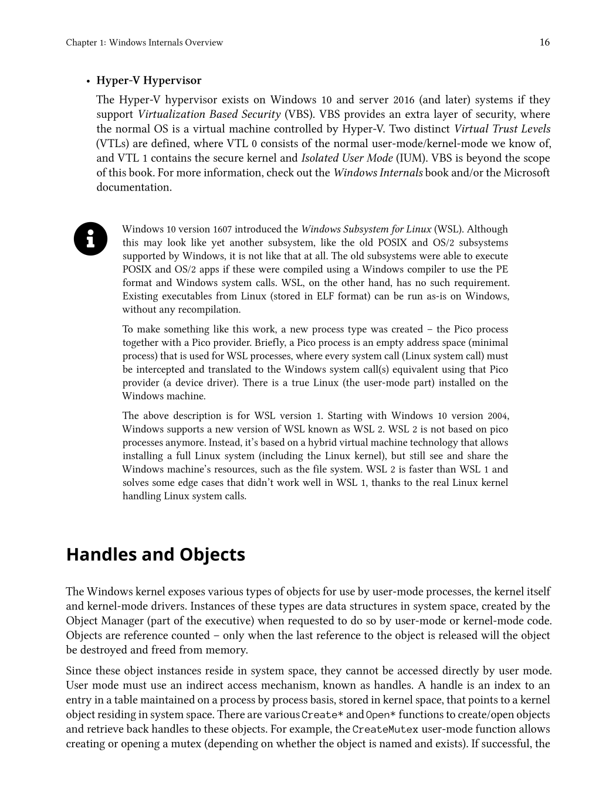
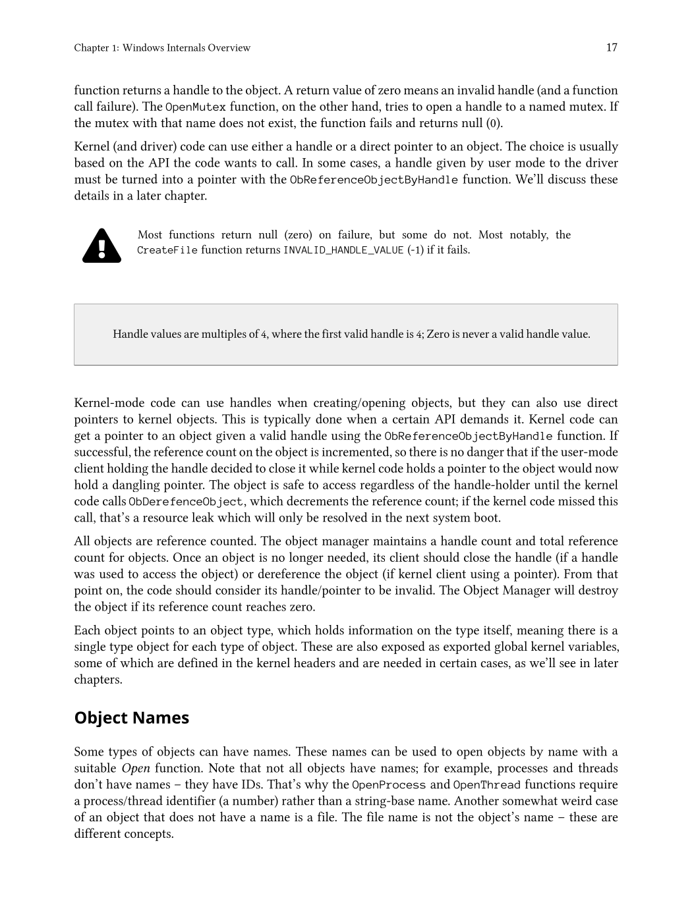
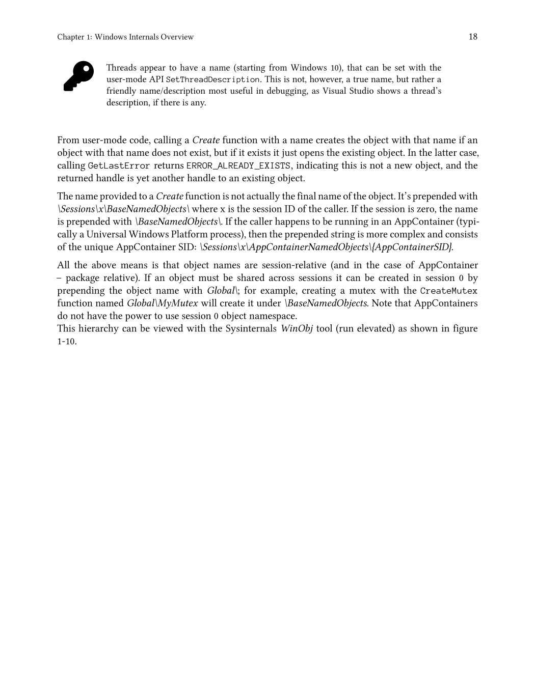
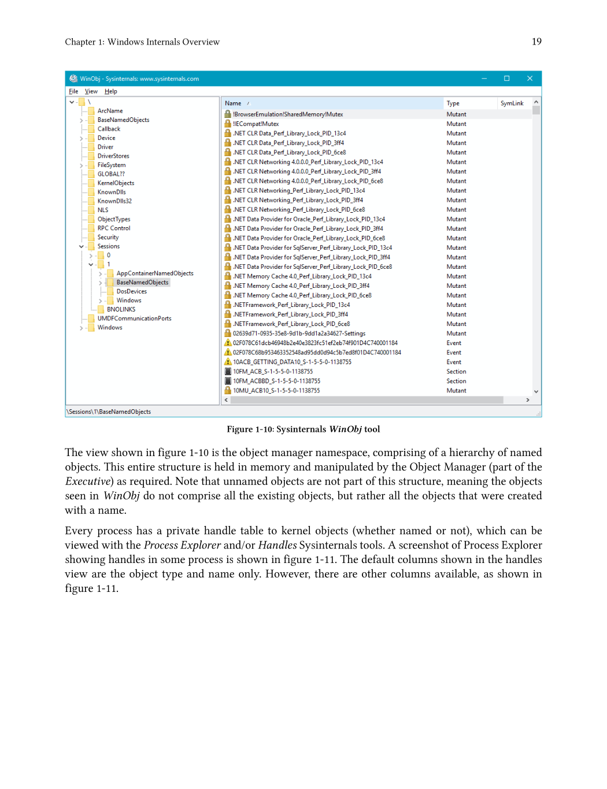
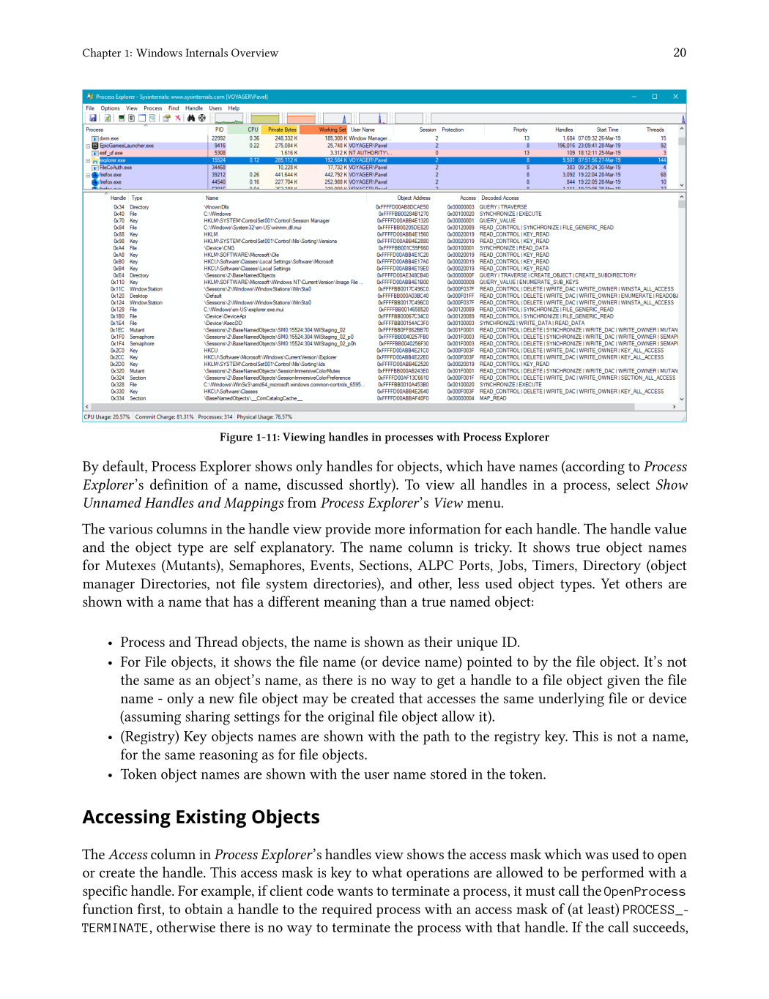
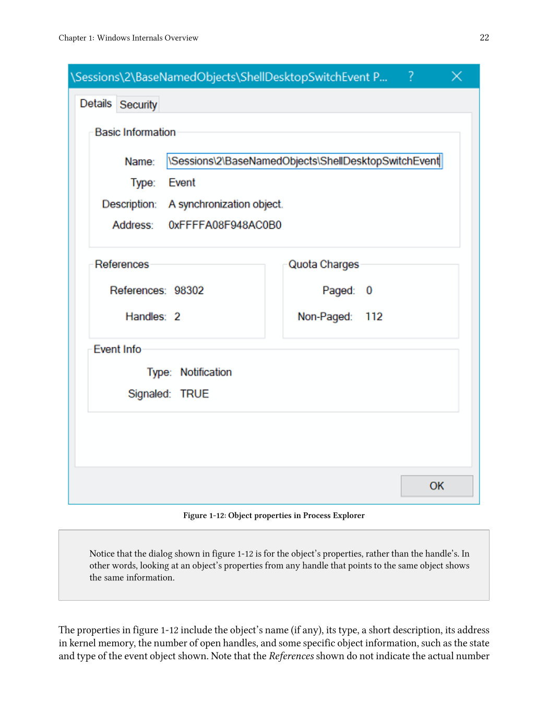

Windows 内核公开了各种类型的对象，供用户模式进程、内核本身以及内核模式驱动程序使用。这些类型的实例是系统空间中的数据结构，由对象管理器（执行体的一部分）在用户模式或内核模式代码请求时创建。对象是引用计数的——只有当对象的最后一个引用被释放时，对象才会被销毁并从内存中释放。

由于这些对象实例驻留在系统空间中，用户模式无法直接访问它们。用户模式必须使用一种称为句柄（handle）的间接访问机制。句柄是一个索引，指向一个按进程维护的表中的条目，该表存储在内核空间中，指向驻留在系统空间中的内核对象。有各种 Create* 和 Open* 函数用于创建/打开对象并返回这些对象的句柄。例如，CreateMutex 用户模式函数允许创建或打开一个互斥体（取决于对象是否命名且存在）。如果成功，该函数返回对象的句柄。返回值为零表示句柄无效（且函数调用失败）。另一方面，OpenMutex 函数尝试打开一个命名互斥体的句柄。如果具有该名称的互斥体不存在，函数失败并返回空（0）。

内核（和驱动程序）代码可以使用句柄或对象的直接指针。选择通常取决于代码要调用的 API。在某些情况下，用户模式提供给驱动程序的句柄必须通过 ObReferenceObjectByHandle 函数转换为指针。我们将在后续章节中讨论这些细节。

             大多数函数在失败时返回空（零），但有些并非如此。最值得注意的是，CreateFile 函数在失败时返回 INVALID_HANDLE_VALUE（-1）。

        句柄值是 4 的倍数，其中第一个有效句柄是 4；零永远不会是有效句柄值。

内核模式代码在创建/打开对象时可以使用句柄，但也可以使用内核对象的直接指针。这通常是在特定 API 要求时进行的。内核代码可以使用 ObReferenceObjectByHandle 函数，通过有效句柄获取对象的指针。如果成功，对象的引用计数会增加，因此，即使持有句柄的用户模式客户端在内核代码持有对象指针时决定关闭句柄，也不会导致悬空指针。在持有句柄者可能关闭句柄的情况下，对象仍然可以安全访问，直到内核代码调用 ObDerefenceObject，该函数递减引用计数；如果内核代码漏掉了这个调用，就会造成资源泄漏，只有在下一次系统启动时才能解决。

所有对象都是引用计数的。对象管理器维护对象的句柄计数和总引用计数。一旦对象不再需要，其客户端应关闭句柄（如果使用句柄访问对象）或解引用对象（如果是内核客户端使用指针）。从那时起，代码应认为其句柄/指针无效。如果对象的引用计数达到零，对象管理器将销毁该对象。

每个对象都指向一个对象类型，该类型保存有关类型本身的信息，即每种对象类型都有一个单一的类型对象。这些也作为导出的全局内核变量公开，其中一些在内核头文件中定义，并在某些情况下需要用到，我们将在后续章节中看到。

### 对象名称
某些类型的对象可以有名称。这些名称可用于通过合适的 Open 函数按名称打开对象。注意，并非所有对象都有名称；例如，进程和线程没有名称——它们有 ID。这就是为什么 OpenProcess 和 OpenThread 函数需要进程/线程标识符（一个数字）而不是基于字符串的名称。另一个有点奇怪的例子是文件，文件没有名称。文件名不是对象的名称——这些是不同的概念。

             线程似乎有名称（从 Windows 10 开始），可以使用用户模式 API SetThreadDescription 设置。但这并不是真正的名称，而是一个友好名称/描述，在调试中非常有用，因为 Visual Studio 会显示线程的描述（如果有的话）。

从用户模式代码中，使用名称调用 Create 函数时，如果不存在具有该名称的对象，则创建具有该名称的对象；但如果已存在，则只打开现有对象。在后一种情况下，调用 GetLastError 返回 ERROR_ALREADY_EXISTS，表示这不是新对象，返回的句柄是指向现有对象的另一个句柄。

提供给 Create 函数的名称实际上并不是对象的最终名称。它会被附加前缀 \Sessions\x\BaseNamedObjects\，其中 x 是调用者的会话 ID。如果会话为零，则名称前缀为 \BaseNamedObjects\。如果调用者碰巧在 AppContainer 中运行（通常是通用 Windows 平台进程），那么添加的前缀字符串更复杂，包含唯一的 AppContainer SID：\Sessions\x\AppContainerNamedObjects\{AppContainerSID}。

上述所有含义是，对象名称是相对于会话的（在 AppContainer 的情况下，是相对于包的）。如果对象必须跨会话共享，可以在对象名称前加上 Global\ 前缀，在会话 0 中创建它；例如，使用 CreateMutex 函数创建名为 Global\MyMutex 的互斥体，将在 \BaseNamedObjects 下创建它。注意，AppContainer 无权使用会话 0 的对象命名空间。

可以使用 Sysinternals 的 WinObj 工具（以管理员权限运行）查看此层次结构，如图 1-10 所示。

                                       图 1-10：Sysinternals WinObj 工具

图 1-10 所示的视图是对象管理器命名空间，它由命名对象的层次结构组成。整个结构保存在内存中，并由对象管理器（执行体的一部分）根据需要维护。注意，未命名对象不在此结构中，这意味着 WinObj 中看到的对象并不包括所有现有对象，而只包括所有使用名称创建的对象。

每个进程都有一个私有的内核对象句柄表（无论是否命名），可以使用 Process Explorer 和/或 Handles 这两个 Sysinternals 工具查看。图 1-11 是 Process Explorer 显示某个进程中句柄的截图。句柄视图中显示的默认列仅是对象类型和名称。然而，还有其他可用列，如图 1-11 所示。

                         图 1-11：使用 Process Explorer 查看进程中的句柄

默认情况下，Process Explorer 只显示具有名称的对象的句柄（根据 Process Explorer 对名称的定义，稍后讨论）。要查看进程中的所有句柄，请从 Process Explorer 的“视图”菜单中选择“显示未命名句柄和映射”。

句柄视图中的各列提供了每个句柄的更多信息。句柄值和对象类型不言自明。名称列比较微妙。对于互斥体（Mutants）、信号量、事件、节、ALPC 端口、作业、定时器、目录（

对象管理器目录，而非文件系统目录）以及其他不常用的对象类型，它显示真正的对象名称。而对于其他类型，显示的名称含义不同于真正的命名对象：

    • 对于进程和线程对象，名称显示为其唯一 ID。
    • 对于文件对象，显示文件对象指向的文件名（或设备名）。这与对象的名称不同，因为无法仅凭文件名获取文件对象的句柄——只能创建一个新的文件对象来访问同一个底层文件或设备（前提是原始文件对象的共享设置允许）。
    • （注册表）键对象名称显示为注册表键的路径。这不是名称，原因同文件对象。
    • 令牌对象名称显示为令牌中存储的用户名。

### 访问现有对象
Process Explorer 句柄视图中的 Access 列显示用于打开或创建句柄的访问掩码。这个访问掩码对于确定使用特定句柄允许执行哪些操作至关重要。例如，如果客户端代码想要终止一个进程，它必须首先调用 OpenProcess 函数，至少以 PROCESS_TERMINATE 访问掩码获取所需进程的句柄，否则无法使用该句柄终止进程。如果调用成功，那么对 TerminateProcess 的调用必定成功。

这是一个根据进程 ID 终止进程的用户模式示例：

bool KillProcess(DWORD pid) {
```c
//
    // 打开一个权限足够的进程句柄
    //
    HANDLE hProcess = OpenProcess(PROCESS_TERMINATE, FALSE, pid);
    if (!hProcess)
        return false;
     //
     // 现在用某个任意退出代码终止它
     //

     BOOL success = TerminateProcess(hProc

ess, 1);
     //
     // 关闭句柄
     //
     CloseHandle(hProcess);
     return success != FALSE;
}
```
Decoded Access 列提供了访问掩码的文本描述（针对某些对象类型），使得更容易识别特定句柄允许的确切访问权限。

双击句柄条目（或右键单击并选择属性）会显示对象的一些属性。图 1-12 展示了一个事件对象属性示例的截图。

                                图 1-12：Process Explorer 中的对象属性

        注意，图 1-12 所示的对话框是显示对象的属性，而非句柄的属性。换句话说，通过任何指向同一个对象的句柄查看对象属性，都会显示相同的信息。

图 1-12 中的属性包括对象的名称（如果有）、其类型、简短描述、在内核内存中的地址、打开句柄的数量，以及一些特定对象信息，例如所示事件对象的状态和类型。注意，显示的引用数并不表示对象的实际未完成引用数（在 Windows 8.1 之前是这样）。查看对象实际引用计数的正确方法是使用内核调试器的 `!trueref` 命令，如下所示：

```text
lkd> !object 0xFFFFA08F948AC0B0

: ffffa08f948ac0b0 Type: (ffffa08f684df140) Event

    ObjectHeader: ffffa08f948ac080 (new version)
    HandleCount: 2 PointerCount: 65535
    Directory Object: ffff90839b63a700 Name: ShellDesktopSwitchEvent
lkd> !trueref ffffa08f948ac0b0

: HandleCount: 2 PointerCount: 65535 RealPointerCount: 3
```
我们将在后续章节中更深入地探讨对象的属性和内核调试器。

在下一章中，我们将开始编写一个非常简单的驱动程序，以展示和使用本书后面将需要的许多工具。

# Chapter 2: Getting Started with Kernel Development

# 第2章：内核开发入门

本章涵盖进行内核驱动程序开发所需的基础知识。在本章中，你将安装必要的工具，并编写一个可加载和卸载的最基本驱动程序。

本章内容：
    • 安装工具
    • 创建驱动程序项目
    • DriverEntry 与 Unload 例程
    • 部署驱动程序
    • 简单跟踪

## 安装工具

在过去（2012年之前），开发和构建驱动程序的流程包括使用设备驱动程序包（DDK）中的专用构建工具，而没有开发人员在用户模式应用程序开发中习惯使用的集成开发体验。虽然存在一些变通方法，但没有一种方法是完美的，也没有得到微软的官方支持。

幸运的是，从 Visual Studio 2012 和 Windows 驱动程序包 8 开始，微软正式支持使用 Visual Studio（借助 msbuild）构建驱动程序，无需使用单独的编译器和构建工具。

要开始驱动程序开发，必须在开发计算机上按以下顺序安装以下工具：
    • Visual Studio 2019（包含最新更新）。确保在安装过程中选择了 C++ 工作负载。请注意，任何版本均可，包括免费的社区版。
    • Windows 11 SDK（通常推荐使用最新版本）。确保在安装过程中至少选中了“Debugging Tools for Windows”项。
    • Windows 11 驱动程序包（WDK）—— 它支持构建适用于 Windows 7 及更高版本 Windows 的驱动程序。确保安装向导在安装结束时为 Visual Studio 安装了项目模板。
    • Sysinternals 工具在任何“内部原理”工作中都非常宝贵，可以从 http://www.sysinternals.com 免费下载。点击网页左侧的“Sysinternals Suite”，然后下载 Sysinternals Suite zip 文件。解压到任意文件夹，工具即可使用。
             SDK 和 WDK 版本必须匹配。请遵循 WDK 下载页面中的指南，加载与 WDK 对应的 SDK。
             快速确认 WDK 模板是否正确安装的方法是打开 Visual Studio，选择“新建项目”，然后查找“Empty WDM Driver”等驱动程序项目。

## 创建驱动程序项目
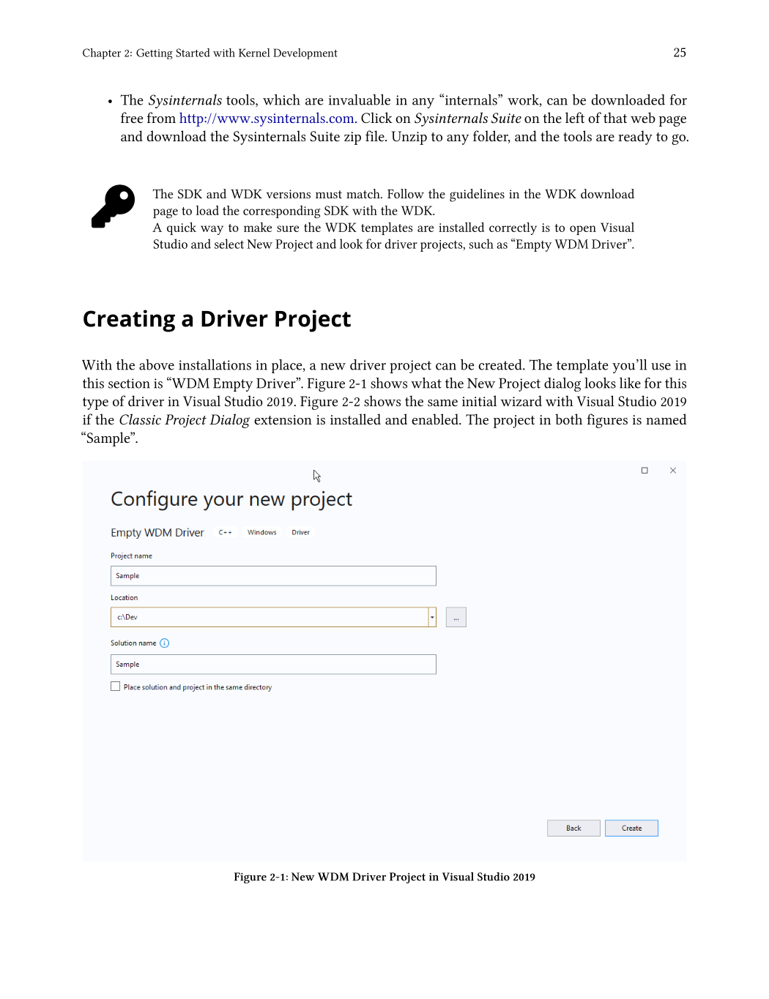
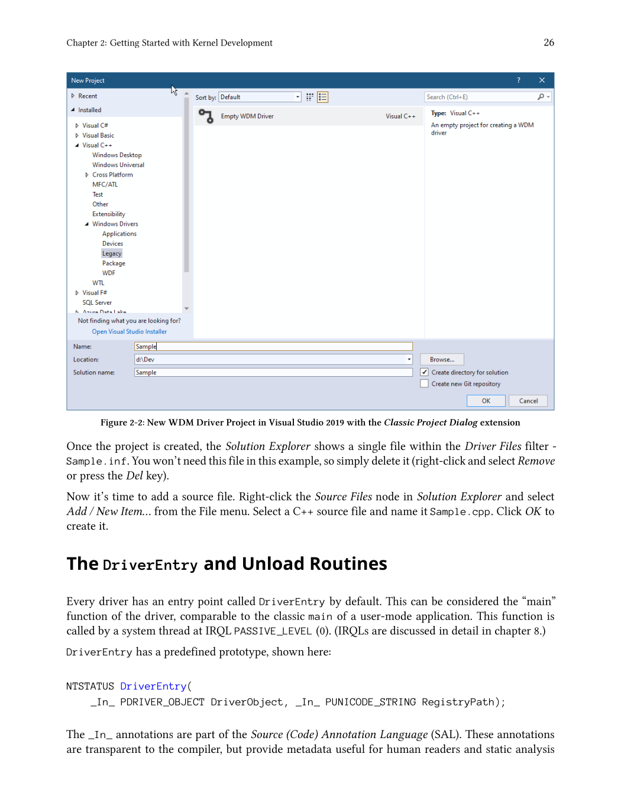

完成上述安装后，即可创建新的驱动程序项目。本节将使用的模板是“WDM Empty Driver”。图2-1显示了在 Visual Studio 2019 中，此类型驱动程序的“新建项目”对话框外观。图2-2显示了如果安装并启用了“经典项目对话框”扩展，使用 Visual Studio 2019 时的同一初始向导。两图中的项目均命名为“Sample”。

                            图2-1：Visual Studio 2019 中的新建 WDM 驱动程序项目
        图2-2：安装了经典项目对话框扩展的 Visual Studio 2019 中的新建 WDM 驱动程序项目

创建项目后，解决方案资源管理器会在“Driver Files”筛选器下显示一个文件—— Sample.inf。在本示例中不需要此文件，因此只需将其删除（右键单击并选择“移除”或按 Del 键）。

现在需要添加源文件。在解决方案资源管理器中右键单击“源文件”节点，然后从“文件”菜单中选择“添加 / 新建项…”。选择一个 C++ 源文件并将其命名为 Sample.cpp。点击“确定”创建。

## DriverEntry 与 Unload 例程

每个驱动程序都有一个默认名为 `DriverEntry` 的入口点。这可以视为驱动程序的“main”函数，类似于用户模式应用程序的传统 main 函数。该函数由系统线程在 IRQL PASSIVE_LEVEL (0) 级别调用。（IRQL 的详细信息将在第8章中讨论。）

`DriverEntry` 具有预定义的原型，如下所示：
```c
NTSTATUS DriverEntry(
    _In_ PDRIVER_OBJECT DriverO

bject, _In_ PUNICODE_STRING RegistryPath);
```
`_In_` 注解是源代码注解语言（SAL, Source Annotation Language）的一部分。这些注解对编译器是透明的，但为人类阅读者和静态分析工具提供了有用的元数据。为了便于阅读，我可能会在代码示例中移除这些注解，但你应该尽可能使用 SAL 注解。

一个最小的 `DriverEntry` 例程可以只返回一个成功状态，如下所示：
```c
NTSTATUS DriverEntry(
    _In_ PDRIVER_OBJECT DriverObject, _In_ PUNICODE_STRING RegistryPath) {
    return STATUS_SUCCESS;
}
```
此代码尚不能通过编译。首先，你需要包含一个头文件，其中包含 `DriverEntry` 中出现的类型所需的定义。一种可能的方式是：
```c
#include <ntddk.h>
```
现在，代码编译的成功率更高了，但仍然会失败。一个原因是，编译器默认设置为将警告视为错误，而该函数未使用其给定的参数。不建议从编译器选项中移除“将警告视为错误”的设置，因为某些警告可能是潜在的错误。可以通过完全移除参数名（或将其注释掉）来解决这些警告，这对 C++ 文件是可行的。还有另一种更“经典”的解决方法，即使用 `UNREFERENCED_PARAMETER` 宏：

```c
NTSTATUS
DriverEntry(PDRIVER_OBJECT DriverObject, PUNICODE_STRING RegistryPath) {
    UNREFERENCED_PARAMETER(DriverObject);
    UNREFERENCED_PARAMETER(RegistryPath);
     return STATUS_SUCCESS;
}
```
实际上，这个宏只是原样写出参数的值来引用给定的参数，从而使编译器安静下来，让参数在技术上被“引用”。

现在构建项目，编译可以通过，但会导致链接器错误。`DriverEntry` 函数必须具有 C 链接属性，而在 C++ 编译中这不是默认设置。以下是仅包含 `DriverEntry` 函数的驱动程序成功构建的最终版本：
```c
extern "C" NTSTATUS
DriverEntry(PDRIVER_OBJECT DriverObject, PUNICODE_STRING RegistryPath) {
    UNREFERENCED_PARAMETER(DriverObject);
    UNREFERENCED_PARAMETER(RegistryPath);
     return STATUS_SUCCESS;
}
```
在某些时候，驱动程序可能会被卸载。届时，在 `DriverEntry` 函数中所做的任何操作都必须撤销。否则会造成资源泄漏，内核只有在下次重启时才会清理这些资源。驱动程序可以有一个 Unload 例程，该例程在驱动程序从内存中卸载之前自动调用。其指针必须通过驱动对象（driver object）的 `DriverUnload` 成员来设置：
```c
DriverObject->DriverUnload = SampleUnload;
```
Unload 例程接受驱动对象（与传递给 `DriverEntry` 的对象相同）并返回 `void`。由于我们的示例驱动程序在 `DriverEntry` 中没有进行任何资源分配，因此在 Unload 例程中无事可做，现在可以将其留空：
```c
void SampleUnload(_In_ PDRIVER_OBJECT DriverObject) {
    UNREFERENCED_PARAMETER(DriverObject);
}
```
此时，完整的驱动程序源代码如下：
```c
#include <ntddk.h>
void SampleUnload(_In_ PDRIVER_OBJECT DriverObject) {
    UNREFERENCED_PARAMETER(DriverObject);
}
extern "C" NTSTATUS
DriverEntry(PDRIVER_OBJECT DriverObject, PUNICODE_STRING RegistryPath) {
    UNREFERENCED_PARAMETER(RegistryPath);
     DriverObject->DriverUnload = SampleUnload;
     return STATUS_SUCCESS;
}
```
## 部署驱动程序
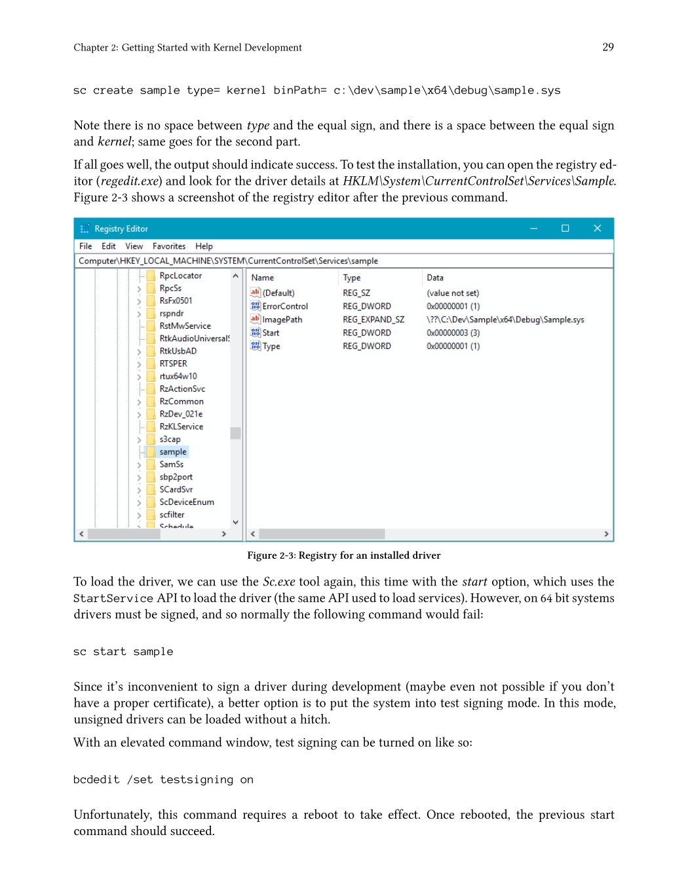
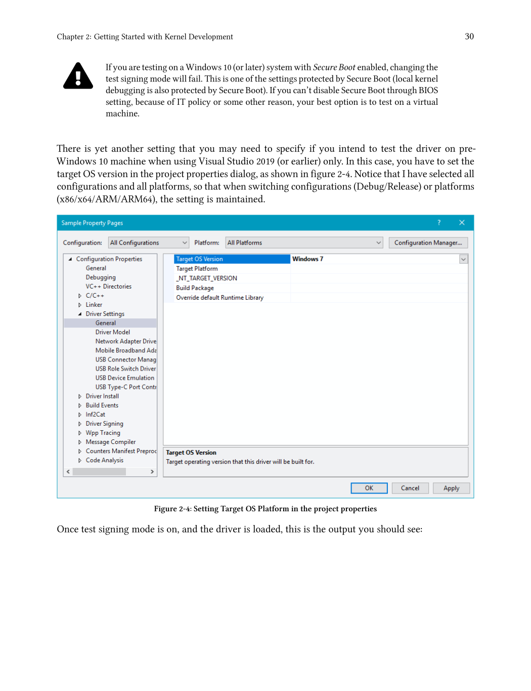
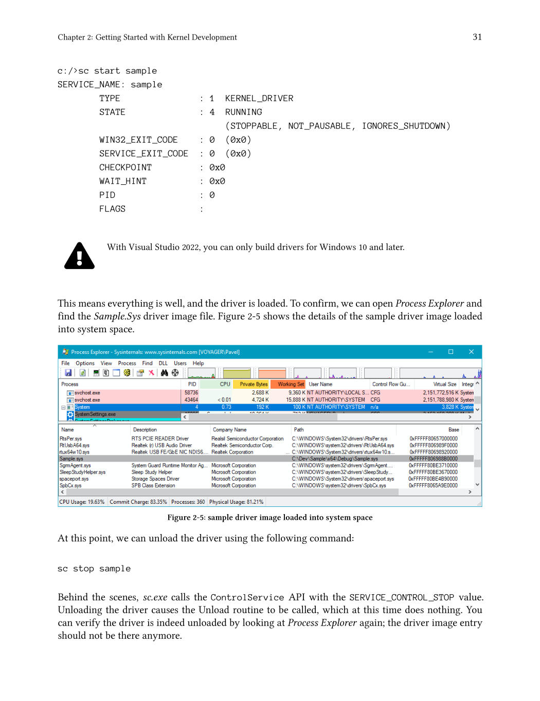

现在我们有了一个成功编译的 Sample.sys 驱动程序文件，让我们将其安装到系统上，然后加载它。通常情况下，你应该在虚拟机上安装和加载驱动程序，以消除主计算机崩溃的风险。你可以随意这样做，或者承担使用这个极简驱动程序带来的微小风险。

安装软件驱动程序与安装用户模式服务类似，需要使用适当的参数调用 `CreateService` API，或者使用类似的工具。用于此目的的知名工具之一是 Sc.exe（服务控制，Service Control 的缩写），这是用于管理服务的 Windows 内置工具。我们将使用此工具来安装并加载驱动程序。请注意，驱动程序的安装和加载是特权操作，通常仅允许管理员执行。

打开一个提升的命令窗口，并键入以下内容（最后一部分应是 SYS 文件所在系统上的路径）：
sc create sample type= kernel binPath= c:\dev\sample\x64\debug\sample.sys
请注意，`type` 和等号之间没有空格，而等号和 `kernel` 之间有一个空格；第二部分也是一样。

如果一切顺利，输出应指示成功。为了测试安装情况，你可以打开注册表编辑器（regedit.exe），并在 `HKLM\System\CurrentControlSet\Services\Sample` 下查找驱动程序详细信息。图2-3显示了执行上述命令后注册表编辑器的屏幕截图。

                                      图2-3：已安装驱动程序的注册表

要加载驱动程序，我们可以再次使用 Sc.exe 工具，这次使用 `start` 选项，该选项使用 `StartService` API 来加载驱动程序（与加载服务所使用的 API 相同）。但是，在64位系统上，驱动程序必须经过签名，因此正常情况下，以下命令会失败：
sc start sample
```text
由于在开发过程中为驱动程序签名很不方便（如果没有适当的证书甚至可能无法实现），因此更好的选择是将系统置于测试签名模式（test signing mode）。在此模式下，未经签名的驱动程序可以顺利加载。
```
通过提升的命令窗口，可以如下方式开启测试签名模式：
bcdedit /set testsigning on
不幸的是，此命令需要重启才能生效。重启后，之前的启动命令应该会成功。
             如果你在启用了安全启动（Secure Boot）的 Windows 10（或更高版本）系统上进行测试，更改测试签名模式将失败。这是受安全启动保护的设置之一（本地内核调试也受安全启动保护）。如果由于 IT 策略或其他原因无法通过 BIOS 设置禁用安全启动，最好的选择是在虚拟机上测试。

如果你打算仅在使用 Visual Studio 2019（或更早版本）的 Windows 10 之前版本的系统上测试驱动程序，可能还需要指定另一项设置。在这种情况下，你必须在项目属性对话框中设置目标操作系统版本，如图2-4所示。请注意，我已经选择了所有配置和所有平台，这样在切换配置（Debug/Release）或平台（x86/x64/

ARM/ARM64）时，该设置会保持不变。

                           图2-4：在项目属性中设置目标操作系统平台

一旦测试签名模式开启，并且驱动程序已加载，你应该会看到如下输出：
c:/>sc start sample
SERVICE_NAME: sample
        TYPE                           : 1  KERNEL_DRIVER
        STATE                          : 4  RUNNING
                                             (STOPPABLE, NOT_PAUSABLE, IGNORES_SHUTDOWN)
           WIN32_EXIT_CODE             : 0 (0x0)
           SERVICE_EXIT_CODE           : 0 (0x0)
           CHECKPOINT                  : 0x0
           WAIT_HINT                   : 0x0

           PID                         : 0
           FLAGS                      

 :
使用 Visual Studio 2022，你只能为 Windows 10 及更高版本构建驱动程序。

这意味着一切正常，驱动程序已加载。为了确认，我们可以打开 Process Explorer 并找到 Sample.Sys 驱动程序映像文件。图2-5显示了加载到系统空间中的 sample 驱动程序映像的详细信息。

                              图2-5：加载到系统空间中的 sample 驱动程序映像

此时，我们可以使用以下命令卸载驱动程序：
sc stop sample
在后台，sc.exe 使用 `SERVICE_CONTROL_STOP` 值调用 `ControlService` API。卸载驱动程序会导致 Unload 例程被调用，此时该例程不执行任何操作。你可以通过再次查看 Process Explorer 来验证驱动程序确实已卸载；驱动程序映像条目不应再出现。

## 简单跟踪
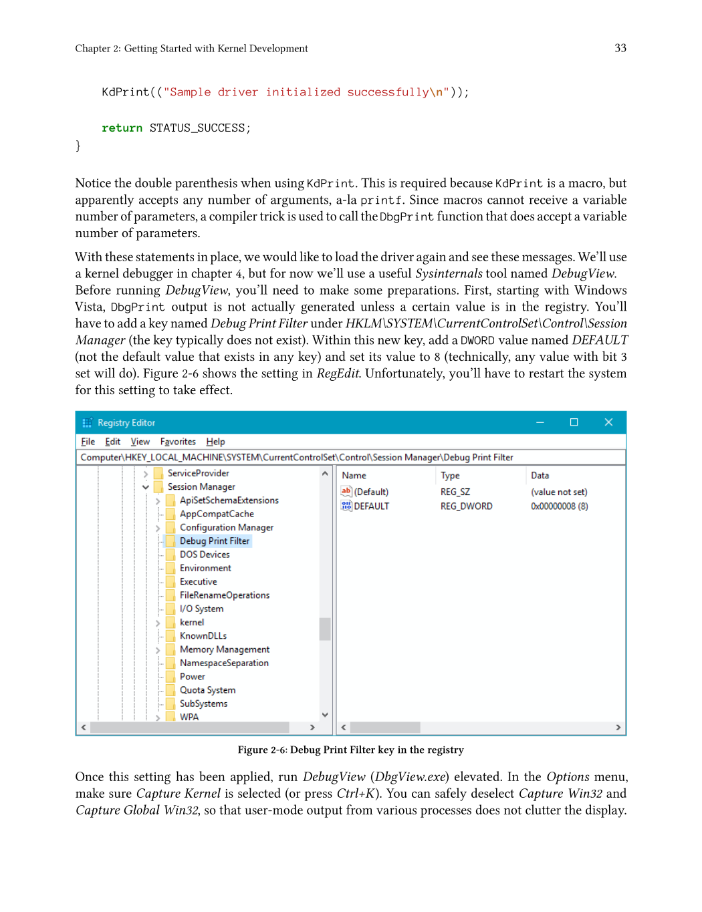
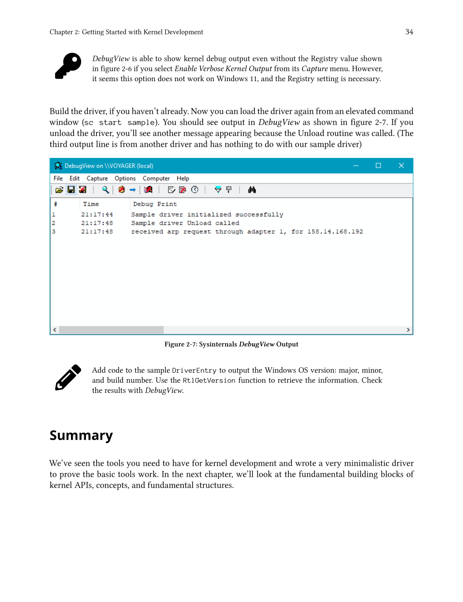

我们如何确定 `DriverEntry` 和 Unload 例程确实执行了呢？让我们为这些函数添加基本的跟踪功能。驱动程序可以使用 `DbgPrint` 函数输出 printf 风格的文本，这些文本可以使用内核调试器或其他工具查看。

以下是 `DriverEntry` 和 Unload 例程的更新版本，它们使用 `DbgPrint` 来跟踪其代码执行的事实：
```c
void SampleUnload(PDRIVER_OBJECT DriverObject) {
    UNREFERENCED_PARAMETER(DriverOb

ject);
     DbgPrint("Sample driver Unload called\n");
}
extern "C" NTSTATUS
DriverEntry(PDRIVER_OBJECT DriverObject, PUNICODE_STRING RegistryPath) {
    UNREFERENCED_PARAMETER(RegistryPath);
     DriverObject->DriverUnload = SampleUnload;
     DbgPrint("Sample driver initialized successfully\n");
     return STATUS_SUCCESS;
}
```
一种更典型的方法是在调试构建（Debug builds）中才包含这些输出。这是因为 `DbgPrint` 会有一些开销，而在发布构建（Release builds）中你可能希望避免这些开销。`KdPrint` 是一个宏，它仅在调试构建中编译，并调用底层的 `DbgPrint` 内核 API。以下是使用 `KdPrint` 的修订版本：
```c
void SampleUnload(PDRIVER_OBJECT DriverObject) {
UNREFERENCED_PARAMETER(DriverObject);
     KdPrint(("Sample driver Unload called\n"));
}
extern "C" NTSTATUS
DriverEntry(PDRIVER_OBJECT DriverObject, PUNICODE_STRING RegistryPath) {
    UNREFERENCED_PARAMETER(RegistryPath);
     DriverObject->DriverUnload = SampleUnload;
     KdPrint(("Sample driver initialized successfully\n"));
     return STATUS_SUCCESS;
}
```
注意使用 `KdPrint` 时的双括号。这是必要的，因为 `KdPrint` 是一个宏，但它显然可以接受任意数量的参数，类似于 printf。由于宏无法接收可变数量的参数，这里使用了一种编译器技巧来调用确实可以接受可变数量参数的 `DbgPrint` 函数。

有了这些语句，我们想再次加载驱动程序并查看这些消息。我们将在第4章使用内核调试器，但现在，我们将使用一个名为 DebugView 的实用 Sysinternals 工具。

在运行 DebugView 之前，你需要做一些准备。首先，从 Windows Vista 开始，除非注册表中存在某个特定值，否则实际上不会生成 `DbgPrint` 输出。你必须在 `HKLM\SYSTEM\CurrentControlSet\Control\Session Manager` 下添加一个名为“Debug Print Filter”的项（该项通常不存在）。在这个新项中，添加一个名为 `DEFAULT` 的 DWORD 值（不是任何项中都存在的默认值），并将其值设置为 8（从技术上讲，任何设置了第 3 位（bit 3）的值都可以）。图2-6显示了 RegEdit 中的设置。不幸的是，你必须重启系统才能使此设置生效。

                                  图2-6：注册表中的 Debug Print Filter 项

应用此设置后，以管理员身份运行 DebugView（DbgView.exe）。在“O

ptions”菜单中，确保选中“Capture Kernel”（或按 Ctrl+K）。你可以安全地取消选中“Capture Win32”和“Capture Global Win32”，这样来自各个进程的用户模式输出就不会使显示变得混乱。
             DebugView 能够显示内核调试输出，即使没有图2-6所示的注册表值，前提是你从其 Capture 菜单中选择了“Enable Verbose Kernel Output”。但是，此选项似乎在 Windows 11 上不起作用，注册表设置是必需的。

如果尚未构建驱动程序，请先构建它。现在，你可以从提升的命令窗口再次加载驱动程序（`sc start sample`）。你应该在 DebugView 中看到如图2-7所示的输出。如果卸载驱动程序，你会看到另一条消息出现，因为 Unload 例程被调用了。（第三行输出来自另一个驱动程序，与我们的示例驱动程序无关）

                                     图2-7：Sysinternals DebugView 输出

             向示例的 DriverEntry 中添加代码以输出 Windows 操作系统版本：主版本号、次版本号和内部版本号。使用 `RtlGetVersion` 函数获取信息。通过 DebugView 检查结果。

## 摘要

我们了解了内核开发所需的工具，并编写了一个非常精简的驱动程序来证明基本工具可以正常工作。在下一章中，我们将研究内核 API 的基本构建块、概念和基础结构。

# Chapter 3: Kernel Programming Basics

# 第三章：内核编程基础

在本章中，我们将深入探讨内核API、结构和定义。我们还将审视一些在驱动程序中调用代码的机制。最后，我们将整合所有这些知识来创建我们的第一个功能齐全的驱动程序及客户端应用程序。

本章内容：
    • 通用内核编程指南
    • 调试版与发布版构建
    • 内核API
    • 函数与错误代码
    • 字符串
    • 动态内存分配
    • 链表
    • 对象属性
    • 驱动对象
    • 设备对象

## 通用内核编程指南

开发内核驱动程序需要Windows驱动程序工具包（WDK），其中包含了所需头文件和库。内核API由C函数组成，本质上与用户模式API非常相似。然而，存在若干差异。表3-1总结了用户模式编程与内核模式编程之间的重要区别。

                  表3-1：用户模式与内核模式开发的差异
                          用户模式                                 内核模式
 未处理异常     未处理的异常会导致进程崩溃            未处理的异常会导致系统崩溃
 终止           当进程终止时，所有私有内存和资源       如果驱动程序在未释放其占用的所有资源的情况下卸载，
                会被自动释放                           将发生资源泄漏，只有在下一次系统启动时才能解决
 返回值         API错误有时会被忽略                   应（几乎）从不忽略错误
 IRQL           始终为PASSIVE_LEVEL (0)                可能为DISPATCH_LEVEL (2) 或更高
 不良编码       通常仅限于影响当前进程                可能对系统产生全局性影响
 测试与调试     测试和调试通常在开发者本机上进行       调试必须在另一台机器上进行
 库             可以使用几乎任何C/C++库                大多数标准库无法使用
                （如STL、boost）
 异常处理       可以使用C++异常或结构化异常           只能使用结构化异常处理（SEH）
                处理（SEH）
 C++用法        完整的C++运行时可用                   无C++运行时可用

### 未处理异常

在用户模式下发生且未被程序捕获的异常会导致进程提前终止。而内核模式代码由于被隐式信任，无法从未处理异常中恢复。此类异常会导致系统崩溃，并显示臭名昭著的蓝屏死机（BSOD）（较新的Windows版本中崩溃屏幕颜色更加多样化）。乍看起来，BSOD像是一种惩罚，但实际上它是一种保护机制。其基本理由是，允许代码继续执行可能会对Windows造成不可逆转的损害（例如删除重要文件或损坏注册表），进而导致系统无法启动。因此，最好立即停止一切运行，以防止潜在的损害。我们将在第6章中更详细地讨论BSOD。

这一切至少可以得出一个结论：内核代码必须精心编写，不能跳过任何诸如错误检查之类的细节。

### 终止

无论出于何种原因——无论是正常终止、因未处理异常终止，还是被外部代码终止——进程都不会泄漏任何资源：所有私有内存都会被释放，所有句柄都会被关闭。当然，过早关闭句柄可能会导致一些数据丢失，例如在将某些数据刷新到磁盘之前关闭文件句柄——但在进程生命周期之外，不存在资源泄漏；这是由内核保证的。

另一方面，内核驱动程序不提供此类保证。如果驱动程序在卸载时仍然持有已分配的内存或打开的内核句柄——这些资源不会自动释放，只会在下次系统启动时释放。

为什么会这样？内核难道不能跟踪驱动程序的分配和资源使用情况，以便在驱动程序卸载时自动释放这些资源吗？

理论上，这是有可能实现的（尽管目前内核不跟踪此类资源使用）。真正的问题是，内核尝试进行此类清理会过于危险。内核无法知道驱动程序是否出于某种原因而泄漏了这些资源；例如，驱动程序可以分配某个缓冲区，然后将其传递给与之协作的另一个驱动程序。第二个驱动程序可能会使用该内存缓冲区，并在最终释放它。如果内核在第一个驱动程序卸载时试图释放该缓冲区，那么当第二个驱动程序访问那个现在已被释放的缓冲区时，就会引发访问冲突，从而导致系统崩溃。

这强调了内核驱动程序必须正确清理已分配资源的责任；没有其他任何人会做这件事。

### 函数返回值

在典型的用户模式代码中，API函数的返回值有时会被忽略，开发人员乐观地认为被调用的函数不太可能失败。对于某个特定函数来说，这种做法可能合适也可能不合适，但在最坏的情况下，一个未处理的异常会在稍后使进程崩溃；而系统本身却保持完好无损。

忽略内核API的返回值要危险得多（请参阅前面的“终止”部分），通常应该避免这种做法。即使是看似“无害”的函数也可能因意想不到的原因而失败，因此这里的黄金法则是——始终检查内核API的返回状态值。

### IRQL

中断请求级别（IRQL）是一个重要的内核概念，将在第6章中进一步讨论。目前只需要知道，正常情况下处理器的IRQL为零，特别是当用户模式代码执行时，它始终为零。在内核模式下，大多数时候它也为零——但并非总是如此。在IRQL为2级及更高级别时，代码执行存在一些限制，这意味着驱动开发人员必须注意只能在该高IRQL级别下使用允许的API。高于零的IRQL级别所产生的影响将在第6章中讨论。

### C++用法

在用户模式编程中，C++已经使用了许多年，并且与用户模式Windows API结合使用时效果很好。对于内核代码，微软从Visual Studio 2012和WDK 8开始正式支持C++。当然，C++并非强制性的，但它具有一些与资源清理相关的重要优势，其中涉及一种称为“资源获取即初始化”（RAII）的C++惯用法。我们将大量使用这种RAII惯用法，以确保不会泄漏资源。

C++作为一种语言，在内核代码中几乎得到了完全支持。但内核中没有C++运行时，因此某些C++特性无法使用：

    • `new` 和 `delete` 运算符不受支持，并且会导致编译失败。这是因为它们的正常操作是从用户模式堆中分配内存，而这在内核中是不相关的。内核API提供了“替代”函数，这些函数更接近C语言的 `malloc` 和 `free` 函数。我们将在本章后面讨论这些函数。但是，可以像有时在用户模式下所做的那样重载 `new` 和 `delete` 运算符，并在其实现中调用内核分配和释放函数。我们也将在本章后面说明如何实现这一点。
    • 具有非默认构造函数的全局变量不会被调用——因为没有C/C++运行时来调用这些构造函数。这种情况必须避免，但也有一些变通方法：
         – 避免在构造函数中编写任何代码，而是创建一个 `Init` 函数，由驱动程序代码显式调用（例如从 `DriverEntry` 中调用）。
         – 仅将指针分配为全局（或静态）变量，并动态创建实际实例。编译器将生成正确的代码来调用构造函数。这要求 `new` 和 `delete` 运算符已被重载，如本章后面所述。
    • C++异常处理关键字（`try`、`catch`、`throw`）无法编译。这是因为C++异常处理机制需要自己的运行时，而内核中并不存在该运行时。异常处理只能使用结构化异常处理（SEH）——一种内核处理异常的机制。我们将在第6章中详细探讨SEH。
    • 标准C++库在内核中不可用。尽管大多数是模板化的，但它们无法编译，因为它们可能依赖于用户模式库和语义。尽管如此，C++模板作为一项语言特性完全可以正常工作。模板的一个很好的用途是基于用户模式标准C++库中的类似类型（如 `std::vector<>`、`std::wstring` 等）为内核模式库类型创建替代方案。

本书中的代码示例将用到一些C++特性。代码示例中最常使用的特性有：

    • `nullptr` 关键字，表示真正的空指针。
    • `auto` 关键字，在声明和初始化变量时允许类型推断。这有助于减少混乱、节省输入，并聚焦于重要部分。
    • 在合适之处使用模板。
    • 重载 `new` 和 `delete` 运算符。
    • 构造函数和析构函数，特别是用于构建RAII类型。

任何C++标准都可以用于内核开发。Visual Studio中新项目的默认设置是使用C++ 14。但是，你可以将C++编译器标准更改为任何其他设置，包括C++ 20（截至撰写本文时最新标准）。我们稍后将使用的一些特性至少需要C++ 17。

严格来说，内核驱动程序可以完全使用纯C语言编写，没有任何问题。如果你更倾向于这种方式，请使用扩展名为C的文件而非CPP。这将为这些文件自动调用C编译器。

### 测试与调试

对于用户模式代码，测试通常在开发人员本机上进行（如果所有必需的依赖项都能满足）。调试通常通过将调试器（大多数情况下是Visual Studio）附加到正在运行的进程，或者启动可执行文件并附加到进程来完成。

对于内核代码，测试通常在另一台机器上进行，通常是在开发人员本机上托管的虚拟机。这样可以确保，如果发生蓝屏，开发人员本机不会受到影响。调试内核代码必须使用另一台机器，即实际驱动程序正在其中执行的机器。这是因为在内核模式下遇到断点会冻结整台机器，而不仅仅是某个特定进程。开发人员本机承载调试器本身，而第二台机器（同样，通常是虚拟机）执行驱动程序代码。这两台机器必须通过某种机制连接，以便数据可以在主机（运行调试器的机器）和目标机之间流动。我们将在第5章中更详细地探讨内核调试。

## 调试版与发布版构建

与用户模式项目一样，构建内核驱动程序可以在调试（Debug）或发布（Release）模式下进行。其差异与用户模式下的对应版本类似——调试版本默认不使用编译器优化，但更容易调试。发布版本默认利用完全的编译器优化，以生成尽可能快速且体积最小的代码。不过，也存在一些差异。

在内核术语中，这些对应的术语是“已检查”（Checked，即Debug）和“自由”（Free，即Release）。尽管Visual Studio的内核项目继续使用“Debug/Release”术语，但较旧的文档使用“Checked/Free”术语。从编译的角度来看，内核的调试版本会定义符号 `DBG` 并将其值设置为1（相比之下，用户模式下定义的是 `_DEBUG` 符号）。这意味着你可以使用 `DBG` 符号通过条件编译来区分调试版本和发布版本。例如，`KdPrint` 宏就是这样做的：在调试版本中，它会被编译为调用 `DbgPrint`，而在发布版本中，它会被编译为空，导致 `KdPrint` 调用在发布版本中没有任何效果。这通常是你想要的结果，因为这些调用相对昂贵。我们将在第5章中讨论其他记录信息的方法。

## 内核API

内核驱动程序使用内核组件导出的函数。这些函数统称为内核API。大多数函数在内核模块本身（`NtOskrnl.exe`）中实现，但有些可能由其他内核模块实现，例如HAL（`hal.dll`）。

内核API是一组庞大的C函数。其中大多数函数以前缀开头，该前缀暗示了实现该函数的组件。表3-2展示了一些常见前缀及其含义：

                                      表3-2：常见内核API前缀
 前缀      含义                                                  示例
 Ex        通用执行体函数                                        ExAllocatePoolWithTag
 Ke        通用内核函数                                          KeAcquireSpinLock
 Mm        内存管理器                                            MmProbeAndLockPages
 Rtl       通用运行时库                                          RtlInitUnicodeString
 FsRtl     文件系统运行时库                                      FsRtlGetFileSize
 Flt       文件系统微过滤驱动库                                  FltCreateFile
 Ob        对象管理器                                            ObReferenceObject
 Io        I/O管理器                                             IoCompleteRequest
 Se        安全性                                                SeAccessCheck
 Ps        进程管理器                                            PsLookupProcessByProcessId
 Po        电源管理器                                            PoSetSystemState
 Wmi       Windows管理规范                                       WmiTraceMessage
 Zw        原生API包装器                                         ZwCreateFile
 Hal       硬件抽象层                                            HalExamineMBR
 Cm        配置管理器（注册表）                                  CmRegisterCallbackEx

如果你查看 `NtOsKrnl.exe` 的导出函数列表，你会发现许多函数在Windows驱动程序工具包中并没有文档记录；这是内核开发人员不得不面对的现实——并非所有东西都有文档。

这里需要讨论一组函数——具有 `Zw` 前缀的函数。这些函数镜像了原生API，这些API可从 `NtDll.Dll` 作为网关使用，实际实现则由执行体提供。当一个 `Nt` 函数从用户模式被调用时，例如 `NtCreateFile`，它会到达执行体中实际的 `NtCreateFile` 实现。此时，`NtCreateFile` 可能会根据原始调用者来自用户模式这一事实执行各种检查。此调用者信息以逐个线程的方式存储在每个线程的 `KTHREAD` 结构中未公开的 `PreviousMode` 成员中。

        你可以通过调用已文档化的 `ExGetPreviousMode` API来查询先前的处理器模式。

另一方面，如果内核驱动程序需要调用系统服务，则不应受到强加给用户模式调用者的那些检查和约束的限制。这就是 `Zw` 函数的用武之地。调用 `Zw` 函数会将先前的调用者模式设置为 `KernelMode` (0)，然后调用原生函数。例如，调用 `ZwCreateFile` 会将先前的调用者设置为 `KernelMode`，然后调用 `NtCreateFile`，从而使 `NtCreateFile` 绕过原本要执行的一些安全性和缓冲区检查。结论是，内核驱动程序应该调用 `Zw` 函数，除非有令人信服的理由不这样做。

## 函数与错误代码

大多数内核API函数返回一个状态，指示操作成功或失败。该状态类型为 `NTSTATUS`，是一个有符号的32位整数。值 `STATUS_SUCCESS` (0) 表示成功。负值表示某种错误。你可以在文件 `<ntstatus.h>` 中找到所有已定义的 `NTSTATUS` 值。

大多数代码路径不关心错误的确切性质，因此测试最高有效位就足以判断是否发生了错误。可以使用 `NT_SUCCESS` 宏来完成此操作。下面是一个示例，用于测试失败并在发生错误时记录错误：

```c
NTSTATUS DoWork() {
    NTSTATUS status = CallSomeKernelFunction();
    if(!NT_SUCCESS(status)) {
        KdPrint((L"发生错误: 0x%08X\n", status));
        return status;
    }
     // 继续执行更多操作
     return STATUS_SUCCESS;
}
```
在某些情况下，`NTSTATUS` 值会从一些最终传递给用户模式的函数中返回。在这些情况下，`STATUS_xxx` 值会被转换为某些 `ERROR_yyy` 值，用户模式可以通过 `GetLastError` 函数获取这些值。请注意，这些数值并不相同；首先，用户模式下的错误代码为正值（零仍表示成功）。其次，映射并非一一对应。无论如何，这通常不是内核驱动程序需要关心的问题。

驱动程序内部函数通常也返回 `NTSTATUS` 来指示其成功/失败状态。这通常很方便，因为这些函数调用内核API，因此可以通过简单地返回它们从特定API获得的相同状态来传播任何错误。这也意味着，驱动程序函数的“实际”返回值通常通过作为函数参数提供的指针或引用返回。

             从你自己的函数中返回 `NTSTATUS`。这将使错误报告更简单且保持一致。

## 字符串
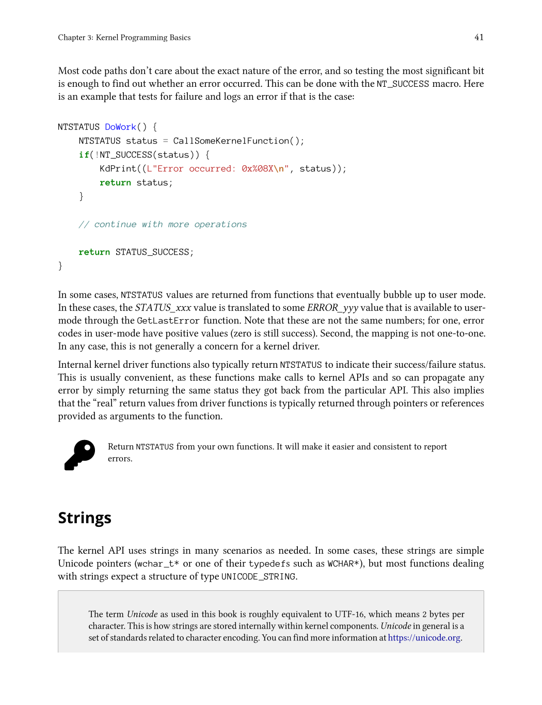

内核API在需要时会用到字符串。在某些情况下，这些字符串就是简单的Unicode指针（`wchar_t*` 或它们的类型定义，如 `WCHAR*`），但大多数处理字符串的函数期望一个 `UNICODE_STRING` 类型的结构。

        本书中使用的术语Unicode大致等同于UTF-16，这意味着每个字符占用2个字节。这是内核组件内部存储字符串的方式。总的来说，Unicode是一套与字符编码相关的标准。你可以在 https://unicode.org 找到更多信息。

`UNICODE_STRING` 结构表示一个已知其长度和最大长度的字符串。以下是该结构的简化定义：

```c
typedef struct _UNICODE_STRING {
    USHORT Length;
    USHORT MaximumLength;
    PWCH   Buffer;
} UNICODE_STRING;
typedef UNICODE_STRING *PUNICODE_STRING;
typedef const UNICODE_STRING *PCUNICODE_STRING;
```
`Length` 成员的单位是字节（不是字符），并且不包括Unicode-NULL终止符（如果存在的话，NULL终止符不是强制性的）。`MaximumLength` 成员表示字符串在不需要重新分配内存的情况下可以增长到的字节数。

操作 `UNICODE_STRING` 结构通常使用一组专门处理字符串的 `Rtl` 函数来完成。表3-3列出了由 `Rtl` 函数提供的部分常用字符串操作函数。

                                  表3-3：常用UNICODE_STRING函数
 函数                                 描述
 RtlInitUnicodeString                 基于现有的C字符串指针对 `UNICODE_STRING` 进行初始化。
                                      它设置 `Buffer`，然后计算 `Length` 并将 `MaximumLength` 设置为相同的值。
                                      请注意，此函数不分配任何内存——它只初始化内部成员。
 RtlCopyUnicodeString                 将一个 `UNICODE_STRING` 复制到另一个。在复制之前，必须
                                      为目标字符串分配内存，并适当设置 `MaximumLength`。
 RtlCompareUnicodeString              比较两个 `UNICODE_STRING`（相等、小于、大于），
                                      并指定是进行大小写敏感还是比较。
 RtlEqualUnicodeString                比较两个 `UNICODE_STRING` 是否相等，可指定大小写敏感性。
 RtlAppendUnicodeStringToString       将一个 `UNICODE_STRING` 追加到另一个 `UNICODE_STRING` 后面。
 RtlAppendUnicodeToString             将 `UNICODE_STRING` 追加到一个C风格字符串后面。

除了上述函数外，还有一些操作C字符串指针的函数。此外，为方便起见，一些来自C运行时库的众所周知的字符串函数也在内核中实现了：`wcscpy_s`、`wcscat_s`、`wcslen`、`wcscpy_s`、`wcschr`、`strcpy`、`strcpy_s` 等等。

             `wcs` 前缀用于操作C语言的Unicode字符串，而 `str` 前缀用于操作C语言的Ansi字符串。
             某些函数中的后缀 `_s` 表示这是一个安全函数，必须提供一个额外的参数来指明字符串的最大长度，
             这样函数就不会传输超过该大小的数据。
             切勿使用非安全函数。如果在代码中使用了这些已弃用的函数，你可以包含 `<dontuse.h>` 头文件来产生错误提示。

## 动态内存分配
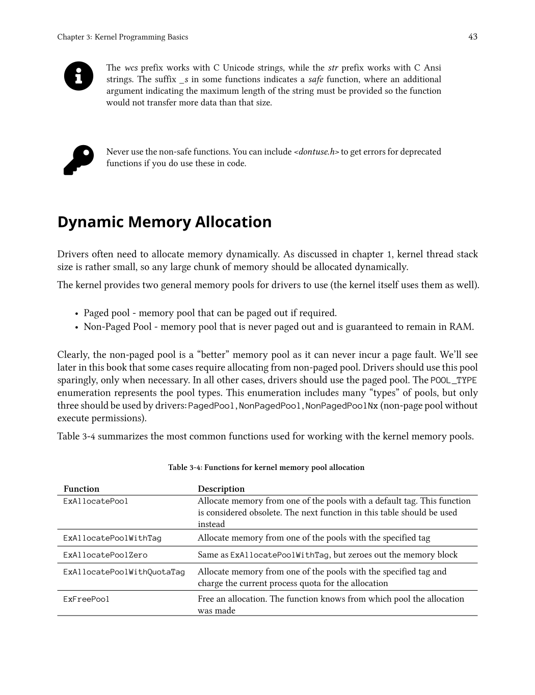
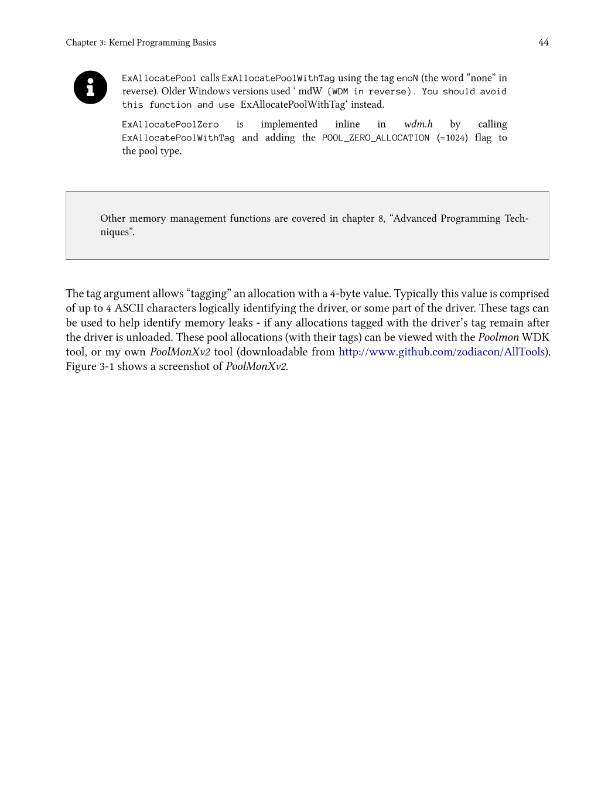
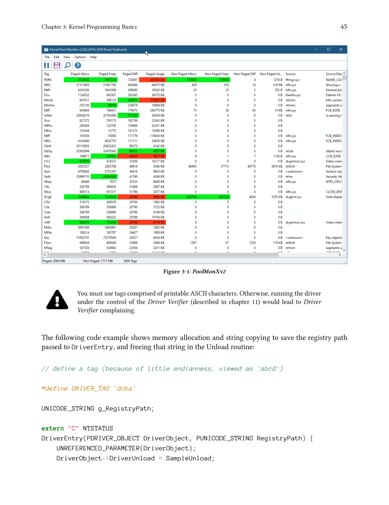

驱动程序经常需要动态分配内存。如第1章所述，内核线程的栈大小相当小，因此任何大的内存块都应该动态分配。

内核提供了两个通用的内存池供驱动程序使用（内核自身也在使用它们）。

    • 分页池 - 在需要时可以换出到磁盘的内存池。
    • 非分页池 - 永远不会被换出，并保证保留在RAM中的内存池。

显然，非分页池是“更好”的内存池，因为它永远不会引发页面错误。我们将在本书后面看到，某些情况下需要从非分页池中分配。驱动程序应谨慎使用此池，仅在必要时使用。在所有其他情况下，驱动程序应使用分页池。`POOL_TYPE` 枚举表示池类型。此枚举包含许多“类型”的池，但驱动程序只应使用其中的三种：`PagedPool`、`NonPagedPool`、`NonPagedPoolNx`（不可执行的非分页池）。

表3-4总结了用于处理内核内存池的最常用函数。

                             表3-4：内核内存池分配函数
 函数                              描述
 ExAllocatePool                    使用默认标签从某个池中分配内存。此函数已被视为过时。
                                   应使用本表中的下一个函数来代替。
 ExAllocatePoolWithTag             使用指定的标签从某个池中分配内存。
 ExAllocatePoolZero                与 `ExAllocatePoolWithTag` 相同，但会清零内存块。
 ExAllocatePoolWithQuotaTag        使用指定的标签从某个池中分配内存，并针对该次分配扣除当前进程的配额。
 ExFreePool                        释放已分配的内存块。该函数知道该分配来自哪个池。
             `ExAllocatePool` 使用标签 `enoN`（单词“none”的反写）调用 `ExAllocatePoolWithTag`。
             较早版本的Windows使用 `' mdW'`（WDM的反写）。你应该避免使用此函数，而应使用 `ExAllocatePoolWithTag'`。
             `ExAllocatePoolZero`  在 `wdm.h`  中以内联方式实现，通过调用
             `ExAllocatePoolWithTag` 并向池类型中添加 `POOL_ZERO_ALLOCATION` (=1024) 标志来实现。

        其他内存管理函数将在第8章“高级编程技术”中介绍。

`tag` 参数允许用一个4字节的值来“标记”一次分配。通常，这个值由最多4个ASCII字符组成，逻辑上标识驱动程序或驱动程序的某部分。这些标签可用于帮助识别内存泄漏——如果在驱动程序卸载后，仍然存在任何使用该驱动程序标签标记的分配。这些池分配（及其标签）可以使用WDK工具 `Poolmon` 查看，也可以使用我自己的 `PoolMonXv2` 工具（可从 http://www.github.com/zodiacon/AllTools 下载）。图3-1显示了 `PoolMonXv2` 的屏幕截图。

                                           图3-1：PoolMonXv2

             你必须使用由可打印ASCII字符组成的标签。否则，在驱动程序验证器（Driver Verifier，将在第11章介绍）的控制下运行驱动程序时，
             驱动程序验证器会发出警告。

以下代码示例展示了内存分配和字符串复制，以保存传递给 `DriverEntry` 的注册表路径，并在 `Unload` 例程中释放该字符串：

```c
// 定义一个标签（由于小端序，查看时显示为 'abcd'）
#define DRIVER_TAG 'dcba'
UNICODE_STRING g_RegistryPath;
extern "C" NTSTATUS
DriverEntry(PDRIVER_OBJECT DriverObject, PUNICODE_STRING RegistryPath) {
    UNREFERENCED_PARAMETER(DriverObject);
    DriverObject->DriverUnload = SampleUnload;
     g_RegistryPath.Buffer = (WCHAR*)ExAllocatePoolWithTag(PagedPool,
         RegistryPath->Length, DRIVER_TAG);
     if (g_RegistryPath.Buffer == nullptr) {
         KdPrint(("内存分配失败\n"));
         return STATUS_INSUFFICIENT_RESOURCES;
     }
     g_RegistryPath.MaximumLength = RegistryPath->Length;

     RtlCopyUnicodeString(&g_RegistryPath,
         (PCUNICODE_STRING)RegistryPath);
     // %wZ 用于 UNICODE_STRING 对象
     KdPrint(("原始注册表路径: %wZ\n", RegistryPath));
     KdPrint(("已复制的注册表路径: %wZ\n", &g_RegistryPath));
     //...
     return STATUS_SUCCESS;
}
void SampleUnload(_In_ PDRIVER_OBJECT DriverObject) {
UNREFERENCED_PARAMETER(DriverObject);
     ExFreePool(g_RegistryPath.Buffer);
     KdPrint(("示例驱动程序 Unload 被调用\n"));
}
```
## 链表
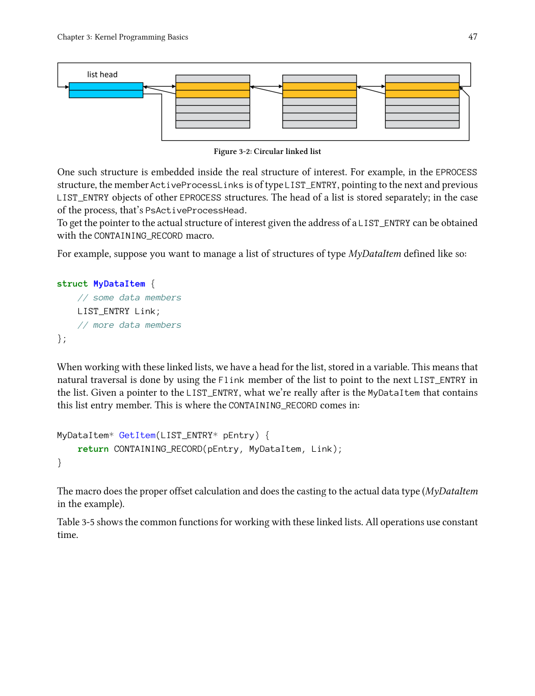

内核在其许多内部数据结构中使用了循环双向链表。例如，系统上的所有进程都由 `EPROCESS` 结构管理，这些结构连接在一个循环双向链表中，其表头存储在内核变量 `PsActiveProcessHead` 中。

所有这些链表都以相同的方式构建，围绕 `LIST_ENTRY` 结构定义，如下所示：

```c
typedef struct _LIST_ENTRY {
   struct _LIST_ENTRY *Flink;
   struct _LIST_ENTRY *Blink;
} LIST_ENTRY, *PLIST_ENTRY;
```
图3-2描绘了一个包含表头和三个实例的此类链表示例。

                                      图3-2：循环链表

这样一个结构嵌入在感兴趣的实际结构内部。例如，在 `EPROCESS` 结构中，成员 `ActiveProcessLinks` 的类型就是 `LIST_ENTRY`，它指向其他 `EPROCESS` 结构的上一个和下一个 `LIST_ENTRY` 对象。链表的表头是单独存储的；就进程而言，表头是 `PsActiveProcessHead`。

给定一个 `LIST_ENTRY` 的地址，要获取指向实际感兴趣结构的指针，可以通过 `CONTAINING_RECORD` 宏来实现。

例如，假设你想管理一个 `MyDataItem` 类型的结构列表，该结构定义如下：

```c
struct MyDataItem {
    // 一些数据成员
    LIST_ENTRY Link;
    // 更多数据成员
};
```
在处理这些链表时，我们有一个存储在变量中的链表头。这意味着，通过使用列表的 `Flin

k` 成员指向列表中的下一个 `LIST_ENTRY`，来完成自然的遍历。给定一个指向 `LIST_ENTRY` 的指针，我们真正需要的是包含此链表条目成员的 `MyDataItem`。这就是 `CONTAINING_RECORD` 发挥作用的地方：

MyDataItem* GetItem(LIST_ENTRY* pEntry) {
```c
return CONTAINING_RECORD(pEntry, MyDataItem, Link);
}
```
该宏执行正确的偏移量计算，并转换为实际的数据类型（在此示例中为 `MyDataItem`）。

表3-5展示了处理这些链表的常用函数。所有操作都使用常数时间。

                             表3-5：处理循环链表的函数
 函数                               描述
 InitializeListHead                 初始化链表头，创建一个空列表。前向和后向指针指向前向指针本身。
 InsertHeadList                     将一项插入链表头部。
 InsertTailList                     将一项插入链表尾部。
 IsListEmpty                        检查链表是否为空。
 RemoveHeadList                     移除链表头部的项。
 RemoveTailList                     移除链表尾部的项。
 RemoveEntryList                    从链表中移除特定项。
 ExInterlockedInsertHeadList        使用指定的自旋锁，以原子方式将一项插入链表头部。
 ExInterlockedInsertTailList        使用指定的自旋锁，以原子方式将一项插入链表尾部。
 ExInterlockedRemoveHeadList        使用指定的自旋锁，以原子方式从链表头部移除一项。

表3-4中的最后三个函数使用一种称为自旋锁（spin lock）的同步原语以原子方式执行操作。自旋锁将在第6章中讨论。

## 驱动对象

我们已经看到 `DriverEntry` 函数接受两个参数，第一个参数是某种驱动对象。这是一个在WDK头文件中定义的半文档化结构，称为 `DRIVER_OBJECT`。“半文档化”意味着它的部分成员为驱动程序的使用而文档化了，但有些则没有。

此结构由内核分配并部分初始化。然后，它被提供给 `DriverEntry`（并且在驱动程序卸载前，也会提供给 `Unload` 例程）。此时驱动程序的作用是进一步初始化该结构，以指示驱动程序支持哪些操作。

我们在第2章中已经看到了一个这样的“操作”—— `Unload` 例程。另一组需要初始化的重要操作称为 **分发例程（Dispatch Routines）**。这是一个函数指针数组，存储在 `DRIVER_OBJECT` 的 `MajorFunctio

n` 成员中。该数组指定了驱动程序支持哪些操作，例如创建、读取、写入等。这些索引使用 `IRP_MJ_` 前缀定义。表3-6展示了一些常见的主要函数代码及其含义。

                                        表3-6：常见的主要函数代码
 主要函数                                      描述
```c
IRP_MJ_CREATE (0)                             创建操作。通常由 `CreateFile` 或 `ZwCreateFile` 调用触发。
 IRP_MJ_CLOSE (2)                              关闭操作。通常由 `CloseHandle` 或 `ZwClose` 触发。
 IRP_MJ_READ (3)                               读取操作。通常由 `ReadFile`、`ZwReadFile` 及类似的读取API触发。
 IRP_MJ_WRITE (4)                              写入操作。通常由 `WriteFile`、`ZwWriteFile` 及类似的写入API触发。
 IRP_MJ_DEVICE_CONTROL (14)                    对驱动程序的通用调用，由 `DeviceIoControl` 或
```
`ZwDeviceIoControlFile` 调用触发。
```c
IRP_MJ_INTERNAL_DEVICE_CONTROL (15)           与前一个类似，但仅对内核模式调用者可用。
 IRP_MJ_SHUTDOWN (16)                          当系统关闭时调用，前提是驱动程序已通过
```
`IoRegisterShutdownNotification` 注册了关闭通知。
```c
IRP_MJ_CLEANUP (18)                           当文件对象的最后一个句柄被关闭，但该文件对象
```
的引用计数不为零时调用。
```c
IRP_MJ_PNP (31)                               由即插即用管理器调用的即插即用回调。通常对基于硬件的驱动程序或此类驱动程序的过滤器有意义。
 IRP_MJ_POWER (22)                             由电源管理器调用的电源回调。通常对基于硬件的驱动程序或此类驱动程序的过滤器有意义。
```
最初，`MajorFunction` 数组由内核初始化，指向一个内核内部例程 `IopInvalidDeviceRequest`，该例程向调用者返回一个失败状态，表明该操作不受支持。这意味着驱动程序在其 `DriverEntry` 例程中只需要初始化它实际支持的操作，而将所有其他条目保留为其默认值。

例如，目前为止，我们的 `Sample` 驱动程序不支持任何分发例程，这意味着无法与驱动程序通信。一个驱动程序必须至少支持 `IRP_MJ_CREATE` 和 `IRP_MJ_CLOSE` 操作，以允许为其设备对象打开一个句柄。我们将在下一章中将这些想法付诸实践。

## 对象属性

在许多内核API中都会出现的一个常用结构是 `OBJECT_ATTRIBUTES`，其定义如下：

```c
typedef struct _OBJECT_ATTRIBUTES {
    ULONG Length;
    HANDLE RootDirectory;
    PUNICODE_STRING ObjectName;
    ULONG Attributes;
    PVOID SecurityDescriptor;        // SECURITY_DESCRIPTOR
    PVOID SecurityQualityOfService; // SECURITY_QUALITY_OF_SERVICE
} OBJECT_ATTRIBUTES;
typedef OBJECT_ATTRIBUTES *POBJECT_ATTRIBUTES;
typedef CONST OBJECT_ATTRIBUTES *PCOBJECT_ATTRIBUTES;
```
该结构通常使用 `InitializeObjectAttributes` 宏进行初始化，该宏允许指定除 `Length`（由宏自动设置）和 `SecurityQualityOfService`（通常不需要）之外的所有结构成员。以下是各成员的描述：

    • `ObjectName` 是要创建/定位的对象名称，作为指向 `UNICODE_STRING` 的指针提供。在某些情况下，可以将其设置为 `NULL`。例如，`ZwOpenProcess` 允许在给定PID的情况下打开进程句柄。由于进程没有名称，在这种情况下，`ObjectName` 应初始化为 `NULL`。
    • `RootDirectory` 是对象管理器命名空间中的一个可选目录，前提是对象名称是相对的。如果 `ObjectName` 指定了一个完全限定名，则 `RootDirectory` 应设置为 `NULL`。
    • `Attributes` 允许指定一组对相关操作产生影响的标志。表3-7显示了已定义的标志及其含义。
    • `SecurityDescriptor` 是一个可选的安全描述符（`SECURITY_DESCRIPTOR`），用于在新建的对象上设置。`NULL` 表示新对象根据调用者的令牌获得默认的安全描述符。
    • `SecurityQualityOfService` 是一个与新建对象的模拟级别和上下文跟踪模式相关的可选属性集。对于大多数对象类型，它没有意义。更多信息请查阅文档。

                                       表3-7：对象属性标志
 标志 (OBJ_)                                   描述
```c
INHERIT (2)                                  返回的句柄应标记为可继承。
 PERMANENT (0x10)                             创建的对象应标记为永久对象。永久对象具有
```
额外的引用计数，即使关闭了指向它们的所有句柄，
                                              也能防止它们被销毁。
```c
EXCLUSIVE (0x20)                             如果正在创建对象，则该对象以独占访问方式创建。
```
无法打开指向该对象的其他句柄。如果正在打开对象，
                                              则请求独占访问，仅当该对象最初使用此标志创建时
                                              才会被授予。
```c
CASE_INSENSITIVE (0x40)                      打开对象时，对其名称执行不区分大小写的搜索。
```
如果没有此标志，名称必须完全匹配。
```c
OPENIF (0x80)                                如果对象存在，则打开它。否则，操作失败
```
（不创建新对象）。
```c
OPENLINK (0x100)                             如果要打开的对象是一个符号链接对象，则打开
```
符号链接对象本身，而不是跟随符号链接到达其目标。
```c
KERNEL_HANDLE (0x200)                        返回的句柄应为内核句柄。内核句柄在任何进程
```
上下文中都有效，并且不能被用户模式代码使用。
```c
FORCE_ACCESS_CHECK (0x400)                   即使在 `KernelMode` 访问模式下打开对象，也应执行
```
访问检查。
```c
IGNORE_IMPERSONATED_DEVICEMAP (0x800)        如果用户正在模拟，则使用进程的设备映射而不是
```
用户的设备映射（有关设备映射的更多信息，请查阅
                                              文档）。
```c
DONT_REPARSE (0x1000)                        如果遇到重解析点，不要跟随它。而是返回一个错误
                                              （`STATUS_REPARSE_POINT_ENCOUNTERED`）。
```
重解析点将在第11章中简要讨论。

初始化 `OBJECT_ATTRIBUTES` 结构的另一种方法是使用 `RTL_CONSTANT_OBJECT_ATTRIBUTES` 宏，该宏使用最常用的成员进行设置——对象的名称和属性。

让我们看几个使用 `OBJECT_ATTRIBUTES` 的示例。第一个示例是一个函数，用于在给定进程ID的情况下打开进程句柄。为此，我们将使用 `ZwOpenProcess` API，其定义如下：

```c
NTSTATUS ZwOpenProcess (
    _Out_       PHANDLE ProcessHandle,
    _In_        ACCESS_MASK DesiredAccess,
    _In_        POBJECT_ATTRIBUTES ObjectAttributes,
    _In_opt_    PCLIENT_ID ClientId);
```
它还使用了另一个常用结构 `CLIENT_ID`，该结构保存了进程和/或线程ID：

```c
typedef struct _CLIENT_ID {
    HANDLE UniqueProcess;   // PID，不是句柄
    HANDLE UniqueThread;    // TID，不是句柄
} CLIENT_ID;
typedef CLIENT_ID *PCLIENT_ID;
```
要打开一个进程，我们需要在 `UniqueProcess` 成员中指定进程ID。请注意，尽管 `UniqueProcess` 的类型是 `HANDLE`，但它是进程的唯一ID。之所以使用 `HANDLE` 类型，是因为进程和线程ID是从一个私有句柄表生成的。这也解释了为什么进程和线程ID总是4的倍数（就像普通句柄一样），以及为什么它们不会重叠。

有了这些细节，下面是一个打开进程的函数：

```c
NTSTATUS
OpenProcess(ACCESS_MASK accessMask, ULONG pid, PHANDLE phProcess) {
    CLIENT_ID cid;
    cid.UniqueProcess = ULongToHandle(pid);
    cid.UniqueThread = nullptr;
     OBJECT_ATTRIBUTES procAttributes =
         RTL_CONSTANT_OBJECT_ATTRIBUTES(nullptr, OBJ_KERNEL_HANDLE);
     return ZwOpenProcess(phProcess, accessMask, &procAttributes, &cid);
}
```
`ULongToHandle` 函数执行所需的强制类型转换以使编译器满意（HANDLE 在64位系统上是64位的，但 ULONG 始终是32位的）。上述代码中从 `OBJECT_ATTRIBUTES` 使用的唯一成员是 `Attributes` 标志。

第二个示例是一个函数，通过使用 `ZwOpenFile` API以读取权限打开文件句柄，该API定义如下：

```c
NTSTATUS ZwOpenFile(
    _Out_   PHANDLE FileHandle,
    _In_    ACCESS_MASK DesiredAccess,
    _In_    POBJECT_ATTRIBUTES ObjectAttributes,
    _Out_   PIO_STATUS_BLOCK IoStatusBlock,
    _In_    ULONG ShareAccess,
    _In_    ULONG OpenOptions);
```
对 `ZwOpenFile` 参数的完整讨论留到第11章，但有一点很明显：文件名本身是使用 `OBJECT_ATTRIBUTES` 结构指定的——没有单独的参数用于此目的。以下是以读取权限打开文件句柄的完整函数：

```c
NTSTATUS OpenFileForRead(PCWSTR path, PHANDLE phFile) {
    UNICODE_STRING name;
    RtlInitUnicodeString(&name, path);
     OBJECT_ATTRIBUTES fileAttributes;
     InitializeObjectAttributes(&fileAttributes, &name,
         OBJ_CASE_INSENSITIVE | OBJ_KERNEL_HANDLE, nullptr, nullptr);
     IO_STATUS_BLOCK ioStatus;
     return ZwOpenFile(phFile, FILE_GENERIC_READ,
         &fileAttributes, &ioStatus, FILE_SHARE_READ, 0);
}
```
这里使用 `InitializeObjectAttributes` 来初始化 `OBJECT_ATTRIBUTES` 结构，不过 `RTL_CONSTANT_OBJECT_ATTRIBUTES` 同样可以使用，因为我们只指定了名称和属性。注意，需要使用 `RtlInitUnicodeString` 将传入的以NULL结尾的C字符串指针转换为 `UNICODE_STRING`。

## 设备对象
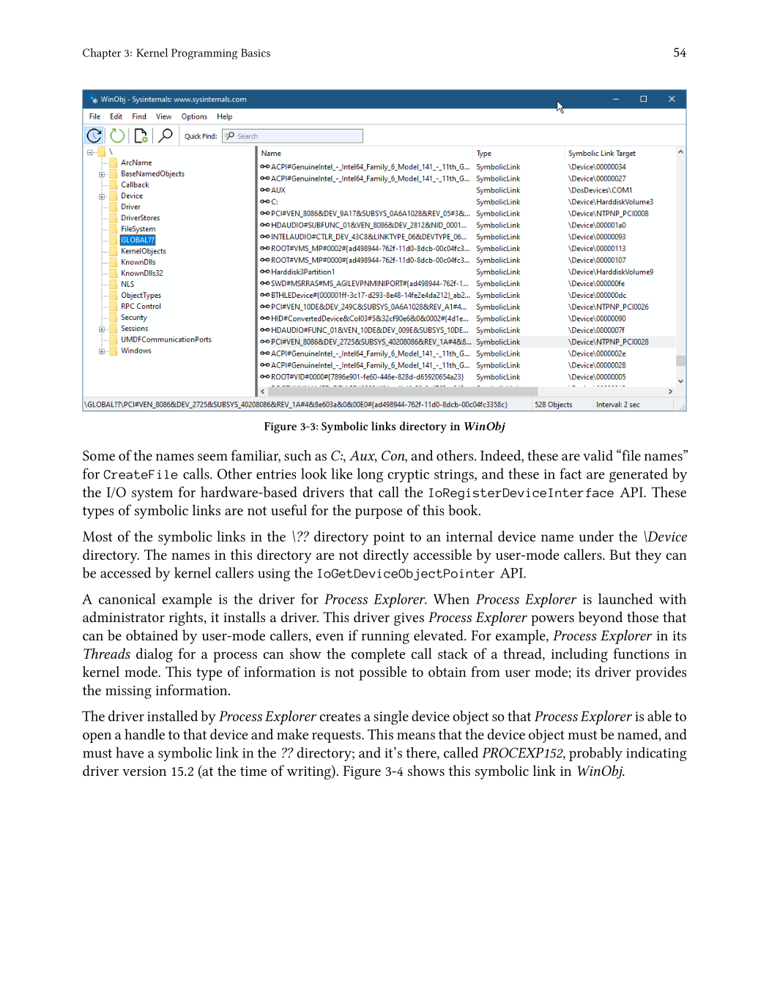
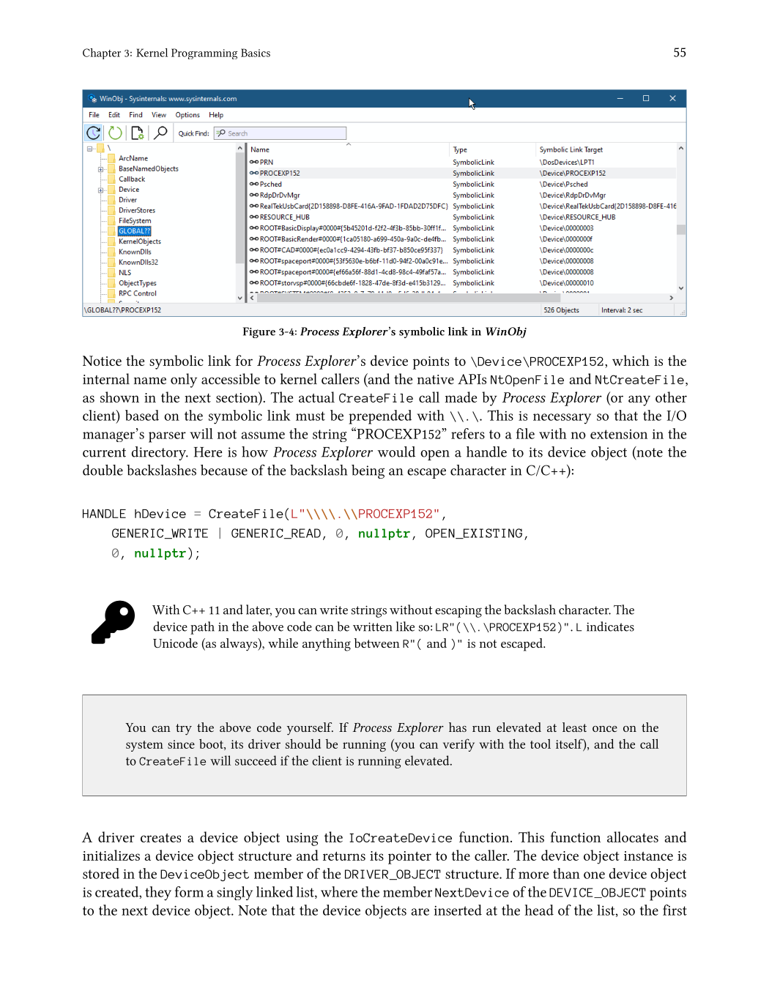
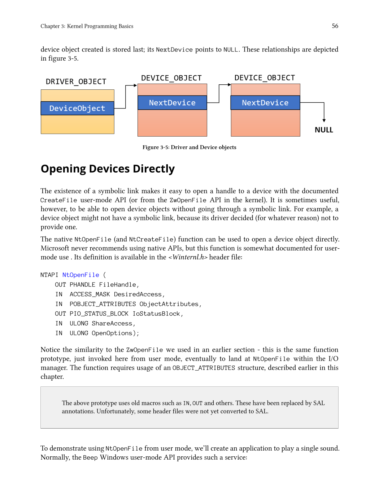
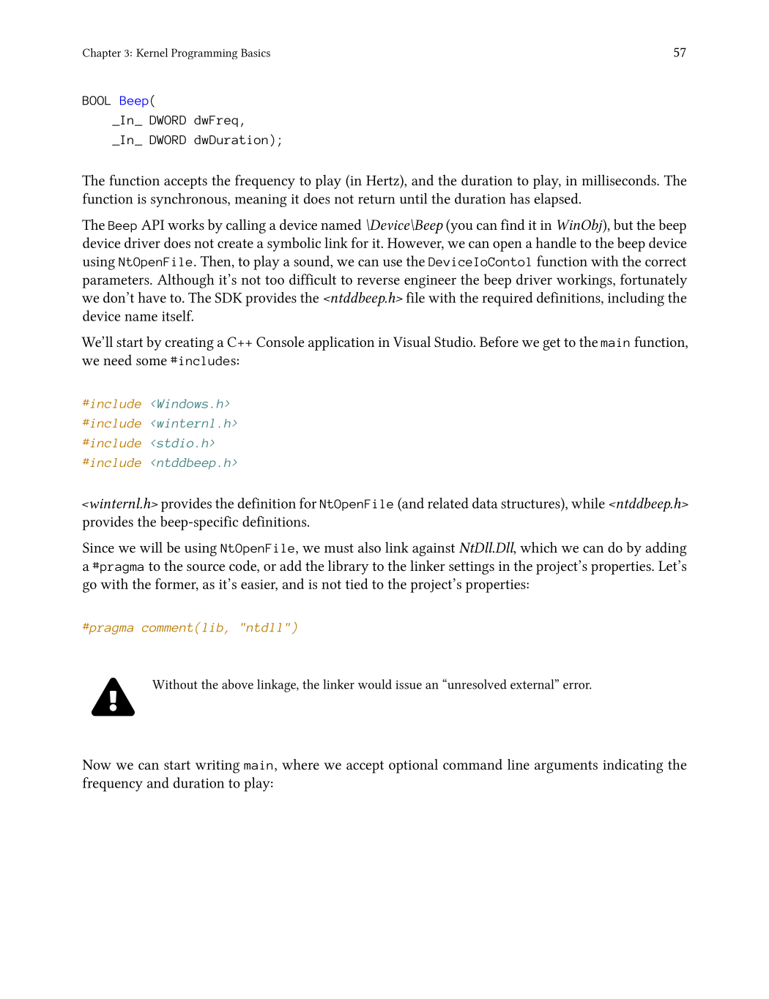
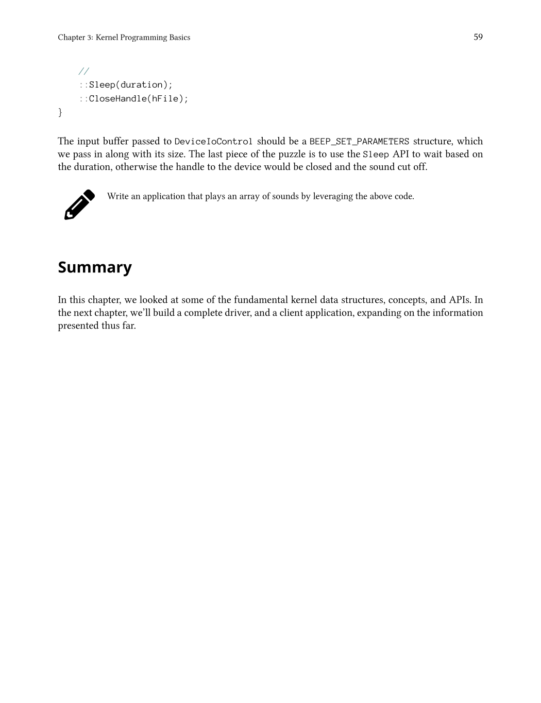

尽管驱动对象看起来像是客户端与之通信的一个不错的选择，但事实并非如此。客户端实际的通信终点是设备对象（device objects）。设备对象是半文档化的 `DEVICE_OBJECT` 结构的实例。没有设备对象，就没有可通信的对象。这意味着驱动程序至少应创建一个设备对象并为其命名，以便客户端可以联系它。

`CreateFile` 函数（及其变体）接受的第一个参数在文档中被称为“文件名”，但实际上它应指向设备对象的名称，其中实际的文件系统文件只是一种特殊情况。`CreateFile` 这个名字有些误导——“file”一词在这里指的是“文件对象（file object）”。打开一个文件或设备的句柄会创建一个内核结构 `FILE_OBJECT` 的实例，这是另一个半文档化的结构。

更准确地说，`CreateFile` 接受一个符号链接（symbolic link），这是一种内核对象，知道如何指向另一个内核对象。（你可以将符号链接想象成本质上类似于文件系统快捷方式。）所有可以从用户模式的 `CreateFile` 或 `CreateFile2` 调用使用的符号链接，都位于对象管理器目录 `??` 中。你可以使用Sysinternals的 `WinObj` 工具查看此目录的内容。图3-3显示了此目录（在 `WinObj` 中名为 `Global??`）。

                                  图3-3：WinObj中的符号链接目录

其中一些名称看起来很熟悉，例如 `C:`、`Aux`、`Con` 等。确实，这些是 `CreateFile` 调用的有效“文件名”。其他条目看起来像长的、含义不明的字符串，事实上，这些是由I/O系统为那些调用 `IoRegisterDeviceInterface` API的基于硬件的驱动程序生成的。对于本书而言，这些类型的符号链接用途不大。

`\??` 目录中的大多数符号链接都指向 `\Device` 目录下的一个内部设备名称。此目录中的名称不能被用户模式调用者直接访问。但内核模式调用者可以使用 `IoGetDeviceObjectPointer` API访问它们。

一个典型的例子是Process Explorer的驱动程序。当Process Explorer以管理员权限启动时，它会安装一个驱动程序。该驱动程序赋予Process Explorer超越用户模式调用者所能获得的权限，即使后者以提升的权限运行也是如此。例如，Process Explorer在其“线程”对话框中可以显示线程的完整调用栈，包括内核模式下的函数。这类信息无法从用户模式获得；其驱动程序提供了这些缺失的信息。

Process Explorer安装的驱动程序会创建一个设备对象，以便Process Explorer能够打开该设备的句柄并发出请求。这意味着该设备对象必须被命名，并且在 `??` 目录中必须有一个符号链接；它确实在那里，叫做 `PROCEXP152`，这可能表示驱动程序版本为15.2（在撰写本文时）。图3-4在WinObj中显示了此符号链接。

                              图3-4：WinObj中Process Explorer的符号链接

请注意，Process Explorer设备的符号链接指向 `\Device\PROCEXP152`，这是一个只有内核调用者（以及原生API `NtOpenFile` 

和 `NtCreateFile`，如下一节所示）才能访问的内部名称。Process Explorer（或任何其他客户端）基于符号链接进行的实际 `CreateFile` 调用必须在链接前加上 `\\.\`。这是必要的，这样I/O管理器的解析器才不会假设字符串“PROCEXP152”指的是当前目录下一个没有扩展名的文件。以下是Process Explorer如何打开其设备对象句柄的代码（注意双反斜杠，因为反斜杠在C/C++中是转义字符）：

```c
HANDLE hDevice = CreateFile(L"\\\\.\\PROCEXP152",
    GENERIC_WRITE | GENERIC_READ, 0, nullptr, OPEN_EXISTING,
    0, nullptr);
```
在C++ 11及更高版本中，你可以编写字符串而无需转义反斜杠字符。上面代码中的设备路径可以这样写：`LR"(\\.\PROCEXP152)"`。
             `L` 表示Unicode（一如既往），而 `R"(...)` 之间的任何内容都不会被转义。

        你可以自己尝试上述代码。如果Process Explorer自系统启动以来至少以提升权限运行过一次，那么它的驱动程序应该正在运行（你可以使用该工具本身验证），并且如果客户端以提升权限运行，则对 `CreateFile` 的调用将会成功。

驱动程序使用 `IoCreateDevice` 函数创建设备对象。该函数分配并初始化一个设备对象结构，并将其指针返回给调用者。设备对象实例存储在 `DRIVER_OBJECT` 结构的 `DeviceObject` 成员中。如果创建了多个设备对象，它们会形成一个单向链表，其中 `DEVICE_OBJECT` 的 `NextDevice` 成员指向下一个设备对象。请注意，设备对象插入在链表的头部，因此第一个创建的设备对象存储在最后；其 `NextDevice` 指向 `NULL`。这些关系如图3-5所示。

                                       图3-5：驱动对象与设备对象

### 直接打开设备

符号链接的存在使得使用已文档化的 `CreateFile` 用户模式API（或内核中的 `ZwOpenFile` API）打开设备句柄变得容易。然而，有时能够在不通过符号链接的情况下打开设备对象也很有用。例如，某个设备对象可能没有符号链接，因为其驱动程序（无论出于何种原因）决定不提供符号链接。

原生函数 `NtOpenFile`（和 `NtCreateFile`）可用于直接打开

设备对象。微软从不推荐使用原生API，但该函数针对用户模式的使用有一定程度的文档化。其定义位于 `<Winternl.h>` 头文件中：

```c
NTAPI NtOpenFile (
    OUT PHANDLE FileHandle,
    IN ACCESS_MASK DesiredAccess,
    IN POBJECT_ATTRIBUTES ObjectAttributes,
    OUT PIO_STATUS_BLOCK IoStatusBlock,
    IN ULONG ShareAccess,
    IN ULONG OpenOptions);
```
注意它与我们前面部分使用的 `ZwOpenFile` 的相似之处——这是相同的函数原型，只是这里从用户模式调用，最终会在I/O管理器中到达 `NtOpenFile`。该函数需要使用本章前面描述的 `OBJECT_ATTRIBUTES` 结构。

        上述原型使用了旧的宏，如 `IN`、`OUT` 等。这些已被SAL注释取代。不幸的是，有些头文件尚未转换为SAL。

为了演示如何从用户模式使用 `NtOpenFile`，我们将创建一个播放单次声音的应用程序。通常，Windows用户模式API `Beep` 提供这类服务：

```c
BOOL Beep(
    _In_ DWORD dwFreq,
    _In_ DWORD dwDuration);
```
该函数接受要播放的频率（以赫兹为单位）以及播放的持续时间（以毫秒为单位）。该函数是同步的，意味着它在持续时间结束之前不会返回。

`Beep` API 通过调用一个名为 `\Device\Beep` 的设备工作（你可以在WinObj中找到它），但蜂鸣器设备驱动程序没有为其创建符号链接。然而，我们可以使用 `NtOpenFile` 打开蜂鸣器设备的句柄。然后，要播放声音，我们可以使用带有正确参数的 `DeviceIoControl` 函数。尽管逆向工程蜂鸣器驱动程序的工作原理并不太难，但幸运的是我们不必这样做。SDK提供了 `<ntddbeep.h>` 文件，其中包含所需的定义，包括设备名称本身。

我们首先在Visual Studio中创建一个C++控制台应用程序。在进入主函数之前，我们需要一些 `#include`：

```c
#include <Windows.h>
#include <winternl.h>
#include <stdio.h>
#include <ntddbeep.h>
```
`<winternl.h>` 提供了 `NtOpenFile`（及相关数据结构）的定义，而 `<ntddbeep.h>` 提供了蜂鸣器特定的定义。

由于我们将使用 `NtOpenFile`，我们还必须链接到 `NtDll.Dll`，这可以通过在源代码中添加 `#pragma` 或在项目属性的链接器设置中添加库来完成。我们选择前者，因为它更简单，并且不依赖于项目的属性设置：

```c
#pragma comment(lib, "ntdll")
```
没有上述链接，链接器将报出“无法解析的外部符号”错误。

现在我们可以开始编写 `main` 函数，在其中我们接收可选的命令行参数来指示要播放的频率和持续时间：

```text
int main(int argc, const char* argv[]) {
```
```c
printf("beep [<频率> <持续时间_毫秒>]\n");
    int freq = 800, duration = 1000;
    if (argc > 2) {
        freq = atoi(argv[1]);
        duration = atoi(argv[2]);
    }
```
下一步是使用 `NtOpenFile` 打开设备句柄：

```c
HANDLE hFile;
OBJECT_ATTRIBUTES attr;
UNICODE_STRING name;

RtlInitUnicodeString(&name, L"\\Device\\Beep");
InitializeObjectAttributes(&attr, &name, OBJ_CASE_INSENSITIVE,
nullptr, nullptr);
IO_STATUS_BLOCK ioStatus;
NTSTATUS status = ::NtOpenFile(&hFile, GENERIC_WRITE, &attr, &ioStatus, 0, 0);
```
初始化设备名称的行可以替换为：

```c
RtlInitUnicodeString(&name, DD_BEEP_DEVICE_NAME_U);
```
`DD_BEEP_DEVICE_NAME_U` 宏是作为 `<ntddbeep.h>` 的一部分方便提供的。

如果调用成功，我们就可以播放声音。为此，我们使用 `<ntddbeep.h>` 中定义的控制代码来调用 `DeviceIoControl`，并使用其中定义的结构来填充频率和持续时间：

```c
if (NT_SUCCESS(status)) {
    BEEP_SET_PARAMETERS params;
    params.Frequency = freq;
    params.Duration = duration;
    DWORD bytes;
    //
    // 播放声音
    //
    printf("正在播放 频率: %u, 持续时间: %u\n", freq, duration);
    ::DeviceIoControl(hFile, IOCTL_BEEP_SET, &params, sizeof(params),
        nullptr, 0, &bytes, nullptr);
     //
     // 声音开始播放，调用立即返回
     // 等待以使应用程序不关闭
     //
     ::Sleep(duration);
     ::CloseHandle(hFile);
}
```
传递给 `DeviceIoControl` 的输入缓冲区应该是一个 `BEEP_SET_PARAMETERS` 结构，我们将其及其大小一起传入。最后一个难题是使用 `Sleep` API 根据持续时间进行等待，否则设备句柄将被关闭，声音也会被切断。

             编写一个应用程序，利用上述代码来播放一组声音。

## 总结

在本章中，我们探讨了一些基本的内核数据结构、概念和API。在下一章中，我们将构建一个完整的驱动程序和客户端应用程序，对迄今为止所介绍的信息进行扩展。

# Chapter 4: Driver from Start to Finish

第 4 章：从始至终构建一个驱动程序

在本章中，我们将运用前几章学到的许多概念，构建一个简单但完整的驱动程序及配套的客户端应用程序，并补充一些之前未详细说明的细节。我们将部署驱动程序并使用其功能——在内核模式下执行一些在用户模式下难以或无法实现的操作。

本章内容：
    • 引言
    • 驱动程序初始化
    • 客户端代码
    • 创建与关闭分发例程
    • 写入分发例程
    • 安装与测试

引言

我们将通过一个简单的内核驱动程序来解决使用 Windows API 设置线程优先级不够灵活的问题。在用户模式下，线程的优先级由其进程的优先级类（Priority Class）与每个线程的偏移量组合决定，可用的级别数量有限。

更改进程的优先级类（在任务管理器中显示为“基本优先级”列）可以通过 SetPriorityClass 函数实现，该函数接受一个进程句柄以及六种受支持的优先级类之一。每个优先级类对应一个优先级级别，该级别是在该进程内创建的线程的默认优先级。特定线程的优先级可以通过 SetThreadPriority 函数更改，该函数接受一个线程句柄以及几个对应于基本优先级类的偏移常量之一。表 4-1 展示了基于进程优先级类和线程优先级偏移量的可用线程优先级。

                            表 4-1：使用 Windows API 时线程优先级的合法取值
  优先级类        - 饱和   -2   -1   0（默认）  +1   +2   + 饱和   备注
  Idle（空闲）       1      2    3      4        5    6     15    任务管理器将 Idle 显示为
                                                                   “低”
  Below Normal       1      4    5      6        7    8     15
  （低于正常）
  Normal（正常）      1      6    7      8        9   10     15
  Above Normal       1      8    9     10       11   12     15
  （高于正常）
  High（高）          1     11   12     13       14   15     15    仅六个级别可用（而非七个）。
  Real-time（实时）  16     22   23     24       25   26     31    所有 16 到 31 之间的级别
                                                                   均可选择。
SetThreadPriority 可接受的值指定偏移量。五个级别对应于偏移量 -2 到 +2：THREAD_PRIORITY_LOWEST（-2）、THREAD_PRIORITY_BELOW_NORMAL（-1）、THREAD_PRIORITY_NORMAL（0）、THREAD_PRIORITY_ABOVE_NORMAL（+1）、THREAD_PRIORITY_HIGHEST（+2）。其余两个级别称为饱和级别，可将优先级设置为该优先级类支持的两个极端：THREAD_PRIORITY_IDLE（-饱和）和 THREAD_PRIORITY_TIME_CRITICAL（+饱和）。

以下代码示例将当前线程的优先级更改为 11：
```c
SetPriorityClass(GetCurrentProcess(),
```
ABOVE_NORMAL_PRIORITY_CLASS);     // 进程基本优先级=10
```c
SetThreadPriority(GetCurrentThread(),
```
THREAD_PRIORITY_ABOVE_NORMAL);    // 线程偏移量 +1
              实时优先级类并不意味着 Windows 是一个实时操作系统；Windows 并不提供真正的实时操作系统通常所具备的一些定时保证。此外，由于实时优先级非常高，会与许多执行重要工作的内核线程竞争，因此此类进程必须以管理员权限运行；否则，尝试将优先级类设置为实时会导致其值被设为高。
              实时优先级与其他较低优先级类之间还有其他区别。更多信息请参阅《Windows Internals》一书。
表 4-1 非常清晰地展示了我们要解决的问题。只有一小部分优先级可以直接设置。我们想要创建一个驱动程序来绕过这些限制，允许将线程的优先级设置为任意数值，而不受其进程优先级类的影响。

驱动程序初始化
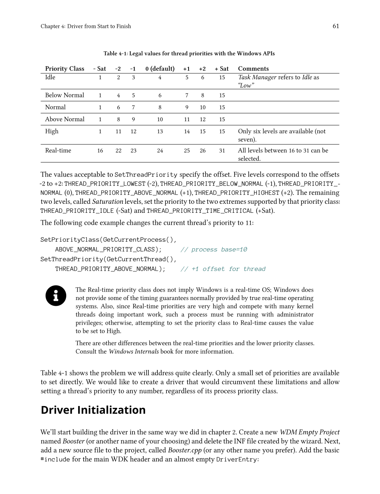

我们将按照第 2 章中的相同方式开始构建驱动程序。创建一个新的 WDM 空项目，命名为 Booster（或你选择的其他名称），并删除向导创建的 INF 文件。接下来，向项目中添加一个新的源文件，命名为 Booster.cpp（或你喜欢的任何名称）。添加主要的 WDK 头文件 include 和一个几乎为空的 DriverEntry：
```c
#include <ntddk.h>
extern "C" NTSTATUS
DriverEntry(PDRIVER_OBJECT DriverObject, PUNICODE_STRING RegistryPath) {
    return STATUS_SUCCESS;
}
```
大多数软件驱动程序需要在 DriverEntry 中完成以下操作：
     • 设置一个卸载（Unload）例程。
     • 设置驱动程序支持的分发例程。
     • 创建一个设备对象（device object）。
     • 创建一个指向该设备对象的符号链接（symbolic link）。
一旦所有这些操作完成，驱动程序就可以接收请求了。

第一步是添加一个 Unload 例程，并从驱动程序对象中指向它。以下是包含 Unload 例程的新 DriverEntry：
```c
// 原型
void BoosterUnload(PDRIVER_OBJECT DriverObject);
// DriverEntry
extern "C" NTSTATUS
DriverEntry(PDRIVER_OBJECT DriverObject, PUNICODE_STRING RegistryPath) {
    DriverObject->DriverUnload = BoosterUnload;
      return STATUS_SUCCESS;
}
void BoosterUnload(PDRIVER_OBJECT DriverObject) {
    // 暂时为空
}
```
当 DriverEntry 中执行的实际工作需要撤销时，我们会在 Unload 例程中添加相应的代码。

接下来，我们需要设置想要支持的分发例程。几乎所有驱动程序都必须支持 IRP_MJ_CREATE 和 IRP_MJ_CLOSE，否则无法为驱动程序的任何设备打开句柄。因此，我们在 DriverEntry 中添加以下内容：
```c
DriverObject->MajorFunction[IRP_MJ_CREATE] = BoosterCreateClose;
DriverObject->MajorFunction[IRP_MJ_CLOSE] = BoosterCreateClose;
```
我们将创建和关闭的主功能函数指向了同一个例程。这是因为，正如我们稍后将看到的，它们将执行相同的操作：简单地批准请求。在更复杂的情况下，它们可以是不同的函数，例如在创建（Create）情况下，驱动程序可以检查调用者是谁，只允许经批准的调用者成功打开句柄。

所有主功能函数具有相同的原型（它们是函数指针数组的一部分），因此我们必须为 BoosterCreateClose 添加原型。这些函数的原型如下：
```c
NTSTATUS BoosterCreateClose(PDEVICE_OBJECT DeviceObject, PIRP Irp);
```
该函数必须返回 NTSTATUS，并接受一个指向设备对象的指针和一个指向 I/O 请求包（IRP）的指针。IRP 是所有类型请求中存储请求信息的主要对象。我们将在第 7 章中深入探讨 IRP，但在本章后面，由于完成驱动程序需要它，我们会先了解一些基础知识。

向驱动程序传递信息

我们设置的创建和关闭操作是必需的，但肯定还不够。我们需要一种方法来告诉驱动程序更改哪个线程以及将其优先级设置为何值。从用户模式客户端的角度来看，它可以使用的三个基本函数是：WriteFile、ReadFile 和 DeviceIoControl。

对于我们的驱动程序，可以使用 WriteFile 或 DeviceIoControl。Read 不适用，因为我们是向驱动程序传递信息，而不是从驱动程序读取信息。那么，WriteFile 和 DeviceIoControl 哪个更合适呢？这主要取决于个人偏好，但一般的共识是，如果在逻辑上确实是一个写操作，则使用 Write；对于其他情况，DeviceIoControl 更受欢迎，因为它是一种在驱动程序之间传递数据的通用机制。

由于更改线程优先级不是一个纯粹的写操作，使用 DeviceIoControl 更有意义，但我们将使用 WriteFile，因为它处理起来稍微简单一些。我们将在第 7 章中详细介绍所有细节。

WriteFile 具有以下原型：
```c
BOOL WriteFile(
    _In_        HANDLE hFile,
    _In_reads_bytes_opt_(nNumberOfBytesToWrite) LPCVOID lpBuffer,
    _In_        DWORD nNumberOfBytesToWrite,
    _Out_opt_   LPDWORD lpNumberOfBytesWritten,
    _Inout_opt_ LPOVERLAPPED lpOverlapped);
```
我们的驱动程序必须通过向驱动程序对象的 MajorFunction 数组的 IRP_MJ_WRITE 索引分配一个函数指针，来导出其对写操作的处理能力：
```c
DriverObject->MajorFunction[IRP_MJ_WRITE] = BoosterWrite;
```
BoosterWrite 必须与所有主功能码处理程序具有相同的原型：
```c
NTSTATUS BoosterWrite(PDEVICE_OBJECT DeviceObject, PIRP Irp);
```
客户端/驱动程序通信协议

鉴于我们使用 WriteFile 进行客户端/驱动程序通信，现在必须定义实际语义。WriteFile 允许传入一个缓冲区，我们需要为其定义适当的语义。此缓冲区应包含驱动程序执行其工作所需的两条信息：线程 ID 和要为其设置的优先级。

这些信息必须对驱动程序和客户端都可用。客户端提供数据，驱动程序根据数据执行操作。这意味着这些定义必须放在一个单独的文件中，该文件必须同时被驱动程序和客户端代码包含。

为此，我们将向驱动程序项目添加一个名为 BoosterCommon.h 的头文件。该文件稍后也将被用户模式客户端使用。

在此文件中，我们需要定义要通过 WriteFile 缓冲区传递给驱动程序的数据结构，其中包含线程 ID 和要设置的优先级：
```c
struct ThreadData {
    ULONG ThreadId;
    int Priority;
};
```
我们需要线程的唯一 ID 和目标优先级。线程 ID 是 32 位无符号整数，因此我们选择 ULONG 作为其类型。优先级应该是 1 到 31 之间的数字，一个简单的 32 位整数即可。
        我们通常不能使用 DWORD——一个在用户模式头文件中定义的常见类型——因为它在内核模式头文件中没有定义。而 ULONG 在两者中都有定义。我们自己定义它虽然很容易，但 ULONG 本质上是一样的。
创建设备对象

我们还需要在 DriverEntry 中进行更多初始化。目前，我们没有任何设备对象，因此无法打开句柄并访问驱动程序。一个典型的软件驱动程序只需要一个设备对象，并带有一个指向它的符号链接，以便用户模式客户端能够通过 CreateFile 轻松获取句柄。

创建设备对象需要调用 IoCreateDevice API，其声明如下（为清晰起见，省略/简化了一些 SAL 注解）：
```c
NTSTATUS IoCreateDevice(
    _In_        PDRIVER_OBJECT DriverObject,
    _In_        ULONG DeviceExtensionSize,
    _In_opt_    PUNICODE_STRING DeviceName,
    _In_        DEVICE_TYPE DeviceType,
    _In_        ULONG DeviceCharacteristics,
    _In_        BOOLEAN Exclusive,
    _Outptr_    PDEVICE_OBJECT *DeviceObject);
```
IoCreateDevice 的参数描述如下：
     • DriverObject - 此设备对象所属的驱动程序对象。此处只需传入传递给 DriverEntry 函数的驱动程序对象即可。
     • DeviceExtensionSize - 除了 sizeof(DEVICE_OBJECT) 之外额外分配的字节数。对于将某些数据结构与设备关联起来非常有用。对于只创建一个设备对象的软件驱动程序来说用处不大，因为设备所需的状态可以直接由全局变量管理。
     • DeviceName - 内部设备名称，通常在 \Device 对象管理器目录下创建。
     • DeviceType - 与某些类型的基于硬件的驱动程序相关。对于软件驱动程序，应使用值 FILE_DEVICE_UNKNOWN。
     • DeviceCharacteristics - 一组标志，与某些特定驱动程序相关。软件驱动程序指定 0 或 FILE_DEVICE_SECURE_OPEN（如果它们支持真正的命名空间，软件驱动程序很少需要此功能）。有关设备安全性的更多信息将在第 8 章中介绍。
     • Exclusive - 是否允许同时有多个文件对象打开同一个设备？大多数驱动程序应指定 FALSE，但在某些情况下 TRUE 更为合适；它强制设备一次只能有一个客户端。
     • DeviceObject - 返回的指针，作为指针的地址（即指向指针的指针）传入。如果成功，IoCreateDevice 将从非分页池中分配该结构，并将结果指针存储在解引用后的参数中。

在调用 IoCreateDevice 之前，我们必须创建一个 UNICODE_STRING 来保存内部设备名称：
```c
UNICODE_STRING devName = RTL_CONSTANT_STRING(L"\\Device\\Booster");
// 或者，
// RtlInitUnicodeString(&devName, L"\\Device\\Booster");
```
设备名称可以是任意名称，但应位于 \Device 对象管理器目录下。有两种方法可以使用常量字符串初始化 UNICODE_STRING。第一种是使用 RtlInitUnicodeString，它完全可行。但 RtlInitUnicodeString 必须计算字符串中的字符数，以便正确初始化 Length 和 MaximumLength。在这种情况下问题不大，但还有一种更快的方法——使用 RTL_CONSTANT_STRING 宏，该宏在编译时静态计算字符串的长度，这意味着它仅对字面字符串有效。

现在，我们可以调用 IoCreateDevice 函数了：
```c
PDEVICE_OBJECT DeviceObject;
NTSTATUS status = IoCreateDevice(
```
DriverObject,        // 我们的驱动程序对象
    0,                   // 无需额外字节
    &devName,            // 设备名称
    FILE_DEVICE_UNKNOWN, // 设备类型
    0,                   // 特征标志
    FALSE,               // 非独占
    &DeviceObject);      // 结果指针
```c
if (!NT_SUCCESS(status)) {
    KdPrint(("无法创建设备对象 (0x%08X)\n", status));
    return status;
}
```
如果一切顺利，我们现在就有了一个指向我们设备对象的指针。下一步是通过提供一个符号链接，使该设备对象对用户模式调用者可用。创建符号链接需要调用 IoCreateSymbolicLink：
```c
NTSTATUS IoCreateSymbolicLink(
    _In_ PUNICODE_STRING SymbolicLinkName,
    _In_ PUNICODE_STRING DeviceName);
```
以下代码行创建了一个符号链接并将其连接到我们的设备对象：
```c
UNICODE_STRING symLink = RTL_CONSTANT_STRING(L"\\??\\Booster");
status = IoCreateSymbolicLink(&symLink, &devName);
if (!NT_SUCCESS(status)) {
    KdPrint(("创建符号链接失败 (0x%08X)\n", status));
    IoDeleteDevice(DeviceObject);   // 重要！
    return status;
}
```
IoCreateSymbolicLink 通过接受符号链接和链接目标来完成工作。请注意，如果创建失败，我们必须撤销到目前为止所做的所有操作——在这种情况下，仅仅是设备对象已创建这一事实——通过调用 IoDeleteDevice 来撤销。更一般地说，如果 DriverEntry 返回任何失败状态，Unload 例程将不会被调用。如果我们有更多的初始化步骤，在发生失败时，我们必须记住撤销到那时为止的所有操作。我们将在第 6 章中看到一种更优雅的处理方式。

一旦我们设置好符号链接和设备对象，DriverEntry 就可以返回成功状态，表示驱动程序现已准备好接收请求。

在继续之前，我们不要忘记 Unload 例程。假设 DriverEntry 成功完成，Unload 例程必须撤销 DriverEntry 中所做的任何操作。在我们的例子中，有两件事需要撤销：设备对象的创建和符号链接的创建。我们将以相反的顺序撤销它们：
```c
void BoosterUnload(_In_ PDRIVER_OBJECT DriverObject) {
UNICODE_STRING symLink = RTL_CONSTANT_STRING(L"\\??\\Booster");
    // 删除符号链接
    IoDeleteSymbolicLink(&symLink);
      // 删除设备对象
      IoDeleteDevice(DriverObject->DeviceObject);
}
```
请注意，设备对象指针是从驱动程序对象中提取的，因为这是我们在 Unload 例程中唯一可用的参数。当然，可以将设备对象指针存储在一个全局变量中，然后在这里直接访问，但没有这个必要。应尽量减少全局变量的使用。

客户端代码

至此，编写用户模式客户端代码的时机已经成熟。客户端所需的一切都已经定义好了。

向解决方案中添加一个新的 C++ 控制台应用程序项目，命名为 Boost（或你选择的其他名称）。Visual Studio 向导应创建一个包含某种“hello world”代码的源文件。你可以安全地删除该文件的所有内容。

首先，我们在 Boost.cpp 文件中添加所需的 #includes：
```c
#include <windows.h>
#include <stdio.h>
#include "..\Booster\BoosterCommon.h"
```
请注意，我们包含了由驱动程序创建的、旨在与客户端共享的公共头文件。

将 main 函数修改为接受命令行参数。我们将通过命令行参数接受一个线程 ID 和一个优先级，并请求驱动程序将线程的优先级更改为给定的值。

```text
int main(int argc, const char* argv[]) {
    if (argc < 3) {
        printf("Usage: Boost <threadid> <priority>\n");
        return 0;
    }
      //
```
```c
// 从命令行提取参数
      //
      int tid = atoi(argv[1]);
      int priority = atoi(argv[2]);
```
接下来，我们需要获取一个指向我们设备的句柄。CreateFile 的“文件名”应该是符号链接加上 "\\.\" 前缀。整个调用如下所示：
```c
HANDLE hDevice = CreateFile(L"\\\\.\\Booster", GENERIC_WRITE,
    0, nullptr, OPEN_EXISTING, 0, nullptr);
if (hDevice == INVALID_HANDLE_VALUE)
    return Error("打开设备失败");
```
Error 函数只是打印一些文本以及最后一个 Windows API 错误：
```text
int Error(const char* message) {
    printf("%s (error=%u)\n", message, GetLastError());
    return 1;
}
```
CreateFile 调用应在其 IRP_MJ_CREATE 分发例程中到达驱动程序。如果此时驱动程序未加载——意味着没有设备对象和符号链接——我们将收到错误号 2（文件未找到）。

既然我们有了一个指向我们设备的有效句柄，就可以开始设置 Write 调用了。首先，我们需要创建一个 ThreadData 结构并填充详细信息：
```c
ThreadData data;
data.ThreadId = tid;
data.Priority = priority;
```
现在我们准备调用 WriteFile，然后关闭设备句柄：
```c
DWORD returned;
BOOL success = WriteFile(hDevice,
```
&data, sizeof(data),          // 缓冲区及其长度
```c
&returned, nullptr);
if (!success)
    return Error("优先级更改失败！");
printf("优先级更改成功！\n");
CloseHandle(hDevice);
```
对 WriteFile 的调用通过调用 IRP_MJ_WRITE 主功能函数例程来访问驱动程序。

至此，客户端代码已编写完毕。剩下的就是在驱动程序端实现我们已声明的分发例程。

创建与关闭分发例程

现在我们准备实现驱动程序定义的三个分发例程。最简单的莫过于创建和关闭例程。所需要的只是以成功状态完成请求。

以下是完整的创建/关闭分发例程实现：
```c
NTSTATUS BoosterCreateClose(PDEVICE_OBJECT DeviceObject, PIRP Irp) {
    UNREFERENCED_PARAMETER(DeviceObject);
      Irp->IoStatus.Status = STATUS_SUCCESS;
      Irp->IoStatus.Information = 0;
      IoCompleteRequest(Irp, IO_NO_INCREMENT);
      return STATUS_SUCCESS;
}
```
每个分发例程都接受目标设备对象和 I/O 请求包（IRP）。我们不太关心设备对象，因为我们只有一个，它必定是我们在 DriverEntry 中创建的那个。而 IRP 却极其重要。我们将在第 6 章中深入研究 IRP，但现在需要快速了解一下。

IRP 是一个半公开的结构，代表一个请求，通常来自执行体中的某个管理器：I/O 管理器、即插即用管理器或电源管理器。对于一个简单的软件驱动程序来说，这很可能是 I/O 管理器。无论 IRP 的创建者是谁，驱动程序的目的就是处理该 IRP，这意味着查看请求的详细信息并执行完成该请求所需的工作。

对驱动程序发出的每个请求总是封装在 IRP 中到达，无论是 Create、Close、Read、Write 还是任何其他 IRP。通过查看 IRP 的成员，我们可以确定请求的类型和详细信息（从技术上讲，分发例程本身就是根据请求类型设置好的，因此在大多数情况下，你已经知道请求类型）。值得一提的是，IRP 永远不会单独出现；它总是伴随着一个或多个 IO_STACK_LOCATION 类型的结构。在我们的驱动程序这样的简单情况下，只有一个 IO_STACK_LOCATION。在更复杂的情况下，如果我们的驱动程序上方或下方存在过滤器驱动程序，则会存在多个 IO_STACK_LOCATION 实例，设备栈中的每一层都有一个。（我们将在第 7 章中更详细地讨论这一点。）简而言之，我们所需的一些信息位于基础的 IRP 结构中，而另一些则位于代表设备栈中“我们的层”的 IO_STACK_LOCATION 中。

在 Create 和 Close 的情况下，我们不需要查看任何成员。我们只需要在 IRP 的 IoStatus 成员（类型为 IO_STATUS_BLOCK）中设置完成状态，该成员包含两个字段：
     • Status (NTSTATUS) - 指示此请求应完成的状态。
     • Information (ULONG_PTR) - 一个多态成员，在不同的请求类型中含义不同。在 Create 和 Close 的情况下，值为零即可。

为了完成 IRP，我们调用 IoCompleteRequest。此函数有很多工作要做，但基本上它就是将 IRP 传播回其创建者（通常是 I/O 管理器），然后该管理器通知客户端操作已完成并释放 IRP。第二个参数是驱动程序可以提供给其客户端的临时优先级提升值。在大多数软件驱动程序中，值为零即可（IO_NO_INCREMENT 定义为 0）。尤其是在请求同步完成的情况下，调用者没有理由获得优先级提升。关于此函数的更多信息将在第 7 章中提供。

最后要做的是返回与放入 IRP 状态相同的状态。这看似无用的重复，但却是必要的（原因将在后面的章节中明确）。
              你可能会倾向于像这样编写 BoosterCreateClose 的最后一行：
              return Irp->IoStatus.Status; 以便返回值始终与存储在 IRP 中的状态一致。但是，这段代码有缺陷，在大多数情况下会导致蓝屏死机（BSOD）。原因是，在调用 IoCompleteRequest 之后，IRP 指针应被视为“有毒”的，因为它很可能已经被 I/O 管理器释放了。
写入分发例程
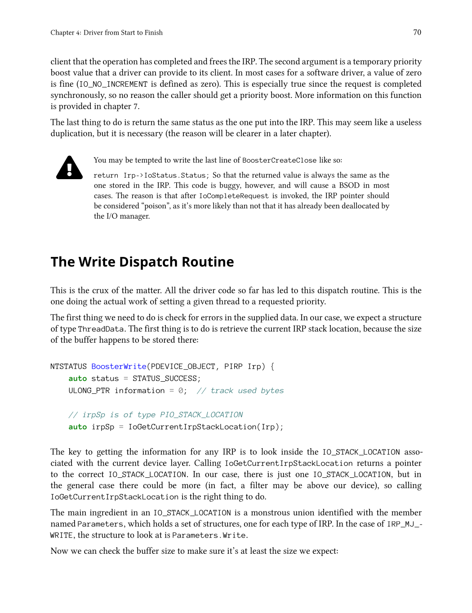
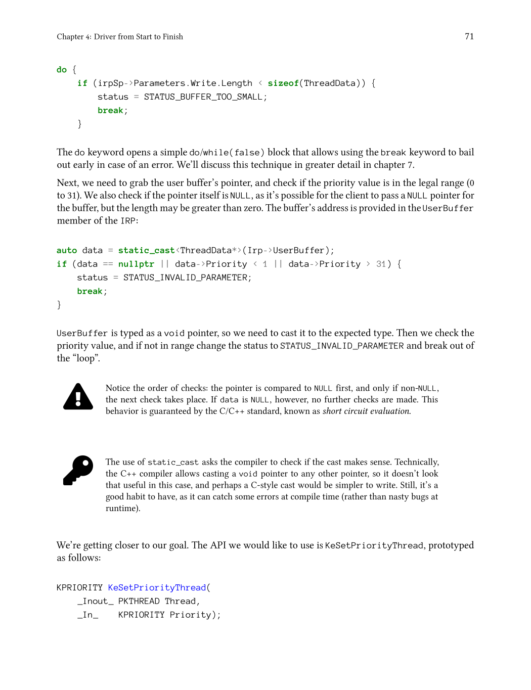
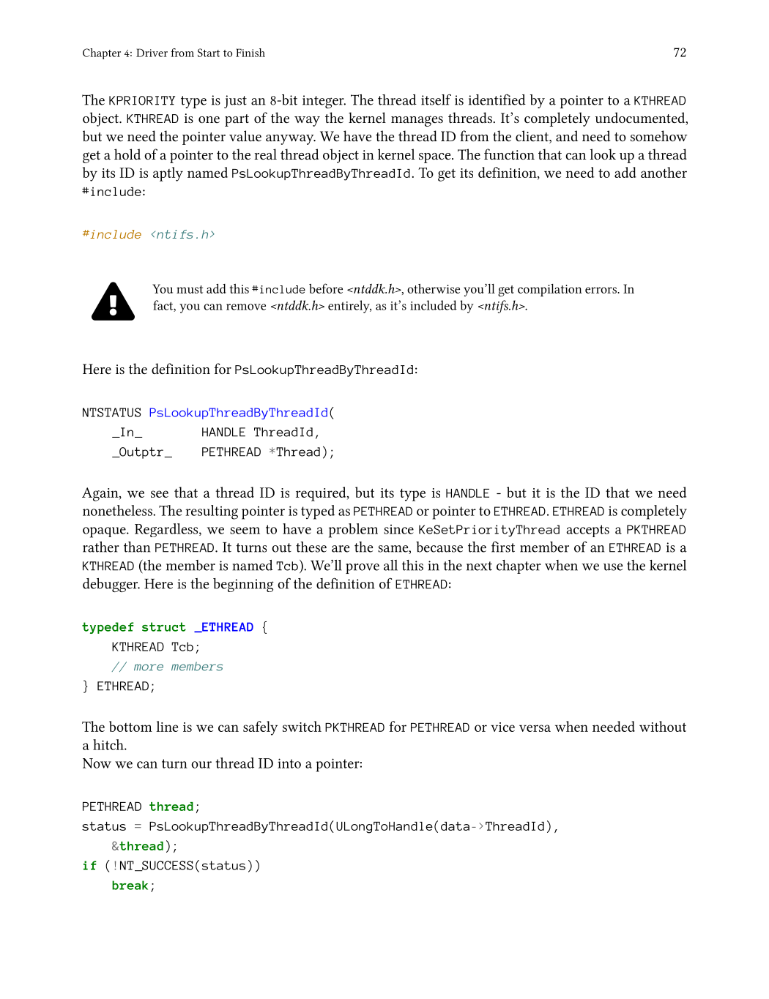

这是问题的关键所在。到目前为止，所有驱动程序代码都导向了这个分发例程。正是这个例程执行将给定线程设置为请求优先级的实际工作。

我们需要做的第一件事是检查所提供数据中的错误。在我们的例子中，我们期望接收到一个 ThreadData 类型的结构。首先要做的是获取当前的 IRP 栈位置，因为缓冲区的大小恰好存储在那里：
```c
NTSTATUS BoosterWrite(PDEVICE_OBJECT, PIRP Irp) {
    auto status = STATUS_SUCCESS;
    ULONG_PTR information = 0; // 跟踪已使用的字节数
      // irpSp 的类型为 PIO_STACK_LOCATION
      auto irpSp = IoGetCurrentIrpStackLocation(Irp);
```
获取任何 IRP 信息的关键在于查看与当前设备层关联的 IO_STACK_LOCATION。调用 IoGetCurrentIrpStackLocation 将返回一个指向正确 IO_STACK_LOCATION 的指针。在我们的例子中，只有一个 IO_STACK_LOCATION，但一般情况下可能有多个（实际上，我们的设备上方可能有一个过滤器），因此调用 IoGetCurrentIrpStackLocation 是正确的做法。

IO_STACK_LOCATION 的主要组成部分是一个庞大的联合体（union），通过名为 Parameters 的成员标识，它包含一组结构，每个结构对应一种 IRP 类型。对于 IRP_MJ_WRITE，需要查看的结构是 Parameters.Write。

现在我们可以检查缓冲区大小，确保它至少是我们预期的大小：
do {
```c
if (irpSp->Parameters.Write.Length < sizeof(ThreadData)) {
        status = STATUS_BUFFER_TOO_SMALL;
        break;
    }
```
do 关键字开启了一个简单的 do/while(false) 块，允许在发生错误时使用 break 关键字提前跳出。我们将在第 7 章中更详细地讨论这种技术。

接下来，我们需要获取用户缓冲区的指针，并检查优先级值是否在合法范围内（0 到 31）。我们还要检查指针本身是否为 NULL，因为客户端可能为缓冲区传递一个 NULL 指针，但长度可能大于零。缓冲区的地址在 IRP 的 UserBuffer 成员中提供：
```c
auto data = static_cast<ThreadData*>(Irp->UserBuffer);
if (data == nullptr || data->Priority < 1 || data->Priority > 31) {
    status = STATUS_INVALID_PARAMETER;
    break;
}
```
UserBuffer 的类型是 void 指针，所以我们需要将其强制转换为预期的类型。然后我们检查优先级值，如果不在范围内，则将状态更改为 STATUS_INVALID_PARAMETER 并跳出“循环”。
              请注意检查的顺序：首先将指针与 NULL 进行比较，只有在非 NULL 时才会进行后续检查。但是，如果 data 为 NULL，则不会进行任何进一步的检查。这种行为由 C/C++ 标准保证，称为短路求值。
              使用 static_cast 要求编译器检查强制转换是否合理。从技术上讲，C++ 编译器允许将 void 指针强制转换为任何其他指针，因此在这种情况下并不显得特别有用，也许 C 风格的强制转换写起来更简单。尽管如此，这是一个好习惯，因为它可以在编译时捕获一些错误（而不是在运行时出现难以排查的错误）。
我们离目标越来越近了。我们想要使用的 API 是 KeSetPriorityThread，其原型如下：
KPRIORITY KeSetPriorityThread(
```c
_Inout_ PKTHREAD Thread,
    _In_    KPRIORITY Priority);
```
KPRIORITY 类型只是一个 8 位整数。线程本身由指向 KTHREAD 对象的指针标识。KTHREAD 是内核管理线程的一部分。它完全未文档化，但我们无论如何都需要该指针值。我们从客户端获得了线程 ID，需要以某种方式获取指向内核空间中真实线程对象的指针。可以通过线程 ID 查找线程的函数恰当地命名为 PsLookupThreadByThreadId。要获取其定义，我们需要添加另一个 #include：
```c
#include <ntifs.h>
```
你必须将此 #include 添加在 <ntddk.h> 之前，否则会出现编译错误。实际上，你可以完全移除 <ntddk.h>，因为它已包含在 <ntifs.h> 中。
以下是 PsLookupThreadByThreadId 的定义：
```c
NTSTATUS PsLookupThreadByThreadId(
    _In_        HANDLE ThreadId,
    _Outptr_    PETHREAD *Thread);
```
再次看到，需要一个线程 ID，但其类型是 HANDLE——不过我们需要的只是 ID。结果指针的类型为 PETHREAD，即指向 ETHREAD 的指针。ETHREAD 是完全不透明的。尽管如此，我们似乎遇到了一个问题，因为 KeSetPriorityThread 接受的是 PKTHREAD 而不是 PETHREAD。事实证明它们是相同的，因为 ETHREAD 的第一个成员就是 KTHREAD（该成员名为 Tcb）。我们将在下一章使用内核调试器时证明这一切。以下是 ETHREAD 定义的开头部分：
```c
typedef struct _ETHREAD {
    KTHREAD Tcb;
    // 更多成员
} ETHREAD;
```
底线是，我们可以在需要时安全地将 PKTHREAD 替换为 PETHREAD，反之亦然，而不会出现任何问题。

现在我们可以将线程 ID 转化为指针：
```c
PETHREAD thread;
```
status = PsLookupThreadByThreadId(ULongToHandle(data->ThreadId),
```c
&thread);
if (!NT_SUCCESS(status))
    break;
```
调用 PsLookupThreadByThreadId 可能会失败，主要原因是指定的线程 ID 没有引用系统中的任何线程。如果调用失败，我们简单地 break 并让得到的 NTSTATUS 从“循环”中传播出去。

我们终于准备好更改线程的优先级了。但是等等——如果在最后一次调用成功后，线程在我们设置新优先级之前终止了怎么办？请放心，这不会发生。从技术上讲，此时线程可以终止（从执行的角度来看），但这不会使我们的指针成为悬空指针。这是因为，如果查找函数成功，它会增加内核线程对象的引用计数，因此在我们显式减少引用计数之前，它不会终止。

以下是执行优先级更改的调用：
```c
auto oldPriority = KeSetPriorityThread(thread, data->Priority);
KdPrint(("线程 %u 的优先级从 %d 更改为 %d 成功！\n",
    data->ThreadId, oldPriority, data->Priority));
```
我们获取到了旧的优先级，并为了调试目的通过 KdPrint 输出。现在剩下的就是减少线程对象的引用计数；否则，我们将面临泄漏（线程对象将永远不会终止），这个问题只有在下一次系统启动时才能解决。完成此任务的函数是 ObDereferenceObject：
```c
ObDereferenceObject(thread);
```
我们还应该向客户端报告我们使用了提供的缓冲区。这就是 information 变量发挥作用的地方：
```c
information = sizeof(data);
```
在完成 IRP 之前，我们会将该值写入 IRP。这个值会作为客户端 WriteFile 调用的倒数第二个参数返回。现在剩下的就是关闭 while“循环”，并使用我们当时得到的任何状态完成 IRP。
```c
// 结束 while "循环"
      } while (false);
      //
      // 使用此时获得的状态完成 IRP
      //
      Irp->IoStatus.Status = status;
      Irp->IoStatus.Information = information;
      IoCompleteRequest(Irp, IO_NO_INCREMENT);
      return status;
}
```
我们就完成了！作为参考，以下是完整的 IRP_MJ_WRITE 处理程序：
```c
NTSTATUS BoosterWrite(PDEVICE_OBJECT, PIRP Irp) {
    auto status = STATUS_SUCCESS;
    ULONG_PTR information = 0;
      auto irpSp = IoGetCurrentIrpStackLocation(Irp);
      do {
          if (irpSp->Parameters.Write.Length < sizeof(ThreadData)) {
              status = STATUS_BUFFER_TOO_SMALL;
              break;
          }
          auto data = static_cast<ThreadData*>(Irp->UserBuffer);
          if (data == nullptr
              || data->Priority < 1 || data->Priority > 31) {
              status = STATUS_INVALID_PARAMETER;
              break;
          }
          PETHREAD thread;
          status = PsLookupThreadByThreadId(
              ULongToHandle(data->ThreadId), &thread);
          if (!NT_SUCCESS(status)) {
              break;
          }
          auto oldPriority = KeSetPriorityThread(thread, data->Priority);
KdPrint(("线程 %u 的优先级从 %d 更改为 %d 成功！\n",
data->ThreadId, oldPriority, data->Priority));
          ObDereferenceObject(thread);
          information = sizeof(data);
      } while (false);
      Irp->IoStatus.Status = status;
      Irp->IoStatus.Information = information;
      IoCompleteRequest(Irp, IO_NO_INCREMENT);
      return status;
}
```
安装与测试
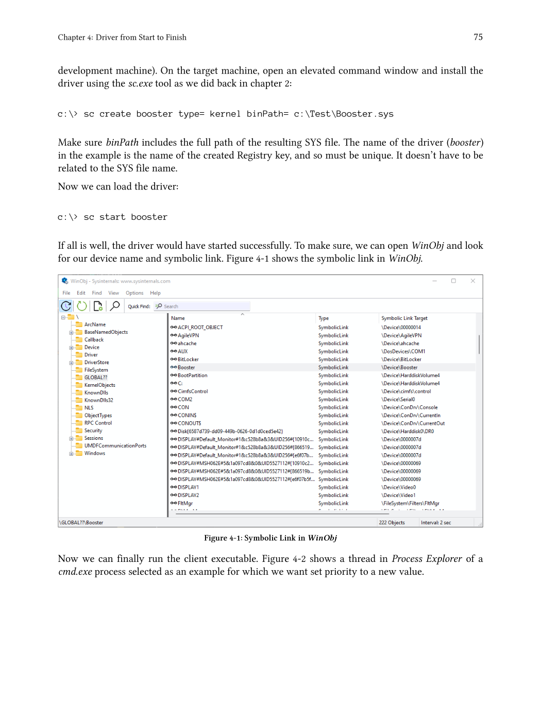
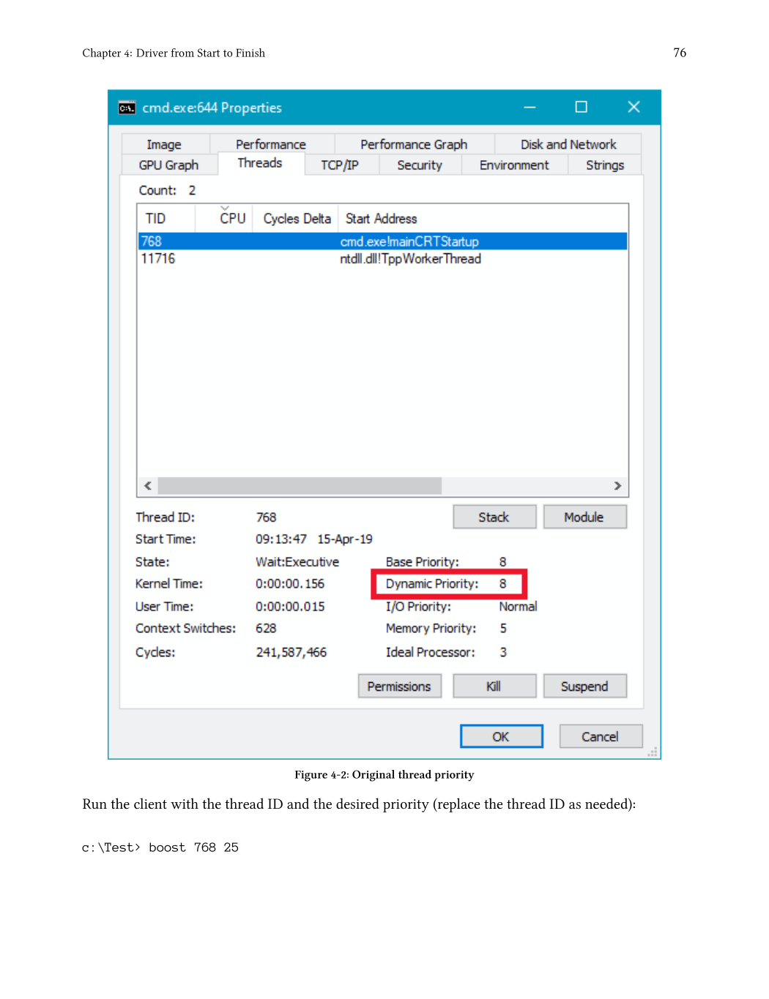

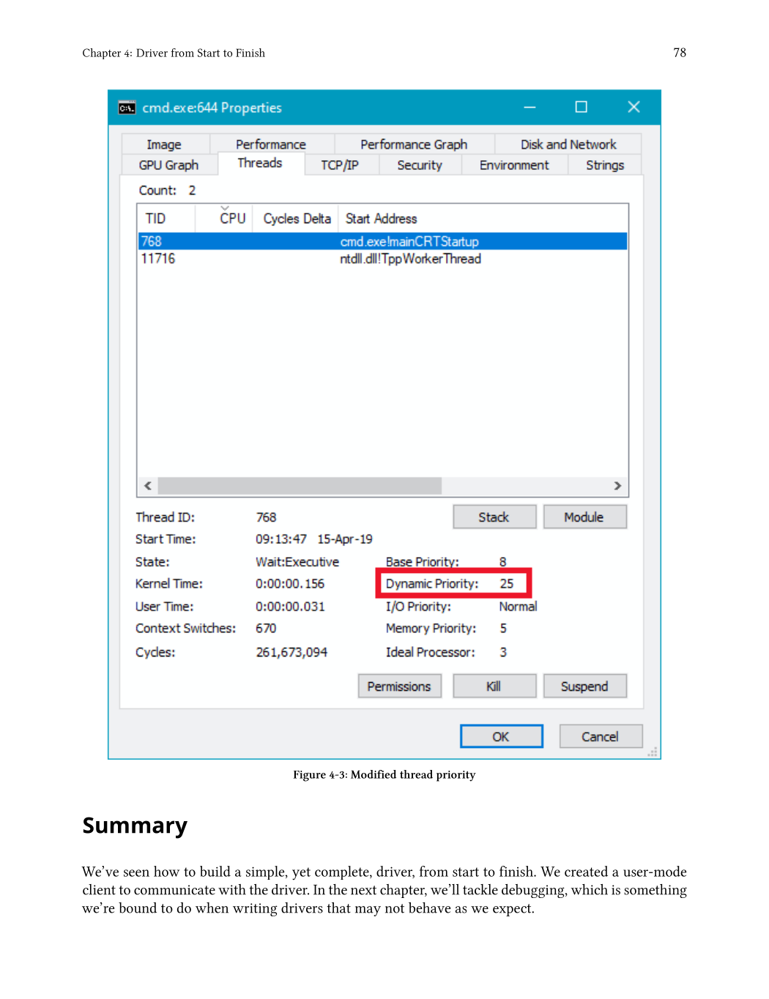

至此，我们可以成功构建驱动程序和客户端了。下一步是安装驱动程序并测试其功能。你可以在虚拟机上尝试，或者如果你足够勇敢，也可以在开发机器上尝试。

首先，让我们安装驱动程序。将生成的 booster.sys 文件复制到目标机器（如果目标机器不是你的开发机器）。在目标机器上，打开一个提升权限的命令窗口，并使用 sc.exe 工具像我们在第 2 章中所做的那样安装驱动程序：
c:\> sc create booster type= kernel binPath= c:\Test\Booster.sys
确保 binPath 包含生成的 SYS 文件的完整路径。示例中驱动程序的名称（booster）是创建的注册表键的名称，因此必须是唯一的。它不必与 SYS 文件名相关联。

现在我们可以加载驱动程序了：
c:\> sc start booster

如果一切顺利，驱动程序将成功启动。为了确认，我们可以打开 WinObj 并查找我们的设备名称和符号链接。图 4-1 显示了 

WinObj 中的符号链接。

                                         图 4-1：WinObj 中的符号链接

现在，我们终于可以运行客户端可执行文件了。图 4-2 显示了 Process Exp

lorer 中选作示例的 cmd.exe 进程中的一个线程，我们想将其优先级设置为新值。

                                         图 4-2：原始线程优先级
运行客户端，提供线程 ID 和所需的优先级（根据需要替换线程 ID）：
c:\Test> boost 768 25

              如果在尝试运行可执行文件时遇到错误（通常是 Debug 构建版本），你可能需要将运行时库设置为静态库而不是 DLL。在 Visual Studio 中，转到客户端应用程序的“项目属性”->“C++”节点 ->“代码生成”->“运行时库”，然后选择“多线程调试”。或者，你可以以 Release 模式编译客户端，这样无需任何更改即可运行。
瞧！见图 4-3。
        你还应该运行 DbgView，并在优先级成功更改时查看输出。
                                         图 4-3：修改后的线程优先级
本章总结

我们已经看到了如何从始至终构建一个简单但完整的驱动程序。我们创建了一个用户模式客户端来与驱动程序通信。在下一章中，我们将着手处理调试，这是我们在编写行为可能不符合预期的驱动程序时必然要做的事情。

# Chapter 5: Debugging and Tracing

第5章：调试与跟踪

和任何软件一样，内核驱动程序（kernel drivers）也难免有缺陷（bugs）。与用户模式（user-mode）调试相比，驱动程序（driver）的调试更具挑战性。驱动调试本质上是调试整台机器，而不仅仅是某个特定进程。这需要一种稍有不同的思维方式。本章将讨论使用WinDbg调试器进行用户模式和内核模式（kernel-mode）调试。
本章内容：
    · 适用于Windows的调试工具（Debugging Tools for Windows）
    · WinDbg简介
    · 内核调试（Kernel Debugging）
    · 完整内核调试（Full Kernel Debugging）
    · 内核驱动程序调试教程（Kernel Driver Debugging Tutorial）
```text
· 断言与跟踪（Asserts and Tracing）
```
适用于Windows的调试工具
适用于Windows的调试工具包包含一组调试器（debuggers）、工具以及文档，重点关注包内的调试器。此包可作为Windows SDK或WDK的一部分进行安装，但实际并没有执行真正的“安装”。安装过程仅仅是复制文件，而不会修改注册表（Registry），这意味着该包仅依赖于自身的模块以及Windows内置的DLL。这使得将整个目录轻松复制到任何其他目录（包括可移动介质）成为可能。
该包包含四个调试器：Cdb.exe、Ntsd.Exe、Kd.exe以及WinDbg.exe。以下是每个调试器基本功能的简要说明：
    · Cdb和Ntsd是用户模式、基于控制台（console-based）的调试器。这意味着它们可以附加到进程，就像其他任何用户模式调试器一样。两者都具有控制台UI——键入命令，获取响应，并重复此过程。两者唯一的区别在于：如果从控制台窗口启动，Cdb使用同一个控制台，而Ntsd总是打开一个新的控制台窗口。除此之外，它们完全相同。
    · Kd是一个带有控制台用户界面的内核调试器（kernel debugger）。它可以附加到本地内核（本地内核调试，下一节将介绍），或附加到另一台机器，以获得完整的内核调试体验。
    · WinDbg是唯一拥有图形用户界面（graphical user interface）的调试器。它既可用于用户模式调试，也可用于内核调试，具体取决于通过菜单进行的选项选择或启动时传递给它的命令行参数。
        经典版WinDbg的一个相对较新的替代品是Windbg Preview，可通过Microsoft商店获取。这是经典调试器的重制版，具有更加出色的用户界面。它可以安装在Windows 10 1607版或更高版本上。从功能的角度来看，它与经典版WinDbg类似。但由于现代、便捷的UI，它使用起来更容易一些，并且实际上也解决了一些仍然困扰经典版调试器的缺陷。我们在本章中将看到的所有命令，在两个调试器中都能同样良好地运行。
尽管这些调试器看似彼此不同，但用户模式调试器在本质上是一样的，内核调试器也是如此。它们全都基于一个实现为DLL（DbgEng.Dll）的单一调试器引擎。各种调试器能够使用扩展DLL（extension DLLs），这些DLL通过加载新命令提供了调试器的大部分能力。
        调试器引擎在很大程度上已在适用于Windows的调试工具文档中有详细记录，这使得编写能利用该调试器引擎的新调试器（或其他工具）成为可能。
作为该包一部分的其他工具包括（部分列表）：
    · Gflags.exe - 全局标志工具（Global Flags tool），允许设置一些内核标志（kernel flags）和映像标志（image flags）。
    · ADPlus.exe - 为进程崩溃或挂起生成转储文件（dump file）。
    · Kill.exe - 一个基于进程ID、名称或模式来终止进程的简单工具。
    · Dumpchk.exe - 用于对转储文件进行一些常规检查的工具。
    · TList.exe - 使用各种选项列出系统中正在运行的进程。
    · Umdh.exe - 分析用户模式进程中的堆分配。
    · UsbView.exe - 显示USB设备和集线器的层级视图。
WinDbg简介
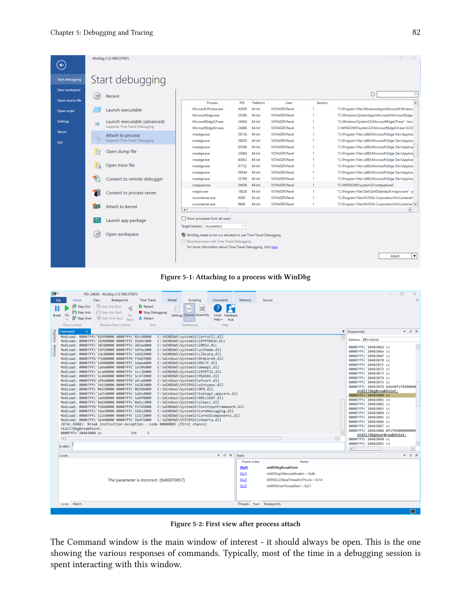
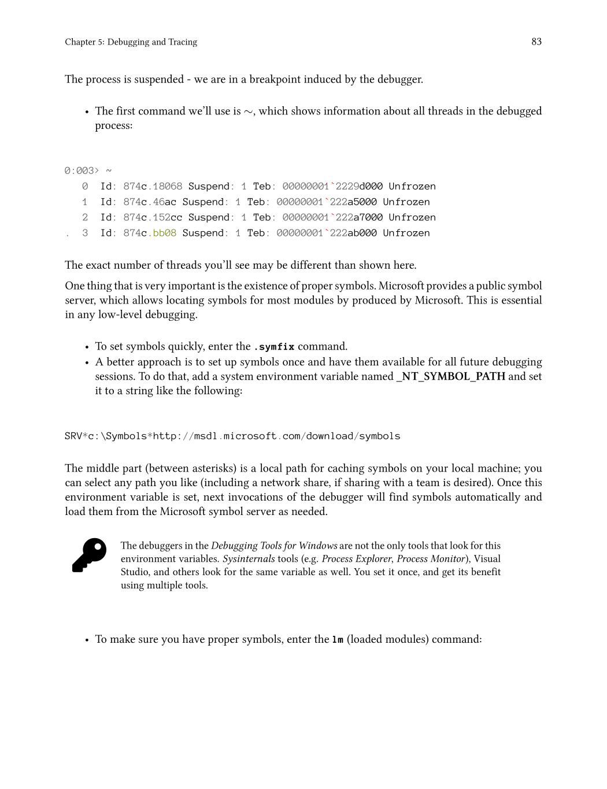
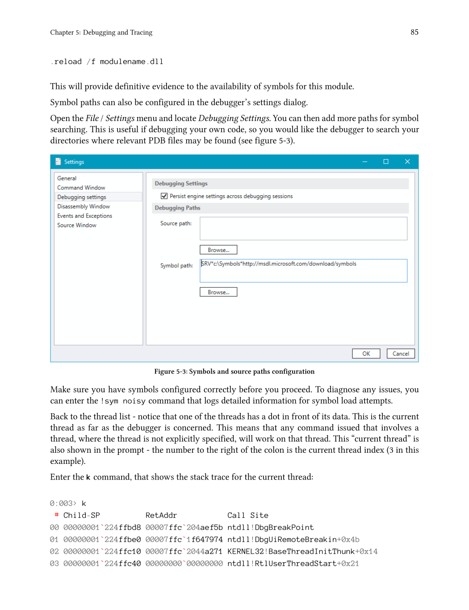
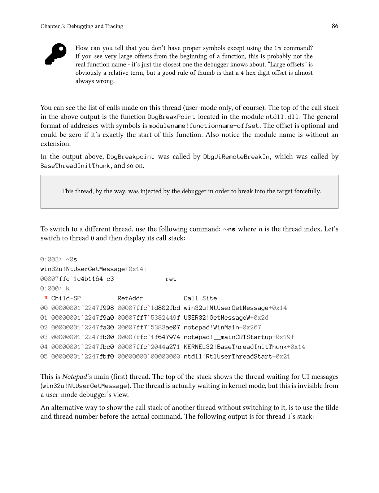
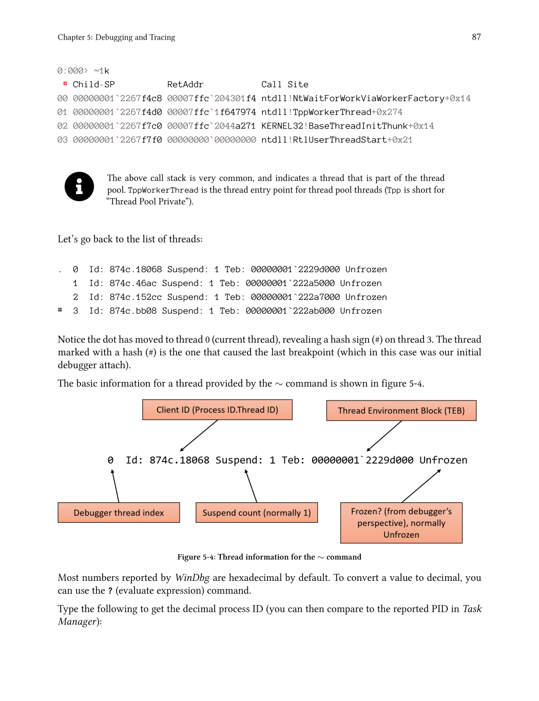
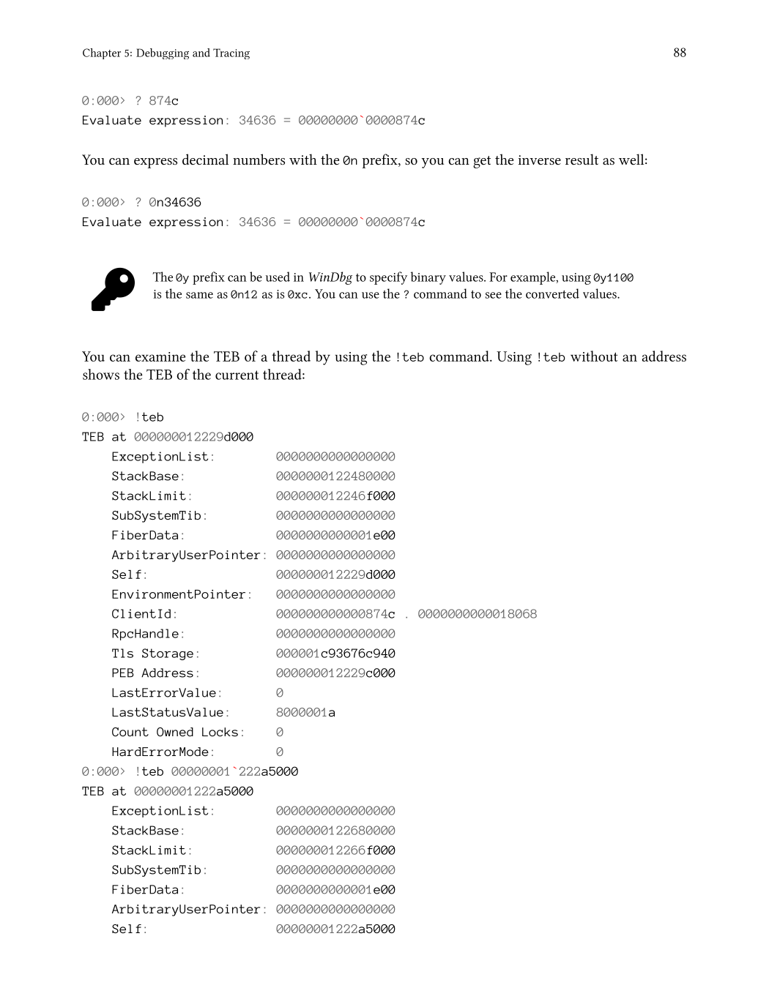
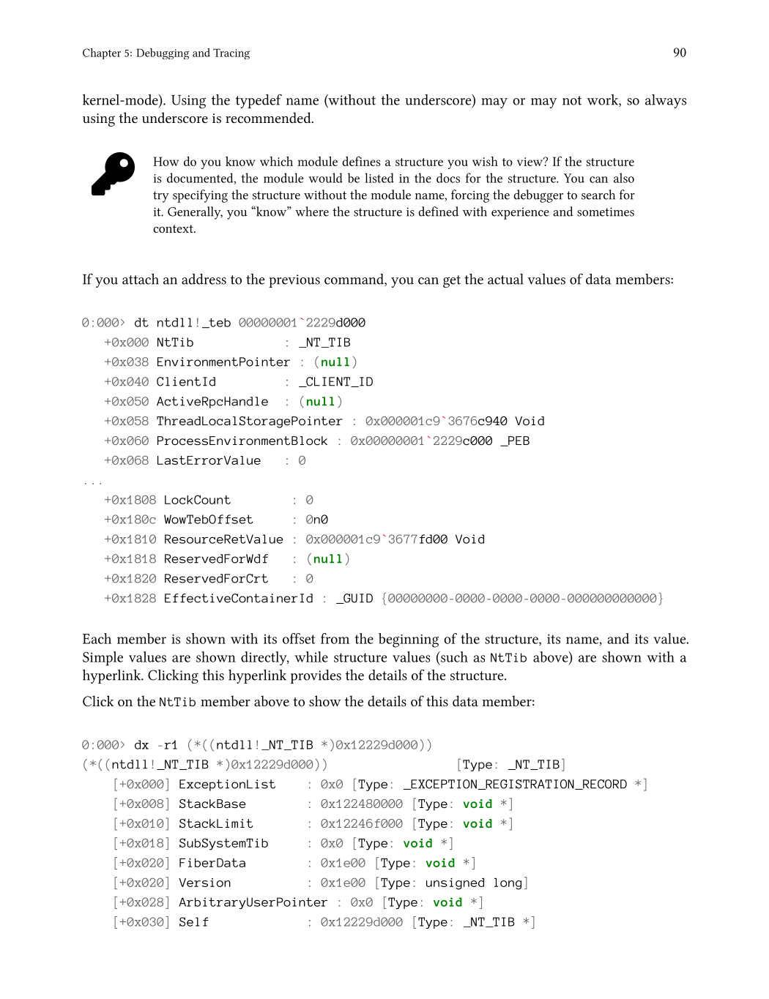
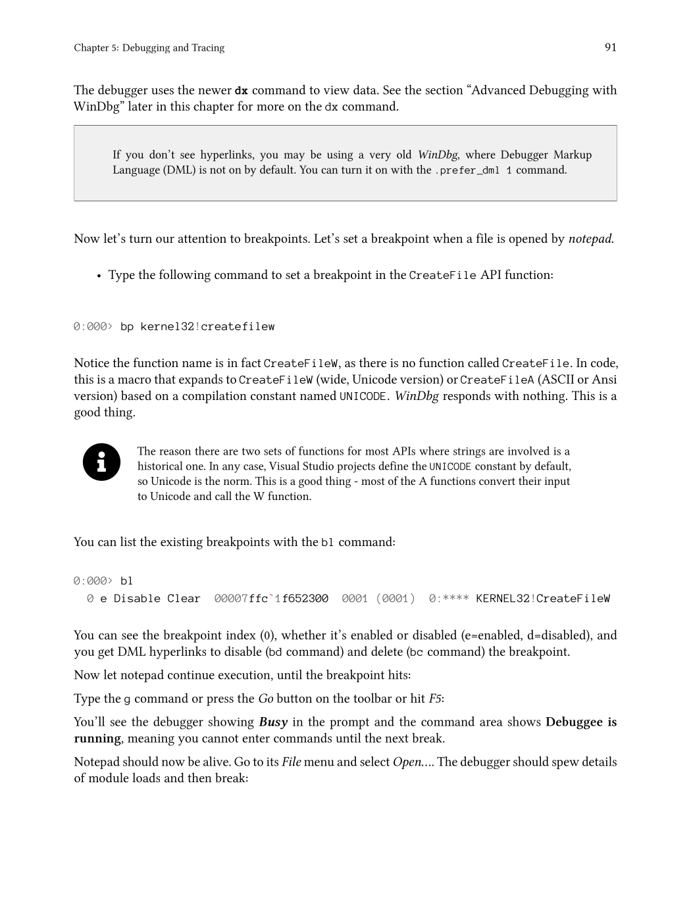
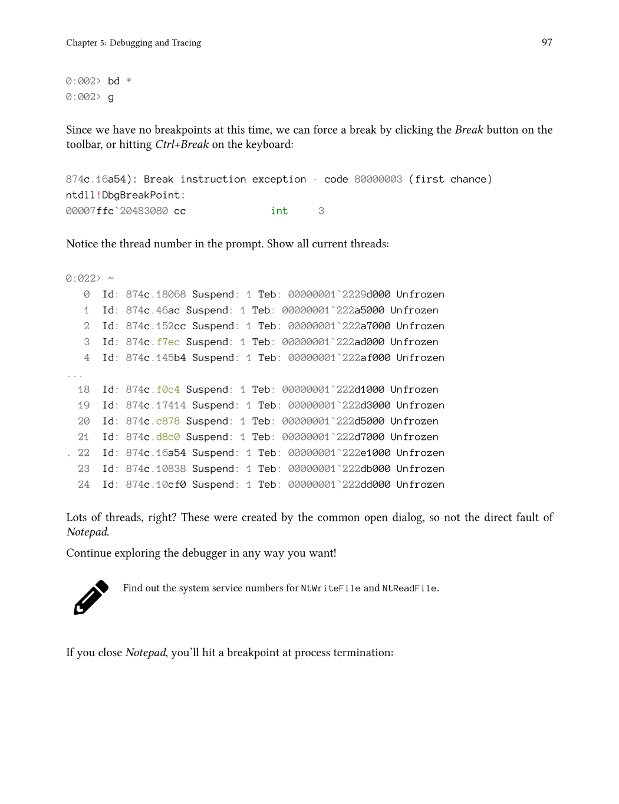

本节介绍WinDbg的基本知识，但请记住，除了GUI窗口之外，所有内容对于控制台调试器而言实质上是相同的。
WinDbg是围绕命令构建的。用户键入一个命令，调试器则用描述该命令结果的文本进行响应。在GUI中，其中的一些结果会显示在专用窗口中，例如局部变量（locals）、堆栈（stack）、线程（threads）等。
WinDbg支持三种类型的命令：
    · 内置命令（Intrinsic commands） - 这些命令内置于调试器中（属于调试器引擎的一部分），它们作用于被调试的目标。
    · 元命令（Meta commands） - 这些命令以点号（.）开头，它们作用于调试环境，而不是直接作用于被调试的目标。
    · 扩展命令（Extension commands，有时也称为bang commands） - 这些命令以感叹号（!）开头，提供了调试器的大部分能力。所有扩展命令都在外部DLL中实现。默认情况下，调试器会加载一组预定义的扩展DLL，但也可以使用.load元命令从调试器目录或其他目录加载更多扩展DLL。
        编写扩展DLL是可能的，并且在调试器文档中有完整记录。事实上，已经创建了许多这样的DLL，并且可以从它们各自的源加载。这些DLL提供了新的命令来增强调试体验，并常常针对特定的场景。
教程：用户模式调试基础
如果你有在用户模式下使用WinDbg的经验，可以放心地跳过本节。
本教程旨在让你对WinDbg以及如何在用户模式调试中使用它有一个基本的了解。内核调试将在下一节介绍。
通常有两种方法来启动用户模式调试——要么启动一个可执行文件并附加到它，要么附加到一个已经存在的进程。在本教程中，我们将使用后一种方法，但除了这第一步，其他所有操作都是相同的。
    · 启动记事本（Notepad）。
    · 启动WinDbg（预览版或经典版均可。以下截图使用预览版）。
    · 选择“文件”/“附加到进程”，在列表中找到记事本进程（参见图5-1）。然后点击“附加”。你应该会看到与图5-2类似的输出。
                                   图5-1：使用WinDbg附加到进程
                                      图5-2：进程附加后的初始视图
命令窗口是主要关注窗口——它应始终保持打开状态。这是显示命令各种响应的窗口。通常，调试会话中的大部分时间都花在与这个窗口进行交互上。
进程已被挂起——我们处于由调试器引发的断点（breakpoint）中。
    · 我们将使用的第一个命令是∼，它显示被调试进程中所有线程的信息：
```text
0:003> ~
0 Id: 874c.18068 Suspend: 1 Teb: 00000001`2229d000 Unfrozen
   1 Id: 874c.46ac Suspend: 1 Teb: 00000001`222a5000 Unfrozen
   2 Id: 874c.152cc Suspend: 1 Teb: 00000001`222a7000 Unfrozen
. 3 Id: 874c.bb08 Suspend: 1 Teb: 00000001`222ab000 Unfrozen
```
你看到的实际线程数可能与此处显示的不同。
有一件事非常重要，那就是正确符号（proper symbols）的存在。微软提供了一个公共符号服务器（symbol server），它允许定位由微软出品的大多数模块的符号。这在任何底层调试中都是必不可少的。
    · 要快速设置符号，请输入.symfix命令。
    · 更好的方法是配置一次符号，使其在未来所有调试会话中都可用。为此，添加一个名为_NT_SYMBOL_PATH的系统环境变量，并将其设置为类似以下的字符串：
SRV*c:\Symbols*http://msdl.microsoft.com/download/symbols
中间部分（两个星号之间）是用于在本地机器上缓存符号的本地路径；你可以选择任何你喜欢的路径（如果需要与团队共享，也可以是网络共享）。一旦设置了此环境变量，下次调用调试器时，调试器将自动找到符号，并根据需要从微软符号服务器加载它们。
             适用于Windows的调试工具中的调试器并非查找此环境变量的唯一工具。Sysinternals工具（例如Process Explorer、Process Monitor）、Visual Studio等也会查找相同的变量。你只需设置一次，便可在使用多个工具时受益于它。
    · 为了确保你拥有正确的符号，请输入lm（已加载模块）命令：
```text
0:003> lm
start             end                 module name
00007ff7`53820000 00007ff7`53863000   notepad    (deferred)
00007ffb`afbe0000 00007ffb`afca6000   efswrt     (deferred)
...
00007ffc`1db00000 00007ffc`1dba8000   shcore     (deferred)
00007ffc`1dbb0000 00007ffc`1dc74000   OLEAUT32   (deferred)
00007ffc`1dc80000 00007ffc`1dd22000   clbcatq    (deferred)

00007ffc`1dd30000 00007ffc`1de57000   COMDLG32   (deferred)
00007ffc`1de60000 00007ffc`1f350000   SHELL32    (deferred)
00007ffc`1f500000 00007ffc`1f622000   RPCRT4     (deferred)
00007ffc`1f630000 00007ffc`1f6e3000   KERNEL32   (pdb symbols)                     c:\symbols\ker\
nel32.pdb\3B92DED9912D874A2BD08735BC0199A31\kernel32.pdb
00007ffc`1f700000 00007ffc`1f729000   GDI32      (deferred)
00007ffc`1f790000 00007ffc`1f7e2000   SHLWAPI    (deferred)
00007ffc`1f8d0000 00007ffc`1f96e000   sechost    (deferred)
00007ffc`1f970000 00007ffc`1fc9c000   combase    (deferred)
00007ffc`1fca0000 0000

7ffc`1fd3e000   msvcrt     (deferred)
00007ffc`1fe50000 00007ffc`1fef3000   ADVAPI32   (deferred)
00007ffc`20380000 00007ffc`203ae000   IMM32      (deferred)
00007ffc`203e0000 00007ffc`205cd000   ntdll      (pdb symbols)                     c:\symbols\ntd\
ll.pdb\E7EEB80BFAA91532B88FF026DC6B9F341\ntdll.pdb
```
模块列表显示了此时加载到被调试进程中的所有模块（DLL和EXE）。你可以看到每个模块映射到的起始和结束虚拟地址。在模块名称之后，你可以看到该模块的符号状态（在括号中）。可能的值包括：
    · deferred（延迟） - 此模块的符号在当前调试会话中尚未需要，因此此时未被加载。符号将在需要时被加载（例如，如果调用堆栈包含该模块中的函数）。这是默认值。
    · pdb symbols（pdb符号） - 正确的公共符号已加载。将显示PDB文件的本地路径。

    · private pdb symbols（私有pdb符号） - 私有符号可用。这适用于你使用Visual Studio编译的自己的模块。对于微软模块，这种情况非常罕见（在撰写本文时，combase.dll提供了私有符号）。通过私有符号，你可以获得关于局部变量和私有类型的信息。
    · export symbols（导出符号） - 此DLL只有导出符号可用。这通常意味着该模块没有符号，但调试器能够使用导出的符号。这比完全没有符号要好，但可能会造成混淆，因为调试器会使用它能找到的最接近的导出项，但实际的函数很可能不同。
    · no symbols（无符号） - 曾尝试定位该模块的符号，但未找到任何内容，甚至连导出符号也没有（此类模块没有导出符号，就像可执行文件或驱动程序文件的情况一样）。
你可以使用以下命令强制加载某个模块的符号：
.reload /f modulename.dll
这将为此模块的符号可用性提供确定的证据。
符号路径也可以在调试器的设置对话框中进行配置。
打开“文件”/“设置”菜单，找到“调试设置”。然后你可以添加更多用于搜索符号的路径。当你调试自己的代码时，这非常有用，因此你会希望调试器搜索你的目录，那些相关PDB文件可能找到的目录（参见图5-3）。
                                   图5-3：符号和源代码路径配置
在继续之前，请确保你已正确配置了符号。要诊断任何问题，你可以输入!sym noisy命令，该命令会记录符号加载尝试的详细信息。
回到线程列表——请注意，其中一个线程的数据前面有一个点号。就调试器而言，这是当前线程。这意味着任何涉及线程的命令，如果没有显式指定线程，都将作用于该线程。这个“当前线程”也显示在提示符中——冒号右边的数字是当前线程索引（在此示例中为3）。
输入k命令，该命令显示当前线程的堆栈跟踪：
```text
0:003> k
 # Child-SP          RetAddr           Call Site
00 00000001`224ffbd8 00007ffc`204aef5b ntdll!DbgBreakPoint
01 00000001`224ffbe0 00007ffc`1f647974 ntdll!DbgUiRemoteBreakin+0x4b
02 00000001`224ffc10 00007ffc`2044a271 KERNEL32!BaseThreadInitThunk+0x14
03 00000001`224ffc40 00000000`00000000 ntdll!RtlUserThreadStart+0x21
```
除了使用lm命令，你如何能判断没有正确的符号？
             如果你看到从函数开头处的偏移量非常大，那么这很可能不是真正的函数名——只是调试器所知道的最近似的一个。“大幅度偏移”显然是一个相对术语，但一个很好的经验法则是，4位十六进制数字的偏移几乎总是错误的。
你可以看到此线程上进行的调用序列（当然，仅限于用户模式）。以上输出中调用堆栈的顶层是位于ntdll.dll模块中的函数DbgBreakPoint。带有符号的地址的一般格式是模块名!函数名+偏移量。偏移量是可选的，如果正好是该函数的起始处，偏移量可能为零。另外请注意模块名没有扩展名。
在上面的输出中，DbgBreakpoint被DbgUiRemoteBreakIn调用，后者被BaseThreadInitThunk调用，以此类推。
        顺便说一下，这个线程是由调试器注入的，目的是强行进入目标进程。
要切换到不同的线程，请使用以下命令：∼ns，其中n是线程索引。让我们切换到线程0，然后显示其调用堆栈：
```text
0:003> ~0s
win32u!NtUserGetMessage+0x14:
00007ffc`1c4b1164 c3              ret
0:000> k
# Child-SP          RetAddr           Call Site
00 00000001`2247f998 00007ffc`1d802fbd win32u!NtUserGetMessage+0x14
01 00000001`2247f9a0 00007ff7`5382449f USER32!GetMessageW+0x2d
02 00000001`2247fa00 00007ff7`5383ae07 notepad!WinMain+0x267
03 00000001`2247fb00 00007ffc`1f647974 notepad!__mainCRTStartup+0x19f
04 00000001`2247fbc0 00007ffc`2044a271 KERNEL32!BaseThreadInitThunk+0x14
05 00000001`2247fbf0 00000000`00000000 ntdll!RtlUserThreadStart+0x21
这是记事本的主（第一个）线程。堆栈顶部显示该线程正在等待UI消息（win32u!NtUserGetMessage）。该线程实际上正在内核模式下等待，但从用户模式调试器的视角来看，这是不可见的。
```
另一种在不切换的情况下显示另一个线程调用堆栈的方法是，在实际命令之前使用波浪号和线程编号。以下输出是线程1的堆栈：
```text
0:000> ~1k
 # Child-SP          RetAddr           Call Site
00 00000001`2267f4c8 00007ffc`204301f4 ntdll!NtWaitForWorkViaWorkerFactory+0x14
01 00000001`2267f4d0 00007ffc`1f647974 ntdll!TppWorkerThread+0x274
02 00000001`2267f7c0 00007ffc`2044a271 KERNEL32!BaseThreadInitThunk+0x14
03 00000001`2267f7f0 00000000`00000000 ntdll!RtlUserThreadStart+0x21
```
上面的调用堆栈非常常见，它表示一个属于线程池（thread pool）的线程。TppWorkerThread是线程池线程的线程入口点（Tpp是“Thread Pool Private”的缩写）。
让我们回到线程列表：
```text
.   0   Id: 874c.18068 Suspend: 1 Teb: 00000001`2229d000 Unfrozen
    1   Id: 874c.46ac Suspend: 1 Teb: 00000001`222a5000 Unfrozen

    2   Id: 874c.152cc Suspend: 1 Teb: 00000001`222a7000 Unfrozen
#   3   Id: 874c.bb08 Suspend: 1 Teb: 00000001`222ab000 Unfrozen
```
请注意，点号已移至线程0（当前线程），在线程3上显示了一个井号（#）。标记有井号（#）的线程是导致最近一次断点的线程（在本例中，即我们最初的调试器附加）。
由∼命令提供的线程基本信息如图5-4所示。
                                   图5-4：∼命令显示的线程信息
WinDbg报告的大多数数字默认是十六进制的。要将值转换为十进制，你可以使用?（计算表达式）命令。
键入以下内容以获取十进制的进程ID（然后你可以将其与任务管理器中报告的PID进行比较）：
```text
0:000> ? 874c
Evaluate expression: 34636 = 00000000`0000874c
```
你可以使用0n前缀来表示十进制数字，因此你也可以得到相反的结果：
```text
0:000> ? 0n34636
Evaluate expression: 34636 = 00000000`0000874c
``

`
```
在WinDbg中，0y前缀可用于指定二进制值。例如，使用0y1100等同于0n12，也等同于0xc。你可以使用?命令查看转换后的值。
你可以使用!teb命令检查线程的TEB。不带地址使用!teb将显示当前线程的TEB：
```text
0:000> !teb
TEB at 000000012229d000
    ExceptionList:        0000000000000000
    StackBase:            0000000122480000
    StackLimit:           000000012246f000
    SubSystemTib:         0000000000000000
    FiberData:            0000000000001e00
    ArbitraryUserPointer: 0000000000000000
    Self:                 000000012229d000
    EnvironmentPointer:   0000000000000000
    ClientId:             000000000000874c . 0000000000018068
    RpcHandle:            0000000000000000
    Tls Storage:          000001c93676c940
    PEB Address:          000000012229c000
    LastErrorValue:       0
    LastStatusValue:      8000001a
    Count Owned Locks:    0
    HardErrorMode:        0
0:000> !teb 00000001`222a5000
TEB at 00000001222a5000
    ExceptionList:        0000000000000000
    StackBase:            0000000122680000
    StackLimit:           000000012266f000
    SubSystemTib:         0000000000000000
    FiberData:            0000000000001e00
    ArbitraryUserPointer: 0000000000000000
    Self:                 00000001222a5000
     EnvironmentPointer:           0000000000000000
     ClientId:                     000000000000874c . 00000000000046ac
     RpcHandle:                    0000000000000000
     Tls Storage:                  000001c936764260
     PEB Address:                  000000012229c000
     LastErrorValue:               0
     LastStatusValue:              c0000034
     Count Owned Locks:            0
     HardErrorMode:                0
```
!teb命令显示的一些数据是比较为人熟知或容易猜到的：
    · StackBase 和 StackLimit - 线程的用户模式当前堆栈基址和堆栈限制。
    · ClientId - 进程和线程ID。
    · LastErrorValue - 最后一个Win32错误码（GetLastError）。

    · TlsStorage - 此线程的线程本地存储（Thread Local Storage, TLS）数组（对TLS的完整解释超出了本书的范围）。
    · PEB Address - 进程环境块（Process Environment Block, PEB）的地址，可使用!peb命令查看。
    · LastStatusValue - 从系统调用返回的最后一个NTSTATUS值。
    · !teb命令（以及类似的命令）展示了幕后真实数据结构的部分内容，在本例中即_TEB。你始终可以使用dt（显示类型）命令查看实际的结构：
```text
0:000> dt ntdll!_teb
   +0x000 NtTib            : _NT_TIB
   +0x038 EnvironmentPointer : Ptr64 Void
   +0x040 ClientId         : _CLIENT_ID
   +0x050 ActiveRpcHandle : Ptr64 Void
   +0x058 ThreadLocalStoragePointer : Ptr64 Void
   +0x06

0 ProcessEnvironmentBlock : Ptr64 _PEB
...
   +0x1808 LockCount        : Uint4B
   +0x180c WowTebOffset     : Int4B
   +0x1810 ResourceRetValue : Ptr64 Void
   +0x1818 ReservedForWdf   : Ptr64 Void
   +0x1820 ReservedForCrt   : Uint8B
   +0x1828 EffectiveContainerId : _GUID
```
请注意，WinDbg在涉及符号时对大小写不敏感。另外，请注意结构体名称以下划线开头；这是大多数Windows结构体（用户模式和内核模式）的定义方式。使用typedef名称（不带下划线）可能有效，也可能无效，因此建议始终使用带下划线的名称。
             你如何知道哪个模块定义了你想查看的结构体？如果该结构体有文档记录，模块会在结构体的文档中列出。你也可以尝试指定结构体而不带模块名，强制调试器搜索它。一般来说，你通过经验和上下文来“知道”结构体在哪里定义。
如果你在前一个命令后附加一个地址，就可以获取数据成员的实际值：
```text
0:000> dt ntdll!_teb 00000001`2229d000
   +0x000 NtTib            : _NT_TIB
   +0x038 EnvironmentPointer : (null)
   +0x040 ClientId         : _CLIENT_ID
   +0x050 ActiveRpcHandle : (null)
+0x058 ThreadLocalStoragePointer : 0x000001c9`3676c940 Void
   +0x060 ProcessEnvironmentBlock : 0x00000001`2229c000 _PEB
+0x068 LastErrorValue   : 0
...
   +0x1808 LockCount        : 0
   +0x180c WowTebOffset     : 0n0
   +0x1810 ResourceRetValue : 0x000001c9`3677fd00 Void
   +0x1818 ReservedForWdf   : (null)
   +0x1820 ReservedForCrt   : 0
   +0x1828 EffectiveContainerId : _GUID {00000000-0000-0000-0000-000000000000}
```
每个成员都显示了其从结构体开头算起的偏移量、名称及其值。简单值直接显示，而结构体值（例如上面的NtTib）则显示为超链接。点击此超链接会显示该结构体的详细信息。
点击上面的NtTib成员，查看此数据成员的详细信息：
```text
0:000> dx -r1 (*((ntdll!_NT_TIB *)0x12229d000))
(*((ntdll!_NT_TIB *)0x12229d000))                 [Type: _NT_TIB]
    [+0x000] ExceptionList    : 0x0 [Type: _EXCEPTION_REGISTRATION_RECORD *]
    [+0x008] StackBase        : 0x122480000 [Type: void *]
    [+0x010] StackLimit       : 0x12246f000 [Type: void *]
    [+0x018] SubSystemTib     : 0x0 [Type: void *]
    [+0x020] FiberData        : 0x1e00 [Type: void *]
    [+0x020] Version          : 0x1e00 [Type: unsigned long]
    [+0x028] ArbitraryUserPointer : 0x0 [Type: void *]
    [+0x030] Self             : 0x12229d000 [Type: _NT_TIB *]
```
调试器使用较新的dx命令来查看数据。有关dx命令的更多信息，请参阅本章后面的“使用WinDbg进行高级调试”一节。
        如果你没有看到超链接，可能你正在使用一个非常旧的WinDbg，其中默认未开启调试器标记语言（Debugger Markup Language, DML）。你可以使用.prefer_dml 1命令将其打开。
现在让我们把注意力转向断点。让我们在记事本打开文件时设置一个断点。
    · 键入以下命令，在CreateFile API函数中设置一个断点：
```text
0:000> bp kernel32!createfilew
```
请注意，函数名实际上是CreateFileW，因为没有名为CreateFile的函数。在代码中，这是一个根据编译常量UNICODE展开为CreateFileW（宽字符，Unicode版本）或CreateFileA（ASCII或Ansi版本）的宏。WinDbg没有给出任何响应。这是一个好现象。
             大多数涉及字符串的API都有两套函数，其原因源于历史。无论如何，Visual Studio项目默认定义UNICODE常量，因此Unicode是常态。这是件好事——大多数A函数将其输入转换为Unicode后调用W函数。
你可以使用bl命令列出已有的断点：
```text
0:000> bl
  0 e Disable Clear          00007ffc`1f652300          0001 (0001)       0:**** KERNEL32!CreateFileW
```
你可以看到断点索引（0），它是启用还是禁用（e=启用，d=禁用），并且你还可以获得用于禁用（bd命令）和删除（bc命令）该断点的DML超链接。
现在，让记事本继续执行，直到断点被命中：
键入g命令，或点击工具栏上的“Go”按钮，或按F5：
你将看到调试器在提示符中显示“Busy”（忙），并且命令区域显示“Debuggee is running”（被调试者正在运行），这意味着在下次中断之前你无法输入命令。
现在记事本应该处于活动状态。转到其“文件”菜单，选择“打开...”。调试器应该会显示模块加载的详细信息，然后中断：
```text
Breakpoint 0 hit
KERNEL32!CreateFileW:
00007ffc`1f652300 ff25aa670500    jmp     qword ptr [KERNEL32!_imp_CreateFileW \
(00007ffc`1f6a8ab0)] ds:00007ffc`1f6a8ab0={KERNELBASE!CreateFileW (00007ffc`1c7\
5e260)}
```
· 我们命中了断点！请注意它发生在哪个线程中。让我们看看调用堆栈是什么样的（如果调试器需要从微软符号服务器下载符号，可能需要一些时间才能显示）：
```text
0:002> k

 # Child-SP          RetAddr           Call Site
00 00000001`226fab08 00007ffc`061c8368 KERNEL32!CreateFileW
01 00000001`226fab10 00007ffc`061c5d4d mscoreei!RuntimeDesc::VerifyMainRuntimeM\
odule+0x2c
02 00000001`226fab60 00007ffc`061c6068 mscoreei!FindRuntimesInInstallRoot+0x2fb
03 00000001`226fb3e0 00007ffc`061cb748 mscoreei!GetOrCreateSxSProcessInfo+0x94
04 00000001`226fb460 00007ffc`061cb62b mscoreei!CLRMetaHostPolicyImpl::GetReque\
stedRuntimeHelper+0xfc
05 00000001`226fb740 00007ffc`061ed4e6 mscoreei!CLRMetaHostPolicyImpl::GetReque\
stedRuntime+0x120
...
21 00000001`226fede0 00007ffc`1df025b2 SHELL32!CFSIconOverlayManager::LoadNonlo\
adedOverlayIdentifiers+0xaa
22 00000001`226ff320 00007ffc`1df022af SHELL32!EnableExternalOverlayIdentifiers\
+0x46
23 00000001`226ff350 00007ffc`1def434e SHELL32!CFSIconOverlayManager::RefreshOv\
erlayImages+0xff
24 00000001`226ff390 00007ffc`1cf250a3 SHELL32!SHELL32_GetIconOverlayManager+0x\
6e
25 00000001`226ff3c0 00007ffc`1ceb2726 windows_storage!CFSFolder::_GetOverlayIn\
fo+0x12b
26 00000001`226ff470 00007ffc`1cf3108b windows_storage!CAutoDestItemsFolder::Ge\
tOverlayIndex+0xb6
27 00000001`226ff4f0 00007ffc`1cf30f87 windows_storage!CRegFolder::_GetOverlayI\
nfo+0xbf
28 00000001`226ff5c0 00007ffb`df8fc4d1 windows_storage!CRegFolder::GetOverlayIn\
dex+0x47
29 00000001`226ff5f0 00007ffb`df91f095 explorerframe!CNscOverlayTask::_Extract+\
0x51
2a 00000001`226ff640 00007ffb`df8f70c2 explorerframe!CNscOverlayTask::InternalR\
esumeRT+0x45
2b 00000001`226ff670 00007ffc`1cf7b58c explorerframe!CRunnableTask::Run+0xb2
2c 00000001`226ff6b0 00007ffc`1cf7b245 windows_storage!CShellTask::TT_Run+0x3c
2d 00000001`226ff6e0 00007ffc`1cf7b125 windows_storage!CShellTaskThread::Thread\
Proc+0xdd
2e 00000001`226ff790 00007ffc`1db32ac6 windows_storage!CShellTaskThread::s_Thre\
adProc+0x35
2f 00000001`226ff7c0 00007ffc`204521c5 shcore!ExecuteWorkItemThreadProc+0x16
30 00000001`226ff7f0 00007ffc`204305c4 ntdll!RtlpTpWorkCallback+0x165
31 00000001`226ff8d0 00007ffc`1f647974 ntdll!TppWorkerThread+0x644
32 00000001`226ffbc0 00007ffc`2044a271 KERNEL32!BaseThreadInitThunk+0x14
33 00000001`226ffbf0 00000000`00000000 ntdll!RtlUserThreadStart+0x21
```
你的调用堆栈可能不同，因为它取决于Windows版本，以及打开文件对话框可能加载和使用的任何扩展。
此时我们能做什么？你可能想知道正在打开哪个文件。我们可以根据CreateFileW函数的调用约定来获取该信息。由于这是一个64位进程（且处理器为Intel/AMD），其调用约定规定，前几个整数/指针参数依次通过RCX、RDX、R8和R9寄存器传递（按此顺序）。由于文件名字在CreateFileW中是第一个参数，相关的寄存器是RCX。
        你可以在调试器文档（或多个网络资源）中获取关于调用约定的更多信息。
使用r命令显示RCX寄存器的值（你将得到一个不同的值）：
```text
0:002> r rcx
rcx=00000001226fabf8
```
我们可以使用各种d（显示）系列命令来查看RCX所指向的内存。以下是db命令，将数据解释为字节。
```text
0:002> db 00000001226fabf8
00000001`226fabf8 43 00 3a 00 5c 00 57 00-69 00 6e 00 64 00 6f 00                   C.:.\.W.i.n\
.d.o.
00000001`226fac08 77 00 73 00 5c 00 4d 00-69 00 63 00 72 00 6f 00                   w.s.\.M.i.c\
.r.o.
00000001`226fac18 73 00 6f 00 66 00 74 00-2e 00 4e 00 45 00 54 00                   s.o.f.t...N\
.E.T.
00000001`226fac28 5c 00 46 00 72 00 61 00-6d 00 65 00 77 00 6f 00                   \.F.r.a.m.e\
.w.o.
00000001`226fac38 72 00 6b 00 36 00 34 00-5c 00 5c 00 76 00 32 00                   r.k.6.4.\.\\
.v.2.
00000001`226fac48 2e 00 30 00 2e 00 35 00-30 00 37 00 32 00 37 00                   ..0...5.0.7\
.2.7.
00000001`226fac58 5c 00 63 00 6c 00 72 00-2e 00 64 00 6c 00 6c 00                   \.c.l.r...d\
.l.l.
00000001`226fac68 00 00 76 1c fc 7f 00 00-00 00 00 00 00 00 00 00                   ..v........\
.....
```
db命令以字节形式显示内存，并在右侧显示ASCII字符。文件名是什么很清楚了，但由于字符串是Unicode，查看起来不太方便。
使用du命令可以更方便地查看Unicode字符串：
```text
0:002> du 00000001226fabf8
00000001`226fabf8 "C:\Windows\Microsoft.NET\Framewo"
00000001`226fac38 "rk64\\v2.0.50727\clr.dll"
```
你可以通过在寄存器名前加@前缀直接使用寄存器值：
```text
0:002> du @rcx
00000001`226fabf8          "C:\Windows\Microsoft.NET\Framewo"
00000001`226fac38          "rk64\\v2.0.50727\clr.dll"
```
类似地，你可以通过查看rdx寄存器来查看第二个参数的值。
现在，让我们在CreateFileW调用的原生API——NtCreateFile——中再设置一个断点：
```text
0:002> bp ntdll!ntcreatefile
0:002> bl
   0 e Disable Clear 00007ffc`1f652300             0001 (0001)        0:**** KERNEL32!CreateFil\
eW
   1 e Disable Clear 00007ffc`20480120             0001 (0001)        0:**** ntdll!NtCreateFile
```
请注意，原生API从不使用W或A——它始终处理Unicode字符串（实际上，它期望的是UNICODE_STRING结构，正如我们之前所见）。
使用g命令继续执行。调试器应该会中断：
```text
Breakpoint 1 hit
ntdll!NtCreateFile:
00007ffc`20480120 4c8bd1                   mov        r10,rcx
```
再次检查调用堆栈：
```text
0:002> k
 # Child-SP          RetAddr           Call Site
00 00000001`226fa938 00007ffc`1c75e5d6 ntdll!NtCreateFile
01 00000001`226fa940 00007ffc`1c75e2c6 KERNELBASE!CreateFileInternal+0x2f6
02 00000001`226faab0 00007ffc`061c8368 KERNELBASE!CreateFileW+0x66
03 00000001`226fab10 00007ffc`061c5d4d mscoreei!RuntimeDesc::VerifyMainRuntimeM\
odule+0x2c
04 00000001`226fab60 00007ffc`061c6068 mscoreei!FindRuntimesInInstallRoot+0x2fb
05 00000001`226fb3e0 00007ffc`061cb748 mscoreei!GetOrCreateSxSProcessInfo+0x94
...
```
使用u（反汇编或拆解）命令，列出即将执行的接下来的8条指令：
```text
0:002> u
ntdll!NtCreateFile:
00007ffc`20480120 4c8bd1          mov     r10,rcx
00007ffc`20480123 b855000000      mov     eax,55h
00007ffc`20480128 f604250803fe7f01 test    byte ptr [SharedUserData+0x308 (0000\
0000`7ffe0308)],1
00007ffc`20480130 7503            jne     ntdll!NtCreateFile+0x15 (00007ffc`204\
80135)
00007ffc`20480132 0f05            syscall
00007ffc`20480134 c3              ret
00007ffc`20480135 cd2e            int     2Eh
00007ffc`20480137 c3              ret
```
请注意，值0x55被复制到EAX寄存器中。正如第1章所述，这是NtCreateFile的系统服务号（system service number）。显示的syscall指令是导致向内核模式转换的指令，然后执行NtCreateFile系统服务本身。
你可以使用p命令（步过——可用F10作为替代）单步执行下一条指令。你可以使用t命令（跟踪——可用F11作为替代）单步进入一个函数（在汇编代码情况下，即call指令）：
```text
0:002> p
Breakpoint 1 hit
ntdll!NtCreateFile:
00007ffc`20480120 4c8bd1          mov     r10,rcx
0:002> p
ntdll!NtCreateFile+0x3:
00007ffc`20480123 b855000000      mov     eax,55h
0:002> p
ntdll!NtCreateFile+0x8:
00007ffc`20480128 f604250803fe7f01 test    byte ptr [SharedUserData+0x308 (0000\
0000`7ffe0308)],1 ds:00000000`7ffe0308=00
0:002> p
ntdll!NtCreateFile+0x10:
00007ffc`20480130 7503            jne     ntdll!NtCreateFile+0x15 (00007ffc`204\
80135) [br=0]
0:002> p
ntdll!NtCreateFile+0x12:
00007ffc`20480132 0f05            syscall
单步进入系统调用（syscall）是不可能的，因为我们处在用户模式下。当我们单步步过/进入它时，所有操作都已完成，我们得到一个返回结果。
0:002> p
ntdll!NtCreateFile+0x14:
00007ffc`20480134 c3                       ret
```
x64调用约定中函数的返回值存储在EAX或RAX中。对于系统调用，它是一个NTSTATUS，因此EAX包含了返回的状态：
```text
0:002> r eax
eax=c0000034
```
零表示成功，而负值（采用二进制补码，最高有效位被设置）表示一个错误。我们可以使用!error命令获取该错误的文本描述：
```text
0:002> !error @eax
Error code: (NTSTATUS) 0xc0000034 (3221225524) - Object Name not found.
```
这意味着系统上未找到该文件。
禁用所有断点，让记事本正常继续执行：
```text
0:002> bd *
0:002> g
```
由于此时我们没有断点，我们可以通过点击工具栏上的“Break”按钮，或按键盘上的Ctrl+Break来强制中断：
874c.16a54): Break instruction exception - code 80000003 (first chance)
```text
ntdll!DbgBreakPoint:
00007ffc`20483080 cc              int     3
```
请注意提示符中的线程编号。显示所有当前线程：
```text
0:022> ~
0 Id: 874c.18068 Suspend: 1 Teb: 00000001`2229d000 Unfrozen
   1 Id: 874c.46ac Suspend: 1 Teb: 00000001`222a5000 Unfrozen
   2 Id: 874c.152cc Suspend: 1 Teb: 00000001`222a7000 Unfrozen
   3 Id: 874c.f7ec Suspend: 1 Teb: 00000001`222ad000 Unfrozen
   4 Id: 874c.145b4 Suspend: 1 Teb: 00000001`222af000 Unfrozen
...
  18 Id: 874c.f0c4 Suspend: 1 Teb: 00000001`222d1000 Unfrozen
  19 Id: 874c.17414 Suspend: 1 Teb: 00000001`222d3000 Unfrozen
  20 Id: 874c.c878 Suspend: 1 Teb: 00000001`222d5000 Unfrozen
  21 Id: 874c.d8c0 Suspend: 1 Teb: 00000001`222d7000 Unfrozen
. 22 Id: 874c.16a54 Suspend: 1 Teb: 00000001`222e1000 Unfrozen
  23 Id: 874c.10838 Suspend: 1 Teb: 00000001`222db000 Unfrozen
  24 Id: 874c.10cf0 Suspend: 1 Teb: 00000001`222dd000 Unfrozen
```
很多线程，对吧？这些是由通用打开对话框创建的，所以不是记事本直接导致的。
继续以任何你想要的方式探索调试器吧！
             找出NtWriteFile和NtReadFile的系统服务号。
如果你关闭记事本，你将在进程终止时遇到一个断点：
```text
ntdll!NtTerminateProcess+0x14:
00007ffc`2047fc14 c3              ret
0:000> k
# Child-SP          RetAddr           Call Site
00 00000001`2247f6a8 00007ffc`20446dd8 ntdll!NtTerminateProcess+0x14
01 00000001`2247f6b0 00007ffc`1f64d62a ntdll!RtlExitUserProcess+0xb8
02 00000001`2247f6e0 00007ffc`061cee58 KERNEL32!ExitProcessImplementation+0xa
03 00000001`2247f710 00007ffc`0644719e mscoreei!RuntimeDesc::ShutdownAllActiveR\
untimes+0x287
04 00000001`2247fa00 00007ffc`1fcda291 mscoree!ShellShim_CorExitProcess+0x11e
05 00000001`2247fa30 00007ffc`1fcda2ad msvcrt!_crtCorExitProcess+0x4d
06 00000001`2247fa60 00007ffc`1fcda925 msvcrt!_crtExitProcess+0xd
07 00000001`2247fa90 00007ff7`5383ae1e msvcrt!doexit+0x171
08 00000001`2247fb00 00007ffc`1f647974 notepad!__mainCRTStartup+0x1b6
09 00000001`2247fbc0 00007ffc`2044a271 KERNEL32!BaseThreadInitThunk+0x14
0a 00000001`2247fbf0 00000000`00000000 ntdll!RtlUserThreadStart+0x21
```
你可以使用q命令退出调试器。如果进程仍然存活，它将被终止。另一种选择是使用.detach命令，在不杀死目标的情况下断开与目标的连接。
内核调试
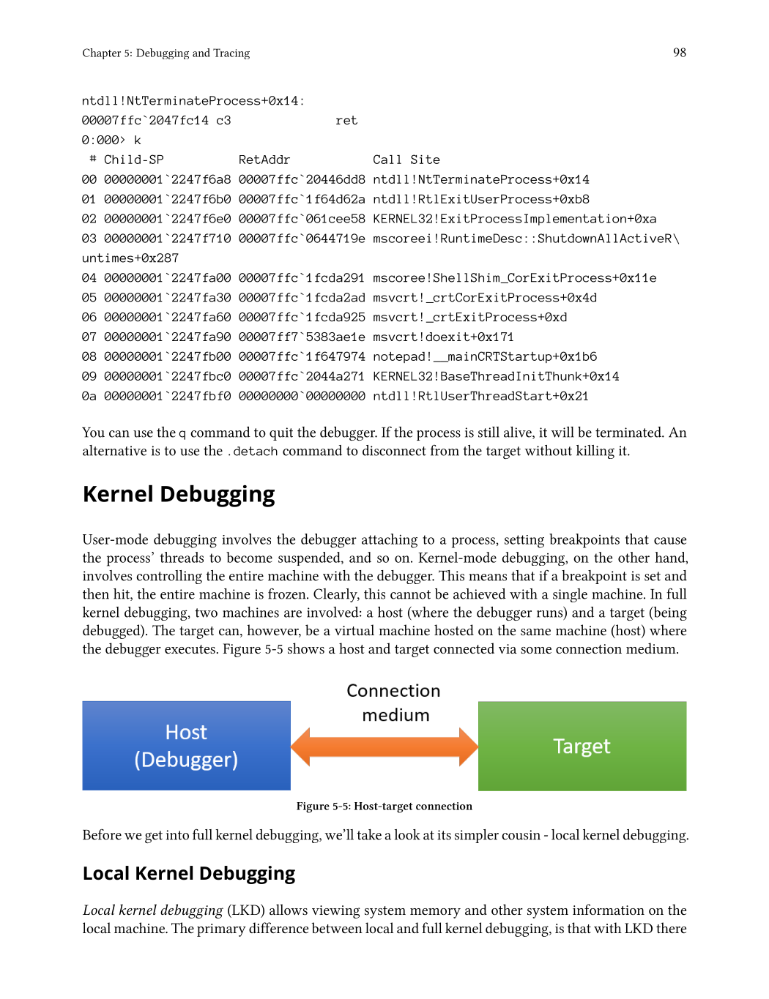


用户模式调试涉及调试器附加到进程、设置断点导致进程线程挂起等。另一方面，内核模式调试则涉及用调试器控制整台机器。这意味着，如果设置并命中了某个断点，整台机器都会被冻结。显然，这无法用单台机器实现。在完整内核调试中，涉及两台机器：一台主机（调试器运行的地方）和一台目标机（被调试的机器）。不过，目标机可以是运行调试器的主机（宿主机）上托管的一台虚拟机。图5-5展示了通过某种连接介质连接的主机和目标机。
                                    图5-5：主机-目标机连接
在我们深入完整内核调试之前，先来看看其较为简单的同类方式——本地内核调试（Local Kernel Debugging, LKD）。
本地内核调试

本地内核调试（LKD）允许在本地机器上查看系统内存和其他系统信息。本地内核调试与完整内核调试的主要区别在于，在LKD中无法设置断点，这意味着你始终查看的是系统的当前状态。这也意味着，即使在执行命令的过程中，情况也可能发生变化，因此某些信息可能过时或不可靠。而在完整内核调试中，只有在目标系统处于断点状态时才能输入命令，因此系统状态是不变的。
要配置LKD，请在提升权限的命令提示符中输入以下命令，然后重启系统：
bcdedit /debug on
在Windows 10、Server 2016及更高版本上，本地内核调试受安全启动（Secure Boot）保护。
             要激活LKD，你需要在机器的BIOS设置中禁用安全启动。如果因任何原因无法做到这一点，还有一种替代方法，即使用Sysinternals的LiveKd工具。将LiveKd.exe复制到适用于Windows的调试工具主目录。然后使用以下命令通过LiveKd启动WinDbg：livekd -w。但这种体验并不相同，

因为Livekd的工作方式可能导致数据过时，并且你可能需要不时退出并重新启动调试器。
系统重启后，以提升权限启动WinDbg（如果你使用的是64位系统，请启动64位版本）。选择菜单“文件”/“附加到内核”（WinDbg预览版）或“文件”/“内核调试...”（经典版WinDbg）。选择“本地”选项卡，然后点击“确定”。你应该会看到类似以下的输出：
```c
Microsoft (R) Windows Debugger Version 10.0.22415.1003 AMD64
Copyright (c) Microsoft Corporation. All rights reserved.
```
```text
Connected to Windows 10 22000 x64 target at (Wed Sep 29 10:57:30.682 2021 (UTC \
+ 3:00)), ptr64 TRUE
************* Path validation summary **************
Response                         Time (ms)     Location
Deferred                                       SRV*c:\symbols*https://msdl.micr\
osoft.com/download/symbols
Symbol search path is: SRV*c:\symbols*https://msdl.microsoft.com/download/symbo\
ls
Executable search path is:
Windows 10 Kernel Version 22000 MP (6 procs) Free x64
Product: WinNt, suite: TerminalServer SingleUserTS
Edition build lab: 22000.1.amd64fre.co_release.210604-1628
Machine Name:
Kernel base = 0xfffff802`07a00000 PsLoadedModuleList = 0xfffff802`08629710
Debug session time: Wed Sep 29 10:57:30.867 2021 (UTC + 3:00)
System Uptime: 0 days 16:44:39.106
```
请注意，提示符显示的是lkd。这表示本地内核调试处于活动状态。
本地内核调试教程
如果你熟悉内核调试命令，可以放心地跳过本节。
你可以使用process 0 0命令显示系统上运行的所有进程的基本信息：
```text
lkd> !process 0 0

**** NT ACTIVE PROCESS DUMP ****
PROCESS ffffd104936c8040
    SessionId: none Cid: 0004    Peb: 00000000 ParentCid: 0000
    DirBase: 006d5000 ObjectTable: ffffa58d3cc44d00 HandleCount: 3909.
    Image: System
PROCESS ffffd104936e2080
    SessionId: none Cid: 0058    Peb: 00000000 ParentCid: 0004
DirBase: 0182c000 ObjectTable: ffffa58d3cc4ea40 HandleCount:                         0.
    Image: Secure System
PROCESS ffffd1049370a080
    SessionId: none Cid: 0090    Peb: 00000000 ParentCid: 0004
    DirBase: 011b6000 ObjectTable: ffffa58d3cc65a80 HandleCount:                         0.
    Image: Registry
PROCESS ffffd10497dd0080
    SessionId: none Cid: 024c    Peb: bc6c2ba000 ParentCid: 0004
    DirBase: 10be4b000 ObjectTable: ffffa58d3d49ddc0 HandleCount:                        60.
    Image: smss.exe
...
```
对于每个进程，会显示以下信息：
    • 附加到 PROCESS 文本的地址是进程的 EPROCESS 地址（当然，在内核空间中）。
    • SessionId - 进程运行所在的会话。
    • Cid -（客户端 ID）唯一的进程 ID。
    • Peb - 进程环境块（Process Environment Block，PEB）的地址。该地址自然位于用户空间。
    • ParentCid -（父客户端 ID）父进程的进程 ID。注意，父进程有可能已不存在，因此此 ID 可能属于父进程终止后创建的某个进程。
    • DirBase - 该进程的主页目录（Master Page Directory）的物理地址，用作虚拟地址到物理地址转换的基础。在 x64 上，这被称为 Page Map Level 4；在 x86 上，称为页目录指针表（Page Directory Pointer Table，PDPT）。
    • ObjectTable - 指向进程私有句柄表的指针。
    • HandleCount - 该进程句柄表中的句柄数。
    • Image - 可执行文件名，或与某个可执行文件无关的特殊进程名（如 Secure System、System、Mem Compression）。
!process 命令至少接受两个参数。第一个参数使用进程的 EPROCESS 地址或唯一的进程 ID 来指示感兴趣的进程，其中零表示“所有进程或任意进程”。第二个参数是要显示的详细程度（比特掩码），其中零表示最少的细节。还可以添加第三个参数来搜索特定的可执行文件。以下是几个示例：
列出所有运行 explorer.exe 的进程：
```text
lkd> !process 0 0 explorer.exe

ffffd1049e118080
  SessionId: 1 Cid: 1780     Peb: 0076b000 ParentCid: 16d0
  DirBase: 362ea5000 ObjectTable: ffffa58d45891680 HandleCount: 3208.
  Image: explorer.exe
PROCESS ffffd104a14e2080
  SessionId: 1 Cid: 2548    Peb: 005c1000 ParentCid: 0314
  DirBase: 140fe9000 ObjectTable: ffffa58d46a99500 HandleCount: 2613.
  Image: explorer.exe
```
通过指定进程地址和更高的详细程度来列出有关特定进程的更多信息：
```text
lkd> !process ffffd1049e7a60c0 1

ffffd1049e7a60c0
    SessionId: 1 Cid: 1374     Peb: d3e343000 ParentCid: 0314
    DirBase: 37eb97000 ObjectTable: ffffa58d58a9de00 HandleCount: 224.
    Image: dllhost.exe
    VadRoot ffffd104b81c7db0 Vads 94 Clone 0 Private 455. Modified 2. Locked 0.
    DeviceMap ffffa58d41354230
    Token                             ffffa58d466e0060
    ElapsedTime                       01:04:36.652
    UserTime                          00:00:00.015
    KernelTime                        00:00:00.015
    QuotaPoolUsage[PagedPool]         201696
    QuotaPoolUsage[NonPagedPool]      13048
    Working Set Sizes (now,min,max) (4330, 50, 345) (17320KB, 200KB, 1380KB)
    PeakWorkingSetSize                4581
    VirtualSize                       2101383 Mb
    PeakVirtualSize                   2101392 Mb
    PageFaultCount                    5427
    MemoryPriority                    BACKGROUND
    BasePriority                      8
     CommitCharge                                     678
     Job                                              ffffd104a05ed380
```
从上述输出可以看出，显示了更多关于进程的信息。其中一些信息带有超链接，便于进一步检查。例如，该进程所属的作业（如果有）就是一个超链接，单击后会执行 !job 命令。
单击 Job 地址超链接：
```text
lkd> !job ffffd104a05ed380

at ffffd104a05ed380
  Basic Accounting Information
    TotalUserTime:             0x0
    TotalKernelTime:           0x0
    TotalCycleTime:            0x0
    ThisPeriodTotalUserTime:   0x0
    ThisPeriodTotalKernelTime: 0x0
    TotalPageFaultCount:       0x0
    TotalProcesses:            0x1
    ActiveProcesses:           0x1
    FreezeCount:               0
    BackgroundCount:           0
    TotalTerminatedProcesses: 0x0
    PeakJobMemoryUsed:         0x2f5
    PeakProcessMemoryUsed:     0x2f5
  Job Flags
    [wake notification allocated]
    [wake notification enabled]
    [timers virtualized]
  Limit Information (LimitFlags: 0x800)
  Limit Information (EffectiveLimitFlags: 0x403800)

    JOB_OBJECT_LIMIT_BREAKAWAY_OK
```
作业（Job）是一个内核对象，用于管理一个或多个进程，并可以对其施加各种限制并获取统计信息。关于作业的讨论超出了本书范围。更多信息可以在《Windows 内核原理与实现》（第 7 版，第 1 部分）和《Windows 10 系统编程》（第 1 部分）中找到。
```text
与往常一样，像 !job 这样的命令会隐藏实际数据结构中的一些信息。在此例中，类型为 EJOB。使用 dt nt!_ejob 命令加上作业地址即可查看所有详细信息。
```
进程的 PEB 也可以通过单击其超链接来查看。这类似于在用户模式下使用的 !peb 命令，但这里的关键在于必须首先设置正确的进程上下文，因为地址位于用户空间。单击 Peb 超链接。你会看到类似这样的内容：
```text
lkd> .process /p ffffd1049e7a60c0; !peb d3e343000

process is now ffffd104`9e7a60c0
PEB at 0000000d3e343000
    InheritedAddressSpace:    No
    ReadImageFileExecOptions: No
    BeingDebugged:            No
    ImageBaseAddress:         00007ff661180000
    NtGlobalFlag:             0
    NtGlobalFlag2:            0
    Ldr                       00007ffb37ef9120
    Ldr.Initialized:          Yes
    Ldr.InInitializationOrderModuleList: 000001d950004560 . 000001d95005a960
    Ldr.InLoadOrderModuleList:           000001d9500046f0 . 000001d95005a940
    Ldr.InMemoryOrderModuleList:         000001d950004700 . 000001d95005a950
                    Base TimeStamp                     Module
            7ff661180000 93f44fbf Aug 29 00:12:31 2048 C:\WINDOWS\system32\DllH\
ost.exe
            7ffb37d80000 50702a8c Oct 06 15:56:44 2012 C:\WINDOWS\SYSTEM32\ntdl\
l.dll
            7ffb36790000 ae0b35b0 Jul 13 01:50:24 2062 C:\WINDOWS\System32\KERN\
EL32.DLL
...
```
正确的进程上下文通过 .process 元命令设置，然后显示 PEB。这是查看用户空间内存的通用技术——始终确保调试器设置为正确的进程上下文。
再次执行 !process 命令，但将详细信息的第二个比特位置为 1：
```text
lkd> !process ffffd1049e7a60c0 2

ffffd1049e7a60c0
  SessionId: 1 Cid: 1374     Peb: d3e343000 ParentCid: 0314
  DirBase: 37eb97000 ObjectTable: ffffa58d58a9de00 HandleCount: 221.
  Image: dllhost.exe
    THREAD ffffd104a02de080 Cid 1374.022c Teb: 0000000d3e344000 Win32Thread: \
ffffd104b82ccbb0 WAIT: (UserRequest) UserMode Non-Alertable
        ffffd104b71d2860 SynchronizationEvent
    THREAD ffffd104a45e8080 Cid 1374.0f04 Teb: 0000000d3e352000 Win32Thread: \
ffffd104b82ccd90 WAIT: (WrUserRequest) UserMode Non-Alertable
        ffffd104adc5e0c0 QueueObject
     THREAD ffffd104a229a080       Cid 1374.1ed8     Teb: 0000000d3e358000 Win32Thread: \
ffffd104b82cf900 WAIT: (UserRequest) UserMode Non-Alertable
        ffffd104b71dfb60 NotificationEvent
        ffffd104ad02a740 QueueObject
    THREAD ffffd104b78ee040 Cid 1374.0330 Teb: 0000000d3e37a000 Win32Thread: \
0000000000000000 WAIT: (WrQueue) UserMode Alertable
        ffffd104adc4f640 QueueObject
```
详细级别 2 显示了进程中线程的摘要以及它们正在等待的对象（如果有）。
你可以使用其他详细值（4、8），或者进行组合，例如 3（即 1 与 2 按位或）。
再次重复 !process 命令，但这次不指定详细级别。将显示进程的更多信息（此处的默认值是完整详细信息）：
```text
lkd> !process ffffd1049e7a60c0

ffffd1049e7a60c0
    SessionId: 1 Cid: 1374     Peb: d3e343000 ParentCid: 0314
    DirBase: 37eb97000 ObjectTable: ffffa58d58a9de00 HandleCount: 223.
    Image: dllhost.exe
    VadRoot ffffd104b81c7db0 Vads 94 Clone 0 Private 452. Modified 2. Locked 0.
    DeviceMap ffffa58d41354230
    Token                             ffffa58d466e0060
    ElapsedTime                       01:10:30.521
    UserTime                          00:00:00.015
    KernelTime                        00:00:00.015
    QuotaPoolUsage[PagedPool]         201696
    QuotaPoolUsage[NonPagedPool]      13048
    Working Set Sizes (now,min,max) (4329, 50, 345) (17316KB, 200KB, 1380KB)
    PeakWorkingSetSize                4581
    VirtualSize                       2101383 Mb
    PeakVirtualSize                   2101392 Mb
    PageFaultCount                    5442
    MemoryPriority                    BACKGROUND
    BasePriority                      8
    CommitCharge                      678
    Job                               ffffd104a05ed380
    THREAD ffffd104a02de080 Cid 1374.022c Teb: 0000000d3e344000 Win32Thread: \
ffffd104b82ccbb0 WAIT: (UserRequest) UserMode Non-Alertable
        ffffd104b71d2860 SynchronizationEvent
    Not impersonating
    DeviceMap                 ffffa58d41354230
    Owning Process            ffffd1049e7a60c0       Image:         dllhost.exe
    Attached Process          N/A            Image:         N/A
    Wait Start TickCount      3641927        Ticks: 270880 (0:01:10:32.500)
    Context Switch Count      27             IdealProcessor: 2
    UserTime                  00:00:00.000
    KernelTime                00:00:00.000
    Win32 Start Address 0x00007ff661181310
    Stack Init ffffbe88b4bdf630 Current ffffbe88b4bdf010
    Base ffffbe88b4be0000 Limit ffffbe88b4bd9000 Call 0000000000000000
    Priority 8 BasePriority 8 PriorityDecrement 0 IoPriority 2 PagePriority 5
    Kernel stack not resident.
    THREAD ffffd104a45e8080 Cid 1374.0f04 Teb: 0000000d3e352000 Win32Thread: \
ffffd104b82ccd90 WAIT: (WrUserRequest) UserMode Non-Alertable
        ffffd104adc5e0c0 QueueObject
    Not impersonating
    DeviceMap                 ffffa58d41354230
    Owning Process            ffffd1049e7a60c0       Image:         dllhost.exe
    Attached Process          N/A            Image:         N/A
    Wait Start TickCount      3910734        Ticks: 2211 (0:00:00:34.546)
    Context Switch Count      2684           IdealProcessor: 4
    UserTime                  00:00:00.046
    KernelTime                00:00:00.078
    Win32 Start Address 0x00007ffb3630f230
    Stack Init ffffbe88b4c87630 Current ffffbe88b4c86a10
    Base ffffbe88b4c88000 Limit ffffbe88b4c81000 Call 0000000000000000
    Priority 10 BasePriority 8 PriorityDecrement 0 IoPriority 2 PagePriority 5
    Child-SP          RetAddr               Call Site
    ffffbe88`b4c86a50 fffff802`07c5dc17     nt!KiSwapContext+0x76
    ffffbe88`b4c86b90 fffff802`07c5fac9     nt!KiSwapThread+0x3a7
    ffffbe88`b4c86c70 fffff802`07c59d24     nt!KiCommitThreadWait+0x159
    ffffbe88`b4c86d10 fffff802`07c8ac70     nt!KeWaitForSingleObject+0x234
    ffffbe88`b4c86e00 fffff9da`6d577d46     nt!KeWaitForMultipleObjects+0x540
    ffffbe88`b4c86f00 fffff99c`c175d920     0xfffff9da`6d577d46
    ffffbe88`b4c86f08 fffff99c`c175d920     0xfffff99c`c175d920
    ffffbe88`b4c86f10 00000000`00000001     0xfffff99c`c175d920
    ffffbe88`b4c86f18 ffffd104`9a423df0     0x1
    ffffbe88`b4c86f20 00000000`00000001     0xffffd104`9a423df0
    ffffbe88`b4c86f28 ffffbe88`b4c87100     0x1
    ffffbe88`b4c86f30 00000000`00000000     0xffffbe88`b4c87100
...
```
该命令列出进程中的所有线程。每个线程由其附加在文本“THREAD”上的 ETHREAD 地址表示。调用堆栈也会列出——模块前缀“nt”代表内核——无需使用真实的内核模块名称。
        使用“nt”而不是显式写出内核模块名称的原因之一，是因为它们在 64 位和 32 位系统上不同（64 位上是 ntoskrnl.exe，32 位上是 ntkrnlpa.exe）；而且“nt”要短得多。
默认情况下不会加载用户模式符号，因此跨越到用户模式的线程堆栈只会显示数值地址。你可以在使用 .process 命令将进程上下文设置为感兴趣的进程之后，显式地用 .reload /user 加载用户符号：
```text
lkd> !process 0 0 explorer.exe

ffffd1049e118080
    SessionId: 1 Cid: 1780     Peb: 0076b000 ParentCid: 16d0
    DirBase: 362ea5000 ObjectTable: ffffa58d45891680 HandleCount: 3217.
    Image: explorer.exe
PROCESS ffffd104a14e2080
    SessionId: 1 Cid: 2548    Peb: 005c1000 ParentCid: 0314
    DirBase: 140fe9000 ObjectTable: ffffa58d46a99500 HandleCount: 2633.
    Image: explorer.exe
lkd> .process /p ffffd1049e118080

process is now ffffd104`9e118080
lkd> .reload /user

User Symbols
................................................................
lkd> !process ffffd1049e118080

ffffd1049e118080
    SessionId: 1 Cid: 1780     Peb: 0076b000 ParentCid: 16d0
    DirBase: 362ea5000 ObjectTable: ffffa58d45891680 HandleCount: 3223.
    Image: explorer.exe
...
    THREAD ffffd1049e47c400 Cid 1780.1754 Teb: 000000000078c000 Win32Thread: \
ffffd1049e5da7a0 WAIT: (WrQueue) UserMode Alertable
        ffffd1049e076480 QueueObject
    IRP List:
        ffffd1049fbea9b0: (0006,0478) Flags: 00060000 Mdl: 00000000
        ffffd1049efd6aa0: (0006,0478) Flags: 00060000 Mdl: 00000000
        ffffd1049efee010: (0006,0478) Flags: 00060000 Mdl: 00000000
        ffffd1049f3ef8a0: (0006,0478) Flags: 00060000 Mdl: 00000000
    Not impersonating
      DeviceMap                 ffffa58d41354230
      Owning Process            ffffd1049e118080        Image:        explorer.exe
      Attached Process          N/A            Image:          N/A
      Wait Start TickCount      3921033        Ticks: 7089 (0:00:01:50.765)
      Context Switch Count      16410          IdealProcessor: 5
      UserTime                  00:00:00.265
      KernelTime                00:00:00.234
      Win32 Start Address ntdll!TppWorkerThread (0x00007ffb37d96830)
      Stack Init ffffbe88b5fc7630 Current ffffbe88b5fc6d20

      Base ffffbe88b5fc8000 Limit ffffbe88b5fc1000 Call 0000000000000000
      Priority 9 BasePriority 8 PriorityDecrement 0 IoPriority 2 PagePriority 5
      Child-SP          RetAddr               Call Site
      ffffbe88`b5fc6d60 fffff802`07c5dc17     nt!KiSwapContext+0x76
      ffffbe88`b5fc6ea0 fffff802`07c5fac9     nt!KiSwapThread+0x3a7
      ffffbe88`b5fc6f80 fffff802`07c62526     nt!KiCommitThreadWait+0x159

      ffffbe88`b5fc7020 fffff802`07c61f38     nt!KeRemoveQueueEx+0x2b6
      ffffbe88`b5fc70d0 fffff802`07c6479c     nt!IoRemoveIoCompletion+0x98
      ffffbe88`b5fc71f0 fffff802`07e25075     nt!NtWaitForWorkViaWorkerFactory+0x\
39c
    ffffbe88`b5fc7430 00007ffb`37e26e84                  nt!KiSystemServiceCopyEnd+0x25 (Tra\
pFrame @ ffffbe88`b5fc74a0)

    00000000`03def858 00007ffb`37d96b0f                  ntdll!NtWaitForWorkViaWorkerFactory\
+0x14

    00000000`03def860 00007ffb`367a54e0                  ntdll!TppWorkerThread+0x2df
    00000000`03defb50 00007ffb`37d8485b                  KERNEL32!BaseThreadInitThunk+0x10
    00000000`03defb80 00000000`00000000                  ntdll!RtlUserThreadStart+0x2b
...
```
注意，上述线程还发出了几个 IRP。我们将在第 7 章更详细地讨论这一点。
可以使用 !thread 命令和线程地址单独查看线程信息。请查阅调试器文档，了解该命令显示的各类信息的说明。
在内核模式调试中，其他一些通常有用或有趣的命令包括

：
      • !pcr - 显示指定索引的处理器的进程控制区（Process Control Region，PCR）（如果未指定索引，默认显示处理器 0）。
      • !vm - 显示系统和进程的内存统计信息。
      • !running - 显示系统中所有处理器上正在运行的线程信息。
我们将在后续章节中探讨更多对调试驱动程序有用的具体命令。
完整内核调试


完整内核调试需要在宿主机和目标机上进行配置。在本节中，我们将看到如何将虚拟机配置为内核调试的目标机。这是内核驱动程序开发（在不开发硬件设备驱动程序时）推荐且最便捷的设置。我们将逐步介绍配置 Hyper-V 虚拟机的步骤。如果你使用其他虚拟化技术（如 VMWare 或 VirtualBox），请查阅相应产品的文档或网上资料，以获得相同结果的正确过程。
目标机和宿主机必须通过某种通信介质进行通信。有多种可用选项。最快的通信选项是使用网络。遗憾的是，这要求宿主机和目标机至少运行 Windows 8。由于 Windows 7 仍是一个可行的目标系统，因此还有另一个方便的选项——COM（串行）端口，它可以作为命名管道暴露给宿主机。所有虚拟化平台都允许将虚拟串行端口重定向到宿主机上的命名管道。我们将探讨这两种选项。
             与本地内核调试一样，目标机不能使用安全启动（Secure Boot）。对于完整内核调试，没有变通方法。
使用虚拟串行端口
在本节中，我们将配置目标机和宿主机，以使用作为命名管道暴露给宿主机的虚拟 COM 端口。在下一节中，我们将配置使用网络的内核调试。
配置目标机
必须为目标虚拟机配置内核调试，类似于本地内核调试，但需要将连接介质设置为该计算机上的虚拟串行端口。
一种配置方法是使用 bcdedit，在提升的命令窗口中执行：
bcdedit /debug on
bcdedit /dbgsettings serial debugport:1 baudrate:115200
根据实际的虚拟串行端口号（通常为 1）更改调试端口号。
必须重启虚拟机才能使这些配置生效。在此之前，我们可以将串行端口映射到一个命名管道。以下是 Hyper-V 虚拟机的步骤：
如果 Hyper-V 虚拟机是第 1 代（旧版），在虚拟机设置的 UI 中有简单的配置选项。使用“添加硬件”选项在没有串行端口时添加一个。然后配置串行端口，将其映射到你选择的命名端口。图 5-6 显示了此对话框。
                       图 5-6：为 Hyper-V 第 1 代 VM 将串行端口映射到命名管道
对于第 2 代 VM，目前没有 UI 可用。要配置此项，请确保 VM 已关闭，然后打开提升的 PowerShell 窗口。
键入以下命令，设置映射到命名管道的串行端口：
PS C:\>Set-VMComPort myvmname -Number 1 -Path "\\.\pipe\debug"
根据之前用 bcdedit 设置的 COM 端口号，适当更改 VM 名称和端口号。确保管道路径是唯一的。
你可以使用 Get-VMComPort 验证设置是否符合预期：
PS C:\>Get-VMComPort myvmname
VMName   Name Path
------   ---- ----
myvmname COM 1 \\.\pipe\debug
myvmname COM 2
现在可以启动 VM——目标机已准备就绪。
配置宿主机
必须正确配置内核调试器，以便在同一串行端口上连接到 VM，该串行端口映射到宿主机上暴露的命名管道。
以管理员身份启动内核调试器，然后选择“文件”>“附加到内核”。导航到“COM”选项卡。填写与目标机上设置一致的详细信息。图 5-7 显示了这些设置的样子。
                                   图 5-7：设置宿主机 COM 端口配置
单击“确定”。调试器应附加到目标机。如果没有，请单击工具栏上的“中断”按钮。以下是一些典型输出：
```c
Microsoft (R) Windows Debugger Version 10.0.18317.1001 AMD64
Copyright (c) Microsoft Corporation. All rights reserved.
```
Opened \\.\pipe\debug
Waiting to reconnect...
```text
Connected to Windows 10 18362 x64 target at (Sun Apr 21 11:28:11.300 2019 (UTC \
+ 3:00)), ptr64 TRUE
Kernel Debugger connection established. (Initial Breakpoint requested)
************* Path validation summary **************
Response                          Time (ms)     Location
Deferred                                        SRV*c:\Symbols*http://msdl.micro\
soft.com/download/symbols
Symbol search path is: SRV*c:\Symbols*http://msdl.microsoft.com/download/symbols
Executable search path is:
Windows 10 Kernel Version 18362 MP (4 procs) Free x64
Product: WinNt, suite: TerminalServer SingleUserTS
Built by: 18362.1.amd64fre.19h1_release.190318-1202
Machine Name:
Kernel base = 0xfffff801`36a09000 PsLoadedModuleList = 0xfffff801`36e4c2d0
Debug session time: Sun Apr 21 11:28:09.669 2019 (UTC + 3:00)
System Uptime: 1 days 0:12:28.864
Break instruction exception - code 80000003 (first chance)
*******************************************************************************
*                                                                              *
*   You are seeing this message because you pressed either                     *
*       CTRL+C (if you run console kernel debugger) or,                        *
*       CTRL+BREAK (if you run GUI kernel debugger),                           *
*   on your debugger machine's keyboard.                                       *
*                                                                              *

*                    THIS IS NOT A BUG OR A SYSTEM CRASH                       *
*                                                                              *
* If you did not intend to break into the debugger, press the "g" key, then    *
* press the "Enter" key now. This message might immediately reappear. If it *
* does, press "g" and

 "Enter" again.                                           *
*                                                                              *
*******************************************************************************

nt!DbgBreakPointWithStatus:
fffff801`36bcd580 cc               int      3
```
注意提示符有一个索引和单词 kd。该索引是触发中断的当前处理器。此时，目标虚拟机完全冻结。现在可以正常进行调试，但请记住，每当你在某处中断时，整个机器都会被冻结。
使用网络
在本节中，我们将配置使用网络进行完整内核调试，并重点说明与虚拟 COM 端口设置相比的差异。
配置目标机
在目标机上，使用提升的命令窗口，使用 bcdedit 按以下格式配置网络调试：
bcdedit /dbgsettings net hostip:<ip> port: <p

ort> [key: <key>]
hostip 必须是目标机可以访问的宿主机 IP 地址。port 可以是宿主机上任意可用的端口，但文档建议使用 50000 及以上的端口。key 是可选参数。如果不指定，该命令会生成一个随机密钥。例如：
bcdedit /dbgsettings net hostip:10.100.102.53 port:51111
Key=1rhvit77hdpv7.rxgwjdvhxj7v.312gs2roip4sf.3w25wrjeocobh
为了简单起见，也可以自己提供一个密钥，格式必须为 a.b.c.d。从安全角度来看，在本地虚拟机环境中这是可接受的：
bcdedit /dbgsettings net hostip:10.100.102.53 port:51111 key:1.2.3.4
Key=1.2.3.4
你可以随时单独使用 /dbgsettings 显示当前的调试配置：
bcdedit /dbgsettings
key                     1.2.3.4
debugtype               NET
hostip                  10.100.102.53
port                    51111
dhcp                    Yes
The operation completed successfully.
最后，重启目标机。
配置宿主机
在宿主机上，启动调试器并选择“文件”>“附加到内核”选项（或在经典 WinDbg 中选择“文件”>“内核调试…”）。导航到“NET”选项卡，并输入与你的设置相对应的信息（图 5-8）。
                                     图 5-8：附加到内核对话框
你可能需要单击“中断”按钮（可能多次）来建立连接。更多信息和故障排除提示，请访问 https://docs.microsoft.com/en-us/windows-hardware/drivers/debugger/setting-up-a-network-debugging-connection。
内核驱动调试教程
一旦宿主机和目标机连接成功，即可开始调试。我们将使用第 4 章中开发的 Booster 驱动程序来演示完整内核调试。
按照第 4 章的做法，在目标机上安装（但不要加载）该驱动程序。确保将驱动程序的 PDB 文件与驱动程序的 SYS 文件本身复制到一起。这可以简化获取驱动程序正确符号的过程。

让我们在 DriverEntry 中设置一个断点。现在还不能加载驱动程序，因为那样会导致 DriverEntry 执行，从而错失在那里设置断点的机会。由于驱动程序尚未加载，我们可以使用 bu 命令（未解析断点）来设置一个未来断点。如果目标机当前正在运行，请中断它，然后在调试器中键入以下命令：
```text
0: kd> bu booster!driverentry
0: kd> bl
   0 e Disable Clear u        0001 (0001) (booster!driverentry)
```
此时，断点是未解析的，因为我们的模块（驱动程序）尚未加载。每当有新的模块被加载时，调试器都会重新评估该断点。
发出 g 命令让目标机继续执行，然后使用 sc start booster 加载驱动程序（假设驱动程序名为 booster）。如果一切顺利，断点应该命中，源文件应自动打开，命令窗口中会显示以下输出：
0: kd> g
```text
Breakpoint 0 hit
Booster!DriverEntry:
fffff802`13da11c0 4889542410                  mov        qword ptr [rsp+10h],rdx
```
冒号左侧的索引是断点命中时正在执行代码的 CPU 索引（在上面的输出中是 CPU 0）。
图 5-9 显示了 WinDbg Preview 源窗口自动打开并标记正确代码行的截图。局部变量窗口也如期显示。
                                   图 5-9：在 DriverEntry 中命中断点
此时，你可以单步执行源代码行，在局部变量窗口中查看变量，甚至可以向监视窗口添加表达式。你还可以像通常使用其他调试器一样，使用局部变量窗口更改值。
命令窗口一如既

往可用，但某些操作使用 GUI 更简便。例如，设置断点可以使用常规的 bp 命令，但你也可以简单地打开一个源文件（如果尚未打开），转到要设置断点的行，然后按 F9 或单击工具栏上的相应按钮。无论哪种方式，bp 命令都会在命令窗口中执行。断点窗口可以作为当前设置断点的快速概览。
    • 发出 k 命令，了解 DriverEntry 是如何被调用的：
0: kd> k
 # Child-SP          RetAddr               Call Site
```text
00 ffffbe88`b3f4f138 fffff802`13da5020     Booster!DriverEntry [D:\Dev\windowsk\
ernelprogrammingbook2e\Chapter04\Booster\Booster.cpp @ 9]
01 ffffbe88`b3f4f140 fffff802`081cafc0     Booster!GsDriverEntry+0x20 [minkerne\
l\tools\gs_support\kmode\gs_support.c @ 128]
02 ffffbe88`b3f4f170 fffff802`080858e2     nt!PnpCallDriverEntry+0x4c
03 ffffbe88`b3f4f1d0 fffff802`081aeab7     nt!IopLoadDriver+0x8ba
04 ffffbe88`b3f4f380 fffff802`07c48aaf     nt!IopLoadUnloadDriver+0x57
05 ffffbe88`b3f4f3c0 fffff802`07d5b615     nt!ExpWorkerThread+0x14f
06 ffffbe88`b3f4f5b0 fffff802`07e16c24     nt!PspSystemThreadStartup+0x55
07 ffffbe88`b3f4f600 00000000`00000000     nt!KiStartSystemThread+0x34
```
如果断点未能命中，可能是符号问题。执行 .reload 命令，查看问题是否解决。也可以在用户空间设置断点，但首先需要执行 .reload /user 强制调试器加载用户模式符号。
有时，可能希望断点仅在特定进程执行代码时触发。这可以通过在断点上添加 /p 开关来实现。在下面的示例中，仅当进程是特定的 explorer.exe 时才设置断点：
0: kd> !process 0 0 explorer.exe
PROCESS ffffd1049e118080
    SessionId: 1 Cid: 1780     Peb: 0076b000 ParentCid: 16d0
    DirBase: 362ea5000 ObjectTable: ffffa58d45891680 HandleCount: 3918.
    Image: explorer.exe
PROCESS ffffd104a14e2080
    SessionId: 1 Cid: 2548    Peb: 005c1000 ParentCid: 0314
    DirBase: 140fe9000 ObjectTable: ffffa58d46a99500 HandleCount: 4524.
    Image: explorer.exe
```text
0: kd> bp /p ffffd1049e118080 booster!boosterwrite
0: kd> bl
     0 e Disable Clear fffff802`13da11c0 [D:\Dev\Chapter04\Booster\Booster.cp\
p @ 9]   0001 (0001) Booster!DriverEntry
     1 e Disable Clear fffff802`13da1090 [D:\Dev\Chapter04\Booster\Booster.cp\
p @ 61] 0001 (0001) Booster!BoosterWrite
     Match process data ffffd104`9e118080
```
让我们在 BoosterWrite 函数的某个位置设置一个普通断点，方法是在源代码视图中的该行上按 F9，如图 5-10 所示（之前设置的条件断点也会显示）。
                                   图 5-10：在 DriverEntry 中命中断点
列出断点，会反映调试器计算偏移后的新断点：
0: kd> bl
```text
0 e Disable Clear fffff802`13da11c0 [D:\Dev\Chapter04\Booster\Booster.cpp @\
 9] 0001 (0001) Booster!DriverEntry
  1 e Disable Clear fffff802`13da1090 [D:\Dev\Chapter04\Booster\Booster.cpp @\
 61] 0001 (0001) Booster!BoosterWrite
Match process data ffffd104`9e118080
  2 e Disable Clear fffff802`13da10af [D:\Dev\Chapter04\Booster\Booster.cpp @\
65] 0001 (0001) Booster!BoosterWrite+0x1f
```
输入 g 命令释放目标机，然后使用某个线程 ID 和优先级运行 boost 应用程序：
c:\Test> boost 5964 30
BoosterWrite 内的断点应该命中：
```text
Breakpoint 2 hit
Booster!BoosterWrite+0x1f:
fffff802`13da10af 488b4c2468               mov       rcx,qword ptr [rsp+68h]
```
你可以继续正常调试，查看局部变量，单步执行/进入函数等。
最后，如果你想断开与目标机的连接，请输入 .detach 命令。如果该命令未恢复目标机运行，请单击工具栏上的“停止调试”按钮（可能需要多次单击）。
断言与跟踪

虽然有时必须使用调试器，但编写一些代码可以在很大程度上减少对调试器的依赖。在本节中，我们将探讨断言和强大的日志记录，它们适用于驱动程序的调试版和发行版构建。
断言
就像在用户模式中一样，断言可用于验证某些假设是否正确。无效的假设意味着出现了严重错误，因此最好停止运行。WDK 头文件为此提供了 NT_ASSERT 宏。
NT_ASSERT 接受一个可转换为布尔值的表达式。如果结果为非零（真），则继续执行。否则，断言失败，系统将采取以下操作之一：
    • 如果连接了内核调试器，将引发断言失败断点，允许调试断言。
    • 如果未连接内核调试器，系统会进行 bugcheck。生成的转储文件将精确指出断言失败的行。
这是添加到第 4 章 Booster 驱动程序的 DriverEntry 函数中的一个简单断言用法：
```c
extern "C" NTSTATUS
DriverEntry(PDRIVER_OBJECT DriverObject, PUNICODE_STRING) {
    DriverObject->DriverUnload = BoosterUnload;
     DriverObject->MajorFunction[IRP_MJ_CREATE] = BoosterCreateClose;
     DriverObject->MajorFunction[IRP_MJ_CLOSE] = BoosterCreateClose;

     DriverObject->MajorFunction[IRP_MJ_WRITE] = BoosterWrite;
     UNICODE_STRING devName = RTL_CONSTANT_STRING(L"\\Device\\Booster");
     PDEVICE_OBJECT DeviceObject;
     NTSTATUS status = IoCreateDevice(
```
DriverObject,           // 我们的驱动程序对象
         0,                      // 不需要额外字节
         &devName,               // 设备名称
         FILE_DEVICE_UNKNOWN,    // 设备类型
         0,                      // 特征标志
         FALSE,                  // 非独占
         &DeviceObject);         // 结果指针
```c
if (!NT_SUCCESS(status)) {
         KdPrint(("创建设备对象失败 (0x%08X)\n", status));
         return status;
     }
     NT_ASSERT(DeviceObject);
     UNICODE_STRING symLink = RTL_CONSTANT_STRING(L"\\??\\Booster");
     status = IoCreateSymbolicLink(&symLink, &devName);
     if (!NT_SUCCESS(status)) {
         KdPrint(("创建符号链接失败 (0x%08X)\n", status));
         IoDeleteDevice(DeviceObject);
         return status;
     }
     NT_ASSERT(NT_SUCCESS(status));
     return STATUS_SUCCESS;
}
```
第一个断言确保设备对象指针非空：
```c
NT_ASSERT(DeviceObject);
```
第二个断言确保 DriverEntry 结束时状态是成功的：
```c
NT_ASSERT(NT_SUCCESS(status));
```
NT_ASSERT 仅在调试（Debug）构建中编译其表达式，这使得使用断言在性能上几乎免费，因为这些断言不会成为最终发行版驱动程序的一部分。这也意味着你需要小心，确保 NT_ASSERT 中的表达式没有副作用。例如，以下代码是错误的：
```c
NT_ASSERT(NT_SUCCESS(IoCreateSymbolicLink(...)));
```
这是因为在发行（Release）构建中，对 IoCreateSymbolicLink 的调用会完全消失。正确的断言方式应类似如下：
```c
status = IoCreateSymbolicLink(...);
NT_ASSERT(NT_SUCCESS(status));
```
断言非常有用，应该大量使用，因为它们仅在调试构建中有影响。
扩展 DbgPrint
我们已经看到使用 DbgPrint 函数（以及 KdPrint 宏）生成输出，这些输出可以通过内核调试器或类似工具（如 DebugView）查看。这确实可行且使用简单，但存在一些明显的缺点：
    • 所有输出都会被生成——没有简单的方法可以过滤输出，只显示部分内容（例如仅显示错误和警告）。下一段介绍的扩展 DbgPrintEx 函数部分缓解了这个问题。
    • DbgPrint(Ex) 是一个相对较慢的函数，这就是为什么它大多与 KdPrint 一起使用，以便在发行版构建中消除开销。但在发行版构建中，输出可能非常重要。某些错误可能仅在发行版构建中出现，此时良好的输出对于诊断问题可能非常有用。
    • DbgPrint 没有附加语义信息——它只是文本。无法添加带有属性名称或类型信息的值。
    • 没有内置方法将输出保存到文件中，而不仅仅在调试器中查看。如果使用 DebugView，它可以将输出保存到文件。
```c
DbgPrint(Ex) 的输出限制为 512 字节。任何剩余的字节都会丢失。
```
DbgPrintEx 函数（以及相关的 KdPrintEx 宏）被添加进来，以为 DbgPrint 输出提供一些过滤支持：
```c
ULONG DbgPrintEx (
    _In_ ULONG ComponentId,
    _In_ ULONG Level,
    _In_z_ _Printf_format_string_ PCSTR Format,
```
```text
...);       // 任意数量的参数
```
组件 ID 列表位于 <dpfilter.h> 头文件中（用户和内核模式通用），目前包含 155 个有效值（0 到 154）。大多数值供内核和微软驱动程序使用，只有少数几个预定供第三方驱动程序使用：
    • DPFLTR_IHVVIDEO_ID (78) - 用于显卡驱动。
    • DPFLTR_IHVAUDIO_ID (79) - 用于音频驱动。
    • DPFLTR_IHVNETWORK_ID (80) - 用于网络驱动。
    • DPFLTR_IHVSTREAMING_ID (81) - 用于流媒体驱动。
    • DPFLTR_IHVBUS_ID (82) - 用于总线驱动。
    • DPFLTR_IHVDRIVER_ID (77) - 用于所有其他驱动。
    • DPFLTR_DEFAULT_ID (101) - 在使用 DbgPrint 或传递非法组件编号时使用。
对于大多数驱动程序，应使用 DPFLTR_IHVDRIVER_ID 组件 ID。
Level 参数表示消息的严重程度（错误、警告、信息等），但技术上可以表示任何你希望的含义。此值的解释取决于它是介于 0 到 31 之间，还是大于 31：
    • 0 到 31 - 该级别是由表达式 1 << Level 构成的单个位。例如，如果 Level 为 5，则值为 32。
    • 大于 31 的任何值 - 该值直接使用。
<dpfilter.h> 定义了一些可以直接用于 Level 的常量：

```c
#define DPFLTR_ERROR_LEVEL   0
#define DPFLTR_WARNING_LEVEL 1
#define DPFLTR_TRACE_LEVEL   2
#define DPFLTR_INFO_LEVEL    3
```
你可以根据需要定义更多（或不同的）值。输出最终是否能到达其目的地，取决于组件 ID、由 Level 参数构成的位掩码，以及系统启动时从“调试打印筛选器”注册表项读取的全局掩码。由于“调试打印筛选器”注册表键默认不存在，因此所有组件 ID 都有一个默认值，即零。这意味着实际级别值是 1（1 << 0）。如果满足以下任一条件，输出将通过（value 是传递给 DbgPrintEx 的 Level 参数所指定的值）：
    • 如果 value & （该组件的调试打印筛选器值）为非零，则输出通过。 使用默认值时，即 (value & 1) != 0。
    • 如果 value 与组件 ID 级别的按位与结果非零，则输出通过。
如果两者都不为真，输出将被丢弃。
设置组件 ID 级别有以下三种方式：
    • 使用 HKLM\System\CCS\Control\Session Manager 下的“Debug Print Filter”注册表键。可以指定 DWORD 值，这些值的名称是组件 ID 的宏名称去掉前缀或后缀。例如，对于 DPFLTR_IHVVIDEO_ID，将名称设置为“IHVVIDEO”。
    • 如果连接了内核调试器，可以在调试期间更改组件的级别。例如，以下命令将 DPFLTR_IHVVIDEO_ID 的级别更改为 0x1ff：
ed Kd_IHVVIDEO_Mask 0x1ff
             也可以使用全局内核变量 Kd_WIN2000_Mask 通过内核调试器更改调试打印筛选器值。
    • 最后一种选项是通过原生 API NtSetDebugFilterState 进行更改。该 API 未公开文档化，但在实践中可能很有用。本书示例仓库 Tools 文件夹中提供的 dbgkflt 工具利用了这个 API（及其查询对应项 NtQueryDebugFilterState），因此即使没有连接内核调试器也可以进行更改。
        如果从用户模式调用 NtSetDebugFilterState，调用者的令牌必须具有调试权限（Debug privilege）。由于管理员默认具有此权限（非管理员用户无此权限），你必须从提升的命令窗口运行 dbgkflt，更改才能成功。
             <wdm.h> 提供的内核模式 API 是 DbgQueryDebugFilterState 和 DbgSetDebugFilterState。这些 API 仍未正式文档化，但至少它们的声明是可用的。它们使用与其原生调用者相同的参数和返回类型。这意味着如果需要，你可以从驱动程序本身调用这些 API（可能基于从注册表读取的配置）。
        使用 Dbgkflt
        不带参数运行 Dbgkflt 会显示其用法。
        要查询给定组件的有效级别，请添加组件名称（不带前缀或

### 其他调试函数

后缀）。例如：
        dbgkflt default
        这会返回 DPFLTR_DEFAULT_ID 组件的有效位。要将值更改为其他内容，请指定所需的值。它始终与 0x80000000 进行“或”操作，这样您指定的位将被直接使用，而不会将小于 32 的数字解释为 (1 << number)。
        例如，以下命令为 DEFAULT 组件设置前 4 位：
        dbgkflt default 0xf

DbgPrint 只是一个快捷方式，它使用 DPFLTR_DEFAULT_ID 组件调用 DbgPrintEx，如下所示（代码是概念性的，无法编译）：

```c
ULONG DbgPrint (PCSTR Format, arguments) {
    return DbgPrintEx(DPFLTR_DEFAULT_ID, DPFLTR_INFO_LEVEL, Format, arguments);
}
```
这就解释了为什么名为 DEFAULT 的 DWORD 值为 8 (1 << DPFLTR_INFO_LEVEL) 是需要在注册表中写入的值，以便使 DbgPrint 输出通过。

基于以上细节，驱动程序（driver）可以使用 DbgPrintEx（或 KdPrintEx 宏）指定不同的级别，以便根据需要过滤输出。然而，每次调用可能会有些冗长。例如：

```c
DbgPrintEx(DPFLTR_IHVDRIVER_ID, DPFLTR_INFO_LEVEL,
    "Booster: DriverEntry called. Registry Path: %wZ\n", RegistryPath);
```
显然，我们可能更倾向于一个始终使用 DPFLTR_IHVDRIVER_ID（适用于通用第三方驱动程序的那个）的简化函数，如下所示：

```c
Log(DPFLTR_INFO_LEVEL,
    "Booster: DriverEntry called. Registry Path: %wZ\n", RegistryPath);
```
我们还可以更进一步，定义隐式使用日志级别的特定函数：

```c
LogInfo("Booster: DriverEntry called. Registry Path: %wZ\n", RegistryPath);
```
下面是一个示例，我们通过创建枚举来定义几个要使用的位（并非必须使用已定义的位）：

```c
enum class LogLevel {
    Error = 0,
    Warning,
    Information,
    Debug,
    Verbose
};
```
每个值都与一个小数字（小于 32）关联，以便 DbgPrintEx 将这些值解释为 2 的幂。现在我们可以定义如下函数：

```c
ULONG Log(LogLevel level, PCSTR format, ...);
ULONG LogError(PCSTR format, ...);
ULONG LogWarning(PCSTR format, ...);
ULONG LogInfo(PCSTR format, ...);
ULONG LogDebug(PCSTR format, ...);
```
等等。Log 是最通用的函数，而其他函数则使用预定义的日志级别。以下是前两个函数的实现：

```c
#include <stdarg.h>
ULONG Log(LogLevel level, PCSTR format, ...) {
    va_list list;
    va_start(list, format);
    return vDbgPrintEx(DPFLTR_IHVDRIVER_ID,
        static_cast<ULONG>(level), format, list);
}
ULONG LogError(PCSTR format, ...) {
    va_list list;
    va_start(list, format);
    return vDbgPrintEx(DPFLTR_IHVDRIVER_ID,

        static_cast<ULONG>(LogLevel::Error), format, list);
}
```
> 上述代码中使用 static_cast 在 C++ 中是必需的，因为有作用域的枚举不会自动转换为整数。如果您愿意，也可以使用 C 风格的强制转换。如果您使用的是纯 C，请将有作用域的枚举改为标准枚举（移除 class 关键字）。
> 各种 DbgPrint 变体的返回值类型为 ULONG，但实际上是一个标准的 NTSTATUS 值。

该实现使用了经典的 C 可变参数省略号（...），并以标准 C 中的方式实现。实现调用了 vDbgPrintEx，该函数接受 va_list，这是使其正常工作的必要条件。

> 可以使用 C++ 可变参数模板特性创建更复杂的实现。这留给有兴趣（且充满热情）的读者作为练习。

上述代码可以在 Booster2 项目中找到，该项目是本章示例的一部分。作为该项目的一部分，以下是使用这些函数的一些示例：

```c
// 在 DriverEntry 中
Log(LogLevel::Information, "Booster2: DriverEntry called. Registry Path: %wZ\n"\
```
,
```c
RegistryPath);
// 卸载例程
LogInfo("Booster2: unload called\n");
// 创建设备对象时遇到错误
LogError("Failed to create device object (0x%08X)\n", status);
// 查找线程 ID 时出错
LogError("Failed to locate thread %u (0x%X)\n",
    data->ThreadId, status);
// 成功更改线程优先级
LogInfo("Priority for thread %u changed from %d to %d\n",
    data->ThreadId, oldPriority, data->Priority);
```
### 其他调试函数

上一节使用了 vDbgPrintEx，其定义如下：

```c
ULONG vDbgPrintEx(
    _In_ ULONG ComponentId,
    _In_ ULONG Level,
    _In_z_ PCCH Format,
    _In_ va_list arglist);
```
它与 DbgPrintEx 相同，只是最后一个参数是已构造好的 va_list。还有一个包装宏 vKdPrintEx（仅在 Debug 版本中编译）。

最后，还有一个用于打印的扩展函数 - vDbgPrintExWithPrefix：

```c
ULONG vDbgPrintExWithPrefix (
    _In_z_ PCCH Prefix,
    _In_ ULONG ComponentId,
    _In_ ULONG Level,
    _In_z_ PCCH Format,
    _In_ va_list arglist);
```
它会在输出中添加一个前缀（第一个参数）。这对于将我们的驱动程序与使用相同函数的其他驱动程序区分开很有用，同时也便于在 DebugView 等工具中进行过滤。例如，之前显示的代码片段使用了显式的前缀：

```c
LogInfo("Booster2: unload called\n");
```
我们可以将其定义为宏，并在任何输出中作为第一个词使用，如下所示：

```c
#define DRIVER_PREFIX "Booster2: "
LogInfo(DRIVER_PREFIX "unload called\n");
```
这样做是可行的，但通过在每个调用中自动添加前缀会更好，方法是在 Log 实现中调用 vDbgPrintExWithPrefix 而不是 vDbgPrintEx。例如：

```c
ULONG Log(LogLevel level, PCSTR format, ...) {
    va_list list;
    va_start(list, format);
    return vDbgPrintExWithPrefix("Booster2", DPFLTR_IHVDRIVER_ID,
        static_cast<ULONG>(level), format, list);
}
```
``

`

> 请完成 Log 函数各变体的实现。

### 跟踪日志记录（Trace Logging）

使用 DbgPrint 及其变体足够方便，但如前所述也存在一些缺点。跟踪日志记录（Trace Logging）是一种强大的替代（或补充）方案，它使用事件跟踪（Event Tracing for Windows，ETW）进行日志记录，可以实时捕获或记录到日志文件中。ETW 的额外优势在于性能高（可以用来记录每秒数千个事件而没有任何明显延迟），并且具有语义信息，这是 DbgPrint 函数生成的纯字符串所不具备的。

> 跟踪日志记录也可以以完全相同的方式在用户模式下使用。
> ETW 超出了本书的范围。您可以在官方文档或我的书《Windows 10 系统编程（第 2 部分）》中找到更多信息。

要开始使用跟踪日志记录，必须定义一个 ETW 提供程序（provider）。与“经典” ETW 不同，无需进行提供程序注册，因为跟踪日志记录确保事件元数据是记录信息的一部分，因此是自包含的。

提供程序必须具有唯一的 GUID。您可以使用 Visual Studio 中提供的“创建 GUID”工具（“工具”菜单）生成一个。图 5-11 显示了该工具的屏幕截图，其中选择了第二个单选按钮，因为它最接近我们需要的格式。单击“复制”按钮将该文本复制到剪贴板。

将该文本粘贴到驱动程序的主源文件中，并将粘贴的宏更改为 TRACELOGGING_DEFINE_PROVIDER，如下所示：

```c
// {B2723AD5-1678-446D-A577-8599D3E85ECB}
TRACELOGGING_DEFINE_PROVIDER(g_Provider, "Booster", \
```
```text
(0xb2723ad5, 0x1678, 0x446d, 0xa5, 0x77, 0x85, 0x99, 0xd3, 0xe8, 0x5e, 0xcb\
));
```
g_Provider 是一个创建的全局变量，用于表示 ETW 提供程序，其中“Booster”设置为其友好名称。

您需要添加以下 #include（这些在用户模式中也常用）：

```c
#include <TraceLoggingProvider.h>
#include <evntrace.h>
```
在 DriverEntry 中，调用 TraceLoggingRegister 注册提供程序：

```c
TraceLoggingRegister(g_Provider);
```
同样，应在卸载例程中注销提供程序，如下所示：

```c
TraceLoggingUnregister(g_Provider);
```
日志记录是通过 TraceLoggingWrite 宏完成的，该宏使用另一组宏提供可变数量的参数，为类型化属性提供方便的使用方式。以下是在 DriverEntry 中进行日志记录调用的示例：

```c
TraceLoggingWrite(g_Provider, "DriverEntry started",    // 提供程序，事件名称
TraceLoggingLevel(TRACE_LEVEL_INFORMATION),     // 日志级别
    TraceLoggingValue("Booster Driver", "DriverName"), // 值，名称
    TraceLoggingUnicodeString(RegistryPath, "RegistryPath"));   // 值，名称
```
上述调用含义如下：
- 使用 g_Provider 所描述的提供程序。
- 事件名称为“DriverEntry started”。
- 日志记录级别为“信息”（已定义多个级别）。
- 名为“DriverName”的属性的值为“Booster Driver”。
- 名为“RegistryPath”的属性的值为 RegistryPath 变量的值。

请注意 TraceLoggingValue 宏的用法——它是最通用的，并使用第一个参数（值）推断出的类型。还有许多其他类型安全的宏存在，例如上面的 TraceLoggingUnicodeString 宏确保其第一个参数确实是 UNICODE_STRING。

以下是另一个示例——如果符号链接创建失败：

```c
TraceLoggingWrite(g_Provider, "Error",
TraceLoggingLevel(TRACE_LEVEL_ERROR),
    TraceLoggingValue("Symbolic link creation failed", "Message"),
    TraceLoggingNTStatus(status, "Status", "Returned status"));
```
您可以使用任何您想要的“属性”。尽量提供事件最重要的细节。

以下是本章示例的 Booster 项目中的更多示例：

```c
// 创建/关闭调度 IRP
TraceLoggingWrite(g_Provider, "Create/Close",

TraceLoggingLevel(TRACE_LEVEL_INFORMATION),
    TraceLoggingValue(
        IoGetCurrentIrpStackLocation(Irp)->MajorFunction == IRP_MJ_CREATE ?
        "Create" : "Clo

se", "Operation"));
// 成功更改优先级
TraceLoggingWrite(g_Provider, "Boosting",
TraceLoggingLevel(TRACE_LEVEL_INFORMATION),

    TraceLoggingUInt32(data->ThreadId, "ThreadId"),
    TraceLoggingInt32(oldPr
```
iority, "OldPriority"),
```c
TraceLoggingInt32(data->Priority, "NewPriority"));
```
### 查看 ETW 跟踪

上述所有跟踪信息都去了哪里？通常情况下，它们会被丢弃。需要有人配置监听该提供程序，并将事件记录到实时会话或文件中。WDK 提供了一个名为 TraceView 的工具，正好可以用于此目的。

您可以打开“开发者命令”窗口，直接运行 TraceView.exe。如果找不到它，默认安装在类似 C:\Program Files (x86)\Windows Kits

\10\bin\10.0.22000.0\x64 的目录中。您可以将该可执行文件复制到驱动程序应该运行的目标机器上。运行 TraceView.exe 时，会显示一个空窗口（图 5-12）。

选择“文件”/“创建新日志会话”菜单以创建一个新会话。这将打开如图 5-13 所示的对话框。

TraceView 提供了多种定位提供程序的方法。我们可以将多个提供程序添加到同一个会话中，以从系统中的其他组件获取信息。现在，我们将使用“手动输入控件 GUID”选项添加我们的提供程序，并输入我们的 GUID（图 5-14）：

单击“确定”。将弹出一个对话框，询问解码信息的来源。使用默认的“自动”选项，因为跟踪日志记录不需要任何外部来源。您将在“创建新日志会话”对话框中看到唯一的提供程序。单击“下一步”按钮。向导的最后一步允许您选择输出应发送到何处：实时会话（通过 TraceView 显示）、文件或两者（图 5-15）。

单击“完成”。现在您可以正常加载/使用驱动程序。您应该会在主 TraceView 窗口中看到生成的输出（图 5-16）。

您可以在“消息”列中看到各种属性。当记录到文件时，您可以稍后使用 TraceView 打开该文件并查看记录的内容。

还有其他使用 TraceView 的方法，以及用于记录和查看 ETW 信息的其他工具。您还可以编写自己的工具来解析 ETW 日志，因为事件包含语义信息，因此可以轻松分析。

### 总结

在本章中，我们介绍了使用 WinDbg 进行调试的基础知识，以及驱动程序内部活动的跟踪。调试是一项需要培养的基本技能，因为包括内核驱动程序在内的各种软件都可能存在缺陷。

在下一章中，我们将深入研究一些需要了解的内核机制，因为这些机制在开发和调试驱动程序时会频繁出现。

# Chapter 6: Kernel Mechanisms

第6章：内核机制

本章讨论Windows内核提供的各种机制。其中一些机制对驱动编写者直接有用。另一些则是驱动开发者需要理解的机制，因为它们有助于调试和对系统活动的整体理解。
在本章中：
    • 中断请求级别
    • 延迟过程调用
    • 异步过程调用
    • 结构化异常处理
    • 系统崩溃
    • 线程同步
    • 高IRQL同步
    • 工作项

中断请求级别 (IRQL)


在第1章中，我们讨论了线程和线程优先级。当有多个线程希望执行而可用处理器不足时，这些优先级会被考虑。与此同时，硬件设备需要通知系统某些事项需要关注。一个简单的例子是磁盘驱动器执行的I/O操作。一旦操作完成，磁盘驱动器通过请求中断来通知完成。该中断连接到中断控制器硬件，然后该硬件将请求发送到某个处理器进行处理。接下来的问题是，哪个线程应该执行关联的中断服务例程 (Interrupt Service Routine, ISR)？

每个硬件中断都与一个由HAL确定的优先级关联，称为中断请求级别 (Interrupt Request Level, IRQL)（不要与被称为IRQ的中断物理线路混淆）。每个处理器的上下文都有自己的IRQL，就像任何寄存器一样。IRQL可能由CPU硬件实现，也可能不实现，但这实际上并不重要。IRQL应该像其他任何CPU寄存器一样对待。基本规则是：处理器以最高IRQL执行代码。例如，如果某个CPU在某时刻的IRQL为零，此时一个关联IRQL为5的中断到达，它会将状态（上下文）保存到当前线程的内核栈中，将IRQL提升到5，然后执行与该中断关联的ISR。一旦ISR完成，IRQL将回落到之前的级别，恢复先前执行的代码，就好像中断从未发生过一样。在ISR执行期间，其他IRQL等于或低于5的中断不能打断该处理器。反之，如果新中断的IRQL高于5，CPU将再次保存状态，将IRQL提升到新的级别，执行与第二个中断关联的第二个ISR，完成后回落到IRQL 5，恢复其状态并继续执行原始的ISR。本质上，提高IRQL会暂时屏蔽具有相同或较低IRQL的代码。中断发生时的基本事件序列如图6-1所示。图6-2展示了中断嵌套的形式。
                                  图6-1：基本中断分发
                                          图6-2：嵌套中断
图6-1和图6-2所描述场景的一个重要事实是，所有ISR的执行都是由同一个线程完成的——该线程最初被中断。Windows没有专门的线程来处理中断；中断由中断发生时被中断处理器上正在运行的任何线程处理。我们很快就会知道，当处理器的IRQL为2或更高时，上下文切换是不可能的，因此在这些ISR执行时，其他线程无法插入。
        被中断的线程不会因为这些“打断”而减少其时间片。可以说，这不是它的错。
当用户模式代码执行时，IRQL始终为零。这正是用户模式文档中不提及IRQL术语的一个原因——它始终为零且无法更改。大多数内核模式代码也以IRQL零运行。但在内核模式下，可以在当前处理器上提高IRQL。
重要的IRQL级别描述如下：

    • WDK中的PASSIVE_LEVEL (0) – 这是CPU的“正常”IRQL。用户模式代码始终在此级别运行。线程调度正常工作，如第1章所述。
    • APC_LEVEL (1) – 用于特殊的内核APC（异步过程调用将在本章后面讨论）。线程调度正常工作。
    • DISPATCH_LEVEL (2) – 此处情况发生根本变化。调度器无法在此CPU上唤醒。不允许访问分页内存——此类访问会导致系统崩溃。由于调度器无法干预，因此不允许等待内核对象（如果使用会导致系统崩溃）。
    • 设备IRQL – 用于硬件中断的一系列级别（x64/ARM/ARM64上为3到11，x86上为3到26）。IRQL 2的所有规则在此也适用。
    • 最高级别 (HIGH_LEVEL) – 这是最高IRQL，屏蔽所有中断。某些处理链表操作的API会使用它。实际值分别为15 (x64/ARM/ARM64) 和31 (x86)。
当处理器的IRQL提升到2或更高时（无论出于何种原因），执行的代码会受到某些限制：
    • 访问不在物理内存中的内存是致命的，会导致系统崩溃。这意味着从非分页池访问数据始终是安全的，而从分页池或用户提供的缓冲区访问数据则不安全，应避免。
    • 等待任何内核对象（例

如互斥体或事件）会导致系统崩溃，除非等待超时为零，这仍然是允许的。（我们将在本章后面的“线程同步”部分讨论调度器对象和等待。）
这些限制是由于调度器在IRQL 2“运行”的事实；因此如果处理器的IRQL已经是2或更高，调度器无法在该处理器上唤醒，因此无法进行上下文切换（在此CPU上切换运行线程）。只有更高级别中断才能暂时将代码转移到关联的ISR中，但这仍然是同一个线程——没有上下文切换发生；线程的上下文被保存，ISR执行，然后线程状态恢复。
             在调试时，可以使用 !irql 命令查看处理器当前的IRQL。可以指定一个可选的CPU编号，以显示该CPU的IRQL。
             您可以使用 !idt 调试器命令查看系统上注册的中断。

提升和降低IRQL

如前所述，在用户模式下不提及IRQL的概念，也无法更改它。在内核模式下，可以使用 KeRaiseIrql 函数提升IRQL，并使用 KeLowerIrql 将其降低回来。以下代码片段将IRQL提升到DISPATCH_LEVEL (2)，然后在此IRQL执行一些指令后将其降低回来。
```c
// 假设当前IRQL <= DISPATCH_LEVEL
KIRQL oldIrql;      // 类型定义为UCHAR
KeRaiseIrql(DISPATCH_LEVEL, &oldIrql);
NT_ASSERT(KeGetCurrentIrql() == DISPATCH_LEVEL);
// 在IRQL DISPATCH_LEVEL下工作
KeLowerIrql(oldIrql);
```
如果提升IRQL，请确保在同一函数中降低它。从函数中返回时IRQL高于进入时的值是非常危险的。此外，请确保 KeRaiseIrql 确实提高了IRQL，而 KeLowerIrql 确实降低了它；否则，将会发生系统崩溃。

线程优先级 vs. IRQL
IRQL 是处理器的属性。优先级是线程的属性。
线程优先级仅在 I

RQL < 2 时才有意义。一旦执行线程将IRQL提高到2或更高，其优先级就不再有任何意义——它在理论上拥有无限的时间片——它会继续执行，直到将IRQL降低到2以下。
自然，花大量时间在IRQL >= 2 的状态不是件好事；用户模式代码肯定无法运行。这只是执行代码在这些级别上受到严格限制的一个原因。
任务管理器使用名为“系统中断”的伪进程显示在IRQL 2或更高级别上花费的CPU时间；Process Explorer称之为“中断”。图6-3显示了任务管理器中的屏幕截图，图6-4显示了Process Explorer中的相同信息。
                                  图6-3：任务管理器中的IRQL 2+ CPU时间
                                图6-4：Process Explorer中的IRQL 2+ CPU时间

延迟过程调用 (DPC)


图6-5显示了客户端调用某个I/O操作时的典型事件序列。在此图中，一个用户模式线程打开一个文件的句柄，并使用 ReadFile 函数发起读操作。因为线程可以进行异步调用，所以它几乎立即恢复控制权，可以去执行其他工作。接收此请求的驱动程序调用文件系统驱动程序（例如NTFS），后者可能调用更低层的其他驱动程序，直到请求到达磁盘驱动程序，该驱动程序在真实的磁盘硬件上启动操作。此时，没有代码需要执行，因为硬件“自行处理”。当硬件完成读操作时，它会发出一个中断。这将导致与该中断关联的中断服务例程 (ISR) 在设备IRQL级别执行（请注意，处理请求的线程是任意的，因为中断是异步到达的）。典型的ISR访问设备的硬件以获取操作结果。它的最终操作应该是完成初始请求。

                                 图6-5：典型的I/O请求处理（第1部分）
正如我们在第4章中看到的，完成请求是通过调用 IoCompleteRequest 来完成的。但文档指出此函数只能在IRQL <= DISPATCH_LEVEL (2) 时调用。这意味着ISR不能调用 IoCompleteRequest，否则会导致系统崩溃。那么ISR该怎么办？
             您可能想知道为什么会有这样的限制。原因之一与 IoCompleteRequest 所做的工作有关。我们将在下一章详细讨论，但总之这个函数相对昂贵。如果允许调用，这将意味着ISR执行时间显著延长，并且由于它在高IRQL下执行，会屏蔽其他中断更长的时间。
```text
使ISR能够尽快调用 IoCompleteRequest（以及其他具有类似限制的函数）的机制是使用延迟过程调用 (Deferred Procedure Call, DPC)。DPC是一个对象，封装了一个要在IRQL DISPATCH_LEVEL上调用的函数。在此IRQL下，允许调用 IoCompleteRequest。
```
您可能想知道为什么ISR不简单地将当前IRQL降低到DISPATCH_LEVEL，调用 IoCompleteRequest，然后将IRQL提升回原始值。这可能导致死锁。我们将在本章后面的“自旋锁”部分讨论其原因。
注册了ISR的驱动程序会事先准备一个DPC，从非分页池分配一个 KDPC 结构，并使用 KeInitializeDpc 初始化它并设置一个回调函数。然后，当ISR被调用时，在退出函数之前，ISR通过使用 KeInsertQueueDpc 将DPC排队，请求DPC尽快执行。当DPC函数执行时，它调用 IoCompleteRequest。
因此，DPC充当一种折衷方案——它以IRQL DISPATCH_LEVEL运行，这意味着无法进行调度，无法访问分页内存等，但它的级别不足以阻止硬件中断到达并在同一处理器上得到服务。
系统中的每个处理器都有自己的DPC队列。默认情况下，KeInsertQueueDpc 将DPC排入当前处理器的DPC队列。当ISR返回时，在IRQL降回零之前，会检查处理器的队列中是否存在DPC。如果存在，处理器将IRQL降至DISPATCH_LEVEL (2)，然后以先进先出 (FIFO) 的方式处理队列中的DPC，调用相应的函数，直到队列为空。只有在此之后，处理器的IRQL才能降至零，并恢复执行在中断到达时被中断的原始代码。
             DPC可以通过某些方式进行自定义。请查阅 KeSetImportantceDpc 和 KeSetTargetProcessorDpc 函数的文档。
图6-6在图6-5的基础上增加了DPC例程的执行。

                               图6-6：典型的I/O请求处理（第2部分）

配合定时器使用DPC
DPC最初是为ISR使用而创建的。然而，内核中还有其他机制利用DPC。
其中一种用途是配合内核定时器使用。内核定时器由 KTIMER 结构表示，允许设置一个定时器在未来的某个时间到期，可以基于相对间隔或绝对时间。该定时器是一个调度器对象，因此可以使用 KeWaitForSingleObject 进行等待（本章后面“同步”部分将讨论）。虽然可以等待，但对于定时器来说并不方便。更简单的方法是当定时器到期时调用某个回调函数。这正是内核定时器使用DPC作为其回调所提供的功能。
以下代码片段展示了如何配置定时器并将其与DPC关联。当定时器到期时，DPC被插入到某个CPU的DPC队列中，从而尽快执行。使用DPC比基于零IRQL的回调更强大，因为它保证在任何用户模式代码（以及大多数内核模式代码）之前执行。
KTIMER Time

r;
KDPC TimerDpc;
```c
void InitializeAndStartTimer(ULONG msec) {
KeInitializeTimer(&Timer);
    KeInitializeDpc(&TimerDpc,
```
OnTimerExpired,     // 回调函数
        nullptr);           // 作为“context”传递给回调
```c
// 相对间隔以100纳秒为单位（且必须为负值）
     // 通过乘以10000转换为毫秒
     LARGE_INTEGER interval;
     interval.QuadPart = -10000LL * msec;
     KeSetTimer(&Timer, interval, &TimerDpc);
}

void OnTimerExpired(KDPC* Dpc, PVOID context, PVOID, PVOID) {
UNREFERENCED_PARAMETER(Dpc);
    UNREFERENCED_PARAMETER(context);
     NT_ASSERT(KeGetCurrentIrql() == DISPATCH_LEVEL);
     // 处理定时器到期
}
```
异步过程调用 (APC)
我们在上一节中看到，DPC是封装一个要在IRQL DISPATCH_LEVEL上调用的函数的对象。就DPC而言，调用线程无关紧要。
异步过程调用 (Asynchronous Procedure Calls, APC) 也是封装一个要调用的函数的数据结构。但与DPC相反，APC面向特定线程，因此只有该线程才能执行该函数。这意味着每个线程都

有一个与其关联的APC队列。
APC有三种类型：
    • 用户模式APC——这些在IRQL PASSIVE_LEVEL的用户模式下执行，仅当线程进入可警告状态时。这通常通过调用诸如 SleepEx、WaitForSingleObjectEx、WaitForMultipleObjectsEx 等API来实现。这些函数的最后一个参数可以设置为TRUE以使线程进入可警告状态。在此状态下，它会查看其APC队列，如果不为空——则执行APC直到队列为空。
    • 普通内核模式APC——这些在IRQL PASSIVE_LEVEL的内核模式下执行，并抢占用户模式代码（和用户模式APC）。

    • 特殊内核APC——这些在IRQL APC_LEVEL (1)的内核模式下执行，并抢占用户模式代码、普通内核APC和用户模式APC。这些APC由I/O管理器用来完成I/O操作，将在下一章讨论。
在内核模式下，APC API是未文档化的（但已被逆向工程到足以在需要时使用）。
             用户模式可以通过调用某些API来使用（用户模式）APC。例如，调用 ReadFileEx 或 WriteFileEx 会启动一个异步I/O操作。当操作完成时，一个用户模式APC会附加到调用线程。当线程如前所述进入可警告状态时，此APC将执行。用户模式下另一个用于显式生成APC的有用函数是 QueueUserAPC。请查阅Windows API文档了解更多信息。

临界区和保护区
临界区 (Critical Region) 阻止用户模式和普通内核APC执行（特殊内核APC仍可执行）。线程通过 KeEnterCriticalRegion 进入临界区，并通过 KeLeaveCriticalRegion 离开。内核中的某些函数要求处于临界区内，特别是在使用执行资源时（见本章后面的“执行资源”部分）。

保护区 (Guarded Region) 阻止所有APC执行。调用 KeEnterGuardedRegion 进入保护区，调用 KeLeaveGuardedRegion 离开。对 KeEnterGuardedRegion 的递归调用必须与相同数量的 KeLeaveGuardedRegion 调用匹配。
             将IRQL提升到APC_LEVEL会禁用所有APC的传递。
             为进入/离开临界区和保护区编写RAII包装器。

结构化异常处理 (SEH)


异常是由于某条指令做了某些操作导致处理器抛出错误而发生的事件。异常在某些方面类似于中断，主要区别在于异常是同步的，在相同条件下在技术上是可重现的，而中断是异步的，随时可能到达。异常的示例包括除零

错误、断点、缺页、栈溢出和无效指令。
如果发生异常，内核会捕获它并允许代码处理异常（如果可能）。这种机制称为结构化异常处理 (Structured Exception Handling, SEH)，可供用户模式代码和内核模式代码使用。
内核异常处理程序基于中断分发表 (Interrupt Dispatch Table, IDT) 调用，该表也保存中断向量和ISR之间的映射。使用内核调试器，!idt 命令显示所有这些映射。低编号的中断向量实际上是异常处理程序。以下为此命令的部分输出示例：
```text
lkd> !idt

IDT: fffff8011d941000
00: fffff8011dd6c100 nt!KiDivideErrorFaultShadow
01: fffff8011dd6c180 nt!KiDebugTrapOrFaultShadow    Stack = 0xFFFFF8011D9459D0
02: fffff8011dd6c200 nt!KiNmiInterruptShadow        Stack = 0xFFFFF8011D9457D0
03: fffff8011dd6c280 nt!KiBreakpointTrapShadow
04: fffff8011dd6c300 nt!KiOverflowTrapShadow
05: fffff8011dd6c380 nt!KiBoundFaultShadow
06: fffff8011dd6c400 nt!KiInvalidOpcodeFaultShadow
07: fffff8011dd6c480 nt!KiNpxNotAvailableFaultShadow
08: fffff8011dd6c500 nt!KiDoubleFaultAbortShadow    Stack = 0xFFFFF8011D9453D0
09: fffff8011dd6c580 nt!KiNpxSegmentOverrunAbortShadow
0a: fffff8011dd6c600 nt!KiInvalidTssFaultShadow
0b: fffff8011dd6c680 nt!KiSegmentNotPresentFaultShadow
0c: fffff8011dd6c700 nt!KiStackFaultShadow
0d: fffff8011dd6c780 nt!KiGeneralProtectionFaultShadow
0e: fffff8011dd6c800 nt!KiPageFaultShadow
10: fffff8011dd6c880 nt!KiFloatingErrorFaultShadow
11: fffff8011dd6c900 nt!KiAlignmentFaultShadow
(truncated)
```
请注意函数名称——大多数都非常具有描述性。这些条目连接到Intel/AMD（在此示例中）的故障。一些常见的异常示例包括：
    • 除零错误 (0)
    • 断点 (3) – 内核透明地处理此异常，将控制权传递给附加的调试器（如果有）。
    • 无效操作码 (6) – 如果CPU遇到未知指令，会引发此故障。
    • 缺页 (14) – 如果用于虚拟到物理地址转换的页表项的Valid位设置为零（表示就CPU而言，该页面不在物理内存中），CPU会引发此故障。
其他一些异常是由内核因为先前的CPU故障而引发的。例如，如果引发缺页异常，内存管理器的缺页处理程序将尝试找到不在RAM中的页面。如果该页面根本不存在，内存管理器将引发访问违规异常。
一旦引发异常，内核会在异常发生的函数中搜索处理程序（某些异常内核会透明处理，如断点(3)）。如果未找到，它会沿调用栈向上搜索，直到找到此类处理程序。如果调用栈耗尽，系统将崩溃。
驱动程序如何处理这些类型的异常？微软为C语言添加了四个关键字，允许开发人员处理此类异常，并使代码无论如何都能执行。表6-1显示了添加的关键字及其简要说明。
                                   表6-1：与SEH一起使用的关键字
 关键字        描述
 __try          开始一个可能发生异常的代码块。
 __except       指示是否处理了异常，如果处理则提供处理代码。

 __finally      与异常无直接关系。提供保证无论如何都会执行的代码——无论__try块是正常退出、使用return语句还是因为异常而退出。
 __leave        提供一种优化的机制，从__try块内的某处跳转到__finally块。
关键字的有效组合是 __try/__except 和 __try/__finally。但是，可以通过任意级别的嵌套将它们组合起来。
             这些相同的关键字在用户模式下也以大致相同的方式工作。

使用 __try/__except
在第4章中，我们实现了一个驱动程序，它访问用户模式缓冲区以获取驱动程序操作所需的数据。我们使用了指向用户缓冲区的直接指针。然而，这并不保证安全。例如，用户模式代码（例如来自另一个线程）可能在驱动程序访问缓冲区之前释放该缓冲区。在这种情况下，驱动程序会导致系统崩溃，本质上是由于用户的错误（或恶意意图）。由于用户数据永远不应被信任，因此此类访问应包装在 __try/__except 块中，以确保错误的缓冲区不会导致驱动程序崩溃。
以下是使用异常处理程序的修订后的IRP_MJ_WRITE处理程序的重要部分：
do {
```c
if (irpSp->Parameters.Write.Length < sizeof(ThreadData)) {
        status = STATUS_BUFFER_TOO_SMALL;
        break;
    }
    auto data = (ThreadData*)Irp->UserBuffer;
    if (data == nullptr) {
        status = STATUS_INVALID_PARAMETER;
        break;
    }
    __try {
        if (data->Priority < 1 || data->Priority > 31) {
            status = STATUS_INVALID_PARAMETER;
            break;
        }
        PETHREAD Thread;
        status = PsLookupThreadByThreadId(
            ULongToHandle(data->ThreadId), &Thread);
        if (!NT_SUCCESS(status))
            break;
        KeSetPriorityThread((PKTHREAD)Thread, data->Priority);
        ObDereferenceObject(Thread);
        KdPrint(("Thread Priority change for %d to %d succeeded!\n",
            data->ThreadId, data->Priority));
        break;
    }
    __except (EXCEPTION_EXECUTE_HANDLER) {
        // 可能缓冲区有问题
        status = STATUS_ACCESS_VIOLATION;
    }
} while(false);
```
在 __except 中放置 EXCEPTION_EXECUTE_HANDLER 表示要处理任何异常。我们可以通过调用 GetExceptionCode 并查看实际的异常来更有选择性。如果我们不希望处理，我们可以告诉内核继续沿调用栈搜索处理程序：
```c
__except (GetExceptionCode() == STATUS_ACCESS_VIOLATION
    ? EXCEPTION_EXECUTE_HANDLER : EXCEPTION_CONTINUE_SEARCH) {
    // 处理异常
}
```
这是否意味着驱动程序可以捕获任何和所有异常？如果是这样，驱动程序将永远不会导致系统崩溃。幸运的是（或不幸的是，取决于您的看法），情况并非如此。例如，访问违规只能在其违规地址位于用户空间时捕获。如果该地址在内核空间，则无法捕获，仍会导致系统崩溃。这是有道理的，因为出现了严重错误，内核不会让驱动程序蒙混过关。另一方面，用户模式地址不在驱动程序的控制之下，因此此类异常可以被捕获和处理。
SEH机制也可被驱动程序（和用户模式代码）用来引发自定义异常。内核提供了通用函数 ExRaiseStatus 来引发任何异常，以及一些特定函数如 ExRaiseAccessViolation：
```c
void ExRaiseStatus(NTSTATUS Status);
```
如果驱动程序断定发生了非常严重的情况（例如驱动程序底层的数据损坏），它也可以显式地使系统崩溃。内核为此提供了 KeBugCheckEx：
```c
VOID KeBugCheckEx(
    _In_ ULONG BugCheckCode,
    _In_ ULONG_PTR BugCheckParameter1,
    _In_ ULONG_PTR BugCheckParameter2,
    _In_ ULONG_PTR BugCheckParameter3,
    _In_ ULONG_PTR BugCheckParameter4);
```
KeBugCheckEx 是生成崩溃的普通内核函数。BugCheckCode 是要报告的崩溃代码，其他4个数字可以提供有关崩溃的更多详细信息。如果bugcheck代码是微软记录的代码之一，则其他4个数字的含义必须按文档提供。（请参阅下一节“系统崩溃”以获取更多详细信息）。

使用 __try/__finally

使用 __try 和 __finally 块与异常无直接关系。这是关于确保某些代码无论发生什么都会执行——无论代码是正常退出还是因异常而中途退出。这在概念上类似于某些高级语言（例如Java、C#）中流行的 finally 关键字。以下是一个展示此问题的简单示例：
```c
void foo() {
void* p = ExAllocatePoolWithTag(PagedPool, 1024, DRIVER_TAG);
    if(p == nullptr)
        return;
     // 使用p做些操作
     ExFreePool(p);
}
```
以上代码似乎足够无害。然而，存在几个问题：
    • 如果在分配和释放之间抛出异常，将在调用者中搜索处理程序，但内存不会被释放。
    • 如果在分配和释放之间的某个条件中使用了return语句，缓冲区将不会被释放。这要求代码小心确保函数的所有出口点都经过释放缓冲区的代码。
第二点可以通过仔细编码实现，但最好避免这种负担。第一点无法用标准编码技术处理。这就是 __try/__finally 的用武之地。使用此组合，我们可以确保无论在 __try 块中发生什么，缓冲区都会被释放：
```c
void foo() {
void* p = ExAllocatePoolWithTag(PagedPool, 1024, DRIVER_TAG);
    if(p == nullptr)
        return;
    __try {
        // 使用p做些操作
    }
    __finally {
        // 无论发生什么都会调用
        ExFreePool(p);
    }
}
```
有了上述代码，即使在 __try 主体中出现return语句，__finally 代码也会在实际从函数返回之前被调用。如果发生某些异常，__finally 块会首先运行，然后才由内核沿调用栈搜索可能的处理程序。
__try/__finally 不仅对内存分配有用，而且对其他需要进行获取和释放的资源也有用。一个常见的例子是在同步访问某些共享数据的线程时。以下是一个获取和释放快速互斥体的示例（快速互斥体和其他同步原语将在本章后面描述）：
FAST_MUTEX MyMutex;
```c
void foo() {
ExAcquireFastMutex(&MyMutex);
    __try {
        // 在持有快速互斥体时进行工作
    }
    __finally {
        ExReleaseFastMutex(&MyMutex);
    }
}
```
使用C++ RAII代替 __try / __finally
虽然前面使用 __try/__finally 的示例可以工作，但它们并不十分方便。使用C++，我们可以构建RAII包装器，它们能正确处理而无需使用 __try/__finally。C++没有像C#或Java那样的 finally 关键字，但它并不需要——它有析构函数。以下是一个非常简单的、最低限度的示例，使用RAII类管理缓冲区分配：
template<typename T = void>
```c
struct kunique_ptr {
    explicit kunique_ptr(T* p = nullptr) : _p(p) {}
    ~kunique_ptr() {
        if (_p)
            ExFreePool(_p);
    }
     T* operator->() const {
         return _p;
     }
     T& operator*() const {
         return *_p;
     }
private:
T* _p;
};
```
该类使用模板，以便轻松处理任何类型的数据。使用示例如下：
```c
struct MyData {
    ULONG Data1;
    HANDLE Data2;
};
void foo() {
// 接管分配
    kunique_ptr<MyData> data((MyData*)ExAllocatePool(PagedPool, sizeof(MyData)));
    // 使用指针
    data->Data1 = 10;
    // 当对象超出作用域时，析构函数释放缓冲区
}
```
如果您通常不使用C++作为主要编程语言，您可能会觉得上述代码令人困惑。您可以继续使用 __try/__finally，但我建议您熟悉这类代码。无论如何，即使您对上面 kunique_ptr 的实现感到困难，您仍然可以使用它，而无需理解每一个细节。
上面给出的 kunique_ptr 类型是一个最低限度的实现。您还应该移除复制构造函数和复制赋值运算符，并允许移动拷贝和赋值（C++ 11及更高版本，用于所有权转移）。以下是更完整的实现：
template<typename T = void>
```c
struct kunique_ptr {
    explicit kunique_ptr(T* p = nullptr) : _p(p) {}
     // 移除复制构造和复制赋值（单一所有者）
     kunique_ptr(const kunique_ptr&) = delete;
     kunique_ptr& operator=(const kunique_ptr&) = delete;
     // 允许所有权转移
     kunique_ptr(kunique_ptr&& other) : _p(other._p) {
         other._p = nullptr;
     }
     kunique_ptr& operator=(kunique_ptr&& other) {
         if (&other != this) {
             Release();
             _p = other._p;
             other._p = nullptr;
         }
         return *this;
     }
     ~kunique_ptr() {
         Release();
     }
     operator bool() const {
         return _p != nullptr;
     }
     T* operator->() const {
            return _p;
     }
     T& operator*() const {
         return *_p;
     }
     void Release() {
         if (_p)
             ExFreePool(_p);
     }
private:
T* _p;
};
```
我们将在本章后面为同步原语构建其他RAII包装器。
             使用C++ RAII包装器有一个缺失的部分——如果发生异常，析构函数不会被调用，因此会发生某种泄露。这种机制不能像在用户模式下那样工作的原因是缺少C++运行时，并且编译器目前无法设置带有 __try/__finally 的复杂代码来模拟此效果。即便如此，这仍然非常有用，因为在许多情况下异常是不被期望的，即使发生了，驱动程序中也没有相应的处理程序，系统很可能应该崩溃。

系统崩溃


正如我们已经知道的，如果在内核模式下发生未处理的异常，系统会崩溃，通常会显示“蓝屏死机”（Blue Screen of Death，BSOD）（在Windows 8及更高版本上，这确实是一个表情——悲伤或皱眉——笑脸的反面）。在本节中，我们将讨论系统崩溃时会发生什么以及如何处理它。
系统崩溃有许多名称，但意思相同——“蓝屏死机”、“系统故障”、“Bugcheck”、“停止错误”。BSOD并不像初看起来那样是一种惩罚，而是一种保护机制。如果被认为是受信任的内核代码做了错事，停止一切可能是最安全的方法，因为让代码继续肆意运行可能会导致重要文件或注册表数据遭到破坏，从而使得系统无法启动。
         Windows 10的最新版本在系统崩溃时会使用一些替代颜色。绿色用于Insider Preview版本，而我确实也遇到过粉色（与电源相关的错误）。
如果崩溃的系统连接了内核调试器，调试器将中断。这允许在执行其他操作之前检查系统的状态。
系统可以配置为在系统崩溃时执行某些操作。这可以通过“系统属性”UI的“高级”选项卡完成。单击“启动和故障恢复”部分中的“设置..."按钮，会弹出“启动和故障恢复”对话框，其中“系统失败”部分显示了可用选项。图6-7显示了这两个对话框。
                                   图6-7：启动和恢复设置
如果系统崩溃，可以向事件日志写入一个事件条目。默认情况下此选项已选中，没有理由更改它。系统默认配置为自动重新启动；自Windows 2000以来这是默认设置。
最重要的设置是生成转储文件。转储文件捕获崩溃时的系统状态，因此可以通过将转储文件加载到调试器中来进行后续分析。转储文件的类型非常重要，因为它决定了转储中将包含哪些信息。
转储不会在崩溃时直接写入目标文件，而是写入第一个页面文件。只有当系统重新启动时，内核才会注意到页面文件中存在转储信息，并将数据复制到目标文件。原因在于，在系统崩溃时，将某些内容写入新文件（或覆盖现有文件）可能过于危险；I/O系统可能不够稳定。最好的办法是将数据写入已经打开的页面文件。缺点是页面文件必须足够大以容纳转储，否则不会生成转储文件。
             转储文件仅包含物理内存。
转储类型决定了将写入哪些数据，并提示可能需要的页面文件大小。选项如下：
    • 小内存转储（Windows 8及更高版本为256 KB，旧系统为64 KB）——一个非常小的转储，包含基本系统信息和导致崩溃的线程信息。通常这太少，除了最简单的案例外，无法确定发生了什么。优点是文件小，易于移动。
    • 内核内存转储——这是Windows 7及更早版本的默认设置。此设置捕获所有内核内存，但不包含用户内存。这通常足够，因为系统崩溃只能由内核代码的异常行为引起。用户模式与之相关的可能性极小。
    • 完整内存转储——提供所有物理内存、用户内存和内核内存的转储。这是可用的最完整信息。缺点是转储的大小，取决于RAM的大小（最终文件的总大小）可能非常庞大。明显的优化是不包含未使用的页面，但完整内存转储不这样做。
    • 自动内存转储（Windows 8及更高版本）——这是Windows 8及更高版本的默认设置。这与内核内存转储相同，但内核在启动时调整页面文件大小，使其有很高的概率足以容纳内核转储。这仅在页面文件大小指定为“系统管理”（默认设置）时才会发生。
    • 活动内存转储（Windows 10及更高版本）——这类似于完整内存转储，但有两个例外。首先，不写入未使用的页面。其次，如果崩溃的系统托管了客户虚拟机，它们当时使用的内存不会被捕获（因为这些内存不太可能与主机崩溃有关）。这些优化有助于减小转储文件大小。

崩溃转储信息
一旦您手头有一个崩溃转储，您可以在WinDbg中通过选择“文件”/“打开转储文件”并导航到该文件来打开它。调试器会输出一些基本信息，类似于以下内容：
```c
Microsoft (R) Windows Debugger Version 10.0.18317.1001 AMD64
Copyright (c) Microsoft Corporation. All rights reserved.
```
Loading Dump File [C:\Windows\MEMORY.DMP]
```text
Kernel Bitmap Dump File: Kernel address space is available, User address space \
may not be available.
************* Path validation summary **************
Response                         Time (ms)     Location
Deferred                                       SRV*c:\Symbols*http://msdl.micro\
soft.com/download/symbols
Symbol search path is: SRV*c:\Symbols*http://msdl.microsoft.com/download/symbols
Executable search path is:
Windows 10 Kernel Version 18362 MP (4 procs) Free x64
Product: WinNt, suite: TerminalServer SingleUserTS
Built by: 18362.1.amd64fre.19h1_release.190318-1202
Machine Name:
Kernel base = 0xfffff803`70abc000 PsLoadedModuleList = 0xfffff803`70eff2d0
Debug session time: Wed Apr 24 15:36:55.613 2019 (UTC + 3:00)
System Uptime: 0 days 0:05:38.923
Loading Kernel Symbols
....................................Page 2001b5efc too large to be in the dump \
file.
Page 20001ebfb too large to be in the dump file.
...............................
Loading User Symbols
PEB is paged out (Peb.Ldr = 00000054`34256018). Type ".hh dbgerr001" for detai\
ls

Loading unloaded module list
.............
For analysis of this file, run !analyze -v
nt!KeBugCheckEx:
fffff803`70c78810 48894c2408      mov     qword ptr [rsp+8],rcx ss:fffff988`53b\
0f6b0=000000000000000a
```
调试器建议运行 !analyze -v，这是转储分析开始时最常见的操作。请注意，调用栈位于 KeBugCheckEx，这是生成bugcheck的函数。
!analyze -v 背后的默认逻

辑对导致崩溃的线程执行基本分析，并显示一些与崩溃转储代码相关的信息：
2: kd> !analyze -v
*******************************************************************************
*                                                                             *
*                        Bugcheck Analysis                                    *
*                                                                             *
*******************************************************************************
```c
DRIVER_IRQL_NOT_LESS_OR_EQUAL (d1)
```
```text
An attempt was made to access a pageable (or completely invalid) address at an
interrupt request level (IRQL) that is too high. This is usually
caused by drivers using improper addresses.
If kernel debugger is available get stack backtrace.
Arguments:
Arg1: ffffd907b0dc7660, memory referenced
Arg2: 0000000000000002, IRQL
Arg3: 0000000000000000, value 0 = read operation, 1 = write operation
Arg4: fffff80375261530, address which referenced memory
Debugging Details:
------------------
(truncated)
DUMP_TYPE:      1
BUGCHECK_P1: ffffd907b0dc7660
BUGCHECK_P2: 2
BUGCHECK_P3: 0
BUGCHECK_P4: fffff80375261530
READ_ADDRESS: Unable to get offset of nt!_MI_VISIBLE_STATE.SpecialPool
Unable to get value of nt!_MI_VISIBLE_STATE.SessionSpecialPool
 ffffd907b0dc7660 Paged pool
CURRENT_IRQL:        2
FAULTING_IP:
myfault+1530
fffff803`75261530 8b03           mov     eax,dword ptr [rbx]
(truncated)
ANALYSIS_VERSION: 10.0.18317.1001 amd64fre
TRAP_FRAME: fffff98853b0f7f0 -- (.trap 0xfffff98853b0f7f0)
NOTE: The trap frame does not contain all registers.
Some register values may be zeroed or incorrect.
rax=0000000000000000 rbx=0000000000000000 rcx=ffffd90797400340
rdx=0000000000000880 rsi=0000000000000000 rdi=0000000000000000
rip=fffff80375261530 rsp=fffff98853b0f980 rbp=0000000000000002
 r8=ffffd9079c5cec10 r9=0000000000000000 r10=ffffd907974002c0
r11=ffffd907b0dc1650 r12=0000000000000000 r13=0000000000000000
r14=0000000000000000 r15=0000000000000000
iopl=0         nv up ei ng nz na po nc
myfault+0x1530:

fffff803`75261530 8b03            mov     eax,dword ptr [rbx] ds:00000000`00000\
000=????????
Resetting default scope
LAST_CONTROL_TRANSFER:             from fffff80370c8a469 to fffff80370c78810
STACK_TEXT:
fffff988`53b0f6a8 fffff803`70c8a469 : 00000000`0000000a ffffd907`b0dc7660 00000\
000`00000002 00000000`00000000 : nt!KeBugCheckEx
fffff988`53b0f6b0 fffff803`70c867a5 : ffff8788`e4604080 ffffff4c`c66c7010 00000\
000`00000003 00000000`00000880 : nt!KiBugCheckDispatch+0x69
fffff988`53b0f7f0 fffff803`75261530 : ffffff4c`c66c7000 00000000`00000000 fffff\
988`53b0f9e0 00000000`00000000 : nt!KiPageFault+0x465
fffff988`53b0f980 fffff803`75261e2d : fffff988`00000000 00000000`00000000 ffff8\
788`ec7cf520 00000000`00000000 : myfault+0x1530
fffff988`53b0f9b0 fffff803`75261f88 : ffffff4c`c66c7010 00000000`000000f0 00000\
000`00000001 ffffff30`21ea80aa : myfault+0x1e2d
fffff988`53b0fb00 fffff803`70ae3da9 : ffff8788`e6d8e400 00000000`00000001 00000\
000`83360018 00000000`00000001 : myfault+0x1f88
fffff988`53b0fb40 fffff803`710d1dd5 : fffff988`53b0fec0 ffff8788`e6d8e400 00000\
000`00000001 ffff8788`ecdb6690 : nt!IofCallDriver+0x59
fffff988`53b0fb80 fffff803`710d172a : ffff8788`00000000 00000000`83360018 00000\
000`00000000 fffff988`53b0fec0 : nt!IopSynchronousServiceTail+0x1a5
fffff988`53b0fc20 fffff803`710d1146 : 00000054`344feb28 00000000`00000000 00000\
000`00000000 00000000`00000000 : nt!IopXxxControlFile+0x5ca
fffff988`53b0fd60 fffff803`70c89e95 : ffff8788`e4604080 fffff988`53b0fec0 00000\
054`344feb28 fffff988`569fd630 : nt!NtDeviceIoControlFile+0x56
fffff988`53b0fdd0 00007ff8`ba39c147 : 00000000`00000000 00000000`00000000 00000\
000`00000000 00000000`00000000 : nt!KiSystemServiceCopyEnd+0x25
00000054`344feb48 00000000`00000000 : 00000000`00000000 00000000`00000000 00000\
000`00000000 00000000`00000000 : 0x00007ff8`ba39c147
(truncated)
FOLLOWUP_IP:
myfault+1530
fffff803`75261530 8b03                      mov     eax,dword ptr [rbx]
FAULT_INSTR_CODE:         8d48038b
SYMBOL_STACK_INDEX:            3
SYMBOL_NAME:       myfault+1530
FOLLOWUP_NAME:        MachineOwner
MODULE_NAME: myfault
IMAGE_NAME:       myfault.sys
(truncated)
```
每个崩溃转储代码最多可以有 4 个数字，提供有关崩溃的更多信息。在本例中，我们可以看到代码是 DRIVER_IRQL_NOT_LESS_OR_EQUAL (0xd1)，接下来的四个数字（名为 Arg1 到 Arg4）分别表示：引用的内存、调用时的 IRQL、读/写操作以及访问地址。

该命令清楚地识别出 myfault.sys 是有问题的模块（驱动程序）。这是因为这是一个简单的崩溃——根据上面 STACK TEXT 部分中的调用堆栈所示，罪魁祸首就在调用堆栈上（你也可以简单地使用 k 命令再次查看）。

> **注意**：`!analyze -v` 命令是可扩展的，可以使用扩展 DLL 为该命令添加更多的分析功能。你可以在网络上找到此类扩展。有关如何向该命令添加自己的分析代码的更多信息，请查阅调试器 API 文档。

更复杂的崩溃转储文件在有问题线程的调用堆栈上可能只显示内核中的调用。在你得出 Windows 内核中有错误的结论之前，请考虑以下更可能的情况：某个驱动程序做了一些本身并不致命的事情，例如发生缓冲区溢出（写入了超出其分配缓冲区的数据），但不幸的是，该缓冲区后面的内存是由其他驱动程序或内核分配的，因此当时没有发生任何坏事。过了一段时间，内核访问了那片内存，获得了错误的数据并导致系统崩溃。但是，有问题的驱动程序在任何调用堆栈中都找不到；这种情况诊断起来要困难得多。

> **注意**：诊断此类问题的一种方法是使用驱动程序验证器（Driver Verifier）。我们将在模块 12 中了解驱动程序验证器的基础知识。获得崩溃转储代码后，查阅调试器文档中的“Bugcheck Code Reference”（错误检查代码参考）主题会很有帮助，其中更详细地解释了常见的错误检查代码，包括典型原因以及接下来要调查的内容。

## 分析转储文件

转储文件是系统内存的快照。除此之外，它与其他内核调试会话一样。只是你无法设置断点，当然也不能使用任何执行命令（go）。所有其他命令都可以照常使用。诸如 `!process`、`!thread`、`lm`、`k` 等命令都可以正常使用。

以下是一些其他命令和提示：

- 提示符指示当前处理器。可以使用 `∼ns` 命令切换处理器，其中 `n` 是 CPU 索引（看起来类似于用户模式下的线程切换）。
- `!running` 命令可用于列出崩溃时在所有处理器上运行的线程。添加 `-t` 选项可显示每个线程的调用堆栈。以下是上述崩溃转储的一个示例：

2: kd> !running -t
System Processors:             (000000000000000f)
  Idle Processors:             (0000000000000002)
      Prcbs             Current        (pri) Next                            (pri) Idle
```text
0   fffff8036ef3f180 ffff8788e91cf080 ( 8)                                       fffff80371\
048400 ................
# Child-SP          RetAddr           Call Site
00 00000094`ed6ee8a0 00000000`00000000 0x00007ff8`b74c4b57
  2   ffffb000c1944180 ffff8788e4604080 (12)                                         ffffb000c1\
955140 ................
# Child-SP          RetAddr           Call Site
00 fffff988`53b0f6a8 fffff803`70c8a469 nt!KeBugCheckEx
01 fffff988`53b0f6b0 fffff803`70c867a5 nt!KiBugCheckDispatch+0x69
02 fffff988`53b0f7f0 fffff803`75261530 nt!KiPageFault+0x465
03 fffff988`53b0f980 fffff803`75261e2d myfault+0x1530
04 fffff988`53b0f9b0 fffff803`75261f88 myfault+0x1e2d
05 fffff988`53b0fb00 fffff803`70ae3da9 myfault+0x1f88
06 fffff988`53b0fb40 fffff803`710d1dd5 nt!IofCallDriver+0x59
07 fffff988`53b0fb80 fffff803`710d172a nt!IopSynchronousServiceTail+0x1a5
08 fffff988`53b0fc20 fffff803`710d1146 nt!IopXxxControlFile+0x5ca
09 fffff988`53b0fd60 fffff803`70c89e95 nt!NtDeviceIoControlFile+0x56
0a fffff988`53b0fdd0 00007ff8`ba39c147 nt!KiSystemServiceCopyEnd+0x25
0b 00000054`344feb48 00000000`00000000 0x00007ff8`ba39c147
  3   ffffb000c1c80180 ffff8788e917e0c0 ( 5)                                         ffffb000c1\
c91140 ................
# Child-SP          RetAddr           Call Site
00 fffff988`5683ec38 fffff803`70ae3da9 Ntfs!NtfsFsdClose
01 fffff988`5683ec40 fffff803`702bb5de nt!IofCallDriver+0x59
02 fffff988`5683ec80 fffff803`702b9f16 FLTMGR!FltpLegacyProcessingAfterPreCallb\
acksCompleted+0x15e
03 fffff988`5683ed00 fffff803`70ae3da9 FLTMGR!FltpDispatch+0xb6
04 fffff988`5683ed60 fffff803`710cfe4d nt!IofCallDriver+0x59
05 fffff988`5683eda0 fffff803`710de470 nt!IopDeleteFile+0x12d
06 fffff988`5683ee20 fffff803`70aea9d4 nt!ObpRemoveObjectRoutine+0x80
07 fffff988`5683ee80 fffff803`723391f5 nt!ObfDereferenceObject+0xa4
08 fffff988`5683eec0 fffff803`72218ca7 Ntfs!NtfsDeleteInternalAttributeStream+0\
x111
09 fffff988`5683ef00 fffff803`722ff7cf Ntfs!NtfsDecrementCleanupCounts+0x147
0a fffff988`5683ef40 fffff803`722fe87d Ntfs!NtfsCommonCleanup+0xadf
0b fffff988`5683f390 fffff803`70ae3da9 Ntfs!NtfsFsdCleanup+0x1ad
0c fffff988`5683f6e0 fffff803`702bb5de nt!IofCallDriver+0x59
0d fffff988`5683f720 fffff803`702b9f16 FLTMGR!FltpLegacyProcessingAfterPreCallb\
acksCompleted+0x15e
0e fffff988`5683f7a0 fffff803`70ae3da9 FLTMGR!FltpDispatch+0xb6
0f fffff988`5683f800 fffff803`710ccc38 nt!IofCallDriver+0x59
10 fffff988`5683f840 fffff803`710d4bf8 nt!IopCloseFile+0x188
11 fffff988`5683f8d0 fffff803`710d9f3e nt!ObCloseHandleTableEntry+0x278
12 fffff988`5683fa10 fffff803`70c89e95 nt!NtClose+0xde
13 fffff988`5683fa80 00007ff8`ba39c247 nt!KiSystemServiceCopyEnd+0x25
14 000000b5`aacf9df8 00000000`00000000 0x00007ff8`ba39c247
```
该命令很好地展示了崩溃时正在发生的事情。
- `!stacks` 命令默认列出所有线程的所有线程堆栈。一个更有用的变体是提供搜索字符串，仅列出其模块或函数包含此字符串的线程。这允许在整个系统中定位驱动程序的代码（因为它可能在崩溃时并未运行，但位于某个线程的调用堆栈上）。以下是上述转储的一个示例：

2: kd> !stacks
Proc.Thread .Thread       Ticks   ThreadState Blocker
                               [fffff803710459c0 Idle]
```text
0.000000      fffff80371048400 0000003 RUNNING    nt!KiIdleLoop+0x15e
  0.000000      ffffb000c17b1140 0000ed9 RUNNING    hal!HalProcessorIdle+0xf
  0.000000      ffffb000c1955140 0000b6e RUNNING    nt!KiIdleLoop+0x15e
  0.000000      ffffb000c1c91140 000012b RUNNING    nt!KiIdleLoop+0x15e
                               [ffff8788d6a81300 System]

  4.000018      ffff8788d6b8a080 0005483 Blocked    nt!PopFxEmergencyWorker+0x3e
  4.00001c      ffff8788d6bc5140 0000982 Blocked    nt!ExpWorkQueueManagerThread+0x\
127
  4.000020      ffff8788d6bc9140 000085a Blocked             nt!KeRemovePriQueue+0x25c
(

truncated)
2: kd> !stacks 0 myfault
Proc.Thread .Thread Ticks               ThreadState Blocker
                                      [fffff803710459c0 Idle]
                                      [ffff8788d6a81300 System]
(truncated)
                                 [ffff8788e99070c0 notmyfault64.exe]
 af4.00160c       ffff8788e4604080 0000006 RUNNING    nt!KeBugCheckEx
 (truncated)
```
每行旁边的地址是线程的 ETHREAD 地址，可以提供给 `!thread` 命令。

## 系统挂起

系统崩溃是需要调查的最常见转储类型。然而，还有另一种你可能需要处理的转储类型：挂起的系统。挂起的系统是没有响应或接近没有响应的系统。事情似乎以某种方式停止或死锁——系统没有崩溃，因此要处理的第一个问题是如何获取系统的转储文件。

> **注意**：转储文件包含某些系统状态，它不一定要与崩溃或其他任何不良状态相关。有工具（包括内核调试器）可以随时生成转储文件。

如果系统在一定程度上仍有响应，Sysinternals 的 NotMyFault 工具可以强制系统崩溃，从而强制生成转储文件（事实上，上一节中的转储就是通过这种方式生成的）。图 6-8 显示了 NotMyFault 的屏幕截图。选择第一个（默认）选项并单击 "Crash" 将立即导致系统崩溃，并会（如果配置了的话）生成转储文件。

<p align="center"><em>图 6-8：NotMyFault</em></p>

NotMyFault 使用驱动程序 myfault.sys，该驱动程序实际上负责引起崩溃。

> **注意**：NotMyFault 有 32 位和 64 位版本（后者文件名以 "64" 结尾）。请记得为你手头的系统使用正确的版本，否则其驱动程序将无法加载。

如果系统完全没有响应，并且你可以附加内核调试器（目标已配置为调试），则可以正常进行调试，或使用 `.dump` 命令生成转储文件。如果系统没有响应且无法附加内核调试器，而之前已在注册表中进行了配置（这意味着挂起在某种程度上是预期的），则仍可以手动生成崩溃。检测到特定的组合键时，键盘驱动程序将生成崩溃。请查阅此链接¹以获取完整详细信息。这种情况下的崩溃代码是 0xe2 (MANUALLY_INITIATED_CRASH)。

¹https://docs.microsoft.com/en-us/windows-hardware/drivers/debugger/forcing-a-system-crash-from-the-keyboard

## 线程同步


线程有时需要协调工作。一个典型的例子是驱动程序使用链表来收集数据项。驱动程序可以由多个客户端调用，这些客户端来自一个或多个进程中的许多线程。这意味着对链表的操作必须以原子方式进行，以免损坏。如果多个线程访问同一内存，且其中至少有一个是写入者（进行更改），这被称为数据竞争（data race）。如果发生了数据竞争，一切就都失控了，任何事情都可能发生。通常在驱动程序中，系统迟早会发生崩溃；数据损坏几乎是必然的。

在这种场景下，至关重要的是，当一个线程操作链表时，所有其他线程都必须退让，并以某种方式等待第一个线程完成其工作。只有在那之后，另一个线程（仅一个）才能操作链表。这是线程同步（thread synchronization）的一个示例。

内核提供了几个原语（primitives）帮助实现适当的同步，以保护数据免受并发访问。接下来的内容讨论了线程同步的各种原语和技术。

### 互锁操作 (Interlocked Operatio

ns)

互锁函数（Interlocked）系列提供了方便的操作，它们利用硬件以原子方式执行，这意味着不涉及任何软件对象。如果使用这些函数能够完成任务，那么就应该使用它们，因为它们尽可能高效。

> **注意**：从技术上讲，这些互锁函数族被称为编译器内置函数（compiler intrinsics），因为它们是对处理器的指令，伪装成函数。相同的函数（内置函数）在用户模式下也可用。

一个简单的例子是将一个整数加 1。通常，这不是一个原子操作。如果两个（或多个）线程试图同时对同一内存位置执行此操作，则某些递增操作可能会丢失（而且很可能发生）。图 6-9 显示了一个简单场景：两个线程将某个值增加 1，结果却是 1 而不是 2。

<p align="center"><em>图 6-9：并发递增</em></p>

> **注意**：图 6-9 中的示例极其简单。对于真实的 CPU，还有其他效应需要考虑，特别是缓存，这使得所示场景更有可能发生。CPU 缓存、存储缓冲区以及现代 CPU 的其他方面都是非平凡的主题，远远超出了本书的范围。

表 6-2 列出了一些可供驱动程序使用的互锁函数。

<p align="center"><em>表 6-2：一些互锁函数</em></p>

| 函数 | 描述 |
|------|------|
| InterlockedIncrement / InterlockedIncrement16 / InterlockedIncrement64 | 原子地将 32/16/64 位整数加 1。 |
| InterlockedDecrement / 16 / 64 | 原子地将 32/16/64 位整数减 1。 |
| InterlockedAdd / InterlockedAdd64 | 原子地将一个 32/64 位整数加到变量上。 |

| InterlockedExchange / 8 / 16 / 64 | 原子地交换两个 32/8/16/64 位值。 |
| InterlockedCompareExchange / 64 / 128 | 原子地将变量与某个值进行比较。如果相等，则与提供的值交换并返回 TRUE；否则，将当前值放入变量并返回 FALSE。 |

> **注意**：`InterlockedCompareExchange` 系列函数用于无锁编程（lock-free programming），这是一种无需使用软件对象即可执行复杂原子操作的编程技术。此主题远远超出了本书的范围。

> **注意**：表 6-2 中的函数在用户模式下也可用，因为它们实际上不是函数，而是 CPU 内置函数——对 CPU 的特殊指令。

### 调度对象 (Dispatcher Objects)

内核提供一组称为调度对象（Dispatcher Objects），也称为可等待对象（Waitable Objects）的原语。这些对象具有状态：有信号（signaled）或无信号（non-signaled），其中信号态和无信号态的含义取决于对象的类型。它们之所以被称为“可等待的”，是因为线程可以等待（wait）这些对象，直到它们变为有信号。在等待期间，线程处于等待状态，不消耗 CPU 周期。

用于等待的主要函数是 `KeWaitForSingleObject` 和 `KeWaitForMultipleObjects`。它们的原型（为了清晰起见，带简化的 SAL 注解）如下所示：

```c
NTSTATUS KeWaitForSingleObject (
    _In_ PVOID Object,
    _In_ KWAIT_REASON WaitReason,
    _In_ KPROCESSOR_MODE WaitMode,
    _In_ BOOLEAN Alertable,
    _In_opt_ PLARGE_INTEGER Timeout);

NTSTATUS KeWaitForMultipleObjects (
    _In_ ULONG Count,
    _In_reads_(Count) PVOID Object[],
    _In_ WAIT_TYPE WaitType,
    _In_ KWAIT_REASON WaitReason,
    _In_ KPROCESSOR_MODE WaitMode,
    _In_ BOOLEAN Alertable,
    _In_opt_ PLARGE_INTEGER Timeout,
    _Out_opt_ PKWAIT_BLOCK WaitBlockArray);
```
以下是这些函数参数的说明：
- **Object** - 指定要等待的对象。请注意，这些函数使用对象指针而非句柄。如果你有一个句柄（可能由用户模式提供），请调用 `ObReferenceObjectByHandle` 来获取对象指针。

- **WaitReason** - 指定等待原因。等待原因的列表很长，但驱动程序通常应将其设置为 `Executive`，除非是由于用户请求而等待，若是如此，则指定 `UserRequest`。
- **WaitMode** - 可以是 `UserMode` 或 `KernelMode`。大多数驱动程序应指定 `KernelMode`。
- **Alertable** - 指示在等待期间线程是否处于可报警（alertable）状态。可报警状态允许传递用户模式异步过程调用（APC）。如果等待模式是 `UserMode`，则可以传递用户模式 APC。大多数驱动程序应指定 `FALSE`。
- **Timeout** - 指定等待的时间。如果指定 `NULL`，则等待无限期——只要对象变为有信号所需的时间。此参数的单位为 100 纳秒间隔，其中负数表示相对等待，正数表示从 1601 年 1 月 1 日午夜开始的绝对等待。
- **Count** - 要等待的对象数量。
- **Object[]** - 要等待的对象指针数组。
- **WaitType** - 指定是等待所有对象同时变为有信号（`WaitAll`），还是仅等待一个对象（`WaitAny`）。
- **WaitBlockArray** - 内部用于管理等待操作的结构数组。如果对象数量 <= `THREAD_WAIT_OBJECTS`（当前为 3），它是可选的——内核将使用每个线程中内置的数组。如果对象数量更多，驱动程序必须从非分页内存中分配正确大小的结构，并在等待结束后释放它们。

`KeWaitForSingleObject` 的主要返回值包括：
- `STATUS_SUCCESS` - 等待得到满足，因为对象状态变为有信号。
- `STATUS_TIMEOUT` - 等待得到满足，因为超时时间已过。

> **注意**：所有等待函数的返回值通过 `NT_SUCCESS` 宏均为 true。

`KeWaitForMultipleObjects` 的返回值与 `KeWaitForSingleObject` 一样包含 `STATUS_TIMEOUT`。如果指定了 `WaitAll` 等待类型且所有对象都变为有信号，则返回 `STATUS_SUCCESS`。对于 `WaitAny` 等待，如果某个对象变为有信号，则返回值为 `STATUS_WAIT_0` 加上该对象在对象数组中的索引（请注意，`STATUS_WAIT_0` 定义为 0）。

> **注意**：与等待函数相关的一些细节，尤其是当等待模式为 `UserMode` 且等待是可报警的时候，请查阅 WDK 文档了解详细信息。

表 6-3 列出了一些常见的调度对象，以及这些对象的信号态和无信号态的含义。

<p align="center"><em>表 6-3：对象类型及信号态含义</em></p>

| 对象类型 | 信号态含义 | 无信号态含义 |

|----------|------------|--------------|
| 进程 (Process) | 进程已终止（无论出于何种原因） | 进程尚未终止 |
| 线程 (Thread) | 线程已终止（无论出于何种原因） | 线程尚未终止 |
| 互斥体 (Mutex) | 互斥体空闲（无持有者） | 互斥体被持有 |
| 事件 (Event) | 事件被设置 | 事件被重置 |
| 信号量 (Semaphore) | 信号量计数大于零 | 信号量计数为零 |
| 计时器 (Timer) | 计时器已到期 | 计时器尚未到期 |
| 文件 (File) | 异步 I/O 操作已完成 | 异步 I/O 操作正在进行中 |

> **注意**：表 6-3 中的所有对象类型也会导出到用户模式。用户模式下的主要等待函数是 `WaitForSingleObject` 和 `WaitForMultipleObjects`。

接下来的几节将讨论一些对驱动程序同步有用的常见对象类型。还将讨论一些其他对象，它们虽然不是调度对象，但也支持等待。

### 互斥体 (Mutex)

互斥体是用于经典问题的典型对象：在任意时刻，众多线程中只有一个可以访问共享资源。

> **注意**：互斥体有时也被称为 Mutant（其原始名称）。它们是同一个东西。

互斥体在空闲时是有信号的。一旦某个线程调用等待函数且等待得到满足，互斥体就变为无信号态，该线程成为互斥体的所有者。所有权对于互斥体至关重要。它意味着以下几点：
- 如果某线程是互斥体的所有者，则只有它才能释放该互斥体。
- 同一线程可以多次获取互斥体。第二次尝试会自动成功，因为该线程是互斥体的当前所有者。这也意味着该线程必须释放互斥体的次数与获取它的次数相同；只有这样互斥体才会再次空闲（有信号）。

使用互斥体需要从非分页内存中分配一个 `KMUTEX` 结构。互斥体 API 包含以下用于操作该 `KMUTEX` 的函数：
- 必须调用 `KeInitializeMutex` 或 `KeInitializeMutant` 一次来初始化互斥体。

- 调用某个等待函数，传入已分配的 `KMUTEX` 结构的地址。
- 当作为互斥体所有者的线程想要释放它时，调用 `KeReleaseMutex`。

以下是可初始化互斥体的 API 定义：

```c
VOID KeInitializeMutex (
    _Out_ PKMUTEX Mutex,
    _In_ ULONG Level);

VOID KeInitializeMutant (   // defined in ntifs.h
    _Out_ PKMUTANT Mutant,
    _In_ BOOLEAN InitialOwner);
```
`KeInitializeMutex` 中的 `Level` 参数未使用，因此任何值（如零）都可以。`KeInitializeMutant` 允许指定当前线程是否应为互斥体的初始所有者。`KeInitializeMutex` 将互斥体初始化为无主状态。

释放互斥体使用 `KeReleaseMutex` 完成：

```c
LONG KeReleaseMutex (
_Inout_ PKMUTEX Mutex,
    _In_ BOOLEAN Wait);
```
返回值是互斥体对象的前一状态（包括递归获取计数），通常应被忽略（尽管有时它可能用于调试目的）。`Wait` 参数指示下一个 API 调用是否将是某个等待函数。这用作给内核的一个提示，允许在线程即将进入等待状态时进行略微优化。

> **注意**：作为调用 `KeReleaseMutex` 的一部分，IRQL 被提升到 `DISPATCH_LEVEL`。如果 `Wait` 为 `TRUE`，则 IRQL 不会降低，这允许下一个等待函数（`KeWaitForSingleObject` 或 `KeWaitForMultipleObjects`）更高效地执行，因为没有上下文切换能干扰。

基于上述函数，下面是一个使用互斥体访问某些共享数据的示例，确保同时只有一个线程执行此操作：

KMUTEX MyMutex;
LIST_ENTRY DataHead;

```c
void Init() {
    KeInitializeMutex(&MyMutex, 0);
}

void DoWork() {
     // 等待互斥体可
```
用
```c
KeWaitForSingleObject(&MyMutex, Executive, KernelMode, FALSE, nullptr);
     // 自由访问 DataHead
     // 完成后，释放互斥体
     KeReleaseMutex(&MyMutex, FALSE);
}
```
无论如何都必须释放互斥体，因此最好使用 `__try / __finally` 来确保无论 `__try` 块如何退出，该动作都会执行：

```c
void DoWork() {
// 等待互斥体可用
     KeWaitForSingleObject(&MyMutex, Executive, KernelMode, FALSE, nullptr);
     __try {
         // 自由访问 DataHead
     }
     __finally {
         // 完成后，释放互斥体
           KeReleaseMutex(&MyMutex, FALSE);
     }
}
```
图 6-10 显示了两个线程大致在同一时间尝试获取互斥体，因为它们想要访问相同的数据。一个线程成功获取互斥体，另一个线程必须等待，直到互斥体被所有者释放后才能获取它。

<p align="center"><em>图 6-10：获取互斥体</em></p>

由于使用 `__try/__finally` 有些繁琐，我们可以使用 C++ 为等待创建一个 RAII 包装器。这也可用于其他同步原语。

首先，我们将创建一个互斥体包装器，提供名为 `Lock` 和 `Unlock` 的函数：

```c
struct Mutex {
    void Init() {
        KeInitializeMutex(&_mutex, 0);
    }
     void Lock() {
         KeWaitForSingleObject(&_mutex, Executive, KernelMode, FALSE, nullptr);
     }
     void Unlock() {
         KeReleaseMutex(&_mutex, FALSE);
     }
private:
    KMUTEX _mutex;
};
```
然后，我们可以创建一个通用的 RAII 包装器，用于等待任何具有 `Lock` 和 `Unlock` 函数的类型：

template<typename TLock>
```c
struct Locker {
    explicit Locker(TLock& lock) : _lock(lock) {
        lock.Lock();
    }
     ~Locker() {
         _lock.Unlock();
     }
private:
TLock& _lock;
};
```
有了这些定义，我们可以将使用互斥体的代码替换为以下内容：

Mutex MyMutex;

```c
void Init() {
    MyMutex.Init();
}

void DoWork() {
Locker<Mutex> locker(MyMutex);
     // 自由访问 DataHead
}
```
> **注意**：由于锁定应尽可能短的时间进行，你可以使用一个人工的 C/C++ 作用域包含 `Locker` 以及互斥体被持有时要执行的代码，以便尽可能晚地获取互斥体，并尽可能早地释放它。
> 使用 C++ 17 及更高版本，可以像这样使用 `Locker` 而不指定类型：
> `Locker locker(MyMutex);`
> 由于 Visual Studio 目前使用 C++ 14 作为其默认语言标准，你需要在项目属性的“常规”节点 / “C++ 语言标准”中更改它。

我们将在后续章节中为其他同步原语使用同一个 `Locker` 类型。

#### 被遗弃的互斥体 (Abandoned Mutex)

获取互斥体的线程成为互斥体所有者。所有者线程是唯一可以释放互斥体的线程。如果所有者线程无论因何种原因终止，互斥体会发生什么？互斥体将成为被遗弃的互斥体（abandoned mutex）。内核显式地释放该互斥体（因为没有线程能够这样做），以防止死锁，因此另一个线程将能够正常获取该互斥体。但是，下一次成功等待调用的返回值将是 `STATUS_ABANDONED` 而非 `STATUS_SUCCESS`。驱动程序应记录此类情况，因为它通常表明存在错误。

#### 其他互斥体函数

互斥体支持一些杂项函数，这些函数有时可能有用，主要用于调试目的。`KeReadStateMutex` 返回互斥体的当前状态（递归计数），其中 0 表示“无主”：

```c
LONG KeReadStateMutex (_In_ PKMUTEX Mutex);
```
只需记住，在调用返回后，其结果可能不再正确，因为互斥体状态可能由于其他线程在代码检查结果之前获取或释放了互斥体而改变。此函数的用处仅在于调试场景。

你可以通过调用 `KeQueryOwnerMutant`（在 `<ntifs.h>` 中定义）来获取当前互斥体所有者，该函数返回一个 `CLIENT_ID` 数据结构，其中包含线程和进程 ID：

```c
VOID KeQueryOwnerMutant (
    _In_ PKMUTANT Mutant,
    _Out_ PCLIENT_ID ClientId);
```
与 `KeReadStateMutex` 一样，如果其他线程正在使用该互斥体，返回的信息可能已过时。

#### 快速互斥体 (Fast Mutex)

快速互斥体是经典互斥体的一种替代，提供更好的性能。它不是调度对象，因此有自己用于获取和释放的 API。与常规互斥体相比，快速互斥体具有以下特征：
- 快速互斥体不能被递归获取。这样做会导致死锁。
- 当获取快速互斥体时，CPU IRQL 会提升到 `APC_LEVEL` (1)。这会阻止向该线程传递任何 APC。
- 快速互斥体只能无限期等待——无法指定超时。

由于上述前两点，快速互斥体比常规互斥体稍快一些。实际上，大多数需要互斥体的驱动程序都使用快速互斥体，除非有令人信服的理由使用常规互斥体。

> **注意**：在持有快速互斥体时不要使用 I/O 操作。I/O 完成是通过特殊的内核 APC 传递的，但在持有快速互斥体时这些 APC 会被阻塞，从而造成死锁。

快速互斥体通过从非分页内存中分配一个 `FAST_MUTEX` 结构并调用 `ExInitializeFastMutex` 来初始化。获取互斥体通过 `ExAcquireFastMutex` 或 `ExAcquireFastMutexUnsaf` 完成（如果当前 IRQL 已经恰好为 `APC_LEVEL`）。释放快速互斥体通过 `ExReleaseFastMutex` 或 `ExReleaseFastMutexUnsafe` 完成。

### 信号量 (Semaphore)

信号量的主要目标是限制某些事物，例如队列的长度。通过调用 `KeInitializeSemaphore`，使用其最大值和初始计数（通常设置为最大值）来初始化信号量。只要其内部计数大于零，信号量就是有信号的。调用 `KeWaitForSingleObject` 的线程的等待得到满足，信号量计数减 1。一直持续到计数达到零，此时信号量变为无信号。

信号量使用 `KSEMAPHORE` 结构来保存其状态，该结构必须从非分页内存中分配。以下是 `KeInitializeSemaphore` 的定义：

```c
VOID KeInitializeSemaphore (
    _Out_ PRKSEMAPHORE Semaphore,
    _In_ LONG Count,        // 起始计数
    _In_ LONG Limit);       // 最大计数
```
举个例子，想象一个由驱动程序管理的工作项队列。一些线程想要向队列中添加项目。每个这样的线程调用 `KeWaitForSingleObject` 来获取信号量的一个“计数”。只要计数大于零，线程就继续执行并将一个项目添加到队列中，增加其长度，而信号量“失去”一个计数。另一些线程负责处理队列中的工作项。一旦某个线程从队列中移除一个项目，它就调用 `KeReleaseSemaphore`，增加信号量的计数，使其再次变为信号态，潜在地允许另一个线程继续执行并向队列添加新项目。

`KeReleaseSemaphore` 的定义如下：

```c
LONG KeReleaseSemaphore (
_Inout_ PRKSEMAPHORE Semaphore,
    _In_ KPRIORITY Increment,
    _In_ LONG Adjustment,
    _In_ BOOLEAN Wait);
```
`Increment` 参数指示要应用于成功等待该信号量的线程的优先级提升。此提升如何工作的详细信息将在下一章中描述。大多数驱动程序应提供值 1（即当信号量通过用户模式 `ReleaseSemaphore` API 释放时内核使用的默认值）。`Adjustment` 是要添加到信号量当前计数的值。它通常是 1，但如果合理，也可以是更高的值。最后一个参数 `Wait` 指示是否紧接着会有一个等待操作（`KeWaitForSingleObject` 或 `KeWaitForMultipleObjects`）（参见上面互斥体讨论中的信息栏）。该函数返回信号量的旧计数。

> **注意**：最大计数为 1 的信号量等同于互斥体吗？乍看之下似乎如此，但事实并非如此。信号量缺少所有权，这意味着一个线程可以获取信号量，而另一个线程可以释放它。这是一种优势，而非劣势，正如上面的示例所描述的那样。信号量的目的与互斥体截然不同。

你可以通过调用 `KeReadStateSemaphore` 读取信号量的当前计数：

```c
LONG KeReadStateSemaphore (_In_ PRKSEMAPHORE Semaphore);
```
### 事件 (Event)

事件封装了一个布尔标志——要么为真（信号态），要么为假（无信号态）。事件的主要目的是表示某事已发生，以提供流程同步。例如，如果某个条件变为真，可以设置一个事件，然后一堆处于等待状态的线程可以被释放，并继续处理某些现在可能已准备就绪的数据。

事件有两种类型，其类型在事件初始化时指定：
- **通知事件 (Notification event)**（手动重置）——当此事件被设置时，它会释放任意数量的等待线程，并且事件状态保持为设置（信号态），直到显式重置。
- **同步事件 (Synchronization event)**（自动重置）——当此事件被设置时，它最多释放一个线程（无论有多少线程在等待此事件），一旦释放，事件会自动返回到重置（无信号态）状态。

事件通过从非分页内存中分配一个 `KEVENT` 结构，然后调用 `KeInitializeEvent` 进行初始化，指定事件类型（`NotificationEvent` 或 `SynchronizationEvent`）和初始事件状态（有信号或无信号）：

```c
VOID KeInitializeEvent (
    _Out_ PRKEVENT Event,
    _In_ EVENT_TYPE Type,           // NotificationEvent 或 SynchronizationEvent
    _In_ BOOLEAN State);            // 初始状态（有信号为 TRUE）
```
> **注意**：通知事件在用户模式术语中称为手动重置事件，同步事件称为自动重置事件。尽管名称不同，但它们是相同的。

等待事件通常使用 `KeWaitXxx` 函数。调用 `KeSetEvent` 将事件设置为信号态，而调用 `KeResetEvent` 或 `KeClearEvent` 将其重置（无信号态）（后一个函数更快一些，因为它不返回事件的前一状态）：

```c
LONG KeSetEvent (
_Inout_ PRKEVENT Event,
    _In_ KPRIORITY Increment,
    _In_ BOOLEAN Wait);

VOID KeClearEvent (_Inout_ PRKEVENT Event);

LONG KeResetEvent (_Inout_ PRKEVENT Event);
```
与信号量一样，设置事件允许为下一次成功等待该事件提供优先级提升。

最后，可以使用 `KeReadStateEvent` 读取事件的当前状态（有信号或无信号）：

```c
LONG KeReadStateEvent (_In_ PRKEVENT Event);
```
#### 命名事件 (Named Events)

事件对象可以命名（互斥体和信号量也可以）。这可以用作与其他驱动程序或用户模式客户端共享事件对象的一种简单方式。创建或打开命名事件的一种方法是使用帮助函数 `IoCreateSynchronizationEvent` 和 `IoCreateNotificati

onEvent` API：

PKEVENT IoCreateSynchronizationEvent(
```c
_In_ PUNICODE_STRING EventName,
    _Out_ PHANDLE EventHandle);
```
PKEVENT IoCreateNotificationEvent(
```c
_In_ PUNICODE_STRING EventName,
    _Out_ PHANDLE EventHandle);
```
这些 API 如果命名事件对象不存在，则创建它并将状态设置为有信号；如果存在，则获取另一个指向该命名事件的句柄。名称本身以普通的 `UNICODE_STRING` 形式提供，并且必须是对象管理器命名空间中的完整路径，正如在 Sysinternals WinObj 工具中所观察到的那样。

这些 API 返回两个值：指向事件对象的指针（直接返回值）和 `EventHandle` 参数中的一个打开的句柄。返回的句柄是一个内核句柄，仅供驱动程序使用。这些函数在失败时返回 `NULL`。

你可以使用先前描述的事件 API 通过地址操作返回的事件。不要忘记关闭返回的句柄（`ZwClose`），以防止泄漏。或者，你可以对返回的指针调用 `ObReferenceObject`，以确保它不会过早被销毁，并立即关闭句柄。在这种情况下，当你不再使用事件时，调用 `ObDereferenceObject`。

#### 内置内核命名事件 (Built-in Named Kernel Events)

`IoCreateNotificationEvent` API 的一个用途是访问内核在 `\KernelObjects` 目录中提供的一组命名事件对象。这些事件提供与内存相关状态的各种通知，这对内核驱动程序可能很有用。

图 6-11 显示了 WinObj 中的命名事件。请注意，下方的符号链接实际上是事件，因为它们在内部被实现为动态符号链接（更多细节请参见 https://scorpiosoftware.net/2021/04/30/dynamic-symbolic-links/）。

<p align="center"><em>图 6-11：内核命名事件</em></p>

图 6-11 中显示的所有事件都是通知事件。表 6-5 列出了这些事件及其含义。

<p align="center"><em>表 6-5：命名内核事件</em></p>

| 名称 | 描述 |
|------|------|
| HighMemoryCondition | 系统有大量空闲物理内存 |
| LowMemoryCondition | 系统物理内存不足 |
| HighPagedPoolCondition | 系统有大量空闲分页池内存 |
| LowPagedPoolCondition | 系统分页池内存不足 |
| HighNonPagedPoolCondition | 系统有大量空闲非分页池内存 |
| LowNonPagedPoolCondition | 系统非分页池内存不足 |
| HighCommitCondition | 系统在 RAM 和分页文件中拥有大量空闲提交内存 |
| LowCommitCondition | 系统在 RAM 和分页文件上提交内存不足 |
| MaximumCommitCondition | 系统几乎耗尽内存，且无法进一步增加分页文件大小 |

驱动程序可以使用这些事件作为提示，根据需要分配更多内存或释放内存。下面的例子展示了如何获取其中一个事件并在某个线程上等待它（省略了错误处理）：

```c
UNICODE_STRING name;
RtlInitUnicodeString(&name, L"\\KernelObjects\\LowCommitCondition");
HANDLE hEvent;
auto event = IoCreateNotificationEvent(&name, &hEvent);
// 在某个驱动程序创建的线程上...
KeWaitForSingleObject(event, Executive, KernelMode, FALSE, nullptr);
// 如果可能，释放一些内存...
//
// 关闭句柄
ZwClose(hEvent);
```
> **提示**：编写一个驱动程序，等待所有这些命名事件，并使用 `DbgPrint` 指示有信号的事件及其描述。

### 执行资源 (Executive Resource)

处理多个线程访问共享资源的经典同步问题是通过使用互斥体或快速互斥体来解决的。这确实有效，但互斥体是悲观的，意味着它们只允许单个线程访问共享资源。在多个线程仅通过读取来访问共享资源的情况下，这可能不太理想。

在可以区分数据更改（写入）和仅查看数据（读取）的情况下，存在一种可能的优化。需要访问共享资源的线程可以声明其意图——读取或写入。如果它声明为读取，其他声明为读取的线程可以并发地这样做，从而提高性能。这在共享数据不经常更改，即读取次数远多于写入次数的情况下尤其有用。

> **注意**：互斥体就其本质而言是悲观锁，因为它们强制一次只有一个线程执行。这使得它们总是可以工作，但代价是可能损失并发带来的性能增益。

内核提供了另一种专门针对此场景的同步原语，称为单写者多读者（single writer, multiple readers）。此对象是执行资源（Executive Resource），另一个特殊对象，它不是调度对象。

初始化执行资源是通过从非分页池中分配一个 `ERESOURCE` 结构并调用 `ExInitializeResourceLite` 来完成的。初始化后，线程可以获取独占（写入）或共享（读取）访问权。获取写入访问的线程必须等待直到没有线程持有任何访问权，而请求读取访问的线程可以与其他读取者并发进行，但如果有一个写入者正在等待，它们也可能会被阻塞，以避免写入者饥饿（writer starvation）。

执行资源的 API 包括 `ExAcquireResourceSharedLite`、`ExAcquireResourceExclusiveLite`、`ExReleaseResourceLite` 等。详细的用法和注意事项超出了本节的简要介绍范围，但它们是驱动程序开发中的高级同步工具之一。

本简介涵盖了内核提供的基本线程同步机制。根据具体的并发需求，你可以选择合适的原语。在下一模块中，我们将探讨驱动程序验证器以及其他有助于确保驱动程序健壮性的工具。

## 高 IRQL 同步


到目前为止，关于同步的章节主要讨论了线程等待各种类型的对象。但在某些场景下，线程无法等待——特别是当处理器的 IRQL 处于 DISPATCH_LEVEL (2) 或更高级别时。本节将讨论这些场景以及如何处理它们。

让我们看一个示例场景：一个驱动程序（driver）有一个定时器（timer），通过 KeSetTimer 设置，并使用 DPC 在定时器到期时执行代码。同时，驱动程序中的其他函数，例如 IRP_MJ_DEVICE_CONTROL，可能在同一时间执行（运行在 IRQL 0）。如果这两个函数都需要访问一个共享资源（例如，一个链表），它们必须同步访问，以防止数据损坏。

问题在于，DPC 不能调用 KeWaitForSingleObject 或任何其他等待函数——调用这些函数中的任何一个都是致命的。那么这些函数如何同步访问呢？

最简单的情况是系统只有一个 CPU。在这种情况下，当访问共享资源时，低 IRQL 的函数只需将 IRQL 提升到 DISPATCH_LEVEL，然后访问资源。在此期间，DPC 无法干扰此代码，因为 CPU 的 IRQL 已经是 2。一旦代码处理完共享资源，它可以将 IRQL 降低回零，允许 DPC 执行。这防止了这些例程同时执行。图 6-12 显示了此设置。

                          图 6-12：通过操纵 IRQL 实现高 IRQL 同步

在标准系统中，当有多个 CPU 时，这种同步方法是不够的，因为 IRQL 是 CPU 的属性，而不是系统范围的属性。如果一个 CPU 的 IRQL 提升到 2，如果某个 DPC 需要执行，它可以在另一个 IRQL 可能为零的 CPU 上执行。在这种情况下，两个函数可能同时执行，访问共享数据，导致数据竞争（data race）。

我们如何解决这个问题？我们需要类似互斥锁（mutex）的东西，但它可以在处理器之间同步——而不是线程之间。这是因为当 CPU 的 IRQL 为 2 或更高时，线程本身失去了

意义，因为调度器无法在该 CPU 上工作。这种对象确实存在——自旋锁（Spin Lock）。

### 自旋锁

自旋锁只是内存中的一个位，通过 API 使用原子的测试与设置（test-and-set）操作。当 CPU 试图获取一个自旋锁，并且该自旋锁当前不是空闲状态（位被设置）时，CPU 会不停地在该自旋锁上自旋（spinning），忙等待另一个 CPU 释放它（请记住，在 IRQL DISPATCH_LEVEL 或更高级别无法将线程置于等待状态）。

在上一节描述的场景中，需要分配并初始化一个自旋锁。每个需要访问共享数据的函数都必须将 IRQL 提升到 2（如果尚未达到的话），获取自旋锁，对共享数据执行工作，最后释放自旋锁并将 IRQL 降回（如果适用；对于 DPC 则不必）。这一系列事件如图 6-13 所示。

创建自旋锁需要从非分页池中分配一个 KSPIN_LOCK 结构，并调用 KeInitializeSpinLock。这将自旋锁置于未拥有状态。

                               图 6-13：使用自旋锁进行高 IRQL 同步

获取自旋锁始终是一个两步过程：首先，将 IRQL 提升到适当的级别，该级别是试图同步访问共享资源的任何函数中的最高级别。在前面的示例中，这个关联的 IRQL 是 2。其次，获取自旋锁。这两个步骤通过使用适当的 API 组合在一起。此过程如图 6-14 所示。

                                      图 6-14：获取自旋锁

获取和释放自旋锁是使用一个执行图 6-12 中概述的两个步骤的 API 来完成的。表 6-4 显示了相关的 API 以及它们操作的自旋锁的关联 IRQL。

                                  表 6-4：用于操作自旋锁的 API

| IRQL                     | 获取函数             | 释放函数                        | 备注                |
|--------------------------|-----------------------------|----------------------------------|--------------------|
| DISPATCH_LEVEL (2)       | KeAcquireSpinLock           | KeReleaseSpinLock                |                    |
| DISPATCH_LEVEL (2)       | KeAcquireSpinLockAtDpcLevel | KeReleaseSpinLockFromDpcLevel    | (a)                |
| Device IRQL              | KeAcquireInterruptSpinLock  | KeReleaseInterruptSpinLock       | (b)                |
| Device IRQL              | KeSynchronizeExecution      | (无)                             | (c)                |
| HIGH_LEVEL               | ExInterlockedXxx            | (无)                             | (d)                |

表 6-4 的备注：

(a) 只能在 IRQL 2 调用。提供了一种优化，仅获取自旋锁而不改变 IRQL。典型场景是在 DPC 例程内调用这些 API。
(b) 用于将 ISR 与任何其他函数同步。具有中断源的硬件驱动程序使用这些例程。参数是一个中断对象（KINTERRUPT），自旋锁是其一部分。
(c) KeSynchronizeExecution 获取中断对象自旋锁，调用提供的回调函数并释放自旋锁。净效果与调用 KeAcquireInterruptSpinLock / KeReleaseInterruptSpinLock 对相同。
(d) 一组用于操作基于 LIST_ENTRY 的链表的三个函数。这些函数使用提供的自旋锁并将 IRQL 提升到 HIGH_LEVEL。由于 IRQL 很高，这些例程可以在任何 IRQL 使用，因为提升 IRQL 始终是安全的操作。

            如果你获取了一个自旋锁，请确保在同一个函数中释放它。否则，你将面临死锁或系统崩溃的风险。
            自旋锁从何而来？这里描述的场景要求驱动程序分配自己的自旋锁，以保护对其自身数据免受高 IRQL 函数的并发访问。有些自旋锁作为其他对象的一部分存在，例如硬件驱动程序用于处理中断的 KINTERRUPT 对象。另一个例子是系统范围的自旋锁，称为取消自旋锁（Cancel spin lock），内核在调用驱动程序注册的取消例程之前获取该锁。这是唯一一种驱动程序释放其未显式获取的自旋锁的情况。
            如果多个 CPU 同时尝试获取同一个自旋锁，哪个 CPU 会先获得自旋锁？通常，没有顺序——拥有最快电子的 CPU 获胜 :)。内核确实提供了一种替代方案，称为排队自旋锁（Queued spin locks），它按照 FIFO 顺序为 CPU 服务。这些锁仅适用于 IRQL DISPATCH_LEVEL。相关的 API 是 KeAcquireInStackQueuedSpinLock 和 KeReleaseInStackQueuedSpinLock。请查看 WDK 文档了解更多细节。

            为 DISPATCH_LEVEL 自旋锁编写一个 C++ 包装器，使其与本章前面定义的 Locker RAII 类一起工作。

### 排队自旋锁

排队自旋锁是经典自旋锁的一个变种。它们的行为与普通自旋锁相同，但有以下区别：
    * 排队自旋锁始终将 IRQL 提升到 DISPATCH_LEVEL (2)。这意味着它们不能用于与 ISR 同步，例如。
    * 有一个 CPU 队列按 FIFO 顺序等待获取自旋锁。这在预期高竞争时更高效。普通自旋锁不保证多个 CPU 尝试获取自旋锁时的获取顺序。

排队自旋锁的初始化与普通自旋锁一样（KeInitializeSpinLock）。获取和释放排队自旋锁使用不同的 API：

```c
void KeAcquireInStackQueuedSpinLock (
_Inout_ PKSPIN_LOCK SpinLock,

    _Out_ PKLOCK_QUEUE_HANDLE LockHandle);
void KeReleaseInStackQueuedSpinLock (
    _In_ PKLOCK_QUEUE_HANDLE LockHandle);
```
除了自旋锁之外，调用者还需提供一个不透明的 KLOCK_QUEUE_HANDLE 结构，由 KeAcquireInStackQueuedSpinLock 填充。必须将同一个结构传递给 KeReleaseInStackQueuedSpinLock。

与普通的调度级自旋锁一样，如果调用者已经处于 IRQL DISPATCH_LEVEL，也存在快捷方式。KeAcquireInStackQueuedSpinLockAtDpcLevel 获取自旋锁而不改变 IRQL，而 KeReleaseInStackQueuedSpinLockFromDpcLevel 则释放它。

            为排队自旋锁编写一个 C++ RAII 包装器。

### 工作项


有时需要在不同于当前执行的线程上运行一段代码。一种方法是显式创建一个线程并让它运行代码。内核提供了允许驱动程序创建单独执行线程的函数：PsCreateSystemThread 和 IoCreateSystemThread（在 Windows 8+ 中可用）。如果驱动程序需要长时间在后台运行代码，这些函数是合适的。但是，对于有时限的操作，最好使用内核提供的线程池，它会在某个系统工作线程上执行你的代码。

        PsCreateSystemThread 和 IoCreateSystemThread 将在第 8 章讨论。
            推荐使用 IoCreateSystemThread 而不是 PsCreateSystemThread，因为它允许将设备或驱动程序对象与线程关联。这使得 I/O 系统为对象添加一个引用，从而确保驱动程序在线程仍在执行时不会被过早卸载。
            通过 PsCreateSystemThread 创建的线程最终必须调用 PsTerminateSystemThread 终止自身（从线程内部调用）。如果成功，此函数永远不会返回。

工作项（Work Items）是用来描述排队到系统线程池的函数的术语。驱动程序可以分配并初始化一个工作项，指向驱动程序希望执行的函数，然后将工作项排队到池中。这看起来与 DPC 非常相似，主要区别在于工作项始终在 IRQL PASSIVE_LEVEL (0) 执行。因此，IRQL 2 的代码（例如 DPC）可以使用工作项来执行通常在 IRQL 2 不允许的操作（例如 I/O 操作）。

创建工作项并初始化可以通过以下两种方式之一完成：

    * 使用 IoAllocateWorkItem 分配并初始化工作项。该函数返回一个指向不透明 IO_WORKITEM 的指针。完成工作项后，必须使用 IoFreeWorkItem 释放它。
    * 动态分配一个 IO_WORKITEM 结构，其大小由 IoSizeofWorkItem 提供。然后调用 IoInitializeWorkItem。完成工作项后，调用 IoUninitializeWorkItem。

这些函数接受一个设备对象，因此请确保在存在排队或正在执行的工作项时，驱动程序不会被卸载。

            还有另一套用于工作项的 API，都以 Ex 开头，例如 ExQueueWorkItem。这些函数不会将工作项与驱动程序中的任何内容关联，因此驱动程序可能在工作项仍在执行时被卸载。这些 API 已被标记为弃用——请始终优先使用 Io 函数。

要将工作项排队，请调用 IoQueueWorkItem。其定义如下：

```c
void IoQueueWorkItem(
_Inout_ PIO_WORKITEM IoWorkItem,                            // 工作项
    _In_ PIO_WORKITEM_ROUTINE WorkerRoutine,                    // 要调用的函数
    _In_ WORK_QUEUE_TYPE QueueType,                             // 队列类型
    _In_opt_ PVOID Context);                                    // 驱动程序定义的值
```
驱动程序需要提供的回调函数具有以下原型：

IO_WORKITEM_ROUTINE WorkItem;
```c
void WorkItem(
_In_     PDEVICE_OBJECT DeviceObject,
  _In_opt_ PVOID          Context);
```
系统线程池有多个队列（至少在逻辑上），基于为这些工作项提供服务的线程优先级。定义了多个级别：

```c
typedef enum _WORK_QUEUE_TYPE {
```
CriticalWorkQueue,          // 优先级 13
    DelayedWorkQueue,           // 优先级 12
    HyperCriticalWorkQueue,     // 优先级 15
    NormalWorkQueue,            // 优先级 8
    BackgroundWorkQueue,        // 优先级 7
    RealTimeWorkQueue,          // 优先级 18
    SuperCriticalWorkQueue,     // 优先级 14
    MaximumWorkQueue,
    CustomPriorityWorkQueue = 32
```c
} WORK_QUEUE_TYPE;
```
文档指示必须使用 DelayedWorkQueue，但实际上，可以使用任何其他支持的级别。

            还有另一个可用于将工作项排队的函数：IoQueueWorkItemEx。此函数使用一个不同的回调函数，该回调函数有一个额外的参数，即工作项本身。如果工作项函数需要在退出之前释放工作项，这将很有用。

## 小结

在本章中，我们探讨了驱动程序开发者应当了解和使用的各种内核机制。在下一章中，我们将更深入地了解 I/O 请求包（IRPs）。

# Chapter 7: The I/O Request Packet

第七章：I/O 请求包

在典型的驱动程序于 `DriverEntry` 中完成初始化之后，其首要工作就是处理请求。这些请求被打包成半文档化的 I/O 请求包 (I/O Request Packet，IRP) 结构。在本章中，我们将深入探讨 IRP 以及驱动程序如何处理常见的 IRP 类型。

本章内容：
    • IRP 简介
    • 设备节点
    • IRP 与 I/O 栈位置
    • 分发例程
    • 访问用户缓冲区
    • 综合示例：Zero 驱动程序

IRP 简介

IRP 是一种通常由执行体 (Executive) 中的某个“管理器”（I/O 管理器、即插即用管理器、电源管理器）从非分页池分配的结构，但也可以由驱动程序分配，例如为了将请求传递给另一个驱动程序。分配 IRP 的实体也负责释放它。

IRP 永远不会单独分配。它总是伴随着一个或多个 I/O 栈位置结构 (`IO_STACK_LOCATION`)。事实上，在分配 IRP 时，调用者必须指定需要随该 IRP 一起分配多少个 I/O 栈位置。这些 I/O 栈位置在内存中紧跟在 IRP 之后。I/O 栈位置的数量就是设备栈中设备对象的数量。我们将在下一节讨论设备栈。当驱动程序接收到一个 IRP 时，它会获得一个指向 IRP 结构本身的指针，并且知道它后面跟着一组 I/O 栈位置，其中一个是供该驱动程序使用的。为了获取正确的 I/O 栈位置，驱动程序调用 `IoGetCurrentIrpStackLocation`（实际上是一个宏）。图 7-1 展示了 IRP 及其关联的 I/O 栈位置的概念视图。

                                   图 7-1：IRP 及其 I/O 栈位置

请求的参数在某种程度上被“分割”在主 IRP 结构和当前的 `IO_STACK_LOCATION` 之间。

设备节点


Windows 中的 I/O 系统是以设备为中心，而非以驱动程序为中心的。这有几个含义：
    • 设备对象可以被命名，并且可以打开指向设备对象的句柄。`CreateFile` 函数接受一个指向设备对象的符号链接。`CreateFile` 不能接受驱动程序的名称作为参数。
    • Windows 支持设备分层——一个设备可以分层在另一个设备之上。任何发往较低层设备的请求都会首先到达最上层的设备。这种分层对于基于硬件的设备很常见，但它适用于任何设备类型。

图 7-2 展示了多个设备层“堆叠”在一起的示例。这组设备被称为设备栈 (device stack)，有时也被称为设备节点 (device node)（尽管术语“设备节点”通常用于硬件设备栈）。图 7-1 显示了六层，或者说六个设备。这些设备中的每一个都由一个通过调用标准 `IoCreateDevice` 函数创建的 `DEVICE_OBJECT` 结构表示。

                                            图 7-2：分层设备

组成设备节点 (devnode) 的不同设备对象根据它们在 devnode 中的角色进行标记。这些角色与基于硬件的 devnode 相关。

        图 7-2 中的所有设备对象都只是 `DEVICE_OBJECT` 结构，每个结构由负责该层的不同驱动程序创建。更一般地说，这种设备节点不必与基于硬件的设备驱动程序相关。

以下是图 7-2 中存在的标签含义的简要说明：

    • PDO（物理设备对象，Physical Device Object）—— 尽管名称如此，它毫无“物理”之处。此设备对象由总线驱动程序 (bus driver) 创建——该驱动程序负责特定的总线（例如 PCI、USB 等）。此设备对象表示该总线的那个插槽中存在某个设备的事实。
    • FDO（功能设备对象，Functional Device Object）—— 此设备对象由“真正的”驱动程序创建；即通常由硬件供应商提供的、深入了解设备细节的驱动程序。
    • FiDO（过滤设备对象，Filter Device Object）—— 这些是由过滤驱动程序 (filter driver) 创建的可选过滤设备。

在这种情况下，即插即用 (Plug & Play，P&P) 管理器负责从底层开始加载适当的驱动程序。例如，假设图 7-2 中的 devnode 代表一组管理 PCI 网卡的驱动程序。导致创建此 devnode 的事件序列可以概括如下：
    1. PCI 总线驱动程序 (`pci.sys`) 识别出该特定插槽中存在某些设备。它创建一个 PDO（调用 `IoCreateDevice`）来表示这一事实。总线驱动程序不知道这是网卡、显卡还是其他设备；它只知道那里有东西，并且可以从其控制器中提取基本信息，例如设备的供应商标识 (Vendor ID) 和设备标识 (Device ID)。

    2. PCI 总线驱动程序通知 P&P 管理器其总线上有变化（以 `BusRelations` 枚举值调用 `IoInvalidateDeviceRelations`）。
    3. P&P 管理器请求总线驱动程序管理的 PDO 列表。它收到一个包括这个新 PDO 在内的 PDO 列表。
    4. 现在，P&P 管理器的工作是查找并加载应管理这个新 PDO 的适当驱动程序。它

向总线驱动程序发出查询，请求完整的硬件设备 ID。
    5. 有了这个硬件 ID，P&P 管理器会在注册表中查找 `HKLM\System\CurrentControlSet\Enum\PCI\(HardwareID)`。如果该驱动程序之前已加载过，它会在那里注册，P&P 管理器就会加载它。图 7-3 显示了注册表中硬件 ID 的示例（NVIDIA 显示驱动程序）。
    6. 驱动程序加载并创建 FDO（再次调用 `IoCreateDevice`），但额外调用 `IoAttachDeviceToDeviceStack`，从而将自身附加到前一层（通常是 PDO）之上。

        我们将在第 13 章中看到如何编写利用 `IoAttachDeviceToDeviceStack` 的过滤驱动程序。

                                      图 7-3：硬件 ID 信息

             图 7-3 中的 `Service` 值间接指向 `HKLM\System\CurrentControlSet\Services\{ServiceName}` 处的实际驱动程序，所有驱动程序都必须在此注册。

如果过滤设备对象在注册表中正确注册，它们也会被加载。较低层过滤器 (lowe

r filter)（位于 FDO 之下）按从下到上的顺序加载。每个加载的过滤驱动程序都会创建自己的设备对象，并将其附加到前一层之上。上层过滤器 (upper filter) 工作方式相同，但在 FDO 之后加载。所有这些意味着，对于可操作的 P&P devnode，至少有两层——PDO 和 FDO，但如果涉及过滤器，可能会有更多层。我们将在第 13 章中探讨基于硬件的驱动程序的基本过滤器开发。

        对即插即用以及构建此类 devnode 的确切方式的全面讨论超出了本书的范围。前面的描述是不完整的，并且忽略了一些细节，但它应该能让你了解基本概念。每个 devnode 都是从下向上构建的，无论它是否与硬件相关。

较低层过滤器在两个位置搜索：图 7-3 所示的硬件 ID 键，以及基于 `ClassGuid` 值的相应类中，这些值列在 `HKLM\System\CurrentControlSet\Control\Classes` 下。值名称本身是 `LowerFilters`，是一个多字符串值，包含服务名称，指向相同的 `Services` 键。上层过滤器以类似的方式搜索，但值名称是 `UpperFilters`。图 7-4 显示了 `DiskDrive` 类的注册表设置，它包含一个较低层过滤器和一个上层过滤器。

                                        图 7-4：DiskDrive 类键

IRP 流程

图 7-2 展示了一个 devnode 示例，无论是否与硬件相关。IRP 由执行体中的某个管理器创建——对于我们的大多数驱动程序来说，这就是 I/O 管理器。

管理器创建一个 IRP 及其关联的 `IO_STACK_LOCATION`——在图 7-2 的示例中是六个。管理器仅初始化主 IRP 结构和第一个 I/O 栈位置。然后将 IRP 的指针传递给最上层。

驱动程序在其相应的分发例程 (dispatch routine) 中接收 IRP。例如，如果这是一个 Read IRP，那么驱动程序将通过其驱动程序对象中 `MajorFunction` 数组的 `IRP_MJ_READ` 索引被调用。

此时，驱动程序在处理 IRP 时有多种选择：
    • 向下传递请求——如果驱动程序的设备不是 devnode 中的最后一个设备，并且请求对驱动程序来说不感兴趣，驱动程序可以将其传递下去。这通常由过滤驱动程序完成，它接收到一个不感兴趣的请求，为了不损害设备的功能（因为该请求实际上是发往较低层设备的），驱动程序可以将其向下传递。这必须通过两次调用来完成：

          – 调用 `IoSkipCurrentIrpStackLocation` 以确保下一个设备看到与此设备相同的信息——它应该看到相同的 I/O 栈位置。
          – 调用 `IoCallDriver`，传递较低层的设备对象（该对象是驱动程序在调用 `IoAttachDeviceToDeviceStack` 时收到的）和 IRP。

        在向下传递请求之前，驱动程序必须用适当的信息准备下一个 I/O 栈位置。由于 I/O 管理器仅初始化第一个 I/O 栈位置，因此初始化下一个 I/O 栈位置是每个驱动程序的责任。一种方法是在调用 `IoCallDriver` 之前调用 `IoCopyIrpStackLocationToNext`。这是可行的，但如果驱动程序只想让较低层看到相同的信息，就有点浪费了。调用 `IoSkipCurrentIrpStackLocation` 是一种优化，它会递减 IRP 内部的当前 I/O 栈位置指针，该指针稍后会被 `IoCallDriver` 递增，因此下一层会看到与此驱动程序相同的 `IO_STACK_LOCATION`。这种递减/递增技巧比实际进行复制更高效。

    • 完全处理 IRP——接收 IRP 的驱动程序可以只处理 IRP 而不将其向下传播，最终调用 `IoCompleteRequest`。任何较低层的设备都不会看到该请求。
    • 结合上述选项——驱动程序可以检查 IRP，执行某些操作（例如记录请求），然后将其向下传递。或者，它可以对下一个 I/O 栈位置进行一些更改，然后传递请求。
    • 向下传递请求（进行或不进行更改），并

在较低层设备完成请求时得到通知——任何一层（最低层除外）都可以在向下传递请求之前，通过调用 `IoSetCompletionRoutine` 来设置 I/O 完成例程 (I/O completion routine)。当某个较低层完成请求时，驱动程序的完成例程将被调用。
    • 开始某些异步 IRP 处理——驱动程序可能想要处理该请求，但如果请求耗时较长（对于硬件驱动程序来说很典型，但对于软件驱动程序也可能出现这种情况），驱动程序可以通过调用 `IoMarkIrpPending` 将 IRP 标记为挂起，并从其分发例程返回 `STATUS_PENDING`。最终，它将不得不完成该 IRP。

一旦某一层调用 `IoCompleteRequest`，IRP 就会反转方向，并开始向 IRP 的发起者（通常是某个 I/O 系统管理器）“冒泡”返回。如果已注册完成例程，它们将按注册的相反顺序被调用。

        在本书的大多数驱动程序中，不考虑分层，因为驱动程序很可能是其 devnode 中唯一的设备。驱动程序将就地处理请求或异步处理；它不会向下传递，因为下面没有设备。

        我们将在第 13 章中讨论 IRP 处理的其他方面，包括过滤驱动程序中的完成例程。

IRP 与 I/O 栈位置


图 7-5 显示了 IRP 中的一些重要字段。

                                   图 7-5：IRP 结构的重要字段

以下是这些字段的简要说明：
    • `IoStatus` - 包含 IRP 的 `Status` (`NTSTATUS`) 和 `Information` 字段。`Information` 字段是一个多态字段，类型为 `ULONG_PTR`（32位 或 64位 整数），但其含义取决于 IRP 的类型。例如，对于 Read 和 Write IRP，其含义是操作中传输的字节数。
    • `UserBuffer` - 对于相关的 IRP，包含指向用户缓冲区的原始缓冲区指针。例如，Read 和 Write IRP 将用户的缓冲区指针存储在此字段中。在 `DeviceIoControl` IRP 中，它指向请求中提供的输出缓冲区。
    • `UserEvent` - 这是一个指向事件对象 (`KEVENT`) 的指针，如果调用是异步的并且客户端提供了这样的事件，则此事件由客户端提供。从用户模式看，此事件可以（通过 `HANDLE`）在 `OVERLAPPED` 结构中提供，该结构是异步调用 I/O 操作所必需的。
    • `AssociatedIrp` - 这个联合体包含三个成员，其中最多只有一个有效：
* `SystemBuffer` - 最常用

的成员。它指向一个系统分配的非分页池缓冲区，用于缓冲 I/O (Buffered I/O) 操作。详情请参见本章后面的“缓冲 I/O”一节。
* `MasterIrp` - 如果此 IRP 是一个关联 IRP (associated IRP)，则指向“主”IRP 的指针。I/O 管理器支持这样的概念：一个 IRP 是“主”IRP，它可能有多个“关联”IRP。一旦所有关联 IRP 完成，主 IRP 就会自动完成。`MasterIrp` 对关联 IRP 有效——它指向主 IRP。
* `IrpCount` - 对于主 IRP 本身，此字段指示与此主 IRP 关联的关联 IRP 的数量。

        主 IRP 和关联 IRP 的使用相当罕见。我们在本书中不会使用这种机制。

    • `Cancel Routine` - 指向一个取消例程 (cancel routine) 的指针，如果驱动程序被要求取消 IRP（例如通过用户模式函数 `CancelIo` 和 `CancelIoEx`），则调用该例程（如果不为 NULL）。软件驱动程序很少需要取消例程，因此在大多数示例中我们不会使用它们。
    • `MdlAddress` - 指向一个可选的内存描述符列表 (Memory Descriptor List，MDL)。MDL 是一种内核数据结构，它知道如何描述 RAM 中的缓冲区。`MdlAddress` 主要用于直接 I/O (Direct I/O)（参见本章后面的“直接 I/O”一节）。

每个 IRP 都伴随着一个或多个 `IO_STACK_LOCATION`。图 7-6 显示了 `IO_STACK_LOCATION` 中的重要字段。

                          图 7-6：IO_STACK_LOCATION 结构的重要字段

图 7-6 所示字段的简要说明：
    • `MajorFunction` - 这是 IRP 的主功能代码（`IRP_MJ_CREATE`、`IRP_MJ_READ` 等）。如果驱动程序将多个主功能代码指向同一个处理例程，此字段有时很有用。在该例程中，驱动程序可能希望使用此字段区分主功能代码。
    • `MinorFunction` - 某些 IRP 类型包含次要功能代码。这些是 `IRP_MJ_PNP`、`IRP_MJ_POWER` 和 `IRP_MJ_SYSTEM_CONTROL` (WMI)。这些处理程序的典型代码包含一个基于 `MinorFunction` 的 `switch` 语句。在本书中，我们不会使用这些类型的 IRP，除非是在基于硬件设备的过滤驱动程序中，我们将在第 13 章中对其进行一些详细探讨。
    • `FileObject` - 与此 IRP 关联的 `FILE_OBJECT`。大多数情况下不需要，但对于需要的分发例程可用。
    • `DeviceObject` - 与此 IRP 关联的设备对象。分发例程会收到指向它的指针，因此通常不需要访问此字段。

    • `CompletionRoutine` - 为前一个（上层）层设置的完成例程（通过 `IoSetCompletionRoutine` 设置）（如果有）。
    • `Context` - 传递给完成例程的参数（如果有）。
    • `Parameters` - 这个庞大的联合体包含多个结构，每个结构对特定操作有效。例如，在 Read (`IRP_MJ_READ`) 操作中，应使用 `Parameters.Read` 结构字段来获取有关 Read 操作的更多信息。

通过 `IoGetCurrentIrpStackLocation` 获取的当前 I/O 栈位置，在 `Parameters` 联合体中托管了请求的大部分参数。驱动程序负责访问正确的结构，正如我们在第 4 章已经看到并在本章及后续章节中将再次看到的那样。

查看 IRP 信息

在调试或分析内核转储时，有几个命令可能对搜索或检查 IRP 有用。

`!irpfind` 命令可用于查找 IRP——要么是全部 IRP，要么是符合特定条件的 IRP。不带任何参数使用 `!irpfind` 会在非分页池中搜索所有 IRP。有关如何指定特定条件以限制搜索的信息，请查阅调试器文档。以下是搜索所有 IRP 时的部分输出示例：
```text
lkd> !irpfind

to get offset of nt!_MI_VISIBLE_STATE.SpecialPool
Unable 

to get value of nt!_MI_VISIBLE_STATE.SessionSpecialPool

Scanning large pool allocation table for tag 0x3f707249 (Irp?) (ffffbf0a8761000\
0 : ffffbf0a87910000)
  Irp            [ Thread ]         irpStack: (Mj,Mn)                   DevObj               [Driver\
]         MDL Process
ffffbf0aa795ca30 [ffffbf0a7fcde080] irpStack: ( c, 2)                  ffffbf0a74d20050 [ \File\
System\Ntfs]
ffffbf0a9a8ef010 [ffffbf0a7fcde080] irpStack: ( c, 2) ffffbf0a74d20050 [ \File\
System\Ntfs]
ffffbf0a8e68ea20 [ffffbf0a7fcde080] irpStack: ( c, 2) ffffbf0a74d20050 [ \File\
System\Ntfs]
ffffbf0a90deb710 [ffffbf0a808a1080] irpStack: ( c, 2) ffffbf0a74d20050 

[ \File\
System\Ntfs]
ffffbf0a99d1da90 [0000000000000000] Irp is complete (CurrentLocation 10 > Stack\
Count 9)
ffffbf0a74cec940 [0000000000000000] Irp is complete (CurrentLocation 8 > StackC\
ount 7)
ffffbf0aa0640a20 [ffffbf0a7fcde080] irpStack: ( c, 2) ffffbf0a74d20050 [ \File\
System\Ntfs]
ffffbf0a89acf4e0 [ffffbf0a7fcde080] irpStack: ( c, 2) ffffbf0a74d20050 [ \File\
System\Ntfs]
ffffbf0a89acfa50 [ffffbf0a7fcde080] irpStack: ( c, 2) ffffbf0a74d20050 [ \File\
System\Ntfs]
(truncated)
面对特定的 IRP，`!irp` 命令会检查该 IRP，并提供其数据的良好概览。一如既往，`dt` 命令可与 `nt!_IRP` 类型一起使用，以查看整个 IRP 结构。
```
以下是使用 `!irp` 查看一个 IRP 的示例：
```text
kd> !irp ffffbf0a8bbada20

is active with 13 stacks 12 is current (= 0xffffbf0a8bbade08)
 No Mdl: No System Buffer: Thread ffffbf0a7fcde080: Irp stack trace.
     cmd flg cl Device    File     Completion-Context
 [N/A(0), N/A(0)]
    0 0 00000000 00000000 00000000-00000000
    Args: 00000000 00000000 00000000 00000000
 [N/A(0), N/A(0)]
    0 0 00000000 00000000 00000000-00000000
(truncated)
    Args: 00000000 00000000 00000000 00000000
 [N/A(0), N/A(0)]
    0 0 00000000 00000000 00000000-00000000
    Args: 00000000 00000000 00000000 00000000
>[IRP_MJ_DIRECTORY_CONTROL(c), N/A(2)]
    0 e1 ffffbf0a74d20050 ffffbf0a7f52f790 fffff8015c0b50a0-ffffbf0a91d99010 Su\
ccess Error Cancel pending
       \FileSystem\Ntfs
        Args: 00004000 00000051 00000000 00000000
 [IRP_MJ_DIRECTORY_CONTROL(c), N/A(2)]
    0 0 ffffbf0a60e83dc0 ffffbf0a7f52f790 00000000-00000000
       \FileSystem\FltMgr
    Args: 00004000 00000051 00000000 00000000
```
`!irp` 命令列出 I/O 栈位置以及其中存储的信息。当前 I/O 栈位置用 `>` 符号标记（参见上面的 `IRP_MJ_DIRECTORY_CONTROL` 行）。

每个 `IO_STACK_LOCATION` 的详细信息如下（按顺序）：
• 第一行：
          – 主功能代码 (例如 `IRP_MJ_DEVICE_CONTROL`)。
          – 次要功能代码。
    • 第二行：
          – 标志 (Flags)（大多不重要）
          – 控制标志 (Control flags)
          – 设备对象指针
          – 文件对象指针
          – 完成例程（如果有）
          – 完成上下文（用于完成例程）
          – `Success`、`Error`、`Cancel` 指示调用完成例程的 IRP 完成情况
          – `pending` 如果 IRP 被标记为挂起（控制标志中设置了 `SL_PENDING_RETURNED` 标志）
    • 该层的驱动程序名称
    • “Args”行：
          – I/O 栈位置中 `Parameters.Others.Argument1` 的值。本质上是 `Parameters` 联合体中的第一个指针大小成员。
          – I/O 栈位置中 `Parameters.Others.Argument2` 的值（`Parameters` 联合体中的第二个指针大小成员）
          – 设备 I/O 控制代码 (Device I/O control code)（如果是 `IRP_MJ_DEVICE_CONTROL` 或 `IRP_MJ_INTERNAL_DEVICE_CONTROL`）。它显示为一个 DML 链接，用于调用 `!ioctldecode` 命令来解码控制代码（有关设备 I/O 控制代码的更多信息，请参见本章后面部分）。对于其他主功能代码，显示第三个指针大小成员 (`Parameters.Others.Argument3`)
          – 第四个指针大小成员 (`Parameters.Others.Argument4`)

`!irp` 命令接受一个可选的 `details` 参数。默认值为零，提供上述输出（被视为摘要）。指定 `1` 会以具体形式提供附加信息。以下是一个针对控制台驱动程序的 IRP 示例（你可以通过查找 `cmd.exe` 进程来轻松找到它们）：
```text
lkd> !irp ffffdb899e82a6f0 1

is active with 2 stacks 1 is current (= 0xffffdb899e82a7c0)
 No Mdl: System buffer=ffffdb89c1c84ac0: Thread ffffdb89b6efa080:                      Irp stack tr\
ace.
Flags = 00060030
ThreadListEntry.Flink = ffffdb89b6efa530
ThreadListEntry.Blink = ffffdb89b6efa530
IoStatus.Status = 00000000
IoStatus.Information = 00000000
RequestorMode = 00000001
Cancel = 00
CancelIrql = 0
ApcEnvironment = 00
UserIosb = 73d598f420
UserEvent = 00000000
Overlay.AsynchronousParameters.UserApcRoutine = 00000000
Overlay.AsynchronousParameters.UserApcContext = 00000000
Overlay.AllocationSize = 00000000 - 00000000
CancelRoutine = fffff8026f481730
UserBuffer = 00000000
&Tail.Overlay.DeviceQueueEntry = ffffdb899e82a768
Tail.Overlay.Thread = ffffdb89b6efa080
Tail.Overlay.AuxiliaryBuffer = 00000000
Tail.Overlay.ListEntry.Flink = ffff8006d16437b8
Tail.Overlay.ListEntry.Blink = ffff8006d16437b8
Tail.Overlay.CurrentStackLocation = ffffdb899e82a7c0
Tail.Overlay.OriginalFileObject = ffffdb89c1c0a240
Tail.Apc = 8b8b7240
Tail.CompletionKey = 15f8b8b7240
     cmd flg cl Device    File     Completion-Context
>[N/A(f), N/A(7)]
            0 1 00000000 00000000 00000000-00000000     pending
            Args: ffff8006d1643790 15f8d92c340 0xa0e666b0 ffffdb899e7a53c0
 [IRP_MJ_DEVICE_CONTROL(e), N/A(0)]
            5 0 ffffdb89846f9e10 ffffdb89c1c0a240 00000000-00000000
           \Driver\condrv
            Args: 00000000 00000060 0x500016 00000000
```
此外，指定详细信息值 `4` 会显示与该 IRP 相关的驱动程序验证程序 (Driver Verifier) 信息（如果处理此 IRP 的驱动程序处于验证程序的监视之下）。驱动程序验证程序将在第 13 章中讨论。
分发例程


在第 4 章中，我们看到了 `DriverEntry` 的一个重要方面——设置分发例程 (dispatch routine)。这些是与主功能代码关联的函数。`DRIVER_OBJECT` 中的 `MajorFunction` 字段是按主功能代码索引的函数指针数组。

所有分发例程都具有相同的原型，为方便起见，此处使用 WDK 中的 `DRIVER_DISPATCH` 类型定义重复如下（为清晰起见稍微简化）：
```c
typedef NTSTATUS DRIVER_DISPATCH (
    _In_    PDEVICE_OBJECT DeviceObject,
    _Inout_ PIRP Irp);
```
相关的分发例程（基于主功能代码）是驱动程序中首先看到请求的例程。通常，它在请求线程上下文中被调用，即调用相关 API（例如 `ReadFile`）的线程，处于 `IRQL PASSIVE_LEVEL` (0)。然而，位于此设备之上的过滤驱动程序可能在不同的上下文中向下发送请求——它可能是与原始请求者无关的某个其他线程，甚至可能处于更高的 IRQL，例如 `DISPATCH_LEVEL` (2)。健壮的驱动程序需要准备好处理这种情况，即使对于软件驱动程序来说，这种“不便”的上下文很少见。我们将在本章后面的“访问用户缓冲区”一节中讨论正确处理这种情况的方法。

典型的分发例程首先进行错误检查。例如，Read 和 Write 操作包含缓冲区——这些缓冲区的大小是否合适？对于 `DeviceIoControl`，除了可能有两个缓冲区外，还有一个控制代码。驱动程序需要确保控制代码是它能识别的。如果发现任何错误，通常会立即以相应的状态完成 IRP。

如果所有检查都通过，那么驱动程序就可以执行所请求的操作。

以下是软件驱动程序最常见分发例程的列表：
    • `IRP_MJ_CREATE` - 对应用户模式的 `CreateFile` 调用，或内核模式的 `ZwCreateFile`。此主功能基本上必不可少，否则没有客户端能够打开由该驱动程序控制的设备的句柄。大多数驱动程序仅以成功状态完成 IRP。
    • `IRP_MJ_CLOSE` - 与 `IRP_MJ_CREATE` 相反。当文件对象的最后一个句柄即将关闭时，由用户模式的 `CloseHandle` 或内核模式的 `ZwClose` 调用。大多数驱动程序只是成功完成请求，但如果 `IRP_MJ_CREATE` 中执行了一些有意义的操作，则应在此处撤消。
    • `IRP_MJ_READ` - 对应读操作，通常由用户模式的 `ReadFile` 或内核模式的 `ZwReadFile` 调用。
    • `IRP_MJ_WRITE` - 对应写操作，通常由用户模式的 `WriteFile` 或内核模式的 `ZwWriteFile` 调用。
    • `IRP_MJ_DEVICE_CONTROL` - 对应用户模式的 `DeviceIoControl` 调用，或内核模式的 `ZwDeviceIoControlFile`（内核中还有其他 API 可以生成 `IRP_MJ_DEVICE_CONTROL` IRP）。
    • `IRP_MJ_INTERNAL_DEVICE_CONTROL` - 与 `IRP_MJ_DEVICE_CONTROL` 类似，但仅对内核调用者可用。

完成请求

一旦驱动程序决定处理一个 IRP（意味着它不将其传递给另一个驱动程序），它最终必须完成它。否则，我们手头就会有泄漏——请求线程无法真正终止，进而，其所属进程也将持续存在，导致“僵尸进程”。

完成请求意味着在设置请求状态和额外信息后调用 `IoCompleteRequest`。如果完成操作在分发例程自身中完成（软件驱动程序的常见情况），例程必须返回与放置在 IRP 中相同的状态。

以下代码片段展示了如何在分发例程中完成请求：
```c
NTSTATUS MyDispatchRoutine(PDEVICE_OBJECT, PIRP Irp) {
    //...
    Irp->IoStatus.Status = STATUS_XXX;
```
Irp->IoStatus.Information = bytes;    // 取决于请求类型
```c
IoCompleteRequest(Irp, IO_NO_INCREMENT);
    return STATUS_XXX;
}
```
由于分发例程必须返回与放置在 IRP 中相同的状态，因此很容易将最后一条语句写成这样：`return Irp->IoStatus.Status;` 然而，这很可能导致系统崩溃。你能猜到原因吗？
             在 IRP 完成之后，触碰它的任何成员都是糟糕的主意。该 IRP 可能已经被释放，而你正在触碰已释放的内存。实际上，情况可能更糟，因为可能有另一个 IRP 被分配在了它的位置（这很常见），因此代码可能会返回某个随机 IRP 的状态。

`Information` 字段在出错（失败状态）时应该为零。对于成功操作，其确切含义取决于 IRP 的类型。

`IoCompleteRequest` API 接受两个参数：IRP 本身，以及一个可选值，用于临时提升原始线程的优先级（首先发起请求的线程）。在大多数情况下，对于软件驱动程序来说，相关的线程就是正在执行的线程，因此提升线程优先级是不合适的。值 `IO_NO_INCREMENT` 被定义为零，因此在上面的代码片段中没有增量。

但是，驱动程序可以选择提升线程的优先级，无论它是否是调用线程。在这种情况下，线程的优先级会以给定的增量跳跃，然后允许它以该新优先级执行一个时间片 (quantum)，之后优先级降低一，然后以降低后的优先级获得另一个时间片，依此类推，直到其优先级恢复到原始水平。图 7-7 说明了这种情况。

                                   图 7-7：线程优先级提升与衰减

             提升后线程的优先级永远不会超过 15。如果应该超过，它将是 15。如果原始线程的优先级已经高于 15，则提升无效。

访问用户缓冲区


给定的分发例程是第一个看到 IRP 的例程。某些分发例程，主要是 `IRP_MJ_READ`、`IRP_MJ_WRITE` 和 `IRP_MJ_DEVICE_CONTROL`，接受客户端提供的缓冲区——在大多数情况下来自用户模式。通常，分发例程在 IRQL 0 级和请求线程上下文中被调用，这意味着由用户模式提供的缓冲区指针是容易访问的：IRQL 是 0，因此缺页异常可以正常处理，并且线程是请求者，因此这些指针在此进程上下文中是有效的。

然而，可能会出现一些问题。正如我们在第 6 章中看到的，即使在这种便利的上下文中（请求线程和 IRQL 0），客户端进程中的另一个线程也有可能在驱动程序有机会检查传入的缓冲区之前将其释放，从而导致访问违规。我们在第 6 章中使用的解决方案是使用 `__try / __except` 块来处理任何访问违规，方法是向客户端返回失败。

在某些情况下，即使这样也不够。例如，如果我们有一些代码在 IRQL 2 级运行（例如由于计时器到期而运行的 DPC），我们无法在此上下文中安全地访问用户缓冲区。一般来说，这里有两个潜在问题：
    • 调用 CPU 的 IRQL 为 2（或更高），这意味着无法进行缺页异常处理。
    • 调用驱动程序的线程可能是任意线程，而不是原始请求者。这意味着提供的缓冲区指针是无意义的，因为可访问的是错误的进程地址空间。

在这种情况下使用异常处理不会按预期工作，因为我们将访问的某些内存位置在这个随机进程上下文中本质上是无效的。即使访问成功（因为该内存在此随机进程中恰好已分配并常驻在 RAM 中），你将访问的是随机内存，而肯定不是提供给客户端的原始缓冲区。

所有这一切意味着，必须有某种好的方法在这种不便的上下文中访问原始用户的缓冲区。事实上，I/O 管理器提供了两种用于此目的的方法，称为缓冲 I/O (Buffered I/O) 和直接 I/O (Direct I/O)。在接下来的两节中，我们将了解这些方案的含义以及如何使用它们。

             有些数据结构访问起来总是安全的，因为它们是从非分页池分配的（并且位于系统空间）。常见的例子是设备对象（通过 `IoCreateDevice` 创建）和 IRP。

缓冲 I/O

缓冲 I/O 是这两种方式中最简单的一种。要为 Read 和 Write 操作获得缓冲 I/O 支持，必须在设备对象上设置一个标志，如下所示：
DeviceObject->Flags |= DO_BUFFERED_IO;                // DO = 设备对象
`DeviceObject` 是之前调用 `IoCreateDevice`（或 `IoCreateDeviceSecure`）时分配的指针。
对于 `IRP_MJ_DEVICE_CONTROL` 缓冲区，请参见本章后面的“IRP_MJ_DEVICE_CONTROL 的用户缓冲区”一节。

以下是当读或写请求到达时，I/

O 管理器和驱动程序所采取的步骤：
    1. I/O 管理器从非分页池分配一个与用户缓冲区大小相同的缓冲区。它将指向这个新缓冲区的指针存储在 IRP 的 `AssociatedIrp->SystemBuffer` 成员中。（缓冲区大小可以在当前 I/O 栈位置的 `Parameters.Read.Length` 或 `Parameters.Write.Length` 中找到。）
    2. 对于写请求，I/O 管理器将用户缓冲区复制到系统缓冲区。
    3. 此时才调用驱动程序的分发例程。驱动程序可以直接使用系统缓冲区指针，无需任何检查，因为缓冲区在系统空间中（其地址是绝对地址—从任何进程上下文来看都是相同的），并且在任何 IRQL 下都可以使用，因为缓冲区是从非分页池分配的，因此不能被换出。
    4. 一旦驱动程序完成 IRP (`IoCompleteRequest`)，I/O 管理器（对于读请求）会将系统缓冲区复制回用户缓冲区（复制的大小由驱动程序在 IRP 中设置的 `IoStatus.Information` 字段决定）。
    5. 最后，I/O 管理器释放系统缓冲区。

             你可能会想，I/O 管理器是如何从 `IoCompleteRequest` 中将系统缓冲区复制回原始用户缓冲区的。此函数可以在任何线程中调用，IRQL <= 2。其实现方式是将一个特殊的内核 APC 排队到请求操作的那个线程。一旦该线程被调度执行，它做的第一件事就是运行此 APC，该 APC 执行实际的复制。请求线程显然处于正确的进程上下文中，并且 IRQL 为 1，因此缺页异常可以正常处理。

图 7-8a 至 7-8e 说明了缓冲 I/O 所采取的步骤。

                                     图 7-8a：缓冲 I/O：初始状态
                                   图 7-8b：缓冲 I/O：系统缓冲区已分配

                              图 7-8c：缓冲 I/O：驱动程序访问系统缓冲区
               图 7-8d：缓冲 I/O：IRP 完成时，I/O 管理器复制回缓冲区（对于读操作）
                       图 7-8e：缓冲 I/O：最终状态 - I/O 管理器释放系统缓冲区

缓冲 I/O 具有以下特征：
    • 易于使用——只需在设备对象中指定标志，其余一切由 I/O 管理器处理。
    • 它总是涉及一次复制——这意味着它最适合用于小缓冲区（通常最多一页）。大缓冲区的复制成本可能很高。在这种情况下，应使用另一种选项，即直接 I/O。

直接 I/O

直接 I/O 的目的是允许在任何 IRQL 和任何线程中访问用户缓冲区，但无需进行任何复制操作。

对于读和写请求，通过设备对象的另一个标志来选择直接 I/O：
```c
DeviceObject->Flags |= DO_DIRECT_IO;
```
与缓冲 I/O 一样，此选择仅影响读和写请求。对于 `DeviceIoControl`，请参见下一节。

以下是处理直接 I/O 所涉及的步骤：
    1. I/O 管理器首先确保用户缓冲区有效，然后将其页面调入物理内存（如果尚未在其中）。

    2. 然后，它将缓冲区锁定在内存中，因此在另行通知之前无法将其换出。这解决了缓冲区访问的一个问题——缺页异常不会发生，因此在任何 IRQL 下访问缓冲区都是安全的。
    3. I/O 管理器构建一个内存描述符列表 (Memory Descriptor List，MDL)，这是一种描述物理内存中缓冲区的数据结构。此数据结构的地址存储在 IRP 的 `MdlAddress` 字段中。

    4. 此时，驱动程序收到对其分发例程的调用。用户缓冲区虽然锁定在 RAM 中，但还不能从任意线程访问。当驱动程序需要访问缓冲区时，它必须调用一个函数，该函数将相同的用户缓冲区映射到一个系统地址，根据定义，该系统地址在任何进程上下文中都有效。因此，本质上，我们获得了指向同一内存缓冲区的两个映射。一个是原始地址（仅在请求者进程的上下文中有效），另一个在系统空间

中，始终有效。要调用的 API 是 `MmGetSystemAddressForMdl

Safe`，传入由 I/O 管理器构建的 MDL。返回值是系统地址。
    5. 一旦驱动程序完成请求，I/O 管理器会移除第二个映射（到系统空间），释放 MDL，并解锁用户缓冲区，以便它可以像任何其他用户模式内存一样正常进行

分页。

        MDL 实际上是一个 MDL 结构列表，每个结构描述在物理内存中连续的一部分缓冲区。请记住，在虚拟内存中连续的缓冲区在物理内存中不一定连续（最小块是一个页面大小）。在大多数情况下，我们不需要关心这个细节。需要关心此细节的一个情况是在直接内存访问 (DMA) 操作中。幸运的是，这属于基于硬件的驱动程序的范畴。

图 7-9a 至 7-9f 说明了直接 I/O 所采取的步骤。

                                    图 7-9a：直接 I/O：初始状态
                  图 7-9b：直接 I/O：I/O 管理器将缓冲区页面调入 RAM 并锁定它们
                      图 7-9c：直接 I/O：描述缓冲区的 MDL 存储在 IRP 中
                    图 7-9d：直接 I/O：驱动程序将缓冲区双重映射到系统地址
                    图 7-9e：直接 I/O：驱动程序使用系统地址访问缓冲区
图 7-9f：直接 I/O：IRP 完成时，I/O 管理器释放映射、MDL 并解锁缓冲区

请注意，完全没有复制操作。驱动程序只是使用系统地址直接读/写用户的缓冲区。

             锁定用户缓冲区是使用 `MmProbeAndLockPages` API 完成的，该 API 在 WDK 中有完整文档。解锁是使用 `MmUnlockPages` 完成的，也有文档说明。这意味着驱动程序可以在直接 I/O 的狭窄上下文之外使用这些例程。

             可以多次调用 `MmGetSystemAddressForMdlSafe`。MDL 存储一个标志，指示系统映射是否已完成。如果已完成，它只返回现有指针。

以下是 `MmGetSystemAddressForMdlSafe` 的原型：
```c
PVOID MmGetSystemAddressForMdlSafe (
    _Inout_ PMDL Mdl,
    _In_    ULONG Priority);
```
该函数在 `wdm.h` 头文件中以内联方式实现，通过调用更通用的 `MmMapLockedPagesSpecifyCache` 函数：
```c
PVOID MmGetSystemAddressForMdlSafe(PMDL Mdl, ULONG Priority) {
  if (Mdl->MdlFlags & (MDL_MAPPED_TO_SYSTEM_VA|MDL_SOURCE_IS_NONPAGED_POOL)) {
    return Mdl->MappedSystemVa;
```
} else {
    return MmMapLockedPagesSpecifyCache(Mdl, KernelMode, MmCached,

```c
NULL, FALSE, Priority);
  }
}
```
`MmGetSystemAddressForMdlSafe` 接受 MDL 和一个页面优先级 (`MM_PAGE_PRIORITY` 枚举)。大多数驱动程序指定 `NormalPagePriority`，但也有 `LowPagePriority` 和 `HighPagePriority`。此优先级向系统提示在低内存条件下映射的重要性。有关更多信息，请查阅 WDK 文档。

如果 `MmGetSystemAddre
![图（第219页

ssForMdlSafe` 失败，它返回 `NULL`。这意味着系统已耗尽系统页表或系统页表非常低（取决于上面的 `priority` 参数）。这应该

虽然这种情况很少发生，但在内存不足的条件下仍可能出现。驱动程序必

须检查这一点；如果返回 NULL，驱动程序应使用状态码 STATUS_INSUFFICIENT_RESOURCES 完成该 IRP。

另有一个类似的函数叫 MmGetSystemAddressForMdl，如果它失败，则会直接导致系统崩溃。请勿使用该函数。

你可能会想，为什么 I/O 管理器不自动调用 MmGetSystemAddressForMdlSafe？这其实很简单就能做到。这是一种优化：如果请求中存在任何错误，驱动程序可能根本无需调用该函数，从而完全避免映射操作。

如果在设备对象标志中既未设置 DO_BUFFERED_IO 也未设置 DO_DIRECT_IO，则驱动程序隐式地使用了“两者皆非 I/O”（Neither I/O）模式。这意味着驱动程序不会从 I/O 管理器获得任何特殊帮助，必须自行处理用户缓冲区。

**IRP_MJ_DEVICE_CONTROL 的用户缓冲区**

前两节讨论了针对读取和写入请求的缓冲 I/O 与直接 I/O。对于 IRP_MJ_DEVICE_CONTROL（以及 IRP_MJ_INTERNAL_DEVICE_CONT

ROL），缓冲访问方法是在控制代码级别指定的。以下是用户模式 API DeviceIoControl 的原型（内核函数 ZwDeviceIoControlFile 与之类似）：

```c
BOOL DeviceIoControl(
    HANDLE hDevice,             // 设备或文件的句柄
    DWORD dwIoControlCode,      // IOCTL 控制代码（参见 <winioctl.h>）
    PVOID lpInBuffer,           // 输入缓冲区
    DWORD nInBufferSize,        // 输入缓冲区大小
    PVOID lpOutBuffer,          // 输出缓冲区
    DWORD nOutBufferSize,       // 输出缓冲区大小
```
PDWORD lpdwBytesReturned,   // 实际返回的字节数
    LPOVERLAPPED lpOverlapped); // 用于异步操作
这里有三个重要的参数：I/O 控制代码，以及两个可选的缓冲区，分别指定为“输入”和“输出”。实际上，这些缓冲区的访问方式取决于控制代码，这非常方便，因为不同请求对访问用户缓冲区可能有不同的需求。

驱动程序定义的控制代码必须使用 CTL_CODE 宏来构建，该宏在 WDK 和用户模式头文件中定义，如下所示：

```text
#define CTL_CODE( DeviceType, Function, Method, Access ) ( \
    ((DeviceType) << 16) | ((Access) << 14) | ((Function) << 2) | (Method))
```
第一个参数 DeviceType 可以采用微软为各种已知设备类型定义的一组常量（如 FILE_DEVICE_DISK、FILE_DEVICE_KEYBOARD）。对于自定义设备（就像我们正在编写的），可以使用任意值，但文档规定，自定义代码的最小值应为 0x8000。

第二个参数 Function 是一个顺序索引，对于同一驱动程序定义的多个控制代码应各不相同。即使宏的其他组成部分完全相同（这是可能的），至少 Function 也能起到区分作用。与设备类型类似，官方文档声明自定义设备应使用从 0x800 开始的值。

第三个参数（Method）是选择 DeviceIoControl 提供的输入和输出缓冲区访问缓冲方式的关键。可选项如下：

- METHOD_NEITHER —— 此值表示不需要 I/O 管理器的帮助，驱动程序自行处理缓冲区。例如，当某个特定的控制代码根本不需要任何缓冲区时（控制代码本身已包含所有必要信息），这种方式很有用——最好让 I/O 管理器知道它无需做任何额外工作。
    - 在这种情况下，指向用户输入缓冲区的指针存储在当前的 I/O 堆栈位置中的 Parameters.DeviceIoControl.Type3InputBuffer 字段，而输出缓冲区则存储在 IRP 的 UserBuffer 字段中。
- METHOD_BUFFERED —— 此值表示为输入和输出缓冲区同时采用缓冲 I/O。当请求开始时，I/O 管理器从非分页池分配系统缓冲区，其大小为输入和输出缓冲区长度中的较大值。然后它将输入缓冲区复制到系统缓冲区。只有在此之后，IRP_MJ_DEVICE_CONTROL 的分发例程才会被调用。当请求完成时，I/O 管理器将 IRP 中 IoStatus.Information 字段所指示的字节数复制到用户的输出缓冲区。
    - 系统缓冲区的指针位于通常的位置：IRP 结构体中的 AssociatedIrp.SystemBuffer。
- METHOD_IN_DIRECT 和 METHOD_OUT_DIRECT —— 与直觉相反，这两个值在缓冲方式上含义相同：输入缓冲区采用缓冲 I/O，输出缓冲区采用直接 I/O。这两个值的唯一区别在于输出缓冲区是可读（METHOD_IN_DIRECT）还是可写（METHOD_OUT_DIRECT）。
    - 最后一点表明，通过使用 METHOD_IN_DIRECT，输出缓冲区也可以被当作输入来使用。

表 7-1 总结了这些缓冲方式。

       **表 7-1：基于控制代码 Method 参数的缓冲方式**

| Method               | 输入缓冲区 | 输出缓冲区 |
|----------------------|------------|------------|
| METHOD_NEITHER       | 两者皆非   | 两者皆非   |
| METHOD_BUFFERED      | 缓冲       | 缓冲       |
| METHOD_IN_DIRECT     | 缓冲       | 直接       |
| METHOD_OUT_DIRECT    | 缓冲       | 直接       |

最后，宏中的 Access 参数指示数据流的方向。FILE_WRITE_ACCESS 表示从客户端到驱动程序，FILE_READ_ACCESS 表示相反方向，FILE_ANY_ACCESS 表示双向访问（同时使用输入和输出缓冲区）。你应该始终使用 FILE_ANY_ACCESS。这不仅能简化控制代码的构建，还能保证在驱动程序已经部署之后，如果你想使用另一个缓冲区，也无需更改 Access 参数，从而避免干扰那些不知道控制代码变化的现有客户端。

如果控制代码是用 METHOD_NEITHER 构建的，I/O 管理器不会对访问缓冲区提供任何帮助。客户端提供的输入和输出缓冲区指针将原样复制到 IRP 中。I/O 管理器不会检查这些指针是否指向有效内存。驱动程序不应将这些指针当作内存指针使用，但可以把它们当作两个传递到驱动程序的任意值，它们可能具有某种含义。

**综合示例：Zero 驱动程序**

在本节中，我们将利用本章（及之前章节）所学内容来构建一个驱动程序和一个客户端应用程序。该驱动程序命名为 Zero，具有以下特点：

- 对于读取请求，它将提供的缓冲区清零。
- 对于写入请求，它只是消耗掉提供的缓冲区，类似于经典的 null 设备。

驱动程序将使用直接 I/O 以避免复制开销，因为客户端提供的缓冲区可能非常大。

我们首先在 Visual Studio 中创建一个“空 WDM 项目”并命名为 Zero。然后删除创建的 INF 文件，得到一个空项目，就像之前的示例一样。

**使用预编译头**

有一项技术并非驱动程序开发特有但通常非常有用，那就是使用预编译头（precompiled header）。预编译头是 Visual Studio 提供的一项功能，有助于加快编译速度。预编译头是一个头文件，其中包含对很少更改的头文件（如驱动程序的 ntddk.h）的 #include 语句。预编译头只编译一次，以内部二进制格式存储，并在后续编译中使用，从而使编译速度显著加快。

很多由 Visual Studio 创建的用户模式项目已经使用了预编译头。当前 WDK 模板提供的内核模式项目并未使用预编译头。由于我们是从空项目开始的，无论如何我们都需要手动设置预编译头。

按照以下步骤创建和使用预编译头：

- 向项目添加一个新的头文件，命名为 pch.h。该文件将作为预编译头。将所有很少更改的 #include 放在此处：

  ```cpp
```c
// pch.h
  #pragma once
  #include <ntddk.h>
```
- 添加一个名为 pch.cpp 的源文件，并在其中放置一条 #include 指令：即预编译头本身：

  ```cpp
```c
#include "pch.h"
```
- 接下来是关键步骤。让编译器知道 pch.h 是预编译头，而 pch.cpp 是负责生成该头的文件。打开项目属性，选择“所有配置”和“所有平台”，这样就不需要分别配置每个配置/平台，导航到“C/C++” → “预编译头”，将“预编译头”设置为“使用”，并将文件名设为“pch.h”（参见图 7-10）。点击“确定”关闭对话框。

  *（此处应有图 7-10：为项目设置预编译头）*

- pch.cpp 文件应被设置为预编译头的创建者。在解决方案资源管理器中右键单击该文件，选择“属性”。导航到“C/C++” → “预编译头”，将“预编译头”设置为“创建”（参见图 7-11）。点击“确定”接受设置。

  *（此处应有图 7-11：为 pch.cpp 设置预编译头）*

从此时起，项目中的每个 C/CPP 文件都必须将 `#include "pch.h"` 作为文件的第一条语句。如果没有这个 include，项目将无法编译。

```c
// 确保在源文件中，没有任何内容位于这条语句之前。该行之前的任何内容都不会被编译！
```
**DriverEntry 例程**

Zero 驱动程序的 DriverEntry 例程与我们在第 4 章中为驱动程序创建的例程非常相似。然而，在第 4 章的驱动程序中，DriverEntry 中的代码必须在后续发生错误时撤销任何已完成的操作。我们当时只有两个可以撤销的操作：创建设备对象和创建符号链接。Zero 驱动程序与之类似，但我们将编写更健壮且不易出错的代码来处理初始化过程中的错误。首先，我们进行卸载例程和分发例程的基础设置：

```c
#define DRIVER_PREFIX "Zero: "

// DriverEntry
extern "C" NTSTATUS

DriverEntry(PDRIVER_OBJECT DriverObject, PUNICODE_STRING RegistryPath) {
    UNREFERENCED_PARAMETER(RegistryPath);

    DriverObject->DriverUnload = ZeroUnload;
    DriverObject->MajorFunction[IRP_MJ_CREATE] =
        DriverObject->MajorFunction[IRP_MJ_CLOSE] = ZeroCreateClose;
    DriverObject->MajorFunction[IRP_MJ_READ] = ZeroRead;
    DriverObject->MajorFunction[IRP_MJ_WRITE] = ZeroWrite;
```
现在，我们需要创建设备对象和符号链接，并以更通用、更健壮的方式处理错误。我们将使用一个 `do / while(false)` 代码块，它实际上并不是一个循环，但它允许在出现异常时通过一个简单的 `break` 语句跳出块：

```c
UNICODE_STRING devName = RTL_CONSTANT_STRING(L"\\Device\\Zero");
UNICODE_STRING symLink = RTL_CONSTANT_STRING(L"\\??\\Zero");
PDEVICE_OBJECT DeviceObject = nullptr;
auto status = STATUS_SUCCESS;
```
do {
    status = IoCreateDevice(DriverObject, 0, &devName, FILE_DEVICE_UNKNOWN,
```c
0, FALSE, &DeviceObject);
    if (!NT_SUCCESS(status)) {
        KdPrint((DRIVER_PREFIX "failed to create device (0x%08X)\n", status));
        break;
    }
    // 设置直接 I/O
    DeviceObject->Flags |= DO_DIRECT_IO;

    status = IoCreateSymbolicLink(&symLink, &devName);
    if (!NT_SUCCESS(status)) {

        KdPrint((DRIVER_PREFIX "failed to create symbolic link (0x%08X)\n",
            status));
        break;
    }
} while (false);

if (!NT_SUCCESS(status)) {
    if (DeviceObject)
        IoDeleteDevice(DeviceObject);
}
```
return status;
该模式很简单：如果任何调用发生错误，只需跳出“循环”。在循环之外检查状态，如果是失败状

态，则撤销所有已完成的操作。有了这种方案，很容易添加更多的初始化操作（在更复杂的驱动程序中会需要），同时保持清理代码局部化并且只出现一次。

也可以使用 `goto` 语句代替 `do / while(false)` 方法，但正如伟大的 Dijkstra 所写，“goto 被认为有害”，因此我倾向于尽量避免使用它。

注意，我们还初始化设备以对我们的读/写操作使用直接 I/O。

**创建和关闭分发例程**

在实现 IRP_MJ_CREATE 和 IRP_MJ_CLOSE（指向同一函数）之前，我们创建一个辅助函数，以简化使用给定状态和信息完成 IRP 的操作：

```c
NTSTATUS CompleteIrp(PIRP Irp,
    NTSTATUS status = STATUS_SUCCESS,
    ULONG_PTR info = 0) {
    Irp->IoStatus.Status = status;
    Irp->IoStatus.Information = info;
    IoCompleteRequest(Irp, IO_NO_INCREMENT);
    return status;
}
```
注意状态和信息的默认值。创建/关闭分发例程的实现变得几乎微不足道：

```c
NTSTATUS ZeroCreateClose(PDEVICE_OBJECT, PIRP Irp) {
    return CompleteIrp(Irp);
}
```
**读取分发例程**

读取例程是最有趣的部分。首先，我们需要检查缓冲区的长度以确保它不为零。如果为零，则直接以失败状态完成 IRP：

```c
NTSTATUS ZeroRead(PDEVICE_OBJECT, PIRP Irp) {
    auto stack = IoGetCurrentIrpStackLocation(Irp);
    auto len = stack->Parameters.Read.Length;
    if (len == 0)
        return CompleteIrp(Irp, STATUS_INVALID_BUFFER_SIZE);
```
请注意，用户缓冲区的长度是通过当前 I/O 堆栈位置中的 Parameters.Read 成员提供的。

我们已经配置了直接 I/O，因此需要使用 MmGetSystemAddressForMdlSafe 将锁定的缓冲区映射到系统空间：

```c
NT_ASSERT(Irp->MdlAddress);     // 确保已设置直接 I/O 标志
auto buffer = MmGetSystemAddressForMdlSafe(Irp->MdlAddress, NormalPagePriority);
if (!buffer)
    return CompleteIrp(Irp, STATUS_INSUFFICIENT_RESOURCES);
```
我们需要实现的功能是将给定的缓冲区清零。我们可以使用一个简单的 `memset` 调用来将缓冲区填充为零，然后完成请求：

```c
memset(buffer, 0, len);
    return CompleteIrp(Irp, STATUS_SUCCESS, len);
}
```
如果你想要一个更“花哨”的清零函数，可以调用 `RtlZeroMemory`。它是一个宏，基于 `memset` 定义。

将 Information 字段设置为缓冲区长度非常重要。这会向客户端指示在此次操作中传输的字节数（通过 ReadFile 的倒数第二个参数返回）。这就是读取操作所需的全部内容。

**写入分发例程**

写入分发例程更简单。它只需要使用客户端提供的缓冲区长度完成请求（实际上是吞掉了缓冲区）：

```c
NTSTATUS ZeroWrite(PDEVICE_OBJECT, PIRP Irp) {
    auto stack = IoGetCurrentIrpStackLocation(Irp);
    auto len = stack->Parameters.Write.Length;
    return CompleteIrp(Irp, STATUS_SUCCESS, len);
}
```
请注意，我们甚至不用费心调用 MmGetSystemAddressForMdlSafe，因为我们不需要访问实际的缓冲区。这也是 I/O 管理器没有提前进行此调用的原因：驱动程序可能根本不需要它，或者可能仅在特定条件下需要；因此 I/O 管理器准备好一切（MDL），让驱动程序决定何时以及是否映射缓冲区。

**测试应用程序**

我们将向解决方案中添加一个新的控制台应用程序项目来测试读/写操作。以下是一些测试这些操作的简单代码：

```text
int Error(const char* msg) {
    printf("%s: error=%u\n", msg, ::GetLastError());
    return 1;
}

int main() {
    HANDLE hDevice = CreateFile(L"\\\\.\\Zero", GENERIC_READ | GENERIC_WRITE,
        0, nullptr, OPEN_EXISTING, 0, nullptr);
    if (hDevice == INVALID_HANDLE_VALUE) {
        return Error("Failed to open device");
    }
```
```c
// 测试读取
    BYTE buffer[64];
    // 存储一些非零数据
    for (int i = 0; i < sizeof(buffer); ++i)
        buffer[i] = i + 1;
    DWORD bytes;
    BOOL ok = ReadFile(hDevice, buffer, sizeof(buffer), &bytes, nullptr);
    if (!ok)
        return Error("failed to read");
    if (bytes != sizeof(buffer))
        printf("Wrong number of bytes\n");

    // 检查所有字节是否为零
    for (auto n : buffer)
        if (n != 0) {
            printf("Wrong data!\n");
            break;
        }

    // 测试写入
```
BYTE buffer2[1024];     // 包含垃圾数据
```c
ok = WriteFile(hDevice, buffer2, sizeof(buffer2), &bytes, nullptr);
    if (!ok)
        return Error("failed to write");
    if (bytes != sizeof(buffer2))
        printf("Wrong byte count\n");

    CloseHandle(hDevice);
}
```
**读/写统计信息**

让我们为 Zero 驱动程序添加更多功能。我们可能想要统计在整个驱动程序生存期内读取/写入的总字节数。用户模式客户端应该能够读取这些统计信息，甚至可以将其清零。

首先，我们定义两个全局变量来跟踪已读取/写入的总字节数（在 Zero.cpp 中）：

```c
long long g_TotalRead;
long long g_TotalWritten;
```
你当然可以将它们放在一个结构体中以方便维护和扩展。C++ 类型 `long long` 是一个有符号的 64 位值。如果你愿意，可以添加 `unsigned`，或者使用诸如 `LONG64` 或 `ULONG64` 之类的 typedef，它们含义相同。由于这些是全局变量，默认情况下会被清零。

我们将创建一个名为 ZeroCommon.h 的新文件，其中包含用户模式客户端和驱动程序共用的信息。我们在此定义支持的控制代码以及要与用户模式共享的数据结构。

首先，我们添加两个控制代码：一个用于获取统计信息，另一个用于清除它们：

```c
#define DEVICE_ZERO 0x8022

#define IOCTL_ZERO_GET_STATS   \
CTL_CODE(DEVICE_ZERO, 0x800, METHOD_BUFFERED, FILE_ANY_ACCESS)
#define IOCTL_ZERO_CLEAR_STATS \
    CTL_CODE(DEVICE_ZERO, 0x801, METHOD_NEITHER, FILE_ANY_ACCESS)
```
DEVICE_ZERO 按照文档建议定义为从 0x8000 开始的某个数字。功能编号从 0x800 开始，并为每个控制代码递增。获取统计信息使用 METHOD_BUFFERED，因为返回的数据量很小（2 个 8 字节）。清除统计信息不需要任何缓冲区，因此选择了 METHOD_NEITHER。

接下来，我们添加一个可由客户端（和驱动程序）用于存储统计信息的结构体：

```c
struct ZeroStats {
    long long TotalRead;
    long long TotalWritten;
};
```
在 DriverEntry 中，我们为 IRP_MJ_DEVICE_CONTROL 添加一个分发例程，如下所示：

```c
DriverObject->MajorFunction[IRP_MJ_DEVICE_CONTROL] = ZeroDeviceControl;
```
所有工作都在 ZeroDeviceControl 中完成。首先，进行一些初始化：

```c
NTSTATUS ZeroDeviceControl(PDEVICE_OBJECT, PIRP Irp) {
    auto irpSp = IoGetCurrentIrpStackLocation(Irp);
    auto& dic = irpSp->Parameters.DeviceIoControl;
    auto status = STATUS_INVALID_DEVICE_REQUEST;
    ULONG_PTR len = 0;
```
IRP_MJ_DEVICE_CONTROL 的详细信息位于当前 I/O 堆栈位置的 Parameters.DeviceIoControl 结构中。状态被初始化为一个错误值，以备提供的控制代码不受支持。`len` 用于跟踪输出缓冲区中返回的有效字节数。

实现 IOCTL_ZERO_GET_STATS 按通常方式进行。首先检查错误。如果一切顺利，则将统计信息写入输出缓冲区：

```c
switch (dic.IoControlCode) {
    case IOCTL_ZERO_GET_STATS:
```
{   // 人工创建作用域，以免编译器因 case 跳过变量定义而报错
```c
if (dic.OutputBufferLength < sizeof(ZeroStats)) {
            status = STATUS_BUFFER_TOO_SMALL;
            break;
        }
        auto stats = (ZeroStats*)Irp->AssociatedIrp.SystemBuffer;
        if (stats == nullptr) {
            status = STATUS_INVALID_PARAMETER;
            break;
        }
        //
        // 填充输出缓冲区
        //
        stats->TotalRead = g_TotalRead;
        stats->TotalWritten = g_TotalWritten;
        len = sizeof(ZeroStats);
        //
        // 将状态更改为表示成功
        //
        status = STATUS_SUCCESS;
        break;
    }
```
跳出 switch 后，将完成 IRP。下面是清除统计信息的 Ioctl 处理：

case IOCTL_ZERO_CLEAR_STATS:
```c
g_TotalRead = g_TotalWritten = 0;
        status = STATUS_SUCCESS;
        break;
}
```
剩下的工作就是用相应的状态和长度值完成 IRP：

```c
return CompleteIrp(Irp, status, len);
```
为了方便查看，以下是完整的 IRP_MJ_DEVICE_CONTROL 处理函数：

```c
NTSTATUS ZeroDeviceControl(PDEVICE_OBJECT, PIRP Irp) {
    auto irpSp = IoGetCurrentIrpStackLocation(Irp);
    auto& dic = irpSp->Parameters.DeviceIoControl;
    auto status = STATUS_INVALID_DEVICE_REQUEST;
    ULONG_PTR len = 0;

    switch (dic.IoControlCode) {
        case IOCTL_ZERO_GET_STATS:
        {
            if (dic.OutputBufferLength < sizeof(ZeroStats)) {
                status = STATUS_BUFFER_TOO_SMALL;
                break;
            }
            auto stats = (ZeroStats*)Irp->AssociatedIrp.SystemBuffer;
            if (stats == nullptr) {
                status = STATUS_INVALID_PARAMETER;
                break;
            }
            stats->TotalRead = g_TotalRead;
            stats->TotalWritten = g_TotalWritten;
            len = sizeof(ZeroStats);
            status = STATUS_SUCCESS;
            break;
        }
        case IOCTL_ZERO_CLEAR_STATS:
            g_TotalRead = g_TotalWritten = 0;
            status = STATUS_SUCCESS;
            break;
    }

    return CompleteIrp(Irp, status, len);
}
```
统计数据必须在读/写数据时进行更新。这必须以线程安全的方式进行，因为多个客户端可能会用读/写请求对驱动程序进行轰炸。以下是更新后的 ZeroWrite 函数：

```c
NTSTATUS ZeroWrite(PDEVICE_OBJECT, PIRP Irp) {
    auto stack = IoGetCurrentIrpStackLocation(Irp);
    auto len = stack->Parameters.Write.Length;

    // 更新已写入的字节数
    InterlockedAdd64(&g_TotalWritten, len);

    return CompleteIrp(Irp, STATUS_SUCCESS, len);
}
```
ZeroRead 的修改与之非常相似。

细心的读者可能会质疑 Ioctl 实现的安全性。例如，在没有任何多线程保护的情况下读取读/写总字节数（而可能的读/写操作正在进行中）是不是正确的操作，还是说这属于数据竞争（data race）？从技术上讲，这就是一种数据竞争，因为当某个客户端正在读取值时，驱动程序可能正在更新全局统计变量，这可能导致读取到不完整的数据。解决此问题的一种方法是放弃互锁指令，转而使用互斥锁（mutex）或快速互斥锁来保护对这些变量的访问。另外，还有一些专门处理此类场景的函数，如 ReadAcquire64。它们的实现依赖于 CPU。对于 x86/x64，它们实际上就是普通的读取，因为处理器提供了针对此类数据撕裂读取的安全性保证。在 ARM CPU 上，这需要插入内存屏障（内存屏障超出了本书的范围）。

建议练习：
- 在驱动程序卸载前将读/写字节数保存到注册表中。在驱动程序加载时再将其读回。
- 将 Interlocked 指令替换为快速互斥锁来保护对统计信息的访问。

下面是一些用于检索这些统计信息的客户端代码：

```c
ZeroStats stats;
if (!DeviceIoControl(hDevice, IOCTL_ZERO_GET_STATS,
    nullptr, 0, &stats, sizeof(stats), &bytes, nullptr))
    return Error("failed in DeviceIoControl");
printf("Total Read: %lld, Total Write: %lld\n",
    stats.TotalRead, stats.TotalWritten);
```
**本章小结**

本章我们学习了如何处理 IRP，这是驱动程序随时都在处理的工作。掌握了这些知识之后，我们就可以开始利用更多的内核功能，首先是在第 9 章中学习进程和线程回调。但在此之前，下一章还将介绍更多对驱动程序开发者有用的技术和内核 API。

# Chapter 8: Advanced Programming Techniques (Part 1)

第8章：高级编程技术（第一部分）

在本章中，我们将探讨对驱动开发者而言具有不同实用程度的各种技术。
本章内容：
    • 驱动程序创建的线程
    • 内存管理
    • 调用其他驱动程序
    • 综合运用：Melody 驱动程序
    • 调用系统服务
驱动程序创建的线程
我们已经在第6章中看到如何创建工作项。当某些代码需要在一个单独的线程上执行，并且该代码在时间上是“有限的”——即它不会太长，这样驱动程序就不会从内核工作线程中“窃取”一个线程时，工作项就非常有用。然而，对于长时间的操作，驱动程序最好创建自己的独立线程。有两个函数可用于此目的：
```c
NTSTATUS PsCreateSystemThread(
    _Out_ PHANDLE ThreadHandle,
    _In_ ULONG DesiredAccess,
    _In_opt_ POBJECT_ATTRIBUTES ObjectAttributes,
    _In_opt_ HANDLE ProcessHandle,
    _Out_opt_ PCLIENT_ID ClientId,
    _In_ PKSTART_ROUTINE StartRoutine,
    _In_opt_ PVOID StartContext);
NTSTATUS IoCreateSystemThread( // Win 8 及更高版本
    _Inout_ PVOID IoObject,
    _Out_ PHANDLE ThreadHandle,
    _In_ ULONG DesiredAccess,
     _In_opt_ POBJECT_ATTRIBUTES ObjectAttributes,
     _In_opt_ HANDLE ProcessHandle,
     _Out_opt_ PCLIENT_ID ClientId,
     _In_ PKSTART_ROUTINE StartRoutine,
     _In_opt_ PVOID StartContext);
```
这两个函数具有相同的参数集，不同之处仅在于 IoCreateSystemThread 有一个额外的第一个参数。后一个函数会为传入的对象（必须是设备对象或驱动程序对象）增加一个额外的引用，这样驱动程序就不会在线程存活期间被过早卸载。IoCreateSystemThread 仅在 Windows 8 及更高版本系统中可用。下面是其他参数的描述：
    • ThreadHandle 是如果成功创建，所创建线程的句柄的地址。驱动程序必须在某个时刻使用 ZwClose 来关闭该句柄。
    • DesiredAccess 是请求的访问掩码。驱动程序应该直接使用 THREAD_ALL_ACCESS 来获取对结果句柄的所有可能访问。
    • ObjectAttributes 是标准的 OBJECT_ATTRIBUTES 结构。大多数成员对于线程来说没有意义。对于返回的句柄，最常请求的属性是 OBJ_KERNEL_HANDLE，但如果线程要在 System 进程中创建，则不需要该属性——只需传递 NULL，这将始终返回一个内核句柄。
    • ProcessHandle 是应在其内创建该线程的进程的句柄。驱动程序应传递 NULL 以指示线程应作为 System 进程的一部分，这样它就不会绑定到任何特定进程的生命周期。
    • ClientId 是一个可选的输出结构，提供新创建线程的进程ID和线程ID。在大多数情况下，这些信息是不需要的，可以指定为 NULL。
    • StartRoutine 是要在单独的线程上执行的函数。该函数必须具有以下原型：
```c
VOID KSTART_ROUTINE (_In_ PVOID StartContext);
```
StartContext 值由 Ps/IoCreateSystemThread 的最后一个参数提供。这可以是任何能够为新线程提供工作数据的值（或 NULL）。
由 StartRoutine 指定的函数将在一个单独的线程上开始执行。它在 PASSIVE_LEVEL (0) 的 IRQL 下，在一个临界区（普通内核 APC 被禁用）中执行。
对于 PsCreateSystemThread，仅退出线程函数还不足以终止线程。必须显式调用 PsTerminateSystemThread 来正确管理线程的生命周期：
```c
NTSTATUS PsTerminateSystemThread(_In_ NTSTATUS ExitStatus);
```
退出状态是线程的退出码，如果需要，可以使用 PsGetThreadExitStatus 获取。
对于 IoCreateSystemThread，退出线程函数就足够了，因为当线程函数返回时，PsTerminateSystemThread 将代表其被调用。线程的退出码始终是 STATUS_SUCCESS。
             IoCreateSystemThread 是围绕 PsCreateSystemThread 的一个封装，它增加传入的设备/驱动程序对象的引用计数，调用 PsCreateSystemThread，然后递减引用计数并调用 PsTerminateSystemThread。
内存管理


我们已经在第3章中介绍了最常用的动态内存分配函数。最有用的当数 ExAllocatePoolWithTag，我们在前面几章中已经多次使用过它。还有其他一些你可能觉得有用的动态内存分配函数。接下来，我们将研究后备列表（Lookaside Lists），如果在需要固定大小的内存块时，它能够实现更高效的内存管理。
池分配
除了 ExAllocatePoolWithTag，Executive 还提供了一个扩展版本，用于指示分配的重要性，这在低内存条件下会被考虑：
```c
typedef enum _EX_POOL_PRIORITY {
    LowPoolPriority,
    LowPoolPrioritySpecialPoolOverrun = 8,
    LowPoolPrioritySpecialPoolUnderrun = 9,
    NormalPoolPriority = 16,
    NormalPoolPrioritySpecialPoolOverrun = 24,
    NormalPoolPrioritySpecialPoolUnderrun = 25,
    HighPoolPriority = 32,
    HighPoolPrioritySpecialPoolOverrun = 40,
    HighPoolPrioritySpecialPoolUnderrun = 41
} EX_POOL_PRIORITY;
PVOID ExAllocatePoolWithTagPriority (
    _In_ POOL_TYPE PoolType,
    _In_ SIZE_T NumberOfBytes,
    _In_ ULONG Tag,
    _In_ EX_POOL_PRIORITY Priority);
```
与优先级相关的值表示在系统内存不足（LowPoolPriority）、非常低（NormalPoolPriority）或完全耗尽（HighPoolPriority）的情况下，成功分配的重要性。无论如何，驱动程序都应准备好处理失败。
“特殊池”值指示 Executive 将分配置于页面的末尾（“溢出”值）或页面开头（“下溢”值），从而更容易捕获缓冲区溢出或下溢。这些值只应在跟踪内存损坏时使用，因为每次分配至少会耗费一个页面。
从 Windows 10 版本 1909（及 Windows 11）开始，支持两个新的池分配函数。第一个是 ExAllocatePool2，其声明如下：
```c
PVOID ExAllocatePool2 (
    _In_ POOL_FLAGS Flags,
    _In_ SIZE_T NumberOfBytes,
    _In_ ULONG Tag);
```
其中 POOL_FLAGS 枚举由表 8-1 中所示的值的组合构成：
                                       表 8-1：ExAllocatePool2 的标志
 标志（POOL_FLAG_）            必须识别？         描述
 USE_QUOTA                    是                 向调用进程计费分配
 UNINITIALIZED                是                 分配的到的内存内容不会被触及。如果没有此标志，内存将被零填充
 CACHE_ALIGNED                是                 地址应对齐到 CPU 缓存行。这是“尽力而为”
 RAISE_ON_FAILURE             是                 如果分配失败，引发异常 (STATUS_INSUFFICIENT_RESOURCES) 而不是返回 NULL
 NON_PAGED                    是                 从非分页池分配。内存在 x86 上是可执行的，在所有其他平台上不可执行
 PAGED                        是                 从分页池分配。内存在 x86 上是可执行的，在所有其他平台上不可执行
 NON_PAGED_EXECUTABLE         是                 具有执行权限的非分页池
 SPECIAL_POOL                 否                 从“特殊”池分配（与普通池分离，更容易发现内存损坏）
“必须识别？”列指示无法识别或不满足该标志时，是否会导致函数失败。
第二个分配函数 ExAllocatePool3 是可扩展的，因此将来不太可能出现类似的新函数：
```c
PVOID ExAllocatePool3 (
    _In_ POOL_FLAGS Flags,
    _In_ SIZE_T NumberOfBytes,
    _In_ ULONG Tag,
    _In_reads_opt_(ExtendedParametersCount)
        PCPOOL_EXTENDED_PARAMETER ExtendedParameters,
    _In_ ULONG ExtendedParametersCount);
```
此函数允许使用一个“参数”数组进行定制，支持的参数类型可以在未来的内核版本中扩展。当前可用的参数由 POOL_EXTENDED_PARAMETER_TYPE 枚举定义：
```c
typedef enum POOL_EXTENDED_PARAMETER_TYPE {
    PoolExtendedParameterInvalidType = 0,
    PoolExtendedParameterPriority,
    PoolExtendedParameterSecurePool,
    PoolExtendedParameterNumaNode,
    PoolExtendedParameterMax
} POOL_EXTENDED_PARAMETER_TYPE, *PPOOL_EXTENDED_PARAMETER_TYPE;
```
提供给 ExAllocatePool3 的数组由 POOL_EXTENDED_PARAMETER 类型的结构组成，每个结构指定一个参数：
```c
typedef struct _POOL_EXTENDED_PARAMETER {
    struct {
        ULONG64 Type : 8;
        ULONG64 Optional : 1;
        ULONG64 Reserved : 64 - 9;
    };
    union {
        ULONG64 Reserved2;
        PVOID Reserved3;
        EX_POOL_PRIORITY Priority;
        POOL_EXTENDED_PARAMS_SECURE_POOL* SecurePoolParams;
        POOL_NODE_REQUIREMENT PreferredNode;    // ULONG
    };
} POOL_EXTENDED_PARAMETER, *PPOOL_EXTENDED_PARAMETER;
```
Type 成员指示联合体中哪个成员对此参数有效（POOL_EXTENDED_PARAMETER_TYPE）。Optional 指示该参数集是可选的还是必需的。一个可选参数即使未能满足，也不会导致 ExAllocatePool3 失败。根据 Type 的值，必须设置联合体中正确的成员。目前，这些参数可用：
    • 分配的优先级（Priority 成员）
    • 首选的 NUMA 节点（PreferredNode 成员）
    • 使用安全池（稍后讨论，SecurePoolParams 成员）
下面的示例展示了如何使用 ExAllocatePool3 为非分页内存达到与 ExAllocatePoolWithTagPriority 相同的效果：
```c
PVOID AllocNonPagedPriority(ULONG size, ULONG tag, EX_POOL_PRIORITY priority) {
    POOL_EXTENDED_PARAMETER param;
    param.Optional = FALSE;
    param.Type = PoolExtendedParameterPriority;
    param.Priority = priority;
     return ExAllocatePool3(POOL_FLAG_NON_PAGED, size, tag, &param, 1);
}
```
安全池
Windows 10 版本 1909 中引入的安全池允许内核调用者拥有一个其他内核组件无法访问的内存池。这种保护在内核内部是通过 Hyper-V 虚拟机监控程序实现的，利用其能力即使内核对内存访问也加以保护，因为内存是 Virtual Trust Level (VTL) 1（安全世界）的一部分。目前，安全池并未完全文档化，但下面是使用安全池的基本步骤。
             安全池仅在基于虚拟化的安全（VBS）处于活动状态时可用（这意味着 Hyper-V 存在并创建了普通和安全两个世界）。VBS 的讨论超出了本书的范围。有关 VBS 的更多信息，请查阅在线资料（或《Windows Internals》书籍）。
可以使用 ExCreatePool 创建一个安全池，该函数返回池的句柄：
```c
#define POOL_CREATE_FLG_SECURE_POOL     0x1
#define POOL_CREATE_FLG_USE_GLOBAL_POOL 0x2
#define POOL_CREATE_FLG_VALID_FLAGS (POOL_CREATE_FLG_SECURE_POOL | \
                                     POOL_CREATE_FLG_USE_GLOBAL_POOL)
NTSTATUS ExCreatePool (
    _In_ ULONG Flags,
    _In_ ULONG_PTR Tag,
    _In_opt_ POOL_CREATE_EXTENDED_PARAMS* Params,
    _Out_ HANDLE* PoolHandle);
```
目前，Flags 应为 POOL_CREATE_FLG_VALID_FLAGS（两个受支持的标志），而 Params 应为 NULL。如果调用成功，PoolHandle 将包含池句柄。
从安全池分配必须使用 ExAllocatePool3，如前一节所述，并以 POOL_EXTENDED_PARAMS_SECURE_POOL 结构作为参数：
```c
#define SECURE_POOL_FLAGS_NONE       0x0
#define SECURE_POOL_FLAGS_FREEABLE   0x1
#define SECURE_POOL_FLAGS_MODIFIABLE 0x2
typedef struct _POOL_EXTENDED_PARAMS_SECURE_POOL {
    HANDLE SecurePoolHandle;    // 池句柄

    PVOID Buffer;               // 初始数据
    ULONG_PTR Cookie;           // 用于验证
    ULONG SecurePoolFlags;      // 上述标志
} POOL_EXTENDED_PARAMS_SECURE_POOL;
```
Buffer 指向要初始存储在新分配中的现有数据。Cookie 用于调用 ExSecurePoolValidate 进行验证。从安全池释放内存必须使用一个新函数 ExFreePool2：
```c
VOID ExFreePool2 (
    _Pre_notnull_ PVOID P,
    _In_ ULONG Tag,
    _In_reads_opt_(ExtendedParametersCount)
        PCPOOL_EXTENDED_PARAMETER ExtendedParameters,
    _In_ ULONG ExtendedParametersCount);
```
如果 ExtendedParameters 为 NULL（且 ExtendedParametersCount 为零），该调用将被转向普通的 ExFreePool，但对于安全池，这将失败。对于安全池，需要一个 POOL_EXTENDED_PARAMETER 结构，该结构带有仅包含池句柄的池参数。Buffer 应为 NULL。
更新池中的内存需要其自己的调用：
```c
NTSTATUS ExSecurePoolUpdate (
    _In_ HANDLE SecurePoolHandle,
    _In_ ULONG Tag,
    _In_ PVOID Allocation,
    _In_ ULONG_PTR Cookie,
    _In_ SIZE_T Offset,
    _In_ SIZE_T Size,
    _In_ PVOID Buffer);
```
最后，必须使用 ExDestroyPool 销毁一个安全池：
```c
VOID ExDestroyPool (_In_ HANDLE PoolHandle);
```
重载 new 和 delete 运算符
我们知道内核中没有 C++ 运行时，这意味着一些在用户模式下正常工作的 C++ 特性在内核模式下无法使用。其中一个特性就是 C++ 的 new 和 delete 运算符。尽管我们可以使用动态内存分配函数，但与调用原始函数相比，new 和 delete 有几个优点：
    • new 会调用构造函数，delete 会调用析构函数。
    • new 接受需要为其分配内存的类型，而不是指定字节数。
幸运的是，C++ 允许全局地或为特定类型重载 new 和 delete 运算符。new 可以使用内核分配所需的额外参数进行重载——至少必须指定池类型。任何重载的 new 的第一个参数是要分配的字节数，之后可以添加任何额外的参数。这些参数在实际使用时通过括号指定。编译器会插入对相应构造函数（如果存在）的调用。
下面是一个重载的 new 运算符的基本实现，它调用 ExAllocatePoolWithTag：
```c
void* __cdecl operator new(size_t size, POOL_TYPE pool, ULONG tag) {
    return ExAllocatePoolWithTag(pool, size, tag);
}
```
__cdecl 修饰符表明应使用 C 调用约定（而不是 __stdcall 约定）。这仅在 x86 构建中有影响，但仍应按所示方式指定。
下面是一个使用示例，假设需要从分页池分配一个 MyData 类型的对象：
```c
MyData* data = new (PagedPool, DRIVER_TAG) MyData;
if(data == nullptr)
    return STATUS_INSUFFICIENT_RESOURCES;
// 使用 data 进行工作
```
size 参数永远不需要显式指定，因为编译器会插入正确的大小（在上面的例子中，本质上是 sizeof(MyData)）。所有其他参数必须指定。如果我们默认将 tag 设置为预期存在的宏（例如 DRIVER_TAG），则可以使重载更易于使用：
```c
void* __cdecl operator new(size_t size, POOL_TYPE pool,
ULONG tag = DRIVER_TAG) {
    return ExAllocatePoolWithTag(pool, size, tag);
}
```
对应的用法更简单：
```c
MyData* data = new (PagedPool) MyData;
```
在上面的示例中，调用的是默认构造函数，但调用该类型存在的任何其他构造函数也是完全有效的。例如：
```c
struct MyData {
    MyData(ULONG someValue);
// 未显示细节
};
auto data = new (PagedPool) MyData(200);
```
我们可以轻松地将重载思想扩展到其他重载形式，例如封装 ExAllocatePoolWithTagPriority 的重载：
```c
void* __cdecl operator new(size_t size, POOL_TYPE pool,
    EX_POOL_PRIORITY priority, ULONG tag = DRIVER_TAG) {
    return ExAllocatePoolWithTagPriority(pool, size, tag, priority);
}
```
使用上述运算符只需在括号中添加一个优先级即可：
```c
auto data = new (PagedPool, LowPoolPriority) MyData(200);
```
另一种常见的情况是，你已经有一块已分配的内存用于存储某个对象（可能是由不受你控制的函数分配的），但你仍然希望通过调用构造函数来初始化该对象。为此可以使用另一种 new 重载，称为定位 new，因为它不分配任何内存，但编译器仍会添加对构造函数的调用。下面是如何定义定位 new 运算符的重载：
```c
void* __cdecl operator new(size_t size, void* p) {
    return p;
}
```
以及一个使用示例：
```c
void* SomeFunctionAllocatingObject();
MyData* data = (MyData*)SomeFunctionAllocatingObject();
new (data) MyData;
```
最后，需要重载 delete 运算符，以便在某个时刻释放内存，并在存在析构函数时调用它。下面是如何重载 delete 运算符：
```c
void __cdecl operator delete(void* p, size_t) {
    ExFreePool(p);
}
```
额外的 size 参数在实践中并未使用（提供的值始终为零），但编译器要求它。
             请记住，你不能拥有具有执行某些操作的默认构造函数的全局对象，因为根本没有运行时来调用它们。如果你尝试，编译器将会报告一个警告。一种（某种程度上的）解决方法是将全局变量声明为指针，然后在 DriverEntry 中使用重载的 new 分配内存并调用构造函数。当然，你必须记得在驱动程序的卸载例程中调用 delete。
             如果你将编译器符合性设置为 C++17 或更高版本，编译器可能会坚持使用 delete 运算符的另一种变体，如下所示：
```c
void __cdecl operator delete(void* p, size_t, std::align_val_t) {
ExFreePool(p);
             }
```
你可以在 C++ 参考中查找 std::align_val_t 的含义，但就我们的目的而言，这无关紧要。
后备列表
到目前为止讨论的动态内存分配函数（ExAllocatePool* 系列 API）本质上是通用的，可以容纳任意大小的分配。在内部，管理池并非易事：需要各种列表来管理不同大小的分配和释放。池的这种管理方面不是没有开销的。
一个留有优化空间的相当常见的情况是需要固定大小的分配时。当这样的分配被释放时，可以并不真正释放它，而只是将其标记为可用。下一个分配请求可以由现有的内存块满足，这比分配一个新块要快得多。这正是后备列表的目的。
有两套 API 可用于处理后備列表。一套是原始 API，从 Windows 2000 起可用；另一套是从 Vista 起可用的较新 API。我将对两者都进行描述，因为它们非常相似。
“经典”后备列表 API
首先要做的是初始化管理后备列表的数据结构。有两个函数可用，它们本质上是相同的，分别选择分配应来自的分页池或非分页池。以下是分页池版本：
```c
VOID ExInitializePagedLookasideList (
    _Out_ PPAGED_LOOKASIDE_LIST Lookaside,
    _In_opt_ PALLOCATE_FUNCTION Allocate,
    _In_opt_ PFREE_FUNCTION Free,
    _In_ ULONG Flags,
    _In_ SIZE_T Size,
    _In_ ULONG Tag,
    _In_ USHORT Depth);
```
非分页变体几乎相同，函数名为 ExInitializeNPagedLookasideList。第一个参数是生成的已初始化结构。尽管结构布局在 wdm.h 中进行了描述（使用名为 GENERAL_LOOKASIDE_LAYOUT 的宏来容纳无法通过 C 语言以其他方式共享的多种用途），你仍应将此结构视为不透明的。
Allocate 参数是一个可选的分配函数，当需要新分配时，后备列表实现会调用它。如果指定了，该分配函数必须具有以下原型：
```c
PVOID AllocationFunction (
    _In_ POOL_TYPE PoolType,
    _In_ SIZE_T NumberOfBytes,
    _In_ ULONG Tag);
```
分配函数接收与 ExAllocatePoolWithTag 相同的参数。事实上，如果未指定分配函数，后备列表管理器就会执行此调用。如果你不需要任何其他代码，只需指定 NULL。例如，自定义分配函数对于调试目的可能很有用。另一种可能性是调用 ExAllocatePoolWithTagPriority 而不是 ExAllocatePoolWithTag，如果这对你的驱动程序有意义的话。
如果你提供了一个分配函数，则可能需要在 Free 参数中提供一个释放函数。如果未指定，后备列表管理器将调用 ExFreePool。以下是此函数的预期原型：
```c
VOID FreeFunction (
    _In_ __drv_freesMem(Mem) PVOID Buffer);
```
下一个参数 Flags 可以是零，或者 POOL_RAISE_IF_ALLOCATION_FAILURE（Windows 8 及更高版本），该标志指示如果分配失败，应引发异常（STATUS_INSUFFICIENT_RESOURCE），而不是向调用者返回 NULL。

Size 参数是由后备列表管理的块的大小。通常，你会将其指定为某个要管理的结构的 sizeof。Tag 是用于分配的标签。最后，最后一个参数 Depth 指示要保留在缓存中的分配数量。文档指出此参数为“保留”，应为零，这会让后备列表管理器选择一个合适的值。无论数量如何，“深度”会根据与后备列表一起使用的分配模式进行调整。
一旦后备列表被初始化，你就可以通过调用 ExAllocateFromPagedLookasideList 请求一个内存块（当然，其大小为初始化函数中指定的大小）：
```c
PVOID ExAllocateFromPagedLookasideList (
    _Inout_ PPAGED_LOOKASIDE_LIST Lookaside)
```
这再简单不过了——不需要特殊参数，因为其他所有信息都已知道。非分页池后备列表对应的函数是 ExAllocateFromNPagedLookasideList。
用于释放分配（或将其返回缓存）的反向函数是 ExFreeToPagedLookasideList：
```c
VOID ExFreeToPagedLookasideList (
    _Inout_ PPAGED_LOOKASIDE_LIST Lookaside,
    _In_ __drv_freesMem(Mem) PVOID Entry)
```
唯一需要的值是要释放（或返回缓存）的指针。你可能已经猜到，非分页池变体是 ExFreeToNPagedLookasideList。
最后，当不再需要后台列表时，必须通过调用 ExDeletePagedLookasideList 释放它：
```c
VOID ExDeletePagedLookasideList (
    _Inout_ PPAGED_LOOKASIDE_LIST Lookaside);
```
后备列表的一个好处是，在调用 ExDeletePagedLookasideList 之前，你不必通过反复调用 ExFreeToPagedLookasideList 将所有分配返回到列表中；后者就足够了，并且会自动释放所有分配的内存块。ExDeleteNPagedLookasideList 是对应的非分页变体。
             使用上述 API 为后备列表编写一个 C++ 类封装。
较新的后备列表 API
与经典 API 相比，较新的 API 提供了两个主要优点：
    • 分页和非分页块的统一 API。
    • 后备列表结构本身会传递给自定义的分配和释放函数（如果提供），这允许访问驱动程序数据（稍后会举例说明）。
初始化后备列表是通过 ExInitializeLookasideListEx 完成的：
```c
NTSTATUS ExInitializeLookasideListEx (
    _Out_ PLOOKASIDE_LIST_EX Lookaside,
    _In_opt_ PALLOCATE_FUNCTION_EX Allocate,
    _In_opt_ PFREE_FUNCTION_EX Free,
    _In_ POOL_TYPE PoolType,
    _In_ ULONG Flags,
    _In_ SIZE_T Size,
    _In_ ULONG Tag,
    _In_ USHORT Depth);
```
PLOOKASIDE_LIST_EX 是要初始化的不透明数据结构，必须从非分页内存中分配，无论此后备列表是要管理分页内存还是非分页内存。分配和释放函数是可选的，就像经典 API 中一样。以下是它们的原型：
```c
PVOID AllocationFunction (
    _In_ POOL_TYPE PoolType,
    _In_ SIZE_T NumberOfBytes,
    _In_ ULONG Tag,
    _Inout_ PLOOKASIDE_LIST_EX Lookaside);
VOID FreeFunction (
    _In_ __drv_freesMem(Mem) PVOID Buffer,
    _Inout_ PLOOKASIDE_LIST_EX Lookaside);
```
注意，后备列表本身是一个参数。这可以用来访问驱动程序数据，该数据是包含后备列表的较大结构的一部分。例如，假设驱动程序有以下结构：
```c
struct MyData {
    ULONG SomeData;
    LIST_ENTRY SomeHead;
    LOOKASIDELIST_EX Lookaside;
};
```
驱动程序创建该结构的一个实例（可能是全局的，也可能是按客户端的）。我们假设它是为每个创建文件对象以便与驱动程序管理的设备通信的客户端动态创建的：
```c
// 如果 new 像本章前面描述的那样被重载
MyData* pData = new (NonPagedPool) MyData;
// 或者使用标准分配调用
```
MyData* pData = (MyData*)ExAllocatePoolWithTag(NonPagedPool,
```c
sizeof(MyData), DRIVER_TAG);
// 初始化后备列表
ExInitializeLookasideListEx(&pData->Lookaside, MyAlloc, MyFree, ...);
```
在分配和释放函数中，我们可以获取一个指向 MyData 对象的指针，该对象包含着当时正在使用的任何后备列表：
```c
PVOID MyAlloc(POOL_TYPE type, SIZE_T size, ULONG tag,
    PLOOKASIDE_LIST_EX lookaside) {
    MyData* data = CONTAINING_RECORD(lookaside, MyData, Lookaside);
    // 访问成员
    //...
}
```
这种技术的用处在于，如果你有多个后备列表，每个列表都可以有自己的“上下文”数据。显然，如果你只有一个这样的列表并且全局存储，你只需访问所需的任何全局变量即可。

继续讨论 ExInitializeLookasideListEx——PoolType 是要使用的池类型；驱动程序在此处选择应从何处进行分配。Size、Tag 和 Depth 与经典 API 中的含义相同。
Flags 参数可以是零，或者以下之一：
    • EX_LOOKASIDE_LIST_EX_FLAGS_RAISE_ON_FAIL - 在分配失败的情况下引发异常，而不是向调用者返回 NULL。
    • EX_LOOKASIDE_LIST_EX_FLAGS_FAIL_NO_RAISE - 只有在指定了自定义分配例程时才能指定此标志，这会导致提供给分配函数的池类型与 POOL_QUOTA_FAIL_INSTEAD_OF_RAISE 标志进行或运算，该标志使 ExAllocationPoolWithQuotaTag 在违反配额限制时返回 NULL，而不是引发 POOL_QUOTA_FAIL_INSTEAD_OF_RAISE 异常。有关更多详细信息，请参阅文档。
             上述标志是互斥的。
一旦后备列表被初始化，就可以使用以下 API 进行分配和释放：
```c
PVOID ExAllocateFromLookasideListEx (_Inout_ PLOOKASIDE_LIST_EX Lookaside);
VOID ExFreeToLookasideListEx (
    _Inout_ PLOOKASIDE_LIST_EX Lookaside,
    _In_ __drv_freesMem(Entry) PVOID Entry);
```
当然，术语“分配”和“释放”是在后备列表的上下文中，这意味着分配可能会被重用，而释放可能会将块返回到缓存。
最后，必须使用 ExDeleteLookasideListEx 删除后备列表：
```c
VOID ExDeleteLookasideListEx (_Inout_ PLOOKASIDE_LIST_EX Lookaside);
```
调用其他驱动程序

与其他驱动程序通信的一种方式是成为一个“正式”客户端，通过调用 ZwOpenFile 或 ZwCreateFile，方式与用户模式客户端相似。内核调用者还有其他用户模式调用者不可用的选项。其中一个选项是创建 IRP 并将其直接发送到设备对象进行处理。
IRP 通常由 Executive 部分的三个管理器之一创建：I/O 管理器、即插即用管理器和电源管理器。在我们目前看到的情况下，I/O 管理器是为创建、关闭、读取、写入和设备 I/O 控制请求类型创建 IRP 的那个。驱动程序也可以创建 IRP，初始化它们，然后直接将其发送到另一个驱动程序进行处理。这可能比打开目标设备的句柄，然后使用 ZwReadFile、ZwWriteFile 和类似 API（我们将在后面章节中更详细地介绍）进行调用更高效。在某些情况下，打开到一个设备的句柄可能甚至不是一个选项，但获取设备对象指针可能仍然是可能的。
内核提供了一个用于构建 IRP 的通用 API，从 IoAllocateIrp 开始。使用此 API 需要驱动程序注册一个完成例程，以便 IRP 可以被正确释放。我们将在后面的章节（“高级编程技术（第二部分）”）中研究这些技术。在本节中，我将介绍一个更简单的函数，使用 IoBuildDeviceIoControlRequest 构建一个设备 I/O 控制 IRP：
```c
PIRP IoBuildDeviceIoControlRequest(
    _In_      ULONG IoControlCode,
    _In_      PDEVICE_OBJECT DeviceObject,
    _In_opt_ PVOID InputBuffer,
    _In_      ULONG InputBufferLength,
    _Out_opt_ PVOID OutputBuffer,
    _In_      ULONG OutputBufferLength,
    _In_      BOOLEAN InternalDeviceIoControl,
    _In_opt_ PKEVENT Event,
    _Out_     PIO_STATUS_BLOCK IoStatusBlock);
```
该 API 在成功时返回一个正确的 IRP 指针，包括填充第一个 IO_STACK_LOCATION，失败时返回 NULL。IoBuildDeviceIoControlRequest 的一些参数与提供给用户模式 API DeviceIoControl（或其内核等效 API ZwDeviceIoControlFile）的参数相同——IoControlCode、InputBuffer、InputBufferLength、OutputBuffer 和 OutputBufferLength。
其他参数如下：
    • DeviceObject 是此请求的目标设备。需要它以便 API 能够分配伴随任何 IRP 的正确数量的 IO_STACK_LOCATION 结构。

    • InternalDeviceControl 指示 IRP 应将其主功能设置为 IRP_MJ_INTERNAL_DEVICE_CONTROL (TRUE) 还是 IRP_MJ_DEVICE_CONTROL (FALSE)。这显然取决于目标设备的期望。
    • Event 是一个可选的事件对象指针，当 IRP 被目标设备（或目标设备可能将 IRP 发送到的其他设备）完成时，该事件对象会收到信号。如果 IRP 是为了同步处理而发送的，那么就需要一个事件，这样如果操作尚未完成，调用者可以等待该事件。我们将在下一节中看到一个完整的示例。
    • IoStatusBlock 返回 IRP 的最终状态（状态和信息），以便调用者可以随意检查。
对 IoBuildDeviceIoControlRequest 的调用只是构建 IRP——此时它尚未被发送到任何地方。要将 IRP 真正发送到一个设备，需要调用通用的 IoCallDriver API：
```c
NTSTATUS IoCallDriver(
    _In_ PDEVICE_OBJECT DeviceObject,
    _Inout_ PIRP Irp);
```
IoCallDriver 将当前 I/O 堆栈位置推进到下一个，然后调用目标驱动程序的主功能调度例程。它返回该调度例程返回的任何内容。以下是一个非常简化的实现：
```c
NTSTATUS IoCallDriver(PDEVICE_OBJECT DeviceObject, PIRP Irp {
    // 更新当前层索引
    DeviceObject->CurrentLocation--;
    auto irpSp = IoGetNextIrpStackLocation(Irp);
    // 使下一个堆栈位置成为当前堆栈位置
    Irp->Tail.Overlay.CurrentStackLocation = irpSp;
    // 更新设备对象
    irpSp->DeviceObject = DeviceObject;
     return (DeviceObject->DriverObject->MajorFunction[irpSp->MajorFunction])
         (DeviceObject, Irp);
}
```
剩下的主要问题是我们如何首先获取一个指向设备对象的指针？一种方法是调用 IoGetDeviceObjectPointer：
```c
NTSTATUS IoGetDeviceObjectPointer(
    _In_ PUNICODE_STRING ObjectName,
    _In_ ACCESS_MASK DesiredAccess,
    _Out_ PFILE_OBJECT *FileObject,
    _Out_ PDEVICE_OBJECT *DeviceObject);
```
ObjectName 参数是设备对象在对象管理器命名空间中的完全限定名称（可以使用 Sysinternals 的 WinObj 工具查看）。期望的访问权限通常是 FILE_READ_DATA、FILE_WRITE_DATA 或 FILE_ALL_ACCESS。成功时返回两个值：设备对象指针（在 DeviceObject 中）和指向该设备对象的已打开文件对象（在 FileObject 中）。
文件对象通常不需要，但应保留它，作为保持设备对象被引用的一种手段。当你使用完设备对象后，对文件对象指针调用 ObDereferenceObject 以间接减少设备对象的引用计数。或者，你可以增加设备对象的引用计数（ObReferenceObject），然后减少文件对象的引用计数，这样就不必保留它了。
下一节将演示这些 API 的用法。
综合运用：Melody 驱动程序


我们将在本节中构建的 Melody 驱动程序演示了本章中展示的许多技术。Melody 驱动程序允许异步播放声音（与同步播放声音的 Beep 用户模式 API 相反）。客户端应用程序调用 DeviceIoControl 并附带一组要播放的音符，驱动程序将根据请求无阻塞地播放它们。然后可以将另一个音符序列发送给驱动程序，这些音符将排队，等待第一个序列播放完毕后播放。
        有可能想出一个实质上做同样事情的用户模式解决方案，但这只能在单个进程的上下文中轻松完成。而另一方面，驱动程序可以接受来自多个进程的调用，从而具有“全局”的播放顺序。无论如何，重点是演示驱动编程技术，而不是管理声音播放场景。
我们将像前面几章一样，从创建一个名为 KMelody 的空 WDM 驱动程序开始。然后，我们将添加一个名为 MelodyPublic.h 的文件，作为驱动程序和用户模式客户端的公共数据。我们将在此处定义一个音符的外观以及用于通信的 I/O 控制代码：
```c
// MelodyPublic.h
#pragma once
#define MELODY_SYMLINK L"\\??\\KMelody"
struct Note {
    ULONG Frequency;
    ULONG Duration;
    ULONG Delay{ 0 };
    ULONG Repeat{ 1 };
};
#define MELODY_DEVICE 0x8003
#define IOCTL_MELODY_PLAY \
    CTL_CODE(MELODY_DEVICE, 0x800, METHOD_BUFFERED, FILE_ANY_ACCESS)
```
一个音符由一个频率（以赫兹计）和播放持续时间组成。为了让它更有趣，添加了延迟和重复计数。如果 Repeat 大于 1，声音将播放 Repeat 次，每次重复之间有 Delay 毫秒的延迟。Duration 和 Delay 以毫秒为单位提供。
我们在驱动程序中采用的架构是，当第一个客户端打开我们设备的句柄时，创建一个线程，并且该线程将根据驱动程序管理的音符队列执行播放。当驱动程序卸载时，该线程将被关闭。
        至此，这似乎有些不对称——为什么不在驱动程序加载时创建线程？我们很快就会看到，有一个小的“障碍”需要我们处理，它阻止了在驱动程序加载时创建线程。
让我们从 DriverEntry 开始。它需要创建一个设备对象和一个符号链接。以下是完整函数：
```c
PlaybackState* g_State;
extern "C" NTSTATUS
DriverEntry(PDRIVER_OBJECT DriverObject, PUNICODE_STRING RegistryPath) {
    UNREFERENCED_PARAMETER(RegistryPath);
     g_State = new (PagedPool) PlaybackState;
     if (g_State == nullptr)
         return STATUS_INSUFFICIENT_RESOURCES;
     auto status = STATUS_SUCCESS;
     PDEVICE_OBJECT DeviceObject = nullptr;
     UNICODE_STRING symLink = RTL_CONSTANT_STRING(L"\\??\\KMelody");
     do {
         UNICODE_STRING name = RTL_CONSTANT_STRING(L"\\Device\\KMelody");
         status = IoCreateDevice(DriverObject, 0, &name, FILE_DEVICE_UNKNOWN,
             0, FALSE, &DeviceObject);
         if (!NT_SUCCESS(status))
             break;
         status = IoCreateSymbolicLink(&symLink, &name);
         if (!NT_SUCCESS(status))
             break;
     } while (false);
     if (!NT_SUCCESS(status)) {
         KdPrint((DRIVER_PREFIX "Error (0x%08X)\n", status));
         delete g_State;
         if (DeviceObject)
             IoDeleteDevice(DeviceObject);
         return status;
     }
     DriverObject->DriverUnload = MelodyUnload;
     DriverObject->MajorFunction[IRP_MJ_CREATE] =
         DriverObject->MajorFunction[IRP_MJ_CLOSE] = MelodyCreateClose;
     DriverObject->MajorFunction[IRP_MJ_DEVICE_CONTROL] = MelodyDeviceControl;
     return status;
}
```
到目前为止，大部分代码应该已经熟悉了。唯一的新代码是创建了一个 PlaybackState 类型的对象。C++ 的 new 运算符已如本章前面所述进行了重载。如果分配 PlaybackState 实例失败，DriverEntry 将返回 STATUS_INSUFFICIENT_RESOURCES，向内核报告失败。
PlaybackState 类将管理要播放的音符列表以及驱动程序特有的大多数其他功能。以下是其声明（在 PlaybackState.h 中）：
```c
struct PlaybackState {
    PlaybackState();
    ~PlaybackState();
     NTSTATUS AddNotes(const Note* notes, ULONG count);
     NTSTATUS Start(PVOID IoObject);
     void Stop();
private:
static void PlayMelody(PVOID context);
    void PlayMelody();
     LIST_ENTRY m_head;
     FastMutex m_lock;
     PAGED_LOOKASIDE_LIST m_lookaside;
     KSEMAPHORE m_counter;
     KEVENT m_stopEvent;
     HANDLE m_hThread{ nullptr };
};
```
m_head 是保存要播放的音符的链表的头。由于多个线程可以访问此列表，因此必须使用同步对象对其进行保护。在这种情况下，我们将使用快速互斥锁。FastMutex 是一个类似于我们在第 6 章中看到的封装类，不同之处在于它在其构造函数中初始化，而不是在单独的 Init 方法中。这很方便，而且是可能的，因为 PlaybackState 是动态分配的，因此会调用其构造函数，以及数据成员（如果有的话）的构造函数。
音符对象将从后备列表（m_lookaside）中分配，因为每个音符都有固定的大小，并且很可能会有许多音符来来去去。m_stopEvent 是一个事件对象，将被用作通知播放线程终止的信号。m_hThread 是播放线程句柄。最后，m_counter 是一个信号量，将以一种有点违反直觉的方式使用，其内部计数指示队列中的音符数量。
如你所见，事件和信号量没有封装类，因此我们需要在 PlaybackState 构造函数中初始化它们。以下是完整的构造函数（在 PlaybackState.cpp 中），并添加了一个将保存单个节点的类型：
```c
struct FullNote : Note {
    LIST_ENTRY Link;
};
```
PlaybackState::PlaybackState() {
```c
InitializeListHead(&m_head);
    KeInitializeSemaphore(&m_counter, 0, 1000);
    KeInitializeEvent(&m_stopEvent, SynchronizationEvent, FALSE);
    ExInitializePagedLookasideList(&m_lookaside, nullptr, nullptr, 0,
        sizeof(FullNote), DRIVER_TAG, 0);
}
```
以下是构造函数采取的初始化步骤：
    • 将链表初始化为空列表（InitializeListHead）。
    • 将信号量初始化为 0 值，这意味着此时没有音符排队，最大排队音符数为 1000。当然，这个数字是任意的。
    • 将停止事件初始化为未收到信号状态的 SynchronizationEvent 类型（KeInitializeEvent）。从技术上讲，使用 NotificationEvent 也可以，因为稍后我们将看到，只有一个线程会等待此事件。

• 初始化后备链表（lookaside list），用于大小为 `sizeof(FullNote)` 的托管分页池（paged pool）分配。`FullNote` 扩展了 `Note`，增加了一个 `LIST_ENTRY` 成员，否则我们无法将此类对象存储在链表中。`FullNote` 类型不应在用户模式下可见，因此它仅在驱动程序的源文件中私有定义。
  `DRIVER_TAG` 和 `DRIVER_PREFIX` 定义在 `KMelody.h` 文件中。
在驱动程序最终卸载之前，`PlaybackState` 对象将被销毁，从而调用其析构函数：
PlaybackState::~PlaybackState() {
```c
Stop();
    ExDeletePagedLookasideList(&m_lookaside);
}
```
对 `Stop` 的调用会通知播放线程终止，我们稍后会看到。清理方面唯一剩下的工作就是释放后备链表。
驱动程序的卸载例程与我们之前见过的类似，只是增加了释放 `PlaybackState` 对象的操作：
```c
void MelodyUnload(PDRIVER_OBJECT DriverObject) {
    delete g_State;
UNICODE_STRING symLink = RTL_CONSTANT_STRING(L"\\??\\KMelody");
    IoDeleteSymbolicLink(&symLink);
    IoDeleteDevice(DriverObject->DeviceObject);
}
```
`IRP_MJ_DEVICE_CONTROL` 处理程序是将客户端提供的音符（note）添加到待播放音符队列的地方。由于繁重的工作由 `PlaybackState::AddNotes` 方法完成，实现相当简单。以下是 `MelodyDeviceControl`，它验证客户端数据，然后调用 `AddNotes`：
```c
NTSTATUS MelodyDeviceControl(PDEVICE_OBJECT, PIRP Irp) {
    auto irpSp = IoGetCurrentIrpStackLocation(Irp);
    auto& dic = irpSp->Parameters.DeviceIoControl;
    auto status = STATUS_INVALID_DEVICE_REQUEST;
    ULONG info = 0;
     switch (dic.IoControlCode) {
         case IOCTL_MELODY_PLAY:
             if (dic.InputBufferLength == 0 ||
                 dic.InputBufferLength % sizeof(Note) != 0) {
                 status = STATUS_INVALID_BUFFER_SIZE;
                 break;
             }
             auto data = (Note*)Irp->AssociatedIrp.SystemBuffer;
             if (data == nullptr) {
                 status = STATUS_INVALID_PARAMETER;
                 break;
             }
                 status = g_State->AddNotes(data,
                     dic.InputBufferLength / sizeof(Note));
                 if (!NT_SUCCESS(status))
                     break;
                 info = dic.InputBufferLength;
                 break;
     }
     return CompleteRequest(Irp, status, info);
}
```
`CompleteRequest` 是我们之前见过的辅助函数，它用给定的状态和信息完成 IRP：
```c
NTSTATUS CompleteRequest(PIRP Irp,
    NTSTATUS status = STATUS_SUCCESS, ULONG_PTR info = 0);
//...
NTSTATUS CompleteRequest(PIRP Irp, NTSTATUS status, ULONG_PTR info) {
    Irp->IoStatus.Status = status;
    Irp->IoStatus.Information = info;
    IoCompleteRequest(Irp, IO_NO_INCREMENT);
    return status;
}
```
`PlaybackState::AddNotes` 需要遍历提供的音符。以下是函数的开头：
```c
NTSTATUS PlaybackState::AddNotes(const Note* notes, ULONG count) {
    KdPrint((DRIVER_PREFIX "State::AddNotes %u\n", count));
     for (ULONG i = 0; i < count; i++) {
```
对于每个音符，它需要从后备链表中分配一个 `FullNote` 结构：
```c
auto fullNote = (FullNote*)ExAllocateFromPagedLookasideList(&m_lookaside);
if (fullNote == nullptr)
    return STATUS_INSUFFICIENT_RESOURCES;
```
如果成功，音符数据被复制到 `FullNote` 中，并在快速互斥锁（fast mutex）的保护下添加到链表：
```c
//
     // 从 Note 结构复制数据
     //
     memcpy(fullNote, &notes[i], sizeof(Note));
     //
     // 插入链表
     //
     Locker locker(m_lock);
     InsertTailList(&m_head, &fullNote->Link);
}
```
`Locker<T>` 与我们在第 6 章中看到的类型相同。使用 `InsertTailList` 将音符插入链表末尾。这里我们必须提供指向 `LIST_ENTRY` 对象的指针，这就是使用 `FullNote` 对象而非 `Note` 的原因。最后，当循环完成时，必须将信号量（semaphore）的计数增加音符的数量，以指示有更多音符要播放：
```c
//
// 使信号量变为有信号状态（如果尚未如此）
// 以指示有新的音符要播放
//
KeReleaseSemaphore(&m_counter, 2, count, FALSE);
KdPrint((DRIVER_PREFIX "Semaphore count: %u\n",
    KeReadStateSemaphore(&m_counter)));
```
`KeReleaseSemaphore` 中使用的值 `2` 是驱动程序可以提供给因信号量变为有信号而释放的线程的临时优先级提升（`IoCompleteRequest` 的第二个参数也有类似作用）。我随意选用了值 `2`。值 `0`（`IO_NO_INCREMENT`）也可以。
为了调试目的，像上面代码中那样使用 `KeReadStateSemaphore` 读取信号量计数可能很有用。以下是完整的函数（不含注释）：
```c
NTSTATUS PlaybackState::AddNotes(const Note* notes, ULONG count) {
    KdPrint((DRIVER_PREFIX "State::AddNotes %u\n", count));
     for (ULONG i = 0; i < count; i++) {
         auto fullNote =
             (FullNote*)ExAllocateFromPagedLookasideList(&m_lookaside);
         if (fullNote == nullptr)
             return STATUS_INSUFFICIENT_RESOURCES;
           memcpy(fullNote, &notes[i], sizeof(Note));
           Locker locker(m_lock);
           InsertTailList(&m_head, &fullNote->Link);
     }
     KeReleaseSemaphore(&m_counter, 2, count, FALSE);
     KdPrint((DRIVER_PREFIX "Semaphore count: %u\n",
         KeReadStateSemaphore(&m_counter)));
     return STATUS_SUCCESS;
}
```
接下来要看的是处理 `IRP_MJ_CREATE` 和 `IRP_MJ_CLOSE`。在前面的章节中，我们只是成功完成这些 IRP 就结束了。这一次，我们需要在第一个客户端打开设备句柄时创建播放线程。`DriverEntry` 中的初始化将两个索引指向同一个函数，但两者的代码略有不同。我们可以将它们分成不同的函数，但如果差异不大，我们可以决定在同一个函数中处理两者。
对于 `IRP_MJ_CLOSE`，除了成功完成 IRP 外无事可做。对于 `IRP_MJ_CREATE`，我们希望在首次调用该分发例程时启动播放线程。代码如下：
```c
NTSTATUS MelodyCreateClose(PDEVICE_OBJECT DeviceObject, PIRP Irp) {
    auto status = STATUS_SUCCESS;
    if (IoGetCurrentIrpStackLocation(Irp)->MajorFunction == IRP_MJ_CREATE) {
        //
        // 创建“播放”线程（如果需要）
        //
        status = g_State->Start(DeviceObject);
    }
    return CompleteRequest(Irp, status);
}
```
I/O 堆栈位置包含 IRP 主功能代码，我们可以在此根据需要进行区分。对于 Create 情形，我们使用设备对象指针调用 `PlaybackState::Start`，该指针将用于在线程运行期间保持驱动程序对象存活。我们来看看这个方法是什么样子。
```c
NTSTATUS PlaybackState::Start(PVOID IoObject) {
    Locker locker(m_lock);
    if (m_hThread)
        return STATUS_SUCCESS;
     return IoCreateSystemThread(
```
IoObject,            // 驱动程序或设备对象
         &m_hThread,          // 结果句柄
         THREAD_ALL_ACCESS,   // 访问掩码
         nullptr,             // 不需要对象属性
```c
NtCurrentProcess(), // 在当前进程中创建
```
nullptr,             // 返回的客户端 ID
         PlayMelody,          // 线程函数
         this);               // 传递给线程函数
```c
}
```
获取快速互斥锁可确保不会创建第二个线程（因为此时 `m_hThread` 应为非 NULL）。线程使用 `IoCreateSystemThread` 创建，这比 `PsCreateSystemThread` 更优，因为它能确保线程执行时驱动程序不会被卸载（这需要 Windows 8 或更高版本）。
传入的 I/O 对象是 `IRP_MJ_CREATE` 处理程序提供的设备对象。驱动程序创建线程最常见的方式是在 System 进程上下文中运行，因为线程通常不应绑定到用户模式进程。然而，我们的情况更复杂，因为我们打算使用 Beep 驱动程序来播放音符。Beep 驱动程序需要能够处理多个用户（可能连接到同一系统），每个用户播放自己的声音。这就是为什么当请求播放音符时，Beep 驱动程序在调用者会话的上下文中播放。如果我们在 System 进程（该进程始终属于会话 0）中创建线程，我们将听不到任何声音，因为会话 0 不是交互式用户会话。
这意味着我们需要在调用者会话下的某个进程上下文中创建线程——直接使用调用者的进程（`NtCurrentProcess`）是最简单的工作方式。你可能会对此不以为然，这很合理，因为第一个调用驱动程序播放内容的进程将不得不在驱动程序的整个生命周期内托管该线程。这会带来一个意外的副作用：该进程将不会终止。即使它看似结束了，它仍会出现在任务管理器中，我们的线程是保持该进程存活的唯一线程。我们将在本章后面找到更优雅的解决方案。
这种安排的另一个后果是，我们只处理一个会话——即第一个有进程碰巧调用驱动程序的会话。我们稍后也会修复这个问题。
创建的线程开始运行 `PlayMelody` 函数——`PlaybackState` 类中的一个静态函数。回调必须是全局函数或静态函数（因为它们是直接的 C 函数指针），但在本例中，我们希望访问此 `PlaybackState` 实例的成员。常见的技巧是将 `this` 指针作为线程参数传递，回调函数便利用该指针调用实例方法：
```c
// 静态函数
void PlaybackState::PlayMelody(PVOID context) {
    ((PlaybackState*)context)->PlayMelody();
}
```
现在，实例方法 `PlaybackState::PlayMelody` 可以完全访问对象的成员。
             还有另一种调用实例方法而不经过中间静态函数的方式，即使用 C++ lambda 函数，因为无捕获的 lambda 可直接转换为 C 函数指针：
             ```cpp
```c
IoCreateSystemThread(..., [](auto param) {
                ((PlaybackState*)param)->PlayMelody();
             }, this);
             ```
```
新线程中的首要任务是使用 `IoGetDeviceObjectPointer` 获取指向 Beep 设备的指针：
```c
#include <ntddbeep.h>
void PlaybackState::PlayMelody() {
PDEVICE_OBJECT beepDevice;
    UNICODE_STRING beepDeviceName = RTL_CONSTANT_STRING(DD_BEEP_DEVICE_NAME_U);
    PFILE_OBJECT beepFileObject;
    auto status = IoGetDeviceObjectPointer(&beepDeviceName, GENERIC_WRITE,
        &beepFileObject, &beepDevice);
    if (!NT_SUCCESS(status)) {
        KdPrint((DRIVER_PREFIX "Failed to locate beep device (0x%X)\n",
            status));
           return;
     }
```
如第 2 章所示，Beep 设备名为 `\Device\Beep`。方便的是，提供的头文件 `ntddbeep.h` 声明了我们与该设备交互所需的一切，例如定义了 Unicode 名称的 `DD_BEEP_DEVICE_NAME_U` 宏。
此时，线程应在有音符可播放且尚未收到终止指令时循环运行。信号量和事件正是为此而来。线程必须等待其中之一变为有信号状态。如果是事件，则应跳出循环；如果是信号量，意味着信号量的计数大于零，进而表示音符列表不为空：
```c
PVOID objects[] = { &m_counter, &m_stopEvent };
IO_STATUS_BLOCK ioStatus;
BEEP_SET_PARAMETERS params;
for (;;) {
    status = KeWaitForMultipleObjects(2, objects, WaitAny, Executive,
        KernelMode, FALSE, nullptr, nullptr);
    if (status == STATUS_WAIT_1) {
        KdPrint((DRIVER_PREFIX "Stop event signaled. Exiting thread...\n"));
        break;
    }
     KdPrint((DRIVER_PREFIX "Semaphore count: %u\n",
         KeReadStateSemaphore(&m_counter)));
```
所需的函数调用是 `KeWaitForMultipleObjects`，传入事件和信号量。它们被放入一个数组，这是 `KeWaitForMultipleObjects` 的要求。如果返回的状态是 `STATUS_WAIT_1`（等同于 `STATUS_WAIT_0 + 1`），即索引 1 对应的对象有信号，则循环通过 `break` 指令退出。
现在我们需要提取下一个要播放的音符：
```c
PLIST_ENTRY link;
{
Locker locker(m_lock);
    link = RemoveHeadList(&m_head);
    NT_ASSERT(link != &m_head);
}
auto note = CONTAINING_RECORD(link, FullNote, Link);
KdPrint((DRIVER_PREFIX "Playing note Freq: %u Dur: %u Rep: %u Delay: %u\n",
    note->Frequency, note->Duration, note->Repeat, note->Delay));
```
我们从链表中移除头项，并在快速互斥锁的保护下进行。断言确保我们处于一致的状态——请记住，从空列表中移除一项会返回指向其头部的指针。
实际的 `FullNote` 指针通过 `CONTAINING_RECORD` 宏获得，该宏将我们从 `RemoveHeadList` 接收到的 `LIST_ENTRY` 指针移动到包含它的我们真正感兴趣的 `FullNode`。
下一步是处理该音符。如果音符的频率为零，我们可以将其视为具有指定延迟时长的“静音时间”：
```c
if (note->Frequency == 0) {
    //
    // 仅执行延迟
    //
    NT_ASSERT(note->Duration > 0);
    LARGE_INTEGER interval;
    interval.QuadPart = -10000LL * note->Duration;
    KeDelayExecutionThread(KernelMode, FALSE, &interval);
}
```
`KeDelayExecutionThread` 大致相当于用户模式下的 `Sleep`/`SleepEx` API。这是它的声明：
```c
NTSTATUS KeDelayExecutionThread (

    _In_ KPROCESSOR_MODE WaitMode,
    _In_ BOOLEAN Alertable,
    _In_ PLARGE_INTEGER Interval);
```
我们在等待函数中见过所有这些参数。最常见的调用方式是 `WaitMode` 为 `KernelMode`，`Alertable` 为 `FALSE`。`Interval` 是最重要的参数，负值表示以 100 纳秒为单位的相对等待。从毫秒转换为 100 纳秒单位需乘以 -10000，正如上面代码所示。
如果音符中的频率不为零，则需要使用适当的 IRP 调用 Beep 驱动程序。我们已经知道需要 `IOCTL_BEEP_SET` 控制代码（定义在 `ntddbeep.h` 中）和 `BEEP_SET_PARAMETERS` 结构。我们需要做的只是使用 `IoBuildDeviceIoControlRequest` 构建一个包含正确信息的 IRP，并通过 `IoCallDriver` 将其发送到 Beep 设备：
else {
```c
params.Duration = note->Duration;
    params.Frequency = note->Frequency;
    int count = max(1, note->Repeat);
     KEVENT doneEvent;
     KeInitializeEvent(&doneEvent, NotificationEvent, FALSE);
     for (int i = 0; i < count; i++) {
         auto irp = IoBuildDeviceIoControlRequest(IOCTL_BEEP_SET, beepDevice,
             &params, sizeof(params),
             nullptr, 0, FALSE, &doneEvent, &ioStatus);
         if (!irp) {
             KdPrint((DRIVER_PREFIX "Failed to allocate IRP\n"));
             break;
         }
           status = IoCallDriver(beepDevice, irp);
           if (!NT_SUCCESS(status)) {
               KdPrint((DRIVER_PREFIX "Beep device playback error (0x%X)\n",
                   status));
               break;
           }
           if (status == STATUS_PENDING) {
               KeWaitForSingleObject(&doneEvent, Executive, KernelMode,
                   FALSE, nullptr);
           }
```
我们根据 `Repeat` 成员（通常为 1）进行循环。然后使用 `IoBuildDeviceIoControlRequest` 构建 `IRP_MJ_DEVICE_CONTROL` IRP，提供要播放的频率和持续时间。接着，使用之前获得的 Beep 设备指针和 IRP 调用 `IoCallDriver`。不幸的是（或者幸运，取决于你的视角），Beep 驱动程序只是启动操作，并不等待其完成。它可能（实际上总是）从 `IoCallDriver` 调用返回 `STATUS_PENDING`，这意味着操作尚未完成（实际播放尚未开始）。由于在完成之前我们无事可做，提供给 `IoBuildDeviceIoControlRequest` 的 `doneEvent` 事件会在操作完成时自动由 I/O 管理器触发——因此我们等待该事件。
现在声音正在播放，我们必须使用 `KeDelayExecutionThread` 等待该音符的持续时间：
```c
LARGE_INTEGER delay;
delay.QuadPart = -10000LL * note->Duration;
KeDelayExecutionThread(KernelMode, FALSE, &delay);
```
最后，如果 `Repeat` 大于 1，我们可能需要在同一音符的多次播放之间等待：
```c
// 如果指定了延迟，则在最后一次迭代之外执行延迟
           //
           if (i < count - 1 && note->Delay != 0) {
               delay.QuadPart = -10000LL * note->Delay;
               KeDelayExecutionThread(KernelMode, FALSE, &delay);
           }
     }
}
```
此时，音符数据可以释放（或直接返还给后备链表），代码循环回去等待下一个音符可用：
```c
ExFreeToPagedLookasideList(&m_lookaside, note);
}
```
循环继续，直到线程被告知停止（通过触发 `stopEvent`），此时它退出无限循环并通过解引用从 `IoGetDeviceObjectPointer` 获取的文件对象进行清理：
```c
ObDereferenceObject(beepFileObject);
}
```
为方便起见，以下是完整的线程函数（移除了注释和 `KdPrint`）：
```c
void PlaybackState::PlayMelody() {
PDEVICE_OBJECT beepDevice;
    UNICODE_STRING beepDeviceName = RTL_CONSTANT_STRING(DD_BEEP_DEVICE_NAME_U);
    PFILE_OBJECT beepFileObject;
    auto status = IoGetDeviceObjectPointer(&beepDeviceName, GENERIC_WRITE,
        &beepFileObject, &beepDevice);
    if (!NT_SUCCESS(status)) {
        return;
    }
     PVOID objects[] = { &m_counter, &m_stopEvent };
     IO_STATUS_BLOCK ioStatus;
     BEEP_SET_PARAMETERS params;
     for (;;) {
         status = KeWaitForMultipleObjects(2, objects, WaitAny, Executive,
             KernelMode, FALSE, nullptr, nullptr);
         if (status == STATUS_WAIT_1) {
                 break;
           }
           PLIST_ENTRY link;
           {
               Locker locker(m_lock);
               link = RemoveHeadList(&m_head);
               NT_ASSERT(link != &m_head);
           }
           auto note = CONTAINING_RECORD(link, FullNote, Link);
           if (note->Frequency == 0) {
               NT_ASSERT(note->Duration > 0);
               LARGE_INTEGER interval;
               interval.QuadPart = -10000LL * note->Duration;
               KeDelayExecutionThread(KernelMode, FALSE, &interval);
           }
           else {
               params.Duration = note->Duration;
               params.Frequency = note->Frequency;
               int count = max(1, note->Repeat);
                 KEVENT doneEvent;
                 KeInitializeEvent(&doneEvent, SynchronizationEvent, FALSE);
                 for (int i = 0; i < count; i++) {
                     auto irp = IoBuildDeviceIoControlRequest(IOCTL_BEEP_SET,
                         beepDevice, &params, sizeof(params),
                         nullptr, 0, FALSE, &doneEvent, &ioStatus);
                     if (!irp) {
                         break;
                     }
                     NT_ASSERT(irp->UserEvent == &doneEvent);
                      status = IoCallDriver(beepDevice, irp);
                      if (!NT_SUCCESS(status)) {
                          break;
                      }
                      if (status == STATUS_PENDING) {
                          KeWaitForSingleObject(&doneEvent, Executive,
                              KernelMode, FALSE, nullptr);
                      }
                      LARGE_INTEGER delay;
                      delay.QuadPart = -10000LL * note->Duration;
                      KeDelayExecutionThread(KernelMode, FALSE, &delay);
                      if (i < count - 1 && note->Delay != 0) {
                          delay.QuadPart = -10000LL * note->Delay;
                          KeDelayExecutionThread(KernelMode, FALSE, &delay);
                      }
                 }
           }
           ExFreeToPagedLookasideList(&m_lookaside, note);
     }
     ObDereferenceObject(beepFileObject);
}
```
拼图的最后一块是 `PlaybackState::Stop` 方法，它通知线程退出：
```c
void PlaybackState::Stop() {
if (m_hThread) {
        //
        // 通知线程停止
        //
        KeSetEvent(&m_stopEvent, 2, FALSE);
           //
           // 等待线程退出
           //
           PVOID thread;
           auto status = ObReferenceObjectByHandle(m_hThread, SYNCHRONIZE,
               *PsThreadType, KernelMode, &thread, nullptr);
           if (!NT_SUCCESS(status)) {
               KdPrint((DRIVER_PREFIX "ObReferenceObjectByHandle error (0x%X)\n",
                   status));
           }
           else {
               KeWaitForSingleObject(thread, Executive, KernelMode, FALSE, nullptr);
               ObDereferenceObject(thread);
           }
           ZwClose(m_hThread);
           m_hThread = nullptr;
     }
}
```
如果线程存在（`m_hThread` 非 NULL），则设置事件（`KeSetEvent`）。然后我们等待线程实际终止。这在技术上并非必要，因为线程是通过 `IoCreateSystemThread` 创建的，因此驱动程序没有过早卸载的危险。不过，这仍值得展示如何根据句柄获取线程对象的指针（因为 `KeWaitForSingleObject` 需要一个对象）。重要的是要记住，一旦不再需要该指针，就调用 `ObDereferenceObject`，否则线程对象将永远保持存活（同时也保持其进程和其他资源的存活）。
客户端代码
以下是调用驱动程序的一些示例（省略错误处理）：
```c
#include <Windows.h>
#include <stdio.h>
#include "..\KMelody\MelodyPublic.h"
int main() {
    HANDLE hDevice = CreateFile(MELODY_SYMLINK, GENERIC_WRITE, 0,
        nullptr, OPEN_EXISTING, 0, nullptr);
     Note notes[10];
     for (int i = 0; i < _countof(notes); i++) {
         notes[i].Frequency = 400 + i * 30;
         notes[i].Duration = 500;
     }
     DWORD bytes;
     DeviceIoControl(hDevice, IOCTL_MELODY_PLAY, notes, sizeof(notes),
         nullptr, 0, &bytes, nullptr);
     for (int i = 0; i < _countof(notes); i++) {
         notes[i].Frequency = 1200 - i * 100;
         notes[i].Duration = 300;
         notes[i].Repeat = 2;
         notes[i].Delay = 300;
     }
     DeviceIoControl(hDevice, IOCTL_MELODY_PLAY, notes, sizeof(notes),
         nullptr, 0, &bytes, nullptr);
     CloseHandle(hDevice);
     return 0;
}
```
我建议你构建驱动程序及客户端并进行测试。本章解决方案中的项目名称为 KMelody 和 Melody。谱写你自己的音乐吧！
                 1. 将 `IoCreateSystemThread` 调用替换为 `PsCreateSystemThread` 并做必要的调整。
                 2. 将后备链表 API 替换为更新的 API。
调用系统服务


系统服务（系统调用）通常由用户模式代码间接调用。例如，在用户模式下调用 Windows `CreateFile` API 会从 `NtDll.Dll` 中调用 `NtCreateFile`，这是一个系统调用。该调用穿越用户/内核边界，最终在操作系统执行体内调用“真正”的 `NtCreateFile` 实现。
我们已经知道驱动程序也可以使用 `Nt` 或 `Zw` 变体调用系统调用（后者在调用系统调用前将前一个执行模式设置为 `KernelMode`）。这些系统调用中有一些在驱动套件中有完整文档，如 `NtCreateFile`/`ZwCreateFile`。然而，其他一些则未文档化或部分文档化。
例如，枚举系统中的进程在用户模式下相当容易——事实上，有几种 API 可用于此目的。它们都调用 `NtQuerySystemInformation` 系统调用，该调用在 WDK 中未正式文档化。讽刺的是，它在用户模式头文件 `Winternl.h` 中提供了如下定义：
```c
NTSTATUS NtQuerySystemInformation (
    IN SYSTEM_INFORMATION_CLASS SystemInformationClass,
    OUT PVOID SystemInformation,
    IN ULONG SystemInformationLength,
    OUT PULONG ReturnLength OPTIONAL);
```
宏 `IN` 和 `OUT` 展开为空。在 SAL 发明以前，这些宏用来为开发者提供一些语义。出于某种原因，`Winternl.h` 使用这些宏而不是现代的 SAL 注解。
我们可以复制这一定义并将其调整为 `Zw` 变体，更适合内核调用者。`SYSTEM_INFORMATION_CLASS` 枚举及相关的数据结构才是我们真正关心的数据。在用户模式和/或内核模式头文件中提供了一些值。大多数值已被“逆向工程”，并可在开源项目中找到，例如 Process Hacker²。尽管这些 API 可能没有正式文档，但不太可能发生变化，因为微软自己的工具也依赖其中许多 API。

如果相关 API 仅存在于某些 Windows 版本中，可以动态查询内核 API 是否存在，使用 `MmGetSystemRoutineAddress`：
```c
PVOID MmGetSystemRoutineAddress (_In_ PUNICODE_STRING SystemRoutineName);
```
你可以将 `MmGetSystemRoutineAddress` 视为用户模式 `GetProcAddress` API 的内核模式等价物。
另一个非常有用的 API 是 `NtQueryInformationProcess`，也定义在 `Winternl.h` 中：
```c
NTAPI NtQueryInformationProcess (
    IN HANDLE ProcessHandle,
    IN PROCESSINFOCLASS ProcessInformationClass,
    OUT PVOID ProcessInformation,
    IN ULONG ProcessInformationLength,
    OUT PULONG ReturnLength OPTIONAL);
```
奇怪的是，内核模式头文件提供了许多 `PROCESSINFOCLASS` 枚举值及其相关数据结构，但没有提供此系统调用本身的定义。
以下是 `PROCESSINFOCLASS` 的部分值：
```c
typedef enum _PROCESSINFOCLASS {
    ProcessBasicInformation = 0,
    ProcessDebugPort = 7,
    ProcessWow64Information = 26,
    ProcessImageFileName = 27,
    ProcessBreakOnTermination = 29
} PROCESSINFOCLASS;
```
更完整的列表在 `ntddk.h` 中提供。完整列表可在 Process Hacker 项目中找到。
以下示例展示了如何查询当前进程的映像文件名。`ProcessImageFileName` 似乎是可行的方法，它期望一个 `UNICODE_STRING` 作为缓冲区：
```c
ULONG size = 1024;
auto buffer = ExAllocatePoolWithTag(PagedPool, size, DRIVER_TAG);
```
auto status = ZwQueryInformationProcess(NtCurrentProcess(),
```c
ProcessImageFileName, buffer, size, nullptr);
if(NT_SUCCESS(status)) {
    auto name = (UNICODE_STRING*)buffer;
    // 对 name 做一些处理...
}

ExFreePool(buffer);
```
示例：枚举进程
`EnumProc` 驱动程序展示了如何调用 `ZwQuerySystemInformation` 来检索正在运行的进程列表。`DriverEntry` 调用 `EnumProcesses` 函数，该函数完成所有工作并使用简单的 `DbgPrint` 调用转储信息。然后 `DriverEntry` 返回一个错误状态，以便驱动程序被卸载。
首先，我们需要 `ZwQuerySystemInformation` 的定义以及所需的枚举值和结构，这些可以从 `Winternl.h` 复制：
```c
#include <ntddk.h>
// 从 <WinTernl.h> 复制
enum SYSTEM_INFORMATION_CLASS {
    SystemProcessInformation = 5,
};
typedef struct _SYSTEM_PROCESS_INFORMATION {
    ULONG NextEntryOffset;
    ULONG NumberOfThreads;
    UCHAR Reserved1[48];
    UNICODE_STRING ImageName;
    KPRIORITY BasePriority;
    HANDLE UniqueProcessId;
    PVOID Reserved2;
    ULONG HandleCount;
    ULONG SessionId;
    PVOID Reserved3;
    SIZE_T PeakVirtualSize;
    SIZE_T VirtualSize;
    ULONG Reserved4;
    SIZE_T PeakWorkingSetSize;
    SIZE_T WorkingSetSize;
    PVOID Reserved5;
    SIZE_T QuotaPagedPoolUsage;
    PVOID Reserved6;
    SIZE_T QuotaNonPagedPoolUsage;
    SIZE_T PagefileUsage;
    SIZE_T PeakPagefileUsage;
    SIZE_T PrivatePageCount;
    LARGE_INTEGER Reserved7[6];
} SYSTEM_PROCESS_INFORMATION, * PSYSTEM_PROCESS_INFORMATION;
extern "C" NTSTATUS ZwQuerySystemInformation(
    SYSTEM_INFORMATION_CLASS info,
    PVOID buffer,
    ULONG size,
    PULONG len);
```
注意 `SYSTEM_PROCESS_INFORMATION` 中有很多“保留”成员。我们将使用我们获得的部分，但你可以在 Process Hacker 项目中找到完整的数据结构。
`EnumProcesses` 首先通过调用 `ZwQuerySystemInformation`（缓冲区为空，大小为零）查询所需的字节数，最后一个参数接收所需的大小：
```c
void EnumProcesses() {
ULONG size = 0;
    ZwQuerySystemInformation(SystemProcessInformation, nullptr, 0, &size);
```
size += 1 << 12;    // 4KB，只是为了确保下一次调用成功
我们想多分配一些，以防在本次调用和下一次“真正”调用之间创建了新进程。我们可以编写更健壮的代码，循环查询直到大小足够，但对于大多数用途来说，上述解决方案已经足够健壮。
接下来，我们分配所需的缓冲区并再次调用，这次使用真正的缓冲区：
```c
auto buffer = ExAllocatePoolWithTag(PagedPool, size, 'cprP');
if (!buffer)
    return;
if (NT_SUCCESS(ZwQuerySystemInformation(SystemProcessInformation,
    buffer, size, nullptr))) {
```
如果调用成功，我们可以开始迭代。返回的指针指向第一个进程，下一个进程位于距此偏移量 `NextEntryOffset` 字节处。当 `NextEntryOffset` 为零时枚举结束：
```c
auto info = (SYSTEM_PROCESS_INFORMATION*)buffer;
ULONG count = 0;
for (;;) {
    DbgPrint("PID: %u Session: %u Handles: %u Threads: %u Image: %wZ\n",
        HandleToULong(info->UniqueProcessId),
        info->SessionId, info->HandleCount,
        info->NumberOfThreads, info->ImageName);
    count++;
    if (info->NextEntryOffset == 0)
        break;
    info = (SYSTEM_PROCESS_INFORMATION*)((PUCHAR)info + info->NextEntryOffset);
}
DbgPrint("Total Processes: %u\n", count);
```
我们输出 `SYSTEM_PROCESS_INFORMATION` 结构中提供的一些详细信息，并顺便统计进程数量。在这个简单示例中，唯一剩下的事情就是清理：
```c
}
     ExFreePool(buffer);
}
```
如前所述，`DriverEntry` 很简单：
```c
extern "C" NTSTATUS
DriverEntry(PDRIVER_OBJECT DriverObject, PUNICODE_STRING RegistryPath) {
    UNREFERENCED_PARAMETER(DriverObject);
    UNREFERENCED_PARAMETER(RegistryPath);
     EnumProcesses();
     return STATUS_UNSUCCESSFUL;
}
```
有了这些知识，我们可以让 KMelody 驱动程序变得更好一点，方法是将线程创建在当前会话的 `Csrss.exe` 进程中，而不是第一个进来的客户端进程。这更好，因为 `Csrss` 始终存在，而且实际上是一个关键进程——如果因任何原因被杀死，会导致系统崩溃。
        杀死 `Csrss` 并不容易，因为从 Windows 8.1 开始它是一个受保护的进程，但内核代码当然可以做到。
                 1. 修改 KMelody 驱动程序，将线程创建在当前会话的 `Csrss` 进程中。使用 `ZwQuerySystemInformation` 搜索 `Csrss`，并在该进程中创建线程。
                 2. 添加对多个会话的支持，每个会话有一个播放线程。提示：调用 `ZwQueryInformationProcess` 并指定 `ProcessSessionId` 来获取进程所属的会话。管理一个 `PlaybackState` 对象列表，每个会话一个。你也可以使用未文档化（但已导出）的 `PsGetCurrentProcessSessionId` API。
总结

在本章中，我们介绍了一些在许多类型驱动程序中很有用的编程技术。这些技术我们还没有结束——第 11 章会有更多。但现在，我们可以开始使用一些内核提供的通知，从下一章的进程和线程通知开始。

# Chapter 9: Process and Thread Notifications

第 9 章：进程和线程通知

内核驱动程序可用的强大机制之一，是能够在某些重要事件发生时收到通知。在本章中，我们将探讨其中一些事件，即进程的创建与销毁、线程的创建与销毁，以及映像加载。

本章内容：
    • 进程通知
    • 实现进程通知
    • 向用户模式提供数据
    • 线程通知
    • 映像加载通知
    • 远程线程检测

## 进程通知


每当进程被创建或销毁时，感兴趣的驱动程序都可以从内核得到这一事实的通知。这允许驱动程序跟踪进程，并可能将某些数据与这些进程关联起来。最起码，这些机制能让驱动程序实时监控进程的创建与销毁。这里所说的“实时”，是指通知是“内联”发送的，作为进程创建过程的一部分；驱动程序不会错过任何可能被快速创建并销毁的进程。

对于进程创建，驱动程序还有权阻止进程的完全创建，并向发起进程创建的调用者返回一个错误。这种能力只有在内核模式下才能直接实现。

       Windows 还提供了其他机制，用于在进程创建或销毁时接收通知。例如，使用 Windows 事件跟踪（Event Tracing for Windows，ETW），用户模式进程（以提升权限运行）可以接收此类通知。然而，却无法阻止进程的创建。此外，ETW 存在大约 1 到 3 秒的固有通知延迟（出于性能原因使用内部缓冲区），因此一个生命周期很短的进程可能在创建通知到达之前就已退出。此时再打开已创建进程的句柄将不再可能。

注册进程通知的主要 API 是 `PsSetCreateProcessNotifyRoutineEx`，其定义如下：

```c
NTSTATUS PsSetCreateProcessNotifyRoutineEx (
    _In_ PCREATE_PROCESS_NOTIFY_ROUTINE_EX NotifyRoutine,
    _In_ BOOLEAN Remove);
```
目前系统范围内的注册限制为 64 个，因此注册函数在理论上可能失败。

第一个参数是驱动程序的回调例程，其原型如下：

```c
void ProcessNotifyCallback(
_Inout_     PEPROCESS Process,
    _In_        HANDLE ProcessId,
    _Inout_opt_ PPS_CREATE_NOTIFY_INFO CreateInfo);
```
`PsSetCreateProcessNotifyRoutineEx` 的第二个参数指示驱动程序是注册还是注销回调（`FALSE` 表示注册）。通常，驱动程序会在其 `DriverEntry` 例程中以 `FALSE` 调用此 API，并在其 `Unload` 例程中以 `TRUE` 调用同一个 API。

进程通知例程的参数如下：
     • `Process` - 新创建进程的进程对象，或正在被销毁的进程。
     • `Process Id` - 进程的唯一进程 ID。虽然它声明为 `HANDLE` 类型，但实际上是一个 ID。
     • `CreateInfo` - 一个结构体，包含正在创建的进程的详细信息。如果进程正在被销毁，此参数为 `NULL`。

对于进程创建，驱动程序的回调例程由创建线程执行（作为创建进程的一部分运行）。对于进程退出，回调由进程中最后一个退出的线程执行。在这两种情况下，回调都在临界区内被调用（此时普通内核 APC 被禁用）。

        从 Windows 10 版本 1607 开始，有了另一个用于进程通知的函数：`PsSetCreateProcessNotifyRoutineEx2`。这个“扩展”函数设置的回调与之前类似，但该回调也会针对 Pico 进程被调用。Pico 进程是用于承载 Windows Subsystem for Linux (WSL) 1 版的 Linux 进程的进程。如果驱动程序对此类进程感兴趣，则必须使用扩展函数进行注册。

使用这些回调的驱动程序必须在其可移植可执行文件（PE）映像头中设置 `IMAGE_DLLCHARACTERISTICS_FORCE_INTEGRITY` 标志。如果没有该标志，注册函数的调用将返回 `STATUS_ACCESS_DENIED`（与驱动程序测试签名模式无关）。目前，Visual Studio 不提供设置此标志的用户界面。必须在链接器命令行选项中使用 `/integritycheck` 进行设置。图 9-1 展示了指定此设置的项目属性。

                            图 9-1：Visual Studio 中的 /integritycheck 链接器开关

为进程创建提供的数据结构定义如下：

```c
typedef struct _PS_CREATE_NOTIFY_INFO {
    _In_ SIZE_T Size;
    union {
        _In_ ULONG Flags;
        struct {
            _In_ ULONG FileOpenNameAvailable : 1;
            _In_ ULONG IsSubsystemProcess : 1;
            _In_ ULONG Reserved : 30;
        };
    };
    _In_ HANDLE ParentProcessId;
    _In_ CLIENT_ID CreatingThreadId;
    _Inout_ struct _FILE_OBJECT *FileObject;
    _In_ PCUNICODE_STRING ImageFileName;
    _In_opt_ PCUNICODE_STRING CommandLine;
    _Inout_ NTSTATUS CreationStatus;
} PS_CREATE_NOTIFY_INFO, *PPS_CREATE_NOTIFY_INFO;
```
以下是该结构体中重要字段的描述：
     • `CreatingThreadId` - 包含进程创建者的线程 ID 和进程 ID 的组合。

     • `ParentProcessId` - 父进程 ID（不是句柄）。该进程通常与 `CreatingThreadId.UniqueProcess` 提供的一致，但也可能不同，因为在进程创建过程中，可以传入一个不同的父进程以继承某些属性。请参阅 `UpdateProcThreadAttribute` 用户模式文档中关于 `PROC_THREAD_ATTRIBUTE_PARENT_PROCESS` 属性的说明。
     • `ImageFileName` - 可执行文件的映像名称，仅当标志 `FileOpenNameAvailable` 被设置时可用。
     • `CommandLine` - 用于创建进程的完整命令行。请注意，在某些情况下它可能为 `NULL`。
     • `IsSubsystemProcess` - 如果此进程是 Pico 进程，则设置此标志。仅当驱动程序使用 `PsSetCreateProcessNotifyRoutineEx2` 注册时才会发生这种情况。
     • `CreationStatus` - 这是将返回给调用者的状态。当回调被调用时，它被设置为 `STATUS_SUCCESS`。驱动程序可以在此成员中放入某个失败状态（例如 `STATUS_ACCESS_DENIED`）来阻止进程创建。如果驱动程序使创建失败，那么其他可能设置了各自回调的后续驱动程序将不会被调用。

## 实现进程通知


为了演示进程通知，我们将构建一个驱动程序，收集进程创建和销毁的信息，并允许用户模式客户端使用这些信息。这类似于 Sysinternals 中的 Process Monito

r 和 SysMon 等工具，它们使用进程和线程通知来报告进程和线程活动。在实现该驱动程序的过程中，我们将运用之前章节学到的一些技术。

我们的驱动程序命名为 SysMon（与 SysMon 工具无关）。它将所有进程创建/销毁信息存储在一个链表中。由于该链表可能被多个线程并发访问，我们需要用互斥体或快速互斥体来保护它；我们将使用快速互斥体，因为它效率稍高一些。

我们收集的数据最终将传递给用户模式，因此我们应该声明驱动程序生成且用户模式客户端使用的公共结构体。我们将在驱动程序项目中添加一个名为 `SysMonPublic.h` 的公共头文件，并定义一些结构体。首先，为所有需要收集的信息结构体创建一个公共头部：

```c
enum class ItemType : short {
    None,
    ProcessCreate,
    ProcessExit
};
struct ItemHeader {
    ItemType Type;
    USHORT Size;
    LARGE_INTEGER Time;
};
```
上面定义的 `ItemType` 枚举使用了 C++ 11 的作用域枚举特性，其中枚举值具有作用域（本例中为 `ItemType`）。这些枚举还可以具有非 `int` 类型的大小——示例中为 `short`。如果您使用 C 语言，可以使用经典枚举，或者如果您喜欢，甚至可以使用 `#define`。

`ItemHeader` 结构体保存所有事件类型通用的信息：事件类型、事件时间（以 64 位整数表示），以及有效载荷的大小。大小很重要，因为每个事件都有自己的信息。如果我们以后希望打包一个这些事件的数组并（例如）将它们提供给用户模式客户端，客户端需要知道每个事件在哪里结束以及下一个事件从哪里开始。

有了这个公共头部之后，我们就可以为特定事件派生其他数据结构。让我们从最简单的开始——进程退出：

```c
struct ProcessExitInfo : ItemHeader {
    ULONG ProcessId;
    ULONG ExitCode;
};
```
对于进程退出事件，除了头部和线程 ID 之外，只有一条有趣的信息——进程的退出状态（代码）。这通常是用户模式主函数返回的值。

              如果您使用 C 语言，则无法使用继承。但是，您可以通过将第一个成员设为 `ItemHeader` 类型，然后再添加特定成员来模拟继承；内存布局是相同的。
              ```c
```c
struct ProcessExitInfo {
                 ItemHeader Header;
                 ULONG ProcessId;
              };
              ```
```
用于进程 ID 的类型是 `ULONG` —— 进程 ID（和线程 ID）不能大于 32 位。使用 `HANDLE` 不是个好主意，因为用户模式可能会对其产生混淆。此外，`HANDLE` 在 32 位进程中的大小与 64 位进程中不同，因此最好避免使用受“位数”影响的成员。如果您熟悉用户模式编程，`DWORD` 是 32 位无符号整数的常见类型定义。这里没有使用它，因为 `DWORD` 在 WDK 头文件中未定义。尽管显式定义它相当容易，但更简单的方法是直接使用 `ULONG`，它含义相同，并且在用户模式和内核模式头文件中均有定义。

由于我们需要将每个这样的结构体存储为链表的一部分，每个数据结构都必须包含一个指向下一个和前一项的 `LIST_ENTRY` 实例。由于这些 `LIST_ENTRY` 对象不应暴露给用户模式，我们将在另一个不向用户模式公开的文件中定义包含这些条目的扩展结构体。

有几种方法可以定义一个“更大”的结构体来容纳 `LIST_ENTRY`。一种方法是创建一个模板类型，将 `LIST_ENTRY` 放在开头（或结尾），如下所示：

template<typename T>
```c
struct FullItem {
    LIST_ENTRY Entry;
    T Data;
};
```
`FullItem<T>` 的布局如图 9-2 所示。

                                            图 9-2：FullItem<T> 布局

使用模板类可以避免为每个特定事件类型创建大量类型。例如，我们可以专门为进程退出事件创建如下结构体：

```c
struct FullProcessExitInfo {
    LIST_ENTRY Entry;
    ProcessExitInfo Data;
};
```
我们甚至可以从 `LIST_ENTRY` 继承，然后只添加 `ProcessExitInfo` 结构体。但这并不优雅，因为我们的数据与 `LIST_ENTRY` 无关，因此从中继承是生硬的做法，应该避免。

`FullItem<T>` 类型省去了创建这些单独类型的麻烦。

              如果您使用 C 语言，则无法使用模板，必须采用上述结构体方法。本章中我不再提及 C 语言——如果您必须使用 C，总会有可以使用的变通方法。

另一种无需模板即可实现类似效果的方法是使用联合体（union）来容纳所有可能的变体。例如：

```c
struct ItemData : ItemHeader {
    union {
```
ProcessCreateInfo ProcessCreate;                       // 待定
        ProcessExitInfo ProcessExit;
```c
};
};
```
然后我们只需扩展联合体中的数据成员列表。完整项将只是一个简单的扩展：

```c
struct FullItem {
    LIST_ENTRY Entry;
    ItemData Data;
};
```
其余代码使用第一种选项（使用模板）。鼓励读者尝试第二种选项。

我们链表的头必须存储在某个地方。我们将创建一个数据结构来保存驱动程序的所有全局状态，而不是创建单独的全局变量。这是我们的结构体定义（在本章示例代码的 `Globals.h` 中）：

```c
#include "FastMutex.h"
struct Globals {
    void Init(ULONG maxItems);
    bool AddItem(LIST_ENTRY* entry);
    LIST_ENTRY* RemoveItem();
private:
    LIST_ENTRY m_ItemsHead;
ULONG m_Count;
    ULONG m_MaxCount;
    FastMutex m_Lock;
};
```
所使用的 `FastMutex` 类型正是我们在第 6 章中开发的那个。

`Init` 用于初始化结构体的数据成员。其实现如下（在 `Globals.cpp` 中）：

```c
void Globals::Init(ULONG maxCount) {
InitializeListHead(&m_ItemsHead);
    m_Lock.Init();
    m_Count = 0;
    m_MaxCount = maxCount;
}
```
`m_MaxCount` 保存链表中的最大元素数量。如果客户端一段时间内未请求数据，这将用于防止链表任意增长。`m_Count` 保存列表中当前的项数。列表本身通过常规的 `InitializeListHead` API 进行初始化。最后，通过调用第 6 章中实现的快速互斥体自身的 `Init` 方法来初始化快速互斥体。

### DriverEntry 例程

SysMon 驱动程序的 `DriverEntry` 类似于第 7 章中 Zero 驱动程序的 `DriverEntry`。我们需要添加进程通知注册以及 `Globals` 对象的正确初始化：

```c
// 在 SysMon.cpp 中
Globals g_State;
extern "C"
NTSTATUS DriverEntry(PDRIVER_OBJECT DriverObject, PUNICODE_STRING) {
    auto status = STATUS_SUCCESS;
      PDEVICE_OBJECT DeviceObject = nullptr;
      UNICODE_STRING symLink = RTL_CONSTANT_STRING(L"\\??\\sysmon");
      bool symLinkCreated = false;
      do {
          UNICODE_STRING devName = RTL_CONSTANT_STRING(L"\\Device\\sysmon");
          status = IoCreateDevice(DriverObject, 0, &devName,
              FILE_DEVICE_UNKNOWN, 0, TRUE, &DeviceObject);
          if (!NT_SUCCESS(status)) {
              KdPrint((DRIVER_PREFIX "failed to create device (0x%08X)\n",
                  status));
              break;

          }
          DeviceObject->Flags |

= DO_DIRECT_IO;
            status = IoCreateSymbolicLink(&symLink, &devName);
            if (!NT_SUCCESS(status)) {
                KdPrint((DRIVER_PREFIX "failed to create sym link (0x%08X)\n",
                    status));
                break;
            }
            symLinkCreated = true;
          status = PsSetCreateProcessNotifyRoutineEx(OnProcessNotify, FALSE);
          if (!NT_SUCCESS(status)) {
              KdPrint((DRIVER_PREFIX
                  "failed to register process callback (0x%08X)\n",
                  status));
              break;
          }
      } while (false);
      if (!NT_SUCCESS(status)) {
          if (symLinkCreated)
              IoDeleteSymbolicLink(&symLink);
          if (DeviceObject)
                IoDeleteDevice(DeviceObject);
            return status;
      }
```
g_State.Init(10000);                    // 目前硬编码限制
```c
DriverObject->DriverUnload = SysMonUnload;
      DriverObject->MajorFunction[IRP_MJ_CREATE] =

          DriverObject->MajorFunction[IRP_MJ_CLOSE] = SysMonCreateClose;
      DriverObject->MajorFunction[IRP_MJ_READ] = SysMonRead;
      return status;
}
```
设备对象的标志被调整为对读/写操作使用直接 I/O（`DO_DIRECT_IO`）。设备被创建为独占设备，以便只有一个客户端可以访问该设备。这是有意义的，否则多个客户端可能同时从设备获取数据，这意味着每个客户端都会获得数据的一部分。在这种情况下，我决定通过将设备创建为独占设备（倒数第二个参数为 `TRUE`）来防止这种情况。我们将使用读取调度例程将事件信息返回给客户端。

创建和关闭调度例程以尽可能简单的方式处理——仅借助我们之前遇到的 `CompleteRequest` 将它们成功完成：

```c
NTSTATUS CompleteRequest(PIRP Irp,
    NTSTATUS status = STATUS_SUCCESS, ULONG_PTR info = 0) {
    Irp->IoStatus.Status = status;
    Irp->IoStatus.Information = info;
    IoCompleteRequest(Irp, IO_NO_INCREMENT);
    return status;
}
NTSTATUS SysMonCreateClose(PDEVICE_OBJECT, PIRP Irp) {
    return CompleteRequest(Irp);
}
```
### 处理进程退出通知

上述代码中的进程通知函数是 `OnProcessNotify`，其原型已在本章前面概述。此回调处理进程创建和退出。让我们从进程退出开始，因为它比进程创建简单得多（我们很快就会看到）。回调的基本框架如下：

```c
void OnProcessNotify(PEPROCESS Process, HANDLE ProcessId,
    PPS_CREATE_NOTIFY_INFO CreateInfo) {
if (CreateInfo) {
        // 进程创建
    }
    else {
        // 进程退出
    }
}
```
对于进程退出，我们只需要保存进程 ID，以及所有事件通用的头部数据。首先，我们需要为表示该事件的完整项分配存储空间：

auto info = (FullItem<ProcessExitInfo>*)ExAllocatePoolWithTag(PagedPool,
```c
sizeof(FullItem<ProcessExitInfo>), DRIVER_TAG);
if (info == nullptr) {
    KdPrint((DRIVER_PREFIX "failed allocation\n"));
    return;
}
```
如果分配失败，驱动程序实际上无能为力，因此它只能从回调返回。

现在需要填充通用信息：时间、项类型和大小，这些都很容易获取：

```c
auto& item = info->Data;
KeQuerySystemTimePrecise(&item.Time);
item.Type = ItemType::ProcessExit;
item.Size = sizeof(ProcessExitInfo);
item.ProcessId = HandleToULong(ProcessId);
item.ExitCode = PsGetProcessExitStatus(Process);
PushItem(&info->Entry);
```
首先，我们通过 `item` 变量深入访问数据项本身（绕过 `LIST_ENTRY`）。接下来，我们填充头部信息：项类型是已知的，因为我们正处于处理进程退出通知的分支中；时间可以通过 `KeQuerySystemTimePrecise` 获取，它返回当前系统时间（UTC，非本地时间），用一个从 1601 年 1 月 1 日午夜协调世界时开始的 64 位整数表示。最后，项大小是常量，即面向用户的数据结构的大小（而不是 `FullItem<ProcessExitInfo>` 的大小）。

              请注意，`item` 变量是对数据的引用；如果没有引用（`&`），将会创建一个副本，这不是我们想要的。

              `KeQuerySystemTimePrecise` API 从 Windows 8 开始可用。对于早期版本，应改用 `KeQuerySystemTime` API。

进程退出事件的特定数据包括进程 ID 和退出代码。进程 ID 由回调本身直接提供。唯一要做的是调用 `HandleToULong`，以便使用正确的转换将 `HANDLE` 值转换为无符号 32 位整数。退出代码未直接提供，但可以通过 `PsGetProcessExitStatus` 轻松检索：

```c
NTSTATUS PsGetProcessExitStatus(_In_ PEPROCESS Process);
```
现在剩下要做的就是将新项添加到链表的末尾。为此，我们将在 `Globals` 类中定义并实现一个名为 `AddItem` 的函数：

```c
void Globals::AddItem(LIST_ENTRY* entry) {
Locker locker(m_Lock);
    if (m_Count == m_MaxCount) {
        auto head = RemoveHeadList(&m_ItemsHead);
        ExFreePool(CONTAINING_RECORD(head,
            FullItem<ItemHeader>, Entry));
        m_Count--;
    }
      InsertTailList(&m_ItemsHead, entry);
      m_Count++;
}
```
`AddItem` 使用我们在前面章节看到的 `Locker<T>`，在操作链表之前获取快速互斥体（并在变量超出作用域时释放它）。请记住在项目属性中将 C++ 标准至少设置为 C++ 17，以便 `Locker` 可以在不显式指定其操作类型的情况下使用（编译器会进行推断）。

我们会将新项添加到链表的末尾。如果链表中的项数已达到最大值，该函数会移除第一个项（从头节点），并使用 `ExFreePool` 释放它，同时减少项计数。

        这不是处理项数过多情况的唯一方法。可以随意使用其他方法。一种更“精确”的方法可能是跟踪使用的字节数，而不是项数，因为每个项的大小不同。

              在 `AddItem` 函数中，我们不需要使用原子递增/递减操作，因为项计数的操作始终在快速互斥体的保护下进行。

有了 `AddItem` 的实现，我们就可以从进程通知例程中调用它：

```c
g_State.AddItem(&info->Entry);
```
通过从注册表中读取来在 `DriverEntry` 中实现限制。提示：您可以使用诸如 `ZwOpenKey` 或 `IoOpenDeviceRegistryKey` 以及随后的 `ZwQueryValueKey` 等 API。我们将在第 11 章中更详细地了解这些 API。

### 处理进程创建通知

进程创建通知更为复杂，因为信息量是可变的。不同进程的命令行长度不同。首先，我们需要决定为进程创建存储哪些信息。以下是第一次尝试：

```c
struct ProcessCreateInfo : ItemHeader {
    ULONG ProcessId;
    ULONG ParentProcessId;
    WCHAR CommandLine[1024];
};
```
我们选择存储进程 ID、父进程 ID 和命令行。尽管这个结构体可以工作，并且因为其大小预先已知而相当容易处理。

              上面的声明可能有什么问题？

这里潜在的问题在于命令行。将命令行声明为固定大小虽然简单，但并不理想。如果命令行比分配的长度长，驱动程序将不得不截断它，可能隐藏重要信息。如果命令行比定义的限制短，则结构体会浪费内存。

              我们可以使用类似这样的东西吗？
              ```c
```c
struct ProcessCreateInfo : ItemHeader {
                 ULONG ProcessId;
                 ULONG ParentProcessId;
                 UNICODE_STRING CommandLine;     // 这样可以吗？
              };
              ```
```
这行不通。首先，`UNICODE_STRING` 通常不在用户模式头文件中定义。其次（更糟糕的是），指向实际字符的内部指针通常指向系统空间，用户模式无法访问。第三，该字符串最终如何释放？

以下是另一种选择，我们将在驱动程序中使用它：

```c
struct ProcessCreateInfo : ItemHeader {
        ULONG ProcessId;
        ULONG ParentProcessId;
        ULONG CreatingThreadId;
        ULONG CreatingProcessId;
        USHORT CommandLineLength;
        WCHAR CommandLine[1];
};
```
我们将存储命令行长度，并将实际字符复制到结构体末尾，从 `CommandLine` 开始。数组大小指定为 1，只是为了在代码中更易于使用。实际字符数由 `CommandLineLength` 提供。

有了这个声明，我们就可以开始实现进程创建部分（`CreateInfo` 非 `NULL`）：

```c
USHORT allocSize = sizeof(FullItem<ProcessCreateInfo>);
USHORT commandLineSize = 0;
if (CreateInfo->CommandLine) {
    commandLineSize = CreateInfo->CommandLine->Length;
    allocSize += commandLineSize;
}
```
auto info = (FullItem<ProcessCreateInfo>*)ExAllocatePoolWithTag(
```c
PagedPool, allocSize, DRIVER_TAG);
if (info == nullptr) {
    KdPrint((DRIVER_PREFIX "failed allocation\n"));
    return;
}
```
分配的总大小取决于命令行长度（如果有）。现在是填充固定大小细节的时候了：

```c
auto& item = info->Data;
KeQuerySystemTimePrecise(&item.Time);
item.Type = ItemType::ProcessCreate;
item.Size = sizeof(ProcessCreateInfo) + commandLineSize;
item.ProcessId = HandleToULong(ProcessId);
item.ParentProcessId = HandleToULong(CreateInfo->ParentProcessId);
```
item.CreatingProcessId = HandleToULong(
```c
CreateInfo->CreatingThreadId.UniqueProcess);
```
item.CreatingThreadId = HandleToULong(
```c
CreateInfo->CreatingThreadId.UniqueThread);
```
项大小必须计算为包含命令行长度。

接下来，我们需要将命令行复制到 `CommandLine` 开始的地址，并设置正确的命令行长度：

```c
if (commandLineSize > 0) {
    memcpy(item.CommandLine, CreateInfo->CommandLine->Buffer, commandLineSize);
```
item.CommandLineLength = commandLineSize / sizeof(WCHAR); // 以 WCHAR 为单位的长度
```c
}
```
else {
```c
item.CommandLineLength = 0;
}
g_State.AddItem(&info->Entry);
```
命令行长度以字符为单位存储，而不是字节。这当然不是强制性的，但对用户模式代码来说可能更易于使用。请注意，命令行不是以 NULL 结尾的——客户端不应读取过多字符。或者，我们可以使字符串以 null 结尾以简化客户端代码。实际上，如果我们这样做，甚至不需要命令行长度。

              将命令行设为以 NULL 结尾，并移除命令行长度。

              细心的读者可能会注意到，计算出的数据长度实际上比所需多一个字符，恰好适合添加一个空终止符。为什么？因为 `sizeof(ProcessCreateInfo)` 包含了命令行的第一个字符。

为便于参考，以下是完整的进程通知回调实现：

```c
void OnProcessNotify(PEPROCESS Process, HANDLE ProcessId,
    PPS_CREATE_NOTIFY_INFO CreateInfo) {
if (CreateInfo) {
        USHORT allocSize = sizeof(FullItem<ProcessCreateInfo>);
        USHORT commandLineSize = 0;
        if (CreateInfo->CommandLine) {
            commandLineSize = CreateInfo->CommandLine->Length;
            allocSize += commandLineSize;
        }
        auto info = (FullItem<ProcessCreateInfo>*)ExAllocatePoolWithTag(
            PagedPool, allocSize, DRIVER_TAG);
        if (info == nullptr) {
            KdPrint((DRIVER_PREFIX "failed allocation\n"));
            return;
        }
            auto& item = info->Data;
            KeQuerySystemTimePrecise(&item.Time);
            item.Type = ItemType::ProcessCreate;
            item.Size = sizeof(ProcessCreateInfo) + commandLineSize;
            item.ProcessId = HandleToULong(ProcessId);
            item.ParentProcessId = HandleToULong(CreateInfo->ParentProcessId);
            item.CreatingProcessId = HandleToULong(
                CreateInfo->CreatingThreadId.UniqueProcess);
            item.CreatingThreadId = HandleToULong(

                CreateInfo->CreatingThreadId.UniqueThread);
            if (commandLineSize > 0) {
                memcpy(item.CommandLine, CreateInfo->CommandLine->Buffer,
                    commandLineSize);
                item.CommandLineLength = commandLineSize / sizeof(WCHAR);
            }
            else {
                item.CommandLineLength = 0;
            }
            g_State.AddItem(&info->Entry);
      }
      else {
          auto info = (FullItem<ProcessExitInfo>*)ExAllocatePoolWithTag(
              PagedPool, sizeof(FullItem<ProcessExitInfo>), DRIVER_TAG);
          if (info == nullptr) {
              KdPrint((DRIVER_PREFIX "failed allocation\n"));
              return;
          }
            auto& item = info->Data;
            KeQuerySystemTimePrecise(&item.Time);
            item.Type = ItemType::ProcessExit;
            item.ProcessId = HandleToULong(ProcessId);
            item.Size = sizeof(ProcessExitInfo);
            item.ExitCode = PsGetProcessExitStatus(Process);
            g_State.AddItem(&info->Entry);
      }
}
```
## 向用户模式提供数据

接下来要考虑的是如何将收集到的信息提供给用户模式客户端。有几种选择，但对于这个驱动程序，我们将让客户端通过读取请求来轮询驱动程序获取信息。驱动程序将使用尽可能多的事件填充用户提供的缓冲区，直到缓冲区满或队列中没有更多事件为止。

我们将从获取使用直接 I/O（在 `DriverEntry` 中设置）的用户缓冲区地址开始读取请求：

```c
NTSTATUS SysMonRead(PDEVICE_OBJECT, PIRP Irp) {
    auto irpSp = IoGetCurrentIrpStackLocation(Irp);
    auto len = irpSp->Parameters.Read.Length;
    auto status = STATUS_SUCCESS;
    ULONG bytes = 0;
    NT_ASSERT(Irp->MdlAddress);                // 我们使用的是直接 I/O
      auto buffer = (PUCHAR)MmGetSystemAddressForMdlSafe(
          Irp->MdlAddress, NormalPagePriority);
      if (!buffer) {
          status = STATUS_INSUFFICIENT_RESOURCES;
      }
```
现在我们需要访问链表并从头节点取出项。我们将通过实现一个方法来向 `Global` 类添加此支持，该方法从头部移除一项并返回它。如果链表为空，则返回 `NULL`：

LIST_ENTRY* Globals::RemoveItem() {
```c
Locker locker(m_Lock);
    auto item = RemoveHeadList(&m_ItemsHead);
    if (item == &m_ItemsHead)
        return nullptr;
      m_Count--;
      return item;
}
```
如果链表为空，`RemoveHeadList` 会返回头部本身。也可以使用 `IsListEmpty` 进行判断。最后，我们可以检查 `m_Count` 是否为零——所有这些是等价的。如果存在项，则返回一个 `LIST_ENTRY` 指针。

回到读取调度例程——现在我们可以循环，取出项，将其数据复制到用户模式缓冲区，直到链表为空或缓冲区已满：

else {
```c
while (true) {
        auto entry = g_State.RemoveItem();
        if (entry == nullptr)
            break;
            //
            // 获取指向实际数据项的指针
            //
            auto info = CONTAINING_RECORD(entry, FullItem<ItemHeader>, Entry);

            auto size = info->Data.Size;
            if (len < size) {
                //
                // 用户缓冲区太小，将项重新插入
                //
                g_State.AddHeadItem(entry);
                break;
            }
            memcpy(buffer, &info->Data, size);
            len -= size;
            buffer += size;
            bytes += size;
            ExFreePool(info);
    }
}
return CompleteRequest(Irp, status, bytes);
```
调用 `Globals::RemoveItem` 来检索头部项（如果有）。然后我们必须检查用户缓冲区中剩余的字节是否足够容纳此项的数据。如果不够，我们必须将该项推回队列头部，这通过 `Globals` 类中的另一个方法实现：

```c
void Globals::AddHeadItem(LIST_ENTRY* entry) {
Locker locker(m_Lock);
    InsertHeadList(&m_ItemsHead, entry);
    m_Count++;
}
```
如果缓冲区有足够的空间，则使用简单的 `memcpy` 将实际数据（除 `LIST_ENTRY` 之外的所有内容）复制到用户缓冲区。最后，根据此项的大小调整变量，并重复循环。

退出循环后，剩下要做的就是用到目前为止累积的任何状态和信息（字节数）完成请求。

我们还需要查看卸载例程。如果链表中还有项，必须显式释放它们；否则，就会造成泄漏：

```c
void SysMonUnload(PDRIVER_OBJECT DriverObject) {
PsSetCreateProcessNotifyRoutineEx(OnProcessNotify, TRUE);
      LIST_ENTRY* entry;
      while ((entry = g_State.RemoveItem()) != nullptr)
          ExFreePool(CONTAINING_RECORD(entry, FullItem<ItemHeader>, Entry));
      UNICODE_STRING symLink = RTL_CONSTANT_STRING(L"\\??\\sysmon");
      IoDeleteSymbolicLink(&symLink);
      IoDeleteDevice(DriverObject->DeviceObject);
}
```
链表项通过反复从列表中移除项并对每个项调用 `ExFreePool` 来释放。

### 用户模式客户端

完成所有这些之后，我们可以编写一个用户模式客户端，使用 `ReadFile` 轮询数据并显示结果。

主函数在一个循环中调用 `ReadFile`，稍微休眠一下，这样线程就不会一直消耗 CPU。一旦有数据到达，就将其发送以供显示：

```c
#include <Windows.h>
#include <stdio.h>
#include <memory>
#include <string>
#include "..\SysMon\SysMonPublic.h"
int main() {
    auto hFile = CreateFile(L"\\\\.\\SysMon", GENERIC_READ, 0,
        nullptr, OPEN_EXISTING, 0, nullptr);
    if (hFile == INVALID_HANDLE_VALUE)
        return Error("Failed to open file");
      int size = 1 << 16;        // 64 KB
      auto buffer = std::make_unique<BYTE[]>(size);
      while (true) {
          DWORD bytes = 0;
// 错误处理已省略
          ReadFile(hFile, buffer.get(), size, &bytes, nullptr);
            if (bytes)
                  DisplayInfo(buffer.get(), bytes);
            // 再次轮询前稍作等待
            Sleep(400);
      }
      // 实际上永远不会到达
      CloseHandle(hFile);
      return 0;
}
```
`DisplayInfo` 函数必须理解给出的缓冲区。由于所有事件都以公共头部开始，该函数根据 `ItemType` 区分各种事件。处理完事件后，头部中的 `Size` 字段指示下一个事件从哪里开始：

```c
void DisplayInfo(BYTE* buffer, DWORD size) {
while (size > 0) {
        auto header = (ItemHeader*)buffer;
        switch (header->Type) {
            case ItemType::ProcessExit:
            {
                DisplayTime(header->Time);
                auto info = (ProcessExitInfo*)buffer;
                printf("Process %u Exited (Code: %u)\n",
                    info->ProcessId, info->ExitCode);
                break;
            }
                  case ItemType::ProcessCreate:
                  {
                      DisplayTime(header->Time);
                      auto info = (ProcessCreateInfo*)buffer;
                      std::wstring commandline(info->CommandLine,
                          info->CommandLineLength);
                      printf("Process %u Created. Command line: %ws\n",
                          info->ProcessId, commandline.c_str());
                      break;
                  }
            }
            buffer += header->Size;
            size -= header->Size;
      }
}
```
为了正确提取命令行，代码使用了 C++ 的 `wstring` 类构造函数，该构造函数可以基于指针和字符串长度构建字符串。`DisplayTime` 辅助函数以人类可读的方式格式化时间：

```c
void DisplayTime(const LARGE_INTEGER& time) {
//
    // LARGE_INTEGER 和 FILETIME 具有相同的大小
    // 在我们的例子中表示相同的格式
    //
    FILETIME local;
      //
      // 首先转换为本地时间（KeQuerySystemTime(Precise) 返回的是 UTC）
      //
      FileTimeToLocalFileTime((FILETIME*)&time, &local);
      SYSTEMTIME st;
      FileTimeToSystemTime(&local, &st);
      printf("%02d:%02d:%02d.%03d: ",
          st.wHour, st.wMinute, st.wSecond, st.wMilliseconds);
}
```
`SYSTEMTIME` 是一个便于使用的结构体，因为它包含了日期和时间的所有组成部分。在上面的代码中，只显示了时间，但日期部分也存在。

这就是我们开始测试驱动程序和客户端所需的全部内容。

驱动程序可以像前面章节那样安装和启动，类似于以下命令：

sc create sysmon type= kernel binPath= C:\Test\SysMon.sys
sc start sysmon
以下是运行 `SysMonClient.exe` 时的一些示例输出：

```text
16:18:51.961: Process 13124 Created. Command line: "C:\Program Files (x86)\Micr\
osoft\Edge\Application\97.0.1072.62\identity_helper.exe" --type=utility --utili\
ty-sub-type=winrt_app_id.mojom.WinrtAppIdService --field-trial-handle=2060,1091\
8786588500781911,4196358801973005731,131072 --lang=en-US --service-sandbox-type\
=none --mojo-platform-channel-handle=5404 /prefetch:8
16:18:51.967: Process 13124 Exited (Code: 3221226029)
16:18:51.969: Process 6216 Created. Command line: "C:\Program Files (x86)\Micro\
soft\Edge\Application\97.0.1072.62\identity_helper.exe" --type=utility --utilit\
y-sub-type=winrt_app_id.mojom.WinrtAppIdService --field-trial-handle=2060,10918\
786588500781911,4196358801973005731,131072 --lang=en-US --service-sandbox-type=\
none --mojo-platform-channel-handle=5404 /prefetch:8
16:18:53.836: Thread 12456 Created in process 10720
16:18:58.159: Process 10404 Exited (Code: 1)
16:19:02.033: Process 6216 Exited (Code: 0)
16:19:28.163: Process 9360 Exited (Code: 0)
```
## 线程通知

内核提供了线程创建和销毁回调，类似于进程回调。用于注册的 API 是 `PsSetCreateThreadNotifyRoutine`，用于注销的则是另一个 API `PsRemoveCreateThreadNotifyRoutine`：

```c
NTSTATUS PsSetCreateThreadNotifyRoutine(
    _In_ PCREATE_THREAD_NOTIFY_ROUTINE NotifyRoutine);
NTSTATUS PsRemoveCreateThreadNotifyRoutine (
    _In_ PCREATE_THREAD_NOTIFY_ROUTINE NotifyRoutine);
```
提供给回调例程的参数包括进程 ID、线程 ID 以及线程是在创建还是销毁：

```c
typedef void (*PCREATE_THREAD_NOTIFY_ROUTINE)(
    _In_ HANDLE ProcessId,
    _In_ HANDLE ThreadId,
    _In_ BOOLEAN Create);
```
如果创建线程，回调由创建者线程执行；如果线程退出，回调在该线程上执行。

我们将扩展现有的 SysMon 驱动程序，使其同时接收线程通知和进程通知。首先，我们将在 `SysMonCommon.h` 头文件中为线程事件添加枚举值，并添加表示该信息的结构体：

```c
enum class ItemType : short {
    None,
    ProcessCreate,
    ProcessExit,
    ThreadCreate,
    ThreadExit
};
struct ThreadCreateInfo : ItemHeader {
      ULONG ThreadId;
      ULONG ProcessId;
};
struct ThreadExitInfo : ThreadCreateInfo {
    ULONG ExitCode;
};
```
让 `ThreadExitInfo` 从 `ThreadCreateInfo` 继承是很方便的，因为它们共享线程 ID 和进程 ID。这当然不是强制性的，但它使线程通知回调的编写稍微简单一些。

现在我们可以将适当的注册添加到 `DriverEntry` 中，紧跟在注册进程通知之后：

```c
status = PsSetCreateThreadNotifyRoutine(OnThreadNotify);
if (!NT_SUCCESS(status)) {
    KdPrint((DRIVER_PREFIX "failed to set thread callbacks (0x%08X)\n",
        status));
    break;
}
```
相反，在卸载例程中需要调用 `PsRemoveCreateThreadNotifyRoutine`：

```c
// 在 SysMonUnload 中
PsRemoveCreateThreadNotifyRoutine(OnThreadNotify);
```
回调例程本身比进程通知回调更简单，因为事件结构体具有固定大小。以下是完整的线程回调例程：

```c
void OnThreadNotify(HANDLE ProcessId, HANDLE ThreadId, BOOLEAN Create) {
//
    // 使用相同的代码块处理创建和退出，根据需要进行调整
    //
    auto size = Create ? sizeof(FullItem<ThreadCreateInfo>)
        : sizeof(FullItem<ThreadExitInfo>);
    auto info = (FullItem<ThreadExitInfo>*)ExAllocatePoolWithTag(
        PagedPool, size, DRIVER_TAG);
    if (info == nullptr) {
        KdPrint((DRIVER_PREFIX "Failed to allocate memory\n"));
        return;
    }
    auto& item = info->Data;
      KeQuerySystemTimePrecise(&item.Time);
      item.Size = Create ? sizeof(ThreadCreateInfo) : sizeof(ThreadExitInfo);
      item.Type = Create ? ItemType::ThreadCreate : ItemType::ThreadExit;
      item.ProcessId = HandleToULong(ProcessId);
      item.ThreadId = HandleToULong(ThreadId);
      if (!Create) {
          PETHREAD thread;
          if (NT_SUCCESS(PsLookupThreadByThreadId(ThreadId, &thread))) {
              item.ExitCode = PsGetThreadExitStatus(thread);
              ObDereferenceObject(thread);
          }
      }
      g_State.AddItem(&info->Entry);
}
```
如果线程正在退出，我们会通过 `PsLookupThreadByThreadId` 获取线程对象，使用 `PsGetThreadExitStatus` 检索退出代码，然后解引用线程对象。最后，将项添加到全局队列中。用户模式客户端还需要更新以处理这些新的事件类型，这留给读者作为练习。

```c
}
      g_State.AddItem(&info->Entry);
}
```
这段代码的大部分应该看起来很熟悉。稍微复杂一点的部分是获取线程退出码。
`PsGetThreadExitStatus` 可以用于此目的，但该 API 需要一个线程对象指针而不是 ID。`PsLookupThreadByThreadId` 用于获取传递给 `PsGetThreadExitStatus` 的线程对象。重要的是要记得对线程对象调用 `ObDereferenceObject`，否则它会一直留在内存中直到下一次系统重启。

为了完成实现，我们将向客户程序添加代码，以便显示线程创建和销毁的信息（在 `DisplayInfo` 内部的 switch 块中）：
case ItemType::ThreadCreate:
```c
{
DisplayTime(header->Time);
    auto info = (ThreadCreateInfo*)buffer;
    printf("Thread %u Created in process %u\n",
        info->ThreadId, info->ProcessId);
    break;
}
```
case ItemType::ThreadExit:
```c
{
DisplayTime(header->Time);
    auto info = (ThreadExitInfo*)buffer;
    printf("Thread %u Exited from process %u (Code: %u)\n",
        info->ThreadId, info->ProcessId, info->ExitCode);
    break;
}
```
以下是在驱动程序与客户程序更新后的示例输出：
16:19:41.500: Thread 10512 Created in process 9304
16:19:41.500: Thread 10512 Exited from process 9304 (Code: 0)
16:19:41.500: Thread 4424 Exited from process 9304 (Code: 0)
16:19:41.501: Thread 10180 Exited from process 9304 (Code: 0)
```text
16:19:41.777: Process 14324 Created. Command line: "C:\WINDOWS\system32\defrag.\
exe" -p bf8 -s 00000000000003BC -b -OnlyPreferred C:
16:19:41.777: Thread 8120 Created in process 14324
16:19:41.780: Process 11572 Created. Command line: \??\C:\WINDOWS\system32\conh\
ost.exe 0xffffffff -ForceV1
16:19:41.780: Thread 7952 Created in process 11572
16:19:41.784: Thread 8748 Created in process 11572
16:19:41.784: Thread 6408 Created in process 11572
```
添加用于显示线程创建和退出时的进程映像名称的客户代码。

        Windows 10 增加了另一个注册函数，提供了额外的灵活性。
        ```cpp
```c
typedef enum _PSCREATETHREADNOTIFYTYPE {
           PsCreateThreadNotifyNonSystem = 0,
           PsCreateThreadNotifySubsystems = 1
        } PSCREATETHREADNOTIFYTYPE;
        NTSTATUS PsSetCreateThreadNotifyRoutineEx(
           _In_ PSCREATETHREADNOTIFYTYPE NotifyType,
           _In_ PVOID NotifyInformation);    // PCREATE_THREAD_NOTIFY_ROUTINE
        ```
```
使用 `PsCreateThreadNotifyNonSystem` 表示新线程的回调应当在新创建的线程上执行，而不是在创建者线程上执行。

映像加载通知


本章要看的最后一个回调机制是映像加载通知（image load notifications）。每当一个 PE 映像文件（EXE、DLL、驱动）被加载时，驱动程序都可以收到通知。
`PsSetLoadImageNotifyRoutine` API 用于注册这些通知，而 `PsRemoveImageNotifyRoutine` 用于取消注册：
```c
NTSTATUS PsSetLoadImageNotifyRoutine(
    _In_ PLOAD_IMAGE_NOTIFY_ROUTINE NotifyRoutine);
NTSTATUS PsRemoveLoadImageNotifyRoutine(
    _In_ PLOAD_IMAGE_NOTIFY_ROUTINE NotifyRoutine);
```
回调函数具有以下原型：
```c
typedef void (*PLOAD_IMAGE_NOTIFY_ROUTINE)(
    _In_opt_ PUNICODE_STRING FullImageName,
    _In_ HANDLE ProcessId,    // pid into which image is being mapped
    _In_ PIMAGE_INFO ImageInfo);
```
奇怪的是，并没有针对映像卸载的回调机制。

`FullImageName` 参数有些麻烦。如 SAL 标注所示，它是可选的，可以为 `NULL`。即使非 `NULL`，在 Windows 10 之前它也不总是能产生正确的映像文件名。原因深植于内核、I/O 系统和文件系统缓存。在大多数情况下，这都能正常工作，路径的格式是内部 NT 格式，以类似“`\Device\HadrdiskVolumex\…`”而不是“`c:\…`”开头。可以通过几种方式进行转换，我们将在看到客户代码时了解其中一种方式。

`ProcessId` 参数是映像加载到的进程 ID。对于驱动程序（内核模块），该值为零。

`ImageInfo` 参数包含映像的额外信息，声明如下：
```c
#define IMAGE_ADDRESSING_MODE_32BIT                  3
typedef struct _IMAGE_INFO {
    union {
        ULONG Properties;
        struct {
            ULONG ImageAddressingMode : 8; // 代码寻址模式
            ULONG SystemModeImage      : 1; // 系统模式映像
            ULONG ImageMappedToAllPids : 1; // 映像映射到所有进程
            ULONG ExtendedInfoPresent : 1; // IMAGE_INFO_EX 可用
            ULONG MachineTypeMismatch : 1; // 架构类型不匹配
            ULONG resourcesignatureLevel : 4; // 签名级别
            ULONG resourcesignatureType   : 3; // 签名类型

            ULONG ImagePartialMap      : 1; // 非零表示整个映像未完整映射
                  ULONG Reserved                  : 12;
            };
    };
    PVOID       ImageBase;
    ULONG       resourceselector;
    SIZE_T      resourcesize;
    ULONG       resourcesectionNumber;
} IMAGE_INFO, *PIMAGE_INFO;
```
以下是该结构重要字段的快速概览：
     • `SystemModeImage` - 该标志为内核映像设置，用户模式映像则未设置。
     • `resourcesignatureLevel` - 用于 Protected Processes Light (PPL) 的签名级别（Windows 8.1 及更高版本）。请参阅 WDK 中的 `SE_SIGNING_LEVEL_` 常量。
     • `resourcesignatureType` - 用于 PPL 的签名类型（Windows 8.1 及更高版本）。请参阅 WDK 中的 `SE_IMAGE_SIGNATURE_TYPE` 枚举。
     • `ImageBase` - 映像加载到的虚拟地址。
     • `ImageSize` - 映像的大小。
     • `ExtendedInfoPresent` - 如果该标志被设置，则 `IMAGE_INFO` 是更大结构 `IMAGE_INFO_EX` 的一部分，如下所示：
```c
typedef struct _IMAGE_INFO_EX {
    SIZE_T              Size;
    IMAGE_INFO          ImageInfo;
    struct _FILE_OBJECT *FileObject;
} IMAGE_INFO_EX, *PIMAGE_INFO_EX;
```
要访问这个更大的结构，驱动程序可以使用 `CONTAINING_RECORD` 宏，如下所示：
```c
if (ImageInfo->ExtendedInfoPresent) {
    auto exinfo = CONTAINING_RECORD(ImageInfo, IMAGE_INFO_EX, ImageInfo);
    // 访问 FileObject
}
```
扩展结构只增加了一个有意义的成员——用于打开映像的文件对象。这可能在 Windows 10 之前的机器上对于获取文件名非常有用，我们很快会看到。

与进程和线程通知一样，我们将在 `DriverEntry` 中添加注册代码，并在 `Unload` 例程中添加注销代码。以下是完整的 `DriverEntry` 函数（为简洁起见删除了 `KdPrint` 调用）：
```c
extern "C" NTSTATUS
DriverEntry(PDRIVER_OBJECT DriverObject, PUNICODE_STRING) {
    auto status = STATUS_SUCCESS;
      PDEVICE_OBJECT DeviceObject = nullptr;
      UNICODE_STRING symLink = RTL_CONSTANT_STRING(L"\\??\\sysmon");
      bool symLinkCreated = false;
      bool processCallbacks = false, threadCallbacks = false;
      do {
          UNICODE_STRING devName = RTL_CONSTANT_STRING(L"\\Device\\sysmon");
          status = IoCreateDevice(DriverObject, 0, &devName,
              FILE_DEVICE_UNKNOWN, 0, TRUE, &DeviceObject);
          if (!NT_SUCCESS(status)) {
              break;
          }
          DeviceObject->Flags |= DO_DIRECT_IO;
            status = IoCreateSymbolicLink(&symLink, &devName);
            if (!NT_SUCCESS(status)) {
                break;
            }
            symLinkCreated = true;
            status = PsSetCreateProcessNotifyRoutineEx(OnProcessNotify, FALSE);
            if (!NT_SUCCESS(status)) {
                break;
            }
            processCallbacks = true;
            status = PsSetCreateThreadNotifyRoutine(OnThreadNotify);
            if (!NT_SUCCESS(status)) {
                break;
            }
            threadCallbacks = true;
          status = PsSetLoadImageNotifyRoutine(OnImageLoadNotify);
          if (!NT_SUCCESS(status)) {
              break;
          }
      } while (false);
      if (!NT_SUCCESS(status)) {
            if (threadCallbacks)
                PsRemoveCreateThreadNotifyRoutine(OnThreadNotify);
            if (processCallbacks)
                PsSetCreateProcessNotifyRoutineEx(OnProcessNotify, TRUE);
            if (symLinkCreated)
                IoDeleteSymbolicLink(&symLink);
            if (DeviceObject)
                IoDeleteDevice(DeviceObject);
            return status;
      }
      g_State.Init(10000);
      DriverObject->DriverUnload = SysMonUnload;
      DriverObject->MajorFunction[IRP_MJ_CREATE] =
          DriverObject->MajorFunction[IRP_MJ_CLOSE] = SysMonCreateClose;
      DriverObject->MajorFunction[IRP_MJ_READ] = SysMonRead;
      return status;
}
```
我们将向 `ItemType` 枚举添加一种事件类型：
```c
enum class ItemType : short {
    None,
    ProcessCreate,
    ProcessExit,
    ThreadCreate,
    ThreadExit,
    ImageLoad
};
```
和之前一样，我们需要一个结构来容纳从映像加载得到的信息：
```text
const int MaxImageFileSize = 300;
struct ImageLoadInfo : ItemHeader {
    ULONG ProcessId;
    ULONG ImageSize;
    ULONG64 LoadAddress;
    WCHAR ImageFileName[MaxImageFileSize + 1];
};
```
为了多样性，`ImageLoadInfo` 使用固定大小的数组来存储映像文件路径。有兴趣的读者可以将其改为使用类似进程创建通知的方案。

映像加载通知首先会忽略关于内核映像的信息：
```c
void OnImageLoadNotify(PUNICODE_STRING FullImageName,
HANDLE ProcessId, PIMAGE_INFO ImageInfo) {
    if (ProcessId == nullptr) {
        // 系统映像，忽略
        return;
    }
```
当然，这并不是必需的。你可以移除上面的检查，以便也能报告内核映像。接下来，我们分配数据结构并填充常见信息：
```c
auto size = sizeof(FullItem<ImageLoadInfo>);
```
```text
auto info = (FullItem<ImageLoadInfo>*)ExAllocatePoolWithTag(PagedPool, size, DR\
IVER_TAG);
if (info == nullptr) {
    KdPrint((DRIVER_PREFIX "Failed to allocate memory\n"));
    return;
}
auto& item = info->Data;
KeQuerySystemTimePrecise(&item.Time);
item.Size = sizeof(item);
item.Type = ItemType::ImageLoad;
item.ProcessId = HandleToULong(ProcessId);
item.ImageSize = (ULONG)ImageInfo->ImageSize;
item.LoadAddress = (ULONG64)ImageInfo->ImageBase;
```
有趣的部分是映像路径。最简单的做法是检查 `FullImageName`，如果非 `NULL`，就获取其内容。但由于这些信息可能缺失或不是 100% 可靠，我们可以首先尝试其他方法，如果所有其他方法都失败，再回退到 `FullImageName`。

秘密是使用 `FltGetFileNameInformationUnsafe` —— `FltGetFileNameInformation` 的一个变体，专用于文件系统微过滤驱动（我们将在第 12 章看到）。这个“Unsafe”版本可以在我们这种非文件系统上下文中调用。关于 `FltGetFileNameInformation` 的完整讨论留到第 12 章。现在，只要文件对象可用，我们就使用它：
item.ImageFileName[0] = 0; // 假设没有文件信息
```c
if (ImageInfo->ExtendedInfoPresent) {
    auto exinfo = CONTAINING_RECORD(ImageInfo, IMAGE_INFO_EX, ImageInfo);
    PFLT_FILE_NAME_INFORMATION nameInfo;
    if (NT_SUCCESS(FltGetFileNameInformationUnsafe(exinfo->FileObject,
        nullptr, FLT_FILE_NAME_NORMALIZED | FLT_FILE_NAME_QUERY_DEFAULT,
        &nameInfo))) {
        // 复制文件路径
        wcscpy_s(item.ImageFileName, nameInfo->Name.Buffer);
        FltReleaseFileNameInformation(nameInfo);
    }
}
```
`FltGetFileNameInformationUnsafe` 需要文件对象，这可以从扩展的 `IMAGE_INFO_EX` 结构中获得。`wcscpy_s` 确保我们不会复制超出缓冲区容量的字符。必须调用 `FltReleaseFileNameInformation` 来释放 `FltGetFileNameInformationUnsafe` 分配的 `PFLT_FILE_NAME_INFORMATION` 对象。

        要使用这些函数，请添加 `#include <FltKernel.h>`，并在链接器输入/附加依赖项中添加 `FlgMgr.lib`。

最后，如果该方法没有产生结果，我们将回退使用提供的映像路径：
```c
if (item.ImageFileName[0] == 0 && FullImageName) {
    wcscpy_s(item.ImageFileName, FullImageName->Buffer);
}
g_State.AddItem(&info->Entry);
```
以下是完整的映像加载通知代码，以便于参考（已删除 `KdPrint`）：
```text
void OnImageLoadNotify(PUNICODE_STRING FullImageName, HANDLE ProcessId, PIMAGE_\
INFO ImageInfo) {
if (ProcessId == nullptr) {
```
```c
// 系统映像，忽略
        return;
    }
      auto size = sizeof(FullItem<ImageLoadInfo>);
      auto info = (FullItem<ImageLoadInfo>*)ExAllocatePoolWithTag(
          PagedPool, size, DRIVER_TAG);
      if (info == nullptr)
          return;
      auto& item = info->Data;
      KeQuerySystemTimePrecise(&item.Time);
      item.Size = sizeof(item);
      item.Type = ItemType::ImageLoad;
      item.ProcessId = HandleToULong(ProcessId);
      item.ImageSize = (ULONG)ImageInfo->ImageSize;
      item.LoadAddress = (ULONG64)ImageInfo->ImageBase;
      item.ImageFileName[0] = 0;
      if (ImageInfo->ExtendedInfoPresent) {
          auto exinfo = CONTAINING_RECORD(ImageInfo, IMAGE_INFO_EX, ImageInfo);
          PFLT_FILE_NAME_INFORMATION nameInfo;
          if (NT_SUCCESS(FltGetFileNameInformationUnsafe(
              exinfo->FileObject, nullptr,
              FLT_FILE_NAME_NORMALIZED | FLT_FILE_NAME_QUERY_DEFAULT,
              &nameInfo))) {
              wcscpy_s(item.ImageFileName, nameInfo->Name.Buffer);
              FltReleaseFileNameInformation(nameInfo);
          }
      }
      if (item.ImageFileName[0] == 0 && FullImageName) {
          wcscpy_s(item.ImageFileName, FullImageName->Buffer);
      }
      g_State.AddItem(&info->Entry);
}
```
最终的客户端代码
客户程序必须扩展以支持映像加载。这看起来很简单，但有一个小问题：映像加载通知中获取的映像路径是 NT 设备形式，而不是更常见的带驱动器号的“基于 DOS”的形式，而驱动器号实际上是符号链接。我们可以在 Sysinternals 的 WinObj 等工具中看到这些映射（图 9-3）。
                                        图 9-3：WinObj 中的符号链接
请注意图 9-3 中 C: 和 D: 的目标设备名称。一个像 `c:\temp\mydll.dll` 的文件会被报告为 `\Device\DeviceHarddiskVolume3\temp\mydll.dll`。如果显示时能显示常见的映射而不是 NT 设备名称，那就好了。

获取这些映射的一种方法是调用 `QueryDosDevice`，它检索存储在 “??” 对象管理器目录中的符号链接的目标。我们已经熟悉这些符号链接，因为它们是 `CreateFile` API 的有效字符串。

基于 `QueryDosDevice`，我们可以遍历所有现有的驱动器号并存储其目标。然后，我们可以查找每个设备名称并找到其驱动器号（符号链接）。下面是一个执行此操作的函数。如果找不到匹配项，则直接返回原始字符串：
```c
#include <unordered_map>
```
std::wstring GetDosNameFromNTName(PCWSTR path) {
```c
if (path[0] != L'\\')
        return path;
      static std::unordered_map<std::wstring, std::wstring> map;
      if (map.empty()) {
          auto drives = GetLogicalDrives();
          int c = 0;
          WCHAR root[] = L"X:";
          WCHAR target[128];
          while (drives) {
              if (drives & 1) {
                  root[0] = 'A' + c;
                  if (QueryDosDevice(root, target, _countof(target))) {
                      map.insert({ target, root });
                  }
              }
                  drives >>= 1;
                  c++;
          }
      }
      auto pos = wcschr(path + 1, L'\\');
      if (pos == nullptr)
          return path;

      pos = wcschr(pos + 1, L'\\');
      if (pos == nullptr)
          return path;
      std::wstring ntname(path, pos - path);
      if (auto it = map.find(ntname); it != map.end())
          return it->second + std::wstring(pos);
      return path;
}
```
我会让有兴趣的读者自行弄清楚这段代码的工作原理。无论如何，由于本书的重点不是用户模式，你可以直接使用这个函数，就像我们在客户端所做的那样。

以下是 `DisplayInfo` 中处理映像加载通知的部分（在 switch 语句中）：
case ItemType::ImageLoad:
```c
{
DisplayTime(header->Time);
    auto info = (ImageLoadInfo*)buffer;
    printf("Image loaded into process %u at address 0x%llX (%ws)\n",
        info->ProcessId, info->LoadAddress,
        GetDosNameFromNTName(info->ImageFileName).c_str());
    break;
}
```
以下是运行完整驱动程序和客户程序时的示例输出：
```text
18:59:37.660: Image loaded into process 12672 at address 0x7FFD531C0000 (C:\Win\
dows\System32\msvcp110_win.dll)
18:59:37.661: Image loaded into process 12672 at address 0x7FFD5BF30000 (C:\Win\
dows\System32\advapi32.dll)
18:59:37.676: Thread 11416 Created in process 5820
18:59:37.676: Thread 12496 Created in process 4824
18:59:37.731: Thread 6636 Created in process 3852
18:59:37.731: Image loaded into process 12672 at address 0x7FFD59F70000 (C:\Win\
dows\System32\ntmarta.dll)
18:59:37.735: Image loaded into process 12672 at address 0x7FFD51340000 (C:\Win\
dows\System32\policymanager.dll)
18:59:37.735: Image loaded into process 12672 at address 0x7FFD531C0000 (C:\Win\
dows\System32\msvcp110_win.dll)
18:59:37.737: Image loaded into process 12672 at address 0x7FFD51340000 (C:\Win\
dows\System32\policymanager.dll)
18:59:37.737: Image loaded into process 12672 at address 0x7FFD531C0000 (C:\Win\
dows\System32\msvcp110_win.dll)
18:59:37.756: Thread 6344 Created in process 704
```
在映像加载通知中添加进程名称。
              创建一个驱动程序，监视进程创建，并允许客户程序配置不应允许执行的可执行文件路径。

远程线程检测


使用进程和线程通知的一个有趣实例是检测远程线程。远程线程（remote thread）是指被创建（注入）到与其创建者不同进程的线程。这种广为人知的技术可以用来（例如）强制新线程加载一个 DLL，从而实质上将该 DLL 注入到另一个进程中。

这种场景不一定是恶意的，但它可能是。最常见的例子发生在调试器附加到目标进程并想中断目标时。这是通过在目标进程中创建一个线程（由调试器进程创建）并将线程函数指向如 `DebugBreak` 这样的 API 来实现的，该 API 强制触发断点，从而让调试器获得控制权。

反恶意软件系统知道如何检测这些场景，因为它们可能是恶意的。让我们构建一个能进行这种检测的驱动程序。乍看起来似乎很简单：当线程创建时，比较其创建者的进程 ID 与线程所在的目标进程 ID，如果不同，那么你手上就是一个远程线程。

上述描述中有一个小小的不足：任何进程中的第一个线程根据定义就是“远程”的，因为它是由某个其他进程（通常是调用 `CreateProcess` 的那个）创建的，因此这种“自然”出现不应该被视为远程线程创建。

              如果你觉得自己能行，就自己编写这个驱动程序！

驱动程序的核心是进程和线程通知回调。其中最重要的是线程创建回调，驱动程序的任务是判断创建的线程是否为远程线程。我们也必须留意新进程，因为新进程的第一个线程在技术上是远程的，但我们需要忽略它。

驱动程序维护并随后提供给客户程序的数据包含以下内容（`DetectorPublic.h`）：
```c
struct RemoteThread {
    LARGE_INTEGER Time;
    ULONG CreatorProcessId;

    ULONG CreatorThreadId;
    ULONG ProcessId;
    ULONG ThreadId;
};
```
以下是驱动程序内部存储的数据（在 `KDetector.h` 中）：
```c
struct RemoteThreadItem {
    LIST_ENTRY Link;
    RemoteThread Remote;
};
const ULONG MaxProcesses = 32;
ULONG NewProcesses[MaxProcesses];
ULONG NewProcessesCount;
```
ExecutiveResource ProcessesLock;
LIST_ENTRY RemoteThreadsHead;
FastMutex RemoteThreadsLock;
```c
LookasideList<RemoteThreadItem> Lookaside;
```
这里有几个我们尚未见过的内核 API 的类封装。`FastMutex` 与我们在 SysMon 驱动程序中使用的相同。`ExecutiveResource` 是对第 6 章中介绍的 `ERESOURCE` 结构和相关 API 的封装。以下是其声明和定义：
```c
// ExecutiveResource.h
struct ExecutiveResource {
    void Init();
    void Delete();
      void Lock();
      void Unlock();
      void LockShared();
      void UnlockShared();
private:
    ERESOURCE m_res;
    bool m_CritRegion;
};
// ExecutiveResource.cpp
void ExecutiveResource::Init() {
    ExInitializeResourceLite(&m_res);
}
void ExecutiveResource::Delete() {

    ExDeleteResourceLite(&m_res);
}
void ExecutiveResource::Lock() {
m_CritRegion = KeAreApcsDisabled();
    if(m_CritRegion)
        ExAcquireResourceExclusiveLite(&m_res, TRUE);
    else
        ExEnterCriticalRegionAndAcquireResourceExclusive(&m_res);
}
void ExecutiveResource::Unlock() {
if (m_CritRegion)
        ExReleaseResourceLite(&m_res);
    else
        ExReleaseResourceAndLeaveCriticalRegion(&m_res);
}
void ExecutiveResource::LockShared() {
m_CritRegion = KeAreApcsDisabled();
      if (m_CritRegion)
          ExAcquireResourceSharedLite(&m_res, TRUE);
      else
          ExEnterCriticalRegionAndAcquireResourceShared(&m_res);
}
void ExecutiveResource::UnlockShared() {
    Unlock();
}
```
有几点值得注意：
     • 获取执行体资源（Executive Resource）必须在关键区域内进行（即普通内核 APC 被禁用时）。调用 `KeAreApcsDisabled` 如果普通内核 APC 已被禁用则返回 true。在这种情况下，简单获取即可；否则，必须先进入关键区域，因此使用了进入关键区域并获取执行体资源的“捷径”。
              类似的 API，`KeAreAllApcsDisabled` 如果所有 APC 都被禁用（实质上是线程是否处于守护区域）则返回 true。
     • 执行体资源用于保护 `NewProcesses` 数组免受并发写入访问。其设计思想是，对于该数据，预期读操作多于写操作。无论如何，我想展示一个执行体资源的可能封装。
     • 该类提供了一个可以与我们用过的 `Locker<TLock>` 类型配合实现独占访问的接口。对于共享访问，提供了 `LockShared` 和 `UnlockShared` 方法。为了方便使用，可以编写一个 `Locker<>` 的配套类来以共享方式获取锁。以下是其定义（也在 `Locker.h` 中）：
template<typename TLock>
```c
struct SharedLocker {
    SharedLocker(TLock& lock) : m_lock(lock) {
        lock.LockShared();
    }
    ~SharedLocker() {
        m_lock.UnlockShared();
    }
private:
TLock& m_lock;
};
```
`LookasideList<T>` 是对第 8 章中遇到的旁视列表的封装。它使用了新的 API，因为这样可以更方便地选择所需的池类型。以下是其定义（在 `LookasideList.h` 中）：
template<typename T>
```c
struct LookasideList {
    NTSTATUS Init(POOL_TYPE pool, ULONG tag) {
        return ExInitializeLookasideListEx(&m_lookaside, nullptr, nullptr,
            pool, 0, sizeof(T), tag, 0);
    }
      void Delete() {
          ExDeleteLookasideListEx(&m_lookaside);
      }
      T* Alloc() {

          return (T*)ExAllocateFromLookasideListEx(&m_lookaside);
      }
      void Free(T* p) {
          ExFreeToLookasideListEx(&m_lookaside, p);
      }
private:
    LOOKASIDE_LIST_EX m_lookaside;
};
```
回到该驱动程序的数据成员。`NewProcesses` 数组的目的是跟踪在其第一个线程创建之前的新进程。一旦第一个线程创建并被如此确认，该数组就会删除该进程，因为从该点开始，任何由其他进程在该进程中创建的新线程都肯定是远程线程。我们将在回调实现中看到所有这些。

该驱动程序使用一个简单的数组而不是链表，因为我预计不会有很多没有线程的进程长时间存在，所以固定大小的数组应该足够好了。不过，你可以将其改为链表以确保万无一失。

当新进程创建时，由于此时进程没有线程，应将其添加到 `NewProcesses` 数组中：
```c
void OnProcessNotify(PEPROCESS Process, HANDLE ProcessId,
    PPS_CREATE_NOTIFY_INFO CreateInfo) {
UNREFERENCED_PARAMETER(Process);
      if (CreateInfo) {
          if (!AddNewProcess(ProcessId)) {
              KdPrint((DRIVER_PREFIX "New process created, no room to store\n"));
          }
          else {
                  KdPrint((DRIVER_PREFIX "New process added: %u\n", HandleToULong(Pro\
cessId)));
        }
    }
}
```
`AddProcess` 在数组中寻找一个空的“槽位”并将进程 ID 放入其中：
bool AddNewProcess(HANDLE pid) {
```c
Locker locker(ProcessesLock);
    if (NewProcessesCount == MaxProcesses)
        return false;
      for(int i = 0; i < MaxProcesses; i++)
          if (NewProcesses[i] == 0) {
              NewProcesses[i] = HandleToUlong(pid);
              break;
          }
      NewProcessesCount++;
      return true;
}
```
现在到了有趣的部分：线程创建/退出回调。
                  1. 在驱动程序为每个远程线程维护的数据中添加进程名称。远程线程是指创建者（调用者）与新线程所创建的进程不同。我们还需要去除一些误报：
```c
void OnThreadNotify(HANDLE ProcessId, HANDLE ThreadId, BOOLEAN Create) {
if (Create) {
        bool remote = PsGetCurrentProcessId() != ProcessId
            && PsInitialSystemProcess != PsGetCurrentProcess()
            && PsGetProcessId(PsInitialSystemProcess) != ProcessId;
```
第二项和第三项检查确保源进程或目标进程不是 System 进程。System 进程在这些情况下存在的原因调查起来很有趣，但超出了本书的范围——我们将直接去除这些误报。问题是如何识别 System 进程。从 XP 开始的所有 Windows 版本中，System 进程的 PID 都是 4。我们可以使用这个数字，因为它不太可能在将来改变，但还有另一种方法，这种方法万无一失，同时也让我能介绍一些新东西。

内核导出一个全局变量 `PsInitialSystemProcess`，它始终指向 System 进程的 `EPROCESS` 结构。这个指针可以像任何其他不透明进程指针一样使用。

如果确实是远程线程，我们必须检查它是不是进程中的第一个线程，如果是，则将其忽略不作为远程线程：
```c
if (remote) {
    //
    // 如果不是新进程，则真正是远程的
    //
    bool found = FindProcess(ProcessId);
```
`FindProcess` 在 `NewProcesses` 数组中搜索进程 ID：
bool FindProcess(HANDLE pid) {
```c
auto id = HandleToUlong(pid);

    SharedLocker locker(ProcessesLock);
    for (int i = 0; i < MaxProcesses; i++)
        if (NewProcesses[i] == id)
            return true;
    return false;
}
```
如果找到了该进程，那么它就是该进程的第一个线程，我们应该将其从新进程数组中删除，以便后续可能的远程线程能被识别：
```c
if (found) {
    //
    // 进程的第一个线程，将该进程从新进程数组中删除
    //
    RemoveProcess(ProcessId);
}
```
`RemoveProcess` 搜索 PID 并通过将其置零从数组中删除：
bool RemoveProcess(HANDLE pid) {
```c
auto id = HandleToUlong(pid);
    Locker locker(ProcessesLock);
    for (int i = 0; i < MaxProcesses; i++)
        if (NewProcesses[i] == id) {
            NewProcesses[i] = 0;
            NewProcessesCount--;
            return true;
        }
    return false;
}
```
如果没有找到进程，那么它就不是新进程，我们手上就有一个真正的远程线程：
else {
```c
//
    // 确实是一个远程线程
    //
    auto item = Lookaside.Alloc();
    auto& data = item->Remote;
    KeQuerySystemTimePrecise(&data.Time);
    data.CreatorProcessId = HandleToULong(PsGetCurrentProcessId());
    data.CreatorThreadId = HandleToULong(PsGetCurrentThreadId());
    data.ProcessId = HandleToULong(ProcessId);
    data.ThreadId = HandleToULong(ThreadId);
      KdPrint((DRIVER_PREFIX
          "Remote thread detected. (PID: %u, TID: %u) -> (PID: %u, TID: %u)\n",
          data.CreatorProcessId, data.CreatorThreadId,
          data.ProcessId, data.ThreadId));
      Locker locker(RemoteThreadsLock);
      // TODO: 检查列表是否过大
      InsertTailList(&RemoteThreadsHead, &item->Link);
}
```
将数据提供给用户模式客户程序的方法与我们为 SysMon 驱动程序所做的相同：
```c
NTSTATUS DetectorRead(PDEVICE_OBJECT, PIRP Irp) {
    auto irpSp = IoGetCurrentIrpStackLocation(Irp);
    auto len = irpSp->Parameters.Read.Length;
    auto status = STATUS_SUCCESS;
    ULONG bytes = 0;
    NT_ASSERT(Irp->MdlAddress);
      auto buffer = (PUCHAR)MmGetSystemAddressForMdlSafe(
          Irp->MdlAddress, NormalPagePriority);
      if (!buffer) {
          status = STATUS_INSUFFICIENT_RESOURCES;
      }
      else {
          Locker locker(RemoteThreadsLock);
          while (true) {
              //
              // 如果列表为空，则没有更多数据可提供
              //
              if (IsListEmpty(&RemoteThreadsHead))
                  break;
                  //
                  // 如果剩余的缓冲区大小太小，则跳出
                  //
                  if (len < sizeof(RemoteThread))
                      break;
                  auto entry = RemoveHeadList(&RemoteThreadsHead);
                  auto info = CONTAINING_RECORD(entry, RemoteThreadItem, Link);
                  ULONG size = sizeof(RemoteThread);
                  memcpy(buffer, &info->Remote, size);
                  len -= size;
                  buffer += size;
                  bytes += size;
                  //
                  // 将数据项返回给旁视列表
                  //
                  Lookaside.Free(info);
            }
      }
      return CompleteRequest(Irp, status, bytes);
}
```
由于只有一种类型的“事件”并且其大小固定，因此代码比 SysMon 中的情况简单。

完整的驱动程序代码在本章解决方案的 `KDetector` 项目中。

检测器客户端
客户端代码与 SysMon 客户端非常相似，但更简单，因为所有“事件”都具有相同的结构，甚至大小也是固定的。以下是 `main` 和 `DisplayData` 函数：
```text
void DisplayData(const RemoteThread* data, int count) {
    for (int i = 0; i < count; i++) {
        auto& rt = data[i];
        DisplayTime(rt.Time);
        printf("Remote Thread from PID: %u TID: %u -> PID: %u TID: %u\n",
            rt.CreatorProcessId, rt.CreatorThreadId, rt.ProcessId, rt.ThreadId);
    }
}
int main() {
    HANDLE hDevice = CreateFile(L"\\\\.\\kdetector", GENERIC_READ, 0,
        nullptr, OPEN_EXISTING, 0, nullptr);
    if (hDevice == INVALID_HANDLE_VALUE)
        return Error("Error opening device");
```
RemoteThread rt[20];                // 固定数组就足够了
```c
for (;;) {
          DWORD bytes;
          if (!ReadFile(hDevice, rt, sizeof(rt), &bytes, nullptr))
              return Error("Failed to read data");
            DisplayData(rt, bytes / sizeof(RemoteThread));
            Sleep(1000);
      }
      CloseHandle(hDevice);
      return 0;
}
```
`DisplayTime` 与 `SysMonClient` 项目中的相同。

我们可以通过正常安装并启动驱动程序，然后运行客户端来测试（或者可以使用 DbgView 查看远程线程输出）。远程线程的经典例子（如前所述）是当调试器希望强制中断到目标进程时。一种实现方式如下：
    1. 运行某个可执行文件，比如 Notepad.exe。
    2. 启动 WinDbg。
    3. 使用 WinDbg 附加到 Notepad 进程。应出现远程线程通知。

以下是检测器客户端运行时的一些输出示例：
13:08:15.280: Remote Thread from PID: 7392 TID: 4788 -> PID: 8336 TID: 9384
13:08:58.660: Remote Thread from PID: 7392 TID: 13092 -> PID: 8336 TID: 13288
13:10:52.313: Remote Thread from PID: 7392 TID: 13092 -> PID: 8336 TID: 12676
13:11:25.207: Remote Thread from PID: 15268 TID: 7564 -> PID: 1844 TID: 6688
13:11:25.209: Remote Thread from PID: 15268 TID: 15152 -> PID: 1844 TID: 7928
你可能会对一些远程线程条目感到惊讶（例如，运行一段时间 Process Explorer 就知道了）

客户端的完整代码在 `Detector` 项目中。
              在客户端中显示进程名称。

总结

在本章中，我们了解了内核提供的一些回调机制：进程、线程和映像加载。在下一章中，我们将继续介绍更多的回调机制——打开某些对象类型的句柄，以及注册表通知。

# Chapter 10: Object and Registry Notifications

第 10 章：对象与注册表通知

内核提供了更多拦截特定操作的方式。首先，我们将考察对象通知，即截获获取某些类型对象句柄的操作。接着，我们将探讨注册表（Registry）操作的拦截。

本章内容：
    • 对象通知
    • 进程保护驱动程序
    • 注册表通知
    • 扩展 SysMon 驱动程序
    • 练习

对象通知

内核提供了一种机制，当有尝试打开或复制特定对象类型的句柄时，会通知感兴趣的驱动程序。官方支持的对象类型包括进程、线程，在 Windows 10 中还包含桌面。

       桌面对象
       桌面（Desktop）是包含在窗口站（Window Station）中的一个内核对象，而窗口站本身又是另一个内核对象，
       属于某个会话（Session）的一部分。桌面包含窗口、菜单和钩子（hooks）。这里提到的钩子
       是用户模式的钩子，可通过 SetWindowsHookEx API 使用。
       通常，当用户登录时会创建两个桌面。一个名为 “Winlogon” 的桌面由 Winlogon.exe 创建，
       这是按下安全注意序列（SAS，通常为 Ctrl+Alt+Del）组合键时看到的桌面。第二个桌面名为 “default”，
       即我们熟悉的普通桌面，用于显示和使用常规窗口。切换桌面可使用 SwitchDesktop API。
       更多细节请参阅这篇博客文章。
           https://scorpiosoftware.net/2019/02/17/windows-10-desktops-vs-sysinternals-desktops/

用于注册的 API 是 ObRegisterCallbacks，其原型如下：

```c
NTSTATUS ObRegisterCallbacks (
    _In_ POB_CALLBACK_REGISTRATION CallbackRegistration,
    _Outptr_ PVOID *RegistrationHandle);
```
在注册之前，必须初始化一个 OB_CALLBACK_REGISTRATION 结构，它提供了驱动程序注册所需的具体信息。RegistrationHandle 是注册成功后的返回值，仅为一个不透明指针，用于通过调用 ObUnRegisterCallbacks 取消注册。

        使用 ObRegisterCallbacks 的驱动程序必须使用 /integritycheck 链接开关。

OB_CALLBACK_REGISTRATION 结构的定义如下：

```c
typedef struct _OB_CALLBACK_REGISTRATION {
    _In_ USHORT                     Version;
    _In_ USHORT                     OperationRegistrationCount;
    _In_ UNICODE_STRING             Altitude;
    _In_ PVOID                      RegistrationContext;
    _In_ OB_OPERATION_REGISTRATION *OperationRegistration;
} OB_CALLBACK_REGISTRATION, *POB_CALLBACK_REGISTRATION;
```
Version 是一个必须设置为 OB_FLT_REGISTRATION_VERSION（当前值为 0x100）的常量。
接下来，OperationRegistrationCount 指定了正在注册的操作数量。
这决定了 OperationRegistration 指向的 OB_OPERATION_REGISTRATION 结构数量。每个结构提供关于某个感兴趣对象类型（进程、线程或桌面）的信息。

Altitude 参数比较特殊。它指定了一个数字（以字符串形式），影响该驱动程序回调调用的顺序。这是必需的，因为其他驱动程序可能也注册了自己的回调，而哪个驱动程序先被调用的问题由 altitude 决定——altitude 值越高，驱动程序在调用链中的位置越早。

那么 altitude 应设置为什么值呢？在大多数情况下，这应无关紧要，因为无法明显得知其他驱动程序正在使用什么值。所提供的 altitude 不得与先前注册的驱动程序指定的 altitude 相冲突。altitude 不必是整数。事实上，它是一个无限精度的十进制数，这就是为什么它被指定为字符串的原因。为避免冲突，altitude 应设置为类似 “12345.1762389” 这样带小数点后随机数位的值。在这种情况下发生冲突的可能性很小。驱动程序甚至可以真正生成随机数字来避免冲突。如果注册失败并返回 STATUS_FLT_INSTANCE_ALTITUDE_COLLISION 状态，这意味着发生了 altitude 冲突，因此谨慎的驱动程序可以调整其 altitude 并重试。

        Altitude 的概念也用于注册表过滤（参见本章后面的“注册表通知”）和文件系统微过滤器（参见第 12 章）。

最后，RegistrationContext 是一个驱动程序自定义的值，会原样传递给回调例程。

驱动程序在 OB_OPERATION_REGISTRATION 结构中设置回调，并指明感兴趣的对象类型和操作。其定义如下：

```c
typedef struct _OB_OPERATION_REGISTRATION {
    _In_ POBJECT_TYPE                *ObjectType;
    _In_ OB_OPERATION                Operations;
    _In_ POB_PRE_OPERATION_CALLBACK PreOperation;
    _In_ POB_POST_OPERATION_CALLBACK PostOperation;
} OB_OPERATION_REGISTRATION, *POB_OPERATION_REGISTRATION;
```
ObjectType 是指向该实例注册所针对的对象类型的指针——进程、线程或桌面。这些指针作为全局内核变量导出：PsProcessType、PsThreadType 和 ExDesktopObjectType。

Operations 字段必须指定一个或两个标志（OB_OPERATION），用于选择创建/打开（OB_OPERATION_HANDLE_CREATE）和/或复制（OB_OPERATION_HANDLE_DUPLICATE）。

OB_OPERATION_HANDLE_CREATE 对应调用诸如 CreateProcess、OpenProcess、CreateThread、OpenThread、CreateDesktop、OpenDesktop 等用户模式函数，以及针对这些对象类型的类似函数。OB_OPERATION_HANDLE_DUPLICATE 则对应这些对象的句柄复制操作（例如使用 DuplicateHandle 用户模式 API）。

被拦截的 API 不限于用户模式；内核 API 同样也会被拦截（回调参数会指示正在创建/复制的句柄是否为内核句柄）。受影响的内核 API 包括 ZwOpenProcess、PsCreateSystemThread 和 ZwDuplicateObject 等。

每当发起这样的调用时，可以注册一个或两个回调：一个前置操作回调（PreOperation 字段）和/或一个后置操作回调（PostOperation）。

前置操作回调

前置操作回调在实际的创建/打开/复制操作完成之前被调用，使驱动程序有机会更改操作的结果。前置操作回调接收一个 OB_PRE_OPERATION_INFORMATION 结构，定义如下：

```c
typedef struct _OB_PRE_OPERATION_INFORMATION {
    _In_ OB_OPERATION                  Operation;
    union {
        _In_ ULONG Flags;
        struct {
            _In_ ULONG KernelHandle:1;
            _In_ ULONG Reserved:31;
        };
    };
    _In_ PVOID                         Object;
    _In_ POBJECT_TYPE                  ObjectType;
    _Out_ PVOID                        CallContext;
    _In_ POB_PRE_OPERATION_PARAMETERS Parameters;
} OB_PRE_OPERATION_INFORMATION, *POB_PRE_OPERATION_INFORMATION;
```
以下是该结构成员的简要说明：
     • Operation - 指示这是何种操作（OB_OPERATION_HANDLE_CREATE 或 OB_OPERATION_HANDLE_DUPLICATE）。
     • KernelHandle（位于 Flags 内部）- 指示这是一个内核句柄。内核句柄只能由内核代码创建和使用。这允许驱动程序根据需要忽略内核请求。
     • Object - 指向正在为其创建/打开/复制句柄的实际对象的指针。对于进程，这是 EPROCESS 地址；对于线程，则是 PETHREAD 地址。
     • ObjectType - 指向对象类型：*PsProcessType、*PsThreadType 或 *ExDesktopObjectType。
     • CallContext - 一个驱动程序自定义的值，会传播给此实例的后置回调（如果存在）。
     • Parameters - 一个联合体，根据操作类型指定附加信息。该联合体定义如下：
```c
typedef union _OB_PRE_OPERATION_PARAMETERS {
    _Inout_ OB_PRE_CREATE_HANDLE_INFORMATION     CreateHandleInformation;
    _Inout_ OB_PRE_DUPLICATE_HANDLE_INFORMATION DuplicateHandleInformation;
} OB_PRE_OPERATION_PARAMETERS, *POB_PRE_OPERATION_PARAMETERS;
```
驱动程序应根据操作检查相应的字段。对于创建操作，驱动程序会收到以下信息：

```c
typedef struct _OB_PRE_CREATE_HANDLE_INFORMATION {
    _Inout_ ACCESS_MASK DesiredAccess;
    _In_ ACCESS_MASK     OriginalDesiredAccess;
} OB_PRE_CREATE_HANDLE_INFORMATION, *POB_PRE_CREATE_HANDLE_INFORMATION;
```
OriginalDesiredAccess 是调用者指定的访问掩码。考虑以下用户模式代码，用于打开一个现有进程的句柄：

```c
HANDLE OpenHandleToProcess(DWORD pid) {
    HANDLE hProcess = OpenProcess(PROCESS_QUERY_INFORMATION | PROCESS_VM_READ,
        FALSE, pid);
    if(!hProcess) {
        // 打开句柄失败
    }
    return hProcess;
}
```
在此示例中，客户端尝试获取指定访问掩码的进程句柄，这表明了它对进程的“意图”。驱动程序的前置操作回调会在 OriginalDesiredAccess 字段中收到该值。该值同时也会被复制到 DesiredAccess 中。通常，内核会根据客户端的安全上下文和进程的安全描述符，判断是否可以授予客户端所请求的访问权限。

驱动程序可以根据自身的逻辑修改 DesiredAccess，例如移除客户端请求的部分访问权限：

OB_PREOP_CALLBACK_STATUS OnPreOpenProcess(PVOID /* RegistrationContext */,
    POB_PRE_OPERATION_INFORMATION Info) {
```c
if(/* 某种逻辑 */) {
          Info->Parameters->CreateHandleInformation.DesiredAccess &=
              ~PROCESS_VM_READ;
      }
      return OB_PREOP_SUCCESS;
}
```
上述代码片段在允许操作正常继续之前，移除了 PROCESS_VM_READ 访问掩码。如果操作最终成功，客户端将获得一个有效句柄，但仅包含 PROCESS_QUERY_INFORMATION 访问掩码。

              你可以在 MSDN 文档中找到进程、线程和桌面访问掩码的完整列表。
              你不能添加客户端未请求的新的访问掩码位。

对于复制操作，提供给驱动程序的信息如下：

```c
typedef struct _OB_PRE_DUPLICATE_HANDLE_INFORMATION {
    _Inout_ ACCESS_MASK DesiredAccess;
    _In_ ACCESS_MASK     OriginalDesiredAccess;
    _In_ PVOID           SourceProcess;
    _In_ PVOID           TargetProcess;
} OB_PRE_DUPLICATE_HANDLE_INFORMATION, *POB_PRE_DUPLICATE_HANDLE_INFORMATION;
```
DesiredAccess 字段可以像之前一样被修改。额外提供的信息包括源进程（句柄从其中复制）和目标进程（新句柄将复制到其中）。这允许驱动程序在决定如何修改（如果需要修改）所请求的访问掩码之前，查询这些进程的各种属性。

              请注意，尽管联合体中的这两个结构体不同，但前两个成员是相同的，因此在内存中的布局也相同。这对于用相同代码处理创建和复制操作非常有用。

后置操作回调

后置操作回调在操作完成后被调用。此时，驱动程序无法再做任何修改，只能查看结果。后置操作回调接收以下结构：

```c
typedef struct _OB_POST_OPERATION_INFORMATION {
    _In_ OB_OPERATION Operation;
    union {
        _In_ ULONG Flags;
        struct {
            _In_ ULONG KernelHandle:1;
            _In_ ULONG Reserved:31;
        };
    };

    _In_ PVOID                         Object;
    _In_ POBJECT_TYPE                  ObjectType;
    _In_ PVOID                         CallContext;
    _In_ NTSTATUS                      ReturnStatus;
    _In_ POB_POST_OPERATION_PARAMETERS Parameters;
} OB_POST_OPERATION_INFORMATION,*POB_POST_OPERATION_INFORMATION;
```
这与前置操作回调信息相似，区别如下：
     • 操作的最终状态通过 ReturnStatus 返回。如果成功，意味着客户端将获得一个有效句柄（可能带有被缩减的访问掩码）。
     • 所提供的 Parameters 联合体仅包含一项信息：授予客户端的访问掩码（假设状态为成功）。

进程保护驱动程序


Process Protector 驱动程序是一个使用对象回调的示例。其目的是通过拒绝对任何请求 PROCESS_TERMINATE 访问掩码的客户端给予该权限，来保护特定进程免遭终止。

该驱动程序应维护一个受保护进程的列表。在本驱动程序中，我们将使用一个简单的有限数组来保存处于驱动程序保护下的进程 ID。以下是用于保存驱动程序全局数据的结构（在 Protector.h 中定义）：

```c
#define PROCESS_TERMINATE 1
const int MaxPids = 256;
struct Globals {
ULONG PidsCount;        // 当前受保护的进程数量
    ULONG Pids[MaxPids];    // 受保护的 PID
    ExecutiveResource Lock;
    PVOID RegHandle;
      void Init() {
          Lock.Init();
      }
      void Term() {
          Lock.Delete();
      }
};
```
请注意，我们必须显式定义 PROCESS_TERMINATE，因为它在 WDK 头文件中未定义（仅定义了 PROCESS_ALL_ACCESS）。从用户模式头文件或文档中获取其定义相当容易。

ExecutiveResource 类型与第 9 章中使用的相同。此处使用执行体资源（Executive Resource）而非（快速）互斥体（mutex）非常重要，因为我们预计“读”操作（检查进程是否受驱动程序终止保护）的次数会远多于“写”操作（添加或移除进程），因此在这种情况下执行体资源具有明显优势。主文件（Protector.cpp）声明了一个类型为 Globals 、名为 g_Data 的全局变量，在 DriverEntry 中调用 Init，并在 Unload 例程中调用 Term，稍后我们将看到。

对象通知注册

DriverEntry 例程必须包含进程对象的对象回调注册。以下是 DriverEntry 的开头部分：

```c
extern "C"
NTSTATUS DriverEntry(PDRIVER_OBJECT DriverObject, PUNICODE_STRING) {
    g_Data.Init();
```
接下来，我们准备用于注册的结构体：

OB_OPERATION_REGISTRATION operation = {
    PsProcessType,        // 对象类型
    OB_OPERATION_HANDLE_CREATE | OB_OPERATION_HANDLE_DUPLICATE,
    OnPreOpenProcess, nullptr    // 前置, 后置
```c
};
```
OB_CALLBACK_REGISTRATION reg = {
    OB_FLT_REGISTRATION_VERSION,
    1,                // 操作计数
```c
RTL_CONSTANT_STRING(L"12345.6171"),   // altitude
```
nullptr,        // 上下文
    &operation      // 单个操作
```c
};
```
该注册仅针对进程对象，并提供了一个前置回调。该回调应从客户端请求的期望访问权限中移除 PROCESS_TERMINATE 访问掩码。

现在，我们已准备好执行所有标准的初始化工作，包括对象回调注册：

```c
auto status = STATUS_SUCCESS;
UNICODE_STRING deviceName = RTL_CONSTANT_STRING(L"\\Device\\KProtect");
UNICODE_STRING symName = RTL_CONSTANT_STRING(L"\\??\\KProtect");
PDEVICE_OBJECT DeviceObject = nullptr;
```
do {
```c
status = ObRegisterCallbacks(&reg, &g_Data.RegHandle);
    if (!NT_SUCCESS(status)) {
        KdPrint((DRIVER_PREFIX "failed to register callbacks (0x%08X)\n",
            status));
        break;
    }
      status = IoCreateDevice(DriverObject, 0, &deviceName, FILE_DEVICE_UNKNOWN,
          0, FALSE, &DeviceObject);

      if (!NT_SUCCESS(status)) {
          KdPrint((DRIVER_PREFIX "failed to create device object (0x%08X)\n",
              status));
          break;
      }
    status = IoCreateSymbolicLink(&symName, &deviceName);
    if (!NT_SUCCESS(status)) {
        KdPrint((DRIVER_PREFIX "failed to create symbolic link (0x%08X)\n",
            status));
        break;
    }
} while (false);
```
DriverEntry 的其余部分没有新内容，为完整性展示如下：

```c
if (!NT_SUCCESS(status)) {
          if (g_Data.RegHandle)
              ObUnRegisterCallbacks(g_Data.RegHandle);
          if (DeviceObject)
              IoDeleteDevice(DeviceObject);
          return status;
      }
      DriverObject->DriverUnload = ProtectUnload;
      DriverObject->MajorFunction[IRP_MJ_CREATE] =
          DriverObject->MajorFunction[IRP_MJ_CLOSE] = ProtectCreateClose;
      DriverObject->MajorFunction[IRP_MJ_DEVICE_CONTROL] = ProtectDeviceControl;
      return status;
}
```
管理受保护的进程

驱动程序为其保护的进程维护一个进程 ID 数组。管理这些进程 ID 通过暴露三个控制代码来完成（在 ProtectorPublic.h 中）：

```c
#define KPROTECT_DEVICE 0x8101
#define IOCTL_PROTECT_ADD_PID \
CTL_CODE(KPROTECT_DEVICE, 0x800, METHOD_BUFFERED, FILE_ANY_ACCESS)
#define IOCTL_PROTECT_REMOVE_PID \
    CTL_CODE(KPROTECT_DEVICE, 0x801, METHOD_BUFFERED, FILE_ANY_ACCESS)
#define IOCTL_PROTECT_REMOVE_ALL \
    CTL_CODE(KPROTECT_DEVICE, 0x802, METHOD_NEITHER, FILE_ANY_ACCESS)
```
在实现 I/O 控制代码之前，我们应编写添加进程、移除进程以及查找特定 PID 是否受驱动程序保护的函数。以下是添加一组进程 ID 的函数：

```c
ULONG AddProcesses(const ULONG* pids, ULONG count) {
    ULONG added = 0;
    ULONG current = 0;
      Locker locker(g_Data.Lock);
      for (int i = 0; i < MaxPids && added < count; i++) {
          if (g_Data.Pids[i] == 0) {
              g_Data.Pids[i] = pids[current++];
              added++;
          }
      }
      g_Data.PidsCount += added;
      return added;
}
```
该函数以独占方式获取执行体资源，因为它将更改 PIDs 数组。循环体寻找一个“空”槽位（PID 为零的位置）。如果找到，则将其值更新为当前待存放的 PID，然后处理下一个。最后，AddProcesses 返回已添加的 PID 数量。

        该函数不检查 PID 是否已经添加。这不会导致特定问题，但添加重复性检查可能会更好，尽管会带来更高的运行时间开销。

与添加相反的函数是 RemoveProcesses，用于移除一组 PID：

```c
ULONG RemoveProcesses(const ULONG* pids, ULONG count) {
    ULONG removed = 0;
      Locker locker(g_Data.Lock);
      for (int i = 0; i < MaxPids && removed < count; i++) {
          auto pid = g_Data.Pids[i];
          if(pid) {
              for (ULONG c = 0; c < count; c++) {
                  if (pid == pids[c]) {
                      g_Data.Pids[i] = 0;
                      removed++;
                      break;
                  }
              }
          }
      }
      g_Data.PidsCount -= removed;
      return removed;
}
```
该函数执行相反的操作——当找到一个非零 PID 时，它会用当前 PID 在待移除 PID 列表中进行搜索，如果找到，则通过将该数组项置零来移除该 PID。

最后，FindProcess 函数在数组中搜索 PID：

```text
int FindProcess(ULONG pid) {
    SharedLocker locker(g_Data.Lock);
    ULONG exist = 0;
    for (int i = 0; i < MaxPids && exist < g_Data.PidsCount; i++) {
        if (g_Data.Pids[i] == 0)
            continue;
        if (g_Data.Pids[i] == pid)
            return i;
        exist++;
    }
    return -1;
}
```
我们预期该函数被调用的次数将远多于 AddProcesses 或 RemoveProcesses——每当客户端调用 OpenProcess 或 DuplicateHandle 来复制进程句柄时，都应调用此函数。任何时候都可能有任意数量的线程发起这样的调用。这就是为什么使该函数尽可能高效非常重要。

该函数不修改 PIDs 数组，因此它可以以共享模式获取执行体资源（从而提高并发性）。然后在数组中搜索 PID，如果找到则返回其索引，否则返回 -1。无法找到 PID 应该是常见情况，因为驱动程序可能仅保护少量进程。这正是为什么需要统计非零 PID 的数量，一旦达到受保护 PID 的数量（g_Data.PidsCount），循环就可以提前退出，而无需遍历完 MaxPids 个元素。

现在，我们准备实现 IRP_MJ_DEVICE_CONTROL 分发例程。照常开始，准备好所需信息：

```c
NTSTATUS ProtectDeviceControl(PDEVICE_OBJECT, PIRP Irp) {
    auto irpSp = IoGetCurrentIrpStackLocation(Irp);
    auto& dic = irpSp->Parameters.DeviceIoControl;
    auto status = STATUS_INVALID_DEVICE_REQUEST;
    ULONG info = 0;
    auto inputLen = dic.InputBufferLength;
```
添加和移除 PID 的 Ioctl 接受相同的信息——表示一个或多个 PID 的 ULONG 值数组。我们可以共享它们的实现，如下所示：

```c
switch (dic.IoControlCode) {
    case IOCTL_PROTECT_ADD_PID:
    case IOCTL_PROTECT_REMOVE_PID:
    {
        if (inputLen == 0 || inputLen % sizeof(ULONG) != 0) {
            status = STATUS_INVALID_BUFFER_SIZE;
            break;
        }
        auto pids = (ULONG*)Irp->AssociatedIrp.SystemBuffer;
        if (pids == nullptr) {
            status = STATUS_INVALID_PARAMETER;
            break;
        }
        ULONG count = inputLen / sizeof(ULONG);
        auto added = dic.IoControlCode == IOCTL_PROTECT_ADD_PID
            ? AddProcesses(pids, count) : RemoveProcesses(pids, count);
        status = added == count ? STATUS_SUCCESS : STATUS_NOT_ALL_ASSIGNED;
        info = added * sizeof(ULONG);
        break;
    }
```
首先，照常检查缓冲区大小是否合适，以及系统缓冲区是否为非 NULL。然后，只需根据需要调用 AddProcesses 或 RemoveProcesses 即可。如果所有提供的 PID 均已添加或移除，最终状态设置为 STATUS_SUCCESS。否则，将 STATUS_NOT_ALL_ASSIGNED 设置为错误值。该状态值原本用于在令牌中启用特权操作时的返回，这里为了方便（或更可能是我偷懒）而借用了。

移除所有进程相当简单，直接在 case 分支中完成：

            case IOCTL_PROTECT_REMOVE_ALL:
```c
Locker locker(g_Data.Lock);
                RtlZeroMemory(g_Data.Pids, sizeof(g_Data.Pids));
                g_Data.PidsCount = 0;
                status = STATUS_SUCCESS;
                break;
      }
      return CompleteRequest(Irp, status, info);
}
```
移除所有 PID 只需清除 PIDs 数组并将受保护进程计数重置为零。

最后，使用 CompleteRequest 完成 IRP 并返回当前状态和信息，这与我们在第 9 章中使用的辅助函数相同。

前置回调

驱动程序最重要的部分是对处于保护状态的 PID 移除 PROCESS_TERMINATE 访问掩码：

OB_PREOP_CALLBACK_STATUS
```c
OnPreOpenProcess(PVOID, POB_PRE_OPERATION_INFORMATION Info) {
    if(Info->KernelHandle)
        return OB_PREOP_SUCCESS;
      auto process = (PEPROCESS)Info->Object;
      auto pid = HandleToULong(PsGetProcessId(process));
      AutoLock locker(g_Data.Lock);
      if (FindProcess(pid)) {
          // 在列表中找到，移除终止访问权限
          Info->Parameters->CreateHandleInformation.DesiredAccess &=
              ~PROCESS_TERMINATE;
      }
      return OB_PREOP_SUCCESS;
}
```
如果该句柄是内核句柄，我们让操作正常继续，因为我们不想阻止内核代码正常工作。

现在，我们需要获取正在为其打开句柄的进程 ID。回调中以对象指针的形式提供了数据。幸运的是，使用 PsGetProcessId API 获取 PID 很简单。它接受一个 PEPROCESS 并返回其 ID。

最后一步是检查我们是否实际保护了这个特定进程，因此我们在锁的保护下调用 FindProcess。如果找到，则移除 PROCESS_TERMINATE 访问掩码。

客户端应用程序

客户端应用程序应能通过发出正确的 DeviceIoControl 调用来添加、移除和清除进程。命令行界面通过以下命令演示（假设可执行文件为 Protect.exe）：

```text
Protect.exe add 1200 2820 （保护 PID 1200 和 2820）
```
Protect.exe remove 2820 （移除 PID 2820 的保护）
Protect.exe clear （移除所有 PID 的保护）

以下是主函数：

```text
int wmain(int argc, const wchar_t* argv[]) {
    if(argc < 2)
        return PrintUsage();
      enum class Options {
          Unknown,
          Add, Remove, Clear
      };
      Options option;
      if (::_wcsicmp(argv[1], L"add") == 0)
          option = Options::Add;
      else if (::_wcsicmp(argv[1], L"remove") == 0)
          option = Options::Remove;
      else if (::_wcsicmp(argv[1], L"clear") == 0)
          option = Options::Clear;
      else {
          printf("Unknown option.\n");
          return PrintUsage();
      }
      HANDLE hFile = ::CreateFile(L"\\\\.\\" PROCESS_PROTECT_NAME,
          GENERIC_WRITE | GENERIC_READ, 0, nullptr, OPEN_EXISTING, 0, nullptr);
      if (hFile == INVALID_HANDLE_VALUE)
          return Error("Failed to open device");
      std::vector<DWORD> pids;
      BOOL success = FALSE;
      DWORD bytes;
      switch (option) {
          case Options::Add:
              pids = ParsePids(argv + 2, argc - 2);
              success = ::DeviceIoControl(hFile, IOCTL_PROCESS_PROTECT_BY_PID,
                  pids.data(), static_cast<DWORD>(pids.size()) * sizeof(DWORD),
                  nullptr, 0, &bytes, nullptr);
              break;
            case Options::Remove:
                pids = ParsePids(argv + 2, argc - 2);
                success = ::DeviceIoControl(hFile, IOCTL_PROCESS_UNPROTECT_BY_PID,
                    pids.data(), static_cast<DWORD>(pids.size()) * sizeof(DWORD),
                    nullptr, 0, &bytes, nullptr);
                break;
            case Options::Clear:
                success = ::DeviceIoControl(hFile, IOCTL_PROCESS_PROTECT_CLEAR,
                    nullptr, 0, nullptr, 0, &bytes, nullptr);
                break;
      }
      if (!success)
          return Error("Failed in DeviceIoControl");
      printf("Operation succeeded.\n");
      ::CloseHandle(hFile);
      return 0;
}
```
ParsePids 辅助函数解析进程 ID，并以 std::vector<DWORD> 形式返回，便于通过 std::vector<T> 的 data() 方法将其作为数组传递：

```text
std::vector<DWORD> ParsePids(const wchar_t* buffer[], int count) {
    std::vector<DWORD> pids;
    for (int i = 0; i < count; i++)
        pids.push_back(_wtoi(buffer[i]));
    return pids;
}
```
最后，Error 函数与我们之前项目中使用的一致，而 PrintUsage 仅显示简单的用法信息。

驱动程序如常安装，然后启动：

sc create protect type= kernel binPath= c:\book\processprotect.sys
sc start protect

我们来测试一下：启动一个进程（以 Notepad.exe 为例），对其进行保护，然后尝试用任务管理器终止它。图 10-1 显示了正在运行的记事本实例。

                                                Figure 10-1: 记事本正在运行

现在保护它：

```text
protect add 5676
```
在任务管理器中点击“结束任务”，会弹出一个错误，如图 10-2 所示。

                                     Figure 10-2: 尝试终止记事本

我们可以移除保护后再试一次。这次进程将按预期终止。

protect remove 5676

        对于记事本，即使已受保护，点击窗口关闭按钮或从菜单中选择“文件/退出”仍会终止进程。这是因为这是通过调用 ExitProcess 内部完成的，不涉及打开任何句柄。这意味着我们设计的保护机制适用于没有任何用户界面的进程。

              添加一个控制代码，允许查询当前受保护的进程。

注册表通知


与对象通知有些类似，配置管理器（执行体中管理注册表的部分）可用于在注册表键或值被访问时注册通知。

在了解注册表回调之前，先了解一些关于注册表本身的背景知识可能会有所帮助。

注册表概述

注册表（Registry）是 Windows 中一个众所周知的机制；它是一个分层数据库，用于存储系统范围和用户相关的信息。注册表中的大部分数据保存在文件中，但有些是动态生成且不持久（易失）的。

通常用于检查注册表的工具是 Windows 自带的 RegEdit。图 10-3 显示了运行 RegEdit 时显示的配置单元。已记录的用户模式 API 使用这种注册表布局来访问键。

                                        Figure 10-3: RegEdit 中显示的

配置单元

以下用户模式示例展示了如何打开 HKEY_LOCAL_MACHINE\SOFTWARE\Microsoft\DirectX 键进行读取访问，并读取 Version 值（恰巧是一个字符串）（图 10-4）：

                     Figure 10-4: HKEY_LOCAL_MACHINE\SOFTWARE\Microsoft\DirectX 键

```c
HKEY hKey;
DWORD error = RegOpenKeyEx(HKEY_LOCAL_MACHINE,
    L"SOFTWARE\\Microsoft\\DirectX", 0, KEY_READ, &hKey);
if (ERROR_SUCCESS == error) {
    WCHAR version[64];
    ULONG count = sizeof(version);
    error = RegQueryValueEx(hKey, L"Version", nullptr, nullptr,
        (BYTE*)version, &count);
    if (ERROR_SUCCESS == error) {
        printf("DirectX version: %ws\n", version);
    }
    RegCloseKey(hKey);
}
```
更多关于用户模式注册表 API 的详细信息，可参阅我的书《Windows 10 System Programming, part 2》的第 15 章。

如果你运行这段简短的代码，并在 Process Explorer 中查看 RegOpenKeyEx 返回的键句柄，你将看到类似图 10-5 的内容。键的“名称”似乎就是我们使用的名称。

                                  

Figure 10-5: Process Explorer 中的注册表键句柄

然而，如果你双击该句柄以显示对象（键）的属性，将看到类似图 10-6 的内容。

                                 Figure 10-6: Process Explorer 中的注册表键属性

请注意标题栏中的键名。我们可以通过复制真实的对象地址，并使用内核调试器的 !object 命令来确认该名称：

```text
lkd> !object 0xFFFFE78011B43660

: ffffe78011b43660 Type: (ffffb90f07d8a220) Key
   ObjectHeader: ffffe78011b43630 (new version)
   HandleCount: 1 PointerCount: 32767

   Directory Object: 0000000 Name: \REGISTRY\MACHINE\SOFTWARE\MICROSOFT\DIRECTX
```
“真实的”键名以 “REGISTRY” 开头，这实际上是存储在对象管理器命名空间根目录下的一个命名内核对象（图 10-7）。

                         

           Figure 10-7: WinObj 中的注册表键对象

显然，使用已记录的 Windows API 访问键时使用的名称经过了一些“转换”，将 HKEY_LOCAL_MACHINE 转换为了 REGISTRY\MACHINE。要查

看显示“真实”注册表的全貌，你可以使用我的 RegExp 工具（可从我的 GitHub 仓库下载，图 10-8）。它同时显示了用户模式 API 观察到的注册表（上部），以及内核内部使用的真实注册表（下部）。

                                         Figure 10-8: Registry Explorer 工具

表 10-1 显示了常见键名的“转换”对应关系。

                                                Table 10-1: 注册表键

 面向用户的键名                     真实键名                         备注
 HKEY_LOCAL_MACHINE                 REGISTRY\MACHINE
 HKEY_USERS                         REGISTRY\USERS
 HKEY_CURRENT_USER                   REGISTRY\USER\{userSID}
 （无对应项）                       REGISTRY\A                        私有进程键的根目录
 （无对应项）                       REGISTRY\WC                        Windows 容器（silos）键的根目录

在以下注册表通知中接收/处理的所有键名始终使用真实的键名。

使用注册表通知

用于注

册此类通知的 API 是 CmRegisterCallbackEx。其原型如下：

```c
NTSTATUS CmRegisterCallbackEx (
    _In_       PEX_CALLBACK_FUNCTION Function,
    _In_       PCUNICODE_STRING      Altitude,
    _In_       PVOID                 Driver,                           // PDRIVER_OBJECT
    _In_opt_   PVOID                 Context,
    _Out_      PLARGE_INTEGER        Cookie,
    _Reserved_ PVOID                 Reserved
```
Function 是回调函数本身，稍后我们将详细查看。Altitude 是驱动程序回调的 altitude，其含义与对象回调中的基本相同。Driver 参数应为提供给 DriverEntry 的驱动程序对象。Context 是驱动程序自定义的值，会原样传递给回调函数。最后，Cookie 是注册成功后的结果。该 cookie 应传递给 CmUnregisterCallback 以取消注册。

        有点烦人的是，各种注册 API 在注册/取消注册方面并不一致：CmRegisterCallbackEx 返回一个 LARGE_INTEGER 表示注册；ObRegisterCallbacks 返回一个 PVOID；进程和线程注册函数不返回任何值（内部使用回调地址本身来标识注册）。最后，进程和线程的取消注册使用的是不对称的 API；唉，真是的。

回调函数非常通用，如下所示：

```c
NTSTATUS RegistryCallback (
    _In_     PVOID CallbackContext,
    _In_opt_ PVOID Argument1,
    _In_opt_ PVOID Argument2);
```
CallbackContext 是传递给 CmRegisterCallbackEx 的 Context 参数。第一个泛型参数实际上是一个枚举类型 REG_NOTIFY_CLASS，描述调用回调所针对的操作。第二个参数是指向与该通知类型相关的特定结构的指针。驱动程序通常会像下面这样根据通知类型进行分支：

```c
NTSTATUS OnRegistryNotify(PVOID, PVOID Argument1, PVOID Argument2) {
    switch ((REG_NOTIFY_CLASS)(ULONG_PTR)Argument1) {
        //...
    }
```
回调在 IRQL PASSIVE_LEVEL (0) 级别由执行操作的线程调用。

表 10-2 显示了 REG_NOTIFY_CLASS 枚举中的一些值，以及作为 Argument2 传入的相应结构。

                           Table 10-2: 部分注册表通知及其关联结构

 通知                                         关联结构
 RegNtPreDeleteKey                            REG_DELETE_KEY_INFORMATION
 RegNtPostDeleteKey                           REG_POST_OPERATION_INFORMATION
 RegNtPreSetValueKey                          REG_SET_VALUE_KEY_INFORMATION
 RegNtPostSetValueKey                         REG_POST_OPERATION_INFORMATION
 RegNtPreCreateKey                            REG_PRE_CREATE_KEY_INFORMATION
 RegNtPostCreateKey                           REG_POST_CREATE_KEY_INFORMATION

处理前置通知

在配置管理器执行操作之前，会调用回调进行前置通知。此时，驱动程序有以下选项：
     • 从回调返回 STATUS_SUCCESS，指示配置管理器继续正常处理操作（包括调用已注册了通知的其他驱动程序）。
     • 从回调返回某个失败状态。在这种情况下，配置管理器会将该状态返回给调用者，并且不会调用后置操作。
     • 以某种方式处理请求，然后从回调返回 STATUS_CALLBACK_BYPASS。配置管理器会向调用者返回成功，并且不会调用后置操作。驱动程序必须注意在回调提供的 REG_xxx_KEY_INFORMATION 结构中设置正确的值。

处理后置通知

操作完成后，假设驱动程序未阻止后置操作的发生，则在配置管理器执行所请求的操作之后调用回调。许多后置操作提供的结构如下所示：

```c
typedef struct _REG_POST_OPERATION_INFORMATION {
    PVOID     Object;         // 输入
    NTSTATUS Status;          // 输入
    PVOID     PreInformation; // 前置信息
    NTSTATUS ReturnStatus;    // 可以更改操作的结果
    PVOID     CallContext;
    PVOID     ObjectContext;
    PVOID     Reserved;
} REG_POST_OPERATION_INFORMATION,*PREG_POST_OPERATION_INFORMATION;
```
对于后置操作，回调有以下选项：
     • 查看操作结果并执行一些无害操作（例如记录日志）。
     • 通过在后置操作结构的 ReturnStatus 字段中设置新的状态值，并从回调返回 STATUS_CALLBACK_BYPASS 来修改返回状态。配置管理器会将此新状态返回给调用者。
     • 修改 REG_xxx_KEY_INFORMATION 结构中的输出参数，并返回 STATUS_SUCCESS。配置管理器将此新数据返回给调用者。

              后置操作结构的 PreInformation 成员指向与该操作关联的前置信息结构。

              如果在后置操作中更改数据，或将成功状态更改为失败状态，反之亦然，则必须小心。这可能需要驱动程序释放或分配键对象。

扩展 SysMon 驱动程序


我们将扩展第 9 章中的 SysMon 驱动程序，使其包含注册表操作的通知。作为示例，我们将添加对 HKEY_LOCAL_MACHINE 下任意位置写入操作的通知。

首先，我们定义一个数据结构，用于包含报告的信息（在 SysMonPublic.h 中）：

```c
struct RegistrySetValueInfo : ItemHeader {
    ULONG ProcessId;
    ULONG ThreadId;
```
USHORT KeyNameOffset;   // 相对于结构起始的偏移
    USHORT ValueNameOffset; // 相对于结构起始的偏移
```c
ULONG DataType;         // REG_xxx 类型
    ULONG DataSize;         // 实际大小
    USHORT DataOffset;
    USHORT ProvidedDataSize;
};
```
键名、值名和值可能很大，因此最好不要使用固定大小的数组（尽管那样会简单得多），而是存储指向名称和值的偏移量。每个名称将以 NULL 结尾，这样就无需存储字符串的长度（如第 9 章中处理命令行的情况）。数据本身可能任意大，因此我们必须决定一个复制到通知中的最大长度。

DataType 是 REG_xxx 类型常量之一，如 REG_SZ、REG_DWORD、REG_BINARY 等。这些值与用户模式 API 中使用的值相同。

接下来，我们将为此通知添加一个新的事件类型：

```c
enum class ItemType : short {
    None,
    ProcessCreate,
    ProcessExit,
    ThreadCreate,
    ThreadExit,
    ImageLoad,
```
RegistrySetValue    // 新值
```c
};
```
可以通过定义注册表项类型（Registry item type），然后为不同的注册表操作定义特定的项，来进一步细分注册表通知。在此示例中，我们仅添加了一个特定的注册表操作，但如果你对多个注册表操作感兴趣，可能希望采用更通用的方法。

在 DriverEntry 中，我们需要在 do/while(false) 块中添加注册表回调注册。表示注册的返回 cookie 存储在一个全局变量中：

```c
UNICODE_STRING altitude = RTL_CONSTANT_STRING(L"7657.124");
```
status = CmRegisterCallbackEx(OnRegistryNotify, &altitude, DriverObject,
```c
nullptr, &g_RegCookie, nullptr);
if(!NT_SUCCESS(status)) {
    KdPrint((DRIVER_PREFIX "failed to set registry callback (%08X)\n",
        status));
    break;
}
```
将所有状态封装在 Globals 结构中，并在其中提供

类的初始化和反初始化的所有回调的方法。这留给读者作为练习。

我们还必须在 `Unload` 例程中注销通知：

```c
CmUnRegisterCallback(g_RegCookie);
```
## 处理注册表回调

我们的回调应该只关注对 `HKEY_LOCAL_MACHINE` 的写入操作。首先，我们对感兴趣的操作进行 `switch` 分支：

```c
NTSTATUS OnRegistryNotify(PVOID context, PVOID arg1, PVOID arg2) {
    UNREFERENCED_PARAMETER(context);
      switch ((REG_NOTIFY_CLASS)(ULONG_PTR)arg1) {
          case RegNtPostSetValueKey:
          //...
      }
      return STATUS_SUCCESS;
}
```
在这个驱动程序中，我们不关心任何其他操作，因此在 `switch` 之后简单地返回一个成功状态。请注意，我们检查的是后操作（post-operation），因为对这个驱动程序而言，只有结果是有意义的。接下来，在我们关注的 case 中，我们将第二个参数强制转换为后操作数据，并检查操作是否成功：

```c
auto args = (REG_POST_OPERATION_INFORMATION*)arg2;

if (!NT_SUCCESS(args->Status))
    break;
```
如果操作未成功，我们便退出。这只是该驱动程序的一个任意决定；不同的驱动程序可能对这些失败的尝试感兴趣。

接下来，我们需要检查相关的键是否位于 `HKEY_LOCAL_MACHINE` 之下，正如我们所见，它实际上是 `\REGISTRY\MACHINE`。

键路径并不直接存储在后置结构体中，甚至也不直接存储在前置结构体中。相反，注册表键对象本身作为后置信息结构体的一部分被提供。然后，我们需要使用 `CmCallbackGetKeyObjectIDEx`（Windows 8+）或 `CmCallbackGetKeyObjectID`（早期版本）提取键名，并检查它是否以 `\REGISTRY\MACHINE\` 开头。这些 API 的声明如下：

```c
NTSTATUS CmCallbackGetKeyObjectID (
    _In_         PLARGE_INTEGER     Cookie,
    _In_         PVOID             Object,
    _Out_opt_    PULONG_PTR        ObjectID,
    _Outptr_opt_ PCUNICODE_STRING *ObjectName);
NTSTATUS CmCallbackGetKeyObjectIDEx (
    _In_         PLARGE_INTEGER Cookie,
    _In_         PVOID Object,
    _Out_opt_    PULONG_PTR ObjectID,
    _Outptr_opt_ PCUNICODE_STRING *ObjectName,
    _In_         ULONG Flags); // 必须为零
```
- `Cookie` 标识从 `CmRegisterCallbackEx` 返回的注册 cookie，用于识别驱动程序。
- `Object` 是我们需要获取其名称的注册表键。
- `ObjectID` 是一个可选返回值，提供相关键的唯一标识符。
- 最后，`ObjectName` 是一个指向 `UNICODE_STRING` 指针的指针，返回键的完整名称自身。

从参数角度看，这两个 API 是相同的，因为 `CmCallbackGetKeyObjectIDEx` 的 `Flags` 参数必须为零。然而，它们在实现上存在差异：

首先，`CmCallbackGetKeyObjectID` 返回的键名在键的最后一个句柄关闭之前一直有效。对于 `CmCallbackGetKeyObjectIDEx`，必须通过调用 `CmCallbackReleaseKeyObjectIDEx` 来释放该名称：

```c
VOID CmCallbackReleaseKeyObjectIDEx (_In_ PCUNICODE_STRING ObjectName);
```
其次，如果在通过 `CmCallbackGetKeyObjectID` 获取注册表键的名称之后，该键的名称被更改，后续对 `CmCallbackGetKeyObjectID` 的调用将返回旧的、过时的名称。相比之下，`CmCallbackReleaseKeyObjectIDEx` 总是返回当前的键名。

           如果您的目标平台是 Windows 8 及更高版本，请调用 `CmCallbackReleaseKeyObjectIDEx`。

以下是获取键名并检查它是否属于 HKLM 的调用：

```c
static const WCHAR machine[] = L"\\REGISTRY\\MACHINE\\";
PCUNICODE_STRING name;
if (NT_SUCCESS(CmCallbackGetKeyObjectIDEx(&g_RegCookie, args->Object,
    nullptr, &name, 0))) {
    if (wcsncmp(name->Buffer, machine, ARRAYSIZE(machine) - 1) == 0) {
```
如果条件成立，那么我们需要将操作信息捕获到我们的通知结构体中，并将其添加到队列中。所需的信息（数据类型、值名称、实际值等）由前置信息结构体提供，幸运的是，它可以直接通过我们收到的后置信息结构体获得。

```c
auto preInfo = (REG_SET_VALUE_KEY_INFORMATION*)args->PreInformation;
NT_ASSERT(preInfo);
```
计算要分配的正确大小比之前的案例更复杂，因为我们需要处理多个可变长度的字符串。我们可以从基本数据结构的大小开始，然后加上各个字符串的大小（以字节为单位，不要忘记为终止的空字符留出空间）：

```c
USHORT size = sizeof(RegistrySetValueInfo);
USHORT keyNameLen = name->Length + sizeof(WCHAR);
USHORT valueNameLen = preInfo->ValueName->Length + sizeof(WCHAR);
//
// 将复制的数据限制为 256 字节
//
USHORT valueSize = (USHORT)min(256, preInfo->DataSize);
size += keyNameLen + valueNameLen + valueSize;
```
驱动程序存储数据本身，由于理论上数据大小是无界的，我们决定最多存储 256 字节。我们仍然会报告数据的真实大小——数据本身可能会被截断。

现在，真正的工作开始了：进行内存分配并填充所有细节。首先，是固定大小的数据，包括头部：

auto info = (FullItem<RegistrySetValueInfo>*)ExAllocatePoolWithTag(PagedPool,
```c
size + sizeof(LIST_ENTRY), DRIVER_TAG);
if (info) {
    auto& data = info->Data;
    KeQuerySystemTimePrecise(&data.Time);
    data.Type = ItemType::RegistrySetValue;
    data.Size = size;
    data.DataType = preInfo->Type;
    data.ProcessId = HandleToULong(PsGetCurrentProcessId());
    data.ThreadId = HandleToUlong(PsGetCurrentThreadId());
    data.ProvidedDataSize = valueSize;
    data.DataSize = preInfo->DataSize;
```
接下来，我们复制字符串并设置偏移量：

```c
// 第一个偏移量从结构体的末尾开始
//
USHORT offset = sizeof(data);
data.KeyNameOffset = offset;
wcsncpy_s((PWSTR)((PUCHAR)&data + offset),
    keyNameLen / sizeof(WCHAR), name->Buffer,
    name->Length / sizeof(WCHAR));
offset += keyNameLen;
data.ValueNameOffset = offset;
wcsncpy_s((PWSTR)((PUCHAR)&data + offset),
    valueNameLen / sizeof(WCHAR), preInfo->ValueName->Buffer,
    preInfo->ValueName->Length / sizeof(WCHAR));
offset += valueNameLen;
data.DataOffset = offset;
memcpy((PUCHAR)&data + offset, preInfo->Data, valueSize);
// 最后，添加该项
g_State.AddItem(&info->Entry);
```
在这种情况下使用 `wcsncpy_s` 复制字符串是一个很好的选择，因为它会在字符串末尾追加空字符（如果有足够的空间，而我们确保了这一点）。

最后，如果 `CmCallbackGetKeyObjectIDEx` 成功，必须显式释放返回的键名：

```c
CmCallbackReleaseKeyObjectIDEx(name);
```
为了方便起见，以下是完整的函数：

```c
NTSTATUS OnRegistryNotify(PVOID context, PVOID arg1, PVOID arg2) {
  UNREFERENCED_PARAMETER(context);
   switch ((REG_NOTIFY_CLASS)(ULONG_PTR)arg1) {
     case RegNtPostSetValueKey:
       auto args = (REG_POST_OPERATION_INFORMATION*)arg2;
       if (!NT_SUCCESS(args->Status))
         break;
         static const WCHAR machine[] = L"\\REGISTRY\\MACHINE\\";
         PCUNICODE_STRING name;
         if (NT_SUCCESS(CmCallbackGetKeyObjectIDEx(
           &g_RegCookie, args->Object, nullptr, &name, 0))) {
           //
           // 查找 HKLM 子键
           //
           if (wcsncmp(name->Buffer, machine, ARRAYSIZE(machine) - 1) == 0) {
               auto preInfo = (REG_SET_VALUE_KEY_INFORMATION*)args->PreInformation;
               USHORT size = sizeof(RegistrySetValueInfo);
               USHORT keyNameLen = name->Length + sizeof(WCHAR);
               USHORT valueNameLen = preInfo->ValueName->Length + sizeof(WCHAR);
               //
               // 将复制的数据限制为 256 字节
               //
               USHORT valueSize = (USHORT)min(256, preInfo->DataSize);
               size += keyNameLen + valueNameLen + valueSize;
               auto info = (FullItem<RegistrySetValueInfo>*)
                      ExAllocatePoolWithTag(PagedPool,
                      size + sizeof(LIST_ENTRY), DRIVER_TAG);
                  if (info) {
                      auto& data = info->Data;
                      KeQuerySystemTimePrecise(&data.Time);
                      data.Type = ItemType::RegistrySetValue;
                      data.Size = size;
                      data.DataType = preInfo->Type;
                      data.ProcessId = HandleToULong(PsGetCurrentProcessId());
                      data.ThreadId = HandleToUlong(PsGetCurrentThreadId());
                      data.ProvidedDataSize = valueSize;
                      data.DataSize = preInfo->DataSize;
                      //
                      // 第一个偏移量从结构体的末尾开始
                      //
                      USHORT offset = sizeof(data);
                      data.KeyNameOffset = offset;
                      wcsncpy_s((PWSTR)((PUCHAR)&data + offset),
                          keyNameLen / sizeof(WCHAR), name->Buffer,
                          name->Length / sizeof(WCHAR));
                      offset += keyNameLen;
                      data.ValueNameOffset = offset;
                      wcsncpy_s((PWSTR)((PUCHAR)&data + offset),
                          valueNameLen / sizeof(WCHAR), preInfo->ValueName->Buffer,
                          preInfo->ValueName->Length / sizeof(WCHAR));
                      offset += valueNameLen;
                      data.DataOffset = offset;
                      memcpy((PUCHAR)&data + offset, preInfo->Data, valueSize);
                      g_State.AddItem(&info->Entry);
                  }
                  else {
                      KdPrint((DRIVER_PREFIX
                          "Failed to allocate memory for registry set value\n"));
                  }
            }
            CmCallbackReleaseKeyObjectIDEx(name);
         }
         break;
    }
    return STATUS_SUCCESS;
}
```
## 修改后的客户端代码

客户端应用程序应进行修改以支持这种新的事件类型。以下是在 `DisplayInfo` 中添加的 case：

case ItemType::RegistrySetValue:
```c
{
DisplayTime(header->Time);
    auto info = (RegistrySetValueInfo*)buffer;
    printf("Registry write PID=%u, TID=%u: %ws\\%ws type: %d size: %d data: ",
        info->ProcessId, info->ThreadId,
        (PCWSTR)((PBYTE)info + info->KeyNameOffset),
        (PCWSTR)((PBYTE)info + info->ValueNameOffset),
        info->DataType, info->DataSize);
    DisplayRegistryValue(info);
    break;
}
```
数据本身由一个辅助函数 `DisplayRegistryValue` 显示：

```c
void DisplayRegistryValue(const RegistrySetValueInfo* info) {
auto data = (PBYTE)info + info->DataOffset;
    switch (info->DataType) {
        case REG_DWORD:
            printf("0x%08X (%u)\n", *(DWORD*)data, *(DWORD*)data);
            break;
            case REG_SZ:
            case REG_EXPAND_SZ:
                printf("%ws\n", (PCWSTR)data);
                break;
            // 添加其他 case...（例如 REG_QWORD、REG_LINK 等）
            default:
                DisplayBinary(data, info->ProvidedDataSize);
                break;
      }
}
```
`DisplayBinary` 是一个简单的辅助函数，用于将二进制数据显示为一系列十六进制值，以下为完整定义：

```c
void DisplayBinary(const BYTE* buffer, DWORD size) {
printf("\n");
    for (DWORD i = 0; i < size; i++) {
        printf("%02X ", buffer[i]);
        //
        // 每 16 个值换行
        //
        if ((i + 1) % 16 == 0)
            printf("\n");
    }
    printf("\n");
}
```
以下是增强后的客户端和驱动程序的一些输出示例：

```text
11:14:13.991: Registry write PID=5076, TID=9532: \REGISTRY\MACHINE\SOFTWARE\Mic\
rosoft\Windows\CurrentVersion\Diagnostics\DiagTrack\Aggregation\Instrumentation\
\CodecAppSvcAggregator\HbActiveMillis type: 11 size: 8 data:
4E 88 2B 05 00 00 00 00
11:14:13.991: Registry write PID=5076, TID=9532: \REGISTRY\MACHINE\SOFTWARE\Mic\
rosoft\Windows\CurrentVersion\Diagnostics\DiagTrack\Aggregation\Instrumentation\
\CodecAppSvcAggregator\HbErrorMillis type: 11 size: 8 data:
00 00 00 00 00 00 00 00
11:14:13.991: Registry write PID=5076, TID=9532: \REGISTRY\MACHINE\SOFTWARE\Mic\
rosoft\Windows\CurrentVersion\Diagnostics\DiagTrack\Aggregation\Instrumentation\
\CodecAppSvcAggregator\HbSeq type: 4 size: 4 data: 0x00000005 (5)
Err type: 1 size: 30 data: ProcTerminated
11:14:13.991: Registry write PID=5076, TID=9532: \REGISTRY\MACHINE\SOFTWARE\Mic\

rosoft\Windows\CurrentVersion\Diagnostics\DiagTrack\Aggregation\Instrumentation\
\UpdateHeartbeatScan\HbErr type: 4 size: 4 data: 0x00000000 (0)
11:14:36.838: Registry write PID=7148, TID=8648: \REGISTRY\MACHINE\SOFTWARE\Mic\
rosoft\Windows NT\CurrentVersion\Notifications\Data\418A073AA3BC1C75 type: 3 si\
ze: 464 data:
90 05 00 00 00 00 00 00 04 00 04 00 01 00 01 00
01 01 00 00 A5 AD CF 00 4F 00 02 00 00 00 01 91
40 01 02 99 66 00 03 03 DD 01 03 89 A8 01 0D 28
C7 01 0D D3 F9 00 0E BA CD 00 0F 16 8C 01 10 FF
88 01 1E C3 30 02 22 78 CE 00 24 AC C7 00 29 45
00 02 29 45 01 01 2F A8 FF 01 31 48 4F 00 36 1E
E1 01 3E 5B ED 01 46 48 B6 00 48 3B DB 01 4E 12
```
## 增强 SysMon

通过添加 I/O 控制代码来启用/禁用某些通知类型（进程、线程、映像加载、注册表）。

## 性能注意事项

注册表回调会在每次注册表操作时被调用；没有先验的方法可以请求仅过滤某些操作。这意味着回调需要尽可能快，因为调用者正在等待。此外，回调链中可能有多个驱动程序。

某些注册表操作，尤其是读操作，发生得非常频繁，因此如果可能，驱动程序最好避免处理读操作。如果必须处理读操作，至少应将其限制在感兴趣的特定键上，例如位于 `HKLM\System\CurrentControlSet` 下的任何内容（仅作为示例）。如果可以异步处理，可以使用工作项。

写操作和创建操作的使用频率要低得多，因此在这些情况下，驱动程序可以在需要时执行更多操作。

## 杂项说明

-   文档中提供了关于注册表通知的一些警告，值得在此重复。

    某些注册表操作的文档很少，因为它们不是非常有用。应避免修改以下操作，因为这样做困难且容易出错：`NtRestoreKey`、`NtSaveKey`、`NtSaveKeyEx`、`NtLoadKeyEx`、`NtUnloadKey2`、`NtUnloadKeyEx`、`NtReplaceKey`、`NtRenameKey`、`NtSetInformationKey`。

-   操作 `RegNtPostCreateKeyEx` 和 `RegNtPostOpenKeyEx` 提供一个注册表键对象（`REG_POST_OPERATION_INFORMATION` 中的 `Object` 成员）。该成员仅在 `Status` 成员为 `STATUS_SUCCESS` 时有效。否则，其值是未定义的。

-   对于某些操作，`Object` 成员指向一个正在被销毁的注册表键（其内部引用计数为零）。这些操作包括：
    -   `RegNtPreKeyHandleClose`（`REG_KEY_HANDLE_CLOSE_INFORMATION` 结构）
    -   `RegNtPostKeyHandleClose`（`REG_POST_OPERATION_INFORMATION` 结构）
    -   `RegNtCallbackObjectContextCleanup`（`REG_CALLBACK_CONTEXT_CLEANUP_INFORMATION` 结构）

    `Object` 成员不应传递给通用的内核例程（如 `ObReferenceObjectByPointer`）。但是，对于前两种情况，仍然可以在回调中通过调用配置管理器（Configuration Manager）函数（例如 `CmCallbackGetKeyObjectIDEx`）来使用该对象。

## 练习


1.  实现一个驱动程序，保护一个注册表键不被修改。客户端可以向驱动程序发送要保护或取消保护的注册表键。

2.  实现一个驱动程序，将来自选定进程（由客户端应用程序配置）的注册表写操作重定向到它们自己的私有键，如果它们访问 `HKEY_LOCAL_MACHINE`。如果应用程序正在写入数据，数据将进入其私有存储区。如果正在读取数据，首先检查私有存储区，如果没有找到这样的值，则转到真正的注册表键。

## 总结

在本章中，我们研究了内核支持的两种回调机制——获取特定对象类型的句柄以及注册表访问。在下一章中，我们将探讨更多对驱动程序开发人员可能有用的技术。

# Chapter 11: Advanced Programming Techniques (Part 2)

# 第十一章：高级编程技术（第二部分）

在本章中，我们将继续探讨对驱动程序开发人员具有不同程度实用性的技术。

本章内容包括：
    • 定时器
    • 通用表
    • 哈希表
    • 单向链表
    • 回调对象

## 定时器


我们在第6章中简要看到一个使用内核定时器（kernel timer）的示例。在本节中，我们将更详细地介绍内核定时器，以及自Windows 8.1起引入的高分辨率定时器（high-resolution timers）。

### 内核定时器

内核定时器由KTIMER结构体表示，该结构体必须从非分页内存（non-paged memory）中分配。定时器可以被设置为单次触发（one shot）或周期性触发（periodic）。时间间隔本身可以是相对的或绝对的，这使得它非常灵活。内核定时器是一种调度程序对象（dispatcher object），这意味着可以使用KeWaitForSingleObject及类似API等待它。一旦分配了KTIMER，必须通过调用KeInitializeTimer或KeInitializeTimerEx对其进行初始化：

```c
VOID KeInitializeTimer (_Out_ PKTIMER Timer);
typedef enum _TIMER_TYPE {
    NotificationTimer,
    SynchronizationTimer
} TIMER_TYPE;
VOID KeInitializeTimerEx (
    _Out_ PKTIMER Timer,
    _In_ TIMER_TYPE Type);
```
有两种类型的定时器（类似于两种事件内核对象类型）——NotificationTimer（通知定时器）会释放任意数量的等待线程并保持在有信号状态，而SynchronizationTimer（同步定时器）在释放单个线程后会自动变为无信号状态。KeInitializeTimer是一个快捷方式，用于初始化一个通知定时器。

定时器初始化后，可以使用KeSetTimer（单次触发）或KeSetTimerEx（周期性）设置其时间间隔：

```c
BOOLEAN KeSetTimer (
    _Inout_ PKTIMER Timer,
    _In_ LARGE_INTEGER DueTime,
    _In_opt_ PKDPC Dpc);
BOOLEAN KeSetTimerEx (
    _Inout_ PKTIMER Timer,
    _In_ LARGE_INTEGER DueTime,
    _In_ LONG Period,
    _In_opt_ PKDPC Dpc);
```
这两个函数都基于LARGE_INTEGER结构体设置定时器间隔，该值设为负数表示相对计数，设为正数表示从1601年1月1日午夜GMT开始的绝对计数。该数值（无论正负）以100纳秒（100nsec units）为单位。例如，1毫秒等于10000 x 100纳秒单位。以下是如何指定10毫秒的相对间隔：

```c
LARGE_INTEGER interval;
interval.QuadPart = -10 * 10000;                   // 10 msec
```
我们在第8章讨论KeDelayExecutionThread时已经遇到过这些单位。  
`KeSetTimerEx`中的`Period`参数指示定时器从第一次发出信号开始重复计数的周期。有趣的是，它以毫秒为单位。最后，可以指定一个DPC对象作为等待的替代方案。如果提供了DPC对象，它将被插入到CPU的DPC队列中，并像其他任何DPC一样运行。

如果定时器已在系统定时器队列中，两个函数都返回TRUE。如果在调用之前已在队列中，它会隐式取消并被设置为新的指定时间。使用`KeSetTimer`，一旦定时器到期，除非再次调用`KeSetTimer(Ex)`，否则不会重新启动。无论如何，可以通过调用`KeCancelTimer`来取消定时器：

```c
BOOLEAN KeCancelTimer (_Inout_ PKTIMER);
```
如果定时器在系统定时器队列中，`KeCancelTimer`返回TRUE——对于周期性定时器这总是TRUE。

另一个可用来设置定时器间隔的API是`KeSetCoalescableTimer`：

```c
BOOLEAN KeSetCoalescableTimer (
    _Inout_ PKTIMER Timer,
    _In_ LARGE_INTEGER DueTime,
    _In_ ULONG Period,
    _In_ ULONG TolerableDelay,
    _In_opt_ PKDPC Dpc);
```
大多数参数与`KeSetTimerEx`相同，除了额外的`TolerableDelay`参数。该参数允许调用者以毫秒为单位设置一些“容差”时间间隔，表示可以将定时器编程为在提供的`DueTime`之后稍晚一些才到期，但延迟时间不超过容差值。周期（如果非零）可以比容差值上下浮动一些。可合并定时器（coallesable timer）的目的是让系统通过不过于频繁唤醒以发出定时器信号来节省电能。时间上足够接近的定时器将被系统“合并”，这样如果它们的容差允许，单次唤醒就可以发出多个定时器的信号。

最后，你可以通过调用`KeReadStateTimer`来查询定时器的信号状态（可能对调试有用）：

```c
BOOLEAN KeReadStateTimer (_In_ PKTIMER Timer);
```
### 定时器分辨率

从`KeSetTimer(Ex)` API看起来，定时器的分辨率可以非常高，因为单位非常小。例如，似乎可以通过为`DueTime`指定值-10来设置一个在1微秒后到期的定时器。但实际效果并非如此。

存在一个默认的定时器分辨率，在当前系统中通常为15.625毫秒。这是默认（也是最大）分辨率，内核的调度程序也使用此分辨率。不过，这个分辨率可以被修改。确定时钟分辨率的一种快速方法是运行Sysinternals的`ClockRes.exe`命令行工具。以下是一个运行示例：

C:\>clockres
Clockres v2.1 - Clock resolution display utility
```c
Copyright (C) 2016 Mark Russinovich
```
Sysinternals
Maximum timer interval: 15.625 ms
Minimum timer interval: 0.500 ms
Current timer interval: 1.000 ms
当前定时器间隔是活动值，并且通常（多数情况下）低于默认值。这是因为用户模式进程可以改变时钟分辨率，以便在等待操作、sleep调用和定时器中获得更好的计时。例如，用户模式多媒体API `timeBeginPeriod` 或 `timeSetEvent` 允许设置分辨率高达1毫秒的定时器（两者都调用原生API `NtSetTimerResolution`）。这会导致时钟分辨率被重新编程以满足客户端进程。系统会跟踪请求更改分辨率的进程，因此必须确保时钟使用所有进程请求的最高分辨率（最低间隔）。

内核驱动程序可以通过调用`ExSetTimerResolution`来指定其自身的分辨率值请求：

```c
ULONG ExSetTimerResolution (
    _In_ ULONG DesiredTime,
    _In_ BOOLEAN SetResolution);
```
`DesiredTime`以100纳秒（nsec）为单位。如果`SetResolution`为TRUE，系统会将分辨率调整到它能支持的最接近值，并返回实际设置的值。如果`SetResolution`为FALSE，系统会递减一个内部计数器（每次调用`ExSetTimerResolution`且为TRUE时递增），并在计数器归零时将分辨率重置为其初始值。当然，只要还有用户模式进程请求了高于默认值的分辨率，这种情况就不会发生。

从Windows 8及更高版本开始，你也可以通过`ExQueryTimerResolution`在不做任何更改的情况下查询当前分辨率：

```c
void ExQueryTimerResolution (
_Out_ PULONG MaximumTime,
    _Out_ PULONG MinimumTime,
    _Out_ PULONG CurrentTime);
```
返回的值以100纳秒为单位。转换为毫秒后，这些数字就是`ClockRes`显示的数字。

> `KeQueryTimeIncrement`函数返回与最大定时器分辨率相同的值。

> 编写一个用于处理定时器的C++ RAII封装（wrapper）。

### 高分辨率定时器

从Windows 8.1开始，内核提供了对另一种定时器——高分辨率定时器（high-resolution timers）的支持，可以用来替代“标准”定时器。这些较新的定时器相比标准定时器提供以下优点：

    • 无需显式设置定时器分辨率——它将根据提供的时间间隔自动设置（也会自动恢复）。
    • 高分辨率定时器永远不会早于其设定时间到期。
    • 无需设置显式的DPC作为回调——回调直接作为设置定时器的一部分来指定。系统将在IRQL DISPATCH_LEVEL (2)下调用回调函数。

高分辨率定时器必须首先通过调用`ExAllocateTimer`分配：

PEX_TIMER ExAllocateTimer (
```c
_In_opt_ PEXT_CALLBACK Callback,
    _In_opt_ PVOID CallbackContext,
    _In_ ULONG Attributes);
```
提供的回调函数必须具有以下原型：

```c
VOID EXT_CALLBACK (
    _In_ PEX_TIMER Timer,
    _In_opt_ PVOID Context);
```
`ExAllocateTimer`的`CallbackContext`参数会原样传递给回调函数，并附带上定时器对象本身。提供的属性可以是0，也可以是以下值：

    • `EX_TIMER_HIGH_RESOLUTION` - 指定定时器应为高分辨率定时器。如果没有此标志，定时器的精度与标准定时器类似。
    • `EX_TIMER_NO_WAKE` - 表示定时器应在其间隔加上容差延迟（使用稍后讨论的`ExSetTimer`设置）后到期。此标志与上一个标志冲突。
    • `EX_TIMER_NOTIFICATION` - 创建定时器作为通知定时器，而不是同步定时器（如果不指定此标志，则默认为通知定时器）。定时器对象可以像标准定时器一样被等待。

`ExAllocateTimer`返回一个指向已分配定时器对象的不透明指针，该对象最终必须使用`ExDeleteTimer`（稍后展示）释放。

下一步是通过调用`ExSetTimer`设置定时器间隔并启动它：

```c
BOOLEAN ExSetTimer (
    _In_ PEX_TIMER Timer,
    _In_ LONGLONG DueTime,
    _In_ LONGLONG Period,
    _In_opt_ PEXT_SET_PARAMETERS Parameters);
```
高分辨率定时器仅支持相对时间，这意味着`DueTime`必须是一个负值（以常用的100纳秒为单位）。可选的`Period`参数是周期性定时器的周期。它以相同的100纳秒单位指定（与标准定时器中周期以毫秒为单位指定相反）。最后，`Parameters`可以为NULL，或是指向`EXT_SET_PARAMETERS`的指针：

```c
typedef struct _EXT_SET_PARAMETERS_V0 {
    ULONG Version;
    ULONG Reserved;
    LONGLONG NoWakeTolerance;
} EXT_SET_PARAMETERS, *PEXT_SET_PARAMETERS;
```
唯一值得关注的参数是`NoWakeTolerance`，它指示定时器唤醒处理器的最大容差。如果该值设置为`EX_TIMER_UNLIMITED_TOLERANCE`，则定时器永远不会唤醒处于低功耗状态的处理器。初始化此结构体必须使用`ExInitializeSetTimerParameters`，该函数会将`Version`成员设置为正确的值，将`Reserved`和`NoWakeTolerance`设置为零。以下是（如果需要）使用`EXT_SET_PARAMETERS`的典型方式：

```c
EXT_SET_PARAMETERS params;
ExInitializeSetTimerParameters(&params);
```
params.NoWakeTolerance = -5000;    // 0.5 msec
```c
ExSetTimer(timer, -15000, 0, &params); // 1.5 msec interval
```
`ExSetTimer`会取消可能处于活动状态的任何先前定时器，并设置新的值。如果定时器之前处于活动状态，函数返回TRUE。否则，返回FALSE。

与标准定时器一样，也可以使用`ExCancelTimer`取消高分辨率定时器：

```c
BOOLEAN ExCancelTimer (
    _Inout_ PEX_TIMER Timer,
    _In_opt_ PEXT_CANCEL_PARAMETERS Parameters);
```
如果定时器实际被取消，函数返回TRUE；如果定时器未处于活动状态——没有可取消的内容，则返回FALSE。`Parameters`必须为NULL。

最后，必须使用`ExDeleteTimer`删除定时器对象：

```c
BOOLEAN ExDeleteTimer (
    _In_     PEX_TIMER Timer,
    _In_     BOOLEAN Cancel,
    _In_     BOOLEAN Wait,

    _In_opt_ PEXT_DELETE_PARAMETERS Parameters);
```
`Cancel`指示是否取消定时器（如果活动）。如果`Cancel`设为TRUE，则`Wait`也可以设为TRUE，以等待定时器被取消。如果`Wait`设为TRUE，则`Cancel`也必须设为TRUE。与`ExSetTimer`类似，可以提供一个可选的`EXT_DELETE_PARAMETERS`结构体，其中包含一个在定时器最终被删除时调用的可选回调函数。如果`Cancel`为TRUE且定时器被取消，`ExDeleteTimer`返回TRUE。

> 编写一个用于高分辨率定时器的C++ RAII封装。

你可以在本章源代码的Timers项目中找到使用标准和高分辨率定时器的示例。该示例驱动程序提供了一些I/O控制代码（I/O control codes）用于设置标准定时器和高分辨率定时器。以下是一段创建高分辨率定时器的摘录：

```c
// in TimersPublic.h
struct PeriodicTimer {
    ULONG Interval;
    ULONG Period;
};
// in DriverEntry
// g_HiRes is PEX_TIMER
```
g_HiRes = ExAllocateTimer(HiResCallback, nullptr,
```c
EX_TIMER_HIGH_RESOLUTION);
//...
```
case IOCTL_TIMERS_SET_HIRES:
```text
//check buffer... and then
    auto data = (PeriodicTimer*)Irp->AssociatedIrp.SystemBuffer;
    ExSetTimer(g_HiRes, -10000LL * data->Interval,
        10000LL * data->Period, nullptr);
    status = STATUS_SUCCESS;
    break;
//...
void HiResCallback(PEX_TIMER, PVOID) {
auto counter = KeQueryPerformanceCounter(nullptr);
    DbgPrint(DRIVER_PREFIX "Hi-Res Timer DPC: IRQL=%d Counter=%lld\n",
        (int)KeGetCurrentIrql(), counter.QuadPart);
    }
```
用户模式应用程序`TimersTest`可用于测试定时器。以下是完整代码：

```c
#include <Windows.h>
#include <stdio.h>
#include "..\Timers\TimersPublic.h"
int main(int argc, const char* argv[]) {
    if (argc < 2) {
        printf("Usage: TimersTest [query | stop | set [hires] "
            "[interval(ms)] [period(ms)]]\n");
    }
     HANDLE hDevice = CreateFile(L"\\\\.\\Timers", GENERIC_READ | GENERIC_WRITE,
         0, nullptr, OPEN_EXISTING, 0, nullptr);
     if (hDevice == INVALID_HANDLE_VALUE) {
         printf("Error opening device (%u)\n", GetLastError());
         return 1;
     }
     DWORD bytes;
     if (argc < 2 || _stricmp(argv[1], "query") == 0) {
         TimerResolution res;
         if (DeviceIoControl(hDevice, IOCTL_TIMERS_GET_RESOLUTION, nullptr,
             0, &res, sizeof(res), &bytes, nullptr)) {
             printf("Timer resolution (100nsec): Max: %u Min: %u "
                 "Current: %u Inc: %u\n",
                 res.Maximum, res.Minimum, res.Current, res.Increment);
             float factor = 10000.0f;
             printf("Timer resolution (msec):    Max: %.3f Min: %.3f "
                 "Current: %.3f Inc: %.3f\n",

                 res.Maximum / factor, res.Minimum / factor,
                 res.Current / factor, res.Increment / factor);
         }
     }
     else if (_stricmp(argv[1], "set") == 0 && argc > 2) {
         int arg = 2;
         bool hires = false;
           if (_stricmp(argv[2], "hires") == 0) {
               hires = true;
               arg++;
           }
           PeriodicTimer data{};
           if (argc > arg) {
               data.Interval = atoi(argv[arg]);
               arg++;
               if (argc > arg) {
                   data.Period = atoi(argv[arg]);
               }
               if (!DeviceIoControl(hDevice,
                   hires ? IOCTL_TIMERS_SET_HIRES : IOCTL_TIMERS_SET_PERIODIC,
                   &data, sizeof(data), nullptr, 0, &bytes, nullptr))
                   printf("Error setting timer (%u)\n", GetLastError());
           }
     }
     else if (_stricmp(argv[1], "stop") == 0) {
         DeviceIoControl(hDevice, IOCTL_TIMERS_STOP,
             nullptr, 0, nullptr, 0, &bytes, nullptr);
     }
     else {
         printf("Unknown option.\n");
     }
     CloseHandle(hDevice);
     return 0;
}
```
### I/O定时器

还有一种可供驱动程序使用的定时器，称为I/O定时器（I/O Timer）。每个设备对象都存在这样一个定时器（每个设备一个）。启动后，它每秒会在IRQL DISPATCH_LEVEL级别运行一次回调。无法对其进行进一步定制。当不需要高分辨率时，它可以被用作某种“看门狗”。

使用I/O定时器的第一步是初始化它：

```c
NTSTATUS IoInitializeTimer(
    _In_     PDEVICE_OBJECT DeviceObject,
    _In_     PIO_TIMER_ROUTINE TimerRoutine,
    _In_opt_ PVOID Context);
```
请注意设备对象参数——这是识别I/O定时器的方式。`TimerRoutine`具有以下原型：

```c
VOID IO_TIMER_ROUTINE (
    _In_ struct _DEVICE_OBJECT *DeviceObject,
    _In_opt_ PVOID Context);
```
要启动定时器，调用`IoStartTimer`。要停止它，调用`IoStopTimer`：

```c
VOID IoStartTimer(_In_ PDEVICE_OBJECT DeviceObject);
VOID IoStopTimer(_In_ PDEVICE_OBJECT DeviceObject);
```
## 通用表


内核API使用“通用表”（generic tables）一词来指代设备驱动编写者（以及内核本身）可用的两种二叉树实现。第一种是伸展树（Splay Tree）实现，通常直接称为通用表（Generic Tables）。第二种实现使用AVL树（AVL tables），称为AVL表。

> 伸展树是一种二叉搜索树，频繁使用的项会更靠近根节点，因此访问速度更快。但缺点是，这种树在某种意义上不是自平衡的，即其深度可能是任意的。AVL树（以Georgy Adelson-Velsky和Evgenii Landis命名）是自平衡二叉搜索树，其深度与项目的数量保持对数关系（以2为底）。它们类似于红黑树，但在检索方面更快。你可以在网上找到更多信息。

两种实现具有几乎相同的API。我们先从伸展树开始，然后查看与AVL树的区别。

### 伸展树

处理通用表的最常用函数如表11-1所示。

**表11-1：通用表常用函数**

| 函数                                               | 描述                       |
| :------------------------------------------------- | :------------------------- |
| RtlInitializeGenericTable                          | 初始化一个新的通用表       |
| RtlInsertElementGenericTable                       | 向表中插入一个新项         |
| RtlLookupElementGenericTable                       | 按关键字查找项（对数复杂度） |
| RtlNumberGenericTableElements                      | 返回表中的项数             |
| RtlGetElementGenericTable                          | 通过索引返回一个项         |
| RtlDeleteElementGenericTable                       | 从表中删除一个项           |
| RtlEnumerateGenericTable                           | 枚举表中的项               |

需要注意的是，通用表API本身不提供任何同步。确保线程/CPU安全是驱动程序的责任。你可以使用我们之前介绍过的任何适当的同步原语（synchronization primitive），例如（快速）互斥体（mutex）、执行资源（Executive Resource）或自旋锁（spin lock）。

使用通用表的第一步是调用`RtlInitializeGenericTable`进行初始化：

```c
VOID RtlInitializeGenericTable (
    _Out_ PRTL_GENERIC_TABLE Table,
    _In_ PRTL_GENERIC_COMPARE_ROUTINE CompareRoutine,
    _In_ PRTL_GENERIC_ALLOCATE_ROUTINE AllocateRoutine,
    _In_ PRTL_GENERIC_FREE_ROUTINE FreeRoutine,
    _In_opt_ PVOID TableContext);
```
通用表由`RTL_GENERIC_TABLE`结构体管理，虽然头文件中提供了该结构体，但应将其视为不透明。驱动程序分配一个这样的结构体并调用初始化API。该函数要求指定三个回调函数（均为必须）。

`CompareRoutine`是一个函数，负责指示给定两个元素哪个更大（或相等）。这是任何二叉搜索树实现的基础。该例程必须具有以下原型：

```c
typedef enum _RTL_GENERIC_COMPARE_RESULTS {
    GenericLessThan,
    GenericGreaterThan,
    GenericEqual
} RTL_GENERIC_COMPARE_RESULTS;
```
RTL_GENERIC_COMPARE_RESULTS CompareFunction (
```c
_In_ struct _RTL_GENERIC_TABLE *Table,
    _In_ PVOID FirstStruct,
    _In_ PVOID SecondStruct);
```
返回值是一个简单的枚举。提供的参数应转换为表中存储的实际数据，并使用数据中的某个关键字进行比较。返回值必须是一致的——以一致的方式使用关键字比较——否则表API无法按预期工作。

`AllocateRoutine`和`FreeRoutine`用于实现为表管理的节点分配和释放内存的方法。这包括驱动程序希望存储的数据项本身以及表实现所需的任何其他元数据。以下是原型：

```c
PVOID AllocateFunction (
    _In_ struct _RTL_GENERIC_TABLE *Table,
    _In_ CLONG ByteSize);
VOID FreeFunction (
    _In_ struct _RTL_GENERIC_TABLE *Table,
    _In_ PVOID Buffer);
```
提供给分配函数的字节大小已经正确计算，包含了表API所需的任何元数据。我们很快就会看到，插入API会指定驱动程序数据的大小，并在调用分配函数之前自动添加所需的开销。

至于具体实现——你可以使用我们讨论过的任何内存API，例如`ExAllocatePoolWithTag`、`ExAllocatePool2`，甚至后备列表（lookaside lists）。你可以根据需要选择分页池（paged pool）或非分页池（non-paged pool）。释放函数必须适当地释放分配的内存。

最后，`TableContext`参数允许添加一个可能有用于驱动程序的上下文指针。可以通过访问`RTL_GENERIC_TABLE`的`TableContext`成员来检索它。也可以分配一个以`RTL_GENERIC_TABLE`成员开头的结构体，并添加驱动程序特定的成员，这样通过转换为更大的结构体类型就可以访问这些成员。

> 尽管`RTL_GENERIC_TABLE`本应是不透明的，但除了直接访问`TableContext`成员外，没有其他方法可以获取表上下文。

表初始化完成后，可以通过调用`RtlInsertElementGenericTable`基于关键字插入项：

```c
PVOID RtlInsertElementGenericTable (
    _In_ PRTL_GENERIC_TABLE Table,
    _In_reads_bytes_(BufferSize) PVOID Buffer,
    _In_ CLONG BufferSize,
    _Out_opt_ PBOOLEAN NewElement);
```
提供的`Buffer`应是要放入表中的数据，其中应包含用于比较的关键字。该函数调用比较函数以确定元素是否已存在于表中。如果已存在，则返回其地址，不进行插入操作。如果不存在，则通过将提供的缓冲区复制到“实际”分配的缓冲区（通过调用注册的分配例程分配）来插入。`BufferSize`应指定数据结构中要复制的字节数。在这种情况下，返回的指针是表中存储对象的地址。

例如，假设驱动程序想按进程跟踪一些数据，以进程ID为关键字。数据结构可能如下所示（下一节展示完整示例）：

```c
struct ProcessData {
    ULONG Id;       // 作为关键字
    // 每个进程需要追踪的数据...
};
```
插入项将使用以下代码完成：

```c
void AddProcessData(ULONG pid) {
    ProcessData data;
data.Id = pid;
    // 填充其他成员...
     PVOID item = RtlInsertElementGenericTable(&g_table,
         &data, sizeof(data), nullptr);
}
```
没有必要存储返回的指针——驱动程序稍后可以通过查找获取它。请注意，提供的数据位于栈上——这无关紧要，因为它无论如何都会被复制到动态分配的缓冲区。

`RtlInsertElementGenericTable`的最后一个可选参数（`NewElement`）返回是新项被插入（TRUE）还是该项已存在于表中（FALSE）。

基于关键字检索项是通过`RtlLookupElementGenericTable`完成的：

```c
PVOID RtlLookupElementGenericTable (
    _In_ PRTL_GENERIC_TABLE Table,
    _In_ PVOID Buffer);
```
提供的`Buffer`应该是将被调用的比较例程使用的关键数据。如果关键字成员在数据结构的最前面，它不必包含完整的项。在前面的例子中，只提供一个`ULONG`就足够了，因为它是`ProcessData`的第一个成员。`RtlLookupElementGenericTable`返回指向表中数据的指针，如果找不到该项，则返回NULL。

表API还提供了另一种检索项的方法——通过索引：

```c
PVOID RtlGetElementGenericTable(
    _In_ PRTL_GENERIC_TABLE Table,
    _In_ ULONG Index);
```
这有时对枚举有用，尽管顺序通常不可预测。你可以使用简单的`RtlNumberGenericTableElements`获取表中的项数。要获得可预测的枚举顺序（按关键字排序），可以调用`RtlEnumerateGenericTable`：

```c
PVOID RtlEnumerateGenericTable (
    _In_ PRTL_GENERIC_TABLE Table,
    _In_ BOOLEAN Restart);
```
在初始化枚举时将`Restart`设为TRUE，然后循环直到返回的指针为NULL。示例如下：

```c
for (PVOID ptr = RtlEnumerateGenericTable(Table, TRUE);
    ptr;
    ptr = RtlEnumerateGenericTable(Table, FALSE)) {
    // 处理 ptr
}
```
`RtlEnumerateGenericTable`将树扁平化为链表，并按需提供项。类似的API `RtlEnumerateGenericTableWithoutSplaying`不会扰乱伸展链接。

最后，要从表中删除一个项，调用`RtlDeleteElementGenericTable`：

```c
BOOLEAN RtlDeleteElementGenericTable (
    _In_ PRTL_GENERIC_TABLE Table,

    _In_ PVOID Buffer);
```
如果找到项并删除，函数返回TRUE，否则返回FALSE。在驱动程序卸载之前，务必删除表中的所有项，否则剩余项占用的内存将泄漏。可以使用以下循环正确删除所有项：

```c
PVOID element;
while ((element = RtlGetElementGenericTable(&table, 0)) != nullptr) {
    RtlDeleteElementGenericTable(&table, element);
}
```
> 编写一个用于通用表的RAII封装。如果可能，使用C++模板。

### Tables示例驱动程序

`Tables`驱动程序示例展示了常用通用表API的用法。该驱动程序跟踪注册表访问，并按进程统计某些注册表操作。

头文件`TablesPublic.h`包含控制代码和每个进程跟踪的数据结构（也可根据请求返回给用户模式）的定义：

```c
#define TABLES_DEVICE 0x8003
#define IOCTL_TABLES_GET_PROCESS_COUNT     \
CTL_CODE(TABLES_DEVICE, 0x800, METHOD_BUFFERED, FILE_ANY_ACCESS)
#define IOCTL_TABLES_GET_PROCESS_BY_ID     \
    CTL_CODE(TABLES_DEVICE, 0x801, METHOD_BUFFERED, FILE_ANY_ACCESS)
#define IOCTL_TABLES_GET_PROCESS_BY_INDEX \
    CTL_CODE(TABLES_DEVICE, 0x802, METHOD_BUFFERED, FILE_ANY_ACCESS)
#define IOCTL_TABLES_DELETE_ALL            \
    CTL_CODE(TABLES_DEVICE, 0x803, METHOD_NEITHER, FILE_ANY_ACCESS)
#define IOCTL_TABLES_START                 \
    CTL_CODE(TABLES_DEVICE, 0x804, METHOD_NEITHER, FILE_ANY_ACCESS)
#define IOCTL_TABLES_STOP                  \
    CTL_CODE(TABLES_DEVICE, 0x805, METHOD_NEITHER, FILE_ANY_ACCESS)
#define IOCTL_TABLES_GET_ALL               \
CTL_CODE(TABLES_DEVICE, 0x806, METHOD_OUT_DIRECT, FILE_ANY_ACCESS)
struct ProcessData {
    ULONG Id;
    LONG64 RegistrySetValueOperations;
    LONG64 RegistryCreateKeyOperations;
    LONG64 RegistryRenameOperations;
    LONG64 RegistryDeleteOperations;
};
```
每次进程进行其中一项操作时，相关计数器就会递增。通用表用于根据进程ID快速查找正在进行注册表操作的进程。

进程通用表和其他数据存储在以下结构体中（在`Tables.h`中）：

```c
struct Globals {
    void Init();
     RTL_GENERIC_TABLE ProcessTable;
     FastMutex Lock;
     LARGE_INTEGER RegCookie;
};
```
在`Tables.cpp`中创建了一个全局实例。`Init`用于初始化快速互斥体（一个与我们在第6章中看到的类似的RAII封装）和表本身：

```c
#define DRIVER_PREFIX "Tables: "
#define DRIVER_TAG 'lbaT'
Globals g_Globals;
void Globals::Init() {
Lock.Init();
    RtlInitializeGenericTable(&ProcessTable,
        CompareProcesses, AllocateProcess, FreeProcess, nullptr);
}
```
extern Globals g_Globals;
`CompareProcesses`使用进程ID进行比较：

RTL_GENERIC_COMPARE_RESULTS
```c
CompareProcesses(PRTL_GENERIC_TABLE, PVOID first, PVOID second) {
    auto p1 = (ProcessData*)first;
    auto p2 = (ProcessData*)second;
     if (p1->Id == p2->Id)
         return GenericEqual;

     return p1->Id > p2->Id ? GenericGreaterThan : GenericLessThan;
}
```
分配和释放以直接的方式使用`ExAllocatePool2`和`ExFreePool`执行：

```c
PVOID AllocateProcess(PRTL_GENERIC_TABLE, CLONG bytes) {
    return ExAllocatePool2(POOL_FLAG_PAGED | POOL_FLAG_UNINITIALIZED,
        bytes, DRIVER_TAG);
}
void FreeProcess(PRTL_GENERIC_TABLE, PVOID buffer) {
    ExFreePool(buffer);
}
```
使用`POOL_FLAG_UNINITIALIZED`可以跳过对结构体的清零操作，因为表API无论如何都会复制提供的数据。

`DriverEntry`相当标准，但有两个补充。一个是用于跟踪注册表操作的注册表通知回调。另一个是进程通知回调，这样当进程退出时，为该进程保留的统计信息将从通用表中移除。这部分是因为进程ID可能会被重用，这会导致以相同的数据结构跟踪恰好具有相同ID的多个进程。

> 如果你想在不丢失统计信息的情况下跟踪所有进程，可以使用进程ID及其创建时间的组合作为唯一关键字。另一个唯一关键字的选项是通过`PsGetProcessStartKey`（从Windows 10版本1703起可用）获取的进程键。另一个想法是将已死的进程推入一个单独的列表。

以下是完整的`DriverEntry`：

```c
extern "C"
NTSTATUS DriverEntry(PDRIVER_OBJECT DriverObject, PUNICODE_STRING) {
    NTSTATUS status;
    PDEVICE_OBJECT devObj = nullptr;
    UNICODE_STRING link = RTL_CONSTANT_STRING(L"\\??\\Tables");
    bool symLinkCreated = false, procRegistered = false;
     do {
         UNICODE_STRING name = RTL_CONSTANT_STRING(L"\\Device\\Tables");
         status = IoCreateDevice(DriverObject, 0, &name, FILE_DEVICE_UNKNOWN,
             0, FALSE, &devObj);
         if (!NT_SUCCESS(status)) {
             KdPrint((DRIVER_PREFIX
                 "Failed in IoCreateDevice (0x%X)\n", status));
             break;
         }
           status = IoCreateSymbolicLink(&link, &name);
           if (!NT_SUCCESS(status)) {
               KdPrint((DRIVER_PREFIX
                   "Failed in IoCreateSymbolicLink (0x%X)\n", status));
               break;
           }
           symLinkCreated = true;
           g_Globals.Init();
           //
           // 设置进程通知例程
           //
           status = PsSetCreateProcessNotifyRoutineEx(OnProcessNotify, FALSE);
           if (!NT_SUCCESS(status))
               break;
           procRegistered = true;
         //
         // 注册表通知
         //
         UNICODE_STRING altitude = RTL_CONSTANT_STRING(L"123456.789");
         status = CmRegisterCallbackEx(OnRegistryNotify,
             &altitude, DriverObject, nullptr,
             &g_Globals.RegCookie, nullptr);
     } while (false);
     if (!NT_SUCCESS(status)) {
         if (procRegistered)
             PsSetCreateProcessNotifyRoutineEx(OnProcessNotify, TRUE);
         if (!symLinkCreated)
             IoDeleteSymbolicLink(&link);
         if (devObj)
             IoDeleteDevice(devObj);
         return status;
     }
     DriverObject->DriverUnload = TablesUnload;
     DriverObject->MajorFunction[IRP_MJ_CREATE] =
         DriverObject->MajorFunction[IRP_MJ_CLOSE] = TablesCreateClose;
     DriverObject->MajorFunction[IRP_MJ_DEVICE_CONTROL] = TablesDeviceControl;
     return status;
}
```
注册表通知回调首先测试感兴趣的操作：

```c
NTSTATUS OnRegistryNotify(PVOID, PVOID Argument1, PVOID Argument2) {
    UNREFERENCED_PARAMETER(Argument2);
     auto type = (REG_NOTIFY_CLASS)(ULONG_PTR)Argument1;
     switch (type) {
         case RegNtPostSetValueKey:
         case RegNtPostCreateKey:
         case RegNtPostCreateKeyEx:
         case RegNtPostRenameKey:
         case RegNtPostDeleteValueKey:
         case RegNtPostDeleteKey:
```
此时需要在通用表中查找当前进程。如果不存在，则需要创建一个条目：

```c
PVOID buffer;
auto pid = HandleToULong(PsGetCurrentProcessId());
{

Locker locker(g_Globals.Lock);
    buffer = RtlLookupElementGenericTable(&g_Globals.ProcessTable, &pid);
    if (buffer == nullptr) {
        //
        // 进程不存在，创建一个新条目
        //
        ProcessData data{};
        data.Id = pid;
        buffer = RtlInsertElementGenericTable(&g_Globals.ProcessTable,
            &data, sizeof(data), nullptr);
        if (buffer) {
            KdPrint((DRIVER_PREFIX
                "Added process %u from Registry callback\n", pid));
        }
    }
}
```
`Locker`类与我们在第6章中使用的相同——在构造函数中获取锁（此处为快速互斥体），在析构函数中释放。获取快速互斥体后，调用`RtlLookupElementGenericTable`查找进程ID。如果未找到（返回NULL），则调用`RtlInsertElementGenericTable`插入新项。从技术上讲，可以只调用`RtlInsertElementGenericTable`而不先进行查找，因为如果要插入的项已存在，它会返回现有指针。注意，`data`在设置ID之前已置零，因此将数据复制到表中时所有计数器将起始于零。

> 此处人为添加的作用域是为了最小化锁定范围。

下一步是递增相关计数器：

```c
if (buffer) {
    auto data = (ProcessData*)buffer;
    switch (type) {
        case RegNtPostSetValueKey:
            InterlockedIncrement64(&data->RegistrySetValueOperations);
            break;
        case RegNtPostCreateKey:
        case RegNtPostCreateKeyEx:
            InterlockedIncrement64(&data->RegistryCreateKeyOperations);
            break;
        case RegNtPostRenameKey:
            InterlockedIncrement64(&data->RegistryRenameOperations);
            break;
        case RegNtPostDeleteKey:
        case RegNtPostDeleteValueKey:
            InterlockedIncrement64(&data->RegistryDeleteOperations);
            break;
    }
}
```
进程通知回调负责移除已死进程的数据结构：

```c
void OnProcessNotify(PEPROCESS, HANDLE pid, PPS_CREATE_NOTIFY_INFO createInfo) {
if(!createInfo) {
        //
        // 进程已死，从表中移除
        //
        Locker locker(g_Globals.Lock);
        ProcessData data;
        data.Id = HandleToULong(pid);
        auto deleted = RtlDeleteElementGenericTable(
            &g_Globals.ProcessTable, &data);
        if (!deleted) {
            KdPrint((DRIVER_PREFIX
                "Failed to delete process with ID %u\n", data.Id));
        }
    }
}
```
如果驱动程序在相关进程已经运行之后才启动，删除可能会失败。注意，如果进程被创建，不需要创建新项——如果进程不执行被跟踪的注册表操作，则不应添加项，这是一种优化。

`IRP_MJ_DEVICE_CONTROL`处理程序处理所有客户端请求。它从“常见”代码开始：

```c
NTSTATUS TablesDeviceControl(PDEVICE_OBJECT, PIRP Irp) {
    auto irpSp = IoGetCurrentIrpStackLocation(Irp);
    auto& dic = irpSp->Parameters.DeviceIoControl;
    auto status = STATUS_INVALID_DEVICE_REQUEST;
    auto len = 0U;
     switch (dic.IoControlCode) {
```
在switch之后，IRP用status和len完成：

```c
return CompleteRequest(Irp, status, len);
```
`CompleteRequest`辅助函数与第8章（及其他章节）中使用的相同，使用提供的状态和信息完成IRP。

以下是获取正在跟踪的元素（进程）数量的case：

case IOCTL_TABLES_GET_PROCESS_COUNT:
```c
{
if (dic.OutputBufferLength < sizeof(ULONG)) {
        status = STATUS_BUFFER_TOO_SMALL;
        break;
    }
    Locker locker(g_Globals.Lock);
    *(ULONG*)Irp->AssociatedIrp.SystemBuffer =
        RtlNumberGenericTableElements(&g_Globals.ProcessTable);
    len = sizeof(ULONG);
    status = STATUS_SUCCESS;
}
```
break;
> 上述代码片段中缺少对系统缓冲区的NULL检查。

通过ID获取进程数据需要查找：

case IOCTL_TABLES_GET_PROCESS_BY_ID:
```c
{
if (dic.OutputBufferLength < sizeof(ProcessData) ||
        dic.InputBufferLength < sizeof(ULONG)) {
        status = STATUS_BUFFER_TOO_SMALL;
        break;
    }
    ULONG pid = *(ULONG*)Irp->AssociatedIrp.SystemBuffer;
    Locker locker(g_Globals.Lock);
    auto data = (ProcessData*)RtlLookupElementGenericTable(
        &g_Globals.ProcessTable, &pid);
    if (data == nullptr) {
        //
        // 无效或未跟踪的PID
        //
        status = STATUS_INVALID_CID;
        break;
    }
    memcpy(Irp->AssociatedIrp.SystemBuffer, data, len = sizeof(ProcessData));
    status = STATUS_SUCCESS;
}
```
break;
获取所有进程信息有些棘手，因为我们需要确保不会溢出用户的缓冲区：

case IOCTL_TABLES_GET_ALL:
```c
{
if (dic.OutputBufferLength < sizeof(ProcessData)) {
        status = STATUS_BUFFER_TOO_SMALL;
        break;
    }
    Locker locker(g_Globals.Lock);

    auto count = RtlNumberGenericTableElements(&g_Globals.ProcessTable);
    if (count == 0) {
        status = STATUS_NO_DATA_DETECTED;
        break;
    }
    NT_ASSERT(Irp->MdlAddress);
    count = min(count, dic.OutputBufferLength / sizeof(ProcessData));
    auto buffer = (ProcessData*)MmGetSystemAddressForMdlSafe(
        Irp->MdlAddress, NormalPagePriority);
    if (buffer == nullptr) {
           status = STATUS_INSUFFICIENT_RESOURCES;
           break;
     }
     for (ULONG i = 0; i < count; i++) {
         auto data = (ProcessData*)RtlGetElementGenericTable(
             &g_Globals.ProcessTable, i);
         NT_ASSERT(data);
         memcpy(buffer, data, sizeof(ProcessData));
         buffer++;
     }
     len = count * sizeof(ProcessData);
     status = STATUS_SUCCESS;
}
```
break;
这里`RtlGetElementGenericTable`就派上用场了。代码将尽可能多的`ProcessData`结构体填充到用户缓冲区，如果全部都能装下，则填充所有数据。

要删除所有项（`IOCTL_TABLES_DELETE_ALL`），这也是卸载例程中所需的，调用`DeleteAllProcesses`：

```c
void DeleteAllProcesses() {
Locker locker(g_Globals.Lock);
    //
    // 释放表中仍然存储的所有对象
    //
    PVOID p;
    auto t = &g_Globals.ProcessTable;
    while ((p = RtlGetElementGenericTable(t, 0)) != nullptr) {
        RtlDeleteElementGenericTable(t, p);
    }
}
```
最后，`Unload`例程清理所有内容：

```c
void TablesUnload(PDRIVER_OBJECT DriverObject) {
CmUnRegisterCallback(g_Globals.RegCookie);
    PsSetCreateProcessNotifyRoutineEx(OnProcessNotify, TRUE);
    DeleteAllProcesses();
    UNICODE_STRING link = RTL_CONSTANT_STRING(L"\\??\\Tables");
    IoDeleteSymbolicLink(&link);
    IoDeleteDevice(DriverObject->DeviceObject);
}
```
> 在Tables项目中查看完整源代码。

### 测试Tables驱动程序

客户端应用程序`TablesTest`使用命令行参数与驱动程序交互。以下是完整的main函数：

```text
int main(int argc, const char* argv[]) {
    enum class Command {
        GetProcessCount,
        DeleteAll,
        GetProcessById,
        GetProcessByIndex,
        GetAllProcesses,
        Start,
        Stop,
        Error = 99,
    };
     auto cmd = Command::GetProcessCount;
     int pid = 0;
     if (argc > 1) {
         if (_stricmp(argv[1], "help") == 0)
             return PrintUsage();
         if (_stricmp(argv[1], "delete") == 0)
             cmd = Command::DeleteAll;
         else if (_stricmp(argv[1], "count") == 0)
             cmd = Command::GetProcessCount;
         else if (_stricmp(argv[1], "start") == 0)
             cmd = Command::Start;
         else if (_stricmp(argv[1], "getall") == 0)
             cmd = Command::GetAllProcesses;
         else if (_stricmp(argv[1], "stop") == 0)
             cmd = Command::Stop;
         else if (_stricmp(argv[1], "get") == 0) {
             if (argc > 2) {
                 pid = atoi(argv[2]);
                 cmd = Command::GetProcessById;
                 }
                 else {
                     printf("Missing process ID\n");
                     return 1;
                 }
           }
           else if (_stricmp(argv[1], "geti") == 0) {
               if (argc > 2) {
                   pid = atoi(argv[2]);
cmd = Command::GetProcessByIndex;
               }
               else {
                   printf("Missing index\n");
                   return 1;
               }
           }
           else
               cmd = Command::Error;
     }
     if (cmd == Command::Error) {
         printf("Command error.\n");
         return PrintUsage();
     }
     auto hDevice = CreateFile(L"\\\\.\\Tables",
         GENERIC_READ | GENERIC_WRITE, 0, nullptr,
         OPEN_EXISTING, 0, nullptr);
     if (hDevice == INVALID_HANDLE_VALUE) {
         printf("Error opening device (%u)\n", GetLastError());
         return 1;
     }
     DWORD bytes;
     BOOL success = FALSE;
     switch (cmd) {
         case Command::GetProcessCount:
         {
             DWORD count;
             success = DeviceIoControl(hDevice,
                 IOCTL_TABLES_GET_PROCESS_COUNT, nullptr, 0,
                 &count, sizeof(count), &bytes, nullptr);
             if (success) {
                 printf("Process count: %u\n", count);
             }
                 break;
           }
           case Command::GetAllProcesses:
           {
               DWORD count = 0;
               success = DeviceIoControl(hDevice,
                   IOCTL_TABLES_GET_PROCESS_COUNT, nullptr, 0,
                   &count, sizeof(count), &bytes, nullptr);
               if (count) {
```
count += 10;     // 以防创建了更多进程
```c
auto data = std::make_unique<ProcessData[]>(count);
                   success = DeviceIoControl(hDevice,
                       IOCTL_TABLES_GET_ALL, nullptr, 0,
                       data.get(), count * sizeof(ProcessData), &bytes, nullptr);
                   if (success) {
                       count = bytes / sizeof(ProcessData);
                       printf("Returned %u processes\n", count);
                       for (DWORD i = 0; i < count; i++)
                            DisplayProcessData(data[i]);
                   }
               }
               break;
           }
           case Command::DeleteAll:
               success = DeviceIoControl(hDevice, IOCTL_TABLES_DELETE_ALL,
                   nullptr, 0, nullptr, 0, &bytes, nullptr);
               if (success)
                   printf("Deleted successfully.\n");
               break;
           case Command::GetProcessById:
           case Command::GetProcessByIndex:
           {
               ProcessData data;
               success = DeviceIoControl(hDevice,
                   cmd == Command::GetProcessById ?
                       IOCTL_TABLES_GET_PROCESS_BY_ID :
                       IOCTL_TABLES_GET_PROCESS_BY_INDEX,
                   &pid, sizeof(pid), &data, sizeof(data), &bytes, nullptr);
               if (success) {
                   DisplayProcessData(data);
                 }
                 break;
         }
     }
     if (!success) {
         printf("Error (%u)\n", GetLastError());
     }
     CloseHandle(hDevice);
     return 0;
}
```
DisplayProcessData 显示这些计数器：
```c
void DisplayProcessData(ProcessData const& data) {

printf("PID: %u\n", data.Id);
    printf("Registry set Value: %lld\n", data.RegistrySetValueOperations);
    printf("Registry delete:      %lld\n", data.RegistryDeleteOperations);
    printf("Registry create key: %lld\n", data.RegistryCreateKeyOperations);
    printf("Registry rename:      %lld\n", data.RegistryRenameOperations);
}
```
1. 为已实现的操作添加系统级统计信息支持。添加控制代码以从用户模式获取它们。
                 2. 将已删除进程的统计信息保存在列表中（这样一旦进程终止，信息也不会丢失），并在客户端请求时提供此列表。
                 3. 实现启动和停止控制代码，以允许暂停和恢复计数操作。
AVL 树
使用 AVL 树（AVL trees）的 API 与伸展树（splay trees）API 几乎相同，只是函数名增加了“Avl”后缀，例如 RtlInitializeGenericTableAvl。对于 AVL 树，会使用不同的结构体 RTL_AVL_TABLE 来管理树。
你可能希望同时体验这两种实现，并根据你的场景进行性能测量，以决定哪一种实现更优。幸运的是，内核头文件提供了一种简单的方法来切换到 AVL 树，而无需改变任何代码，只需在包含 <ntddk.h> 之前定义宏 RTL_USE_AVL_TABLES ：
```c
#define RTL_USE_AVL_TABLES
#include <ntddk.h>
```
这样就够了！所有对伸展树函数的调用都会被重定向（这些函数变成了宏）到 AVL 树实现。
             用 Tables 驱动试试看。
哈希表
前面讨论的伸展树和 AVL 树都是作为二叉搜索树实现的。另一种常见的快速查找方式是使用哈希表（hash tables）。哈希表基于哈希函数，如果实现得当，能提供跨键值的良好分布——无需进行大于/小于比较。

WDK 文档没有记载任何哈希函数，但内核 API 支持一种哈希表实现。这些函数在 <ntddk.h> 中声明，但未文档化。因此，本书不会对它们进行描述。你可以自行研究其用法，从 RtlInitHashTableContext 函数开始。
单链表
我们已经多次看到基于 LIST_ENTRY 结构的双向链表（doubly-linked lists）的使用。内核 API 也支持单链表（singly-linked lists），适用于不需要双向链表全部功能的场景。使用的结构体是 SINGLE_LIST_ENTRY，定义如下：
```c
typedef struct _SINGLE_LIST_ENTRY {
    struct _SINGLE_LIST_ENTRY *Next;
} SINGLE_LIST_ENTRY, *PSINGLE_LIST_ENTRY;
```
这是链表可能达到的最简单形式。与双向链表一样，其中一个被定义为链表头（Next 初始化为 NULL），并且相同的结构体会嵌入到包含实际数据的更大结构体中。例如：
```c
struct MyData {
    ULONGLONG Time;
    ULONG ProcessId;
    SINGLE_LIST_ENTRY Link;
    ULONG ExitCode;
};
```
由于它是单链表，只能添加新的头部和移除当前头部（两者都在 ntdef.h 中以内联方式实现）：
```c
VOID PushEntryList(
    _Inout_ PSINGLE_LIST_ENTRY ListHead,
    _Inout_ __drv_aliasesMem PSINGLE_LIST_ENTRY Entry);
PSINGLE_LIST_ENTRY PopEntryList(_Inout_ PSINGLE_LIST_ENTRY ListHead);
```
与双向链表一样，可以使用 CONTAINING_RECORD 宏，通过 SINGLE_LIST_ENTRY 的指针、完整结构体类型以及 SINGLE_LIST_ENTRY 成员在较大结构体中的名称，来获取“真实”数据。
上述函数并非线程/CPU安全的，因此如果必要，必须妥善进行保护。话虽如此，内核也提供了仅使用自旋锁（spin lock）来进行线程/CPU安全的压入和弹出操作的 API：
PSINGLE_LIST_ENTRY ExInterlockedPopEntryList (
```c
_Inout_ PSINGLE_LIST_ENTRY ListHead,
    _Inout_ _Requires_lock_not_held_(*_Curr_) PKSPIN_LOCK Lock);
```
PSINGLE_LIST_ENTRY ExInterlockedPushEntryList (
```c
_Inout_ PSINGLE_LIST_ENTRY ListHead,
    _Inout_ __drv_aliasesMem PSINGLE_LIST_ENTRY ListEntry,
    _Inout_ _Requires_lock_not_held_(*_Curr_) PKSPIN_LOCK Lock);
```
自旋锁在 IRQL HIGH_LEVEL 级别获取，这使得它在任何 IRQL 级别下都易于使用。
顺序单链表
内核还提供了另一种原子单链表的实现，称为顺序单链表（sequenced singly-linked lists）。这些链表使用无锁（Lock Free）技术，比使用自旋锁更高效。
这些链表的基础是一个由 SLIST_HEADER 描述的头部，应将其视为不透明结构。驱动程序使用 InitializeSListHead（或 ExInitializeSListHead，它们是相同的）来初始化头部：
```c
VOID InitializeSListHead (_Out_ PSLIST_HEADER SListHead);
```
要添加一个项目，使用一个 SLIST_ENTRY 对象（通常是更大结构体的一部分），并将其传递给 ExInterlockedPushEntrySList 宏：
PSLIST_ENTRY ExInterlockedPushEntrySList (
```c
_Inout_ PSLIST_HEADER ListHead,
    _Inout_ __drv_aliasesMem PSLIST_ENTRY ListEntry,
    _Inout_opt_ _Requires_lock_not_held_(*_Curr_) PKSPIN_LOCK Lock);
```
自旋锁应传递为 NULL，因为这个宏会展开为调用 ExpInterlockedPushEntrySList：
PSLIST_ENTRY ExpInterlockedPushEntrySList (
```c
_Inout_ PSLIST_HEADER ListHead,
    _Inout_ __drv_aliasesMem PSLIST_ENTRY ListEntry);
```
如你所见，根本没有使用自旋锁。不太清楚为什么该宏接受一个自旋锁参数，但文档暗示这只对双向链表有用，因此宏原型可能只是为了保持一致性。
类似地，使用 ExInterlockedPopEntrySList 可以（仅从头部）弹出项目：
PSLIST_ENTRY ExInterlockedPopEntrySList (
```c
_Inout_ PSLIST_HEADER ListHead,
    _Inout_opt_ _Requires_lock_not_held_(*_Curr_) PKSPIN_LOCK Lock);
```
同样，不需要自旋锁。
要完全清空链表，调用 ExInterlockedFlushSList：
```c
PSLIST_ENTRY ExInterlockedFlushSList (_Inout_ PSLIST_HEADER ListHead);
```
该函数只是（原子地）将头部替换为 NULL（使链表为空），并返回之前的头部。驱动程序有责任遍历链表并显式释放那些动态分配的项目。
最后，你可以调用 ExQueryDepthSList 来获取链表中的项目数量：
```c
USHORT ExQueryDepthSList (_In_ PSLIST_HEADER SListHead);
```
由于计数是作为 SLIST_HEAD 的一部分存储的，因此这是一个快速操作。
回调对象


内核定义了一种回调对象（callback object）类型，可用于提供通知，同时保持更高的抽象级别，在该抽象中，回调对象隐藏了应被调用的回调函数。正常的系统上存在相当多的回调对象，可以使用 Sysinternals 的 WinObj 工具进行查看（图 11-1）。
                                           图 11-1: 回调对象
驱动程序可以使用三种已有的（且已文档化的）回调对象（全部位于 \Callback 对象管理器目录下）：
    • ProcessorAdd - 当处理器热添加到系统时调用的回调。
    • PowerState - 当发生以下任一情况时调用的回调：系统即将进入低功耗状态，系统从交流电源切换到直流电源（或反之），或者由于用户或应用程序的请求而导致系统电源策略发生变化。
    • SetSystemTime - 当系统时间更改时调用的回调。

无论是使用已有的回调对象还是创建一个新的回调对象，基本步骤是相同的。第一步是使用 ExCreateCallback 创建回调对象，并通过提供的 OBJECT_ATTRIBUTES 为其命名：
```c
NTSTATUS ExCreateCallback (
    _Outptr_ PCALLBACK_OBJECT *CallbackObject,
    _In_ POBJECT_ATTRIBUTES ObjectAttributes,
    _In_ BOOLEAN Create,
    _In_ BOOLEAN AllowMultipleCallbacks);
```
OBJECT_ATTRIBUTES 结构体必须使用名称进行初始化，也可以选择其他属性，最常见的属性是 OBJ_CASE_INSENSITIVE。将 Create 设置为 TRUE 以在尚不存在时创建一个新的回调对象。如果创建了新的回调对象，AllowMultipleCallbacks 指定是否允许多个回调。如果 Create 为 FALSE 或对象已存在，则忽略此参数。返回的对象（CallbackObject）的引用计数会增加。
有了回调对象后，感兴趣的客户端可以使用 ExRegisterCallback 注册一个回调函数：
```c
PVOID ExRegisterCallback (
    _Inout_ PCALLBACK_OBJECT CallbackObject,
    _In_ PCALLBACK_FUNCTION CallbackFunction,
    _In_opt_ PVOID CallbackContext);
```
该函数返回一个注册 cookie，用于通过 ExUnregisterCallback 取消注册。
回调函数本身必须具有以下原型：
```c
VOID CallbackFunction (
    _In_opt_ PVOID CallbackContext,
    _In_opt_ PVOID Argument1,
    _In_opt_ PVOID Argument2);
```
CallbackContext 是传递给 ExRegisterCallback 的任意值，而两个参数由调用回调的一方提供——它们可以是任何值，具体取决于调用者。
当使用已有的回调对象时，要做的事情就这么多。如果你控制着回调对象，那么你可以使用 ExNotifyCallback 调用当前已注册的回调：
```c
VOID ExNotifyCallback (
    _In_ PVOID CallbackObject,
    _In_opt_ PVOID Argument1,
    _In_opt_ PVOID Argument2);
```
最后，要取消注册你的回调（如果你是客户端），请调用 ExUnregisterCallback，并传入注册 cookie：
```c
void ExUnregisterCallback (_Inout_ PVOID CallbackRegistration);
```
你还必须使用 ObDereferenceObject 减少回调对象的引用计数，否则回调对象将会泄漏。对于已有的回调对象，一旦你不再需要它们，就可以这样做。
Callbacks 驱动程序演示了如何使用已文档化的 SetSystemTime 回调对象。以下是整个驱动程序：
```c
void SystemTimeChanged(PVOID context, PVOID arg1, PVOID arg2);
void OnUnload(PDRIVER_OBJECT);
PVOID g_RegCookie;
extern "C" NTSTATUS DriverEntry(PDRIVER_OBJECT DriverObject, PUNICODE_STRING) {
    OBJECT_ATTRIBUTES attr;
    UNICODE_STRING name = RTL_CONSTANT_STRING(L"\\Callback\\SetSystemTime");
    InitializeObjectAttributes(&attr, &name,
        OBJ_CASE_INSENSITIVE, nullptr, nullptr);
    PCALLBACK_OBJECT callback;
    //
    // 打开回调对象
    //
    auto status = ExCreateCallback(&callback, &attr, FALSE, TRUE);
    if (!NT_SUCCESS(status)) {
        KdPrint(("Failed to create callback object (0x%X)\n", status));
        return status;
    }
     //
     // 注册我们的回调
     //
     g_RegCookie = ExRegisterCallback(callback, SystemTimeChanged, nullptr);
     if (g_RegCookie == nullptr) {
         ObDereferenceObject(callback);
         KdPrint(("Failed to register callback\n"));
         return STATUS_UNSUCCESSFUL;
     }
     //
     // 不再需要回调对象
     //
     ObDereferenceObject(callback);
     DriverObject->DriverUnload = OnUnload;
     return STATUS_SUCCESS;
}
void SystemTimeChanged(PVOID context, PVOID arg1, PVOID arg2) {
UNREFERENCED_PARAMETER(context);
    //
    // 系统时间已更改！
    // (对于此对象，arg1 和 arg2 始终为零)
    //
    DbgPrint("System time changed 0x%p 0x%p!\n", arg1, arg2);
}
void OnUnload(PDRIVER_OBJECT) {
    ExUnregisterCallback(g_RegCookie);
}
```
在本章中，我们介绍了一些驱动程序可能想使用的、具有潜在用途的技术。在下一章中，我们将把注意力转向文件系统微筛选器（file system mini-filters）。

# Chapter 12: File System Mini-Filters

第12章：文件系统迷你过滤器（File System Mini-Filters）

文件系统是进行I/O操作以访问文件及其他以文件系统形式实现的设备（如命名管道和邮槽）的目标。Windows支持多种文件系统，其中最著名的是其原生文件系统NTFS。文件系统过滤是驱动程序拦截发往文件系统调用的机制，适用于许多软件类型，如防病毒、备份、加密、重定向等。

长期以来，Windows支持一种被称为文件系统过滤器（file system filters）的过滤模型，现在称为传统文件系统过滤器（legacy file system filters）。一种称为文件系统迷你过滤器（file system mini-filters）的新模型被开发出来，以取代传统的过滤机制。在许多方面，迷你过滤器更易于编写，是开发文件系统过滤驱动程序的首选方式。在本章中，我们将介绍文件系统迷你过滤器的基础知识。

本章篇幅较长，你可能需要分块阅读。随着章节的深入，示例驱动程序会变得越来越复杂。

本章内容：
    • 引言
    • 加载与卸载
    • 初始化
    • 安装
    • 处理I/O操作
    • 文件名
    • 删除保护驱动程序
    • 目录隐藏驱动程序
    • 上下文
    • 发起I/O请求
    • 文件备份驱动程序
    • 用户模式通信
    • 调试
    • 练习

引言


传统文件系统过滤器（legacy file system filters）编写起来非常困难。驱动程序编写者必须处理各种细节，其中许多是样板代码，这使得开发更加复杂。传统过滤器在系统运行时无法卸载，这意味着必须重启系统才能加载驱动程序的更新版本。而使用迷你过滤器模型，驱动程序可以动态加载和卸载，从而大大简化了开发工作流程。

在内部，Windows提供的名为过滤器管理器（Filter Manager）的传统过滤器负责管理迷你过滤器。典型的过滤分层如图12-1所示。

                                 Figure 12-1: Mini-filters managed by the filter manager

每个迷你过滤器都有自己的“海拔高度”（Altitude），这决定了它在设备栈中的相对位置。过滤器管理器像其他传统过滤器一样接收IRP，然后按海拔高度降序依次调用其管理的迷你过滤器。

在某些不常见的情况下，层级中可能存在另一个传统过滤器，这可能导致迷你过滤器发生“分裂”，即某些迷你过滤器的海拔高度高于该传统过滤器，而另一些则低于它。在这种情况下，会加载多个过滤器管理器实例，每个实例管理自己的迷你过滤器。每个这样的过滤器管理器实例被称为一个帧（Frame）。图12-2展示了一个包含两个帧的示例。

                                  Figure 12-2: Mini-filters in two filter manager frames

加载与卸载


迷你过滤器驱动程序必须像其他任何驱动程序一样加载。要使用的用户模式API是 `FilterLoad`，传入驱动程序的名称（其在注册表中的键位于 `HKLM\System\CurrentControlSet\Services\drivername`）。在内部，会调用内核API `FltLoadFilter`，其语义相同。与任何其他驱动程序一样，如果从用户模式调用，调用者的令牌（token）中必须存在（并已启用）`SeLoadDriverPrivilege` 特权。默认情况下，该特权存在于管理员级别令牌中，但不存在于标准用户令牌中。

        加载迷你过滤器驱动程序相当于加载一个标准软件驱动程序（software driver）。然而，卸载过程则不同。

卸载迷你过滤器可通过用户模式下的 `FilterUnload` API或内核模式下的 `FltUnloadFilter` 完成。此操作需要与加载相同的特权，但不能保证成功，因为会调用迷你过滤器的 `Filter unload callback`（稍后讨论），该回调可以使请求失败，从而使驱动程序保持加载状态。

尽管使用API加载和卸载过滤器自有其用途，但在开发过程中，通常更容易使用一个名为 `fltmc.exe`（位于System32目录中）的内置工具来完成这些操作（以及更多功能）。在提升的命令行窗口中不带参数运行它，会列出当前已加载的迷你过滤器。以下是Windows 11机器上的输出：

C:\WINDOWS\system32>fltmc
Filter Name                              Num Instances        Altitude         Frame
------------------------------           -------------      ------------       -----
bindflt                                          1           409800              0
wtd  

                                            5           385110              0
WdFilter                                         5           328010              0
storqosflt                                       0           244000              0
wcifs                                            0           189900              0

PrjFlt                                           0           189800              0
CldFlt                                           1           180451              0
bfs                                              7           150000              0
FileCrypt                                        0           141100              0
luafv                                            1     

      135000              0
npsvctrig                                        1            46000              0
Wof                                              3            40700              0
FileInfo                                         5            40500              0
WinSetupMon                                      2            40300              0

对于每个过滤器，输出显示了驱动程序的名称、每个过滤器当前运行的实例数量（每个实例附加到一个卷上）、其海拔高度以及它所属的过滤器管理器帧。

你可能会好奇为什么不同驱动程序的实例数量会不一样。简短的回答是，驱动程序可以自行决定是否附加到特定卷（我们将在本章后面详细讨论这一点）。

使用 `fltmc.exe` 加载驱动程序时，使用 `load` 选项，如下所示：

fltmc load myfilter

相反地，使用 `unload` 命令行选项进行卸载：

fltmc unload myfilter

`fltmc` 还包含其他选项。键入 `fltmc -?` 可获取完整列表。例如，你可以使用 `fltmc instances` 获取每个驱动程序所有实例的详细信息。同样，你可以使用 `fltmc volumes` 获取系统上已挂载的所有卷的列表。我们将在本章后面看到这些信息是如何传达给驱动程序的。

文件系统驱动程序和过滤器创建在对象管理器命名空间的 `FileSystem` 目录中。图12-3在WinObj中展示了此目录。

```text
Figure 12-3: File system drivers, filters and mini-filters in WinObj
```
初始化


文件系统迷你过滤器驱动程序有一个 `DriverEntry` 例程，就像其他任何驱动程序一样。驱动程序必须向过滤器管理器注册自身为迷你过滤器，并指定各种设置，例如它希望拦截哪些操作。驱动程序设置适当的结构，然后调用 `FltRegisterFilter` 进行注册。如果成功，驱动程序可以根据需要进行进一步的初始化，最后调用 `FltStartFiltering` 以实际开始过滤操作。

请注意，驱动程序无需自行设置调度例程（如 `IRP_MJ_READ`、`IRP_MJ_WRITE` 等）。这是因为驱动程序并不直接位于I/O路径中；过滤器管理器才处于该位置。

`FltRegisterFilter` 的原型如下：

```c
NTSTATUS FltRegisterFilter (
    _In_ PDRIVER_OBJECT Driver,
    _In_ const FLT_REGISTRATION *Registration,
    _Outptr_ PFLT_FILTER *RetFilte);
```
所需的 `FLT_REGISTRATION` 结构提供了注册所需的所有信息。其定义如下：

```c
typedef struct _FLT_REGISTRATION {
    USHORT Size;
    USHORT Version;
      FLT_REGISTRATION_FLAGS Flags;
      const FLT_CONTEXT_REGISTRATION *ContextRegistration;
      const FLT_OPERATION_REGISTRATION *OperationRegistration;
      PFLT_FILTER_UNLOAD_CALLBACK FilterUnloadCallback;
      PFLT_INSTANCE_SETUP_CALLBACK InstanceSetupCallback;
      PFLT_INSTANCE_QUERY_TEARDOWN_CALLBACK InstanceQueryTeardownCallback;
      PFLT_INSTANCE_TEARDOWN_CALLBACK InstanceTeardownStartCallback;
      PFLT_INSTANCE_TEARDOWN_CALLBACK InstanceTeardownCompleteCallback;
      PFLT_GENERATE_FILE_NAME GenerateFileNameCallback;
      PFLT_NORMALIZE_NAME_COMPONENT NormalizeNameComponentCallback;
      PFLT_NORMALIZE_CONTEXT_CLEANUP NormalizeContextCleanupCallback;

      PFLT_TRANSACTION_NOTIFICATION_CALLBACK TransactionNotificationCallback;
      PFLT_NORMALIZE_NAME_COMPONENT_EX NormalizeNameComponentExCallback;
#if FLT_MGR_WIN8
    PFLT_SECTION_CONFLICT_NOTIFICATION_CALLBACK SectionNotificationCallback;
#endif
} FLT_REGISTRATION, *PFLT_REGISTRATION;
```
该结构中包含了大量信息。最重要的字段描述如下：
* `Size` 必须设置为该结构的大小，这可能取决于

目标Windows版本（在项目属性中设置）。驱动程序通常直接指定 `sizeof(FLT_REGISTRATION)`。
* `Version` 同样基于目标Windows版本。驱动程序使用 `FLT_REGISTRATION_VERSION`。
* `Flags` 可以为零，或者是以下值的组合：
   – `FLTFL_REGISTRATION_DO_NOT_SUPPORT_SERVICE_STOP` - 驱动程序不支持停止请求，无论其他设置如何。
   – `FLTFL_REGISTRATION_SUPPORT_NPFS_MSFS` - 驱动程序感知命名管道（named pipes）和邮槽（mailslots），并希望过滤对这些文件系统的请求（更多信息参见边栏“管道与邮槽”）。
   – `FLTFL_REGISTRATION_SUPPORT_DAX_VOLUME`（Windows 10 版本1607及更高版本）- 驱动程序将支持附加到直接访问卷（Direct Access Volume，DAX），如果存在此类卷（参见边栏“直接访问卷”）。

        管道与邮槽
        命名管道（named pipe）是一种从服务器到一个或多个客户端的单向或双向通信机制，以文件系统形式实现（npfs.sys）。Windows API提供了创建管道服务器的特定函数。`CreateNamedPipe` 函数可用于创建命名管道服务器，客户端可以使用普通的 `CreateFile` API，通过以下形式的“文件名”进行连接：`\\<server>\pipe\<pipename>`。
        邮槽（mailslot）是一种单向通信机制，以文件系统形式实现（msfs.sys），服务器进程打开一个邮槽（可以将其视为邮箱），客户端可以向其发送消息。`CreateMailslot` 是创建邮槽的Windows API，而客户端则通过 `CreateFile`，以 `\\<server>\mailslot\<mailslotname>` 形式的文件名进行连接。
        更多信息请查阅微软文档或我的书《Windows 10 System Programming, Part 2》。

        直接访问卷（DAX或DAS）
        直接访问卷是Windows 10 版本1607中添加的一项相对较新的能力，它为基于直接访问底层字节数据的新型存储提供支持。这由一种称为存储类内存（Storage Class Memory）的新型存储硬件支持，这是一种具有RAM级性能的非易失性存储介质。（更多信息可以在网上找到。）

* `ContextRegistration` - 一个可选的指向 `FLT_CONTEXT_REGISTRATION` 结构数组的指针，每个条目代表驱动程序在工作中可能使用的上下文（context）。上下文是指驱动程序定义的、可附加到文件系统实体（如文件和卷）上的数据。我们将在本章后面讨论上下文。有些驱动程序不需要任何上下文，可以将此字段设为 `NULL`。
* `OperationRegistration` - 到目前为止最重要的字段。这是一个指向 `FLT_OPERATION_REGISTRATION` 结构数组的指针，每个结构指定感兴趣的操作，以及驱动程序希望在被调用时使用的预处理（pre）和/或后处理（post）回调。下一节将提供详细信息。
* `FilterUnloadCallback` - 指定驱动程序即将卸载时要调用的函数。如果指定为 `NULL`，则驱动程序无法卸载。如果驱动程序设置了回调并返回成功状态，驱动程序将被卸载；在这种情况下，驱动程序必须在卸载之前调用 `FltUnregisterFilter` 来注销自身。返回非成功状态将不会卸载驱动程序。
* `InstanceSetupCallback` - 此回调允许驱动程序在实例即将附加到新卷时得到通知。驱动程序可以返回 `STATUS_SUCCESS` 表示附加，或返回 `STATUS_FLT_DO_NOT_ATTACH` 表示不希望附加到此卷。
* `InstanceQueryTeardownCallback` - 一个可选的回调，在从卷上分离之前调用。这可能是因为显式请求分离，使用内核模式的 `FltDetachVolume` 或用户模式的 `FilterDetach`。如果此回调返回 `NULL`，分离操作将被中止。
* `InstanceTeardownStartCallback` - 一个可选的回调，在实例拆卸开始时调用。驱动程序应完成所有挂起的操作，以便实例拆卸能够完成。为此回调指定 `NULL` 不会阻止实例拆卸（阻止可以通过前面的查询拆卸回调来实现）。
* `InstanceTeardownCompleteCallback` - 一个可选的回调，在所有挂起的I/O操作完成或取消后调用。

其余的回调字段都是可选的，很少使用。这些超出了本书的范围。

操作回调注册

迷你过滤器驱动程序必须指明它对哪些操作感兴趣。这通过在迷你过滤器注册时提供一个 `FLT_OPERATION_REGISTRATION` 结构数组来实现，该结构的定义如下：

```c
typedef struct _FLT_OPERATION_REGISTRATION {
    UCHAR MajorFunction;
    FLT_OPERATION_REGISTRATION_FLAGS Flags;
    PFLT_PRE_OPERATION_CALLBACK PreOperation;
    PFLT_POST_OPERATION_CALLBACK PostOperation;
    PVOID Reserved1;    // 保留
} FLT_OPERATION_REGISTRATION, *PFLT_OPERATION_REGISTRATION;
```
操作本身由一个主功能码（major function code）标识，其中许多与我们在前几章中遇到的码相同：`IRP_MJ_CREATE`、`IRP_MJ_READ`、`IRP_MJ_WRITE` 等。然而，还有一些操作由主功能码标识，但实际上并没有真实的IRP主功能码调度例程。过滤器管理器提供的这种抽象有助于隔离迷你过滤器，使其无需了解操作的具体来源——它可能是一个真实的IRP，也可能是被抽象为IRP的其他操作。此外，文件系统支持另一种接收请求的机制，称为快速I/O（Fast I/O）。快速I/O用于缓存文件的同步I/O。快速I/O请求直接在用户缓冲区和系统缓存之间传输数据，绕过文件系统和存储驱动程序栈，从而避免了不必要的开销。作为一个典型的例子，NTFS文件系统驱动程序就支持快速I/O。

        快速I/O的初始化方式是：分配一个 `FAST_IO_DISPATCH` 结构（其中包含一个很长的回调列表），填充它，然后将 `DRIVER_OBJECT` 的 `FastIoDispatch` 成员设置为这个结构。

可以使用内核调试器通过 `!drvobj` 命令查看这些信息，下面以NTFS文件系统驱动程序的输出为例：

```text
lkd> !drvobj \filesystem\ntfs f

object (ffffad8b19a60bb0) is for:
 \FileSystem\Ntfs
Driver Extension List: (id , addr)
Device Object list:
ffffad8c22448050 ffffad8c476e3050           ffffad8c3943f050   ffffad8c208f1050
ffffad8b39e03050 ffffad8b39e87050           ffffad8b39e73050   ffffad8b39d52050
ffffad8b19fc9050 ffffad8b199f3d80
DriverEntry:   fffff8026b609010 Ntfs!GsDriverEntry
DriverStartIo: 00000000
DriverUnload: 00000000
AddDevice:     00000000
Dispatch routines:
[00] IRP_MJ_CREATE                     fffff8026b49bae0   Ntfs!NtfsFsdCreate
[01] IRP_MJ_CREATE_NAMED_PIPE          fffff80269141d40   nt!IopInvalidDeviceRequest
[02] IRP_MJ_CLOSE                      fffff8026b49d730   Ntfs!NtfsFsdClose
[03] IRP_MJ_READ                       fffff8026b3b3f80   Ntfs!NtfsFsdRead
...
[19] IRP_MJ_QUERY_QUOTA                fffff8026b49c700   Ntfs!NtfsFsdDispatchWait
[1a] IRP_MJ_SET_QUOTA                  fffff8026b49c700   Ntfs!NtfsFsdDispatchWait
[1b] IRP_MJ_PNP                        fffff8026b5143e0   Ntfs!NtfsFsdPnp
Fast I/O routines:
FastIoCheckIfPossible                  fffff8026b5adff0   Ntfs!NtfsFastIoCheckIfPossible
FastIoRead                             fffff8026b49e080   Ntfs!NtfsCopyReadA
FastIoWrite                            fffff8026b46cb00   Ntfs!NtfsCopyWriteA
FastIoQueryBasicInfo                   fffff8026b4d50d0   Ntfs!NtfsFastQueryBasicInfo
FastIoQueryStandardInfo                fffff8026b4d2de0   Ntfs!NtfsFastQueryStdInfo
FastIoLock                             fffff8026b4d6160   Ntfs!NtfsFastLock
FastIoUnlockSingle                     fffff8026b4d6b40   Ntfs!NtfsFastUnlockSingle
FastIoUnlockAll                        fffff8026b5ad2d0   Ntfs!NtfsFastUnlockAll
FastIoUnlockAllByKey                   fffff8026b5ad590   Ntfs!NtfsFastUnlockAllByKey
ReleaseFileForNtCreateSection          fffff8026b3c3670   Ntfs!NtfsReleaseForCreateSecti\
on
FastIoQueryNetworkOpenInfo             fffff8026b4d4cb0   Ntfs!NtfsFastQueryNetworkOpenI\
nfo
AcquireForModWrite                     fffff8026b3c4c20   Ntfs!NtfsAcquireFileForModWrite
MdlRead                                fffff8026b46b6a0   Ntfs!NtfsMdlReadA
MdlReadComplete                        fffff8026911aca0   nt!FsRtlMdlReadCompleteDev
PrepareMdlWrite                            fffff8026b46aae0        Ntfs!NtfsPrepareMdlWriteA
MdlWriteComplete                           fffff802696c41e0        nt!FsRtlMdlWriteCompleteDev
FastIoQueryOpen                            fffff8026b4d4940        Ntfs!NtfsNetworkOpenCreate
ReleaseForModWrite                         fffff8026b3c5a40        Ntfs!NtfsReleaseFileForModWrite
AcquireForCcFlush                          fffff8026b3a8690        Ntfs!NtfsAcquireFileForCcFlush
ReleaseForCcFlush                          fffff8026b3c5610        Ntfs!NtfsReleaseFileForCcFlush
Device Object stacks:
!devstack ffffad8c22448050 :
  !DevObj           !DrvObj           !DevExt                                 ObjectName
  ffffad8c4adcba70 \FileSystem\FltMgr ffffad8c4adcbbc0
> ffffad8c22448050 \FileSystem\Ntfs   ffffad8c224481a0
(truncated)
Processed 10 device objects.
```
过滤器管理器抽象了I/O操作，无论它们是基于IRP的还是基于快速I/O的。迷你过滤器可以拦截任何这样的请求。例如，如果驱动程序对快速I/O不感兴趣，它可以使用 `FLT_IS_FASTIO_OPERATION` 和/或 `FLT_IS_IRP_OPERATION` 宏来查询由过滤器管理器提供的实际请求类型。
表12-1列出了一些常见的文件系统迷你过滤器主功能码及其简要说明。

                                       Table 12-1: Common major functions
 主功能码                                     是否有调度例程？         描述
 IRP_MJ_CREATE                               是                     创建或打开文件/目录
 IRP_MJ_READ                                 是                     从文件读
 IRP_MJ_WRITE                                是                     向文件写
 IRP_MJ_QUERY_EA                             是                     从文件/目录读扩展属性
 IRP_MJ_DIRECTORY_CONTROL                    是                     发往目录的请求
 IRP_MJ_FILE_SYSTEM_CONTROL                  是                     文件系统设备I/O控制请求
 IRP_MJ_SET_INFORMATION                      是                     对文件进行各种信息设置（如删除、重命名）
 IRP_MJ_ACQUIRE_FOR_SECTION_-                否                     正在为同步打开节（内存映射文件）
 SYNCHRONIZATION
 IRP_MJ_OPERATION_END                        否                     表示操作回调数组的结束

`FLT_OPERATION_REGISTRATION` 中的第二个字段是一组标志，可以是零或以下影响读写操作的标志之一或组合：
     • `FLTFL_OPERATION_REGISTRATION_SKIP_CACHED_IO` - 如果是缓存I/O（例如快速I/O操作，它们始终是缓存的），则不调用回调。
     • `FLTFL_OPERATION_REGISTRATION_SKIP_PAGING_IO` - 如果是分页I/O（仅限基于IRP的操作），则不调用回调。
     • `FLTFL_OPERATION_REGISTRATION_SKIP_NON_DASD_IO` - 对于DAX卷，不调用回调。

接下来的两个字段是预处理和后处理操作回调，其中必须至少有一个非`NULL`（否则，为什么要有这个条目呢？）。下面是一个初始化 `FLT_OPERATION_REGISTRATION` 结构数组的示例（针对一个名为“Sample”的虚拟驱动程序）：

```c
const FLT_OPERATION_REGISTRATION Callbacks[] = {
    { IRP_MJ_CREATE, 0, nullptr, SamplePostCreateOperation },
    { IRP_MJ_WRITE, FLTFL_OPERATION_REGISTRATION_SKIP_PAGING_IO,
        SamplePreWriteOperation, nullptr },
    { IRP_MJ_CLOSE, 0, nullptr, SamplePostCloseOperation },
    { IRP_MJ_OPERATION_END }
};
```
有了这个数组，对于不需要任何上下文的驱动程序，可以使用以下代码进行注册：

```c
const FLT_REGISTRATION FilterRegistration = {
    sizeof(FLT_REGISTRATION),
    FLT_REGISTRATION_VERSION,
    0,                               // Flags
    nullptr,                         // Context
    Callbacks,                       // Operation callbacks
    ProtectorUnload,                 // MiniFilterUnload
    SampleInstanceSetup,             // InstanceSetup
    SampleInstanceQueryTeardown,     // InstanceQueryTeardown
    SampleInstanceTeardownStart,     // InstanceTeardownStart
    SampleInstanceTeardownComplete,  // InstanceTeardownComplete
};
```
PFLT_FILTER Filter;
```c
NTSTATUS
DriverEntry(PDRIVER_OBJECT DriverObject, PUNICODE_STRING RegistryPath) {
    NTSTATUS status;
      // ... some code
      status = FltRegisterFilter(DriverObject, &FilterRegistration, &Filter);
      if(NT_SUCCESS(status)) {
          //
          // 开始I/O过滤
          //
          status = FltStartFiltering(Filter);
          if(!NT_SUCCESS(status))
              FltUnregisterFilter(Filter);
      }
      return status;
}
```
海拔高度（Altitude）

正如我们已经看到的，文件系统迷你过滤器必须有一个海拔高度，表明它们在文件系统过滤器层级中的相对“位置”。与我们之前遇到的对象和注册表回调的海拔高度不同，迷你过滤器的海拔高度值可能具有重要的实际意义。

首先，海拔高度的值并不是作为迷你过滤器注册的一部分提供的，而是从注册表中读取的。当驱动程序安装时，它的海拔高度会被写入注册表中的适当位置。图12-4显示了内置Fileinfo迷你过滤器驱动程序的注册表项；海拔高度清晰可见，并且与我们之前使用 `fltmc.exe` 工具显示的值相同。

                                       Figure 12-4: Altitude in the registry

以下是一个应能阐明海拔高度为何重要的示例。假设有一个位于海拔高度10000的迷你过滤器，其任务是在写入时加密数据，在读取时解密。现在假设另一个位于海拔高度9000的迷你过滤器，其任务是检查数据是否存在恶意活动。此布局如图12-5所示。

                                          Figure 12-5: Two mini-filter layout

加密驱动程序对要写入的传入数据进行加密，然后将其传递给防病毒驱动程序。防病毒驱动程序遇到了问题，因为它看到的是加密数据，没有可行的解密方法（即使它能够解密，也是一种浪费）。在这种情况下，防病毒驱动程序必须具有高于加密驱动程序的海拔高度。这样的驱动程序如何才能确保事实确实如此呢？

为了纠正这种情况（以及其他类似情况），微软根据驱动程序的需求（最终是它们的角色）定义了海拔高度范围。为了获得一个合适的海拔高度，驱动程序发布者必须向微软发送电子邮件（fsfcomm@microsoft.com），请求为该驱动程序根据其预期目标分配一个海拔高度。请查阅此链接³以获取完整的海拔高度范围列表。实际上，该链接显示了微软已为其分配海拔高度的所有驱动程序，包括文件名、海拔高度和发布公司。

              海拔高度请求电子邮件的详细信息位于：https://docs.microsoft.com/en-us/
              windows-hardware/drivers/ifs/minifilter-altitude-request。
              出于测试目的，你可以选择任何合适的海拔高度而无需经过微软，但对于生产用途，你应该获得一个正式的海拔高度。

表12-2显示了组列表以及每个组的海拔高度范围。
    ³https://docs.microsoft.com/en-us/windows-hardware/drivers/ifs/allocated-altitudes

```text
Table 12-2: Altitude ranges and load order groups
```
海拔高度范围         组名
                   420000 - 429999     Filter
                   400000 - 409999     FSFilter Top
                   360000 - 389999     FSFilter Activity Monitor
                

   340000 - 349999     FSFilter Undelete
                   320000 - 329998     FSFilter Anti-Virus
                   300000 - 309998     FSFilter Replication
                   280000 - 289998     FSFilter Continuous Backup
                   260000 - 269998     FSFilter Content Screener
                   240000 - 249999     FSFilter Quota Management
                   220000 - 229999     FSFilter System Recovery
                   200000 - 209999     FSFilter Cluster File System
                   180000 - 189999     FSFilter HSM
                   170000 - 174999     FSFilter Imaging (例如 .ZIP)
                   160000 - 169999     FSFilter Compression
                   140000 - 149999     FSFilter Encryption
                   130000 - 139999     FSFilter Virtualization

                   120000 - 129999     FSFilter Physical Quota management
                   100000 - 109999     FSFilter Open File
                     80000 - 89999     FSFilter Security Enhancer
                     60000 - 69999     FSFilter Copy Protect

ion
                     40000 - 49999     FSFilter Bottom
                     20000 - 29999     FSFilter System

安装


图12-4显示，除了我们迄今为止一直使用的标准 `CreateService` 安装API（通过 `sc.exe` 工具间接使用）所能设置的项之外，还有一些额外的注册表项必须设置。安装文件系统迷你过滤器驱动程序的一种方法是使用INF文件。这种方法在本书第一版中已使用，因为当时WDK中提供了一个针对文件系统迷你过滤器的驱动程序项目模板，该模板使用了INF文件。奇怪的是，在最近的WDK中，该模板在没有任何解释的情况下消失了。尽管可以使用第一版书籍中的现有项目作为使用INF文件安装驱动程序的基础，但我将展示另一种完全不需要INF文件的方法。

        如果你想了解如何使用INF文件安装文件系统迷你过滤器，请参阅本书第一版的第10章。使用INF文件是完全可行的。

我们将使用的替代方法是在调用 `FltRegisterFilter` 之前，直接在 `DriverEntry` 过程中写入所需的注册表值。本章稍后将讨论的下一节中的驱动程序示例 DelProtect 就使用了这种技术。以下是代码（省略了错误处理）：

```c
HANDLE hKey = nullptr, hSubKey = nullptr;
NTSTATUS status;
```
OBJECT_ATTRIBUTES keyAttr = RTL_CONSTANT_OBJECT_ATTRIBUTES(
```c
RegistryPath, OBJ_KERNEL_HANDLE);
status = ZwOpenKey(&hKey, KEY_WRITE, &keyAttr);
UNICODE_STRING subKey = RTL_CONSTANT_STRING(L"Instances");
OBJECT_ATTRIBUTES subKeyAttr;
InitializeObjectAttributes(&subKeyAttr, &subKey, OBJ_KERNEL_HANDLE, hKey,
nullptr);
status = ZwCreateKey(&hSubKey, KEY_WRITE, &subKeyAttr, 0, nullptr, 0, nullptr);
//
// 设置 "DefaultInstance" 值。任何名称都可以。
//
UNICODE_STRING valueName = RTL_CONSTANT_STRING(L"DefaultInstance");
WCHAR name[] = L"DelProtectDefaultInstance";
status = ZwSetValueKey(hSubKey, &valueName, 0, REG_SZ, name, sizeof(name));
//
// 在 "Instances" 下创建 "instance" 键
//
UNICODE_STRING instKeyName;
RtlInitUnicodeString(&instKeyName, name);
HANDLE hInstKey;
InitializeObjectAttributes(&subKeyAttr, &instKeyName, OBJ_KERNEL_HANDLE,
hSubKey, nullptr);
status = ZwCreateKey(&hInstKey, KEY_WRITE, &subKeyAttr, 0, nullptr, 0, nullptr);
//
// 写入海拔高度
//
WCHAR altitude[] = L"425342";
UNICODE_STRING altitudeName = RTL_CONSTANT_STRING(L"Altitude");
```
status = ZwSetValueKey(hInstKey, &altitudeName, 0, REG_SZ,
```c
altitude, sizeof(altitude));
//
// 写入标志
//
UNICODE_STRING flagsName = RTL_CONSTANT_STRING(L"Flags");
ULONG flags = 0;
```
status = ZwSetValueKey(hInstKey, &flagsName, 0, REG_DWORD,
```c
&flags, sizeof(flags));
ZwClose(hInstKey);
```
注册表中的 `Flags` 值指示驱动程序感兴趣的卷附加类型。它可以是以下值之一：
* 1 - 驱动程序对自动附加不感兴趣。
* 2 - 驱动程序对手动附加（由于 `FilterAttach`、`FilterAttachAtAltitude` 或其内核等效操作而产生）不感兴趣。
* 0 - 驱动程序对所有附加都感兴趣。

              如果不写入“Flags”值，`FltRegisterFilter` 将会失败。

缺失的最后一环是需要链接到过滤器管理器API，该API在 `FltMgr.lib` 中实现。必须将其添加到链接器输入库中，如图12-6所示。

                                       Figure 12-6: FltMgr.lib in Linker options

              请确保选择“所有平台”和“所有配置”。你不能像在用户模式下那样，使用 `#pragma comment(lib, "ftlmgr")` 在源代码中添加 `FltMgr.lib`。我不知道为什么链接器不接受此选项。

安装驱动程序

由于注册表内容由驱动程序自身写入，安装文件系统迷你过滤器可以使用相同的 `CreateService` API调用，或使用诸如 `sc.exe` 之类的工具。唯一的区别在于，需要将驱动程序类型指定为与文件系统相关，而非通用驱动程序。以下是用于DelProtect驱动程序的命令：

sc create delprotect type= filesys binPath= c:\Test\kdelprotect.sys

请注意，这里使用的是“type= filesys”，而不是我们在前几章中使用的“type= kernel”。这会在注册表的 `Type` 值中写入2而非1。这真的重要吗？据我所知，影响不大，但最好还是写入预期的值。

处理I/O操作


文件系统迷你过滤器的主要功能是通过为感兴趣的操作实现预处理和/或后处理回调来处理I/O操作。预处理操作允许迷你过滤器完全拒绝某个操作，而后处理操作则允许查看操作的结果，并在某些情况下对返回的信息进行修改。

预处理操作回调

所有预处理操作回调都具有相同的原型，如下所示：

FLT_PREOP_CALLBACK_STATUS SomePreOperation (

```c
_Inout_     PFLT_CALLBACK_DATA Data,
    _In_        PCFLT_RELATED_OBJECTS FltObjects,
    _Outptr_    PVOID *CompletionContext);
```
首先，我们来看一下预处理操作可能的返回值，其类型为 `FLT_PREOP_CALLBACK_STATUS` 枚举。以下是常见的返回值：
* `FLT_PREOP_COMPLETE` 表示驱动程序正在完成该操作。过滤器管理器不会调用后处理操作回调（如果已注册），并且不会将请求转发给下层的迷你过滤器。
* `FLT_PREOP_SUCCESS_NO_CALLBACK` 表示预处理操作已处理完请求，并让其继续流向下一个过滤器。驱动程序不希望为此操作调用其后处理操作回调。
* `FLT_PREOP_SUCCESS_WITH_CALLBACK` 表示驱动程序允许过滤器管理器将请求传播到下层的过滤器，但希望为此操作调用其后处理操作回调。
* `FLT_PREOP_PENDING` 表示驱动程序挂起了该操作。过滤器管理器将暂停处理该请求，直到驱动程序调用 `FltCompletePendedPreOperation`，告知过滤器管理器可以继续处理此请求。
* `FLT_PREOP_SYNCHRONIZE` 类似于 `FLT_PREOP_SUCCESS_WITH_CALLBACK`，但驱动程序要求过滤器管理器在同一线程上，在 IRQL <= APC_LEVEL 的情况下调用其后处理回调（通常，后处理操作回调可以由任意线程在 IRQL <= DISPATCH_LEVEL 下调用）。

`Data` 参数提供了与I/O操作本身相关的所有信息，其形式为 `FLT_CALLBACK_DATA` 结构，定义如下：

```c
typedef struct _FLT_CALLBACK_DATA {
    FLT_CALLBACK_DATA_FLAGS Flags;
    PETHREAD CONST Thread;
    PFLT_IO_PARAMETER_BLOCK CONST Iopb;
    IO_STATUS_BLOCK IoStatus;

      struct _FLT_TAG_DATA_BUFFER *TagData;
      union {
          struct {
              LIST_ENTRY QueueLinks;
              PVOID QueueContext[2];
          };
        PVOID FilterContext[4];
    };
    KPROCESS
```
OR_MODE RequestorMode;
```c
} FLT_CALLBACK_DATA, *PFLT_CALLBACK_DATA;
```
此结构在后处理回调中同样提供。以下是该结构中重要成员的概述：
* `Flags` 可以包含零个或一组标志，其中一些列举如下：
   * `FLTFL_CALLBACK_DATA_DIRTY` 表示驱动程序已对该结构进行了更改，然后调用了 `FltSetCallbackDataDirty`。结构中除 `Thread` 和 `RequestorMode` 之外的每个成员都可被修改。
   * `FLTFL_CALLBACK_DATA_FAST_IO_OPERATION` 表示这是一个快速I/O操作。
   * `FLTFL_CALLBACK_DATA_IRP_OPERATION` 表示这是一个基于IRP的操作。
   * `FLTFL_CALLBACK_DATA_GENERATED_IO` 表示此操作是由另一个迷你过滤器生成的。
   * `FLTFL_CALLBACK_DATA_POST_OPERATION` 表示这是一个后处理操作，而非预处理操作。
* `Thread` 是一个指向请求此操作的线程的不透明指针。
* `IoStatus` 是请求的状态。预处理操作可以设置此值，然后通过返回 `FLT_PREOP_COMPLETE` 来指示操作完成。后处理操作可以查看操作的最终状态。
* `RequestorMode` 指示请求操作的请求者是来自用户模式（`UserMode`）还是内核模式（`KernelMode`）。
* `Iopb` 本身是一个结构，包含请求的详细参数，定义如下：

```c
ULONG IrpFlags;
    UCHAR MajorFunction;
    UCHAR MinorFunction;
    UCHAR OperationFlags;
    UCHAR Reserved;
    PFILE_OBJECT TargetFileObject;
    PFLT_INSTANCE TargetInstance;
    FLT_PARAMETERS Parameters;
} FLT_IO_PARAMETER_BLOCK, *PFLT_IO_PARAMETER_BLOCK;
```
该结构中有用的成员如下：
* `TargetFileObject` 是作为此操作目标的文件对象；在调用某些API时非常有用。
* `Parameters` 是一个庞大的联合体（union），为特定信息提供实际数据（在概念上类似于 `IO_STACK_LOCATION` 的 `Parameters` 成员）。驱动程序通过查看此联合体中适当的子结构来获取所需信息。在本章后面讨论特定操作类型时，我们将看到其中的一些结构。

预处理回调的第二个参数是另一个类型为 `FLT_RELATED_OBJECTS` 的结构。此结构主要包含指向当前过滤器、实例和卷的不透明句柄，它们在调用某些API时很有用。以下是此结构的完整定义：

```c
typedef struct _FLT_RELATED_OBJECTS {
    USHORT CONST Size;
    USHORT CONST TransactionContext;
    PFLT_FILTER CONST Filter;
    PFLT_VOLUME CONST Volume;
    PFLT_INSTANCE CONST Instance;
    PFILE_OBJECT CONST FileObject;
    PKTRANSACTION CONST Transaction;
} FLT_RELATED_OBJECTS, *PFLT_RELATED_OBJECTS;
```
`FileObject` 字段与通过I/O参数块的 `TargetFileObject` 字段访问的是同一个。

预处理回调的最后一个参数是一个可由驱动程序设置的上下文值。如果设置，此值将传播到同一请求的后处理回调例程（默认值为 `NULL`）。

后处理操作回调

所有后处理操作回调都具有相同的原型，如下所示：

FLT_POSTOP_CALLBACK_STATUS SomePostOperation (
```c
_Inout_ PFLT_CALLBACK_DATA Data,
    _In_ PCFLT_RELATED_OBJECTS FltObjects,
    _In_opt_ PVOID CompletionContext,
    _In_ FLT_POST_OPERATION_FLAGS Flags);
```
后处理操作函数在 IRQL <= DISPATCH_LEVEL 的任意线程上下文中调用，除非预处理回调例程返回了 `FLT_PREOP_SYNCHRONIZE`，在这种情况下，过滤器管理器保证后处理回调会在同一线程上以 IRQL < DISPATCH_LEVEL 被调用。

在前一种情况下，驱动程序无法执行某些类型的操作，因为 IRQL 太高：
* 无法访问分页内存。
* 无法使用仅在 IRQL < DISPATCH_LEVEL 下工作的内核API。
* 无法获取同步原语，如互斥体（mutex）、快速互斥体（fast mutex）、执行资源（executive resource）、信号量（semaphore）、事件等（不过可以获取自旋锁）。
* 无法设置、获取或删除上下文（参见本章后面的“上下文”一节），但可以释放上下文。

如果驱动程序需要执行上述任何操作，它必须以某种方式将其执行延迟到另一个在 IRQL < DISPATCH_LEVEL 下调用的例程。可以通过以下两种方式之一完成：
* 驱动程序调用 `FltDoCompletionProcessingWhenSafe`，这会设置一个回调函数，由系统工作线程在 IRQL < DISPATCH_LEVEL 下调用（如果后处理操作原是在 IRQL = DISPATCH_LEVEL 下调用的）。
* 驱动程序通过调用 `FltQueueDeferredIoWorkItem` 发布一个工作项，这将一个工作项排队，该工作项最终将由系统工作线程在 IRQL = PASSIVE_LEVEL 下执行。在工作项回调中，驱动程序最终会调用 `FltCompletePendedPostOperation` 来通知过滤器管理器后处理操作已完成。

尽管使用 `FltDoCompletionProcessingWhenSafe` 更简单，但它有一些限制，使其在某些场景下无法使用：
* 不能用于 `IRP_MJ_READ`、`IRP_MJ_WRITE` 或 `IRP_MJ_FLUSH_BUFFERS`，因为如果这些操作被下层同步完成，可能会导致死锁。
* 仅能针对基于IRP的操作调用（可通过 `FLT_IS_IRP_OPERATION` 宏检查）。

              在任何情况下，如果 `flags` 参数设置为 `FLTFL_POST_OPERATION_DRAINING`，则不允许使用这些延迟机制中的任何一种，这表示后处理回调是卷分离过程的一部分。在这种情况下，后处理回调在 IRQL < DISPATCH_LEVEL 下被调用。

尽管从预处理回调返回 `FLT_PREOP_SYNCHRONIZE` 以使后处理回调在方便的上下文中运行看起来很容易，但这确实会带来一些开销，驱动程序可能希望尽可能避免。

后创建操作（IRP_MJ_CREATE）保证由请求线程在 IRQL PASSIVE_LEVEL 调用。
回调的返回值通常是 FLT_POSTOP_FINISHED_PROCESSING，表示驱动程序已完成此操作。然而，如果驱动程序需要在工作项（work item）中执行工作（例如由于 IRQL 较高），则驱动程序可以返回 FLT_POSTOP_MORE_PROCESSING_REQUIRED，告知文件管理器操作仍待完成，并在工作项中调用 FltCompletePendedPostOperation 让文件管理器知道可以继续处理此请求。

       这里涉及到许多细节，更多详情请参阅 WDK 文档。我们将在本章后续部分使用其中的一些机制。

**文件名称**
在某些迷你过滤器回调中，需要获取正在访问的文件的名称。乍一看，这似乎是个简单的问题：FILE_OBJECT 结构体有一个 FileName 成员，应该正是我们所需要的。

不幸的是，事情并非如此简单。文件可能以完整路径或相对路径打开；同一文件可能同时发生重命名操作；某些文件名信息是缓存的。由于这些以及其他内部原因，文件对象中的 FileName 字段不应被信任。实际上，它仅在 IRP_MJ_CREATE 前置操作回调中保证有效，而且即使在那里，其格式也并非一定是驱动程序所需的格式。

为解决这些问题，文件管理器提供了 FltGetFileNameInformation API，可以在需要时返回正确的文件名。此函数的原型如下：

```c
NTSTATUS FltGetFileNameInformation (
    _In_ PFLT_CALLBACK_DATA CallbackData,
    _In_ FLT_FILE_NAME_OPTIONS NameOptions,
    _Outptr_ PFLT_FILE_NAME_INFORMATION *FileNameInformation);
```
```text
`CallbackData` 参数是文件管理器在任何回调中提供的。`NameOptions` 参数是一组标志，用于指定（以及其他方面）所请求的文件格式。大多数驱动程序使用的典型值是 `FLT_FILE_NAME_NORMALIZED`（完整路径名）与 `FLT_FILE_NAME_QUERY_DEFAULT`（在缓存中查找名称，否则查询文件系统）进行 OR 运算。
```
调用的结果由最后一个参数 `FileNameInformation` 提供。结果是一个已分配的结构体，需要通过调用 `FltReleaseFileNameInformation` 正确释放。

`FLT_FILE_NAME_INFORMATION` 结构体定义如下：

```c
typedef struct _FLT_FILE_NAME_INFORMATION {
    USHORT Size;
    FLT_FILE_NAME_PARSED_FLAGS NamesParsed;
    FLT_FILE_NAME_OPTIONS Format;
    UNICODE_STRING Name;
    UNICODE_STRING Volume;
    UNICODE_STRING Share;
    UNICODE_STRING Extension;
    UNICODE_STRING Stream;
    UNICODE_STRING FinalComponent;
    UNICODE_STRING ParentDir;
} FLT_FILE_NAME_INFORMATION, *PFLT_FILE_NAME_INFORMATION;
```
主要成分是多个 `UNICODE_STRING` 结构体，它们应包含文件名的各个组成部分。最初，只有 `Name` 字段被初始化为完整的文件名（取决于用于查询文件名信息的标志，“完整”可能只是部分名称）。如果请求指定了标志 `FLT_FILE_NAME_NORMALIZED`，那么 `Name` 指向完整的路径名，采用设备形式。设备形式意味着像 `c:\mydir\myfile.txt` 这样的文件会以其内部设备名称存储，例如 `\Device\HarddiskVolume3\mydir\myfile.txt`。如果驱动程序以某种方式依赖于用户模式提供的路径，这会使驱动程序的开发稍微复杂一些（稍后详述）。

              驱动程序绝不应修改此结构体，因为文件管理器有时会将其缓存以供其他驱动程序使用。

由于默认只提供完整名称（`Name` 字段），因此通常需要将完整路径拆分为其组成部分。幸运的是，文件管理器通过 `FltParseFileNameInformation` API 提供了这样的服务。此函数接受 `FLT_FILE_NAME_INFORMATION` 对象，并填充结构体中的其他 `UNICODE_STRING` 字段。

        注意，`FltParseFileNameInformation` 不会分配任何内存。它只是将每个 `UNICODE_STRING` 的 `Buffer` 和 `Length` 设置为指向完整 `Name` 字段中的正确部分。这意味着无需“反解析”函数，也不需要它。

              在拥有简单 C 字符串表示完整路径的场景中，可以使用更简单（也更弱）的函数 `FltParseFileName` 轻松获取文件扩展名、流和最终组件。它也可以在文件系统迷你过滤器的范围之外使用。

**文件名称各部分**
从 `FLT_FILE_NAME_INFORMATION` 的声明可以看出，完整文件名由多个组件组成。以下是一个本地文件 `c:\mydir1\mydir2\myfile.txt` 的示例：

卷（Volume）是符号链接 `C:` 所映射到的实际设备名称。图 12-8 显示 WinObj 展示了 C: 符号链接及其目标，在该机器上为 `\Device\HarddiskVolume3`。

                                       **图 12-8：WinObj 中的驱动器映射**

共享（Share）字符串对于本地文件为空（Length 为零）。父目录（ParentDir）被设置为仅目录部分。在我们的示例中为 `\mydir1\mydir2\`（不包括尾部反斜杠）。扩展名（Extension）即为文件扩展名。在我们的示例中为 `txt`。

`FinalComponent` 字段存储文件名和流名称（如果未使用默认流）。在我们的示例中为 `myfile.txt`。

`Stream` 组件需要一些解释。某些文件系统（最显著的是 NTFS）提供了在单个文件中拥有多个数据“流”的能力。基本上，这意味着可以将多个文件存储到一个“物理”文件中。例如，在 NTFS 中，我们通常所说的文件数据实际上是其流之一，名为“$DATA”，这被视为默认流。但可以创建/打开另一个流，该流可以说存储在同一文件中。诸如 Windows 资源管理器之类的工具不会查找这些流，并且任何备用流的大小都不会由标准 API（如 `GetFileSize`）显示或返回。流名称是在文件名后面加上冒号，然后指定流名称。例如，文件名 `myfile.txt:mystream` 指向文件 `myfile.txt` 中名为 `mystream` 的备用流。备用流可以通过命令解释器创建，如下例所示：

C:\temp>echo hello > hello.txt:mystream
C:\Temp>dir hello.txt
 驱动器 C 中的卷是 OS
 卷的序列号是 1707-9837

 C:\Temp 的目录

22-May-19       11:33                          0 hello.txt
                    1 个文件              0 字节
注意文件大小为零。数据真的在那里吗？尝试使用 `type` 命令会失败：

C:\Temp>type hello.txt:mystream
文件名、目录名或卷标语法不正确。


`type` 命令解释器不识别流名称。我们可以使用 SysInternals 工具 `Streams.exe` 来列出文件中备用流的名称和大小。以下是对 `hello.txt` 文件执行该命令的结果：

C:\Temp>streams -nobanner hello.txt
C:\Temp\hello.txt:
        :mystream:$DATA 8
备用流的内容不显示。要查看（并可选择导出到另一个文件）流数据，我们可以使用一个名为 `NtfsStreams` 的工具，该工具可在我的 Github AllTools 仓库中找到。图 12-7 显示了 `NtfsStreams` 打开前面示例中的 `hello.txt` 文件的情况。我们可以清楚地看到流的大小和数据。

        显示的“$DATA”是流类型，其中 $DATA 是普通数据流（还有其他预定义的流类型）。自定义流类型专门用于重解析点（reparse points）（超出本书范围）。

                                       **图 12-7：NtfsStreams 中的备用流**

当然，在编程时，可以通过在文件名末尾的冒号后传递流名称，来传递给 `CreateFile` API 以创建备用流。示例如下（省略了错误处理）：

```c
HANDLE hFile = ::CreateFile(L"c:\\temp\\myfile.txt:stream1",
    GENERIC_WRITE, 0, nullptr, OPEN_ALWAYS, 0, nullptr);
char data[] = "Hello, from a stream";
DWORD bytes;
::WriteFile(hFile, data, sizeof(data), &bytes, nullptr);
::CloseHandle(hFile);
```
流也可以通过 `DeleteFile` 正常删除，并可以分别使用 `FindFirstStream` 和 `FileNextStream` 进行枚举（这正是 `streams.exe` 和 `ntfsstreams.exe` 所做的事情）。

**RAII FLT_FILE_NAME_INFORMATION 包装器**
如前所述，调用 `FltGetFileNameInformation` 需要调用其对应的释放函数 `FltReleaseFileNameInformation`。这自然导致可以创建一个 RAII 包装器来处理此事，使周围代码更简洁且不易出错。以下是此类包装器的一种可能声明：

```c
enum class FileNameOptions {
    Normalized = FLT_FILE_NAME_NORMALIZED,
    Opened     = FLT_FILE_NAME_OPENED,
    Short      = FLT_FILE_NAME_SHORT,
      QueryDefault        = FLT_FILE_NAME_QUERY_DEFAULT,
      QueryCacheOnly      = FLT_FILE_NAME_QUERY_CACHE_ONLY,
      QueryFileSystemOnly = FLT_FILE_NAME_QUERY_FILESYSTEM_ONLY,
      RequestFromCurrentProvider = FLT_FILE_NAME_REQUEST_FROM_CURRENT_PROVIDER,
      DoNotCache                 = FLT_FILE_NAME_DO_NOT_CACHE,
      AllowQueryOnReparse        = FLT_FILE_NAME_ALLOW_QUERY_ON_REPARSE
};
DEFINE_ENUM_FLAG_OPERATORS(FileNameOptions);
struct FilterFileNameInformation {

    FilterFileNameInformation(PFLT_CALLBACK_DATA data, FileNameOptions options \
```
=
```c
FileNameOptions::QueryDefault | FileNameOptions::Normalized);
    ~FilterFileNameInformation();
      operator bool() const {
          return _info != nullptr;
      }
      operator PFLT_FILE_NAME_INFORMATION() const {
          return Get();
      }
      PFLT_FILE_NAME_INFORMATION operator->() {
          return _info;
      }
      NTSTATUS Parse();
private:
    PFLT_FILE_NAME_INFORMATION _info;
};
```
非内联函数定义如下：

FilterFileNameInformation::FilterFileNameInformation(
    PFLT_CALLBACK_DATA data, FileNameOptions options) {
    auto status = FltGetFileNameInformation(data,
```c
(FLT_FILE_NAME_OPTIONS)options, &_info);
    if (!NT_SUCCESS(status))
        _info = nullptr;
}
```
FilterFileNameInformation::~FilterFileNameInformation() {
```c
if (_info)
        FltReleaseFileNameInformation(_info);
}
NTSTATUS FilterFileNameInformation::Parse() {
    return FltParseFileNameInformation(_info);
}
```
使用此包装器可以像下面这样：

```c
FilterFileNameInformation nameInfo(Data);
if(nameInfo) { // operator bool()
    if(NT_SUCCESS(nameInfo.Parse())) {
        KdPrint(("Final component: %wZ\n", &nameInfo->FinalComponent));
    }
}
```
**删除保护驱动程序**
是时候将目前讨论的一些信息付诸实践，构建一个实际的驱动程序了。我们将创建一个能够保护某些文件不被删除的驱动程序。首先创建一个新的空 WDM Filter 项目，命名为 `KDelProtect`（或您选择的其他名称）。然后删除 INF 文件，因为我们将使用本章前面提供的代码来正确“注册”驱动程序。

我们需要回答的主

要问题是：文件删除在文件系统（以及迷你过滤器）中是如何表现的？

事实证明，删除文件有两种方式。一种是使用 `IRP_MJ_SET_INFORMATION` 操作。此主要功能代码提供了一组操作，删除是其中之一。通过用户模式 API（如 `SetFileInformationByHandle`）和内核 API（如 `NtSetInformationFile`）可以将此请求发送给驱动程序。删除文件的第二种方式（实际上也是最常见的）是使用 `FILE_DELETE_ON_CLOSE` 选项标志打开文件。然后，一旦文件的最后一个句柄被关闭，该文件即被删除。

        此标志可以在用户模式下通过在 `CreateFile` 中使用 `FILE_FLAG_DELETE_ON_CLOSE` 作为标志之一（倒数第二个参数）来设置。较高级别的函数 `DeleteFile` 在幕后使用相同的标志。

对于我们的驱动程序，我们希望同时支持这两种选项，以覆盖所有情况。该驱动程序将保护具有客户端定义的扩展名的文件免遭删除。客户端可以请求设置扩展名列表，这意味着我们还需要一个“标准”设备对象（正如我们之前多次创建的那样），有时称为控制设备对象（CDO）。

首先添加一个 `Driver.h` 文件来包含私有驱动程序数据。该文件如下所示：

```c
#pragma once
#include "ExecutiveResource.h"
struct FilterState {

    PFLT_FILTER Filter;
    UNICODE_STRING Extentions;
    ExecutiveResource Lock;
      PDRIVER_OBJECT DriverObject;
};
```
extern FilterState g_State;
`Filter` 成员将保存迷你过滤器注册句柄。`Extensions` 将保存我们必须防止删除的扩展名列表——其格式稍后描述。最后，对扩展名列表的任何更改都需要同步，因此使用了一个 Executive Resource（以及我们在第 6 章中看到的 RAII 包装器）。由于大多数情况下扩展名列表是读取的（而非写入），因此 Executive Resource 是最佳同步原语。

为什么我们需要在 `FilterState` 中存储一个驱动对象指针？当我们实现驱动程序的卸载功能时，这一点就会变得清晰。

基于上述声明，我们可以创建 `FilterState` 结构体的全局实例，对其进行初始化，并继续创建 CDO 和符号链接。以下是完整的 `DriverEntry`（位于 `Driver.cpp` 文件中），为了简洁省略了一些 `KdPrint`：

```c
FilterState g_State;
extern "C" NTSTATUS
DriverEntry(PDRIVER_OBJECT DriverObject, PUNICODE_STRING RegistryPath) {
    auto status = g_State.Lock.Init();
    if (!NT_SUCCESS(status))
        return status;
    UNICODE_STRING symLink = RTL_CONSTANT_STRING(L"\\??\\DelProtect");
    PDEVICE_OBJECT devObj = nullptr;
    bool symLinkCreated = false;
    do {
        status = InitMiniFilter(DriverObject, RegistryPath);
        if (!NT_SUCCESS(status)) {
            KdPrint((DRIVER_PREFIX "Failed to init mini-filter (0x%X)\n", statu\
s));
            break;
        }
        UNICODE_STRING devName = RTL_CONSTANT_STRING(L"\\Device\\DelProtect");
        status = IoCreateDevice(DriverObject, 0, &devName, FILE_DEVICE_UNKNOWN,\
 0, FALSE, &devObj);
        if (!NT_SUCCESS(status))
            break;
            status = IoCreateSymbolicLink(&symLink, &devName);
            if (!NT_SUCCESS(status))
                break;
            symLinkCreated = true;
          status = FltStartFiltering(g_State.Filter);
          if (!NT_SUCCESS(status))
              break;
      } while (false);
      if (!NT_SUCCESS(status)) {
          g_State.Lock.Delete();
          if(g_State.Filter)
              FltUnregisterFilter(g_State.Filter);
          if (symLinkCreated)
              IoDeleteSymbolicLink(&symLink);
          if (devObj)
              IoDeleteDevice(devObj);
          return status;
      }
      g_State.DriverObject = DriverObject;
      DriverObject->MajorFunction[IRP_MJ_CREATE] =
          DriverObject->MajorFunction[IRP_MJ_CLOSE] = OnCreateClose;
      DriverObject->MajorFunction[IRP_MJ_DEVICE_CONTROL] = OnDeviceControl;
      return status;
}
```
`InitMiniFilter` 调用用于注册迷你过滤器。它在 `MiniFilter.cpp` 文件中实现，以使驱动程序各部分更便于管理——并非所有内容都在同一个文件中。如果迷你过滤器初始化成功（并且所有其他初始化也成功），则调用 `FltStartFiltering` 启动迷你过滤器操作。

让我们检查一下 `InitMiniFilter` 中的初始化过程。第一步是初始化我们要保护的“扩展名”。为了演示和测试目的，我们将其初始化为“PDF”扩展名。这是一个任意的选择，但它允许在实现面向客户端的功能（允许更改受保护的扩展名）之前轻松测试驱动程序：

```c
NTSTATUS
InitMiniFilter(PDRIVER_OBJECT DriverObject, PUNICODE_STRING RegistryPath) {
    WCHAR ext[] = L"PDF;";
    g_State.Extentions.Buffer = (PWSTR)ExAllocatePool2(POOL_FLAG_PAGED,
        sizeof(ext), DRIVER_TAG);
    if (g_State.Extentions.Buffer == nullptr)
        return STATUS_NO_MEMORY;
      memcpy(g_State.Extentions.Buffer, ext, sizeof(ext));
      g_State.Extentions.Length = g_State.Extentions.MaximumLength = sizeof(ext);
```
该字符串是动态分配的，以保持一致性：如果客户端稍后修改扩展名，驱动程序将释放现有字符串，然后分配一个新字符串。为了更容易处理多个受保护的扩展名，我决定在内存中保留一个字符串，扩展名以大写形式存储并用分号分隔。例如，字符串 `"PDF;DOCX;"` 表示保护 PDF 和 DOCX 文件免遭删除。

接下来的代码写入正确的注册表项，以使 `FltRegisterFilter` 可能成功。该代码在本章前面的“安装”部分中已显示，因此此处不再重复。写入注册表值后，可以注册过滤器。我们必须根据所需支持的功能准备一个回调结构体数组——即 `IRP_MJ_CREATE`（检查使用“关闭时删除”标志打开的文件）和 `IRP_MJ_SET_INFORMATION`（如果文件被显式删除）：

FLT_OPERATION_REGISTRATION const callbacks[] = {
    { IRP_MJ_CREATE, 0, DelProtectPreCreate, nullptr },
    { IRP_MJ_SET_INFORMATION, 0, DelProtectPreSetInformation, nullptr },
    { IRP_MJ_OPERATION_END }
```c
};
```
我们只需要前置操作，因为我们的目的是阻止删除操作。后置操作没有意义，因为那时“木已成舟”。现在，主注册结构体和注册本身：

FLT_REGISTRATION const reg = {
```c
sizeof(FLT_REGISTRATION),
    FLT_REGISTRATION_VERSION,
    0,                       // Flags
    nullptr,                 // Context
    callbacks,               // Operation callbacks
    DelProtectUnload,                   // MiniFilterUnload
    DelProtectInstanceSetup,            // InstanceSetup
    DelProtectInstanceQueryTeardown,    // InstanceQueryTeardown
    DelProtectInstanceTeardownStart,    // InstanceTeardownStart
    DelProtectInstanceTeardownComplete, // InstanceTeardownComplete
};
status = FltRegisterFilter(DriverObject, &reg, &g_State.Filter);
```
`DelProtectInstanceSetup` 回调是迷你过滤器决定（针对每个卷）是附加还是跳过的地方。在此示例中，我们决定仅附加到 NTFS 卷：

```c
NTSTATUS
DelProtectInstanceSetup(
    PCFLT_RELATED_OBJECTS FltObjects, FLT_INSTANCE_SETUP_FLAGS Flags,
    DEVICE_TYPE VolumeDeviceType, FLT_FILESYSTEM_TYPE VolumeFilesystemType) {
UNREFERENCED_PARAMETER(FltObjects);
    UNREFERENCED_PARAMETER(Flags);
    UNREFERENCED_PARAMETER(VolumeDeviceType);
      return VolumeFilesystemType == FLT_FSTYPE_NTFS
          ? STATUS_SUCCESS : STATUS_FLT_DO_NOT_ATTACH;
}
```
`STATUS_FLT_DO_NOT_ATTACH` 表示过滤器不希望附加到此卷，而 `STATUS_SUCCESS` 则表示希望附加。使用文件系统类型是做出决定的一种方式，而 `VolumeDeviceType` 是另一种方式。详细信息请查阅文档。

迷你过滤器卸载回调是注销迷你过滤器的地方。驱动程序不应通过设置 `DRIVER_OBJECT` 的 `DriverUnload` 成员来添加正常的卸载例程。原因是文件管理器控制了这个回调。如果在 `FltRegisterFilter` 之后设置，某些清理工作将不会发生。如果在之前设置，它会简单地被 `FltRegisterFilter` 覆盖。总之，这是我们执行清理的地方：

```c
NTSTATUS DelProtectUnload(FLT_FILTER_UNLOAD_FLAGS Flags) {
    UNREFERENCED_PARAMETER(Flags);
      FltUnregisterFilter(g_State.Filter);
      g_State.Lock.Delete();
      UNICODE_STRING symLink = RTL_CONSTANT_STRING(L"\\??\\DelProtect");
      IoDeleteSymbolicLink(&symLink);
      IoDeleteDevice(g_State.DriverObject->DeviceObject);
      return STATUS_SUCCESS;
}
```
其余的实例相关回调简单地返回 `STATUS_SUCCESS`，但可以根据需要进行自定义。

**处理 Pre-Create**
前置创建回调的任务是查找使用“关闭时删除”标志打开的文件。该函数本身与其他所有前置操作回调具有相同的原型。它首先不阻止内核调用者：

FLT_PREOP_CALLBACK_STATUS
```c
DelProtectPreCreate(PFLT_CALLBACK_DATA Data,
    PCFLT_RELATED_OBJECTS FltObjects, PVOID*) {
UNREFERENCED_PARAMETER(FltObjects);
      if (Data->RequestorMode == KernelMode)
          return FLT_PREOP_SUCCESS_NO_CALLBACK;
```
允许内核调用者无条件通过当然不是强制性的，但在大多数情况下，我们不希望阻止内核代码执行可能必需的工作。

接下来，我们需要检查创建请求中是否存在 `FILE_DELETE_ON_CLOSE` 标志。需要查看的结构体是 `Iopb` 内部 `Parameters` 下的 `Create` 字段，如下所示：

```c
const auto& params = Data->Iopb->Parameters.Create;
if (params.Options & FILE_DELETE_ON_CLOSE) {
    // delete flag
}
```
上述 `params` 变量引用了按如下方式定义的 `Create` 结构体：

```c
struct {
    PIO_SECURITY_CONTEXT SecurityContext;
    //
    // The low 24 bits contains CreateOptions flag values.
    // The high 8 bits contains the CreateDisposition values.
    //
    ULONG Options;
      USHORT POINTER_ALIGNMENT FileAttributes;
      USHORT ShareAccess;
      ULONG POINTER_ALIGNMENT EaLength;
    PVOID EaBuffer;                           //Not in IO_STACK_LOCATION parameters list
    LARGE_INTEGER AllocationSize;             //Not in IO_STACK_LOCATION parameters list
} Create;
```
通常，对于任何 I/O 操作，必须查阅文档以了解可用内容及其使用方式。在我们的例子中，`Options` 字段是标志的组合，这些标志记录在 `FltCreateFile` 函数（我们将在本章后面在不相关的上下文中使用）下。代码检查此标志是否存在，如果存在，则表示正在启动删除操作。

如果文件是为删除而打开的，我们需要检查文件名，并查看其扩展名是否是我们所保护的扩展名之一。如果是，则必须使请求失败。以下是代码：

```c
auto status = FLT_PREOP_SUCCESS_NO_CALLBACK;
      if (params.Options & FILE_DELETE_ON_CLOSE) {
          auto filename = &FltObjects->FileObject->FileName;
          KdPrint(("Delete on close: %wZ\n", filename));
            if (!IsDeleteAllowed(filename)) {
                Data->IoStatus.Status = STATUS_ACCESS_DENIED;
                status = FLT_PREOP_COMPLETE;
                KdPrint(("(Pre Create) Prevent deletion of %wZ\n", filename));
            }
      }
      return status;
}
```
可以直接通过检查文件对象来获取文件名——这仅在前置创建操作回调中允许，而这正是我们所在的回调。在所有其他情况下，应该使用 `FltGetFileNameInformation`。

`IsDeleteAllowed` 是一个私有驱动程序函数，用于提取扩展名并将其与驱动程序维护的扩展名列表进行比较：

bool IsDeleteAllowed(PCUNICODE_STRING filename) {
```c
UNICODE_STRING ext;
    if (NT_SUCCESS(FltParseFileName(filename, &ext, nullptr, nullptr))) {
        WCHAR uext[16] = { 0 };
        UNICODE_STRING suext;
        suext.Buffer = uext;
        //
        // save space for NULL terminator and a semicolon
        //
        suext.MaximumLength = sizeof(uext) - 2 * sizeof(WCHAR);
        RtlUpcaseUnicodeString(&suext, &ext, FALSE);
        RtlAppendUnicodeToString(&suext, L";");
            //
            // search for the prefix
            //
            return wcsstr(g_State.Extentions.Buffer, uext) == nullptr;
      }
      return true;
}
```
该函数首先调用 `FltParseFileName` 来提取扩展名。您可能会想，通过调用类似 `wcsrchr` 的函数查找点号来获取扩展名应该相当容易。然而，如果文件有自定义的 NTFS 流名称，那么要找到扩展名的末尾就需要查找冒号——这并不太复杂，但既然存在一个可以承担繁重工作的 API，何必自找麻烦呢？以下是 `FltParseFileName` 的原型：

```c
NTSTATUS FltParseFileName (
    _In_ PCUNICODE_STRING FileName,
    _Inout_opt_ PUNICODE_STRING Extension,
    _Inout_opt_ PUNICODE_STRING Stream,
    _Inout_opt_ PUNICODE_STRING FinalComponent);
```
输入是一个 `UNICODE_STRING`，带有 3 个输出，都是可选的。此 API 不分配任何内存——它只是将 `UNICODE_STRING` 对象指向 `FileName`。我们只需要扩展名，因此其他参数可以设置为 NULL。

代码的其余部分进行了一些操作，将扩展名转换为大写（`RtlUpcaseUnicodeString`），以便可以使用 `wcsstr` 在我们在 `FilterState` 结构体中维护的 `Extensions` 成员中搜索该扩展名。如果未找到扩展名（`wcsstr` 返回 NULL），则该函数返回 `true`，表示允许文件删除。

**处理 Pre-Set Information**
我们现在准备实现前置设置信息回调，以便可以说是涵盖所有情况，处理文件系统实现文件删除的第二种方式。与 `IRP_MJ_CREATE` 一样，我们从忽略内核调用者开始：

FLT_PREOP_CALLBACK_STATUS DelProtectPreSetInformation(
    PFLT_CALLBACK_DATA Data, PCFLT_RELATED_OBJECTS FltObjects, PVOID*) {
```c
UNREFERENCED_PARAMETER(FltObjects);
      if (Data->RequestorMode == KernelMode)
          return FLT_PREOP_SUCCESS_NO_CALLBACK;
```
由于 `IRP_MJ_SET_INFORMATION` 是执行多种类型操作的方式，我们需要检查这是否确实是一个删除操作。驱动程序必须首先访问 `FLT_PARAMETERS` 联合体中的适当结构体，该联合体声明如下：

```c
struct {
    ULONG Length;
    FILE_INFORMATION_CLASS POINTER_ALIGNMENT FileInformationClass;
    PFILE_OBJECT ParentOfTarget;
    union {
        struct {
            BOOLEAN ReplaceIfExists;
            BOOLEAN AdvanceOnly;
        };
        ULONG ClusterCount;
        HANDLE DeleteHandle;
    };
    PVOID InfoBuffer;
} SetFileInformation;
```
`FileInformationClass` 指示此实例代表何种操作类型，因此我们需要检查这是否为删除操作：

```c
auto status = FLT_PREOP_SUCCESS_NO_CALLBACK;
auto& params = Data->Iopb->Parameters.SetFileInformation;
if (params.FileInformationClass == FileDispositionInformation ||
    params.FileInformationClass == FileDispositionInformationEx) {
```
`FileDispositionInformation` 枚举值表示删除操作。`FileDispositionInformationEx` 与之类似，略有扩展，在 Windows 10 版本 1607 及更高版本中可用。

如果是删除操作，还有另一个检查要做，即查看信息缓冲区，对于删除操作，该缓冲区为 `FILE_DISPOSITION_INFORMATION(Ex)` 类型，并检查存储在那里的布尔值/标志。以下是这些结构体以及扩展结构体的相关标志：

```c
typedef struct _FILE_DISPOSITION_INFORMATION {
    BOOLEAN DeleteFile;
} FILE_DISPOSITION_INFORMATION, *PFILE_DISPOSITION_INFORMATION;
#define FILE_DISPOSITION_DELETE           0x00000001
typedef struct _FILE_DISPOSITION_INFORMATION_EX {
    ULONG Flags;
} FILE_DISPOSITION_INFORMATION_EX;
```
检查值为 1 就足以覆盖这两种情况：

```c
auto info = (FILE_DISPOSITION_INFORMATION*)params.InfoBuffer;
if (info->DeleteFile & 1) {    // also covers FileDispositionInformationEx Flags
```
下一步是检查即将被删除的文件的扩展名。由于这不是前置创建回调，我们必须使用 `FltGetFileNameInformation` 来获取文件名，然后像之前一样调用 `IsDeleteAllowed`：

```c
PFLT_FILE_NAME_INFORMATION fi;
//
// using FLT_FILE_NAME_NORMALIZED is important here for parsing purposes
//
if (NT_SUCCESS(FltGetFileNameInformation(
    Data, FLT_FILE_NAME_QUERY_DEFAULT | FLT_FILE_NAME_NORMALIZED, &fi))) {
if (!IsDeleteAllowed(&fi->Name)) {
        Data->IoStatus.Status = STATUS_ACCESS_DENIED;
        KdPrint(("(Pre Set Information) Prevent deletion of %wZ\n",
            &fi->Name));
        status = FLT_PREOP_COMPLETE;
    }
    FltReleaseFileNameInformation(fi);
}
```
现在我们可以测试完整的驱动程序了——我们会发现具有所选扩展名的文件无法删除。以下是驱动程序安装并假设 PDF 文件应受保护后的一条示例命令序列：

c:\temp\>dir
10/19/2022 01:13 PM                    <DIR>     .
05/28/2022 01:09 PM                    <DIR>     Test
10/19/2022 10:41 AM                            5 hello1.pdf
10/19/2022 10:41 AM                            5 hello2.txt
10/19/2022 10:41 AM                            5 hello3.txt
C:\Temp>del hello2.txt
C:\Temp>del hello1.pdf
Access is denied.
**DelProtect 配置**
现在基本驱动程序可以工作了，我们可以添加对自定义扩展名的支持。驱动程序可以定义一个与用户模式客户端共享的控制代码，定义在 `DelProtectPublic.h` 中：

```c
#define DEVICE_DELPROTECT 0x8009
#define IOCTL_DELPROTECT_SET_EXTENSIONS CTL_CODE( \
    DEVICE_DELPROTECT, 0x800, METHOD_BUFFERED, FILE_ANY_ACCESS)
```
驱动程序的 `IRP_MJ_DEVICE_CONTROL` 处理程序没有我们之前没见过的内容。以下是其完整代码：

```c
NTSTATUS OnDeviceControl(PDEVICE_OBJECT, PIRP Irp) {
    auto status = STATUS_INVALID_DEVICE_REQUEST;
    auto irpSp = IoGetCurrentIrpStackLocation(Irp);
    auto& dic = irpSp->Parameters.DeviceIoControl;
    auto len = 0U;
      switch (dic.IoControlCode) {
          case IOCTL_DELPROTECT_SET_EXTENSIONS:
              auto ext = (WCHAR*)Irp->AssociatedIrp.SystemBuffer;
              auto inputLen = dic.InputBufferLength;
              if (ext == nullptr ||
                  inputLen < sizeof(WCHAR) * 2 ||
                  ext[inputLen / sizeof(WCHAR) - 1] != 0) {
                  status = STATUS_INVALID_PARAMETER;
                  break;
              }
              if (g_State.Extentions.MaximumLength <
                  inputLen - sizeof(WCHAR)) {
                  //
                  // allocate a new buffer to hold the extensions
                  //
                  auto buffer = ExAllocatePool2(POOL_FLAG_PAGED,
                      inputLen, DRIVER_TAG);
                  if (buffer == nullptr) {
                      status = STATUS_INSUFFICIENT_RESOURCES;
                      break;
                  }
                  g_State.Extentions.MaximumLength = (USHORT)inputLen;
                  //
                  // free the old buffer
                  //
                  ExFreePool(g_State.Extentions.Buffer);
                  g_State.Extentions.Buffer = (PWSTR)buffer;
              }
              UNICODE_STRING ustr;
                  RtlInitUnicodeString(&ustr, ext);
                  //
                  // make sure the extensions are uppercase
                  //
                  RtlUpcaseUnicodeString(&ustr, &ustr, FALSE);
                  memcpy(g_State.Extentions.Buffer, ext, len = inputLen);
                  g_State.Extentions.Length = (USHORT)inputLen;
                  status = STATUS_SUCCESS;
                  break;
      }
      return CompleteRequest(Irp, status, len);
}
```
**测试修改后的驱动程序**
之前，我们通过使用 cmd.exe 删除文件来测试驱动程序，但这可能还不够通用，因此我们最好创建自己的测试应用程序。在用户模式 API 中有三种删除文件的方式：
    1. 调用 `DeleteFile` 函数。
    2. 调用带有 `FILE_FLAG_DELETE_ON_CLOSE` 标志的 `CreateFile`。
    3. 在打开的文件上调用 `SetFileInformationByHandle`。

在内部，只有两种删除文件的方式——带有 `FILE_DELETE_ON_CLOSE` 标志的 `IRP_MJ_CREATE` 和带有 `FileDispositionInformation` 的 `IRP_MJ_SET_INFORMATION`。显然，在上述列表中，第（2）项对应第一种选项，第（3）项对应第二种选项。唯一剩下的谜团是 `DeleteFile`——它是如何删除文件的？

从驱动程序的角度来看，这完全无关紧要，因为它必须映射到驱动程序处理的两种选项之一。

我们将创建一个名为 `DelTest` 的控制台应用程序项目，其使用文本应如下所示：

c:\book>deltest
Usage: deltest.exe <method> <filename>
    Method: 1=DeleteFile, 2=delete on close, 3=SetFileInformation.
让我们检查一下这些方法中每种方法的用户模式代码（假设 `filename` 是指向命令行中提供的文件名的变量）。

使用 `DeleteFile` 很简单：

```c
BOOL success = DeleteFile(filename);
```
使用关闭时删除标志打开文件可以通过以下方式实现：

```c
HANDLE hFile = CreateFile(filename, DELETE, 0, nullptr, OPEN_EXISTING,
    FILE_FLAG_DELETE_ON_CLOSE, nullptr);
CloseHandle(hFile);
```
当句柄关闭时，文件应被删除（如果驱动程序没有阻止它！）。

最后，使用 `SetFileInformationByHandle`：

```c
FILE_DISPOSITION_INFO info;
info.DeleteFile = TRUE;
HANDLE hFile = CreateFile(filename, DELETE, 0, nullptr,
    OPEN_EXISTING, 0, nullptr);
BOOL success = SetFileInformationByHandle(hFile, FileDispositionInfo,
    &info, sizeof(info));
CloseHandle(hFile);
```
**目录隐藏驱动程序**
我们要研究的下一个驱动程序比 `DelProtect` 驱动程序更复杂。目录隐藏驱动程序会将一个目录从文件系统中隐藏起来，使其不仅不可访问，而且“不可列出”——它不会显示在目录列表中（通过 dir shell 命令、文件资源管理器或其他任何方式）。我们将分两个阶段实现该驱动程序。在第一阶段，我们将使一个（或多个）选定的目录不可访问。在第二阶段，我们将使其不可见。

**管理目录**
出于此驱动程序的目的，我们将维护一个应被隐藏的目录列表。该列表可以采用多种方式实现，例如我们在之前驱动程序中使用的链表。为了使其更有趣，我们将使用动态字符串对象数组，这两者都是 Kernel Template Library (KTL) 的一部分，KTL 在附录 A 中描述，并可在本书的下载文件中获得。其思想是构建一个可重用的库，包含许多预期的类型和函数，就像在用户模式标准 C++ 库中可用的一样。KTL 的广度远不及 C++ STL，而且也不打算那样。它所应该成为的，是用于驱动程序项目的方便可重用的代码。

首先，我们将像之前一样创建一个空的 WDM Driver 项目，命名为 `KHide`。驱动程序的状态将存储在 `MiniFilter.h` 中声明的以下结构体中：

```c
#include <ktl.h>
struct FilterState {
    FilterState();
    ~FilterState();
      PFLT_FILTER Filter;
      Vector<WString<PoolType::NonPaged>, PoolType::NonPaged> Files;
      ExecutiveResource Lock;
      PDRIVER_OBJECT DriverObject;
};
extern FilterState* g_State;
```
`ktl.h` 头文件包含来自其他头文件的所有 `#include`，这些头文件也是 KTL 的一部分。`FilterState` 结构体有一个默认构造函数和一个析构函数，这意味着我们不能创建该类型的全局变量并期望构造函数被调用（它不会被调用）。相反，我们将使用动态分配来创建一个实例，这将强制调用构造函数。KTL 为 `new` 和 `delete` 操作符提供了重载。

成员包括一个 Executive Resource（对应内核对象的 RAII 包装器）、一个迷你过滤器句柄，以及一个 `WString` 的 `Vector`。`WString` 是一个以空字符结尾的、自动管理的 Unicode 字符串，具有方便的 API。`Vector` 类是一个模板类型，用于保存任何类型的动态数组，此处与 `WString` 一起使用。这两种类型都需要通过 `PoolType` 枚举提供内部使用的池类型，该枚举包装了通常用于 `ExAllocatePool2` 的标志 `POOL_FLAGS`：

```c
enum class PoolType : ULONG64 {
    Paged = POOL_FLAG_PAGED,
    NonPaged = POOL_FLAG_NON_PAGED,
    NonPagedExecute = POOL_FLAG_NON_PAGED_EXECUTE,
    CacheAligned = POOL_FLAG_CACHE_ALIGNED,
    Uninitialized = POOL_FLAG_CACHE_ALIGNED,
    ChargeQuota = POOL_FLAG_USE_QUOTA,
    RaiseOnFailure = POOL_FLAG_RAISE_ON_FAILURE,
    Session = POOL_FLAG_SESSION,
    SpecialPool = POOL_FLAG_SPECIAL_POOL,
};
DEFINE_ENUM_FLAG_OPERATORS(PoolType);
```
关于 KTL 的全面介绍，请参阅附录 A。

`FilterState` 的构造函数应初始化 Executive Resource，而析构函数应将其删除：

FilterState::FilterState() {
```c
Lock.Init();
    Filter = nullptr;
}
```
FilterState::~FilterState() {
```c
Lock.Delete();
}
```
`Vector` 在其默认构造函数中会初始化自身（变为空向量）。

`DriverEntry` 函数应该大多是熟悉的，使用与 `DelProtect` 驱动程序相同的代码来初始化文件系统迷你过滤器，并创建一个 CDO 以允许管理要隐藏的目录。以下是完整的实现（删除了一些 `KdPrint` 调用）：

```c
extern "C" NTSTATUS
DriverEntry(PDRIVER_OBJECT DriverObject, PUNICODE_STRING RegistryPath) {
    g_State = new (PoolType::NonPaged) FilterState;
    if (!g_State)
        return STATUS_NO_MEMORY;
      PDEVICE_OBJECT devObj = nullptr;
      NTSTATUS status;
      UNICODE_STRING symLink = RTL_CONSTANT_STRING(L"\\??\\Hide");
      bool symLinkCreated = false;
      do {
          status = InitMiniFilter(DriverObject, RegistryPath);
          if (!NT_SUCCESS(status))
              break;
            UNICODE_STRING devName = RTL_CONSTANT_STRING(L"\\Device\\Hide");
            status = IoCreateDevice(DriverObject, 0, &devName,
                FILE_DEVICE_UNKNOWN, 0, FALSE, &devObj);
            if (!NT_SUCCESS(status))
                break;
            status = IoCreateSymbolicLink(&symLink, &devName);
            if (!NT_SUCCESS(status))
                break;
            symLinkCreated = true;
          status = FltStartFiltering(g_State->Filter);
          if (!NT_SUCCESS(status))
              break;
      } while (false);
      if (!NT_SUCCESS(status)) {
          if (g_State->Filter)
              FltUnregisterFilter(g_State->Filter);
          if (symLinkCreated)
              IoDeleteSymbolicLink(&symLink);
          if (devObj)

              IoDeleteDevice(devObj);
          if (g_State)
              delete g_State;
          return status;
      }
      g_State->DriverObject = DriverObject;
      DriverObject->MajorFunction[IRP_MJ_CREATE] =
          DriverObject->MajorFunction[IRP_MJ_CLOSE] = OnCreateClose;
      DriverObject->MajorFunction[IRP_MJ_DEVICE_CONTROL] = OnDeviceControl;
    //
    // for testing purposes
    //
#if DBG
    g_State->Files.Add(L"c:\\Temp");
#endif
    return status;
}
```
return 语句前的最后一行添加了一个示例目录（`c:\temp`），以便更容易测试驱动程序，而无需添加客户端或实现 `IRP_MJ_DEVICE_CONTROL` 等。

将驱动程序初始化并注册为迷你过滤器与 `DelProtect` 驱动程序非常相似。我们关心的操作是 `IRP_MJ_DIRECTORY_CONTROL`，当客户端需要目录信息时调用它。以下是注册代码（位于 `MiniFilter.cpp` 中）：

FLT_OPERATION_REGISTRATION const callbacks[] = {
    { IRP_MJ_DIRECTORY_CONTROL, 0, OnPreDirectoryControl, nullptr },
    { IRP_MJ_OPERATION_END }
```c
};
```
FLT_REGISTRATION const reg = {
```c
sizeof(FLT_REGISTRATION),
    FLT_REGISTRATION_VERSION,
    0,                       // Flags
    nullptr,                 // Context
    callbacks,               // Operation callbacks
    HideUnload,                   // MiniFilterUnload
    HideInstanceSetup,            // InstanceSetup
    HideInstanceQueryTeardown,    // InstanceQueryTeardown
    HideInstanceTeardownStart,    // InstanceTeardownStart
    HideInstanceTeardownComplete, // InstanceTeardownComplete
};
status = FltRegisterFilter(DriverObject, &reg, &g_State->Filter);
```
此驱动程序只需要拦截一个操作，并且在实现的第一阶段只需要一个前置回调。

**第一阶段：阻止访问**
我们所要做的就是实现 `IRP_MJ_DIRECTORY_CONTROL` 前置操作回调。首先

顺序重要的工作是允许内核调用者（无条件通行）。其次，IRP_MJ_DIRECTORY_CONTROL实际上有三个次要功能码（minor function code），但在此驱动程序中我们只关心其中一个：IRP_MN_QUERY_DIRECTORY、IRP_MN_NOTIFY_CHANGE_DIRECTORY 和 IRP_MN_NOTIFY_CHANGE_DIRECTORY_EX。正如你可能猜到的，我们只关心 IRP_MN_QUERY_DIRECTORY：

FLT_PREOP_CALLBACK_STATUS
```c
OnPreDirectoryControl(PFLT_CALLBACK_DATA Data, PCFLT_RELATED_OBJECTS, PVOID*) {
    if (Data->RequestorMode == KernelMode ||
        Data->Iopb->MinorFunction != IRP_MN_QUERY_DIRECTORY)
        return FLT_PREOP_SUCCESS_NO_CALLBACK;
```
我们期望客户端用通常的用户模式视角，通过驱动器号（通常称为 DOS 路径）提供目录名，例如 c:\temp。然而，内核提供的是设备形式的名称（例如 \Device\HarddiskVolume4\Temp）。我们可以在将其存入 vector 之前将用户提供的路径转换为设备形式，或者将筛选器管理器（filter manager）接收到的设备形式路径转换为 DOS 路径。在这个驱动程序中我们采用后一种方法（为了通用性）。

> “DOS 路径”一词具有历史渊源，因为它起源于 DOS（磁盘操作系统）中使用的“驱动器-冒号”格式。

我们有好几种方式可以将设备路径转换为 DOS 路径。最简单的选择可能是 API IoQueryFileDosDeviceName：

```c
NTSTATUS IoQueryFileDosDeviceName(
    _In_ PFILE_OBJECT FileObject,
    _Out_ POBJECT_NAME_INFORMATION *ObjectNameInformation);
```
它需要一个 FILE_OBJECT，并返回一个 POBJECT_NAME_INFORMATION，其中填充了名称。后一个结构体其实只是一个美化的 UNICODE_STRING：

```c
typedef struct _OBJECT_NAME_INFORMATION {
    UNICODE_STRING Name;
} OBJECT_NAME_INFORMATION, *POBJECT_NAME_INFORMATION;
```
数据是动态分配的，必须通过调用 ExFreePool 来释放。

此时，我们有了需要查询的目录——让我们将其转换为 DOS 路径，以便能轻松地与我们存储的目录列表进行比较：

```c
POBJECT_NAME_INFORMATION nameInfo;
if (!NT_SUCCESS(IoQueryFileDosDeviceName(FltObjects->FileObject, &nameInfo)))
    return FLT_PREOP_SUCCESS_NO_CALLBACK;
```
现在我们可以以共享模式（仅读取数据）获取执行体资源（Executive Resource），并将该目录与列表中的任何目录进行比较。如果找到匹配的，我们就可以使请求失败：

```c
UNICODE_STRING path;
      auto status = FLT_PREOP_SUCCESS_WITH_CALLBACK;
      {
          SharedLocker locker(g_State->Lock);
          for (auto& name : g_State->Files) {
              name.GetUnicodeString(path);
              if (RtlEqualUnicodeString(&path, &nameInfo->Name, TRUE)) {
                  //
                  // 找到目录，使请求失败
                  //
                  Data->IoStatus.Status = STATUS_NOT_FOUND;
                        Data->IoStatus.Information = 0;
                        status = FLT_PREOP_COMPLETE;
                        break;
                  }
          }
      }
      ExFreePool(nameInfo);
      return status;
}
```
SharedLocker 类是一个 RAII 包装器，用于获取/释放执行体资源的共享锁。这里使用 Vector 类并配合 C++11（及更高版本）的基于范围的 for （range-based for）特性。这之所以可行，是因为 Vector 实现了 begin 和 end 方法（更多信息见附录 A）。我们初始化一个 UNICODE_STRING 来准备调用 RtlEqualUnicodeString，该函数可以比较两个 UNICODE_STRING 对象的相等性，并可选择是否忽略大小写（最后一个参数为 TRUE），这正是我们想要的。如果找到匹配项，我们将 IRP 的最终状态设置为 STATUS_NOT_FOUND（从技术上讲任何失败状态都适用），并将函数的最终返回值改为 FLT_PREOP_COMPLETE，从而阻止请求进一步传播到底层过滤器。

该驱动程序的安装方式与常规相同：

c:\>sc create hide type= filesys binPath= c:\test\khide.sys
并像其他文件系统微过滤器（mini-filter）一样启动：

c:\>fltmc load hide
现在尝试导航到隐藏的目录（例如 c:\temp）可以成功，但该目录始终报告为空：

C:\Temp>dir
 驱动器 C 中的卷没有标签。
 卷的序列号是 E041-5DB0

 C:\Temp 的目录

文件未找到
### 第二阶段：使目录不可见

当使用 IRP_MJ_DIRECTORY_CONTROL 请求目录列表时，提供列表是文件系统驱动程序（file system driver）的工作。隐藏目录（或文件）的一种方法是扮演文件系统的角色，生成一个已将目标目录从中删除的列表。这么做是可行的，但很困难。更好的选择是让文件系统驱动程序“做它该做的事”，然后在结果返回给客户端之前对其进行调整。

我们将采用第二种方法。为此，我们需要在 I/O 堆栈处理完 IRP_MJ_DIRECTORY_CONTROL 之后对其进行响应。这意味着我们需要一个后操作回调（post callback）。驱动程序的微过滤器回调注册结构更改为如下形式：

FLT_OPERATION_REGISTRATION const callbacks[] = {
    { IRP_MJ_DIRECTORY_CONTROL, 0,
        OnPreDirectoryControl, OnPostDirectoryControl },
    { IRP_MJ_OPERATION_END }
```c
};
```
后操作回调负责繁重的工作。其思路是查找包含我们希望隐藏的目录的父目录，如果是这种情况，则在结果返回给调用者之前，以某种方式从中移除我们的目录名。

让我们像之前那样开始，但先让内核调用者不受干扰地通过：

FLT_POSTOP_CALLBACK_STATUS
```c
OnPostDirectoryControl(PFLT_CALLBACK_DATA Data,
    PCFLT_RELATED_OBJECTS FltObjects,
PVOID, FLT_POST_OPERATION_FLAGS flags) {
    UNREFERENCED_PARAMETER(FltObjects);
      if (Data->RequestorMode == KernelMode ||
          Data->Iopb->MinorFunction != IRP_MN_QUERY_DIRECTORY ||
          (flags & FLTFL_POST_OPERATION_DRAINING))
          return FLT_POSTOP_FINISHED_PROCESSING;
```
如果调用者来自内核模式，或者请求并非“查询目录”（IRP_MN_QUERY_DIRECTORY），我们让请求正常继续。最后一项检查是一种优化，它查看 Flags 参数，其中 FLTFL_POST_OPERATION_DRAINING 值表示微过滤器实例正在被分离，因此没有必要做任何事。

在 FLT_PARAMETERS 联合体中，与 IRP_MJ_DIRECTORY_CONTROL 和 IRP_MN_QUERY_DIRECTORY 相关的信息如下所示：

```c
struct {
    ULONG Length;
    PUNICODE_STRING FileName;
    FILE_INFORMATION_CLASS FileInformationClass;
    ULONG POINTER_ALIGNMENT FileIndex;
    PVOID DirectoryBuffer;
    PMDL MdlAddress;
} QueryDirectory;
```
FileInformationClass 是请求的类型。FILE_INFORMATION_CLASS 枚举非常庞大，但只有少数几个与目录查询请求相关。文档中列出了其中 8 种。对于每一种，DirectoryBuffer 成员都指向一种不同的结构。表 12-4 展示了枚举值及其在文档中定义的对应类型。

**表 12-4：查询目录文件信息类值与数据**

| 枚举 | 结构类型 |
|---|---|
| FileBothDirectoryInformation | FILE_BOTH_DIR_INFORMATION |
| FileDirectoryInformation | FILE_DIRECTORY_INFORMATION |
| FileFullDirectoryInformation | FILE_FULL_DIR_INFORMATION |
| FileIdBothDirectoryInformation | FILE_ID_BOTH_DIR_INFORMATION |
| FileIdFullDirectoryInformation | FILE_ID_FULL_DIR_INFORMATION |
| FileNamesInformation | FILE_NAMES_INFORMATION |
| FileObjectIdInformation | FILE_OBJECTID_INFORMATION |
| FileReparsePointInformation | FILE_REPARSE_POINT_INFORMATION |

以上所有数据结构在本质上相似，但并非完全相同。我们来看一个例子：

```c
typedef struct _FILE_DIRECTORY_INFORMATION {
    ULONG NextEntryOffset;
    ULONG FileIndex;
    LARGE_INTEGER CreationTime;
    LARGE_INTEGER LastAccessTime;
    LARGE_INTEGER LastWriteTime;
    LARGE_INTEGER ChangeTime;
    LARGE_INTEGER EndOfFile;
    LARGE_INTEGER AllocationSize;
    ULONG FileAttributes;
    ULONG FileNameLength;
    _Field_size_bytes_(FileNameLength) WCHAR FileName[1];
} FILE_DIRECTORY_INFORMATION, *PFILE_DIRECTORY_INFORMATION;
```
表 12-4 中列出的所有结构都以 NextEntryOffset 成员开头，它指向下一个同种结构。其值必须加到当前指向该结构的指针上。最后一个实例的 NextEntryOffset 设置为零，表示没有更多实例。这个概念如图 12-8 所示。

**图 12-8：目录信息结构**

特定结构中我们感兴趣的部分是 FileName 成员。它包含需要查询或提供的文件或目录名称。这不是一个完整路径——而只是相对于直接父目录的最后一级名称。例如，如果对名为 c:\Dir1\Dir2 的目录发送查询目录请求，FileName 成员将保存诸如 file1.txt、mydir（目录）之类的名称。

上述所有细节意味着，为了从列表中隐藏一个目录，我们首先需要检查被查询的父目录是否是我们应该隐藏的任何目录的父目录。然后，我们需要按上述方式遍历结构布局，查找目录名称（其最后的分量）。如果找到它，我们可以通过将前一个 NextEntryOffset 指向下一个条目来隐藏该目录，从而跳过我们希望“隐藏”的这个结构。如图 12-9 所示。

**图 12-9：正在隐藏目录“Dir1”**

上述例子使用的是 FILE_DIRECTORY_INFORMATION，但我们必须处理其他 7 种可能的结构。问题在于 FileName 成员在这些结构中的偏移量并不相同！我们如何能以合理的方式处理这个问题呢？

幸运的是，在最新的 WDK 版本中，`<ntifs.h>` 头文件（这些结构在此定义，并被 FltKernel.h 包含）提供了几个便捷宏，用于给出这些结构中关键（公用）成员的偏移量，即 NextEntryOffset（在当前版本中总是 0）、FileName 和 FileNameLength。这些宏初始化一个名为 FILE_INFORMATION_DEFINITION 的结构体，以保存这些偏移量以及相应的 FileInformationClass：

```c
typedef struct _FILE_INFORMATION_DEFINITION {
    FILE_INFORMATION_CLASS Class;
    ULONG NextEntryOffset;
    ULONG FileNameLengthOffset;
    ULONG FileNameOffset;
} FILE_INFORMATION_DEFINITION, *PFILE_INFORMATION_DEFINITION;
```
以下是针对 FILE_DIRECTORY_INFORMATION 使用的定义：

```c
// 来自 ntifs.h
#define FileDirectoryInformationDefinition {                                     \
```
```text
FileDirectoryInformation,                                                    \
    FIELD_OFFSET(FILE_DIRECTORY_INFORMATION, NextEntryOffset),                   \
    FIELD_OFFSET(FILE_DIRECTORY_INFORMATION, FileName),                          \
    FIELD_OFFSET(FILE_DIRECTORY_INFORMATION, FileNameLength)                     \
}
```
细心的读者可能会发现这里有一个错误。起初我也没有注意到，因为我以为 WDK 头文件中的定义是正确的。你能找出错误吗？

> FileName 和 FileNameLength 的偏移量顺序反了！

我报告了这个错误，但不确定是否以及何时会被修复。很可能你正在使用的头文件已经修复了。请注意，接下来的代码片段假定这个错误存在，并交换了 FileNameLengthOffset 和 FileNameOffset 的用法。

回到 QueryDirectory 结构。Length 成员是 DirectoryBuffer 所指向数据的总长度。通常不需要它，但可以用作健全性检查。MdlAddress

 成员提供了一个可选的 MDL，它指向 DirectoryBuffer 所指向的地址。文档指出，如果提供了 MDL，就应该使用它（通过调用 MmGetSystemAddressForMdlSafe）。顺便说一下，当查询请求来自用户模式时（例如来自 Explorer.exe），DirectoryBuffer 地址指向用户模式内存。

现在我们已经有了实现计划所需的所有要素，可以继续实现 IRP_MJ_DIRECTORY_CONTROL 后操作回调的其余部分了。

我们将继续使用提供的宏（如 FileDirectoryInformationDefinition）来设置一个包含预期结构和信息类的数组：

```c
static const FILE_INFORMATION_DEFINITION defs[] = {
    FileFullDirectoryInformationDefinition,
    FileBothDirectoryInformationDefinition,
    FileDirectoryInformationDefinition,
    FileNamesInformationDefinition,
    FileIdFullDirectoryInformationDefinition,
    FileIdBothDirectoryInformationDefinition,
    FileIdExtdDirectoryInformationDefinition,
    FileIdGlobalTxDirectoryInformationDefinition
};
```
数组中的每一项都是一个 FILE_INFORMATION_DEFINITION 实例，它保存了定位每个相应结构中 NextEntryOffset、FileName 和 FileNameLength 的正确偏移量。

现在我们需要搜索并定位传递给我们的实际信息类：

```c
const FILE_IN

FORMATION_DEFINITION* actual = nullptr;
for(auto const& def : defs)
    if (def.Class == params.FileInformationClass) {
        actual = &def;
        break;
    }
if (actual == nullptr) {
    KdPrint((DRIVER_PREFIX "Uninteresting info class (%u)\n",
        params.FileInformationClass));
    return FLT_POSTOP_FINISHED_PROCESSING;
}
```
> 上面的循环可能看起来有些奇怪，但 C++ 11 及更高版本允许对固定大小的数组使用基于范围的 for，就像这里对 `defs` 的使用一样。如果觉得别扭，可以随意改用带索引的经典 for 循环。

现在 actual 指针指向我们需要使用的正确的 FILE_INFORMATION_DEFINITION。

接下来，我们需要获取被查询目录的 DOS 路径，并开始将其与我们的目录父级列表进行比较：

```c
POBJECT_NAME_INFORMATION dosPath = nullptr;
IoQueryFileDosDeviceName(FltObjects->FileObject, &dosPath);
if (dosPath) {
    PUCHAR base = nullptr;
    //
    // 如果有 MDL，就使用它
    //
    if (params.MdlAddress)
        base = (PUCHAR)MmGetSystemAddressForMdlSafe(params.MdlAddress,
            NormalPagePriority);
    if (!base)
        base = (PUCHAR)params.DirectoryBuffer;
    if (base == nullptr) {
        //
        // 文档指出 DirectoryBuffer 可能为 NULL
        //
        return FLT_POSTOP_FINISHED_PROCESSING;
    }
      SharedLocker locker(g_State->Lock);
      for (auto& name : g_State->Files) {
          //
          // 查找反斜杠，以便移除最后一级分量
          //
          auto bs = wcsrchr(name, L'\\');
          if (bs == nullptr)
              continue;
            UNICODE_STRING copy;
```
copy.Buffer = name.Data();  // 指向字符的 C 指针
```c
copy.Length = USHORT(bs - name + 1) * sizeof(WCHAR);
            //
            // 通过缩短 Length，copy 现在指向父目录

            //
            if (copy.Length == sizeof(WCHAR) * 2)    // 仅驱动器+冒号 (例如 C:)
```
copy.Length += sizeof(WCHAR);        // 加上反斜杠
```c
if (RtlEqualUnicodeString(&copy, &dosPath->Name, TRUE)) {
```
为了说明上述代码，假设 DOS 目录是 c:\Dir1\Dir2。这意味着某个客户端正在查询此目录中的内容。如果我们要隐藏的目录之一是 c:\Dir1\Dir2\Dir3（存储在我们 vector 的某个字符串中），我们就必须与其父目录进行比较，在此例中应该匹配成功。父目录与查询的目录匹配，这意味着我们必须遍历结果，在列表中定位最后一级分量（上例中的 Dir3），并如前所述通过更改 NextEntryOffset 来“隐藏”该目录。代码如下：

```c
ULONG nextOffset = 0;
PUCHAR prev = nullptr;
```
auto str = bs + 1; // 反斜杠之后的最后一级分量
do {
```c
//
    // 由于当前 FILE_INFORMATION_DEFINITION 定义中的一个错误，
    // 在初始化 FILE_INFORMATION_DEFINITION 的宏定义中
    // 文件名和长度偏移量被互换了
    //
    auto filename = (PCWSTR)(base + actual->FileNameLengthOffset);
    auto filenameLen = *(PULONG)(base + actual->FileNameOffset);
      nextOffset = *(PULONG)(base + actual->NextEntryOffset);
      if (filenameLen && _wcsnicmp(str, filename,
          filenameLen / sizeof(WCHAR)) == 0) {
          //
          // 找到了！隐藏它并退出
          //
          if (prev == nullptr) {
              //
              // 第一个条目 - 将缓冲区移到下一项
              //
              params.DirectoryBuffer = base + nextOffset;
                  //
                  // 通知筛选器管理器
                  //
                  FltSetCallbackDataDirty(Data);
            }
            else {
                //
                // 隐藏目录！
                //
                *(PULONG)(prev + actual->NextEntryOffset) += nextOffset;
            }
            break;
    }
    prev = base;
    base += nextOffset;
} while (nextOffset != 0);
```
break;
关于上述代码的几点说明：

- 我们必须跟踪前一个指针，以便能从当前正在遍历的节点对其进行操作。这就是局部变量 `prev` 的作用。
- `prev` 定义为 PUCHAR（指向无符号字符的指针——即字节），以确保添加的任何偏移量都被解释为字节。请记住，将数字加到指针上会使指针向前移动该数字乘以所指对象大小的量。对于 `base` 变量也是同样的道理。
- 如果我们要隐藏的目录恰好在第一个，我们需要更改 DirectoryBuffer 成员本身（将其移到第二项），这要求通过调用 FltSetCallbackDataDirty 通知筛选器管理器。在我们的例子中实际上不可能发生这种情况，因为返回的第一个条目始终是“.”（点）目录，代表当前目录，但了解这种做法是有益的，因为在其他情况下可能用到。

剩下要做的事情就是释放 DOS 路径，并从回调返回 FLT_POSTOP_FINISHED_PROCESSING。

为方便起见，这里完整展示了该回调的代码（删除了前面部分的一些早期注释）：

FLT_POSTOP_CALLBACK_STATUS
```c
OnPostDirectoryControl(PFLT_CALLBACK_DATA Data,
    PCFLT_RELATED_OBJECTS FltObjects, PVOID,
    FLT_POST_OPERATION_FLAGS flags) {
UNREFERENCED_PARAMETER(FltObjects);
      if (Data->RequestorMode == KernelMode ||
          Data->Iopb->MinorFunction != IRP_MN_QUERY_DIRECTORY ||
          (flags & FLTFL_POST_OPERATION_DRAINING))
          return FLT_POSTOP_FINISHED_PROCESSING;
      auto& params = Data->Iopb->Parameters.DirectoryControl.QueryDirectory;
      static const FILE_INFORMATION_DEFINITION defs[] = {
          FileFullDirectoryInformationDefinition,
          FileBothDirectoryInformationDefinition,
          FileDirectoryInformationDefinition,
          FileNamesInformationDefinition,
          FileIdFullDirectoryInformationDefinition,
          FileIdBothDirectoryInformationDefinition,
          FileIdExtdDirectoryInformationDefinition,
          FileIdGlobalTxDirectoryInformationDefinition
      };
      const FILE_INFORMATION_DEFINITION* actual = nullptr;
      for(auto const& def : defs)
          if (def.Class == params.FileInformationClass) {
              actual = &def;
              break;
          }
      if (actual == nullptr) {
          return FLT_POSTOP_FINISHED_PROCESSING;
      }
      POBJECT_NAME_INFORMATION dosPath = nullptr;
      IoQueryFileDosDeviceName(FltObjects->FileObject, &dosPath);
      if (dosPath) {
          PUCHAR base = nullptr;
          if (params.MdlAddress)
              base = (PUCHAR)MmGetSystemAddressForMdlSafe(params.MdlAddress,
                    NormalPagePriority);
            if (!base)
                base = (PUCHAR)params.DirectoryBuffer;
            if (base == nullptr) {
                return FLT_POSTOP_FINISHED_PROCESSING;
            }
            SharedLocker locker(g_State->Lock);
            for (auto& name : g_State->Files) {
                //
                // 查找反斜杠，以便移除最后一级分量
                //
                auto bs = wcsrchr(name, L'\\');
                if (bs == nullptr)
                    continue;
                  UNICODE_STRING copy;
                  copy.Buffer = name.Data();
                  copy.Length = USHORT(bs - name + 1) * sizeof(WCHAR);
                  //
                  // 通过缩短 Length，copy 现在指向父目录
                  //
                  if (copy.Length == sizeof(WCHAR) * 2)    // 仅驱动器+冒号
```
copy.Length += sizeof(WCHAR);        // 加上反斜杠
```c
if (RtlEqualUnicodeString(&copy, &dosPath->Name, TRUE)) {
                      ULONG nextOffset = 0;
                      PUCHAR prev = nullptr;
```
auto str = bs + 1;    // 最后一级分量
                    do {
```c
//
            // 由于当前 FILE_INFORMATION_DEFINITION 定义中的一个错误，
            // 在初始化 FILE_INFORMATION_DEFINITION 的宏定义中
            // 文件名和长度偏移量被互换了
            //
                        auto filename = (PCWSTR)(base +
                            actual->FileNameLengthOffset);
                        auto filenameLen = *(PULONG)(base +
                            actual->FileNameOffset);
                              nextOffset = *(PULONG)(base + actual->NextEntryOffset);
                            if (filenameLen && _wcsnicmp(str, filename,
                                filenameLen / sizeof(WCHAR)) == 0) {
                                //
                                // 找到了！隐藏它并退出
                                //
                                if (prev == nullptr) {
                                    //
                                    // 第一个条目
                                    //
                                    params.DirectoryBuffer = base + nextOffset;
                                    FltSetCallbackDataDirty(Data);
                                }
                                else {
                                    *(PULONG)(prev + actual->NextEntryOffset)
                                        += nextOffset;
                                }
                                break;
                            }
                            prev = base;
                            base += nextOffset;
                        } while (nextOffset != 0);
                        break;
                }
            }
            ExFreePool(dosPath);
      }
      return FLT_POSTOP_FINISHED_PROCESSING;
}
```
以下是在假设隐藏 c:\temp 时的目录列表（之前和之后）：

C:\>dir
 驱动器 C 中的卷没有标签。
 卷的序列号是 E041-5DB0

 C:\ 的目录

2022/09/24  02:42 PM           106,784 appverifUI.dll
2022/10/02  01:05 PM    <DIR>          DBG
2022/10/30  01:07 PM    <DIR>          Demos
2022/10/10  05:10 PM    <DIR>          dev
2022/04/27  07:53 AM    <DIR>          Program Files
2022/10/18  05:51 PM    <DIR>          Program Files (x86)
2022/10/29  01:42 PM    <DIR>          symbols
2022/10/29  10:43 PM    <DIR>          Temp
2021/11/18  05:16 AM    <DIR>          Users
2022/09/24  02:42 PM            61,376 vfcompat.dll
2022/10/29  03:29 PM    <DIR>          Windows
               3 个文件        180,448 字节
              13 个目录 35,709,960,192 可用字节

C:\>fltmc load hide
C:\>dir
 驱动器 C 中的卷没有标签。
 卷的序列号是 E041-5DB0

 C:\ 的目录

2022/09/24  02:42 PM           106,784 appverifUI.dll
2022/10/02  01:05 PM    <DIR>          DBG
2022/10/30  01:07 PM    <DIR>          Demos
2022/10/10  05:10 PM    <DIR>          dev
2022/04/27  07:53 AM    <DIR>          Program Files
2022/10/18  05:51 PM    <DIR>          Program Files (x86)
2022/10/29  01:42 PM    <DIR>          symbols
2021/11/18  05:16 AM    <DIR>          Users
2022/09/24  02:42 PM            61,376 vfcompat.dll
2022/10/29  03:29 PM    <DIR>          Windows
               3 个文件        180,448 字节
              12 个目录 35,707,621,376 可用字节
你仍然可以通过 `cd temp` 导航到 Temp 目录，但在里面执行任何 `dir` 命令都会显示为空。如果你想阻止这种情况，可以处理 IRP_MJ_CREATE 的预操作回调（pre-callback），并拒绝对任何受管理目录的访问。这留给读者作为练习。

### 上下文


在某些情况下，需要将一些数据附加到文件系统实体（如卷和文件）上。筛选器管理器通过上下文（context）提供了这种能力。上下文是由微过滤器驱动程序提供的一种数据结构，它可以为任何文件系统对象设置和检索。这些上下文在其所依附的对象存活期间一直与之关联。

要使用上下文，驱动程序必须事先声明它可能需要哪些上下文，以及用于哪些类型的对象。这是作为注册结构 FLT_REGISTRATION 的一部分进行的。ContextRegistration 字段可以指向一个 FLT_CONTEXT_REGISTRATION 结构数组，每个结构定义了一个上下文的信息。FLT_CONTEXT_REGISTRATION 声明如下：

```c
typedef struct _FLT_CONTEXT_REGISTRATION {
    FLT_CONTEXT_TYPE ContextType;
    FLT_CONTEXT_REGISTRATION_FLAGS Flags;
    PFLT_CONTEXT_CLEANUP_CALLBACK ContextCleanupCallback;
    SIZE_T Size;
    ULONG PoolTag;
    PFLT_CONTEXT_ALLOCATE_CALLBACK ContextAllocateCallback;
    PFLT_CONTEXT_FREE_CALLBACK ContextFreeCallback;
    PVOID Reserved1;
} FLT_CONTEXT_REGISTRATION, *PFLT_CONTEXT_REGISTRATION;
```
以下是对上述字段的描述：

- **ContextType** 标识此上下文将要附加到的对象类型。FLT_CONTEXT_TYPE 被 typedef 为 USHORT，可以具有以下值之一：
  ```c
```c
#define FLT_VOLUME_CONTEXT                          0x0001
  #define FLT_INSTANCE_CONTEXT                        0x0002
  #define FLT_FILE_CONTEXT                            0x0004
  #define FLT_STREAM_CONTEXT                          0x0008
  #define FLT_STREAMHANDLE_CONTEXT                    0x0010
  #define FLT_TRANSACTION_CONTEXT                     0x0020
#if FLT_MGR_WIN8
  #define FLT_SECTION_CONTEXT                         0x0040
#endif // FLT_MGR_WIN8
  #define FLT_CONTEXT_END                             0xffff
```
从上述定义可以看出，上下文可以附加到卷、筛选器实例、文件、流、流句柄、事务和（Windows 8 及更高版本上的）节。最后一个值是哨兵值，表示上下文定义列表的结束。旁注“上下文类型”包含有关各种上下文类型的更多信息。

> **上下文类型**
>
> 筛选器管理器支持几种类型的上下文：
> - **卷上下文（Volume contexts）** 附加到卷，如磁盘分区（C:、D: 等）。
> - **实例上下文（Instance contexts）** 附加到筛选器实例。一个微过滤器可以有多个实例在运行，每个实例附加到不同的卷上。
> - **文件上下文（File contexts）** 可以附加到一般文件（而非特定的文件流）。
> - **流上下文（Stream contexts）** 可以附加到某些文件系统（如 NTFS）支持的文件流上。支持每个文件单一流的文件系统（如 FAT）会将流上下文视为文件上下文。
> - **流句柄上下文（Stream handle contexts）** 可以按 FILE_OBJECT 附加到流上。
> - **事务上下文（Transaction contexts）** 可以附加到正在进行的事务上。具体来说，NTFS 文件系统支持事务，因此可以将上下文附加到正在运行的事务上。
> - **节上下文（Section contexts）** 可以附加到使用函数 FltCreateSectionForDataScan 创建的节（文件映射）对象上（超出本章范围）。
>
> 并非所有文件系统都支持所有类型的上下文。筛选器管理器提供了 API 以便在需要时动态查询（针对某些上下文类型），如 FltSupportsFileContexts、FltSupportsFileContextsEx 和 FltSupportsStreamContexts。

上下文大小可以是固定的或可变的。如果需要固定大小，则在 FLT_CONTEXT_REGISTRATION 的 Size 字段中指定。对于可变大小的上下文，驱动程序指定特殊值 FLT_VARIABLE_SIZED_CONTEXTS（-1）。使用固定大小上下文更有效率，因为筛选器管理器可以使用后备列表（lookaside lists）来管理分配和释放。

池标签通过 FLT_CONTEXT_REGISTRATION 的 PoolTag 字段指定。这是筛选器管理器在实际分配上下文时使用的标签。接下来的两个字段是可选的回调，驱动程序在其中提供分配和释放函数。如果它们非 NULL，那么 PoolTag 和 Size 字段将无意义，并且不会被使用。

下面是一个构建上下文注册结构数组的示例：

```c
struct MyContext {
    //...
};
const FLT_CONTEXT_REGISTRATION ContextRegistration[] = {
    { FLT_FILE_CONTEXT, 0, nullptr, sizeof(MyContext), ’dcba',
        nullptr, nullptr, nullptr },
    { FLT_CONTEXT_END }
};
```
#### 管理上下文

要实际使用上下文，驱动程序首先需要通过调用 FltAllocateContext 来分配它，该函数定义如下：

```c
NTSTATUS FltAllocateContext (
    _In_ PFLT_FILTER Filter,
    _In_ FLT_CONTEXT_TYPE ContextType,
    _In_ SIZE_T ContextSize,
    _In_ POOL_TYPE PoolType,
    _Outptr_ PFLT_CONTEXT *ReturnedContext);
```
Filter 参数是 FltRegisterFilter 返回的筛选器不透明指针，但也可在提供给所有回调的 FLT_RELATED_OBJECTS 结构中获得。ContextType 是前面展示的受支持的上下文宏之一，例如 FLT_FILE_CONTEXT。ContextSize 是请求的上下文大小，以字节为单位（必须大于零）。PoolType 可以是 PagedPool 或 NonPagedPool，具体取决于驱动程序计划在哪个 IRQL 访问上下文（对于卷上下文，必须指定 NonPagedPool）。最后，ReturnedContext 字段存储返回的已分配上下文；PFLT_CONTEXT 被 typedef 定义为 PVOID。

一旦上下文分配完成，驱动程序就可以在该数据缓冲区中存储任何希望的内容。然后，必须使用几个名为 FltSetXxxContext 的函数之一将其附加到对象上（这是创建上下文的首要原因），其中“Xxx”可以是 File、Instance、Volume、Stream、StreamHandle 或 Transaction。唯一的例外是节上下文，它是通过 FltCreateSectionForDataScan 设置的。每个 FltSetXxxContext 函数都具有相同的通用形式，这里以 File 的情况为例：

```c
NTSTATUS FltSetFileContext (
    _In_ PFLT_INSTANCE Instance,
    _In_ PFILE_OBJECT FileObject,
    _In_ FLT_SET_CONTEXT_OPERATION Operation,
    _In_ PFLT_CONTEXT NewContext,
    _Outptr_ PFLT_CONTEXT *OldContext);
```
该函数接受当前上下文所需的参数。在文件这种情况下，它需要实例（实际上在任何设置上下文的函数中都需要）和代表应携带此上下文的文件的文件对象。Operation 参数可以是 FLT_SET_CONTEXT_REPLACE_IF_EXISTS 或 FLT_SET_CONTEXT_KEEP_IF_EXISTS，其含义不言自明。

NewContext 是要设置的上下文，OldContext 是一个可选参数，当操作设置为 FLT_SET_CONTEXT_REPLACE_IF_EXISTS 时，可用于检索先前的上下文。

上下文是引用计数的。分配上下文（FltAllocateContext）和设置上下文都会增加其引用计数。相反的函数是 FltReleaseContext，必须调用相应次数以确保上下文不会泄漏。虽然有上下文删除函数（FltDeleteContext），但通常不需要它，因为当持有上下文的文件系统对象被销毁时，筛选器管理器会拆除该上下文。

> 你必须非常小心地管理上下文，否则可能会发现驱动程序无法卸载，因为一个引用计数为正的上下文仍然存活着，而它所附加的文件系统对象（如文件或卷）尚未被删除。显然，这表明一个 RAII 的上下文处理类可能会很有用。

典型的场景是：分配一个上下文，填充它，将其设置到相关对象上，然后调用一次 FltReleaseContext，让上下文保留引用计数为 1。我们将在本章后面的“文件备份驱动程序”一节中看到上下文的实际应用。

一旦上下文设置到对象上，其他回调可能希望获取该上下文。一组“获取”函数提供了对相关上下文的访问，它们的命名形式都是 FltGetXxxContext，其中“Xxx”可以是 File、Instance、Volume、Stream、StreamHandle、Transaction 或 Section。“获取”函数会增加上下文的引用计数，因此在使用完上下文之后必须调用 FltReleaseContext。

### 发起 I/O 请求

文件系统微过滤器有时需要发起自己的 I/O 操作。通常，内核代码会使用诸如 ZwCreateFile 或 ZwOpenFile 等函数来打开文件句柄，然后使用 ZwReadFile、ZwWriteFile 和 ZwDeviceIoControlFile 等函数发起 I/O 操作。

如果微过滤器需要从筛选器管理器的某个回调中发起 I/O 操作，它们通常不会使用 ZwCreateFile。原因在于，I/O 操作将从最顶层的过滤器向下传输到文件系统本身，中途会经过当前微过滤器！这是一种重入（reentrancy）形式，如果不小心可能会导致问题。此外，由于必须遍历整个文件系统过滤器堆栈，这也有性能损失。

取而代之，微过滤器使用筛选器管理器例程来发起 I/O 操作，这些操作被发送到下一个较低的、朝向文件系统的过滤器，从而防止重入和性能损失。这些 API 以 Flt 开头，在概念上与“Zw”变体类似。要使用的主要函数是 FltCreateFile（或其扩展版本 FltCreateFileEx 和 FltCreateFileEx2）。以下是 FltCreateFile 的原型：

```c
NTSTATUS FltCreateFile (
    _In_ PFLT_FILTER Filter,
    _In_opt_ PFLT_INSTANCE Instance,
    _Out_ PHANDLE FileHandle,
    _In_ ACCESS_MASK DesiredAccess,
    _In_ POBJECT_ATTRIBUTES ObjectAttributes,
    _Out_ PIO_STATUS_BLOCK IoStatusBlock,
    _In_opt_ PLARGE_INTEGER AllocationSize,
    _In_ ULONG FileAttributes,
    _In_ ULONG ShareAccess,
    _In_ ULONG CreateDisposition,
    _In_ ULONG CreateOptions,
    _In_reads_bytes_opt_(EaLength) PVOID EaBuffer,
    _In_ ULONG EaLength,
    _In_ ULONG Flags);
```
哇，这可真够多的——这个函数有很多很多选项。幸运的是，它们并不难理解，但必须设置得恰到好处，否则调用会以某种奇怪的状态失败。

从声明中可以看出，第一个参数是筛选器的不透明地址，用作通过生成的文件句柄执行 I/O 操作的基础层。主要返回值是如果成功打开文件，则返回的 FileHandle。我们不会详细讲解所有参数（请参考 WDK 文档），但将在下一节中使用这个函数。

> 扩展函数 FltCreateFileEx 有一个额外的输出参数，即由该函数创建的 FILE_OBJECT 指针。FltCreateFileEx2 有一个额外的输入参数，类型为 IO_DRIVER_CREATE_CONTEXT，用于向文件系统指定额外信息（更多信息请参考 WDK 文档）。

有了返回的句柄，驱动程序就可以调用标准的 I/O API，如 ZwReadFile、ZwWriteFile 等。操作仍将仅针对较低层。或者，驱动程序可以使用从 FltCreateFileEx 或 FltCreateFileEx2 返回的 FILE_OBJECT 来调用 FltReadFile 和 FltWriteFile 等函数（后者的函数需要文件对象而非句柄）。优先使用 Flt 函数不仅是为了保持一致性，也因为它们稍微更快一些，因为它们直接接收文件对象，而不需要通过句柄来查找以定位文件对象。

操作完成后，必须对返回的句柄调用 FltClose。如果还返回了文件对象，则必须通过 ObDereferenceObject 减少其引用计数，以防止泄漏。

> FltClose 只是调用了 ZwClose；它只是为保证一致性而存在。

### 文件备份驱动程序


接下来是将我们所学付诸实践的时候了，特别是关于在微过滤器驱动程序中使用上下文和 I/O 操作。我们将要构建的驱动程序提供文件的自动备份功能，每当文件以写入访问方式打开时，在它被实际写入之前，就对其进行备份。通过这种方式，如果需要，可以回退到文件之前的状态。实际上——我们在任何时间点都只保留文件的一份备份。

一个重要的问题是，备份将存储在哪里？可以在文件所在的目录内创建一个“备份”目录，或者为所有备份创建一个根目录，并在备份根目录下按照原始文件的相同文件夹结构重新创建备份（驱动程序甚至可以隐藏该目录以防止常规访问）。这些选项都可以，但为了本次演示，我们将采用另一种选择：我们将文件的备份存储在文件自身内部，使用一个备用 NTFS 流。所以实质上，文件将包含其自身的备份。然后，如果需要，我们可以交换备用流与默认流的上下文，从而有效地将文件恢复到之前的状态。

我们将像之前一样，从一个名为 KBackup 的空 WDM 驱动程序项目开始，并删除 INF 文件。我们将使用在 Delprotect 和 Hide 驱动程序中用过的相同基础设施。这次 DriverEntry 会更简单，因为我们不会实现任何通信设备对象（CDO），而只会使用硬编码的规则来决定哪些文件应该被备份。添加所需的灵活性留给读者作为练习。以下是 DriverEntry：

```c
PFLT_FILTER g_Filter;
extern "C"
NTSTATUS DriverEntry(PDRIVER_OBJECT DriverObject, PUNICODE_STRING RegistryPath)\
{
auto status = InitMiniFilter(DriverObject, RegistryPath);
    if (!NT_SUCCESS(status)) {
        KdPrint((DRIVER_PREFIX "Failed to init mini-filter (0x%X)\n", status));
        return status;
    }
      status = FltStartFiltering(g_Filter);
      if (!NT_SUCCESS(status)) {
          FltUnregisterFilter(g_Filter);
      }
      return status;
}
```
我们只是通过调用 InitMiniFilter（稍后描述）来注册筛选器，然后调用 FltStartFiltering 以使一切运行起来。

注册筛选器与之前的驱动程序大体相似，只是我们需要为即将备份的文件保留一些上下文。这意味着注册信息需要包含我们计划使用的上下文对象的信息。以下是我们将使用的上下文结构：

```c
struct FileContext {
    Mutex Lock;
    LARGE_INTEGER BackupTime;
    BOOLEAN Written;
};
```
我们将在实现回调时看到此结构的用法。注册是在 InitMiniFilter 内部、在标准注册表项被写入之后执行的：

FLT_OPERATION_REGISTRATION const callbacks[] = {
    { IRP_MJ_CREATE, 0, nullptr, OnPostCreate },
    { IRP_MJ_WRITE, 0, OnPreWrite },
    { IRP_MJ_CLEANUP, 0, nullptr, OnPostCleanup },
```c
};
const FLT_CONTEXT_REGISTRATION context[] = {
    { FLT_FILE_CONTEXT, 0, nullptr, sizeof(FileContext), DRIVER_TAG },
    { FLT_CONTEXT_END }
};
```
FLT_REGISTRATION const reg = {
```c
sizeof(FLT_REGISTRATION),
    FLT_REGISTRATION_VERSION,
```
0,                       // 标志
    context,                 // 上下文
    callbacks,               // 操作回调
    BackupUnload,                   // MiniFilterUnload
    BackupInstanceSetup,            // InstanceSetup
    BackupInstanceQueryTeardown,    // InstanceQueryTeardown
    BackupInstanceTeardownStart,    // InstanceTeardownStart
    BackupInstanceTeardownComplete, // InstanceTeardownComplete
```c
};
status = FltRegisterFilter(DriverObject, &reg, &g_Filter);
```
就上下文（context）而言，我们需要将上下文附加到某些文件上，所以 `FLT_FILE_CONTEXT` 就是所需的上下文类型。至于回调函数（callbacks），我们需要在文件对象（file object）创建后拦截 `IRP_MJ_CREATE`，以检查它是否是感兴趣的文件。`IRP_MJ_WRITE` 是必需的，这样我们就能在文件内容被修改之前将其内容写入备份。`IRP_MJ_CLEANUP` 操作将用于清理我们的上下文对象。

由于我们会用到备用流（alternate streams），因此只能使用 NTFS，因为它是 Windows 中唯一支持备用文件流的标准文件系统。这意味着驱动程序不应附加到未使用 NTFS 的卷上。我们在之前的驱动程序中使用过类似的代码，仅附加到 NTFS 卷：

```c
NTSTATUS BackupInstanceSetup(
    PCFLT_RELATED_OBJECTS FltObjects, FLT_INSTANCE_SETUP_FLAGS Flags,
    DEVICE_TYPE VolumeDeviceType, FLT_FILESYSTEM_TYPE VolumeFilesystemType) {
      UNREFERENCED_PARAMETER(FltObjects);
      UNREFERENCED_PARAMETER(Flags);
      UNREFERENCED_PARAMETER(VolumeDeviceType);
      return VolumeFilesystemType == FLT_FSTYPE_NTFS
          ? STATUS_SUCCESS : STATUS_FLT_DO_NOT_ATTACH;
}
```
### Post Create 回调

为什么我们需要一个 post-create 回调？实际上没有它也可以编写驱动程序，但这将有助于展示一些我们之前未曾见过的特性。我们 post-create 的目标是为感兴趣的文件分配一个文件上下文（file context）。例如，未以写访问权限打开的文件对驱动程序来说无关紧要。

为什么使用 post 回调而不是 pre 回调？如果文件打开操作因另一个驱动程序的 pre-create 而失败，我们并不关心。只有当文件成功打开时，我们的驱动程序才需要进一步检查该文件。

首先，如果 flags 参数指示实例（instance）即将被卸载，我们就退出：

FLT_POSTOP_CALLBACK_STATUS OnPostCreate(
    PFLT_CALLBACK_DATA Data, PCFLT_RELATED_OBJECTS FltObjects,
```c
PVOID, FLT_POST_OPERATION_FLAGS Flags) {
    if (Flags & FLTFL_POST_OPERATION_DRAINING)
        return FLT_POSTOP_FINISHED_PROCESSING;
```
接下来，提取 create 操作的参数，并检查所涉及的文件是否为目录：

```c
const auto& params = Data->Iopb->Parameters.Create;
    BOOLEAN dir = FALSE;
    FltIsDirectory(FltObjects->FileObject, FltObjects->Instance, &dir);
```
`FltIsDirectory` 是过滤管理器（Filter Manager）提供的一个简单函数，如果所给的文件对象指向一个目录，则会在最后一个布尔参数中返回 TRUE。

我们只关心以写访问权限打开的文件，而不是来自内核模式的文件，也不是新文件（因为新文件不需要备份）。此外，目录也不感兴趣：

```c
if (dir
        || Data->RequestorMode == KernelMode
        || (params.SecurityContext->DesiredAccess & FILE_WRITE_DATA) == 0
        || Data->IoStatus.Status != STATUS_SUCCESS
        || Data->IoStatus.Information == FILE_CREATED) {
//
        // 内核调用者，非写访问，或者是新文件 - 跳过
        //
        return FLT_POSTOP_FINISHED_PROCESSING;
    }
```
在 post-create 回调中，`IO_STATUS_BLOCK.Information` 会指示文件是如何被创建/打开的（如果操作成功）。对于新创建的文件，我们不关心，因为没有内容需要备份。

> 查阅 `FLT_PARAMETERS` 中关于 `IRP_MJ_CREATE` 的文档，以获取上述细节的更多信息。

这类检查很重要，因为它们为驱动程序消除了大量可能带来的开销。驱动程序应始终力求执行尽可能少的工作，以减少对性能的影响。

现在我们有了一个关心的文件，需要准备一个上下文对象以附加到该文件上。稍后在处理 pre-write 回调时会用到这个上下文。首先，我们提取文件的名称。驱动程序需要调用标准的 `FltGetFileNameInformation`。为了让代码更简单且不易出错，我们将使用 KTL 中的 RAII 包装器。

> 为什么不现在就在这里为文件创建备份呢？文件虽以写权限打开，但不能保证客户端真会写入文件；因此我们会等到收到 pre-write 回调时才执行备份。

```c
FilterFileNameInformation fileNameInfo(Data);
if (!fileNameInfo) {
    return FLT_POSTOP_FINISHED_PROCESSING;
}
```
在此驱动程序中，我们只会备份具有特定扩展名的文件——如前所述，这些扩展名将被硬编码，以简化与文件系统微过滤驱动（file system mini-filter）关系不大的编码工作。我们会调用一个辅助函数来判断是否应关注该文件：

```c
if (!ShouldBackupFile(fileNameInfo))
    return FLT_POSTOP_FINISHED_PROCESSING;
```
下面是 `ShouldBackupFile` 的实现：

bool ShouldBackupFile(FilterFileNameInformation& nameInfo) {
```c
if(!NT_SUCCESS(nameInfo.Parse()))
        return false;
      //
      // 硬编码的扩展名列表
      //
      static PCWSTR extensions[] = {
          L"txt", L"docx", L"doc", L"jpg", L"png"
      };
      for (auto ext : extensions)
          if (nameInfo->Extension.Buffer != nullptr &&
              _wcsnicmp(ext, nameInfo->Extension.Buffer, wcslen(ext)) == 0)
              return true;
      return false;
}
```
`FilterFileNameInformation::Parse` 会调用 `FltParseFileNameInformation` 以方便地获取扩展名。如果找到了文件扩展名，则返回 true，表示此文件是感兴趣的。

回到 post-create 回调——我们还没结束。如果文件具有正确的扩展名，但碰巧使用了备用流，那么我们并不感兴趣——我们只关注默认流（即被认为是“真正”文件内容的部分）。在 `ShouldBackupFile` 内部对 `FltParseFileNameInformation` 的先前调用会返回流信息（如果有的话）：

```c
if (fileNameInfo->Stream.Length > 0)
    return FLT_POSTOP_FINISHED_PROCESSING;
```
最后，我们准备分配文件上下文并对其进行初始化。分配需要调用 `FltAllocateContext`，并指定上下文类型和其他细节：

```c
FileContext* context;
```
auto status = FltAllocateContext(FltObjects->Filter,
    FLT_FILE_CONTEXT, sizeof(FileContext), PagedPool,
```c
(PFLT_CONTEXT*)&context);
if (!NT_SUCCESS(status)) {
    KdPrint(("Failed to allocate file context (0x%08X)\n", status));
    return FLT_POSTOP_FINISHED_PROCESSING;
}
```
`FltAllocateContext` 分配所需大小的上下文，并返回指向已分配内存的指针。`PFLT_CONTEXT` 实际上就是 `void*`——我们可以将其强制转换为我们需要的任何类型。返回的上下文内存不会被清零，因此所有成员都必须正确初始化。

现在我们可以初始化上下文，并将其设置到文件对象上：

```c
context->Written = FALSE;
context->Lock.Init();
context->BackupTime.QuadPart = 0;
//
// 设置文件上下文
//
```
status = FltSetFileContext(FltObjects->Instance,
    FltObjects->FileObject,
    FLT_SET_CONTEXT_REPLACE_IF_EXISTS,
```c
context, nullptr);
```
我们为什么需要这个上下文呢？一个典型的客户端会以写权限打开文件，然后可能多次调用 `WriteFile`。在第一次调用 `WriteFile` 之前，驱动程序应该备份文件的现有内容。这就是我们需要布尔型字段 `Written` 的原因——确保我们在首次写尝试之前只进行一次备份。该标志初始值为 FALSE，并在第一次写入操作后变为 TRUE。这一过程如图 12-10 所示。

图 12-10：常见写入序列中客户端与驱动程序的操作

为什么需要互斥体（mutex）？我们需要在一种不太可能但仍有可能发生的情况下进行同步，即客户端进程中有多个线程几乎同时对同一文件进行写操作。在这种情况下，我们需要确保只生成一份数据备份，否则备份可能会损坏。到目前为止，在所有需要此类同步的示例中，我们都使用了快速互斥体（fast mutex），但这里我们使用的是标准互斥体（standard mutex）。为什么呢？驱动程序将在持有（快速）互斥体的同时执行 I/O 操作。I/O 操作只能在 IRQL 为 PASSIVE_LEVEL (0) 时执行。获取快速互斥体会将 IRQL 提升至 APC_LEVEL (1)，如果此时使用 I/O API，将导致死锁。

> 死锁发生的原因是 I/O 操作是通过向原始线程发送一个特殊的内核 APC 来完成的。如果该线程正在等待一个快速互斥体（处于 IRQL APC_LEVEL=1），它将永远不会执行该 APC（当 IRQL 为 APC_LEVEL 时，所有 APC 都会被阻塞），从而导致死锁。

`Mutex` 类与第 6 章中展示的相同（也是 KTL 的一部分）。`BackupTime` 成员被清零，并在我们备份文件时被修改。在当前版本的驱动程序中，该信息未被使用，但可以将其作为某种“元数据”写入文件中的另一个流。

最后，必须调用 `FltReleaseContext`，如果一切顺利，它会将上下文的内部引用计数设置为 1（分配 +1，设置 +1，释放 -1）：

```c
FltReleaseContext(context);
      return FLT_POSTOP_FINISHED_PROCESSING;
}
```
### Pre-Write 回调

pre-write 回调的任务是在实际的写操作被允许执行之前，先制作一份文件数据的副本；这就是此处需要 pre 回调的原因，否则在 post 回调中，操作已经完成了。

我们首先检索文件的上下文。如果它不存在，这意味着我们的 post-create 回调认为该文件不感兴趣，我们可以直接继续：

FLT_PREOP_CALLBACK_STATUS
```c
OnPreWrite(PFLT_CALLBACK_DATA Data,
    PCFLT_RELATED_OBJECTS FltObjects, PVOID*) {
//
    // 获取文件上下文（如果存在）
    //
    FileContext* context;
      auto status = FltGetFileContext(FltObjects->Instance,
          FltObjects->FileObject,
          (PFLT_CONTEXT*)&context);
      if (!NT_SUCCESS(status) || context == nullptr) {
            //
            // 无上下文，正常继续
            //
            return FLT_PREOP_SUCCESS_NO_CALLBACK;
      }
```
一旦获取到上下文，我们需要在第一次写操作之前，仅制作一份文件数据的副本。首先，我们获取互斥体并检查上下文中的 written 标志。如果它为 false，表示尚未创建备份，我们就调用辅助函数来生成备份：

do {
```c
Locker locker(context->Lock);
          if (context->Written) {
              //
              // 已经写过，无事可做
              //
              break;
          }
          FilterFileNameInformation name(Data);
          if (!name)
              break;
          status = BackupFile(&name->Name, FltObjects);
          if (!NT_SUCCESS(status)) {
              KdPrint(("Failed to backup file! (0x%X)\n", status));
          }
          else {
              KeQuerySystemTimePrecise(&context->BackupTime);
          }
          context->Written = TRUE;
      } while (false);

      FltReleaseContext(context);
      //
      // 无论发生何种错误，都不要阻止写入操作
      //
      return FLT_PREOP_SUCCESS_NO_CALLBACK;
}
```
`Locker<>` 是常见的 RAII 类型，它在构造函数中获取同步对象，并在析构函数中释放。

`BackupFile` 辅助函数是实现这一切的关键。有人可能会认为制作文件副本只需调用一个 API 即可；不幸的是，并非如此。内核中没有“CopyFile”函数。用户模式的 `CopyFile` API 是一个非平凡的函数，它做了大量工作来实现复制。其中一部分是从源文件读取字节并写入目标文件。但对于一般情况来说这还不够。首先，可能有多个流需要复制（在 NTFS 的情况下）。其次，还存在原始文件的安全描述符（security descriptor），在某些情况下也需要复制（有关详细信息，请参阅 `CopyFile` 的文档）。

结论是，我们没有一个可直接使用的 CopyFile，我们必须创建自己的文件复制操作。幸运的是，我们只需要复制单个文件流——将默认流复制到同一物理文件内的另一个流，作为我们的备份流。以下是 `BackupFile` 函数的开头：

```c
NTSTATUS BackupFile(PUNICODE_STRING path, PCFLT_RELATED_OBJECTS FltObjects) {
    //
    // 获取源文件大小
    //
    LARGE_INTEGER fileSize;
    auto status = FsRtlGetFileSize(FltObjects->FileObject, &fileSize);
    if (!NT_SUCCESS(status) || fileSize.QuadPart == 0)
        return status;
```
`FsRtlGetFileSize` 是一个简单的 API，用于返回文件（默认 NTFS 流）的大小。当通过 `FILE_OBJECT` 指针获取文件大小时，推荐使用此 API。另一种方法是调用 `ZwQueryInformationFile` 或 `FltQueryInformationFile` 来获取文件大小（它还可以检索许多其他类型的信息）。Zw 变体不太理想，因为它需要文件句柄，并且在某些情况下可能导致死锁。

我们将采用的途径是打开两个句柄——一个（源）句柄指向原始文件（包含要备份的默认流），另一个（目标）句柄指向备份流。然后，我们从源读取，并向目标写入。这在概念上很简单，但正如内核编程中常见的那样，细节决定成败。

现在，我们准备使用 `FltCreateFileEx` 打开源文件。重要的是不要使用 `ZwCreateFile`，这样 I/O 请求就会发送到此驱动程序下方的驱动程序，而不是发送到文件系统驱动程序栈的顶部：

```c
HANDLE hSourceFile = nullptr;
HANDLE hTargetFile = nullptr;
PFILE_OBJECT sourceFile = nullptr;
PFILE_OBJECT targetFile = nullptr;
IO_STATUS_BLOCK ioStatus;
void* buffer = nullptr;
```
do {
```c
OBJECT_ATTRIBUTES sourceFileAttr;
      InitializeObjectAttributes(&sourceFileAttr, path,
OBJ_KERNEL_HANDLE | OBJ_CASE_INSENSITIVE, nullptr, nullptr);
      status = FltCreateFileEx(
```
FltObjects->Filter,      // 过滤器对象
          FltObjects->Instance,    // 过滤器实例
          &hSourceFile,            // 返回的句柄
          &sourceFile,             // 返回的文件对象
          GENERIC_READ | SYNCHRONIZE, // 访问掩码
          &sourceFileAttr,         // 对象属性
          &ioStatus,               // 返回的状态
          nullptr, FILE_ATTRIBUTE_NORMAL,     // 分配大小，文件属性
          FILE_SHARE_READ | FILE_SHARE_WRITE, // 共享标志
          FILE_OPEN,               // 创建配置
          FILE_SYNCHRONOUS_IO_NONALERT | FILE_SEQUENTIAL_ONLY, // 同步 I/O
          nullptr, 0,              // 扩展属性，EA长度
          IO_IGNORE_SHARE_ACCESS_CHECK);      // 标志
```c
if (!NT_SUCCESS(status))
          break;
```
在调用 `FltCreateFileEx` 之前，与其他需要名称的 API 一样，必须用传递给 `BackupFile` 的文件名正确初始化一个 `OBJECT_ATTRIBUTES` 结构。这就是即将因写操作而发生变化的默认文件流，也是我们进行备份的原因。调用中的重要参数包括：

- 过滤器和实例对象，它们提供必要的信息，使调用能够到达下一层过滤器（或文件系统），而不是到达文件系统栈的顶部。
- 返回的句柄，存储在 `hSourceFile` 中。
- 返回的 `FILE_OBJECT`，用于 `FltReadFile`。
- 访问掩码设置为 `GENERIC_READ` 和 `SYNCHRONIZE`。
- 创建配置，此处指示文件必须存在（`FILE_OPEN`）。
- 创建选项设置为 `FILE_SYNCHRONOUS_IO_NONALERT`，表示通过返回的文件句柄进行同步操作。`SYNCHRONIZE` 访问掩码标志是同步操作所必需的。
- 标志 `IO_IGNORE_SHARE_ACCESS_CHECK` 非常重要，因为所涉及的文件已经被客户端打开，并且该客户端很可能在打开时禁止了共享。因此，我们要求文件系统在此次调用中忽略共享访问检查。

> 阅读 `FltCreateFileEx` 的文档，以更好地理解此函数提供的各种选项。

接下来，我们需要打开或创建同一文件内的备份流。我们将备份流命名为“:backup”，并再次调用 `FltCreateFileEx` 来获取目标文件的句柄和文件对象：

```c
//
// 打开目标文件
//
UNICODE_STRING targetFileName;
const WCHAR backupStream[] = L":backup";
targetFileName.MaximumLength = path->Length + sizeof(backupStream);
```
targetFileName.Buffer = (WCHAR*)ExAllocatePool2(POOL_FLAG_PAGED,
```c
targetFileName.MaximumLength, DRIVER_TAG);
if (targetFileName.Buffer == nullptr) {
    status = STATUS_NO_MEMORY;
    break;
}
RtlCopyUnicodeString(&targetFileName, path);
RtlAppendUnicodeToString(&targetFileName, backupStream);
OBJECT_ATTRIBUTES targetFileAttr;
InitializeObjectAttributes(&targetFileAttr, &targetFileName,
    OBJ_KERNEL_HANDLE | OBJ_CASE_INSENSITIVE, nullptr, nullptr);
```
status = FltCreateFileEx(
    FltObjects->Filter,      // 过滤器对象
    FltObjects->Instance,    // 过滤器实例
    &hTargetFile,            // 返回的句柄
    &targetFile,             // 返回的文件对象
    GENERIC_WRITE | SYNCHRONIZE, // 访问掩码
    &targetFileAttr,         // 对象属性
    &ioStatus,               // 返回的状态
    nullptr, FILE_ATTRIBUTE_NORMAL,
    0,                       // 共享标志
    FILE_OVERWRITE_IF,       // 创建配置
    FILE_SYNCHRONOUS_IO_NONALERT | FILE_SEQUENTIAL_ONLY,
    nullptr, 0,              // 扩展属性，EA长度
    0);     // 标志
```c
ExFreePool(targetFileName.Buffer);
if (!NT_SUCCESS(status)) {
    //
    // 如果恢复操作正在进行，可能会失败
    //
    break;
}
```
通过连接基本文件名和备份流名称来构建文件名。它以写访问权限（`GENERIC_WRITE`）打开，并覆盖可能存在的任何数据（`FILE_OVERWRITE_IF`）。

有了这些文件对象，我们就可以开始从源读取并向目标写入。一个简单的方法是分配一个与文件大小相同的缓冲区，并通过单次读取和单次写入完成工作。然而，如果文件非常大，这可能会出现问题，甚至可能导致内存分配失败。

> 还存在为非常大的文件创建备份的风险，这可能会占用大量的磁盘空间。对于此类驱动程序，当文件过大时（例如可通过注册表配置），或者当剩余磁盘空间低于某个阈值（同样可配置）时，可能应该避免备份。这留给读者作为练习。

更好的选择是分配一个相对较小的缓冲区，并循环操作，直到所有文件块都被复制。我们将采用这种方法。首先，分配一个缓冲区：

```c
ULONG size = 1 << 20;   // 1 MB
buffer = ExAllocatePool2(POOL_FLAG_PAGED, size, DRIVER_TAG);
if (!buffer) {
    status = STATUS_INSUFFICIENT_RESOURCES;
    break;
}
```
现在进入循环：

```c
ULONG bytes;
auto saveSize = fileSize;
while (fileSize.QuadPart > 0) {
    status = FltReadFile(
        FltObjects->Instance,
```
sourceFile,         // 源文件对象
        nullptr,            // 字节偏移量
        (ULONG)min((LONGLONG)size, fileSize.QuadPart), // 要读取的字节数
        buffer,
        0,                   // 标志
        &bytes,              // 已读取的字节数
        nullptr, nullptr);   // 无回调
```c
if (!NT_SUCCESS(status))
        break;
      //
      // 写入目标文件
      //
      status = FltWriteFile(
          FltObjects->Instance,
```
targetFile,           // 目标文件
          nullptr,              // 偏移量
          bytes,                // 要写入的字节数
          buffer,               // 要写入的数据
          0,                    // 标志
          nullptr,              // 已写入的字节数
          nullptr, nullptr);    // 无回调
```c
if (!NT_SUCCESS(status))
          break;
      //
      // 更新剩余字节数
      //
      fileSize.QuadPart -= bytes;
}
```
只要还有要传输的字节，循环就会持续进行。我们从文件大小开始，然后针对每个已传输的块递减它。实际执行工作的函数是 `FltReadFile` 和 `FltWriteFile`。我们本可以使用 `ZwReadFile` 和 `ZwWriteFile`（我们有句柄），但那样效率会稍低。请注意，偏移量设置为 NULL，因为我们使用的是同步 I/O，文件对象会自动跟踪文件指针。

一切完成后，还有最后一件事要做。因为我们可能正在覆盖之前的备份（之前的备份可能比当前的大），所以必须将文件结束指针设置为当前的偏移量：

```c
FILE_END_OF_FILE_INFORMATION info;
info.EndOfFile = saveSize;
    status = FltSetInformationFile(FltObjects->Instance,
        targetFile, &info, sizeof(info), FileEndOfFileInformation);
} while (false);
```
最后，我们需要清理所有资源：

```c
if (buffer)
          ExFreePool(buffer);
      if (hSourceFile)
          FltClose(hSourceFile);
      if (hTargetFile)
          FltClose(hTargetFile);
      if (sourceFile)
          ObDereferenceObject(sourceFile);
      if (targetFile)
          ObDereferenceObject(targetFile);
      return status;
}
```
### Post-Cleanup 回调

为什么还需要另一个回调？我们的上下文附加到了文件上，这意味着只有当文件被删除时，上下文才会被删除，而文件可能永远不会被删除。我们需要在客户端关闭文件时释放上下文。

有两个看似与此相关的操作：`IRP_MJ_CLOSE` 和 `IRP_MJ_CLEANUP`。关闭操作似乎最直观，因为它在文件的最后一个句柄被关闭时被调用。然而，由于缓存的存在，这并不总是足够及时地发生。更好的方法是处理 `IRP_MJ_CLEANUP`，这基本上意味着不再需要该文件对象，因为最后一个句柄已关闭，但文件对象本身仍有未完成的引用。这是释放我们上下文（如果存在）的好时机。

post-cleanup 回调与其他任何 post 回调类似。我们需要检查上下文是否存在，如果存在，则删除它：

FLT_POSTOP_CALLBACK_STATUS
```c
OnPostCleanup(PFLT_CALLBACK_DATA Data, PCFLT_RELATED_OBJECTS FltObjects,
PVOID, FLT_POST_OPERATION_FLAGS Flags) {
    UNREFERENCED_PARAMETER(Flags);
    UNREFERENCED_PARAMETER(Data);
      FileContext* context;
      auto status = FltGetFileContext(FltObjects->Instance,
          FltObjects->FileObject, (PFLT_CONTEXT*)&context);
      if (!NT_SUCCESS(status) || context == nullptr) {
          //
          // 无上下文，正常继续
          //
          return FLT_POSTOP_FINISHED_PROCESSING;
      }
      FltReleaseContext(context);
      FltDeleteContext(context);
      return FLT_POSTOP_FINISHED_PROCESSING;
}
```
### 测试驱动程序

我们可以像往常一样将驱动程序部署到目标系统来进行测试，然后操作具有受追踪扩展名的文件。

在下面的示例中，我创建了一个 `hello.txt` 文件，内容为“Hello, world!”，保存文件，然后将内容更改为“Goodbye, world!”并再次保存。图 12-11 显示了 `Streams` 命令行工具的输出，该工具随本章源代码提供：

C:\Demos>type c:\Temp\hello.txt
goodbye, world!

C:\Demos>streams -d c:\Temp\hello.txt
:backup:$DATA (15 bytes)
68 65 6C 6C 6F 2C 20 77 6F 72 6C 64 21 0D 0A                      hello, world!..
> `Streams` 工具使用 `FindFirstStreamW` 和 `FindNextStreamW` 来遍历文件内的流。有关更多信息，请查看源代码。

### 恢复备份

如何恢复备份？我们需要将“:backup”流的内容覆盖到“正常”文件内容上。不幸的是，`CopyFile` API 无法做到这一点，因为它不接受备用流。让我们编写一个实用工具来完成这项工作。

我们将创建一个名为 `Restore` 的新控制台应用程序项目。在 `Restore.cpp` 文件中添加以下 `#includes`：

```c
#include <Windows.h>
#include <stdio.h>
#include <string>
```
`main` 函数应将文件名作为命令行参数接受：

```text
int wmain(int argc, const wchar_t* argv[]) {
    if (argc < 2) {
        printf("Usage: Restore <filename>\n");
        return 0;
    }
```
接下来，我们将打开两个文件，一个指向“:backup”流，另一个指向“正常”文件。然后，我们将分块复制数据，类似于驱动程序中 `BackupFile` 的代码——但这是在用户模式下。`Error` 函数仅打印提供的文本以及 `GetLastError` 的返回值：

```c
std::wstring stream(argv[1]);
stream += L":backup";
HANDLE hSource = CreateFile(stream.c_str(), GENERIC_READ,
    FILE_SHARE_READ, nullptr, OPEN_EXISTING, 0, nullptr);
if (hSource == INVALID_HANDLE_VALUE)
    return Error("Failed to locate backup");
HANDLE hTarget = CreateFile(argv[1], GENERIC_WRITE, 0,
    nullptr, OPEN_EXISTING, 0, nullptr);
if (hTarget == INVALID_HANDLE_VALUE)
    return Error("Failed to locate file");
LARGE_INTEGER size;
if (!GetFileSizeEx(hSource, &size))
    return Error("Failed to get file size");
ULONG bufferSize = (ULONG)min((LONGLONG)1 << 21, size.QuadPart);
void* buffer = VirtualAlloc(nullptr, bufferSize,
MEM_COMMIT | MEM_RESERVE, PAGE_READWRITE);
if (!buffer)
    return Error("Failed to allocate buffer");
DWORD bytes;
while (size.QuadPart > 0) {
    if (!ReadFile(hSource, buffer,
        (DWORD)(min((LONGLONG)bufferSize, size.QuadPart)),
        &bytes, nullptr))
        return Error("Failed to read data");
      if (!WriteFile(hTarget, buffer, bytes, &bytes, nullptr))
          return Error("Failed to write data");
      size.QuadPart -= bytes;
}
```
> 扩展驱动程序，使其在文件中存储一个包含备份时间和日期的额外流。

### 使用段对象（Section Object）进行文件复制

还有另一种方法可以在 `BackupFile` 中执行复制操作，即使用段对象（在用户模式下称为内存映射文件）。对段对象的全面讨论超出了本章的范围，但这里介绍基础知识。

段对象可以将文件（或文件的一部分）映射到内存，允许使用内存 API 访问文件数据，这比 I/O API 更灵活。此外，无需分配缓冲区——到物理内存的映射以及写回（如果需要）由内存管理器自动管理，这通常比使用显式 I/O API 更高效。

段对象还支持在进程之间，或者在内核驱动程序和用户模式进程之间共享内存。有关更多信息，请参阅内存映射文件的文档。

让我们编写一个替代的 `BackupFile` 函数，它使用一个映射到输入文件的段对象来进行读取。将相同的思路用于写入目标文件也是可能的，这留给读者作为练习。

我们像原函数一样开始：

```c
NTSTATUS
BackupFileWithSection(PUNICODE_STRING path, PCFLT_RELATED_OBJECTS FltObjects) {
    LARGE_INTEGER fileSize;
    auto status = FsRtlGetFileSize(FltObjects->FileObject, &fileSize);
    if (!NT_SUCCESS(status) || fileSize.QuadPart == 0)
        return status;
      HANDLE hSourceFile = nullptr;
      HANDLE hTargetFile = nullptr;
      PFILE_OBJECT sourceFile = nullptr;
      PFILE_OBJECT targetFile = nullptr;
      IO_STATUS_BLOCK ioStatus;
      HANDLE hSection = nullptr;
      do {
          OBJECT_ATTRIBUTES sourceFileAttr;
          InitializeObjectAttributes(&sourceFileAttr, path,

              OBJ_KERNEL_HANDLE | OBJ_CASE_INSENSITIVE, nullptr, nullptr);
            status = FltCreateFileEx(
                FltObjects->Filter,
                FltObjects->Instance,
                &hSourceFile,
                &sourceFile,
                GENERIC_READ | SYNCHRONIZE,
                &sourceFileAttr,
                &ioStatus,
                nullptr, FILE_ATTRIBUTE_NORMAL,
                FILE_SHARE_READ | FILE_SHARE_WRITE,
                FILE_OPEN,
                FILE_SYNCHRONOUS_IO_NONALERT | FILE_SEQUENTIAL_ONLY,
                nullptr, 0,
                IO_IGNORE_SHARE_ACCESS_CHECK);
            if (!NT_SUCCESS(status))
                break;
               UNICODE_STRING targetFileName;
            const WCHAR backupStream[] = L":backup";
            targetFileName.MaximumLength = path->Length + sizeof(backupStream);
            targetFileName.Buffer = (WCHAR*)ExAllocatePool2(POOL_FLAG_PAGED,
                targetFileName.MaximumLength, DRIVER_TAG);
            if (targetFileName.Buffer == nullptr) {
                status = STATUS_NO_MEMORY;
                break;
            }
            RtlCopyUnicodeString(&targetFileName, path);
            RtlAppendUnicodeToString(&targetFileName, backupStream);
            OBJECT_ATTRIBUTES targetFileAttr;
            InitializeObjectAttributes(&targetFileAttr, &targetFileName,
                OBJ_KERNEL_HANDLE | OBJ_CASE_INSENSITIVE, nullptr, nullptr);
            status = FltCreateFileEx(
                FltObjects->Filter,
                FltObjects->Instance,
                &hTargetFile,
                &targetFile,
                GENERIC_WRITE | SYNCHRONIZE,
                &targetFileAttr,
                &ioStatus,
                nullptr, FILE_ATTRIBUTE_NORMAL,
                  0,
                  FILE_OVERWRITE_IF,
                  FILE_SYNCHRONOUS_IO_NONALERT | FILE_SEQUENTIAL_ONLY,
                  nullptr, 0, 0);
            ExFreePool(targetFileName.Buffer);
            if (!NT_SUCCESS(status)) {
                break;
            }
```
现在到了新内容部分。我们将创建一个指向源文件的段对象：

OBJECT_ATTRIBUTES sectionAttributes = RTL_CONSTANT_OBJECT_ATTRIBUTES(
```c
nullptr, OBJ_KERNEL_HANDLE);
```
status = ZwCreateSection(&hSection, SECTION_MAP_READ | SECTION_QUERY,
    &sectionAttributes, nullptr,

```c
PAGE_READONLY, SEC_COMMIT, hSourceFile);
if (!NT_SUCCESS(status))
    break;
```
段对象是为读访问创建的，指向源文件（最后一个参数）。循环需要将文件块映射到内存视图中（我们将像之前一样使用 1 MB 的块），然后基于映射的指针写入数据：

```c
LARGE_INTEGER offset{};
    auto saveSize = fileSize;
    PVOID buffer = nullptr;
    SIZE_T size = 1 << 20;
    while (fileSize.QuadPart > 0) {
        buffer = nullptr;
        SIZE_T bytes = min((LONGLONG)size, fileSize.QuadPart);
        status = ZwMapViewOfSection(hSection, NtCurrentProcess(), &buffer, 0, 0, &offset, &bytes, ViewUnmap, 0, PAGE_READONLY);
        if (!NT_SUCCESS(status)) {
            KdPrint((DRIVER_PREFIX "Failed in ZwMapViewOfSection (0x%X)\n", status));
            break;
        }
            ULONG written;
            status = FltWriteFile(
                FltObjects->Instance,
                targetFile, nullptr,
                  (ULONG)bytes, buffer,
                  0, &written,
                  nullptr, nullptr);
            ZwUnmapViewOfSection(NtCurrentProcess(), buffer);
            if (!NT_SUCCESS(status))
                break;
            //
            // 更新计数和偏移量
            //
            fileSize.QuadPart -= written;
            offset.QuadPart += written;
    }
    FILE_END_OF_FILE_INFORMATION info;
    info.EndOfFile = saveSize;
    status = FltSetInformationFile(FltObjects->Instance,
        targetFile, &info, sizeof(info), FileEndOfFileInformation);
} while(false);
```
`ZwMapViewOfSection` 执行映射，在 `buffer` 中返回映射内存的指针。请注意，这里没有任何地方分配缓冲区——数据是直接读取的。

最后，我们必须进行清理，这与原始代码相同，只是增加了段对象的句柄：

```c
if (hSection)
          ZwClose(hSection);
      if (hSourceFile)
          FltClose(hSourceFile);
      if (hTargetFile)
          FltClose(hTargetFile);
      if (sourceFile)
          ObDereferenceObject(sourceFile);
      if (targetFile)
          ObDereferenceObject(targetFile);
      return status;
}
```
### 用户模式通信


我们在前几章中看到了一种驱动程序与用户模式客户端通信的方式：使用 `DeviceIoControl`。这当然是一种不错的方式，并且在许多场景中都能很好地工作。它的一个缺点是，用户模式客户端必须发起通信。如果驱动程序有内容要发送给用户模式客户端（或多个客户端），它无法直接发送。它必须存储数据并等待客户端来请求。

过滤管理器提供了一种替代机制，用于文件系统微过滤驱动与用户模式客户端之间的双向通信，任何一方都可以向另一方发送信息，甚至可以等待回复。

微过滤驱动通过调用 `FltCreateCommunicationPort` 来创建一个过滤器通信端口对象，并注册客户端连接和消息的回调函数。用户模式客户端通过调用 `FilterConnectCommunicationPort` 连接到该端口，并接收到该端口的句柄。微过滤驱动使用 `FltSendMessage` 向其用户模式客户端发送消息。反过来，用户模式客户端调用 `FilterGetMessage` 等待消息到达，或调用 `FilterSendMessage` 向驱动程序发送消息。如果驱动程序期望回复，用户模式客户端则调用 `FilterReplyMessage` 发送回复。

#### 创建通信端口

`FltCreateCommunicationPort` 函数声明如下：

```c
NTSTATUS FltCreateCommunicationPort (
    _In_ PFLT_FILTER Filter,
    _Outptr_ PFLT_PORT *ServerPort,
    _In_ POBJECT_ATTRIBUTES ObjectAttributes,
    _In_opt_ PVOID ServerPortCookie,
    _In_ PFLT_CONNECT_NOTIFY ConnectNotifyCallback,
    _In_ PFLT_DISCONNECT_NOTIFY DisconnectNotifyCallback,
    _In_opt_ PFLT_MESSAGE_NOTIFY MessageNotifyCallback,
    _In_ LONG MaxConnections);
```
以下是 `FltCreateCommunicationPort` 参数的描述：

- `Filter` 是从 `FltRegisterFilter` 返回的不透明指针。
- `ServerPort` 是一个输出的不透明句柄，内部用于监听来自用户模式的传入消息。
- `ObjectAttributes` 是标准属性结构，必须包含服务器端口名称以及允许用户模式客户端连接的安全描述符（稍后详述）。
- `ServerPortCookie` 是一个可选的、由驱动程序定义的指针，可用于在消息回调中区分多个打开的端口。
- `ConnectNotifyCallback` 是驱动程序必须提供的回调函数，当有新的客户端连接到端口时调用。
- `DisconnectNotifyCallback` 是当用户模式客户端从端口断开连接时调用的回调函数。
- `MessageNotifyCallback` 是当消息到达端口时调用的回调函数。
- `MaxConnections` 指示可连接到端口的最大客户端数量。它必须大于零。

成功调用 `FltCreateCommunicationPort` 需要驱动程序准备对象属性和安全描述符。最简单的安全描述符可以通过 `FltBuildDefaultSecurityDescriptor` 创建，如下所示：

```c
PSECURITY_DESCRIPTOR sd;
status = FltBuildDefaultSecurityDescriptor(&sd, FLT_PORT_ALL_ACCESS);
```
安全描述符是必需的，否则没有用户模式客户端能够成功打开句柄，因为端口的安全性太高。然后可以初始化对象属性：

```c
UNICODE_STRING portName = RTL_CONSTANT_STRING(L"\\MyPort");
OBJECT_ATTRIBUTES portAttr;
InitializeObjectAttributes(&portAttr, &name,
    OBJ_KERNEL_HANDLE | OBJ_CASE_INSENSITIVE, nullptr, sd);
```
端口名称位于对象管理器命名空间中，创建端口后可以使用 WinObj 查看。标志必须包含 `OBJ_KERNEL_HANDLE`，否则调用会失败。注意最后一个参数是前面定义的安全描述符。现在驱动程序已经可以调用 `FltCreateCommunicationPort` 了，通常在调用 `FltRegisterFilter` 之后（因为调用需要返回的不透明过滤器对象），但在 `FltStartFiltering` 之前，这样，当实际过滤开始时，端口就已经准备好了：

PFLT_PORT ServerPort;
status = FltCreateCommunicationPort(FilterHandle, &ServerPort, &portAttr, nullptr,
```c
PortConnectNotify, PortDisconnectNotify, PortMessageNotify, 1);
// 释放安全描述符
FltFreeSecurityDescriptor(sd);
```
#### 用户模式连接

用户模式客户端调用 `FilterConnectCommunicationPort` 来连接到一个开放的端口，其声明如下：

HRESULT FilterConnectCommunicationPort (
```c
_In_ LPCWSTR lpPortName,
    _In_ DWORD dwOptions,
    _In_reads_bytes_opt_(wSizeOfContext) LPCVOID lpContext,
    _In_ WORD wSizeOfContext,
    _In_opt_ LPSECURITY_ATTRIBUTES lpSecurityAttributes,
    _Outptr_ HANDLE *hPort);
```
以下是参数的快速概览：

- `lpPortName` 是端口名称（例如 "\MyPort"）。请注意，使用驱动程序创建的默认安全描述符时，只有管理员级别的进程才能连接。
- `dwOptions` 通常为零，但在 Windows 8.1 及更高版本中，可以使用 `FLT_PORT_FLAG_SYNC_HANDLE`，表示返回的句柄只能同步工作。尚不清楚为何需要此标志，因为默认用法本身就是同步的。
- `lpContext` 和 `wSizeOfContext` 支持在连接时向驱动程序发送一个缓冲区。这可以作为一种身份验证手段，例如，发送某个密码或令牌给驱动程序，而驱动程序将拒绝那些不符合预定义身份验证机制的连接请求。在生产驱动程序中，这通常是个好主意，这样，未知客户端就无法从合法客户端手中“劫持”通信端口。
- `lpSecurityAttributes` 是通常的用户模式 `SECURITY_ATTRIBUTES`，通常设置为 NULL。
- `hPort` 是输出句柄，稍后由客户端用于发送和接收消息。

此调用会触发驱动程序的客户端连接通知回调，其声明如下：

```c
NTSTATUS PortConnectNotify(
    _In_ PFLT_PORT ClientPort,
    _In_opt_ PVOID ServerPortCookie,
    _In_reads_bytes_opt_(SizeOfContext) PVOID ConnectionContext,
    _In_ ULONG SizeOfContext,
    _Outptr_result_maybenull_ PVOID *ConnectionPortCookie);
```
`ClientPort` 是客户端端口的唯一句柄，驱动程序必须保留该句柄，并在需要与该客户端通信时使用它。`ServerPortCookie` 与驱动程序在 `FltCreateCommunicationPort` 中指定的相同。`ConnectionContext` 和 `SizeOfContext` 参数包含客户端发送的可选缓冲区。最后，`ConnectionPortCookie` 是驱动程序可以返回的一个可选值，用于代表此客户端；它将传递给客户端的断开连接和消息通知例程。如果驱动程序同意接受客户端的连接，则返回 `STATUS_SUCCESS`。否则，客户端将在 `FilterConnectCommunicationPort` 中收到一个失败的 `HRESULT`。

一旦 `FilterConnectCommunicationPort` 调用成功，客户端就可以开始与驱动程序通信，反之亦然。

#### 发送和接收消息

微过滤驱动可以通过如下声明的 `FltSendMessage` 向客户端发送消息：

```c
NTSTATUS
```
FLTAPI
```c
FltSendMessage (
_In_ PFLT_FILTER Filter,
    _In_ PFLT_PORT *ClientPort,
    _In_ PVOID SenderBuffer,
    _In_ ULONG SenderBufferLength,
    _Out_ PVOID ReplyBuffer,
    _Inout_opt_ PULONG ReplyLength,
    _In_opt_ PLARGE_INTEGER Timeout);
```
现在我们已经了解了前两个参数。驱动程序可以发送任何由 `SenderBuffer` 描述的缓冲区，其长度为 `SenderBufferLength`。通常，驱动程序会在一个公共头文件中定义某种结构，客户端也可以包含该文件，以便能正确解释接收到的缓冲区。驱动程序可以期待一个可选的回复，如果需要回复，则 `ReplyBuffer` 参数必须为非 `NULL`，并在 `ReplyLength` 中存储最大回复长度。最后，`Timeout` 指示驱动程序愿意等待消息到达客户端的时间（如果还期待回复，则也包括等待回复的时间）。超时时间采用常规格式，这里为方便起见描述如下：

- 如果该指针为 `NULL`，则驱动程序愿意无限等待。
- 如果值为正，则表示自 1601 年 1 月 1 日午夜以来的绝对时间，单位为 100 纳秒。
- 如果值为负，则表示相对时间——最常见的情况——单位同样是 100 纳秒。例如，要指定 1 秒，则指定 `-100000000`。再比如，要指定 x 毫秒，则将 x 乘以 `-10000`。

驱动程序应注意不要在回调中指定 `NULL`，因为这意味着如果客户端当前没有监听，线程将阻塞直到客户端开始监听，而这可能永远不会发生。最好指定一个有限的值。更好的是，如果不需要立即得到回复，可以使用工作项（work item）来发送消息，并在需要时等待更长时间（有关工作项的更多信息，请参阅第 6 章，尽管过滤管理器（filter manager）有自己的工作项 API）。

从客户端角度来看，它可以调用 `FilterGetMessage` 等待驱动程序的消。息，需要传入连接时获得的端口句柄、用于接收消息的缓冲区及其大小，以及一个 `OVERLAPPED` 结构，该结构可用于使调用变为异步（非阻塞）。接收到的缓冲区始终具有一个 `FILTER_MESSAGE_HEADER` 类型的头部，后跟驱动程序发送的实际数据。`FILTER_MESSAGE_HEADER` 定义如下：

```c
typedef struct _FILTER_MESSAGE_HEADER {
    ULONG ReplyLength;
    ULONGLONG MessageId;
} FILTER_MESSAGE_HEADER, *PFILTER_MESSAGE_HEADER;
```
如果需要回复，`ReplyLength` 指示最多期望接收多少字节。`MessageId` 字段用于区分消息，客户端在调用 `FilterReplyMessage` 时应使用该字段。

客户端可以通过 `FilterSendMessage` 发起自己的消息，该消息最终会到达驱动程序中注册于 `FltCreateCommunicationPort` 的回调函数。`FilterSendMessage` 可以指定一个包含待发送消息的缓冲区，以及一个可选的用于接收微过滤器（mini-filter）可能返回的回复的缓冲区。

> 有关 `FilterSendMessage` 和 `FilterReplyMessage` 的完整细节，请参阅相关文档。

### 增强备份驱动程序

现在让我们增强文件备份驱动程序，使其在文件备份成功后向用户模式客户端发送通知。源代码属于另一个项目 `KBackup2`，但目标文件名仍是 `KBackup.sys`。

首先，我们定义额外的全局变量来保存通信端口（communication port）相关状态：

```c
PFLT_PORT g_Port;
PFLT_PORT g_ClientPort;
```
`g_Port` 是驱动程序的服务器端口，`g_ClientPort` 是连接后的客户端端口（我们只允许一个客户端连接）。

我们需要修改 `DriverEntry`，按前文所述创建通信端口。以下是修改后的 `DriverEntry`：

```c
extern "C" NTSTATUS
DriverEntry(PDRIVER_OBJECT DriverObject, PUNICODE_STRING RegistryPath) {
    auto status = InitMiniFilter(DriverObject, RegistryPath);
    if (!NT_SUCCESS(status))
        return status;
      do {
          UNICODE_STRING name = RTL_CONSTANT_STRING(L"\\BackupPort");
          PSECURITY_DESCRIPTOR sd;
            status = FltBuildDefaultSecurityDescriptor(&sd, FLT_PORT_ALL_ACCESS);
            if (!NT_SUCCESS(status))
                break;
            OBJECT_ATTRIBUTES attr;
            InitializeObjectAttributes(&attr, &name,
                OBJ_KERNEL_HANDLE | OBJ_CASE_INSENSITIVE, nullptr, sd);
            status = FltCreateCommunicationPort(g_Filter, &g_Port, &attr, nullptr,
                PortConnectNotify, PortDisconnectNotify, PortMessageNotify, 1);
            FltFreeSecurityDescriptor(sd);
            if (!NT_SUCCESS(status))
                break;
          status = FltStartFiltering(g_Filter);
      } while (false);
      if (!NT_SUCCESS(status)) {
          FltUnregisterFilter(g_Filter);
      }
      return status;
}
```
驱动程序只允许一个客户端连接到端口（`FltCreateCommunicationPort` 的最后一个参数 `1`），这在微过滤器与用户模式服务协同工作时相当常见。

当客户端尝试连接时，会调用 `PortConnectNotify` 回调。我们的驱动程序仅存储客户端端口并返回成功：

```c
NTSTATUS PortConnectNotify(
    PFLT_PORT ClientPort, PVOID ServerPortCookie,
    PVOID ConnectionContext, ULONG SizeOfContext,
    PVOID* ConnectionPortCookie) {
    UNREFERENCED_PARAMETER(ServerPortCookie);
    UNREFERENCED_PARAMETER(ConnectionContext);
    UNREFERENCED_PARAMETER(SizeOfContext);
    UNREFERENCED_PARAMETER(ConnectionPortCookie);
      g_ClientPort = ClientPort;
      return STATUS_SUCCESS;
}
```
当客户端断开连接时，会调用 `PortDisconnectNotify` 回调。此时必须关闭客户端端口，否则微过滤器将永远无法卸载：

```c
void PortDisconnectNotify(PVOID ConnectionCookie) {
UNREFERENCED_PARAMETER(ConnectionCookie);
      FltCloseClientPort(g_Filter, &g_ClientPort);
      g_ClientPort = nullptr;
}
```
在此驱动程序中，我们不期待来自客户端的任何消息——驱动程序是唯一发送消息的一方——因此 `PostMessageNotify` 回调的空实现即可。

现在我们需要在文件成功备份后实际发送一条消息。为此，我们在独立的头文件 `BackupCommon.h` 中定义一个驱动程序和客户端共用的消息结构：

```c
struct FileBackupPortMessage {
    USHORT FileNameLength;
    WCHAR FileName[1];
};
```
该消息包含文件名长度和文件名本身。消息没有固定大小，取决于文件名长度。在文件成功备份后的预写回调中，我们需要分配并初始化要发送的缓冲区：

```c
if (g_ClientPort) {     // 客户端已连接
    USHORT nameLen = name->Name.Length;
    USHORT len = sizeof(FileBackupPortMessage) + nameLen;
    auto msg = (FileBackupPortMessage*)ExAllocatePool2(
        POOL_FLAG_PAGED, len, DRIVER_TAG);
    if (msg) {
        msg->FileNameLength = nameLen / sizeof(WCHAR);
        RtlCopyMemory(msg->FileName, name->Name.Buffer, nameLen);
        LARGE_INTEGER timeout;
```
timeout.QuadPart = -10000 * 100; // 100 毫秒
```c
FltSendMessage(g_Filter, &g_ClientPort, msg, len,
nullptr, nullptr, &timeout);
        ExFreePool(msg);
    }
}
```
首先检查是否有客户端连接，如果有，则分配一个大小合适的缓冲区来容纳文件名。然后将其复制到缓冲区（`RtlCopyMemory`，与 `memcpy` 相同），再通过 `FltSendMessage` 发送，并指定一个有限的超时时间等待接收。

最后，在过滤器的卸载例程中，我们必须关闭过滤器通信端口：

```c
NTSTATUS BackupUnload(FLT_FILTER_UNLOAD_FLAGS Flags) {
    UNREFERENCED_PARAMETER(Flags);
      FltCloseCommunicationPort(g_Port);
      FltUnregisterFilter(g_Filter);
      return STATUS_SUCCESS;
}
```
### 用户模式客户端

现在我们来构建一个简单的客户端，它打开端口并监听文件备份消息。我们将创建一个名为 `BackupMon` 的新控制台应用程序，并添加如下 `#include` 指令：

```c
#include <Windows.h>
#include <fltUser.h>
#include <stdio.h>
#include <string>
#include "..\KBackup2\BackupCommon.h"
```
`fltuser.h` 是用户模式头文件，其中声明了 `FilterXxx` 函数（它们不属于 `windows.h`）。在 cpp 文件中，我们必须添加这些函数的导入库：

```c
#pragma comment(lib, "fltlib")
```
> 或者，可以在项目属性的链接器（Linker）节点下的输入（Input）中添加此库。但将 `#pragma` 放在源文件中更简单、更可靠，因为更改项目属性不会影响该设置。如果没有此库，链接器将报“未解析的外部符号”错误。

我们的 `main` 函数首先需要打开通信端口：

```text
int main() {
    HANDLE hPort;
    auto hr = FilterConnectCommunicationPort(L"\\BackupPort",
        0, nullptr, 0, nullptr, &hPort);
    if (FAILED(hr)) {
        printf("Error connecting to port (HR=0x%08X)\n", hr);
        return 1;
    }
```
现在我们可以分配一个用于传入消息的缓冲区，并永久循环等待消息。一旦收到消息，就将其发送处理：

BYTE buffer[1 << 12];    // 4 KB
```c
auto message = (FILTER_MESSAGE_HEADER*)buffer;
      for (;;) {
          hr = FilterGetMessage(hPort, message, sizeof(buffer), nullptr);
          if (FAILED(hr)) {
              printf("Error receiving message (0x%08X)\n", hr);
              break;
          }
          HandleMessage(buffer + sizeof(FILTER_MESSAGE_HEADER));
      }
      CloseHandle(hPort);
      return 0;
}
```
这里的缓冲区是静态分配的，因为消息只包含一个文件名，所以 4KB 的缓冲区应该绰绰有余。收到消息后，我们将消息体传递给辅助函数 `HandleMessage`，注意要跳过始终存在的头部。

现在只需对数据做一些处理：

```c
void HandleMessage(const BYTE* buffer) {
auto msg = (FileBackupPortMessage*)buffer;
    std::wstring filename(msg->FileName, msg->FileNameLength);
      printf("file backed up: %ws\n", filename.c_str());
}
```
我们根据指针和长度构建字符串（幸运的是，C++ 标准 `wstring` 类有一个如此方便的构造函数）。这很重要，因为字符串不一定以 `NULL` 结尾（尽管我们可以在每次接收消息之前将缓冲区清零，从而确保字符串末尾有零）。

> 客户端应用程序必须以提升的权限运行，端口打开才能成功。

### 调试


文件系统微过滤器的调试与任何其他内核驱动程序的调试没有区别。不过，Windows 调试工具（Debugging Tools for Windows）包带有一个特殊的扩展 DLL `fltkd.dll`，其中包含专门用于辅助微过滤器调试的命令。该 DLL 不是默认加载的扩展 DLL 之一，因此必须使用包含 `fltkd` 前缀和命令的“完整名称”来调用这些命令。或者，可以使用 `.load` 命令显式加载该 DLL，然后即可直接使用这些命令。

表 12-3 显示了 `fltkd` 中的一些命令及其简要描述。

**表 12-3：fltkd.dll 调试器命令**

| 命令           | 描述                               |
|----------------|------------------------------------|
| `!help`        | 显示命令列表及简要描述              |
| `!filters`     | 显示所有已加载微过滤器的信息        |
| `!filter`      | 显示指定过滤器地址的信息            |
| `!instance`    | 显示指定实例地址的信息              |
| `!volumes`     | 显示所有卷对象                      |
| `!volume`      | 显示指定卷地址的详细信息            |
| `!portlist`    | 显示指定过滤器的服务器端口列表      |
| `!port`        | 显示指定客户端端口的信息            |

以下是一个使用上述部分命令的示例会话：

: kd> .load fltkd
2: kd> !filters
Filter List: ffff8b8f55bf60c0 "Frame 0"
   FLT_FILTER: ffff8b8f579d9010 "bindflt" "409800"

      FLT_INSTANCE: ffff8b8f62ea8010 "bindflt Instance" "409800"
   FLT_FILTER: ffff8b8f5ba06010 "CldFlt" "409500"
      FLT_INSTANCE: ffff8b8f550aaa20 "CldFlt" "180451"
   FLT_FILTER: ffff8b8f55ceca20 "WdFilter" "328010"
      FLT_INSTANCE: ffff8b8f572d6b30 "WdFilter Instance" "328010"
      FLT_INSTANCE: ffff8b8f575d5b30 "WdFilter Instance" "328010"
      FLT_INSTANCE: ffff8b8f585d2050 "WdFilter Instance" "328010"
      FLT_INSTANCE: ffff8b8f58bde010 "WdFilter Instance" "328010"
   FLT_FILTER: ffff8b8f5cdc6320 "storqosflt" "244000"
   FLT_FILTER: ffff8b8f550aca20 "wcifs" "189900"
      FLT_INSTANCE: ffff8b8f551a6720 "wcifs Instance" "189900"
   FLT_FILTER: ffff8b8f576cab30 "FileCrypt" "141100"
   FLT_FILTER: ffff8b8f550b2010 "luafv" "135000"
      FLT_INSTANCE: ffff8b8f550ae010 "luafv" "135000"
   FLT_FILTER: ffff8b8f633e8c80 "FileBackup" "100200"
      FLT_INSTANCE: ffff8b8f645df290 "FileBackup Instance" "100200"
      FLT_INSTANCE: ffff8b8f5d1a7880 "FileBackup Instance" "100200"
   FLT_FILTER: ffff8b8f58ce2be0 "npsvctrig" "46000"
      FLT_INSTANCE: ffff8b8f55113a60 "npsvctrig" "46000"

   FLT_FILTER: ffff8b8f55ce9010 "Wof" "40700"
      FLT_INSTANCE: ffff8b8f572e2b30 "Wof Instance" "40700"
      FLT_INSTANCE: ffff8b8f5bae7010 "Wof Instance" "40700"
   FLT_FILTER: ffff8b8f55ce8520 "FileInfo" "40500"
      FLT_INSTANCE: ffff8b8f579cea20 "FileInfo" "40500"
      FLT_INSTANCE: ffff8b8f577ee8a0 "FileInfo" "40500"
      FLT_INSTANCE: ffff8b8f58cc6730 "FileInfo" "40500"
      FLT_INSTANCE: ffff8b8f5bae2010 "FileInfo" "40500"
2: kd> !portlist ffff8b8f633e8c80
FLT_FILTER: ffff8b8f633e8c80
```text
Client Port List         : Mutex (ffff8b8f633e8ed8) List [ffff8b8f5949b7a0-f\
fff8b8f5949b7a0] mCount=1
      FLT_PORT_OBJECT: ffff8b8f5949b7a0
         FilterLink               : [ffff8b8f633e8f10-ffff8b8f633e8f10]
         ServerPort               : ffff8b8f5b195200
         Cookie                   : 0000000000000000
         Lock                     : (ffff8b8f5949b7c8)
         MsgQ                     : (ffff8b8f5949b800) NumEntries=1 Enabled
         MessageId                : 0x0000000000000000
         DisconnectEvent          : (ffff8b8f5949b8d8)
         Disconnected             : FALSE
2: kd> !volumes
Volume List: ffff8b8f55bf6140 "Frame 0"
   FLT_VOLUME: ffff8b8f579cb6b0 "\Device\Mup"
      FLT_INSTANCE: ffff8b8f572d6b30 "WdFilter Instance" "328010"
      FLT_INSTANCE: ffff8b8f579cea20 "FileInfo" "40500"
   FLT_VOLUME: ffff8b8f57af8530 "\Device\HarddiskVolume4"
      FLT_INSTANCE: ffff8b8f62ea8010 "bindflt Instance" "409800"
      FLT_INSTANCE: ffff8b8f575d5b30 "WdFilter Instance" "328010"
      FLT_INSTANCE: ffff8b8f551a6720 "wcifs Instance" "189900"
      FLT_INSTANCE: ffff8b8f550aaa20 "CldFlt" "180451"
      FLT_INSTANCE: ffff8b8f550ae010 "luafv" "135000"
      FLT_INSTANCE: ffff8b8f645df290 "FileBackup Instance" "100200"
      FLT_INSTANCE: ffff8b8f572e2b30 "Wof Instance" "40700"
      FLT_INSTANCE: ffff8b8f577ee8a0 "FileInfo" "40500"
   FLT_VOLUME: ffff8b8f58cc4010 "\Device\NamedPipe"
      FLT_INSTANCE: ffff8b8f55113a60 "npsvctrig" "46000"
    FLT_VOLUME: ffff8b8f58ce8060 "\Device\Mailslot"
    FLT_VOLUME: ffff8b8f58ce1370 "\Device\HarddiskVolume2"
       FLT_INSTANCE: ffff8b8f585d2050 "WdFilter Instance" "328010"
       FLT_INSTANCE: ffff8b8f58cc6730 "FileInfo" "40500"
    FLT_VOLUME: ffff8b8f5b227010 "\Device\HarddiskVolume1"
       FLT_INSTANCE: ffff8b8f58bde010 "WdFilter Instance" "328010"
       FLT_INSTANCE: ffff8b8f5d1a7880 "FileBackup Instance" "100200"
       FLT_INSTANCE: ffff8b8f5bae7010 "Wof Instance" "40700"
       FLT_INSTANCE: ffff8b8f5bae2010 "FileInfo" "40500"
2: kd> !volume ffff8b8f57af8530
FLT_VOLUME: ffff8b8f57af8530 "\Device\HarddiskVolume4"
   FLT_OBJECT: ffff8b8f57af8530 [04000000] Volume
      RundownRef               : 0x00000000000008b2 (1113)
      PointerCount             : 0x00000001
      PrimaryLink              : [ffff8b8f58cc4020-ffff8b8f579cb6c0]
   Frame                    : ffff8b8f55bf6010 "Frame 0"
   Flags                    : [00000164] SetupNotifyCalled EnableNameCaching Fi\
lterAttached +100!!
   FileSystemType           : [00000002] FLT_FSTYPE_NTFS
   VolumeLink               : [ffff8b8f58cc4020-ffff8b8f579cb6c0]
   DeviceObject             : ffff8b8f573cab60
   DiskDeviceObject         : ffff8b8f572e7b80
   FrameZeroVolume          : ffff8b8f57af8530
   VolumeInNextFrame        : 0000000000000000
   Guid                     : "\??\Volume{5379a5de-f305-4243-a3ec-311938a2df19}\
"
   CDODeviceName            : "\Ntfs"
   CDODriverName            : "\FileSystem\Ntfs"
   TargetedOpenCount        : 1104
   Callbacks                : (ffff8b8f57af8650)
   ContextLock              : (ffff8b8f57af8a38)
   VolumeContexts           : (ffff8b8f57af8a40) Count=0
   StreamListCtrls          : (ffff8b8f57af8a48) rCount=29613
   FileListCtrls            : (ffff8b8f57af8ac8) rCount=22668
   NameCacheCtrl            : (ffff8b8f57af8b48)
   InstanceList             : (ffff8b8f57af85d0)
      FLT_INSTANCE: ffff8b8f62ea8010 "bindflt Instance" "409800"
      FLT_INSTANCE: ffff8b8f575d5b30 "WdFilter Instance" "328010"
      FLT_INSTANCE: ffff8b8f551a6720 "wcifs Instance" "189900"
      FLT_INSTANCE: ffff8b8f550aaa20 "CldFlt" "180451"
      FLT_INSTANCE: ffff8b8f550ae010 "luafv" "135000"
         FLT_INSTANCE: ffff8b8f645df290 "FileBackup Instance" "100200"
         FLT_INSTANCE: ffff8b8f572e2b30 "Wof Instance" "40700"
         FLT_INSTANCE: ffff8b8f577ee8a0 "FileInfo" "40500"
2: kd> !instance ffff8b8f5d1a7880
FLT_INSTANCE: ffff8b8f5d1a7880 "FileBackup Instance" "100200"
   FLT_OBJECT: ffff8b8f5d1a7880 [01000000] Instance
      RundownRef                : 0x0000000000000000 (0)
      PointerCount              : 0x00000001
      PrimaryLink               : [ffff8b8f5bae7020-ffff8b8f58bde020]
   OperationRundownRef      : ffff8b8f639c61b0
      Number                    : 3
      PoolToFree                : ffff8b8f65aad590
      OperationsRefs            : ffff8b8f65aad5c0 (0)
         PerProcessor Ref[0]        : 0x0000000000000000 (0)
         PerProcessor Ref[1]        : 0x0000000000000000 (0)
         PerProcessor Ref[2]        : 0x0000000000000000 (0)
   Flags                    : [00000000]
   Volume                   : ffff8b8f5b227010 "\Device\HarddiskVolume1"
   Filter                   : ffff8b8f633e8c80 "FileBackup"
   TrackCompletionNodes      : ffff8b8f5f3f3cc0
   ContextLock              : (ffff8b8f5d1a7900)
   Context                  : 0000000000000000
   CallbackNodes            : (ffff8b8f5d1a7920)
   VolumeLink               : [ffff8b8f5bae7020-ffff8b8f58bde020]
   FilterLink               : [ffff8b8f633e8d50-ffff8b8f645df300]
```
### 练习

1. 编写一个文件系统微过滤器，阻止特定映像名称（例如 “cmd.exe”）的进程删除文件。
2. 扩展上一练习中的文件系统微过滤器，但不删除文件，而是将文件移动到回收站。
3. 扩展文件备份驱动程序，使其能够选择要在其中创建备份的目录。
4. 扩展文件备份驱动程序，使其支持多次备份，并根据某些规则（例如文件大小、日期或最大备份副本数）进行限制。
5. 修改文件备份驱动程序，使其仅备份已更改的数据，而不是整个文件。
6. 提出你自己关于文件系统微过滤器驱动程序的想法！

### 总结

本章全面介绍了文件系统微过滤器——一种能够拦截所有文件系统活动的强大驱动程序。微过滤器是一个庞大的主题，本章应当能让你踏上这段有趣而强大的旅程。你可以在 WDK 文档以及 GitHub 上的 WDK 示例中找到更多信息。

在下一章，我们将转换方向，了解用于网络过滤的 Windows 过滤平台（Windows Filtering Platform，WFP）。

# Chapter 13: The Windows Filtering Platform

# 第13章：Windows 过滤平台

Windows 过滤平台（Windows Filtering Platform，WFP）提供了灵活的网络过滤控制方式。它公开了用户模式和内核模式的 API，与网络栈的多个层进行交互。一些配置和控制可以直接从用户模式进行，无需任何内核模式代码（尽管需要管理员级别的访问权限）。WFP 取代了较旧的网络过滤技术，例如传输驱动程序接口（Transport Driver Interface，TDI）过滤器以及某些类型的 NDIS 过滤器。

如果需要检查（甚至修改）网络数据包，或是基于某些逻辑需要阻止访问，就可以编写内核模式的标注驱动程序（Callout driver），这正是本章我们要关注的。我们将首先概述 WFP 的主要组成部分，查看一些用于配置过滤器的用户模式代码示例，然后再深入构建一个简单的标注驱动程序，该驱动程序可以利用某些逻辑来阻止对网络的访问。

本章是对 WFP 的入门介绍，因为要全面讲解可能得另写一本书。

本章内容包括：
    • WFP 概述
    • WFP API
    • 用户模式示例
    • 标注驱动程序
    • 演示：标注驱动程序
    • 演示：用户模式客户端
    • 小结

## WFP 概述

WFP 由用户模式和内核模式组件构成。一个非常宏观的架构如图 13-1 所示。

                                            图 13-1：WFP 架构

在用户模式中，WFP 管理器是基本过滤引擎（Base Filtering Engine，BFE），它是一个服务，由 bfe.dll 实现，并托管在一个标准的 svchost.exe 实例中。它实现了 WFP 用户模式 API，基本上管理着整个平台，并在需要时与相应的内核部分通信。我们将在下一节中查看其中的一些 API。

用户模式的应用程序、服务和其他组件可以使用此用户模式管理 API 来查看 WFP 对象的状态，并进行更改，例如添加或删除过滤器。一个典型的此类“用户”示例是 Windows 防火墙，通常可以通过为此目的而提供的 Microsoft 管理控制台（MMC）来进行控制（见图 13-2），但从其他应用程序中使用这些 API 同样有效。

                                       图 13-2：Windows 防火墙 MMC

内核模式的过滤引擎公开了各种逻辑层，过滤器（和标注）可以附加到这些层上。这些层代表了对一个或多个数据包进行网络处理时的位置。TCP/IP 驱动程序调用 WFP 内核引擎，以便它可以决定哪些过滤器（如果有的话）应该被“调用”。

对于过滤器，这意味着根据当前请求检查过滤器设置的条件。如果条件满足，则应用过滤器的动作。常见的动作包括：阻止请求被进一步处理、允许请求继续而无需在该层进行进一步处理、继续处理该层的下一个过滤器（如果有的话），以及调用标注驱动程序。标注可以执行任何类型的处理，例如检查甚至修改数据包数据。

层、过滤器和标注之间的关系如图 13-3 所示。

                                     图 13-3：层、过滤器和标注

从图 13-3 中可以看到，每个层可以有零个或多个过滤器，以及零个或多个标注。层的数量和含义是固定的，由 Windows 开箱即用地提供。在大多数系统上，大约有 100 个层。许多层是成对的，其中一个用于 IPv4，另一个（用途相同）用于 IPv6。

我创建的 WFP Explorer 工具提供了一些关于 WFP 构成的洞察。运行该工具并从菜单中选择 View/Layers（或点击 Layers 工具栏按钮），会显示所有现有层的视图（图 13-4）。

        你可以从 WFP Explorer 的 Github 仓库
(https://github.com/zodiacon/WFPExplorer) 或 AllTools 仓库
(https://github.com/zodiacon/AllTools) 下载该工具。显示的截图可能略有不同，因为在截取这些截图之后，该工具可能已经更新了。

                                       图 13-4：WFP Explorer 中的层

每个层由一个 GUID 唯一标识。其层 ID 在内核引擎内部用作标识符，而不是 GUID，因为它更小，因此速度更快（层 ID 仅 16 位）。大多数层都有一些字段，过滤器可以使用这些字段来设置调用其动作的条件。双击一个层会显示其属性。图 13-5 展示了一个示例层的常规属性。注意它有 382 个过滤器和 2 个标注附加到其上。点击 Fields 选项卡会显示该层中可用的字段，这些字段可以由过滤器用来设置条件（图 13-6）。

                                     图 13-5：一个层的常规属性
                               

             图 13-6：一个层的字段

各个层的含义以及各个层字段的含义均在 WFP 官方文档中有说明。

通过从 View 菜单中选择 Filters，可以在 WFP Explorer 中查看当前存在的过滤器（图 13-7）。层不能被添加或删除，但过滤器可以。管理代码（用户或内核）可以在系统运行时动态添加和/或删除过滤器。图 16-7 显示，在该工具运行的系统上当前有 2978 个过滤器。

                                       图 13-7：WFP Explorer 中的过滤器

每个过滤器由一个 GUID 唯一标识，并且像层一样有一个“更短的”ID（64 位），内核引擎在需要更快速比较过滤器 ID 时会使用它。由于可以将多个过滤器分配到同一个层，因此在评估过滤器时必须使用某种排序。这就是过滤器的权重（weight）发挥作用的地方。权重是一个 64 位的值，用于按优先级对过滤器进行排

序。如图 13-7 所示，有两个权重属性——权重和有效权重（effective weight）。权重是在添加过滤器时指定的值，而有效权重是实际使用的权重。可以为权重设置三种可能的值：

    • 一个介于 0 和 15 之间的值会被 WFP 解释为权重索引（weight index），这仅仅意味着有效权重将以 4 位具有指定权重值开始，并生成其他 60 位。例如，如果权重设置为 5，那么有效权重将介于 0x5000000000000000 和 0x5FFFFFFFFFFFFFFF 之间。
    • 一个空值指示 WFP 在 64 位范围内的某个位置生成一个有效权重。
    • 一个大于 15 的值会按原样用作有效权重。

             什么是“空”值？权重实际上并不是一个数字，而是一个 FWP_VALUE 类型，它可以保存各种值，包括不保存任何值（空）。

在 WFP Explorer 中双击一个过滤器会显示其常规属性，如图 13-8 所示。

                                     图 13-8：一个过滤器的常规属性

Conditions 选项卡显示了该过滤器配置的条件（图 13-9）。当所有条件都满足时，过滤器的动作将被触发。

                                            图 13-9：一个过滤器的条件

过滤器使用的字段列表必须是该过滤器所附加的层公开字段的子集。在图 13-9 中展示了 6 个条件，而该层（“ALE Receive/Accept v4 Layer”）支持的字段总共有 39 个。如你所见，在为字段指定条件时具有很高的灵活性——这一点在匹配枚举 FWPM_MATCH_TYPE 中很明显：
```c
typedef

 enum FWP_MATCH_TYPE_ {
    FWP_MATCH_EQUAL        = 0,
    FWP_MATCH_GREATER,
    FWP_MATCH_LESS,
    FWP_MATCH_GREATER_OR_EQUAL,
    FWP_MATCH_LESS_OR_EQUAL,
    FWP_MATCH_RANGE,
    FWP_MATCH_FLAGS_ALL_SET,
    FWP_MATCH_FLAGS_ANY_SET,
    FWP_MATCH_FLAGS_NONE_SET,
    FWP_MATCH_EQUAL_CASE_INSENSITIVE,

    FWP_MATCH_NOT_EQUAL,
    FWP_MATCH_PREFIX,
    FWP_MATCH_NOT_PREFIX,
    FWP_MATCH_TYPE_MAX
```
} FWP_MATCH_T

YPE;
一个过滤器可以没有

条件，这意味着它总是被激活。

现在，我们已经掌握了足够的信息来了解 WFP API。

## WFP API


WFP API 为用户模式和内核模式调用者公开其功能。所使用的头文件不同，以适应用户模式和内核模式之间 API 期望的差异，但 API 总的来说是相同的。例如，内核 API 返回 NTSTATUS，而用户模式 API 返回一个简单的 LONG，该 LONG 就是通常由 GetLastError 返回的错误值。一些 API 仅针对内核模式提供，因为它们对用户模式没有意义。

             用户模式的 WFP API 从不设置 last error，而是始终直接返回错误值。零（ERROR_SUCCESS）表示成功，而其他（正值）值表示失败。在使用 WFP 时不要调用 GetLastError - 只需查看返回值即可。

WFP 函数和结构使用一种版本管理方案，函数和结构名称以数字结尾，表示版本。例如，FWPM_LAYE

R0 是描述层的第一个版本的结构。在撰写本文时，这是用于描述层的唯一结构。作为反例，以 FwpmNetEventEnum 开头的函数存在多个版本：FwpmNetEventEnum0（适用于 Vista+）、FwpmNetEventEnum1（Windows 7+）、FwpmNetEventEnum2（Windows 8+）、FwpmNetEventEnum3（Windows 10+）、FwpmNetEventEnum4（Windows 10 RS4+）和 FwpmNetEventEnum5（Windows 10 RS5+）。这是一个极端的例子，但还有其他版本较少的例子。你可以使用与目标平台匹配的任何版本。为了更容易使用这些 API 和结构，会定义一个带有基本名称的宏，该宏根据目标编译平台展开为最大支持的版本。以下是宏 FwpmNetEventEnum 的声明：

```c
DWORD FwpmNetEventEnum0(
   _In_ HANDLE engineHandle,

   _In_ HANDLE enumHandle,
   _In_ UINT32 numEntriesRequested,
   _Outptr_result_buffer_(*numEntriesReturned) FWPM_NET_EVENT0*** entries,
   _Out_ UINT32* numEntriesReturned);
#if (NTDDI_VERSION >= NTDDI_WIN7)

DWORD FwpmNetEventEnum1(
   _In_ HANDLE engineHandle,
   _In_ HANDLE enumHandle,
   _In_ UINT32 numEntriesRequested,
   _Outptr_result_buffer_(*numEntriesReturned) FWPM_NET_EVENT1*** entries,
   _Out_ UINT32* numEntriesReturned);
#endif // (NTDDI_VERSION >= NTDDI_WIN7)
#if (NTDDI_VERSION >= NTDDI_WIN8)
DWORD FwpmNetEventEnum2(

   _In_ HANDLE engineHandle,
   _In_ HANDLE enumHandle,
   _In_ UINT32 numEntriesRequested,
   _Outptr_result_buffer_(*numEntriesReturned) FWPM_NET_EVENT2*** entries
```
,
```c
_Out_ UINT32* numEntriesReturned);
#endif // (NTDDI_VERSION >= NTDDI_WIN8)

#if (NTDDI_VERSION >= NTDDI_WINTHRESHOLD)
DWORD FwpmNetEventEnum3(
   _In_ HANDLE engineHandle,
   _In_ HANDLE enumHandle,
   _In_ UINT32 numEntriesRequested,
   _Outptr_result_buffer_(*numEntriesReturned) FWPM_NET_EVENT3*** entries,
   _Out_ UINT32* numEntriesReturned);
#endif // (NTDDI_VERSION >= NTDDI_WINTHRESHOLD)
#if (NTDDI_VERSION >= NTDDI_WIN10_RS4)
DWORD FwpmNetEventEnum4(
   _In_ HANDLE engineHandle,
   _In_ HANDL
```
E enumHandle,
```c
_In_ UINT32 numEntriesRequested,
   _Outptr_result_buffer_(*numEntriesReturned) FWPM_NET_EVENT4*** entries,
   _Out_ UINT32* numEntriesReturned);
#endif // (NTDDI_VERSION >= NTDDI_WIN10_RS4)
#if (NTDDI_VERSION >= NTDDI_WIN10_RS5)
DWORD FwpmNetEventEnum5(
   _In_ HANDLE engineHandle,
   _In_ HANDLE enumHandle,
   _In_ UINT32 numEntriesRequested,
   _Outptr_result_buffer_(*numEntriesReturned) FWPM_NET_EVENT5*** entries,
   _Out_ UINT32* numEntriesReturned);
#endif // (NTDDI_VERSION >= NTDDI_WIN10_RS5)
```
你可以看到，函数之间的差异与这些 API 返回的结构有关（FWPM_NET_EVENTx）。建议你使用宏，只有在有令人信服的理由时才转向特定版本。

WFP API 遵循严格的命名约定，这使其更易于使用。所有管理函数以 Fwpm（Filtering Windows Platform Management）开头，所有管理结构以 FWPM 开头。函数名称本身使用模式 `<前缀><对象类型><操作>`，例如 FwpmFilterAdd 和 FwpmLayerGetByKey。

        奇怪的是，用于函数、结构和枚举的前缀以 FWP 而非（也许预期的）WFP 开头。我找不到这样做的令人信服的理由。

WFP 头文件以 fwp 开头，并以 u 结尾表示用户模式，或以 k 结尾表示内核模式。例如，fwpmu.h 包含供用户模式调用者使用的管理函数，而 fwpmk.h 是供内核调用者使用的头文件。两个通用文件 fwptypes.h 和 fwpmtypes.h 同时被用户模式和内核模式头文件使用。它们被“主”头文件包含。

## 用户模式示例


在调用任何特定 API 之前，必须使用 FwpmEngineOpen 打开一个到 WFP 引擎的句柄：
```c
DWORD FwpmEngineOpen0(
   _In_opt_ const wchar_t* serverName, // 必须为 NULL
   _In_ UINT32 authnService,            // RPC_C_AUTHN_DEFAULT
   _In_opt_ SEC_WINNT_AUTH_IDENTITY_W* authIdentity,
   _In_opt_ const FWPM_SESSION0* session,
   _Out_ HANDLE* engineHandle);
```
当指定 NULL 时，大多数参数都有合适的默认值。返回的句柄必须用于后续的 API。一旦不再需要，必须将其关闭：
```c
DWORD FwpmEngineClose0(_Inout_ HANDLE engineHandle);
```
### 枚举对象

我们可以用引擎句柄做什么呢？管理 API 提供的一件事就是枚举。这些 API 就是 WFP Explorer 用来枚举 WFP 中的层、过滤器、会话和其他对象类型的 API。下面的示例显示了系统中所有过滤器的一些详细信息（为简洁起见，省略了错误处理，项目 wfpfilters 中包含完整的源代码）：
```c
#include <Windows.h>
#include <fwpmu.h>
#include <stdio.h>
#include <string>
#pragma comment(lib, "Fwpuclnt")
```
std::wstring GuidToString(GUID const& guid) {
```c
WCHAR sguid[64];
    return ::StringFromGUID2(guid, sguid, _countof(sguid)) ? sguid : L"";
}
const char* ActionToString(FWPM_ACTION const& action) {
    switch (action.type) {
        case FWP_ACTION_BLOCK:               return "Block";
        case FWP_ACTION_PERMIT:              return "Permit";
        case FWP_ACTION_CALLOUT_TERMINATING: return "Callout Terminating";
        case FWP_ACTION_CALLOUT_INSPECTION: return "Callout Inspection";
        case FWP_ACTION_CALLOUT_UNKNOWN:     return "Callout Unknown";
        case FWP_ACTION_CONTINUE:            return "Continue";
        case FWP_ACTION_NONE:                return "None";
        case FWP_ACTION_NONE_NO_MATCH:       return "None (No Match)";
    }
    return "";
}
int main() {
    //
// 打开 WFP 引擎的句柄
    //
    HANDLE hEngine;
    FwpmEngineOpen(nullptr, RPC_C_AUTHN_DEFAULT, nullptr, nullptr, &hEngine);
     //
     // 创建枚举句柄
     //
     HANDLE hEnum;
     FwpmFilterCreateEnumHandle(hEngine, nullptr, &hEnum);
     UINT32 count;
     FWPM_FILTER** filters;
     //
     // 枚举过滤器
     //
     FwpmFilterEnum(hEngine, hEnum,
```
8192,       // 最大条目数,
         &filters,   // 返回的结果
         &count);    // 实际返回的数量
```c
for (UINT32 i = 0; i < count; i++) {
         auto f = filters[i];
         printf("%ws Name: %-40ws Id: 0x%016llX Conditions: %2u Action: %s\n",
             GuidToString(f->filterKey).c_str(),
             f->displayData.name,
             f->filterId,
             f->numFilterConditions,
             ActionToString(f->action));
     }
     //
     // 释放由 FwpmFilterEnum 分配的内存
     //
     FwpmFreeMemory((void**)&filters);
     //
     // 关闭枚举句柄
     //
     FwpmFilterDestroyEnumHandle(hEngine, hEnum);
     //
     // 关闭引擎句柄
     //
     FwpmEngineClose(hEngine);
     return 0;
}
```
枚举模式在所有其他 WFP 对象类型（层、标注、会话等）中重复出现。

             以类似的方式枚举系统中的所有层。

### 添加过滤器

让我们看看是否能够添加一个过滤器来执行某些有用的功能。假设我们想要阻止某个进程的网络访问。我们可以在一个合适的层添加一个过滤器来实现这一点。添加过滤器只需调用 FwpmFilterAdd：
```c
DWORD FwpmFilterAdd0(
   _In_ HANDLE engineHandle,
   _In_ const FWPM_FILTER0* filter,
   _In_opt_ PSECURITY_DESCRIPTOR sd,
   _Out_opt_ UINT64* id);
```
主要工作是填充一个 FWPM_FILTER 结构，其定义如下：
```c
typedef struct FWPM_FILTER0_ {
    GUID filterKey;
    FWPM_DISPLAY_DATA0 displayData;
    UINT32 flags;
    /* [unique] */ GUID *providerKey;
    FWP_BYTE_BLOB providerData;
    GUID layerKey;
    GUID subLayerKey;
    FWP_VALUE0 weight;
    UINT32 numFilterConditions;
    /* [unique][size_is] */ FWPM_FILTER_CONDITION0 *filterCondition;
    FWPM_ACTION0 action;
    /* [switch_is] */ /* [switch_type] */ union
        {
        /* [case()] */ UINT64 rawContext;
        /* [case()] */ GUID providerContextKey;
        }         ;
    /* [unique] */ GUID *reserved;
    UINT64 filterId;
    FWP_VALUE0 effectiveWeight;
} FWPM_FILTER0;
```
那些看起来奇怪的注释是由 Microsoft 接口定义语言（MIDL）编译器在从 IDL 文件生成头文件时生成的。尽管 IDL 最常用于组件对象模型（COM）来定义接口和类型，但 WFP 使用 IDL 来定义其 API，尽管未使用任何 COM 接口；只是纯 C 函数。原始的 IDL 文件随 SDK 一起提供，值得一看，因为它们可能包含开发者注释，这些注释没有被“转移”到生成的头文件中。

FWPM_FILTER 中的一些成员是必需的 - layerKey 用于指示要附加此过滤器的层，触发过滤器所需的任何条件（numFilterConditions 和 filterCondition 数组），以及如果过滤器被触发时要采取的动作（action 字段）。

让我们创建一些代码来阻止 Windows 计算器访问网络。你可能想知道为什么计算器需要网络访问？不，它并不是要联系谷歌来询问 2+2 的结果。它使用互联网来获取当前汇率（图 13-10）。

                            图 13-10：Windows 计算器作为货币转换器

点击“更新汇率”按钮会导致计算器查询互联网以获取更新的汇率。我们将添加一个过滤器来阻止这一点。

我们将像前面的示例一样，通过打开 WFP 引擎的句柄来开始。接下来，我们需要填充 FWPM_FILTER 结构。首先，一个友好的显示名称：
FWPM_FILTER filter{};   // 将结构体清零
```c
WCHAR filterName[] = L"Prevent Calculator from accessing the web";
filter.displayData.name = filterName;
```
该名称没有功能性作用 - 它只是让过滤器在枚举时易于识别。现在我们需要选择层。我们还要指定动作：
```c
filter.layerKey = FWPM_LAYER_ALE_AUTH_CONNECT_V4;
filter.action.type = FWP_ACTION_BLOCK;
```
有几个层可以用来阻止访问，上述层足以完成这项工作。关于所提供的层的完整描述、它们的用途以及何时使用它们，可以在 WFP 文档中找到。

最后要初始化的部分是要使用的条件。没有条件的话，过滤器将始终被调用，这将阻止所有网络访问（或者根据其有效权重，仅阻止某些进程）。在我们的例子中，我们只关心应用程序 - 我们不关心端口或协议。我们选择的层有几个字段，其中一个被称为 ALE App ID（ALE 代表 Application Layer Enforcement）- 见图 13-11。

                                    图 13-11：ALE Connect v4 Layer 的字段

此字段可用于识别可执行文件。要获取该 ID，我们可以使用 FwpmGetAppIdFromFileName。以下是计算器可执行文件的代码：
```text
WCHAR filename[] = LR"(C:\Program Files\WindowsApps\Microsoft.WindowsCalculator\
_11.2210.0.0_x64__8wekyb3d8bbwe\CalculatorApp.exe)";
FWP_BYTE_BLOB* appId;
FwpmGetAppIdFromFileName(filename, &appId);
```
该代码使用了我系统上计算器可执行文件的路径 - 你应该根据需要更改它，因为计算器的版本可能不同。

             获取可执行文件路径的一种快速方法是运行计算器，打开 Process Explorer，打开生成的进程属性，并从 Image 选项卡复制路径。
             上述代码段中的 R"( 和结束括号禁用了反斜杠的“转义”属性，从而更容易编写文件路径（C++ 14 特性）。

FwpmGetAppIdFromFileName 的返回值是一个 BLOB，最终需要使用 FwpmFreeMemory 释放。

现在我们可以指定唯一的条件了：
```c
FWPM_FILTER_CONDITION cond;
```
cond.fieldKey = FWPM_CONDITION_ALE_APP_ID;                       // 字段
```c
cond.matchType = FWP_MATCH_EQUAL;
cond.conditionValue.type = FWP_BYTE_BLOB_TYPE;
cond.conditionValue.byteBlob = appId;
filter.filterCondition = &cond;
filter.numFilterConditions = 1;
```
FWPM_FILTER_CONDITION 的 conditionValue 成员是一个 FWP_VALUE，它是一种指定多种类型值的通用方式。它有一个 type 成员，用于指示应该使用一个大联合体中的哪个成员。在我们的例子中，类型是 BLOB（FWP_BYTE_BLOB_TYPE），并且实际值应在 byteBlob 联合体成员中传递。

        熟悉 COM 的人可能会认出这种方法类似于 VARIANT。

最后一步是添加过滤器，并对 IPv6 重复此操作，因为我们不知道计算器如何连接到货币汇率服务器（我们可以找到，但直接也阻止 IPv6 会更简单、更可靠）：
```c
FwpmFilterAdd(hEngine, &filter, nullptr, nullptr);
```
filter.layerKey = FWPM_LAYER_ALE_AUTH_CONNECT_V6;                     // IPv6
```c
FwpmFilterAdd(hEngine, &filter, nullptr, nullptr);
```
我们没有为过滤器指定任何 GUID。这会导致 WFP 生成一个 GUID。我们也没有指定权重。WFP 将生成它们。

现在剩下的就是一些

清理工作：
```c
FwpmFreeMemory((void**)&appId);
FwpmEngineClose(hEngine);
```
运行此代码（需提权）并尝试在计算器中刷新货币汇率，操作应该会失败（图 13-12）。请注意，无需重新启动计算器 - 效果是即时的。

                              图 13-12：计算器更新汇率失败

我们可以使用 WFP Explorer 找到添加的过滤器（图 13-13）：

                             图 13-13：WFP Explorer 中与计算器相关的过滤器

双击其中一个过滤器并选择 Conditions 选项卡会显示唯一的条件，其中 App ID 被显示为可执行文件的完整路径，以设备形式呈现（图 13-14）。当然，你不应该对该格式有任何依赖，因为它将来可能会更改。

                                    图 13-14：带有 App ID 的过滤条件

你可以右键单击这些过滤器并使用 WFP Explorer 删除它们。其背后使用的是 FwpmFilterDeleteByKey API。这将恢复计算器的汇率更新功能。

## 标注驱动程序


现有的 WFP 层在创建过滤器时提供了很大的灵活性，这要归功于许多可用的字段和比较选项。在许多场景下，你可以仅使用用户模式 API 添加过滤

器来获得所需的功能，而无需编写内核驱动程序。即便如此，有些场景需要的灵活性超出了内置层和标注所能提供的。以下是一些需要标注驱动程序的示例：
    • 检查所需层中字段未提供的某些条件。
    • 检查实际数据包数据，并有选择地修改它。
    • 挂起一个操作，直到可以决定是否让该操作继续。

在本章的其余部分，我们将查看一些标注驱动程序的示例（因为这是一本内核编程书籍）。

### 标注驱动程序基础

标注驱动程序像任何其他驱动程序一样开始其生命周期，有一个 DriverEntry 函数。使用标注驱动程序需要三个步骤，其中一个步骤只能由驱动程序执行：
   1. 向内核 WFP 引擎注册一个标注。
   2. 将该标注添加到一个或多个适用的层。
   3. 在过滤器的动作中将该标注作为一部分使用。

第一步只能在内核驱动程序中完成，因为这是标注指定其回调的地方，这些回调将在适当的时候由 WFP 内核引擎调用。另外两个步骤可以从用户模式或内核模式完成，其中用户模式通常更有意义，因为它提供了使用的灵活性，而无需“打扰”驱动程序。

        从技术上讲，步骤 2 可以在步骤 1 之前执行。如果标注尚未注册，它将被视为一个“阻塞”标注，这意味着它将阻塞其附加到的任何操作。

### 标注注册

注册一个标注涉及调用 FwpsCalloutRegister 并提供一个标注描述：
```c
NTSTATUS FwpsCalloutRegister(
   _Inout_ void* deviceObject,
   _In_ const FWPS_CALLOUT* callout,
   _Out_opt_ UINT32* calloutId);
```
该函数要求一个设备对象，通常使用 IoCreateDevice 创建，正如我们之前多次看到的那样。这用于将标注与设备关联起来，以便如果在任何标注的回调中仍有代码执行，驱动程序不会过早卸载。

FwpsCalloutRegister 的重要部分是其提供的标注结构体：

```c
typedef struct FWPS_CALLOUT_ {
   GUID calloutKey;
   UINT32 flags;
   FWPS_CALLOUT_CLASSIFY_FN classifyFn;
   FWPS_CALLOUT_NOTIFY_FN notifyFn;
   FWPS_CALLOUT_FLOW_DELETE_NOTIFY_FN flowDeleteFn;
} FWPS_CALLOUT;
```
calloutKey 是一个用于标识标注的 GUID。此 GUID 应只生成一次，通常使用 Visual Studio Tools 菜单中提供的“创建 GUID”工具（图 13-15）。在将标注添加到层时，以及在将其用作过滤器动作的一部分时（我们将很快看到），必须使用相同的 GUID。

                                        图 13-15：“创建 GUID”工具

flags 可以为零，或者是标志的组合。标志列表已经增加了，这由所调用的 FwpsCalloutRegister 的版本以及相应的 FWPS_CALLOUT 结构版本指示。在撰写本文时，存在 FwpsCalloutRegister0 到 FwpsCalloutRegister3，以及相应的 FWPS_CALLOUT0 到 FWPS_CALLOUT3。数据成员基本是相同的（只是“版本”变化），而标志列表扩展了。以下是一些值得注意的标志（请阅读文档获取完整列表）：
    • FWP_CALLOUT_FLAG_ALLOW_OFFLOAD 指示如果网络数据处理被卸载到一个支持卸载的网络接口卡（NIC）上，该标注不受影响。如果未指定此标志，则对于涉及使用此标注的过滤器的任何处理路径，卸载将被禁用。通常，你应该设置此标志。

    • FWP_CALLOUT_FLAG_ENABLE_COMMIT_ADD_NOTIFY 指示标注能够接收关于在事务中添加的对象和过滤器的通知。一旦事务成功提交，其回调将被调用。

FWPS_CALLOUT 的最后三个成员是在适当时候被调用的回调。最重要的是 classifyFn，它用于以某种方式对请求进行“分类”，并决定应如何进行后续处理。以下是该回调的原型：
```c
void ClassifyFunction(
    const FWPS_INCOMING_VALUES* inFixedVal
```
ues,
```c
const FWPS_INCOMING_METADATA_VALUES* inMetaValues,
    void* layerData,
        const void* classifyContext,
    const FWPS_FILTER* filter,
    UINT64 flowContext,
    FWPS_CLASSIFY_OUT* classifyOut);
```
这是一个相当复杂的回调，有许多参数，其中一些指向它们自己的结构。

inFixedValues 是为该标注所属层的字段设置的值，包装在一个 FWPS_INCOMING_VALUES 结构中：
```c
typedef struct FWPS_INCOMING_VALUE_ {
    FWP_VALUE value;
} FWPS_INCOMING_VALUE;
typedef struct FWPS_INCOMING_VALUES_ {
    UINT16 layerId;
    UINT32 valueCount;

    FWPS_INCOMING_VALUE *incomingValue;
} FWPS_INCOMING_VALUES;
```
值的数量（valueCount）与层中字段的数量相同，并且它们是按顺序提供的。WFP Explorer 通过层属性中提供的索引（见图 13-16 的示例层）使其更易于查看顺序。

                              图 13-16：WFP Explorer 中带有索

引的层字段

这些字段索引也可以在一组枚举中找到，每个枚举描述一个层，并按照正确的顺序提供字段索引。例如，以下是图 13-16 所示相同层的一个子集：
```c
typedef enum FWPS_FIELDS_ALE_AUTH_CONNECT_V4_ {
   FWPS_FIELD_ALE_AUTH_CONNECT_V4_ALE_APP_ID,
   FWPS_FIELD_ALE_AUTH_CONNECT_V4_ALE_USER_ID,
   FWPS_FIELD_ALE_AUTH_CONNECT_V4_IP_LOCAL_ADDRESS,
   FWPS_FIELD_ALE_AUTH_CONNECT_V4_IP_LOCAL_ADDRESS_TYPE,
   FWPS_FIELD_ALE_AUTH_CONNECT_V4_IP_LOCAL_PORT,
   FWPS_FIELD_ALE_AUTH_CONNECT_V4_IP_PROTOCOL,
   FWPS_FIELD_ALE_AUTH_CONNECT_V4_IP_REMOTE_ADDRESS,
   FWPS_FIELD_ALE_AUTH_CONNECT_V4_IP_REMOTE_PORT,
   FWPS_FIELD_ALE_AUTH_CONNECT_V4_ALE_REMOTE_USER_ID,
   FWPS_FIELD_ALE_AUTH_CONNECT_V4_ALE_REMOTE_MACHINE_ID,
   FWPS_FIELD_ALE_AUTH_CONNECT_V4_IP_DESTINATION_ADDRESS_TYPE,
   FWPS_FIELD_ALE_AUTH_CONNECT_V4_IP_LOCAL_INTERFACE,
   FWPS_FIELD_ALE_AUTH_CONNECT_V4_FLAGS,
   FWPS_FIELD_ALE_AUTH_CONNECT_V4_INTERFACE_TYPE,
   FWPS_FIELD_ALE_AUTH_CONNECT_V4_TUNNEL_TYPE,
   FWPS_FIELD_ALE_AUTH_CONNECT_V4_INTERFACE_INDEX,
   FWPS_FIELD_ALE_AUTH_CONNECT_V4_SUB_INTERFACE_INDEX,
   FWPS_FIELD_ALE_AUTH_CONNECT_V4_IP_ARRIVAL_INTERFACE,
//...
   FWPS_FIELD_ALE_AUTH_CONNECT_V4_MAX
} FWPS_FIELDS_ALE_AUTH_CONNECT_V4;
```
接下来是 inMetaValues，它指向一个提供操作的一些常规细节的结构（显示的注释来自头文件本身）：
```c
typedef struct FWPS_INCOMING_METADATA_VALUES_ {
   // 表示设置了哪些值的位掩码。
   UINT32 currentMetadataValues;
   // 内部标志；
   UINT32 flags;
   // 保留供系统使用。
   UINT64 reserved;
   // 丢弃模块和原因。
   FWPS_DISCARD_METADATA discardMetadata;
   // 流句柄。
   UINT64 flowHandle;
   // IP 标头大小。
   UINT32 ipHeaderSize;
   // 传输标头大小
   UINT32 transportHeaderSize;
   // 进程路径。
   FWP_BYTE_BLOB* processPath;
   // 用于授权的令牌。
   UINT64 token;
   // 进程 ID。
   UINT64 processId;

   // 用于丢弃指示的源和目标接口索引。
   UINT32 sourceInterfaceIndex;
   UINT32 destinationInterfaceIndex;
   // 用于注入 API 的隔离区 ID。
   ULONG compartmentId;
   // 入站片段的分片数据。
   FWPS_INBOUND_FRAGMENT_METADATA fr
```
agmentMetadata;
```c
// 出站数据包的路径 MTU（用于计算片段）。
   ULONG pathMtu;
   // 完成句柄（为了能够在此层进行挂起操作所必需的）。
   HANDLE completionHandle;
   // 用于出站传输层注入的端点句柄。
   UINT64 transportEndpointHandle;
   // 用于出站传输层注入的远程作用域 ID。
   SCOPE_ID remoteScopeId;
   // 用于出站传输层注入的套接字控制数据（及长度）。
   WSACMSGHDR* controlData;
   ULONG controlDataLength;
   // 当前数据包的方向。仅对 ALE 重新授权指定。
   FWP_DIRECTION packetDirection;
   // 如果数据包是从 RAW 套接字发送的，则为原始 IP 标头（及长度）。
   PVOID headerIncludeHeader;
   ULONG headerIncludeHeaderLength;
   IP_ADDRESS_PREFIX destinationPrefix;
   UINT16 frameLength;
   UINT64 parentEndpointHandle;
   UINT32 icmpIdAndSequence;
   // 将接受重定向连接的进程的 PID
   DWORD localRedirectTargetPID;
   // 重定向连接的原始目标
   SOCKADDR* originalDestination;
   HANDLE redirectRecords;
   // 表示设置了哪些 L2 值的位掩码。
   UINT32 currentL2MetadataValues;
   // L2 层标志；
   UINT32 l2Flags;
   UINT32 ethernetMacHeaderSize;
   UINT32 wiFiOperationMode;
    NDIS_SWITCH_PORT_ID vSwitchSourcePortId;
    NDIS_SWITCH_NIC_INDEX vSwitchSourceNicIndex;
    NDIS_SWITCH_PORT_ID vSwitchDestinationPortId;
   HANDLE vSwitchPacketContext;
   PVOID subProcessTag;
   // 保留供系统使用。
   UINT64 reserved1;
} FWPS_INCOMING_METADATA_VALUES;
```
我将提几个有用的成员。首先，currentMetadataValues 指示哪些其他成员包含有效信息。其扩展是 currentL2MetadataValues，仅仅因为在某个时刻 32 个标志不够用了，因此在 Windows 8 及更高版本中添加了更多。以下是 currentMetadataValues 的一些示例：
    • FWPS_METADATA_FIELD_PROCESS_PATH - 访问进程的进程路径在 processPath 成员中指定，类型为 FWP_BYTE_BLOB* - 与之前部分中调用 FwpmGetAppIdFromFileName 时使用的类型相同。
    • FWPS_METADATA_FIELD_PROCESS_ID - 访问进程的进程 ID 在 processId 成员中给出。

    • FWPS_METADATA_FIELD_IP_HEADER_SIZE - IP 标头大小（以字节为单位）在 ipHeaderSize 中指定，它指示标头在哪里结束，实际数据包数据在哪里开始。

分类函数的下一个参数是 layerData，它提供对该层有意义的数据。有些层没有任何关联数据，因此此指针可能为 NULL。对于“流”层（例如 FWPS_LAYER_STREAM_V4），该指针指向 FWPS_STREAM_CALLOUT_IO_PACKE

T 结构。在所有其他情况下，它指向一个 NET_BUFFER_LIST，这是描述网络缓冲区的标准方式。显然，还有很多需要研究的内容，本章后面部分会涉及一些。

下一个参数 classifyContext 是 WFP 基础设施使用的内部指针。对于某些层，它可能为 NULL。如果不为 NULL，它可以用于“挂起”一个操作 - 即保持它，直到稍后在回调上下文之外可以做出决定。这超出了本章的范围。

下一个参数 filter 是用于调用此回调的过滤器指针。它本质上是客户端代码用来将此标注设置为动作目标的那个过滤器。通常，过滤器是从用户模式通过 FwpmFilterAdd 添加的，但也可以以完全相同的方式由内核代码添加。这是其通用定义（不考虑版本因素）：
```c
typedef struct FWPS_FILTER_ {
    UINT64 filterId;
    FWP_VALUE weight;
    UINT16 subLayerWeight;
    UINT16 flags;
    UINT32 numFilterConditions;
    FWPS_FILTER_CONDITION *filterCondition;
    FWPS_ACTION action;
    UINT64 context;
    FWPM_PROVIDER_CONTEXT *providerContext;
} FWPS_FILTER;
```
大多数成员是由调用 FwpmFilterAdd 的人显式设置的。有关缺失的部分，请查阅文档。

             请注意，内核 WFP 引擎使用的“运行时”结构（以 Fwps 开头）与管理函数使用的结构（对用户模式和内核模式通用，以 Fwpm 开头）并不相同。例如，上述结构中的 filterId 是一个 64 位的值，而不是用于通过管理函数标识过滤器的 GUID。

下一个参数 flowContext 表示与数据流关联的上下文（如果有的话）。有些层不支持数据流，这意味着此参数可被忽略。

最后，分类回调的最后一个参数 classifyOut 是指向一个结构的指针，应在该结构中直接提供分类的结果（除非操作被挂起）。这里就是保存标注最终“决定”的地方：
```c
typedef struct FWPS_CLASSIFY_OUT_ {
    FWP_ACTION_TYPE actionType;
UINT64 outContext;      // 保留
    UINT64 filterId;        // 保留
    UINT32 rights;
    UINT32 flags;
    UINT32 reserved;
} FWPS_CLASSIFY_OUT;
```
最重要的成员是 actionType，驱动程序在此决定所建议的操作命运。可能的值包括：
    • FWP_ACTION_BLOCK - 阻止该操作。
    • FWP_ACTION_CONTINUE - 将决定传递给下一个过滤器（如果有）。
    • FWP_ACTION_NONE 和 FWP_ACTION_NONE_NO_MATCH - 什么都不做。实际上与 FWP_ACTION_CONTINUE 相同，但如果有在意的话，提供了不同的语义。
    • FWP_ACTION_PERMIT - 允许该操作继续。

对 actionType 的写入受 rights 成员“控制”。如果它具有值 FWPS_RIGHT_ACTION_WRITE，则允许驱动程序在 actionType 中设置一个动作。如果没有，则驱动程序仅被允许设置 FWP_ACTION_BLOCK 动作以覆盖先前过滤器的动作。从技术上讲，标注始终可以写入动作值，但它应遵循规则。一个将动作设置为阻止或允许的驱动程序应从 rights 中移除 FWPS_RIGHT_ACTION_WRITE 标志，以便后续过滤器不太可能“干扰”标注的决定。

FWPS_CLASSIFY_OUT 中尚未讨论的唯一剩余成员是 flags，它可以设置为多个值的组合，其中最有用的如下（有关其他两个可能的标志，请参阅文档）：
    • FWPS_CLASSIFY_OUT_FLAG_ABSORB - 数据被静默丢弃。这在原始数据包被“吸收”并被另一个数据包替换的情况下很典型。驱动程序在此类情况下设置此值。本章稍后将看到一个使用此标志的示例。

回到 FwpsCalloutRegister 和 FWPS_CALLOUT 结构 - 下一个成员 notifyFn 是驱动程序必须提供的另一个回调。当使用此标注的过滤器被添加或删除时，会调用此回调：
```c
NTSTATUS NotifyCallback(
    _In_ FWPS_CALLOUT_NOTIFY_TYPE notifyType,
    _In_ const GUID* filterKey,
    _Inout_ FWPS_FILTER* filter);
```
notifyType 可以是 FWPS_CALLOUT_NOTIFY_ADD_FILTER 或 FWPS_CALLOUT_NOTIFY_DELETE_FILTER。filterKey 是标识此过滤器的 GUID - 对于删除通知，它为 NULL。最后，filter 是已添加/已删除过滤器的“运行时”表示（我们之前检查过的同一个）。

对于删除操作，回调的返回值无关紧要。对于添加操作，STATUS_SUCCESS 表示驱动程序接受添加过滤器。返回其他状态码将导致过滤器不被添加。

FWPS_CALLOUT 中的最后一个成员是 flowDeleteFn，这是一个可选回调，对于数据流请求很有用（不在本章范围内）。如果标注中不处理数据流请求，请将此成员设置为 NULL。

现在标注已经注册，它可以在过滤器中被积极地使用了。在驱动程序卸载之前，它应该通过调用 FwpsCalloutUnregisterById 或 FwpsCalloutUnregisterByKey（以更方便的为准）来注销其标注：
```c
NTSTATUS FwpsCalloutUnregisterById(_In_ const UINT32 calloutId);
NTSTATUS FwpsCalloutUnregisterByKey(_In_ const GUID* calloutKey);
```
标注 ID 是 FwpsCalloutRegister 的一个可选返回值。驱动程序可以存储它以备将来使用，例如用于注销目的。使用标注的 GUID 也同样有效。

## 演示：标注驱动程序

为了将上一节的信息付诸实践，我们将创建一个标注驱动程序，它可以阻止某些进程访问网络。查看各个层拥有的字段，并没有“进程 ID”类型的字段，这意味着我们必须编写一个标注驱动程序来完成此任务。

### 驱动程序

我们像往常一样，首先创建一个新的 WDM Empty Driver 项目，命名为 ProcessNetFilter。INF 文件被删除，因为不需要它。我们将把驱动程序的有趣状态保存在一个全局类中，命名为

处理所有WFP（Windows过滤平台）功能的全局类（位于Globals.h）：

```c
#include "Vector.h"
#include "SpinLock.h"
class Globals {
public:
Globals();
    static Globals& Get();
    Globals(Globals const&) = delete;
    Globals& operator=(Globals const&) = delete;
    ~Globals();
     NTSTATUS RegisterCallouts(PDEVICE_OBJECT devObj);
     NTSTATUS AddProcess(ULONG pid);
     NTSTATUS DeleteProcess(ULONG pid);
     NTSTATUS ClearProcesses();
     bool IsProcessBlocked(ULONG pid) const;
     NTSTATUS DoCalloutNotify(
         _In_ FWPS_CALLOUT_NOTIFY_TYPE notifyType,
         _In_ const GUID* filterKey,

         _Inout_ FWPS_FILTER* filter);
     void DoCalloutClassify(
         _In_ const FWPS_INCOMING_VALUES* inFixedValues,
         _In_ const FWPS_INCOMING_METADATA_VALUES* inMetaValues,
         _Inout_opt_ void* layerData,
         _In_opt_ const void* classifyContext,
         _In_ const FWPS_FILTER* filter,
         _In_ UINT64 flowContext,
         _Inout_ FWPS_CLASSIFY_OUT* classifyOut);
private:
Vector<ULONG, PoolType::NonPaged> m_Processes;
    mutable SpinLock m_ProcessesLock;
    inline static Globals* s_Globals;
};
```
vector.h 头文件实现了一个简单的可调整大小的数组，本章将不会对其展开描述。成员 `m_Processes` 被声明为这样一个由非分页池（`PoolType::NonPaged` 枚举值，定义于 Memory.h）分配的进程ID（ULONG）向量。关于 `Vector<>` 类及 KTL 其他部分的更多信息，请参见附录。

在 Main.cpp 中定义了一个名为 `g_Data` 的 Globals 指针。它使用重载的 `new` 运算符动态分配，以允许构造函数运行；同样地，它通过重载的 `delete` 运算符删除，从而使其析构函数执行。

为了便于访问，静态变量 `s_Globals` 跟踪单例 Globals 实例，通过静态 `Get` 方法可以从任何地方轻松访问。以下是 Globals.cpp 中的相关代码：

Globals::Globals() {
```c
s_Globals = this;
    m_ProcessesLock.Init();
}
```
Globals& Globals::Get() {
```c
return *s_Globals;
}
```
现在让我们把注意力转向 `DriverEntry` 函数。该驱动程序创建一个普通的命名设备对象和一个符号链接，以便能够发送 I/O 控制代码来根据进程ID阻止或允许网络访问。大部分代码此时应该已经非常熟悉：

```c
extern "C" NTSTATUS
DriverEntry(PDRIVER_OBJECT DriverObject, PUNICODE_STRING) {
    UNICODE_STRING devName = RTL_CONSTANT_STRING(L"\\Device\\ProcNetFilter");
    PDEVICE_OBJECT devObj;
    auto status = IoCreateDevice(DriverObject, 0, &devName,
        FILE_DEVICE_UNKNOWN, 0, FALSE, &devObj);
    if (!NT_SUCCESS(status))
        return status;
     bool symLinkCreated = false;
     UNICODE_STRING symLink = RTL_CONSTANT_STRING(L"\\??\\ProcNetFilter");
     do {
         g_Data = new (PoolType::NonPaged) Globals;
         if (!g_Data) {
             status = STATUS_NO_MEMORY;
             break;
         }
         status = IoCreateSymbolicLink(&symLink, &devName);
         if (!NT_SUCCESS(status))
             break;
         symLinkCreated = true;
         status = g_Data->RegisterCallouts(devObj);
         if (!NT_SUCCESS(status))
             break;
     } while (false);
     if (!NT_SUCCESS(status)) {
         KdPrint((DRIVER_PREFIX "DriverEntry failed (0x%X)\n", status));
         if (symLinkCreated)
             IoDeleteSymbolicLink(&symLink);
         IoDeleteDevice(devObj);
         return status;
     }
    DriverObject->DriverUnload = ProcNetFilterUnload;
    DriverObject->MajorFunction[IRP_MJ_CREATE] =
        DriverObject->MajorFunction[IRP_MJ_CLOSE] = ProcNetFilterCreateClose;
    DriverObject->MajorFunction[IRP_MJ_DEVICE_CONTROL] = ProcNetFilterDeviceCon\
```
trol;
     return STATUS_SUCCESS;
```c
}
```
不熟悉的代码是调用 `Globals::RegisterCallouts`。注册标注（callout）需要为每个标注调用 `FwpsRegisterCallout`。为什么我们需要多个标注？当添加标注时（后续会进行），标注会添加到特定的层。如果需要在多个层中实现“相同”的标注行为，就必须分别添加不同的标注（具有不同的 GUID）。由于我们想要同时针对 TCP 和 UDP（IPv4 和 IPv6）阻止网络流量，我们需要四个标注，即使这些标注的回调函数相同：

```c
NTSTATUS Globals::RegisterCallouts(PDEVICE_OBJECT devObj) {
    const GUID* guids[] = {
        &GUID_CALLOUT_PROCESS_BLOCK_V4,
        &GUID_CALLOUT_PROCESS_BLOCK_V6,
        &GUID_CALLOUT_PROCESS_BLOCK_UDP_V4,
        &GUID_CALLOUT_PROCESS_BLOCK_UDP_V6,
    };
    NTSTATUS status = STATUS_SUCCESS;
     for (auto& guid : guids) {
         FWPS_CALLOUT callout{};
         callout.calloutKey = *guid;
         callout.notifyFn = OnCalloutNotify;
         callout.classifyFn = OnCalloutClassify;
         status |= FwpsCalloutRegister(devObj, &callout, nullptr);
     }
     return status;
}
```
这些标注的 GUID 定义在 `ProcNetFilterPublic.h` 头文件中，该头文件与用户模式共享，因为让用户模式根据需要添加标注更为灵活。

卸载例程删除 `g_Data` 对象（从而调用析构函数），然后删除符号链接和设备对象：

```c
void ProcNetFilterUnload(PDRIVER_OBJECT DriverObject) {
    delete g_Data;
UNICODE_STRING symLink = RTL_CONSTANT_STRING(L"\\??\\ProcNetFilter");
     IoDeleteSymbolicLink(&symLink);
     IoDeleteDevice(DriverObject->DeviceObject);
}
```
以下是 Globals 的析构函数：

Globals::~Globals() {
```c
const GUID* guids[] = {
        &GUID_CALLOUT_PROCESS_BLOCK_V4,
        &GUID_CALLOUT_PROCESS_BLOCK_V6,
        &GUID_CALLOUT_PROCESS_BLOCK_UDP_V4,
        &GUID_CALLOUT_PROCESS_BLOCK_UDP_V6,
    };
    for(auto& guid : guids)
        FwpsCalloutUnregisterByKey(guid);
}
```
析构函数通过注销四个标注来撤销标注注册。

**管理进程**

对需要阻止的进程 ID 的管理是通过操作 `Vector<>` 来完成的。Globals 类中的一些函数负责这项工作：

```c
NTSTATUS Globals::AddProcess(ULONG pid) {
    //
    // 检查进程是否存在
    //
    PEPROCESS process;
    auto status = PsLookupProcessByProcessId(ULongToHandle(pid), &process);
    if (!NT_SUCCESS(status))
        return status;
     {
           Locker locker(m_ProcessesLock);
           //
           // 如果已存在，则不添加
           //
                   if(!m_Processes.Contains(pid))
                           m_Processes.Add(pid);
     }
     ObDereferenceObject(process);
     return STATUS_SUCCESS;
}
NTSTATUS Globals::DeleteProcess(ULONG pid) {
    Locker locker(m_ProcessesLock);
    return m_Processes.Remove(pid) ? STATUS_SUCCESS : STATUS_NOT_FOUND;
}
NTSTATUS Globals::ClearProcesses() {
    Locker locker(m_ProcessesLock);
    m_Processes.Clear();
    return STATUS_SUCCESS;
}
```
bool Globals::IsProcessBlocked(ULONG pid) const {
```c
Locker locker(m_ProcessesLock);
    return m_Processes.Contains(pid);
}
```
`m_ProcessesLock` 的类型是 `SpinLock` —— 我们在前几章中使用过的自旋锁封装。`Locker<>` 也是我们用过的通用锁封装。

`AddProcess` 实现中的一个贴心之处是，它通过调用 `PsLookupProcessByProcessId` 来检查进程是否确实存在。

对进程向量的添加、删除和清空操作通过 I/O 控制代码完成。这些控制代码连同标注 GUID 一起定义在 `ProcNetFilterPublic.h` 中：

```c
#include <initguid.h>
#define PROCNETFILTER_DEVICE 0x8003
#define IOCTL_PNF_BLOCK_PROCESS         CTL_CODE(PROCNETFILTER_DEVICE, 0x800, METHOD_B\
```
UFFERED, FILE_ANY_ACCESS)
```text
#define IOCTL_PNF_PERMIT_PROCESS CTL_CODE(PROCNETFILTER_DEVICE, 0x801, METHOD_B\
UFFERED, FILE_ANY_ACCESS)
#define IOCTL_PNF_CLEAR          CTL_CODE(PROCNETFILTER_DEVICE, 0x802, METHOD_N\
EITHER, FILE_ANY_ACCESS)
// {5027C277-201A-4AAF-B8EC-95C05E857059}
DEFINE_GUID(GUID_CALLOUT_PROCESS_BLOCK_V4, 0x5027c277, 0x201a, 0x4aaf, 0xb8, 0x\
ec, 0x95, 0xc0, 0x5e, 0x85, 0x70, 0x59);
// {CF51FD24-566F-4C6D-9BC9-8013E9875E7E}
DEFINE_GUID(GUID_CALLOUT_PROCESS_BLOCK_V6, 0xcf51fd24, 0x566f, 0x4c6d, 0x9b, 0x\
c9, 0x80, 0x13, 0xe9, 0x87, 0x5e, 0x7e);
// {200E35C6-7182-4F9C-97DF-34028A225BEC}
DEFINE_GUID(GUID_CALLOUT_PROCESS_BLOCK_UDP_V4, 0x200e35c6, 0x7182, 0x4f9c, 0x97\
, 0xdf, 0x34, 0x02, 0x8a, 0x22, 0x5b, 0xec);
// {C8AF8E6D-1D0C-4547-A2A1-7593C3396BAF}
DEFINE_GUID(GUID_CALLOUT_PROCESS_BLOCK_UDP_V6, 0xc8af8e6d, 0x1d0c, 0x4547, 0xa2\
, 0xa1, 0x75, 0x93, 0xc3, 0x39, 0x6b, 0xaf);
```
处理这些 IOCTL 本身的工作由 `ProcNetFilterDeviceControl` 完成：

```c
NTSTATUS ProcNetFilterDeviceControl(PDEVICE_OBJECT, PIRP Irp) {
    auto irpSp = IoGetCurrentIrpStackLocation(Irp);
    auto const& dic = irpSp->Parameters.DeviceIoControl;
    auto status = STATUS_INVALID_DEVICE_REQUEST;
    ULONG info = 0;
     switch (dic.IoControlCode) {
         case IOCTL_PNF_CLEAR:
             status = g_Data->ClearProcesses();
             break;
           case IOCTL_PNF_BLOCK_PROCESS:
           case IOCTL_PNF_PERMIT_PROCESS:
               if (dic.InputBufferLength < sizeof(ULONG)) {
                       status = STATUS_BUFFER_TOO_SMALL;
                       break;
                 }
                 auto pid = *(ULONG*)Irp->AssociatedIrp.SystemBuffer;
                 status = dic.IoControlCode == IOCTL_PNF_BLOCK_PROCESS ?
                     g_Data->AddProcess(pid) : g_Data->DeleteProcess(pid);
                 if (NT_SUCCESS(status))
                     info = sizeof(ULONG);
                 break;
     }
     return CompleteRequest(Irp, status, info);
}
```
上述代码现在应该很熟悉了。`CompleteRequest` 是我们之前使用过的辅助函数，它只是简单地完成一个 IRP，并附带可选的状态和信息：

```c
NTSTATUS CompleteRequest(
    PIRP Irp, NTSTATUS status = STATUS_SUCCESS, ULONG_PTR info = 0);
NTSTATUS CompleteRequest(PIRP Irp, NTSTATUS status, ULONG_PTR info) {
    Irp->IoStatus.Status = status;
    Irp->IoStatus.Information = info;
    IoCompleteRequest(Irp, IO_NO_INCREMENT);
    return status;
}
```
**标注回调**

驱动中最有趣的部分显然是 WFP 相关代码。之前进行的标注注册将通知和分类标注分别指向了 `OnCalloutNotify` 和 `OnCalloutClassify`。

这两个函数只是将工作委托给 Globals 类的实例成员，以便更方便地访问类成员：

```c
NTSTATUS OnCalloutNotify(FWPS_CALLOUT_NOTIFY_TYPE notifyType,
    const GUID* filterKey, FWPS_FILTER* filter) {
    return Globals::Get().DoCalloutNotify(notifyType, filterKey, filter);
}
void OnCalloutClassify(const FWPS_INCOMING_VALUES* inFixedValues,
const FWPS_INCOMING_METADATA_VALUES* inMetaValues,
    void* layerData, const void* classifyContext, const FWPS_FILTER* filter,
    UINT64 flowContext, FWPS_CLASSIFY_OUT* classifyOut) {
    Globals::Get().DoCalloutClassify(inFixedValues, inMetaValues,
        layerData, classifyContext, filter, flowContext, classifyOut);
}
```
实际工作在名为 `DoCalloutNotify` 和 `DoCalloutClassify` 的成员函数中完成。

通知回调基本上没有什么值得关注的内容，但必须实现。代码只是输出添加或删除过滤器（filter）的事实，并附上其 GUID（如果可用）：

```c
NTSTATUS Globals::DoCalloutNotify(FWPS_CALLOUT_NOTIFY_TYPE notifyType,
    const GUID* filterKey, FWPS_FILTER* filter) {
    UNREFERENCED_PARAMETER(filter);
     UNICODE_STRING sguid = RTL_CONSTANT_STRING(L"<Noguid>");
     if (filterKey)
         RtlStringFromGUID(*filterKey, &sguid);
     if (notifyType == FWPS_CALLOUT_NOTIFY_ADD_FILTER) {
         KdPrint((DRIVER_PREFIX "Filter added: %wZ\n", sguid));
     }
     else if (notifyType == FWPS_CALLOUT_NOTIFY_DELETE_FILTER) {
         KdPrint((DRIVER_PREFIX "Filter deleted: %wZ\n", sguid));
     }
     if (filterKey)
         RtlFreeUnicodeString(&sguid);
     return STATUS_SUCCESS;
}
```
在大多数情况下，过滤器被添加或移除（使用了驱动程序的某个标注）这一事实并不重要。不过在某些情况下它可能很有用。例如，驱动程序可以跟踪当前有多少个过滤器正在使用该驱动，以便进行日志记录或其他用途。

上述代码使用了内核提供的辅助 API `RtlStringFromGUID` 将 GUID 转换为 `UNICODE_STRING`。该例程会分配内存，因此必须调用 `RtlFreeUnicodeString` 来释放字符串。请注意，在某些情况下过滤器的 GUID 并未提供，因此必须注意不要将 NULL GUID 传递给 `RtlStringFromGUID`，否则会导致系统崩溃。

最重要的回调是分类（classify）回调。它的工作是判定请求是否应被阻止。首先，我们需要检查进程ID作为“元数据”字段的一部分是否可用：

```c
void Globals::DoCalloutClassify(const FWPS_INCOMING_VALUES* inFixedValues,
const FWPS_INCOMING_METADATA_VALUES* inMetaValues,
    void* layerData, const void* classifyContext, const FWPS_FILTER* filter,
    UINT64 flowContext, FWPS_CLASSIFY_OUT* classifyOut) {
    UNREFERENCED_PARAMETER(flowContext);
    UNREFERENCED_PARAMETER(inFixedValues);
    UNREFERENCED_PARAMETER(layerData);
    UNREFERENCED_PARAMETER(filter);
    UNREFERENCED_PARAMETER(classifyContext);
     //
     // 搜索PID（如果可用）
     //
     if ((inMetaValues->currentMetadataValues & FWPS_METADATA_FIELD_PROCESS_ID)
         == 0) return;
```
现在我们知道进程ID可用，接下来检查它是否在我们的阻止列表中：

bool block;
```c
{
Locker locker(m_ProcessesLock);
    block = m_Processes.Contains((ULONG)inMetaValues->processId);
}
```
自旋锁在最短的时间间隔内获取，因为可能有多个分类回调同时运行。之所以使用自旋锁（而非快速互斥锁），是因为分类回调在 IRQL DISPATCH_LEVEL (2) 级别被调用。

如果我们需要阻止，则将操作设置为“阻止”，并告知下游过滤器不要更改结果：

```c
if(block) {
    //
    // 阻止
    //
    classifyOut->actionType = FWP_ACTION_BLOCK;
     //
     // 要求其他过滤器不要对此阻止进行覆盖
     //
     classifyOut->rights &= ~FWPS_RIGHT_ACTION_WRITE;
     KdPrint((DRIVER_PREFIX "Blocked process %u\n",
         (ULONG)inMetaValues->processId));
}
```
移除 `rights` 成员中的 `FWPS_RIGHT_ACTION_WRITE` 位至关重要 —— 否则调用链中的下一个标注可能会将操作更改为“允许”。 将“允许”操作更改为“阻止”是可以的，但反之则不行。以下是完整的分类标注实现，以便于参考（注释已移除）：

```c
void Globals::DoCalloutClassify(const FWPS_INCOMING_VALUES* inFixedValues,
const FWPS_INCOMING_METADATA_VALUES* inMetaValues,
    void* layerData, const void* classifyContext, const FWPS_FILTER* filter,
    UINT64 flowContext, FWPS_CLASSIFY_OUT* classifyOut) {
    UNREFERENCED_PARAMETER(flowContext);
    UNREFERENCED_PARAMETER(inFixedValues);
    UNREFERENCED_PARAMETER(layerData);
    UNREFERENCED_PARAMETER(filter);
    UNREFERENCED_PARAMETER(classifyContext);
     if ((inMetaValues->currentMetadataValues & FWPS_METADATA_FIELD_PROCESS_ID)
         == 0) return;
     bool block;
     {
         Locker locker(m_ProcessesLock);
         block = m_Processes.Contains((ULONG)inMetaValues->processId);
     }
     if(block) {
         classifyOut->actionType = FWP_ACTION_BLOCK;
         classifyOut->rights &= ~FWPS_RIGHT_ACTION_WRITE;
           KdPrint((DRIVER_PREFIX "Blocked process %u\n",
                 (ULONG)inMetaValues->processId));
     }
}
```
为了让驱动程序成功链接，必须将 `fwpkclnt.lib` 导入库添加到链接器的“输入”选项卡中（参见图13-17）。

> 你可以尝试通过 pragma 添加此导入，如：`#pragma comment(lib, "fwpkclnt")`。但这并不会产生预期的效果。由于某种原因，这一 pragma 似乎仅在用户模式项目中有效。

图 13-17：WFP 内核客户端库

> 为了完整性，驱动程序还应跟踪进程销毁，并在销毁时将进程从阻止进程列表中移除（如果已列出）。请编写代码来实现此功能。

**演示：用户模式客户端**

用户模式客户端需要将标注添加到正确的层，并添加使用这些标注的过滤器 —— 否则标注将没有任何作用。

该项目是一个名为 BlockProcess 的标准控制台应用程序。`main` 函数首先检查命令行：

```text
int main(int argc, const char* argv[]) {
    if (argc < 2) {
        printf("Usage: blockprocess <block | permit | clear> [pid]\n");
        return 0;
    }
```
接下来，它向系统添加一个新的 WFP 提供者（provider），以便更容易识别“属于”该提供者的标注和过滤器。提供者在 WFP 中不发挥积极作用，但对于识别过滤器或标注的不同“来源”很有用：

```c
if (DWORD error = RegisterProvider(); error != ERROR_SUCCESS) {
    printf("Error registering provider (%u)\n", error);
    return 1;
}
```
> 上述代码中，在条件判断前进行初始化并用分号分隔的写法是 C++17 起可用的特性。它同样适用于 `switch` 语句。这有助于将变量（上述代码中的 `error`）的作用域限制在 `if` 语句（以及可能存在的 `else` 语句）内。

定义提供者需要生成一个 GUID 来唯一标识该提供者。以下是 BlockProcess.cpp 文件顶部定义的 GUID：

```c
// {7672D055-03C0-43F1-9E31-0392850BD07F}
DEFINE_GUID(WFP_PROVIDER_CHAPTER13,
        0x7672d055, 0x3c0, 0x43f1, 0x9e, 0x31, 0x3, 0x92, 0x85, 0xb, 0xd0, 0x7f);
```
注册提供者（与大多数操作一样）必须针对 WFP 引擎（engine）执行：

```c
DWORD RegisterProvider() {
    HANDLE hEngine;
    DWORD error = FwpmEngineOpen(nullptr, RPC_C_AUTHN_DEFAULT,
        nullptr, nullptr, &hEngine);
    if (error)
        return error;
```
与 WFP 引擎交互需要打开和关闭引擎，这些代码容易重复。本项目只是重复了这些代码，但一个不错的主意是创建一个 WFP 引擎的封装类。你可以在 WFP Explorer 的源代码中找到这样一个示例。

接下来，我们可以检查提供者是否已经注册。如果是，则无需进一步操作。否则，我们继续注册它：

```c
FWPM_PROVIDER* provider;
error = FwpmProviderGetByKey(hEngine, &WFP_PROVIDER_CHAPTER13, &provider);
if (error
```
!= ERROR_SUCCESS) {
```c
FWPM_PROVIDER reg{};
    WCHAR name[] = L"WKP2 Chapter 13";
    reg.displayData.name = name;
    reg.providerKey = WFP_PROVIDER_CHAPTER13;
    reg.flags = FWPM_PROVIDER_FLAG_PERSISTENT;
    error = FwpmProviderAdd(hEngine, &reg, nullptr);
}
```
else {
```c
FwpmFreeMemory((void**)&provider);
}
```
如果通过 GUID 查找提供者（`FwpmProviderGetByKey`）失败，我们需要填充一个 `FWPM_PROVIDER` 结构。显示名称是强制性的，用于唯一标识的 GUID 也是如此。`FWPM_PROVIDER_FLAG_PERSISTENT` 标志使提供者在系统重启后依然保持注册状态。这主要在需要在 Windows 启动早期、任何用户模式代码尚有机会运行之前就需要标注/过滤器的情况下使用。

最后，应关闭引擎：

```c
FwpmEngineClose(hEngine);
     return error;
}
```
回到 `main`。议程上的下一项是打开设备句柄。没有它，就没有已注册的标注可用：

```c
HANDLE hDevice = CreateFile(L"\\\\.\\ProcNetFilter",
    GENERIC_WRITE | GENERIC_READ, 0, nullptr, OPEN_EXISTING, 0, nullptr);
if (hDevice == INVALID_HANDLE_VALUE) {
    printf("Error opening device (%u)\n", GetLastError());
    return 1;
}
```
现在，如果尚未添加，我们可以添加四个标注：

```c
if (!AddCallouts()) {
        printf("Error adding callouts\n");
        return 1;
}
```
添加标注后，它们就可以在过滤器中使用了。如果没有过滤器引用这些标注，它们基本上就毫无用处。

`AddCallouts` 打开引擎句柄，并查找其中一个标注。如果已经添加，则无事可做：

bool AddCallouts() {
```c
HANDLE hEngine;
    DWORD error = FwpmEngineOpen(nullptr, RPC_C_AUTHN_DEFAULT,
        nullptr, nullptr, &hEngine);
    if (error)
        return false;
     do {
         if (FWPM_CALLOUT* callout; FwpmCalloutGetByKey(hEngine,
             &GUID_CALLOUT_PROCESS_BLOCK_V4, &callout) == ERROR_SUCCESS) {
             FwpmFreeMemory((void**)&callout);
             break;
         }
```
否则，必须将标注添加到正确的层：

```c
const struct {
         const GUID* guid;
         const GUID* layer;
    } callouts[] = {
         { &GUID_CALLOUT_PROCESS_BLOCK_V4, &FWPM_LAYER_ALE_AUTH_CONNECT_V4 },
         { &GUID_CALLOUT_PROCESS_BLOCK_V6, &FWPM_LAYER_ALE_AUTH_CONNECT_V6 },
         { &GUID_CALLOUT_PROCESS_BLOCK_UDP_V4, &FWPM_LAYER_ALE_RESOURCE_ASSIGNME\
```
NT_V4 },
```text
{ &GUID_CALLOUT_PROCESS_BLOCK_UDP_V6, &FWPM_LAYER_ALE_RESOURCE_ASSIGNME\
NT_V6 },
};
     error = FwpmTransactionBegin(hEngine, 0);
     if (error) break;
     for (auto& co : callouts) {
           FWPM_CALLOUT callout{};
           callout.applicableLayer = *co.layer;
           callout.calloutKey = *co.guid;
           WCHAR name[] = L"Block PID callout";
           callout.displayData.name = name;
           callout.providerKey = (GUID*)&WFP_PROVIDER_CHAPTER13;
           FwpmCalloutAdd(hEngine, &callout, nullptr, nullptr);
    }
    error = FwpmTransactionCommit(hEngine);
} while (false);
```
每个标注被添加到适当的层。对于阻止/允许操作，`FWPM_LAYER_ALE_AUTH_CONNECT_V4` / `V6` 层用于 TCP，而 `FWPM_LAYER_ALE_RESOURCE_ASSIGNMENT_V4` / `V6` 用于 UDP。WFP 文档列出了所有可用层及其含义。

对于每个标注，显示名称是必需的，标注唯一键（GUID）和适用的层也是必需的。仅添加到该层的过滤器才能使用这些标注。为便于识别，还设置了提供者。

针对引擎执行多个操作可以在事务范围内完成，该事务遵循经典的“ACID”属性（原子性、一致性、隔离性和持久性），这意味着事务中的操作要么全部成功，要么全部失败。`FwpmTransactionBegin` 启动事务，`FwpmTransactionCommit` 提交事务。如果需要中止事务，可以使用 `FwpmTransactionAbort`。如果引擎被过早关闭，所有事务都将中止。

最后，正确关闭引擎：

```c
FwpmEngineClose(hEngine);
     return error == ERROR_SUCCESS;
}
```
回到 `main`。接下来要做的是检查命令行参数，并将其转发给正确的处理函数：

```c
bool success = false;
     if (_stricmp(argv[1], "block") == 0 && argc > 2) {
         success = BlockProcess(hDevice, atoi(argv[2]));
     }
     else if (_stricmp(argv[1], "permit") == 0 && argc > 2) {
         success = PermitProcess(hDevice, atoi(argv[2]));
     }
     else if (_stricmp(argv[1], "clear") == 0) {
         success = ClearAll(hDevice);
     }
     else {
         printf("Unknown or bad command.\n");
         return 1;
     }
     if (success)
         printf("Operation completed successfully.\n");
     else
         printf("Error occurred: %u\n", GetLastError());
     CloseHandle(hDevice);
     return 0;
}
```
让我们依次检查每个函数，首先从 `BlockProcess` 开始。它的目的是将一个 PID 添加到阻止进程列表中。首先，如果之前尚未添加，它需要向四个层添加过滤器：

bool BlockProcess(HANDLE hDevice, DWORD pid) {
```c
if (!AddFilters()) {
        printf("Failed to add filters\n");
        return false;
    }
```
我们只需添加一次过滤器，因为它们可以服务于任意数量的进程ID。这意味着给这四个过滤器分配已知的 GUID 会更方便，这样我们就可以在需要时引用它们。以下内容在 BlockProcess.cpp 的顶部设置：

```c
// {C5C2DEC4-C0CD-4187-9BE9-C749ED53549D}
DEFINE_GUID(GUID_FILTER_V4, 0xc5c2dec4, 0xc0cd, 0x4187, 0x9b, 0xe9, 0xc7, 0x49,\
 0xed, 0x53, 0x54, 0x9d);
// {9E99EFD3-8E9E-496B-8F6D-63A69D2E84A7}
DEFINE_GUID(GUID_FILTER_V6, 0x9e99efd3, 0x8e9e, 0x496b, 0x8f, 0x6d, 0x63, 0xa6,\
 0x9d, 0x2e, 0x84, 0xa7);
// {EE870CB6-7D26-4580-A8F4-8CA7783A98F9}
DEFINE_GUID(GUID_FILTER_UDP_V4, 0xee870cb6, 0x7d26, 0x4580, 0xa8, 0xf4, 0x8c, 0\
xa7, 0x78, 0x3a, 0x98, 0xf9);
// {C8EB1629-B3C7-4A37-95F5-1DA3495EC8F5}
DEFINE_GUID(GUID_FILTER_UDP_V6, 0xc8eb1629, 0xb3c7, 0x4a37, 0x95, 0xf5, 0x1d, 0\
xa3, 0x49, 0x5e, 0xc8, 0xf5);
```
另一种选择是让 WFP 为添加的过滤器分配 GUID，但这意味着定位它们会更加困难，因为需要枚举所有过滤器并查看它们指向的标注 GUID（如果有），以及/或者识别提供者。

`AddFilters` 的第一步是检查之前是否已添加某个过滤器，如果是则中止：

bool AddFilters() {
```c
HANDLE hEngine;
    DWORD error = FwpmEngineOpen(nullptr, RPC_C_AUTHN_DEFAULT,
        nullptr, nullptr, &hEngine);
    if (error)
        return false;
     do {
         if (FWPM_FILTER* filter; FwpmFilterGetByKey(hEngine,
             &GUID_FILTER_V4, &filter) == ERROR_SUCCESS) {
             FwpmFreeMemory((void**)&filter);
             break;
         }
```
要添加过滤器，我们打开一个事务并调用 `FwpmFilterAdd` 添加四个过滤器及其关联的层：

```c
static const struct {
        const GUID* guid;
        const GUID* layer;
        const GUID* callout;
    } filters[] = {
        { &GUID_FILTER_V4, &FWPM_LAYER_ALE_AUTH_CONNECT_V4, &GUID_CALLOUT_PROCE\
```
SS_BLOCK_V4 },
```text
{ &GUID_FILTER_V6, &FWPM_LAYER_ALE_AUTH_CONNECT_V6, &GUID_CALLOUT_PROCE\
SS_BLOCK_V6 },
        { &GUID_FILTER_UDP_V4, &FWPM_LAYER_ALE_RESOURCE_ASSIGNMENT_V4, &GUID_CA\
LLOUT_PROCESS_BLOCK_UDP_V4 },
        { &GUID_FILTER_UDP_V6, &FWPM_LAYER_ALE_RESOURCE_ASSIGNMENT_V6, &GUID_CA\
LLOUT_PROCESS_BLOCK_UDP_V6 },
};
           error = FwpmTransactionBegin(hEngine, 0);
           if (error)
                   break;
           for (auto& fi : filters) {
                   FWPM_FILTER filter{};
                   filter.filterKey = *fi.guid;
                   filter.providerKey = (GUID*)&WFP_PROVIDER_CHAPTER13;
                   WCHAR filterName[] = L"Block filter based on PID";
                   filter.displayData.name = filterName;
                   filter.weight.uint8 = 8;
                       filter.weight.type = FWP_UINT8;
                       filter.layerKey = *fi.layer;
                       filter.action.type = FWP_ACTION_CALLOUT_UNKNOWN;
                       filter.action.calloutKey = *fi.callout;
                       FwpmFilterAdd(hEngine, &filter, nullptr, nullptr);
        }
        error = FwpmTransactionCommit(hEngine);
} while (false);
```
对于每个过滤器，我们设置了它的唯一键（`filterKey` 成员）、显示名称、我们的提供者、权重值 8（“中等”权重）、层 GUID 以及操作。操作需要一些解释。

操作包含两个部分 —— 类型，以及一个可选的标注键。添加过滤器时，`type` 成员的有效值如下：

* `FWP_ACTION_BLOCK` - 阻止操作。
* `FWP_ACTION_PERMIT` - 允许操作。
* `FWP_ACTION_CALLOUT_TERMINATING` - 使用一个标注（由 `calloutKey` 成员提供），该标注必须分类为“阻止”或“允许”。
* `FWP_ACTION_CALLOUT_INSPECTION` - 使用一个标注，该标注不会阻止也不会允许 —— 它仅仅检查请求。
* `FWP_ACTION_CALLOUT_UNKNOWN` - 使用一个可能产生任何类型结果的标注。

`FWP_ACTION_BLOCK` 和 `FWP_ACTION_PERMIT` 仅在将条件应用于过滤器时才有意义。否则，它们将无条件地拒绝或允许一切。我们在本章开头看到了一个使用 `FWP_ACTION_BLOCK` 并结合应用程序ID 条件的示例，用于阻止“计算器”应用程序访问网络。

在我们的案例中，我们使用标注，并且因为我们仅在需要时阻止（否则什么也不做），所以使用 `FWP_ACTION_CALLOUT_UNKNOWN` 值是最安全的。

在过滤器被添加（如果需要）之后，`BlockProcess` 将请求发送给驱动程序。以下是完整函数：

bool BlockProcess(HANDLE hDevice, DWORD pid) {
```c
if (!AddFilters()) {
        printf("Failed to add filters\n");
        return false;
    }
     DWORD ret;
     return DeviceIoControl(hDevice, IOCTL_PNF_BLOCK_PROCESS, &pid, sizeof(pid),
         nullptr, 0, &ret, nullptr);
}
```
类似地，`PermitProcess` 通过联系驱动程序从阻止进程列表中移除一个 PID：

bool PermitProcess(HANDLE hDevice, DWORD pid) {
```text
DWORD ret;
    return DeviceIoControl(hDevice, IOCTL_PNF_PERMIT_PROCESS, &pid, sizeof(pid)\
,
        nullptr, 0, &ret, nullptr);
}
```
最后，`ClearAll` 删除所有过滤器和标注（因为它们可能不再需要），然后通知驱动程序清空其阻止进程列表：

bool ClearAll(HANDLE hDevice) {
```c
DeleteFilters();
    DeleteCallouts();
    DWORD ret;
    return DeviceIoControl(hDevice, IOCTL_PNF_CLEAR,
        nullptr, 0, nullptr, 0, &ret, nullptr);
}
```
`DeleteFilters` 和 `DeleteCallouts` 打开 WFP 引擎的句柄，并调用相应的 API 根据键删除过滤器/标注：

bool DeleteFilters() {
```c
HANDLE hEngine;
    DWORD error = FwpmEngineOpen(nullptr, RPC_C_AUTHN_DEFAULT,
        nullptr, nullptr, &hEngine);
    if (error)
        return false;
     FwpmFilterDeleteByKey(hEngine, &GUID_FILTER_V4);
     FwpmFilterDeleteByKey(hEngine, &GUID_FILTER_V6);
     FwpmFilterDeleteByKey(hEngine, &GUID_FILTER_UDP_V4);
     FwpmFilterDeleteByKey(hEngine, &GUID_FILTER_UDP_V6);
     FwpmEngineClose(hEngine);
     return true;
}
```
bool DeleteCallouts() {
```c
HANDLE hEngine;
    DWORD error = FwpmEngineOpen(nullptr, RPC_C_AUTHN_DEFAULT,
        nullptr, nullptr, &hEngine);
    if (error)
        return false;
     FwpmCalloutDeleteByKey(hEngine, &GUID_CALLOUT_PROCESS_BLOCK_V4);
     FwpmCalloutDeleteByKey(hEngine, &GUID_CALLOUT_PROCESS_BLOCK_V6);
     FwpmCalloutDeleteByKey(hEngine, &GUID_CALLOUT_PROCESS_BLOCK_UDP_V4);
     FwpmCalloutDeleteByKey(hEngine, &GUID_CALLOUT_PROCESS_BLOCK_UDP_V6);
     FwpmEngineClose(hEngine);
     return true;
}
```
**测试**

驱动程序使用通常的方式通过 `sc.exe` 工具安装（以提升的权限运行），然后启动：

sc.exe create procnetfilter type= kernel binPath= <path_to_sys_file>
sc.exe start procnetfilter
作为示例，我运行了计算器，但这次基于其进程ID发出了阻止命令：

blockprocess block 10368
并验证了计算器无法更新其货币汇率。打开 WFP Explorer 并检查标注视图，可以看到添加的四个标注（图13-18）。

图 13-18：添加的标注

同样，我们预期将有四个使用这些标注的过滤器被添加（WFP Explorer 中的过滤器视图，见图13-19）。

图 13-19：添加的过滤器

现在你可以使用 permit 选项来移除对某个进程的阻止：

blockprocess permit 10368
或者移除对所有进程的阻止：

blockprocess clear
**调试**

WFP Explorer 工具在调试中被证明非常有用。使用此工具可以轻松确认正确的标注和过滤器是否被添加。当然，你也可以编写更针对当前任务的自己的工具。WFP 管理 API 使用起来相当直观，并且文档也比较完善。你可能会发现 WFP Explorer 的源代码（[https://github.com/zodiacon/WFPExplorer](https://github.com/zodiacon/WFPExplorer)）对你使用管理 API 的工作很有帮助。

**总结**

WFP 是一个强大的平台，在过滤网络请求方面提供了极大的灵活性。在本章中，我们仅仅触及了 WFP 的表面，但显然还有更多内容，例如挂起的网络操作、检查实际数据包，甚至修改数据包。所有这些都有待另一本书来讲述。

# Chapter 14: Introduction to KMDF

第14章：KMDF入门

内核模式驱动框架（Kernel Mode Driver Framework，KMDF）最初随Windows Vista发布，后来被移植到Windows XP甚至Windows 2000。其目的是在WDM之上提供更高层次的抽象，以构建硬件设备驱动程序。
到目前为止，我们仅使用WDM来编写驱动程序。这是完全可以接受的，因为我们的驱动程序并不处理硬件设备。使用KMDF来编写非硬件驱动程序好处有限，而且至少有一个缺点，即它会为驱动程序增加一个依赖项，而这可能价值不大。
在本章中，我们将研究KMDF的基本原理，并了解如何使用KMDF创建第4章中的Booster驱动程序。使用KMDF会带来一些好处，例如可以在设备管理器（Device Manager）中查看（和管理）我们的设备。
本章内容包括：
    • WDF简介
    • KMDF简介
    • 对象创建
    • Booster KMDF驱动程序
    • INF文件
    • 用户态客户端
    • 安装与测试
    • 注册设备类
    • 本章小结
WDF简介
我们在本书中一直使用的Windows驱动模型（Windows Driver Model，WDM）随Windows 2000和Windows 98（“Consumer Windows”）一起发布，旨在为这两个平台编写源代码兼容的驱动程序。Windows NT 4和Windows 95拥有不同的驱动模型，这使得硬件供应商更难发布驱动程序，因为他们必须编写两个不共享任何代码的独立驱动程序。
有了WDM，便可以使用共享源代码为硬件设备编写多种类型的内核驱动程序，并分别针对Windows 2000和Windows 98进行编译。这在很大程度上运作良好，并且使硬件供应商为其硬件构建内核驱动程序变得更加容易。同样的过程也适用于随后的操作系统，即Windows XP和Windows ME。
显然，如今Consumer Windows系列操作系统已不复存在，因此WDM提供的源代码兼容性不再是一个真正的优势。随着时间推移，WDM的一些缺陷逐渐显现。其中最重要的一点是缺乏对正确处理即插即用（Plug & Play）和电源管理（Power Management）IRP的内置支持。大多数WDM驱动程序会从现有的Microsoft示例中复制此类代码，这些示例与他们的需求相近，然后再针对其硬件的具体情况进行调整。在某些情况下，这种“样板式”的即插即用和电源管理代码占整个驱动程序源代码的50%以上。
Microsoft意识到WDM对于基于硬件的驱动程序来说过于底层，因此他们提出了Windows驱动框架（Windows Driver Frameworks，WDF），以前称为Windows Driver Foundation，作为这些问题的解决方案。WDF的第一个版本于2006年发布，恰逢Windows Vista的发布。
WDF由两部分组成：
    • KMDF - WDM的替代品；它是一个位于WDM之上的库；WDM仍然是Windows中基本的内核驱动程序模型。
    • UMDF - 用户模式驱动框架（User Mode Driver Framework），它允许某些类型的驱动程序在用户模式下编写。
UMDF不在本书的讨论范围内，因为它涉及在用户模式下编写驱动程序，这与本书的主题相反。有关UMDF的更多信息，请参见边栏。
        UMDF
        UMDF允许在用户模式下为相对低速的硬件设备（如USB）编写驱动程序。
        在用户模式下编写驱动程序有几个优点：
             • 永远不会发生系统崩溃，这意味着系统的稳健性得以维持。
             • 测试和调试更容易，并且可以在同一台机器上完成。
        UMDF驱动程序是一个普通的用户模式DLL，由系统提供的宿主进程UMDFHost.Exe承载。
        如果DLL导致发生异常，宿主进程可能会崩溃，但系统会保持完好无损。
        然后可以将驱动程序重新加载到一个新的宿主实例中。
        UMDF有两个基本版本：
             • 版本1.x基于组件对象模型（Component Object Model，COM），要求驱动程序实现各种接口，同时也要获得已实现的框架接口。
             • 版本2.x（仅从Windows 8.1开始支持）使用与KMDF相同的API，因此（双向）在KMDF和UMDF之间迁移要容易得多。
        使用UMDF是否意味着可以从用户模式访问内核API？不。UMDF API与一个由Microsoft提供的、位于内核模式的反射器（Reflector）驱动程序通信，该驱动程序是UMDF驱动程序在内核模式下执行操作的“帮手”；基本规则不能被打破。
        UMDF适用于低速设备，但不适用于需要处理中断或其他高性能要求（如PCI Express设备）的设备。此类驱动程序必须编写为内核模式驱动程序。
WDF已由Microsoft开源，可在https://github.com/microsoft/Windows-Driver-Frameworks获取。在调试时甚至可以单步进入此源代码。
KMDF简介


KMDF是一个库，是WDM之上的一个层。每个KMDF驱动程序都始于一个WDM驱动程序。当在DriverEntry中创建KMDF驱动程序对象时，该驱动程序便“转变”为KMDF驱动程序。
KMDF的一些优点包括：
    • 框架内实现了样板式的即插即用和电源管理。
    • 基于属性（properties）、方法（methods）和事件（events，即回调）的一致对象模型。
    • API具有一致的命名约定。
    • 对象层次结构支持和使用引用计数的生命周期管理。
    • 框架的主版本可以并行运行。
要包含的KMDF头文件是wdf.h，它应该跟在<ntddk.h>或<ntifs.h>之后，因为它依赖于这些头文件中的定义。
KMDF对象
对象是KMDF的基础。尽管API是基于C语言的，但它们的管理和命名却是基于对象的。示例对象包括驱动程序（driver）、设备（devices）、队列（queues）和请求（requests）。一些对象类型直接对应其底层的WDM对象（例如设备和请求），但其他一些对象类型则是新的，在某种功能之上提供了更高层次的抽象。每个对象都通过其API访问，而对象本身则作为“句柄”（handle）提供，而不是指向某个结构的真实指针。
             KMDF是用C++实现的，因此每个“句柄”确实对应一个C++对象。
对象具有属性、方法和事件，并具有以下特性：
    • 属性 - 替代直接字段访问。函数名称中包含Get或Set（针对不会失败的属性），或者Assign/Retrieve（针对可能会失败的属性）。属性API的格式为Wdf<Object>Set/Get/Assign/Retrieve<Desc>
    • 方法 - 对对象执行操作。自然，这些方法可以有返回值。方法的格式为Wdf<ObjectType><Operation>
    • 事件 - 驱动程序可以注册事件，提供一个回调来处理某种场景。事件名称的格式为Evt<ObjectType><Event>
图14-1显示了KMDF对象层次结构，以及所支持的各种对象类型的“句柄”名称。稍后，当我们编写一个与第4章中的Booster驱动程序等效的KMDF驱动程序时，我们会使用其中的一些对象类型。
（图14-1：KMDF对象层次结构）
KMDF对象是引用计数的。通常，驱动程序编写者不必显式管理其生命周期，因为当父对象被销毁时，父对象会“释放”其子对象。由于所有对象都位于层次结构中的某个位置，因此无需手动引用或取消引用。然而，在某些情况下，驱动程序可能希望延长某个对象的生命周期。例如，驱动程序可能希望使用工作项异步记录与某个KMDF对象相关的一些信息。为此，KMDF提供了两个通用的生命周期管理API：
```c
void WdfObjectReference(WDFOBJECT object);
void WdfObjectDereference(WDFOBJECT object);
```
每个KMDF对象都支持两个与其生命周期相关的事件：EvtObjectCleanup和EvtObjectDestroy。EvtObjectDestroy回调在对象即将被销毁（其引用计数为零）之前调用。而EvtObjectCleanup会更早触发，当对象正在被删除的过程中，但可能仍有对它的未完成引用时。该对象应释放其持有的对其他对象的任何引用。此事件的主要用例是打破循环引用，这是任何引用计数系统中的主要关注点。
核心对象类型
KMDF中最重要和最有用的对象类型如下：

    • WDFDRIVER - 表示驱动程序。它是DriverEntry中提供的WDM DRIVER_OBJECT对象的封装。创建WDFDRIVER会使驱动程序“转变”为KMDF驱动程序。
    • WDFDEVICE - 表示一个设备（逻辑或物理）。它是WDM DEVICE_OBJECT的封装。
    • WDFQUEUE - 表示一个请求队列。此对象类型没有WDM等效项，因为它的目的是允许以驱动程序选择的方式处理IRP。它支持三种类型的队列：顺序队列（sequential）、并行队列（parallel）和手动队列（manual）。
    • WDFREQUEST - 表示一个请求。它是WDM IRP的封装。
对象创建
KMDF使得创建对象相对容易，因为它对所有对象类型都遵循一致的模式。以下以WdfDriverCreate API为例：
```c
NTSTATUS WdfDriverCreate(
    _In_      PDRIVER_OBJECT DriverObject,
    _In_      PCUNICODE_STRING RegistryPath,
    _In_opt_ PWDF_OBJECT_ATTRIBUTES DriverAttributes,
    _In_      PWDF_DRIVER_CONFIG DriverConfig,
    _Out_opt_ WDFDRIVER* Driver);
```
该函数以必需参数（本例中为DriverObject和RegistryPath）开头，后接两个数据结构。第一个（WDF_OBJECT_ATTRIBUTES）是通用的，出现在每个“Create”KMDF API中。第二个是一个特定结构，用于进一步定制（本例中为WDF_DRIVER_CONFIG）。
通用结构指针可以为NULL，表示“默认”行为。以下是其声明（保留了源代码中的注释）：
```c
typedef struct _WDF_OBJECT_ATTRIBUTES {
    //
    // 此结构的大小（字节）
    //
    ULONG Size;
    //
    // 对象删除时要调用的函数
    //
    PFN_WDF_OBJECT_CONTEXT_CLEANUP EvtCleanupCallback;
    //

    // 当最后一个引用计数变为零，对象内存被销毁时要调用的函数
    //
    PFN_WDF_OBJECT_CONTEXT_DESTROY EvtDestroyCallback;
    //
    // 对象的执行级别约束
    //
    WDF_EXECUTION_LEVEL ExecutionLevel;
    //
    // 对象的同步范围约束
    //
    WDF_SYNCHRONIZATION_SCOPE SynchronizationScope;
    //
    // 可选的父对象
    //
    WDFOBJECT ParentOb
```
ject;
```c
//
    // 覆盖由ContextTypeInfo->ContextSize指定的上下文分配大小
    //
    size_t ContextSizeOverride;
    //
    // 指向要与对象关联的类型信息的指针
    //
    PCWDF_OBJECT_CONTEXT_TYPE_INFO ContextTypeInfo;
} WDF_OBJECT_ATTRIBUTES, *PWDF_OBJECT_ATTRIBUTES;
```
大部分成员的含义不言自明，但并非全部。在使用时，建议从一个合理的实例开始——这就是WDF_OBJECT_ATTRIBUTES_INIT内联函数的用途：
```c
VOID WDF_OBJECT_ATTRIBUTES_INIT(_Out_ PWDF_OBJECT_ATTRIBUTES Attributes);
```
其源代码是直接提供的——它将Size成员设置为结构体的sizeof，将所有内容清零，然后将两个成员设置为特定值：ExecutionLevel设置为WdfExecutionLevelInheritFromParent，SynchronizationScope设置为WdfSynchronizationScopeInheritFromParent，两者都可以视为“默认值”。这些枚举将零值定义为无效。
如果不需要更改任何内容，则无需使用WDF_OBJECT_ATTRIBUTES_INIT——为创建函数的此指针参数传递WDF_NO_OBJECT_ATTRIBUTES（定义为NULL）就足够了。请注意前面讨论过的EvtCleanupCallback和EvtDestroyCallback；如果需要，你可以在这里设置它们。
回到WdfDriverCreate——第二个结构是更加具体的结构，始终有一个辅助宏来初始化它——本例中为WDF_DRIVER_CONFIG_INIT。它接受“config”结构和必需的参数。初始化后，你可以更改结构中的其他成员。WDF_DRIVER_CONFIG结构的定义如下：
```c
typedef struct _WDF_DRIVER_CONFIG {
    //
    // 此结构的大小（字节）
    //
    ULONG Size;
    //
    // 事件回调
    //
    PFN_WDF_DRIVER_DEVICE_ADD EvtDriverDeviceAdd;
    PFN_WDF_DRIVER_UNLOAD    EvtDriverUnload;
    //
    // WDF_DRIVER_INIT_FLAGS值的组合
    //
    ULONG DriverInitFlags;
    //
    // 框架代表客户端驱动程序进行的所有分配所使用的池标记
    //
    ULONG DriverPoolTag;
} WDF_DRIVER_CONFIG, *PWDF_DRIVER_CONFIG;
```
```text
WDF_DRIVER_CONFIG_INIT中仅要求提供驱动程序的“add device”处理程序（稍后讨论），这一事实表明其他成员具有合理的默认值。
```
创建函数的最后一个参数是结果对象句柄。在WdfDriverCreate的例子中，它是一个WDFDRIVER*，结果应该存放在这里。这最后一个参数是可选的——指定NULL，或者更优雅地使用WDF_NO_HANDLE，表示调用方对结果句柄不感兴趣。这对于句柄稍后可以独立检索的情况很典型。稍后我们将看到这两种情况。
一旦理解了创建函数的“模式”，再使用任何创建函数就相对容易了。下面是另一个示例，以巩固这种模式：
```c
NTSTATUS WdfIoQueueCreate(
    _In_      WDFDEVICE Device,
    _In_      PWDF_IO_QUEUE_CONFIG Config,
    _In_opt_ PWDF_OBJECT_ATTRIBUTES QueueAttributes,
    _Out_opt_ WDFQUEUE* Queue);
```
WdfIoQueueCreate用于创建队列——稍后我们会看到一个具体示例——它具有前面讨论过的要素：必需的参数（Device），一个用WDF_IO_QUEUE_CONFIG_INIT_DEFAULT_QUEUE或WDF_IO_QUEUE_CONFIG_INIT初始化的特定结构（在此处有一些额外的灵活性），然后是通用对象属性结构（QueueAttributes），最后一个参数是返回的队列句柄。与WdfDriverCreate相比，这两个结构的顺序似乎是相反的——我找不到造成这种差异的充分理由。
上下文内存
在WDM中创建设备对象时，可以使用IoCreateDevice的第二个参数指定设备扩展的大小。如果该值为非零，内核将在DEVICE_OBJECT结构末尾分配额外的字节，并将DeviceExtension成员指向该内存块的起始位置。
KMDF扩展了这一思想，允许任何KMDF对象与驱动程序特定的内存块（上下文，context）关联。这使得跟踪与关联对象相关的任何所需状态变得容易。分配与KMDF对象关联的某些上下文内存的第一步是定义该额外内存的结构。例如：
```c
struct MyDeviceContext {
    // 成员
};
```
然后，使用KMDF提供的一个宏，它可以方便地创建一个用于访问该内存的函数：
```c
WDF_DECLARE_CONTEXT_TYPE_WITH_NAME(MyDeviceContext, DeviceGetContext)
```
该宏创建了DeviceGetContext函数，可用于在分配后检索指向数据（MyDeviceContext）的指针。要进行实际分配，必须在通用WDF_OBJECT_ATTRIBUTES结构中指定上下文大小。一个方便的宏可以在创建实际对象之前初始化此类结构。以下是一个假设为设备对象的示例：
```c
WDF_OBJECT_ATTRIBUTES devAttr;
WDF_OBJECT_ATTRIBUTES_INIT_CONTEXT_TYPE(&devAttr, MyDeviceContext);
status = WdfDeviceCreate(&DeviceInit, &devAttr, &device);
if(NT_SUCCESS(status)) {
    MyDeviceContext* context = DeviceGetContext(device);
    // 使用context
}
```
Booster KMDF驱动程序


为了演示编写KMDF驱动程序，同时将前面各节内容投入实际应用，并展示KMDF的其他部分（如请求处理），我们将构建一个Booster驱动程序（和客户端），类似于第4章中的那个，但基于KMDF而非WDM。在处理驱动程序的过程中，我们将比较和对比KMDF方式与WDM方式。
首先，我们将创建一个名为Booster的新项目，类型为Kernel Mode Driver, Empty (KMDF)，这与我们到目前为止使用的WDM Empty Driver不同。请注意，还有其他KMDF模板，例如Kernel Mode Driver (KMDF)，它会创建一个非空项目。因为我们想从零开始，所以将使用“空”模板。
创建的项目并非真正空——它存在一个INF文件。在WDM的情况下，我们过去常常删除它。这次我们将保留它，因为要获得一些便利性（例如让我们的设备在设备管理器中列出），就需要它。从技术上讲，我们在WDM中也可以这样做。
我们稍后将检查INF文件。现在，让我们继续处理驱动程序代码的主要部分。
驱动程序初始化
我们将向项目中添加一个名为Booster.cpp的标准C++文件，并编写标准的DriverEntry原型。在KMDF驱动程序中最先要做的事情是将其从WDM“转变”为KMDF驱动程序。这通过创建根KMDF驱动程序对象来完成，该对象封装了WDM提供的DRIVER_OBJECT：
```c
extern "C" NTSTATUS
DriverEntry(PDRIVER_OBJECT DriverObject, PUNICODE_STRING RegistryPath) {
    WDF_DRIVER_CONFIG config;
    WDF_DRIVER_CONFIG_INIT(&config, BoosterDeviceAdd);
     return WdfDriverCreate(DriverObject, RegistryPath,
         WDF_NO_OBJECT_ATTRIBUTES, &config, WDF_NO_HANDLE);
}
```
WdfDriverCreate接受传递给DriverEntry的驱动程序对象和注册表路径，以及在本章前面讨论创建“模式”时提到的“config”和“attributes”结构。
与WDM驱动程序相比，DriverEntry似乎有所欠缺——缺少了两个关键部分：设备创建和符号链接创建。取而代之的是，使用WDF_DRIVER_CONFIG_INIT来初始化“config”结构，其中包含一个名为BoosterDeviceAdd的回调函数。每次在系统中“检测”到此驱动程序的设备时，都会调用此回调。
             卸载例程已经设置好了，因为它由KMDF自动处理。
由于我们的驱动程序不处理任何硬件设备，真正的即插即用无法检测到它。相反，INF文件指示（稍后我们将仔细查看），每当加载驱动程序时，都应将其视为其第一个（也是唯一一个）设备被“发现”，因此必须调用AddDevice回调（本例中为BoosterAddDevice）。我们将在这里创建设备对象和符号链接。
             KMDF与WDM对比
             在幕后，AddDevice回调存储在DriverObject->DriverExtension->AddDevice成员中。
AddDevice回调是所有魔法发生的地方。我们需要在该回调中完成三件事：
    • 创建设备对象
    • 创建符号链接
    • 创建至少一个队列
让我们看看每一项都涉及什么。首先，创建设备对象：
```c
NTSTATUS BoosterDeviceAdd(WDFDRIVER Driver, PWDFDEVICE_INIT DeviceInit) {
    UNREFERENCED_PARAMETER(Driver);
    WDFDEVICE device;
    auto status = WdfDeviceCreate(&DeviceInit, WDF_NO_OBJECT_ATTRIBUTES,
        &device);
    if (!NT_SUCCESS(status))
        return status;
```
AddDevice回调接收驱动程序对象句柄和一个辅助结构WDFDEVICE_INIT，该结构未公开定义，但有API可以管理其内容。在本例中，我们不需要做任何事情。WdfDeviceCreate接受一个指向它的指针，这意味着它可以用一个新对象替换它。返回的WDFDEVICE是指向新创建的设备对象的句柄。
与WDM相比缺少了什么？我们过去常常将设备名称传递给IoCreateDevice，但上述调用中没有提供这样的名称。原因将在接下来的初始化——符号链接中变得清晰。
对于我们迄今为止编写的驱动程序（不包括过滤器），我们提供了一个设备名称和一个显式的符号链接。在硬件领域（KMDF为之构建的领域），这不太可能是一个好主意。例如，假设我们正在为打印机设备编写驱动程序。设备名称应该是什么？符号链接名称应该是什么？“Printer1”？“MyPrinter”？
使用任意字符串有几个缺点：
    • 选择的名称可能与现有名称冲突。
    • 如果有多个该类型的设备连接到系统，生成多个名称会很有挑战性。我们将不得不管理“Printer1”、“Printer2”等。这并不容易，因为“Printer1”以后可能会断开连接，然后再次连接。那么它的符号名称应该是什么呢？
    • 这些字符串对系统来说没有任何意义。客户端应用程序如何枚举系统中所有的（比方说）打印机？是什么“构成”了打印机设备？
以上所有问题主要适用于基于硬件的设备。我们的Booster设备在系统中将是单实例（不能再连接其他Booster设备），因此上述顾虑可能无关紧要。但在这种意义上，我们将把booster设备视为类似于硬件设备，以展示如果遵循该模型我们能获得的灵活性。
那个模型是什么？我们如何解决上述问题？I/O系统提供了设备接口（Device Interfaces）的概念。设备接口用GUID标识，但从概念角度来看，最好将其视为面向对象代码中的接口。

接口是一种抽象，它定义了某种预期行为，而该行为可能有多种实现。解决上述问题的方法是将设备注册为“实现了”一个（或多个）接口。在打印机以及许多其他“标准”设备的情况下，Microsoft已经用众所周知的（并且有文档记录的）GUID定义了这些设备接口。
一个打印机驱动程序可以说“将我的设备注册为打印机”。如果驱动程序用于多功能设备，例如作为同一硬件一部分的打印机/扫描仪/传真机组，那么这样的驱动程序需要将自身注册为“实现了”三个接口——打印机、扫描仪和传真机。每次这样的注册都会创建一个唯一的、可重复的符号链接，这正是我们所需要的。
在KMDF中，（为每个支持的接口）要调用的函数是WdfDeviceCreateDeviceInterface：
```c
NTSTATUS WdfDeviceCreateDeviceInterface(
    _In_     WDFDEVICE Device,
    _In_     CONST GUID* InterfaceClassGUID,
    _In_opt_ PCUNICODE_STRING ReferenceString);
```
上述API需要设备对象、用于注册它的GUID，结果由ReferenceString提供，即生成的符号链接。它是可选的，因为驱动程序用不到它——相反，需要符号链接的是客户端。客户端如何获取符号链接？它必须使用某些用户模式API来“定位”实现了Booster“接口”的设备。稍后我们在编写用户模式客户端时会看到这些API。
由于我们的Booster设备是独一无二的，没有预定义的设备接口可用。相反，我们将生成一个GUID并将其视为Booster的设备接口。可以将其理解为“成为一个booster设备意味着什么？”。我们将把该GUID添加到与用户模式客户端共享的头文件中，因为定位设备需要用到它。
我们将向项目添加一个BoosterCommon头文件，该文件包含与先前版本相同的部分——支持的控制代码和ThreadData结构。此外，它还将包含我们生成的GUID：
```c
#include <initguid.h>
#define BOOSTER_DEVICE 0x8001
#define IOCTL_BOOSTER_SET_PRIORITY \
CTL_CODE(BOOSTER_DEVICE, 0x800, METHOD_BUFFERED, FILE_ANY_ACCESS)
struct ThreadData {
        ULONG ThreadId;
        int Priority;
};
// {49BDF7E8-8AD1-4852-9FB6-833279A1545F}
DEFINE_GUID(GUID_Booster, 0x49bdf7e8, 0x8ad1, 0x4852, \
    0x9f, 0xb6, 0x83, 0x32, 0x79, 0xa1, 0x54, 0x5f);
```
该GUID是使用图13-15中所示的Create GUID工具生成的。
回到BoosterAddDevice——以下是调用WdfDeviceCreateDeviceInterface的代码：
```c
status = WdfDeviceCreateDeviceInterface(device, &GUID_Booster, nullptr);
if (!NT_SUCCESS(status))
    return status;
```
KMDF与WDM对比
             WdfDeviceCreateDeviceInterface在幕后调用IoRegisterDeviceInterface。
AddDevice回调中的下一步是创建一个请求队列。队列是KMDF提供的一种抽象，用于处理请求（IRP）。当请求传入时，例如IRP_MJ_CREATE、IRP_MJ_READ或IRP_MJ_WRITE，KMDF会接管该请求。在内部，KMDF有三个“包”用于请求处理：
    • I/O包 - 处理“标准”请求，如Create、Read和Device I/O Control
    • P&P/Power包 - 处理IRP_MJ_PNP（即插即用）和IRP_MJ_POWER（电源管理）请求
    • WMI包 - 处理Windows管理规范（Windows Management Instrumentation，WMI）请求
图14-2显示了这些包在内部以及与请求队列之间的逻辑连接方式。
（图14-2：请求处理）
由于booster设备不是即插即用的，也不支持WMI，我们只需要关注“标准”请求。至少需要一个队列来处理此类请求。提供了三种可能的队列：
    • 顺序队列 - 保证每次只处理一个请求
    • 并行队列 - 可以同时向驱动程序抛出任意数量的请求
    • 手动队列 - 驱动程序决定何时拉取下一个请求进行处理
由于booster驱动程序不持有状态，对可以并发处理的请求数量没有特别的限制——使用并行队列是合适的选择。如果存在某种状态，我们可以使用顺序队列，这样更容易处理请求而无需手动添加同步，但代价是这种请求的性能可能较低，因为它们将在经典的先进先出（FIFO）队列中处理。
要创建队列，我们需要初始化其配置，这主要是指哪些请求应由该队列处理，然后调用WdfIoQueueCreate：
```c
WDF_IO_QUEUE_CONFIG config;
WDF_IO_QUEUE_CONFIG_INIT_DEFAULT_QUEUE(&config, WdfIoQueueDispatchParallel);
config.EvtIoDeviceControl = BoosterDeviceControl;
WDFQUEUE queue;
status = WdfIoQueueCreate(device, &config, WDF_NO_OBJECT_ATTRIBUTES, &queue);
```
WDF_IO_QUEUE_CONFIG_INIT_DEFAULT_QUEUE将WDF_IO_QUEUE_CONFIG结构初始化为一个并行队列（WdfIoQueueDispatchParallel枚举），并将该队列设置为默认队列。默认队列用于任何没有特定处理程序的请求；必须存在一个默认队列，并且如果只有一个队列，则它必须是默认队列。
booster驱动程序需要处理IRP_MJ_DEVICE_CONTROL，这就是为什么将EvtIoDeviceControl事件（回调）设置为指向驱动程序的处理程序（BoosterDeviceControl）。WDF_IO_QUEUE_CONFIG结构如下所示：
```c
typedef struct _WDF_IO_QUEUE_CONFIG {
    ULONG                                       Size;
    WDF_IO_QUEUE_DISPATCH_TYPE                  DispatchType;
    WDF_TRI_STATE                               PowerManaged;
    BOOLEAN                                     AllowZeroLengthRequests;
    BOOLEAN                                     DefaultQueue;
    PFN_WDF_IO_QUEUE_IO_DEFAULT                 EvtIoDefault;
    PFN_WDF_IO_QUEUE_IO_READ                    EvtIoRead;
    PFN_WDF_IO_QUEUE_IO_WRITE                   EvtIoWrite;
    PFN_WDF_IO_QUEUE_IO_DEVICE_CONTROL          EvtIoDeviceControl;
    PFN_WDF_IO_QUEUE_IO_INTERNAL_DEVICE_CONTROL EvtIoInternalDeviceControl;

    PFN_WDF_IO_QUEUE_IO_STOP                    EvtIoStop;
    PFN_WDF_IO_QUEUE_IO_RESUME                              EvtIoResume;
    PFN_WDF_IO_QUEUE_IO_CANCELED_ON_QUEUE                   EvtIoCanceledOnQueue;
    union {
        struct {
            ULO
```
NG NumberOfPresentedRequests;
```c
} Parallel;
    } Settings;
    WDFDRIVER                                               Driver;
} WDF_IO_QUEUE_CONFIG, *PWDF_IO_QUEUE_CONFIG;
```
你可以看到用于各种请求和通知的EvtIo*回调，包括EvtIoDefault，它是一个用于处理未在其他地方指定请求的“万用”处理程序。
你可能想知道IRP_MJ_CREATE和IRP_MJ_CLOSE处理程序在哪。这些请求由框架自动处理（此外还有IRP_MJ_CLEANUP）。Create成功地完成请求。
             可以使用WDFFILEOBJECT对象，通过可以应用于DeviceInit结构的事件回调来自定义Create、Close和Cleanup的处理程序。请参阅WDF_FILEOBJECT_CONFIG_INIT和WdfDeviceInitSetFileObjectConfig的文档。
以下是完整的AddDevice回调，以便于参考：
```c
NTSTATUS BoosterDeviceAdd(WDFDRIVER Driver, PWDFDEVICE_INIT DeviceInit) {
    UNREFERENCED_PARAMETER(Driver);
    WDFDEVICE device;
    auto status = WdfDeviceCreate(&DeviceInit, WDF_NO_OBJECT_ATTRIBUTES,
        &device);
    if (!NT_SUCCESS(status))
        return status;
     status = WdfDeviceCreateDeviceInterface(device, &GUID_Booster, nullptr);
     if (!NT_SUCCESS(status))
         return status;
     WDF_IO_QUEUE_CONFIG config;
     WDF_IO_QUEUE_CONFIG_INIT_DEFAULT_QUEUE(&config, WdfIoQueueDispatchParallel);
     config.EvtIoDeviceControl = BoosterDeviceControl;
     WDFQUEUE queue;
     status = WdfIoQueueCreate(device, &config, WDF_NO_OBJECT_ATTRIBUTES,
         &queue);
     return status;
}
```
Device I/O Control处理
booster驱动程序的主要工作是处理唯一的I/O控制代码。在WDF_IO_QUEUE_CONFIG中设置的BoosterDeviceControl处理程序必须具有以下原型：
```c
VOID EVT_WDF_IO_QUEUE_IO_DEVICE_CONTROL(
    _In_   WDFQUEUE Queue,
    _In_   WDFREQUEST Request,
    _In_   size_t OutputBufferLength,
    _In_   size_t InputBufferLength,
    _In_   ULONG IoControlCode);
```
如你所见，该函数已经提供了我们处理请求所需的大部分信息。无需像在WDM中那样深入到I/O堆栈位置。可以说，我们需要的信息已经“和盘托出”。
我们将通过检查给定的控制代码来开始实现：
```c
VOID BoosterDeviceControl(WDFQUEUE Queue, WDFREQUEST Request,
    size_t OutputBufferLength, size_t InputBufferLength, ULONG IoControlCode) {
    UNREFERENCED_PARAMETER(InputBufferLength);
    UNREFERENCED_PARAMETER(OutputBufferLength);
    UNREFERENCED_PARAMETER(Queue);
     auto status = STATUS_INVALID_DEVICE_REQUEST;
     ULONG info = 0;
     switch (IoControlCode) {
         case IOCTL_BOOSTER_SET_PRIORITY:
```
你可能想知道为什么代码对输入缓冲区长度使用了UNREFERENCED_PARAMETER。难道我们不应该在处理过程中检查它吗？事实证明，即使这对我们的情况来说也不是严格必要的。以下是接下来的几行代码：
```c
ThreadData* data;
```
status = WdfRequestRetrieveInputBuffer(Request, sizeof(ThreadData),

```c
(PVOID*)&data, nullptr);
if (!NT_SUCCESS(status))
    break;
```
WdfRequestRetrieveInputBuffer接受请求对象、输入缓冲区的所需最小大小（sizeof(ThreadData)）、结果指针，以及一个可选变量用于接收实际的输入缓冲区大小。如果缓冲区太小，WdfRequestRetrieveInputBuffer会返回一个适当的状态。我们要做的就是如果收到失败状态就退出。
处理程序的下一部分与WDM案例完全相同。这是使该驱动程序独特的部分：
```c
if (data->Priority < 1 || data->Priority > 31) {
    status = STATUS_INVALID_PARAMETER;
    break;
}
PKTHREAD thread;
status = PsLookupThreadByThreadId(UlongToHandle(data->ThreadId), &thread);
if (!NT_SUCCESS(status))
    break;
KeSetPriorityThread(thread, data->Priority);
ObDereferenceObject(thread);
info = sizeof(ThreadData);
```
break;
剩下的就是完成该请求，为此KMDF有一系列API，具有不同的完成细节，例如信息和优先级提升。对于Booster而言，所需代码如下：
```c
}
WdfRequestCompleteWithInformation(Request, status, info);
```
以下是完整的设备I/O控制处理程序，以便于参考：
```c
VOID BoosterDeviceControl(WDFQUEUE Queue, WDFREQUEST Request,
    size_t OutputBufferLength, size_t InputBufferLength, ULONG IoControlCode) {
    UNREFERENCED_PARAMETER(InputBufferLength);
    UNREFERENCED_PARAMETER(OutputBufferLength);
    UNREFERENCED_PARAMETER(Queue);
     auto status = STATUS_INVALID_DEVICE_REQUEST;
     ULONG info = 0;
     switch (IoControlCode) {
         case IOCTL_BOOSTER_SET_PRIORITY:
             ThreadData* data;
             status = WdfRequestRetrieveInputBuffer(Request, sizeof(ThreadData),
                     (PVOID*)&data, nullptr);
                 if (!NT_SUCCESS(status))
                     break;
                 if (data->Priority < 1 || data->Priority > 31) {
                     status = STATUS_INVALID_PARAMETER;
                     break;
                 }
                 PKTHREAD thread;
                 status = PsLookupThreadByThreadId(
                     UlongToHandle(data->ThreadId), &thread);
                 if (!NT_SUCCESS(status))
                     break;
                 KeSetPriorityThread(thread, data->Priority);
                 ObDereferenceObject(thread);
                 info = sizeof(ThreadData);
                 break;
     }
     WdfRequestCompleteWithInformation(Request, status, info);
}
```
至此，Booster驱动程序的代码结束。
INF文件


我们将使用INF文件来安装驱动程序。这提供了额外的灵活性，因为我们可以在安装过程中添加文件和注册表项，而无需使用任何代码。INF文件不仅限于KMDF，我们也可以在WDM中使用它们。KMDF实际上需要使用INF文件，因为某些细节无法在代码中设置，必须在注册表中指定。
以下是对INF文件的介绍。它远非全面，但应该能让你对其工作方式以及如何自定义某些部分有一个很好的了解。
INF文件使用经典的INI文件语法，其中有方括号括起的节名，在每个节下面有“name=value”形式的指令。这些条目是给解析该文件的安装程序的指令，本质上告诉它执行两种类型的操作：将文件复制到特定位置，以及更改注册表。
尽管INF文件看起来是“扁平的”——只有节和每个节中的指令，但它实际上建模了一棵树，其中一个节中的指令可以按名称指向另一个节。
        使用自然的分层格式（如XML或JSON）似乎更合适。在发明INF时，XML和JSON都还不存在。我本以为Microsoft会在某个时候采用XML或JSON，但在撰写本文时这还没有发生，而且未来也不太可能发生。
Version节
Version节是INF文件中的必需节。以下是WDK项目向导为Booster项目生成的（针对空KMDF项目类型），同时显示了提供的注释（分号后的任何内容直到行尾都被视为注释）：
[Version]
Signature="$WINDOWS NT$"
Class=System ; TODO: 指定适当的Class
ClassGuid={4d36e97d-e325-11ce-bfc1-08002be10318} ; TODO: 指定适当的ClassGuid
Provider=%ManufacturerName%
CatalogFile=Booster.cat
DriverVer= ; TODO: 在stampinf属性页中设置DriverVer
PnpLockdown=1
Signature指令必须设置为魔术字符串"$Windows NT$"。此名称的由来是历史原因，对本次讨论不重要。
Class和ClassGuid指令是必需的，并指定此驱动程序所属的类（类型或组）。生成的INF包含一个示例类System，它是Microsoft很久以前定义的一个预定义类，具有其关联的GUID。
“TODO”注释告诉我们可能应该将其更改为一个“适当的”类。这里的“适当”是什么？如果驱动程序管理的设备是预定义类型之一（如打印机、磁盘、显示器等），则应使用那个类型。这些预定义的设备类在WDK文档中列出。对于Booster驱动程序，通过生成另一个GUID来创建我们自己的Booster“类别”（类）更为合适。对于当前的驱动程序，我们将坚持使用默认的System类。我们将在本章后面生成自己的类。
Class主要对基于硬件的驱动程序有用，因为一些功能可以根据驱动程序的类来指定，例如加载某些过滤器。所有类及其属性的列表可以在注册表的HKLM\System\CurrentControlSet\Control\Class下找到。每个类由GUID唯一标识；字符串名称只是一个人类可读的辅助信息。图14-3显示了注册表中的System类条目。
（图14-3：注册表中的System设备类）
回到INF中的Version节——Provider指令是驱动程序发布者的名称。在实际意义上它意义不大，但可能会出现在某些UI中，因此应该是有意义的内容。WDK模板设置的值是%ManufacturerName%。百分号内的任何内容都被视为“宏”——将被替换为在另一个名为Strings的节中指定的实际值。以下是该节的一部分（传统上是文件中的最后一节）：
[Strings]
SPSVCINST_ASSOCSERVICE= 0x00000002
ManufacturerName="Pavel Yosifovich"
DiskName = "Booster Installation Disk"
Booster.DeviceDesc = "Booster Device"
Booster.SVCDESC = "Booster Service"
如你所见，我已将ManufacturerName替换为我的名字，并删除了项目模板中原有的“TODO”。
Install节
注意INF文件中的“Install Section”注释。其后面跟着两个节，如下所示：
[Manufacturer]
%ManufacturerName%=Standard,NT$ARCH$
[Standard.NT$ARCH$]
%Booster.DeviceDesc%=Booster_Device, Root\Booster ; TODO: 编辑hw-id
Manufacturer节是必需的，必须在其中列出设备安装节。通常只有一个，但从技术上讲，一个INF可以为多个设备安装驱动程序。字符串“Standard”构成了一个节名，并附加了“NT$ARCH$”，其中“$ARCH$”会展开为平台名称，例如“AMD64”。这使得根据需要添加针对特定架构的节变得容易。
所指向的节“Standard.NT$ARCH$”有指向特定设备安装指令的指令（本例中仅一个）。左侧部分（“%Booster.DeviceDesc%”）在即插即用管理器需要显示带有设备描述的用户界面时显示，但除此之外并不重要。等号后面的值至少由两部分组成。第一部分是一个节名（本例中为“Booster_Device”），安装指令在此继续。第二部分是该设备的唯一设备ID。格式通常是Enumerator\ID，其中Enumerator在硬件情况下是总线类型（例如PCI），或者是一个虚拟总线（在我们的例子中）——Root总线可用于强制始终加载设备，这正是我们想要的，因为Booster设备不是硬件设备。
“TODO”注释表示如果愿意可以更改此项。我们将保留默认值，因为它基本上就是我们需要的。
设备安装
基础名称“Booster_Device”在多个节中使用，所有这些节都致力于使用正确的设置安装驱动程序。以下是相关节：
[Booster_Device.NT]
CopyFiles=Drivers_Dir
[Drivers_Dir]
Booster.sys
;-------------- 服务安装
[Booster_Device.NT.Services]
AddService = Booster,%SPSVCINST_ASSOCSERVICE%, Booster_Service_Inst
; -------------- Booster驱动程序安装节
[Booster_Service_Inst]

DisplayName    = %Booster.SVCDESC%
ServiceType    = 1               ; SERVICE_KERNEL_DRIVER
StartType      = 3               ; SERVICE_DEMAND_START
ErrorControl   = 1               ; SERVICE_ERROR_NORMAL

ServiceBinary = %12%\Booster.sys

`Booster_Device.NT`（适用于任何体系结构）包含一个`CopyFiles`指令，指向列出要复制文件的`Drivers_Dir`节（本例中仅为Booster.sys）。

`Booster_Device.NT.Services`节的功能

与`CreateService` API（或我们之前一直在使用的`sc.exe`工具）相同。您可以看到列出的服务信息，包括`DisplayName`、`ServiceType`、`StartType`和`ErrorControl`。`ServiceBinary`在注册表中设置`ImagePath`值，指向`%12%\Booster.sys`。这个奇怪的`%12%`值代表`%SystemRoot%\System32\Drivers`目录。表14-1显示了一些以百分号括起来的数字表示的常用目录名。

表14-1：常用数字到目录的映射

| 数字   | 目录                                     |
|------|----------------------------------------|
| 01   | 安装INF文件的目录                            |
| 10   | Windows目录（等同于%SystemRoot%）             |
| 11   | System目录（%SystemRoot\System32）           |
| 12   | Drivers目录（%SystemRoot\System32\Drivers）  |
| 17   | INF目录（%SystemDrive%\INF）                 |
| 20   | Fonts目录                                 |
| 24   | 系统磁盘的根目录（例如 C:\）                       |
| -1   | 绝对路径                                   |

还有几个以`Booster_Device`开头的节，它们列在一条注释“CoInstaller Installation”之下。共同安装程序（Co-installer）是除驱动程序特定文件外可能需要的任何额外安装的通用名称。在本例中，指的是正确安装KMDF。这些节都是样板代码，无需改动。

### 用户态客户端

在尝试安装驱动程序之前，先将注意力转向用户态客户端。大部分用户态代码应保持不变，因为客户端无需知道驱动程序如何实现。

然而，有一个重要的变化——符号链接（symbolic link）名称无法预先知道，必须动态获取。以下是一个名为`boost`的客户端应用程序的完整主函数，它与我们之前见过的客户端非常相似：

```text
int main(int argc, const char* argv[]) {
    if (argc < 3) {
        printf("Usage: boost <tid> <priority>\n");
        return 0;
    }
      auto name = FindBoosterDevice();
      if (name.empty()) {
          printf("Unable to locate Booster device\n");
          return 1;
      }
      HANDLE hDevice = CreateFile(name.c_str(), GENERIC_WRITE, 0,
          nullptr, OPEN_EXISTING, 0, nullptr);
      if (hDevice == INVALID_HANDLE_VALUE) {
           printf("Error: %u\n", GetLastError());
           return 1;
     }
     ThreadData data;
     data.ThreadId = atoi(argv[1]);
     data.Priority = atoi(argv[2]);
     DWORD bytes;
     if (DeviceIoControl(hDevice, IOCTL_BOOSTER_SET_PRIORITY,
         &data, sizeof(data), nullptr, 0, &bytes, nullptr))
         printf("Success!\n");
     else
         printf("Error: %u\n", GetLastError());
     CloseHandle(hDevice);
     return 0;
}
```
从上述代码可以看出，与“传统”客户端相比，唯一的变化在于获取符号链接的方式，即通过调用辅助函数`FindBoosterDevice`。如果找到这样的设备，其符号链接将以`std::wstring`的形式返回，然后一如既往地传给`CreateFile`。显然，那个函数是奥秘所在。

我们首先添加所需的包含文件：

```c
#include <Windows.h>
#include <string>
#include <stdio.h>
#include "..\Booster\BoosterCommon.h"
#include <SetupAPI.h>
```
除`<setupapi.h>`外，上述所有包含文件应该都很熟悉。我们将在此找到用于根据某些条件搜索设备的API。接下来，需要添加其导入库，因为它是在一个默认未引用的独立DLL中实现的：

```c
#pragma comment(lib, "setupapi")
```
现在可以开始实现`FindBoosterDevice`函数。请记住，驱动程序已向`GUID_Booster`设备接口（device interface）注册，该接口也在公共头文件中提供。我们需要搜索“实现”该设备接口的设备：

std::wstring FindBoosterDevice() {
    HDEVINFO hDevInfo = SetupDiGetClassDevs(&GUID_Booster, nullptr, nullptr,
```c
DIGCF_PRESENT | DIGCF_DEVICEINTERFACE);
    if (!hDevInfo)
        return L"";
```
`SetupDiGetClassDevs` API根据提供的参数打开一个“设备信息集”的句柄。这里我们指定`GUID_Booster`以仅针对此GUID，并告知API仅搜索现有设备（`DIGCF_PRESENT`，如果没有此标志，搜索将扩展到已安装但当前未加载的设备），第二个标志（`DIGCF_DEVICEINTERFACE`）表示API应将`GUID_Booster`解释为设备接口，而非设备类（device class）（稍后会介绍）。我们的设备类是`System`，因此搜索该类会返回太多结果。

下一步是枚举结果设备列表（如果有），我们期待找到一个设备或根本没有设备（如果Booster驱动程序尚未加载）。枚举通过如下所示的`SetupDiEnumDeviceInfo`完成：

std::wstring result;
do {
```c
SP_DEVINFO_DATA data{ sizeof(data) };
    if (!SetupDiEnumDeviceInfo(hDevInfo, 0, &data))
        break;
```
`0`表示设备信息集中的第一个条目。我们可以通过递增索引继续枚举更多设备，直到调用失败。假设只安装了一个Booster设备，`0`就是我们需要的。一旦成功，我们就可以继续从Booster设备所支持的第一个（也是唯一一个）设备接口中定位符号链接：

```c
SP_DEVICE_INTERFACE_DATA idata{ sizeof(idata) };
if (!SetupDiEnumDeviceInterfaces(hDevInfo, &data, &GUID_Booster, 0, &idata))
    break;
```
这将检索第一个设备接口。现在我们需要符号链接：

```c
BYTE buffer[1024];
         auto detail = (PSP_DEVICE_INTERFACE_DETAIL_DATA)buffer;
         detail->cbSize = sizeof(*detail);
         if (SetupDiGetDeviceInterfaceDetail(hDevInfo, &idata, detail,
             sizeof(buffer), nullptr, &data))
             result = detail->DevicePath;
     } while (false);
     SetupDiDestroyDeviceInfoList(hDevInfo);
     return result;
}
```
`SetupDiGetDeviceInterfaceDetail`根据迄今获得的信息检索符号链接，并在`SP_DEVICE_INTERFACE_DETAIL_DATA`的`DevicePath`成员中返回。

为方便参考，下面是完整函数：

std::wstring FindBoosterDevice() {
    HDEVINFO hDevInfo = SetupDiGetClassDevs(&GUID_Booster, nullptr, nullptr,
```c
DIGCF_PRESENT | DIGCF_DEVICEINTERFACE);
    if (!hDevInfo)
        return L"";
     std::wstring result;
     do {
         SP_DEVINFO_DATA data{ sizeof(data) };
         if (!SetupDiEnumDeviceInfo(hDevInfo, 0, &data))
             break;
           SP_DEVICE_INTERFACE_DATA idata{ sizeof(idata) };
           if (!SetupDiEnumDeviceInterfaces(hDevInfo, &data, &GUID_Booster,
               0, &idata))
               break;
         BYTE buffer[1024];
         auto detail = (PSP_DEVICE_INTERFACE_DETAIL_DATA)buffer;
         detail->cbSize = sizeof(*detail);
         if (SetupDiGetDeviceInterfaceDetail(hDevInfo, &idata, detail,
             sizeof(buffer), nullptr, &data))
             result = detail->DevicePath;
     } while (false);
     SetupDiDestroyDeviceInfoList(hDevInfo);
     return result;
}
```
这就是全部。基于我们要寻找的设备接口（`GUID_Booster`），动态获取符号链接所需的就是这些。

### 安装与测试


我们有了驱动程序和一个客户端应用程序。不能像以前那样用简单的`sc.exe create`安装驱动程序。我们必须告诉某个安装程序去解析INF文件并执行所需的一切操作。

首先，必须复制构建过程生成的文件。这些文件包括`Booster.inf`、`Booster.sys`和`Booster.cat`。后者是一个目录文件，包含驱动程序包的签名信息。顺便提一句，INF文件中的所有`$ARCH$`“宏”都已展开。

这些文件被复制到目标系统的某个目录后，我们需要使用Windows SDK提供的`devcon.exe`工具来实际执行安装。可以在类似`c:\Program Files (x86)\Windows Kits\10\Tools\10.0.25300.0\x64`的目录中找到它。打开一个提升权限的命令窗口，导航到上述路径并运行以下命令：

devcon.exe install c:\Demo\Booster.inf root\booster
上述命令假设驱动程序文件已复制到`c:\Demo`。最后一个参数必须是先前在INF文件中指定的硬件ID（hardware ID）。之所以需要此参数，是因为可能有多个设备ID。如果只有一个，我本以为DevCon会选择INF文件中的那个。目前，它没有这样做。安装时，会弹出如下对话框（图14-4）。

图14-4：警告安装对话框

对话框的颜色取决于即将安装的驱动程序是否已签名。在我们的例子中，它未签名（系统处于测试签名模式），所以颜色是鲜红色以示警告。点击“仍然安装此驱动程序软件”选项以继续。

>         如果尝试右键点击INF文件并选择“安装”，那行不通。这只适用于安装节名为特定名称（`DefaultInstall`）的情况，而KMDF项目模板提供的名称并非此名称。

驱动程序安装后，可以打开设备管理器（Device Manager）并展开“系统设备”节点——记住驱动程序是列在系统设备类下的。应该会出现booster名称（图14-5）。

图14-5：设备管理器中的Booster设备

右键点击Booster节点并选择“属性”，然后导航到“详细信息”选项卡，会显示设备的各种属性。从下拉组合框中选择“硬件ID”，您将看到熟悉的`root\booster`名称（图14-6）。

图14-6：Booster的硬件ID

您可以浏览到`System32\Drivers`目录，会找到`Booster.sys`。您也可以在注册表中查看标准`Services`键下的`Booster`项。

那么设备名称和符号链接呢？我们使用本地内核调试器查看一下。

```text
kd> !drvobj booster f

object (ffffd287330f55

50) is for:
 \Driver\Booster
Driver Extension List: (id , addr)

(fffff8001f2922a0 ffffd287472f76b0)
Device Object list:
ffffd28733edede0
DriverEntry:         fffff8003f6615c0            Booster

DriverStartIo: 00000000
DriverUnload: fffff8003f661760        Booster
AddDevice:     fffff8001f292050       Wdf01000!FxDriver::AddDevice
Dispatch routines:
[00] IRP_MJ_CREATE            fffff8001f257ac0 Wdf01000!FxDevice::DispatchWithL\
ock

[01] IRP_MJ_CREATE_NAMED_PIPE fffff8001f257ac0 Wdf01000!FxDevice::DispatchWithL\
ock
[

02] IRP_MJ_CLOSE             fffff8001f257ac0 Wdf01000!FxDevice::DispatchWithL\
ock
[03] IRP_MJ_READ              fffff8001f257ac0 Wdf01000!FxDevice::DispatchWithL\
ock
[04] IRP_MJ_WRITE             fffff8001f257ac0 Wdf01000!FxDevice::DispatchWithL\
ock
[05] IRP_MJ_QUERY_INFORMATION fffff8001f257ac0 Wdf01000!FxDevice::DispatchWithL\
ock
[06] IRP_MJ_SET_INFORMATION   fffff8001f257ac0 Wdf01000!FxDevice::DispatchWithL\
ock
...
[16] IRP_MJ_POWER             fffff8001f257ac0 Wdf01000!FxDevice::DispatchWithL\
ock
[17] IRP_MJ_SYSTEM_CONTROL    fffff8001f257ac0 Wdf01000!FxDevice::DispatchWithL\
ock
[18] IRP_MJ_DEVICE_CHANGE     fffff8001f257ac0 Wdf01000!FxDevice::DispatchWithL\
ock
[19] IRP_MJ_QUERY_QUOTA       fffff8001f257ac0 Wdf01000!FxDevice::DispatchWithL\
ock
[1a] IRP_MJ_SET_QUOTA         fffff8001f257ac0 Wdf01000!FxDevice::DispatchWithL\
ock
[1b] IRP_MJ_PNP               fffff8001f257ac0 Wdf01000!FxDevice::DispatchWithL\
ock
Device Object stacks:
!devstack ffffd28733edede0 :
  !DevObj           !DrvObj           !DevExt            ObjectName
> ffffd28733edede0 \Driver\Booster    ffffd28745ec8fb0
  ffffd28743ef5b10 \Driver\PnpManager ffffd28743ef5c60   0000010a
!DevNode ffffd2872e9d3050 :
  DeviceInst is "ROOT\SYSTEM\0001"
  ServiceName is "Booster"
Processed 1 device objects.
```
您可能需要输入`.reload`以强制加载KMDF符号，这样才能看到正确的符号。
这里需要注意几点：
*   所有派发例程（dispatch routine）都已被KMDF“劫持”。
*   有一个设备对象（device object），它是一个设备节点的一部分，该节点中存在两个设备——我们的Booster设备和一个由即插即用管理器（Plug & Play manager）创建的设备（属于虚拟根总线）。
*   设备名称是`0000010a`，您可以猜到它是由一个递增的索引生成的。我们期望某个符号链接指向它。

如何在不运行客户端的情况下查看符号链接？我们可以使用WinObj检查符号链接目录，查找

指向`\Device\0000010a`的条目（图14-7）。

图14-7：WinObj中Booster的符号链接

注意符号链接的名称：“ROOT#SYSTEM#0001#”。它由一个“本地”名称（与调试器输出中显示为`DeviceInst`的名称相同，其中反斜杠被替换为井号）和字符串形式的`GUID_Booster` GUID组成。

我们可以正常运行用户态客户端：
boost.exe 7752 20
>         使用设备管理器检查Booster设备的其他属性。
>         再次运行DevCon并安装另一个设备。那在设备管理器和WinObj中会是什么样子？

> 如果您对如何通过INF文件安装驱动程序感到好奇，可以查看DevCon的源代码，它作为WDK示例的一部分在Github上提供。您可能觉得有用的其他几个工具包括Device Explorer（设备管理器的增强版，可以在我的某个Github仓库中找到），以及InstDrv工具——一个命令行工具，可以基于INF文件安装驱动程序而无需指定硬件ID（它会直接安装第一个）。其源代码是Device Explorer解决方案的一部分。

### 注册设备类


我们的Booster设备注册为`System`设备类，这不合适。它应该有自己的设备类，因为它是一个“特殊”设备——与系统中的任何其他设备类型都不同。

为此，我们可以通过在INF文件中添加几个节并为新设备类设置信息来注册一个新的设备类。以下是需要添加的节：

; 定义新的设备类
[ClassInstall32]
AddReg=DevClass_AddReg
[DevClass_AddReg]
HKR,,,,MyDeviceClassName                ; 根据需要更改
HKR,,SilentInstall,,1
当然，`Version`节必须使用新的类和为新类生成的GUID。

我在同一解决方案中创建了另一个项目，命名为`Booster2`，代码相同，但对INF做了必要更改，以便得到一个新的设备类。

以下是INF中的更改：

[Version]
Signature="$WINDOWS NT$"
Class=BoosterDevice
ClassGuid={AE4151AF-8C29-41C3-BB16-0B3115733333}
Provider=%ManufacturerName%
CatalogFile=Booster2.cat
DriverVer= ; TODO: 在 stampinf 属性页中设置 DriverVer
PnpLockdown=1
; 定义新的设备类
[ClassInstall32]
AddReg=DevClass_AddReg
[DevClass_AddReg]
HKR,,,,BoosterDevice
HKR,,SilentInstall,,1
`ClassGuid`中的GUID是使用`Create GUID`工具生成的。安装生成的驱动程序后，设备管理器中的新设备显示如图14-8类似。

图14-8：拥有自己设备类的Booster设备

客户端需要改变吗？不一定。寻找`GUID_Booster`设备接口仍然有价值。不过，将设备类GUID添加到`BoosterCommon.h`头文件中也是有意义的。这样搜索功能就可以灵活地按设备类搜索，而不是（或除了）按设备接口搜索。

>              1. 将设备类GUID添加到`BoosterCommon.h`。
>              2. 更改搜索函数，改为查找设备类而非设备接口。
>              3. 使用KMDF实现前面模块中的`Zero`驱动程序。

### 总结

KMDF在WDM之上提供了更高层次的抽象。在为硬件设备编写驱动程序时，其真正的强大之处显而易见，但正如我们在本章中所看到的，它具有一些我们可以利用的便捷特性来简化编码。

# Chapter 15: Miscellaneous Topics

第 15 章：杂项主题

在本书的最后一章中，我们将探讨一些不适合放在前面章节中的各种主题。
在本章中：
    • 驱动程序签名
    • 驱动程序验证程序
    • 过滤驱动程序
    • 设备监视器
    • 驱动程序挂钩
    • 内核库
驱动程序签名


内核驱动程序（kernel driver）是让代码进入 Windows 内核的唯一官方机制。因此，内核驱动程序可能会导致系统崩溃或其他形式的系统不稳定。Windows 内核不会区分“重要”和“不重要”的驱动程序。微软自然希望 Windows 保持稳定，不会出现系统崩溃或不稳定的情况。从 Windows Vista 开始，在 64 位系统上，微软要求驱动程序使用从证书颁发机构（CA）获取的适当证书进行签名。没有签名，驱动程序将不会被加载。
已签名的驱动程序能保证质量吗？能保证系统不会崩溃吗？不能。它只能保证驱动程序文件自发布者提供以来未被更改，并且发布者本身是真实的。它并不是解决驱动程序错误的万能药，但确实能人们在一定程度上对驱动程序产生信心。
对于基于硬件的驱动程序，微软要求其通过 Windows 硬件质量实验室（WHQL）测试，其中包含针对稳定性和驱动程序功能的严格测试。如果驱动程序通过了这些测试，它将获得微软的质量印章，驱动程序发布者可以将其宣传为质量和信任的标志。通过 WHQL 认证的另一个好处是，驱动程序可以通过 Windows 更新提供，这对某些发布者来说非常重要。
从 Windows 10 版本 1607（“周年更新”）开始，对于全新安装（而非从早期版本升级）且启用了安全启动的系统，微软要求驱动程序必须经过微软和发布者的双重签名。这适用于所有类型的驱动程序，而不仅仅是与硬件相关的驱动程序。微软提供一个 Web 门户，驱动程序可以上传到该门户（必须已经由发布者签名），由微软以某种方式进行测试，最后由微软签名并返回给发布者。首次上传驱动程序时，微软可能需要一些时间才能返回已签名的驱动程序，但后续迭代会相当快（几个小时）。
    需要上传的驱动程序仅包含二进制文件，不需要源代码。
图 15-1 显示了一个来自 Nvidia 的示例驱动程序镜像文件，该文件在 Windows 10 19H1 系统上同时由 Nvidia 和 Microsoft 签名。
                                  图 15-1：由供应商和 Microsoft 签名的驱动程序
驱动程序签名的第一步是从证书颁发机构（如 Verisign、Globalsign、Digicert、Symantec 等）获取至少适用于内核代码签名的适当证书。CA 将验证申请公司的身份，如果一切顺利，就会颁发证书。下载的证书可以安装到计算机的证书存储中。由于证书必须保密且不能泄露，因此通常安装在专用的构建计算机上，并且驱动程序签名过程作为构建过程的一部分来完成。
实际的签名操作使用 Windows SDK 中的 SignTool.exe 工具来完成。如果证书安装在本地计算机的证书存储中，则可以使用 Visual Studio 对驱动程序进行签名。图 15-2 显示了 Visual Studio 中的签名属性。
                                  图 15-2：Visual Studio 中的驱动程序签名页面
Visual Studio 提供两种类型的签名：测试签名和生产签名。使用测试签名时，通常会使用测试证书（本地生成但不受全局信任的证书）。这样可以像我们在本书中一直所做的那样，在配置为启用了测试签名的系统上测试驱动程序。生产签名是指使用真实的证书对驱动程序进行签名以供生产使用。
测试证书可以在 Visual Studio 中选择证书时随时生成，如图 15-3 所示。
                              图 15-3：在 Visual Studio 中选择证书类型
图 15-4 显示了在 Visual Studio 中对驱动程序的发行版本进行生产签名的示例。请注意，摘要算法应使用 SHA256，而不是较旧且安全性较低的 SHA1。
                              图 15-4：在 Visual Studio 中对驱动程序进行生产签名

处理注册和签名驱动程序的各种步骤超出了本书的范围。近年来，由于微软的新规则和流程，情况变得更加复杂。请查阅此处的官方文档⁴。
     ⁴https://docs.microsoft.com/en-us/windows-hardware/drivers/install/kernel-mode-code-signing-policy--windows-
vista-and-later-
驱动程序验证程序


驱动程序验证程序（Driver Verifier）是自 Windows 2000 起就存在于 Windows 中的一个内置工具。其目的是帮助识别驱动程序错误和不良编码实践。例如，假设你的驱动程序以某种方式导致了蓝屏死机（BSOD），但驱动程序的代码没有出现在崩溃转储文件的任何调用堆栈中。这通常意味着你的驱动程序所做的一些事情在发生时并不是致命的，例如写入超出其已分配缓冲区的范围，而那块内存不幸地分配给了另一个驱动程序或内核。在那时，并没有发生崩溃。然而，稍后该驱动程序或内核会使用那些被溢出的数据，最可能导致系统崩溃。要将崩溃与有问题的驱动程序关联起来并非易事。驱动程序验证程序提供了一个选项，可以为驱动程序在其自己的“特殊”池中分配内存，其中较高和较低地址处的页面是不可访问的，因此一旦发生缓冲区溢出或下溢就会立即崩溃，从而可以轻松识别出有问题的驱动程序。

驱动程序验证程序有图形用户界面（GUI）和命令行界面，并且可以与任何驱动程序一起使用——不需要任何源代码。启动验证程序的最简单方法是在“运行”对话框中键入 verifier，或者单击“开始”按

钮时搜索 verifier。无论哪种方式，验证程序都会显示其初始用户界面，如图 15-5 所示。
                                  图 15-5：驱动程序验证程序初始窗口
需要选择两样东西：验证程序要执行的检查类型，以及应接受检查的驱动程序。向导的第一页是关于检查本身的。此页面上可用的选项如下：
    • 创建标准设置选择一组预定义的检查来执行。我们将在第二页中看到可用检查的完整列表，每项检查都有一个“标准”或“附加”标志。所有标记为“标准”的检查都由该选项自动选择。
    • 创建自定义设置允许通过列出所有可用检查来进行细粒度的选择，如图 15-6 所示。
    • 删除现有设置删除所有现有的验证程序设置。
    • 显示现有设置显示当前配置的检查以及这些检查所适用的驱动程序。
    • 显示有关当前已验证驱动程序的信息显示在先前会话中在验证程序下运行的驱动程序所收集的信息。

                                  图 15-6：驱动程序验证程序设置选择
选择“创建自定义设置”会显示可用的验证程序设置列表，这个列表自驱动程序验证程序早期以来已经增长了很多。“标准”标志表示此设置是“标准设置”

的一部分，可在向导的第一页中选择。选定设置后，验证程序将显示下一步，即选择使用这些设置运行的驱动程序，如图 15-7 所示。
                                  图 15-7：驱动程序验证程序初始驱动程序选择
以下是可能的选项：
    • 自动选择未签名的驱动程序主要与 32 位系统相关，因为 64 位系统必须拥有已签名的驱动程序（除非处于测试签名模式）。单击“下一步”将列出此类驱动程序。大多数系统不会有任何此类驱动程序。
    • 自动选择为较早版本 Windows 构建的驱动程序是针对 NT 4 硬件驱动程序的旧版设置。对于现代系统而言，这通常没什么意义。
    • 自动选择计算机上安装的所有驱动程序是一种一网打尽的选项，会选中所有驱动程序。从理论上讲，如果你遇到一个系统崩溃但没有人知道是哪个驱动程序造成的情况，此设置可能有用。但是，不建议使用此设置，因为它会降低计算机的速度（验证程序有其成本），因为验证程序会拦截

各种操作（基于先前的设置），并且通常会导致使用更多内存。因此，在这种情况下，更好的做法是选择前（比如）15 个驱动程序，查看验证程序是否捕获到有问题的驱动程序，如果没有，则选择接下来的 15 个驱动程序，依此类推。
    • 从列表选择驱动程序名称*是最佳的选项，验证程序会显示当前在系统上执行的驱动程序列表，如图 15-8 所示。如果相关驱动程序当前未运行，则单击“将当前未加载的驱动程序添加到列表...”将允许导航到相关的 SYS 文件。
                                  图 15-8：驱动程序验证程序特定驱动程序选择
最后，单击“完成”使更改永久生效，直至被撤销，并且通常需要重新启动系统，以便验证程序能够初始化自身并挂钩驱动程序，特别是如果这些驱动程序当前正在执行。
驱动程序验证程序示例会话
让我们从一个涉及 Sysinternals 工具 NotMyFault 的简单示例开始。如第 6 章所述，此工具可用于以各种方式使系统崩溃。图 15-9 显示了 NotMyFault 的主用户界面。一些使系统崩溃的选项会立即导致崩溃，此时驱动程序 MyFault.sys 会出现在崩溃线程的调用堆栈上。这是一个易于诊断的崩溃。然而，“缓冲区溢出”选项可能不会立即使系统崩溃。如果系统稍后才崩溃，那么在调用堆栈上就不大可能找到 MyFault.sys。
              请确保在 64 位系统上运行 NotMyFault64.exe。
                                      图 15-9：NotMyFault 主用户界面
让我们（在虚拟机中）尝试一下。可能需要多次单击“崩溃”才能实际导致系统崩溃。图 15-10 显示了在 Windows 7 虚拟机上，经过几次单击“崩溃”并经过几秒钟后所产生的结果。请注意蓝屏代码（BAD_POOL_HEADER）。合理的推测是缓冲区溢出覆盖了某个池分配的部分元数据。
                    图 15-10：NotMyFault 在 Windows 7 上因缓冲区溢出导致蓝屏死机
加载生成的转储文件并查看调用堆栈，结果如下：
1: kd> k
 # Child-SP          RetAddr           Call Site

```text
00 fffff880`054be828 fffff800`029e4263 nt!KeBugCheckEx
01 fffff880`054be830 fffff800`02bd969f nt!ExFreePoolWithTag+0x1023
02 fffff880`054be920 fffff800`02b0669b nt!ObpAllocateObject+0x12f
03 fffff880`054be990 fffff800`02c2f012 nt!ObCreateObject+0xdb
04 fffff880`054bea00 fffff800`02b1a7b2 nt!PspAllocateThread+0x1b2

05 fffff880`054bec20 fffff800`02b20d95 nt!PspCreateThread+0x1d2

06 fffff880`054beea0 fffff800`028aaad3 nt!NtCreateThreadEx+0x25d
07 fffff880`054bf5f0 fffff800`028a02b0 nt!KiSystemServiceCopyEnd+0
x13
08 fffff880`054bf7f8 fffff800`02b29a60 nt!KiServiceLinkage
09 fffff880`054bf800 fffff800`0286ac1a nt!RtlpCreateUserThreadEx+0x138
0a fffff880`054bf920 fffff800`0285c1c0 nt!ExpWorkerFactoryCreateThread+0x92
0b fffff880`054bf9e0 fffff800`02857dd0 nt!ExpWorkerFactoryCheck
Create+0x180
0c fffff880`054bfa60 fffff800`028aaad3 nt!NtReleaseWorkerFactoryWorker+0x1a0
0d fffff880`054bfae0 00000000`76e1ac3a nt!KiSystemServiceCopyEnd+0x13
```
显然，找不到 MyFault.sys。顺便提一下，analyze -v 也并不更明智，它得出的结论是模块 nt 是罪魁祸首。
现在，让我们在启用了驱动程序验证程序的情况下进行相同的实验。选择标准设置，并导航到 System32\Drivers 以找到 MyFault.sys（如果它当前未运行）。重新启动系统，再次运行 NotMyFault，选择“缓冲区溢出”并单击“崩溃”。你会注意到系统会立即崩溃，并出现类似于图 15-11 所示的蓝屏死机。

               图 15-11：在 Windows 7 上启用缓冲区溢出和验证程序时 NotMyFault 导致的蓝屏死机

蓝屏死机本身就已经很明显了。转储文件通过以下调用堆栈证实了这一点：
0: kd> k
 # Child-SP          RetAddr           Call Site
```text
00 fffff880`0651c378 fffff800`029ba462 nt!KeBugCheckEx
01 fffff880`0651c380 fffff800`028ecb96 nt!MmAccessFault+0x2322
02 fffff880`0651c4d0 fffff880`045f1c07 nt!KiPageFault+0x356
03 fffff880`0651c660 fffff880`045f1f88 myfault+0x1c07
04 fffff880`0651c7b0 fffff800`02
d63d56 myfault+0x1f88
05 fffff880`0651c7f0 fffff800`02b43c7a nt!IovCallDriver+0x566
06 fffff880`0651c850 fffff800`02d06eb1 nt!IopSynchronousServiceTail+0xfa
07 fffff880`0651c8c0 fffff800`02b98296 nt!IopXxxControlFile+0xc51

08 fffff880`0651ca00 fffff800`028eead3 nt!NtDeviceIoControlFile+0x56

09 fffff880`0651ca70 00000000`777e98fa nt!KiSystemServiceCopyEnd+0x13
```
我们没有 MyFault.sys 的符号，但很明显它就是罪魁祸首。
过滤驱动程序


正如我们在第 7 章中所见，Windows 驱动程序模型是以设备为中心的。设备可以彼此分层，结果是最高层的设备首先获得处理传入 IRP（I/O 请求包）的机会。同样的模型也用于文件系统驱动程序，我们在第 12 章中借助过滤管理器（Filter Manager）对此进行了利用，过滤管理器专门用于文件系统过滤。但是，过滤模型是通用的，也可以用于其他类型的设备。在本节中，我们将仔细研究设备过滤的通用模型，我们可以将其应用于广泛的设备，其中一些与硬件设备相关，而另一些则不相关。

内核 API 提供了若干函数，允许将一个设备分层到另一个设备

之上。最简单的大概是 IoAttachDevice，它接受一个要附加的设备对象和一个要附加到的目标命名设备对象。这是它的原型：
NTSTATU

S IoAttachDevice (
```c
PDEVICE_OBJECT SourceDevice,
    _In_ PUNICODE_STRING TargetDevice,
    _Out_ PDEVICE_OBJECT *AttachedDevice);
```
该函数的输出（除状态外）是 SourceDevice 实际附加到的另一个设备对象。这是必需的，因为附加到一个不在其设备堆栈顶部的命名设备会成功，但源设备实际上会附加在最顶层设备之上，而该最顶层设备可能是另一个过滤器。因此，获取源设备实际附加到的那个真实设备非常重要，因为如果驱动程序希望将请求沿设备堆栈向下传递，该设备应该成为请求的目标。图 15-12 对此进行了说明。
                                  图 15-12：附加到命名设备

不幸的是，附加到设备对象还需要做更多工作。如第 7 章所述，设备可以通过在 DEVICE_OBJECT 的 Flags 成员中设置适当的标志来要求 I/O 管理器协助访问用户缓冲区（针对 IRP_MJ_READ 和 IRP_MJ_WRITE 请求），即使用缓冲 I/O 或直接 I/O。在分层场景中存在多个设备，那么哪个设备决定了 I/O 管理器应如何处理 I/O 缓冲区？事实证明，始终是最顶层的设备。这意味着我们的新过滤器设备应该从它实际分层于其上的设备复制 DO_BUFFERED_IO 和 DO_DIRECT_IO 标志的值。刚使用 IoCreateDevice 创建的设备默认没有设置这两

个标志中的任何一个，因此如果新设备未能复制这些位，很可能会导致目标设备发生故障甚至崩溃，因为它不会预料到自己选择的缓冲方法未被遵守。
还有其他一些设置需要从附加到的设备复制过来，以确保新过滤器在 I/O 系统中看起来是一样的。稍后当我们构建一个完整的过滤器示例时，将会看到这些设置。
IoAttachDevice 所需的这个设备名称是什么？这是对象管理器（Object Manager）命名空间中的一个命名设备对象，可以使用我们之前用过的 WinObj 工具查看。大多数命名设备对象位于 \Device\ 目录中，但也有一些位于其他位置。例如，如果我们要将一个过滤器设备对象附加到 Process Explorer 的设备对象，名称将是 \Device\ProcExp152（名称不区分大小写）。

用于附加到另一个设备对象的其他函数包括 IoAttachDeviceToDeviceStack 和 IoAttachDeviceToDeviceStackSafe，两者都接受要附加到的另一个设备对象，而不是设备名称。当构建为基于硬件的设备驱动程序注册的过滤器时，这些函数最有用，因为目标设备对象是作为设备节点构建过程的一部分提供的（在第 7 章中也部分描述了）。这两个函数都返回实际分层的设备对象，就像 IoAttachDevice 一样。Safe 函数返回正确的 NTSTATUS，而前者在失败时返回 NULL

。除此之外，这些函数是相同的。
通常，内核代码可以使用 IoGetDeviceObjectPointer 获取指向命名设备对象的指针，该函数根据设备名称返回一个设备对象和一个为该设备打开的文件对象。以下是其原型：
```c
NTSTATUS IoGetDeviceObjectPointer (
    _In_ PUNICODE_STRING ObjectName,
    _In_ ACCESS_MASK DesiredAccess,
    _Out_ PFILE_OBJECT *FileObject,
    _Out_ PDEVICE_OBJECT *DeviceObject);
```
所需的访问权限通常为 FILE_READ_DATA 或任何对文件对象有效的权限。返回的文件对象的引用计数会递增，因此驱动程序需要注意最终递减该引用计数（使用 ObDereferenceObject），以免文件对象泄漏。返回的设备对象可用作 IoAttachDeviceToDeviceStack(Safe) 的参数。
过滤驱动程序实现
一个过滤驱动程序需要将一个设备对象附加到要进行过滤的目标设备之上。我们稍后将讨论何时进行附加更为合适，但现在我们假设在某个时刻调用了某个“附加”函数。由于新的设备对象现在将成为设备堆栈中的最顶层设备，因此驱动程序不支持的任何请求都会向客户端返回“不支持的操作”错误。这意味着过滤程序的 DriverEntry 必须注册所有主要功能代码，如果它想确保底层设备对象继续正常运行的话。
以下是进行设置的一种方法：
```text
for (int i = 0; i < ARRAYSIZE(DriverObject->MajorFunction); i++)
    DriverObject->MajorFunction[i] = HandleFilterFunction;
```
上面的代码片段将所有主要功能代码都指向同一个函数。HandleFilterFunction 函数至少必须使用从某个“附加”函数获取的设备对象调用下层的驱动程序的。当然，作为一个过滤器，驱动程序会希望对它感兴趣的请求进行额外工作或不同的处理，但所有它不关心的请求都必须转发到下层设备，否则该设备将无法正常运行。
这种“转发并忘记”的操作在过滤器中非常常见。让我们看看如何实现此功能。将 IRP 传输到另一个设备的实际调用是 IoCallDriver。但是，在调用它之前，当前驱动程序必须为下层驱动程序准备好下一个 I/O 堆栈单元（I/O stack location）。请记住，最初，I/O 管理器仅初始化第一个 I/O 堆栈单元。每一层都有责任在使用 IoCallDriver 将 IRP 沿设备堆栈向下传递之前初始化下一个 I/O 堆栈单元。
驱动程序可以调用 IoGetNextIrpStackLocation 来获取指向下一层 IO_STACK_LOCATION 的指针，然后对其进行初始化。但是，在大多数情况下，驱动程序只想将自身接收到的相同信息呈现给下层。可以帮助实现这一点的一个函数是 IoCopyCurrentIrpStackLocationToNext，其功能是显而易见的。然而，此函数并不会像这样盲目地复制 I/O 堆栈单元：
```c
auto current = IoGetCurrentIrpStackLocation(Irp);
auto next = IoCopyCurrentIrpStackLocationToNext(Irp);
*next = *current;
```
为什么？原因很微妙，与完成例程（completion routine）有关。回想一下第 7 章，驱动程序可以设置一个完成例程，以便在 IRP 被下层驱动程序完成时收到通知（使用 IoSetCompletionRoutine/Ex）。完成指针（以及一个驱动程序定义的上下文参数）存储在下一个 I/O 堆栈单元中，这就是盲目复制会复制上层完成例程（如果有的话）的原因，而这不是我们想要的。这正是 IoCopyCurrentIrpStackLocationToNext 所避免的。
但实际上，如果驱动程序不需要完成例程，只想“转发并忘记”，而不必付出复制 I/O 堆栈单元数据的代价，那么还有一种更好的方法。这可以通过以某种方式跳过 I/O 堆栈单元来实现，使得下一层驱动程序看到与该层相同的 I/O 堆栈单元：
```c
IoSkipCurrentIrpStackLocation(Irp);
status = IoCallDriver(LowerDeviceObject, Irp);
```
IoSkipCurrentIrpStackLocation 只是递减 IRP 的内部 I/O 堆栈单元指针，而 IoCallDriver 则递增它，本质上使得下层驱动程序看到与这一层相同的 I/O 堆栈单元，而无需进行任何复制；如果驱动程序不希望对请求进行更改且不需要完成例程，那么这是向下传播 IRP 的首选方式。
             从技术上讲，I/O 堆栈单元指针是由 IoSkipCurrentIrpStackLocation 递增并由 IoCallDriver 递减回来的，因为 I/O 堆栈单元是从内存底部向上使用的。
附加过滤器
驱动程序应在何时调用某个附加函数？理想的时间是在底层设备（附加目标）被创建时；也就是说，设备节点正处于构建过程中。这在基于硬件的驱动程序过滤器中很常见，如在第 7 章中所见，可以在注册表中将过滤器注册到 UpperFilters 和 LowerFilters 这些命名值中。对于这些过滤器，实际创建新设备对象并将其附加到现有设备堆栈的合适位置是在通过驱动程序对象的 AddDevice 成员设置的某个回调中，如下所示：
```c
DriverObject->DriverExtension->AddDevice = FilterAddDevice;
```
我们在第 14 章研究 KMDF 中的驱动程序初始化时已经简要讨论过这一点。
当即插即用（Plug & Play）系统识别到属于该驱动程序的新硬件设备时，将调用此 AddDevice 回调。此例程具有以下原型：
```c
NTSTATUS AddDeviceRoutine (

    _In_ PDRIVER_OBJECT DriverObject,

    _In_ PDEVICE_OBJECT PhysicalDeviceObject);
```
I/O 系统向驱动程序提供位于设备堆栈底部的设备对象（PhysicalDeviceObject 或 PDO），以便在调用 IoAttachDeviceToDeviceStack(Safe) 时使用。此 PDO 是 DriverEntry 不适合进行附

加调用的原因之一——此时尚未提供 PDO。此外，可能会向系统中添加同一类型的第二个设备（例如第二个 USB 摄像头），在这种情况下，DriverEntry 根本不会被调用；只有 AddDevice 例程会被调用。
以下是一个为过滤驱动程序实现 AddDevice 例程的示例（省略了错误处理）：
```c
struct DeviceExtension {
    PDEVICE_OBJECT LowerDeviceObject;
};
NTSTATUS FilterAddDevice(PDRIVER_OBJECT DriverObject, PDEVICE_OBJECT PDO) {
    PDEVICE_OBJECT DeviceObject;
    auto status = IoCreateDevice(DriverObject, sizeof(DeviceExtension), nullptr,
        FILE_DEVICE_UNKNOWN, 0, FALSE, &DeviceObject);
     auto ext = (DeviceExtension*)DeviceObject->DeviceExtension;
     status = IoAttachDeviceToDeviceStackSafe(
```
DeviceObject,               // 要附加的设备
         PDO,                        // 目标设备
         &ext->LowerDeviceObject);   // 实际设备对象
```c
//
     // 从附加的设备复制一些信息
     //
     DeviceObject->DeviceType = ext->LowerDeviceObject->DeviceType;
     DeviceObject->Flags |= ext->LowerDeviceObject->Flags &
         (DO_BUFFERED_IO | DO_DIRECT_IO);
     //
     // 对基于硬件的设备很重要
     //
     DeviceObject->Flags &= ~DO_DEVICE_INITIALIZING;
     DeviceObject->Flags |= DO_POWER_PAGABLE;
     return status;
}
```
关于上述代码的几点重要说明：
    • 设备对象是在没有名称的情况下创建的。不需要名称，因为目标设备已有名称，并且是 IRP 的真正目标，因此无需提供我们自己的名称。过滤器无论如何都会被调用。
    • 在 IoCreateDevice 调用中，我们为第二个参数指定了一个非零大小，要求 I/O 管理器在实际的 DEVICE_OBJECT 之外分配一个额外的缓冲区（sizeof(DeviceExtension)）。到目前为止，我们一直使用全局变量来管理设备的状态，因为我们只有一个设备。但是，过滤驱动程序可能会创建多个设备对象并附加到多个设备堆栈，这使得将设备对象与某些状态关联起来变得更加困难。设备扩展（device extension）机制使得在给定设备对象本身的情况下，可以轻松地获取特定于设备的状态。在上述代码中，我们捕获了下层设备对象作为我们的状态，但可以根据需要扩展此结构以包含更多信息。
    • 我们从下层设备对象复制一些信息，以便我们的过滤器在 I/O 系统中看起来就是目标设备本身。具体来说，我们复制了设备类型和缓冲方法标志。复制缓冲方法标志至关重要，因为缓冲方法是由最顶层的设备决定的——我们的过滤器可能成为最顶层的设备。
    • 最后，我们移除 DO_DEVICE_INITIALIZING 标志（最初由 I/O 系统设置），以向即插即用管理器指示设备已准备好工作。DO_POWER_PAGABLE 标志指示电源 IRP 应在 IRQL < DISPATCH_LEVEL 上到达，并且实际上是强制性的。
根据上述代码，以下是一个使用前一部分所述下层设备的“转发并忘记”实现：
```c
NTSTATUS FilterGenericDispatch(PDEVICE_OBJECT DeviceObject, PIRP Irp) {
    auto ext = (DeviceExtension*)DeviceObject->DeviceExtension;
     IoSkipCurrentIrpStackLocation(Irp);
     return IoCallDriver(ext->LowerDeviceObject, Irp);
}
```
在任意时间附加过滤器
前一部分介绍了在 AddDevice 回调中附加过滤器设备，该回调由即插即用管理器在设备节点构建过程中调用。对于非基于硬件的驱动程序，我们可能有也可能没有用于过滤器的注册表设置。在后一种情况下，永远不会调用 AddDevice 回调。对于这些更一般的情况，从理论上讲，过滤驱动程序可以随时通过创建设备对象（IoCreateDevice），然后使用某个“附加”函数来附加过滤器设备。这意味着目标设备已经存在，它已经在工作，并且在某个时刻它获得了一个过滤器。驱动程序必须确保这种轻微的“中断”不会对目标设备产生任何不利影响。前几节中介绍的大多数操作在这里也适用，例如从下层设备复制一些标志。但是，必须格外小心，以确保目标设备的操作不会中断。
使用 IoAttachDevice，以下代码创建了一个设备对象并将其附加到另一个命名设备对象之上（省略了错误处理）：
```c
//
// 出于说明目的使用硬编码名称
//
UNICODE_STRING targetName = RTL_CONSTANT_STRING(L"\\Device\\SomeDeviceName");
PDEVICE_OBJECT DeviceObject;
```
auto status = IoCreateDevice(DriverObject, 0, nullptr,
```c
FILE_DEVICE_UNKNOWN, 0, FALSE, &DeviceObject);
PDEVICE_OBJECT LowerDeviceObject;
status = IoAttachDevice(DeviceObject, &targetName, &LowerDeviceObject);
//
// 复制信息
//
```
DeviceObject->Flags |= LowerDeviceObject->Flags &
```c
(DO_BUFFERED_IO | DO_DIRECT_IO);
DeviceObject->Flags &= ~DO_DEVICE_INITIALIZING;
DeviceObject->Flags |= DO_POWER_PAGABLE;

DeviceObject->DeviceType = LowerDeviceObject->DeviceType;
```
敏锐的读者可能会注意到，上面的代码存在一个固有的竞争条件。你能发现它吗？
这基本上与前一部分中 AddDevice 回调中使用的代码相同。但在那段代码中没有竞争条件。这是因为目标设备尚未激活——设备节点正在自下而上逐个设备地构建。该设备还未就绪以接收请求。
与此形成对比的是上面的代码——目标设备正在工作，并且可能非常繁忙，此时突然出现了一个过滤器。I/O 系统确保在执行实际的附加操作过程中不会有问题，但一旦 IoAttachDevice 调用返回（实际上甚至在返回之前），请求就会继续传入。假设一个读取操作恰好在 IoAttachDevice 返回之后、但在缓冲方法标志被设置之前传入——I/O 管理器将看到标志为零（既不是缓冲 I/O 也不是直接 I/O），因为它只查看最顶层设备，而最顶层设备现在正是我们的过滤器！因此，如果目标设备使用直接 I/O（例如），I/O 管理器将不会锁定用户缓冲区，不会创建 MDL 等。如果目标驱动程序始终假定 Irp->MdlAddress（例如）为非 NULL，这可能会导致系统崩溃。
        发生故障的时间窗口非常小，但最好还是稳妥行事。
我们如何解决这个竞争条件？在实际附加之前，我们必须完全准备好我们的新设备对象。我们可以通过调用 IoGetDeviceObjectPointer 来获取目标设备对象，将所需信息复制到我们自己的设备（此时仍未附加），然后才调用 IoAttachDeviceToDeviceStack(Safe)。我们将在本章后面看到一个完整的示例。
             编写适当的代码来使用如上所述的 IoGetDeviceObjectPointer。
过滤器清理
一旦过滤器被附加，它在某个时刻必须被分离。使用下层设备对象指针调用 IoDetachDevice 即可执行此操作。请注意，参数是下层设备对象，而不是过滤器自己的设备对象。最后，应调用 IoDeleteDevice 删除过滤器的设备对象，就像我们到目前为止在所有驱动程序中所做的那样。
问题是何时应调用此清理代码？如果驱动程序被显式卸载，那么正常的卸载例程应执行这些清理操作。但是，在基于硬件的驱动程序过滤器中会出现一些复杂情况。这些驱动程序可能由于即插即用事件（例如用户从系统中拔出设备）而需要卸载。基于硬件的驱动程序会收到一个 IRP_MJ_PNP 请求，其次要 IRP 为 IRP_MN_REMOVE_DEVICE，指示硬件本身已不存在，因此整个设备节点不再需要，并且将被拆除。正确处理此 PnP 请求，从设备节点分离并删除设备，是驱动程序的责任。
这意味着对于基于硬件的过滤器，对 IRP_MJ_PNP 进行简单的“转发并忘记”是不够的。需要对 IRP_MN_REMOVE_DEVICE 进行特殊处理。以下是一些示例代码：
```c
NTSTATUS FilterDispatchPnp(PDEVICE_OBJECT fido, PIRP Irp) {
    auto ext = (DeviceExtension*)fido->DeviceExtension;
    auto stack = IoGetCurrentIrpStackLocation(Irp);
     UCHAR minor = stack->MinorFunction;
     IoSkipCurrentIrpStackLocation(Irp);
     auto status = IoCallDriver(ext->LowerDeviceObject, Irp);
     if (minor == IRP_MN_REMOVE_DEVICE) {
         IoDetachDevice(LowerDeviceObject);
         IoDeleteDevice(fido);
     }
     return status;
}
```
关于基于硬件的过滤驱动程序的更多信息
基于硬件的驱动程序过滤器还有一些进一步的复杂情况。前一部分所示的 FilterDispatchPnp 函数中存在一个竞争条件。问题在于，当某个 IRP 正在被处理时，可能会（例如在另一个 CPU 上）传入一个移除设备请求。这将导致在过滤器准备将另一个请求向下发送到设备堆栈时，设备节点中的驱动程序会调用 IoDeleteDevice。对此竞争条件的更详细解释超出了本书的范围，但无论如何，我们需要一个万无一失的解决方案。
解决方案是 I/O 系统提供的一个称为移除锁（remove lock）的对象，由 IO_REMOVE_LOCK 结构表示。本质上，此结构管理一个当前正在处理的未完成 IRP 数量的引用计数，以及一个当 I/O 计数为零且移除操作正在进行时会收到信号的事件。使用 IO_REMOVE_LOCK 可以总结如下：
    1. 驱动程序将该结构分配为设备扩展或全局变量的一部分，并使用 IoInitializeRemoveLock 对其进行一次性初始化。
    2. 对于每个 IRP，在将其向下传递给下层设备之前，驱动程序使用 IoAcquireRemoveLock 获取移除锁。如果调用失败（STATUS_DELETE_PENDING），则表示移除操作正在进行中，驱动程序应立即返回。
    3. 当下层驱动程序完成 IRP 后，释放移除锁（IoReleaseRemoveLock）。
    4. 处理 IRP_MN_REMOVE_DEVICE 时，在分离和删除设备之前调用 IoReleaseRemoveLockAndWait。一旦所有其他 IRP 都不再被处理，该调用将成功。
记住这些步骤后，向下传递请求的通用调度例程必须更改如下（假设移除锁已初始化）：
```c
struct DeviceExtension {
    IO_REMOVE_LOCK RemoveLock;
    PDEVICE_OBJECT LowerDeviceObject;
};
NTSTATUS FilterGenericDispatch(PDEVICE_OBJECT DeviceObject, PIRP Irp) {
    auto ext = (DeviceExtension*)DeviceObject->DeviceExtension;
     //
     // 第二个参数在 Windows 的发行版本中未使用
     //
     auto status = IoAcquireRemoveLock(&ext->RemoveLock, Irp);
     if(!NT_SUCCESS(status)) {   // STATUS_DELETE_PENDING
         Irp->IoStatus.Status = status;
         IoCompleteRequest(Irp, IO_NO_INCREMENT);
         return status;
     }
     IoSkipCurrentIrpStackLocation(Irp);
     status = IoCallDriver(ext->LowerDeviceObject, Irp);
     IoReleaseRemoveLock(&ext->RemoveLock, Irp);
     return status;
}
```
IRP_MJ_PNP 处理程序必须修改为正确使用移除锁：
```c
NTSTATUS FilterDispatchPnp(PDEVICE_OBJECT fido, PIRP Irp) {
    auto ext = (DeviceExtension*)fido->DeviceExtension;
    auto status = IoAcquireRemoveLock(&ext->RemoveLock, Irp);
    if(!NT_SUCCESS(status)) {   // STATUS_DELETE_PENDING
        Irp->IoStatus.Status = status;
        IoCompleteRequest(Irp, IO_NO_INCREMENT);
        return status;
    }
     auto stack = IoGetCurrentIrpStackLocation(Irp);
     UCHAR minor = stack->MinorFunction;
     IoSkipCurrentIrpStackLocation(Irp);
     auto status = IoCallDriver(ext->LowerDeviceObject, Irp);
     if�(minor == IRP_MN_REMOVE_DEVICE) {
         // 如果需要则等待
         IoReleaseRemoveLockAndWait(&ext->RemoveLock, Irp);
           IoDetachDevice(ext->LowerDeviceObject);
           IoDeleteDevice(fido);
     }
     else {
         IoReleaseRemoveLock(&ext->RemoveLock, Irp);
     }
     return status;
}
```
设备监视器


利用目前提供的信息，可以构建一个通用驱动程序，它可以作为过滤器附加到设备对象以监控其他设备。这允许拦截发往我们感兴趣的（几乎）任何设备的请求。一个配套的用户模式客户端将允许添加和移除要过滤的设备。
我们将创建一个名为 KDevMon 的新 Empty WDM 驱动程序项目，正如我们多次所做的那样。该驱动程序应能附加到多个设备，并在此基础上公开其自己的控制设备对象（CDO）以处理用户模式客户端的配置请求。CDO 将像往常一样在 DriverEntry 中创建，但附加操作将单独管理，由来自用户模式客户端的请求控制。
为了管理当前正被过滤的所有设备，我们将创建一个名为 DevMonManager 的辅助类。它的主要目的是添加和移除要过滤的设备。每个设备将由以下结构表示：
```c
struct MonitoredDevice {
    UNICODE_STRING DeviceName;
    PDEVICE_OBJECT DeviceObject;
    PDEVICE_OBJECT LowerDeviceObject;
};
```
对于每个设备，我们需要保留过滤器设备对象（由该驱动程序创建的对象）、它附加到的下层设备对象以及设备名称。名称将用于分离目的。
DevMonManager 类包含一个 MonitoredDevice 结构的固定数组、一个保护该数组的快速互斥体，以及一些辅助函数。以下是 DevMonManager 中的主要组成部分：
```text
const int MaxMonitoredDevices = 32;
class DevMonManager {
public:
void Init(PDRIVER_OBJECT DriverObject);
    NTSTATUS AddDevice(PCWSTR name);
    int FindDevice(PCWSTR name);
    bool RemoveDevice(PCWSTR name);
    void RemoveAllDevices();
    MonitoredDevice& GetDevice(int index);
     PDEVICE_OBJECT CDO;
private:
    bool RemoveDevice(int index);
private:
MonitoredDevice Devices[MaxMonitoredDevices];
    int MonitoredDeviceCount;
    FastMutex Lock;
    PDRIVER_OBJECT DriverObject;
};
```
添加要过滤的设备
最有趣的函数是 DevMonManager::AddDevice，它执行附加操作。让我们逐步来了解它。
```c
NTSTATUS DevMonManager::AddDevice(PCWSTR name) {
```
首先，我们必须获取互斥体，以防同时发生多个添加/移除/查找操作。接下来，我们可以进行一些快速检查，看看我们的数组插槽是否全部被占用，以及相关设备是否已被过滤：
```c
Locker locker(Lock);
if (MonitoredDeviceCount == MaxMonitoredDevices)
    return STATUS_BUFFER_TOO_SMALL;
if (FindDevice(name) >= 0)
    return STATUS_SUCCESS;
```
现在是时候寻找一个空闲的数组索引，我们可以在其中存储有关正在创建的新过滤器的信息：
```text
for (int i = 0; i < MaxMonitoredDevices; i++) {
    if (Devices[i].DeviceObject != nullptr)
        continue;
```
空闲插槽由 MonitoredDevice 结构内部的 NULL 设备对象指针指示。接下来，我们将尝试使用 IoGetDeviceObjectPointer 获取我们希望过滤的设备对象的指针：
```c
UNICODE_STRING targetName;
RtlInitUnicodeString(&targetName, name);
```
PFILE_OBJECT FileObject;
```c
PDEVICE_OBJECT LowerDeviceObject = nullptr;
```
auto status = IoGetDeviceObjectPointer(&targetName, FILE_READ_DATA,
```c
&FileObject, &LowerDeviceObject);
if (!NT_SUCCESS(status)) {
    KdPrint(("获取设备对象指针失败 (%ws) (0x%8X)\n",
        name, status));
    return status;
}
```
IoGetDeviceObjectPointer 的结果实际上是最顶层的设备对象，它不一定是我们所针对的那个设备对象。这没关系，因为任何附加操作实际上都会附加到设备堆栈的顶部。当然，该函数可能会失败，最可能是因为具有该确切名称的设备不存在。
下一步是创建新的过滤器设备对象，并部分基于我们刚刚获取的设备对象指针对其进行初始化。同时，我们需要用适当的数据填充 MonitoredDevice 结构。对于我们创建的每个设备，我们希望有一个设备扩展来存储下层设备对象，以便在 IRP 处理时可以轻松地访问它。为此，我们定义了一个名为 DeviceExtension 的设备扩展结构（在 DevMonManager.h 文件中）：
```c
struct DeviceExtension {
    PDEVICE_OBJECT LowerDeviceObject;
};
```
回到 DevMonManager::AddDevice——让我们创建过滤器设备对象：
```c
PDEVICE_OBJECT DeviceObject = nullptr;
WCHAR* buffer = nullptr;
```
do {

    status = IoCreateDevice(DriverObject, sizeof(DeviceExtension), nullptr,
```c
FILE_DEVICE_UNKNOWN, 0, FALSE, &DeviceObject);
    if (!NT_SUCCESS(status))
        break;
```
调用 IoCreateDevice 时，传入的参数中包含了除 DEVICE_OBJECT 结构体本身之外需要额外分配的设备扩展（device extension）的大小。设备扩展存储在 DEVICE_OBJECT 的 DeviceExtension 字段中，因此始终可以在需要时访问。图 15-13 展示了调用 IoCreateDevice 的效果。
                                   图 15-13：IoCreateDevice 的效果
现在我们可以继续进行设备初始化和 MonitoredDevice 结构的处理：
```c
//
// 分配缓冲区以复制设备名称
//
```
buffer = (WCHAR*)ExAllocatePool2(POOL_FLAG_PAGED, targetName.Length,
```c
DRIVER_TAG);
if (!buffer) {
    status = STATUS_INSUFFICIENT_RESOURCES;
    break;
}
auto ext = (DeviceExtension*)DeviceObject->DeviceExtension;
```
DeviceObject->Flags |= LowerDeviceObject->Flags &
```c
(DO_BUFFERED_IO | DO_DIRECT_IO);
DeviceObject->DeviceType = LowerDeviceObject->DeviceType;
Devices[i].DeviceName.Buffer = buffer;
Devices[i].DeviceName.MaximumLength = targetName.Length;
RtlCopyUnicodeString(&Devices[i].DeviceName, &targetName);
Devices[i].DeviceObject = DeviceObject;
```
从技术上讲，我们本可以在调用 IoCreateDevice 时使用 LowerDeviceObject->DeviceType 而不是 FILE_DEVICE_-
        UNKNOWN，从而省去显式复制 DeviceType 字段的麻烦。
此时，新的设备对象已准备就绪，剩下的工作就是将其附加并完成一些更多的初始化：
     status = IoAttachDeviceToDeviceStackSafe(
         DeviceObject,               // 过滤设备对象
         LowerDeviceObject,          // 目标设备对象
         &ext->LowerDeviceObject);   // 结果
```c
if (!NT_SUCCESS(status))
         break;
     Devices[i].LowerDeviceObject = ext->LowerDeviceObject;
     //
     // 基于硬件的设备需要此操作
     //
     DeviceObject->Flags &= ~DO_DEVICE_INITIALIZING;
     DeviceObject->Flags |= DO_POWER_PAGABLE;
    MonitoredDeviceCount++;
} while (false);
```
设备已附加，并将得到的指针立即保存到设备扩展中。这一点很重要，因为附加过程本身至少会生成两个 IRP——IRP_MJ_CREATE 和 IRP_MJ_CLEANUP，因此驱动程序必须准备好处理这些请求。我们很快会看到，这种处理要求设备扩展中提供指向下层设备对象的指针。
现在剩下的工作就是清理：
```c
if (!NT_SUCCESS(status)) {
               if (buffer)
                   ExFreePool(buffer);
               if (DeviceObject)
                   IoDeleteDevice(DeviceObject);
               Devices[i].DeviceObject = nullptr;
           }
           if (LowerDeviceObject) {
               // 解引用——不再需要
               ObDereferenceObject(FileObject);
           }
           return status;
     }
}
```
对文件对象进行解引用非常重要；它是通过 IoGetDeviceObjectPointer 获得的。如果不这样做，就会导致内核泄漏。请注意，我们不需要（实际上也绝不能）解引用从 IoGetDeviceObjectPointer 返回的设备对象——当文件对象的引用计数降为零时，它会自动被解引用。
以下是完整的 AddDevice 方法，以便于参考：
```c
NTSTATUS DevMonManager::AddDevice(PCWSTR name) {
    Locker locker(Lock);
    if (MonitoredDeviceCount == MaxMonitoredDevices)
        return STATUS_BUFFER_TOO_SMALL;
     if (FindDevice(name) >= 0)
         return STATUS_SUCCESS;
     for (int i = 0; i < MaxMonitoredDevices; i++) {
         if (Devices[i].DeviceObject != nullptr)
               continue;
           UNICODE_STRING targetName;
           RtlInitUnicodeString(&targetName, name);
           PFILE_OBJECT FileObject;
           PDEVICE_OBJECT LowerDeviceObject = nullptr;
           auto status = IoGetDeviceObjectPointer(&targetName, FILE_READ_DATA,
               &FileObject, &LowerDeviceObject);
           if (!NT_SUCCESS(status)) {
               KdPrint(("Failed to get device object pointer (%ws) (0x%8X)\n",
                   name, status));
               return status;
           }
           PDEVICE_OBJECT DeviceObject = nullptr;
           WCHAR* buffer = nullptr;
           do {
               status = IoCreateDevice(DriverObject, sizeof(DeviceExtension),
                   nullptr, FILE_DEVICE_UNKNOWN, 0, FALSE, &DeviceObject);
               if (!NT_SUCCESS(status))
                   break;
                 //
                 // 分配缓冲区以复制设备名称
                 //
                 buffer = (WCHAR*)ExAllocatePool2(POOL_FLAG_PAGED,
                     targetName.Length, DRIVER_TAG);
                 if (!buffer) {
                     status = STATUS_INSUFFICIENT_RESOURCES;
                     break;
                 }
                 auto ext = (DeviceExtension*)DeviceObject->DeviceExtension;
                 DeviceObject->Flags |= LowerDeviceObject->Flags &

                     (DO_BUFFERED_IO | DO_DIRECT_IO);
                 DeviceObject->DeviceType = LowerDeviceObject->DeviceType;
                 Devices[i].DeviceName.Bu

ffer = buffer;
                 Devices[i].DeviceName.MaximumLength = targetName.Length;
                 RtlCopyUnicodeString(&Devices[i].DeviceName, &targetName);
                 Devices[i].DeviceObject = DeviceObject;
                 status = IoAttachDeviceToDeviceStackSafe(
```
DeviceObject,               // 过滤设备对象
                     LowerDeviceObject,          // 目标设备对象
                     &ext->LowerDeviceObject);   // 结果
```c
if (!NT_SUCCESS(status))
                     break;
                 Devices[i].LowerDeviceObject = ext->LowerDeviceObject;
                 // 基于硬件的设备需要此操作
                 DeviceObject->Flags &= ~DO_DEVICE_INITIALIZING;
                 DeviceObject->Flags |= DO_POWER_PAGABLE;
               MonitoredDeviceCount++;
           } while (false);
           if (!NT_SUCCESS(status)) {
               if (buffer)
                   ExFreePool(buffer);
               if (DeviceObject)
                   IoDeleteDevice(DeviceObject);
               Devices[i].DeviceObject = nullptr;
           }
           if (LowerDeviceObject) {
               // 解引用——不再需要
               ObDereferenceObject(FileObject);
           }
           return status;
     }
     // 理论上不应该执行到这里
     NT_ASSERT(false);
     return STATUS_UNSUCCESSFUL;
}
```
移除过滤设备
从过滤中移除一个设备相对简单——就是逆转 AddDevice 所做的工作：
bool DevMonManager::RemoveDevice(PCWSTR name) {
```c
Locker locker(Lock);
    int index = FindDevice(name);
    if (index < 0)
        return false;
     return RemoveDevice(index);
}
```
```text
bool DevMonManager::RemoveDevice(int index) {
    auto& device = Devices[index];
    if (device.DeviceObject == nullptr)
        return false;
     ExFreePool(device.DeviceName.Buffer);
     IoDetachDevice(device.LowerDeviceObject);
     IoDeleteDevice(device.DeviceObject);
     device.DeviceObject = nullptr;
     MonitoredDeviceCount--;
     return true;
}
```
关键部分是分离设备并删除它。FindDevice 是一个简单的辅助函数，用于按名称在数组中定位设备。它返回设备在数组中的索引，如果未找到则返回 -1：
```text
int DevMonManager::FindDevice(PCWSTR name) {
    UNICODE_STRING uname;
    RtlInitUnicodeString(&uname, name);
    for (int i = 0; i < MaxMonitoredDevices; i++) {
        auto& device = Devices[i];
        if (device.DeviceObject &&
            RtlEqualUnicodeString(&device.DeviceName, &uname, TRUE)) {
            return i;
        }
    }
    return -1;
}
```
此处唯一的技巧是确保在调用此函数之前已获取快速互斥锁。
初始化与卸载
DriverEntry 例程相当标准，它创建一个控制设备对象（CDO），使其能够添加和移除过滤设备。然而，也有一些不同之处。最显著的是，驱动程序必须支持所有主要功能码，因为该驱动现在提供双重目的：一方面，在调用 CDO 时，它提供配置功能以添加和移除设备；另一方面，主要功能码将被过滤设备本身的客户端调用。
我们从创建 CDO 并通过符号链接将其暴露出来开始 DriverEntry，正如我们之前多次看到的那样：
```c
DevMonManager g_Data;
extern "C" NTSTATUS
DriverEntry(PDRIVER_OBJECT DriverObject, PUNICODE_STRING) {
    UNICODE_STRING devName = RTL_CONSTANT_STRING(L"\\Device\\KDevMon");
    PDEVICE_OBJECT DeviceObject;
     auto status = IoCreateDevice(DriverObject, 0, &devName,
         FILE_DEVICE_UNKNOWN, 0, TRUE, &DeviceObject);
     if (!NT_SUCCESS(status))
         return status;
     UNICODE_STRING linkName = RTL_CONSTANT_STRING(L"\\??\\KDevMon");
     status = IoCreateSymbolicLink(&linkName, &devName);
     if (!NT_SUCCESS(status)) {
         IoDeleteDevice(DeviceObject);
         return status;
     }
     DriverObject->DriverUnload = DevMonUnload;
```
这段代码中没有什么新内容。接下来，我们必须初始化所有分发例程（dispatch routine），以便支持所有主要功能：
```c
for (auto& func : DriverObject->MajorFunction)
    func = HandleFilterFunction;
//   等价于：
//   for (int i = 0; i < ARRAYSIZE(DriverObject->MajorFunction); i++)
//       DriverObject->MajorFunction[i] = HandleFilterFunction;
```
我们在本章前面已经见过类似的代码。上述代码使用 C++ 引用将所有主要函数指针更改为指向 HandleFilterFunction，我们很快就会看到这个函数。最后，为了方便，我们需要将返回的设备对象保存在全局 g_Data（DevMonManager）对象中，并对其进行初始化：
```c
g_Data.CDO = DeviceObject;
     g_Data.Init(DriverObject);
     return status;
}
```
Init 方法仅初始化快速互斥锁并保存驱动对象指针，以便稍后在 IoCreateDevice 中使用（我们在上一节中已经介绍过）。
        为了简化代码，我们将不会在此驱动中使用移除锁（remove lock）。建议读者按照本章前面的描述，自行添加对移除锁的支持。
在我们深入探讨那个通用的分发例程之前，先仔细看一下卸载例程。卸载驱动时，我们需要像往常一样删除符号链接和 CDO，但同时我们也必须从所有当前活动的过滤设备上分离。代码如下：
```c
void DevMonUnload(PDRIVER_OBJECT DriverObject) {
UNREFERENCED_PARAMETER(DriverObject);
    UNICODE_STRING linkName = RTL_CONSTANT_STRING(L"\\??\\KDevMon");
    IoDeleteSymbolicLink(&linkName);
    NT_ASSERT(g_Data.CDO);
    IoDeleteDevice(g_Data.CDO);
     g_Data.RemoveAllDevices();
}
```
这里的关键部分是调用 DevMonManager::RemoveAllDevices。这个函数相当简单，它依赖 DevMonManager::RemoveDevice 来完成主要工作：
```c
void DevMonManager::RemoveAllDevices() {
Locker locker(Lock);
    for (int i = 0; i < MaxMonitoredDevices; i++)
        RemoveDevice(i);
}
```
处理请求
HandleFilterFunction 分发例程是整个拼图中最重要的部分。所有主要功能码都会调用它，目标是某个过滤设备或 CDO。该例程必须区分这两者，而这正是我们之前保存 CDO 指针的原因。我们的 CDO 支持创建（create）、关闭（close）和 DeviceIoControl。以下是初始代码：
```c
NTSTATUS HandleFilterFunction(PDEVICE_OBJECT DeviceObject, PIRP Irp) {
    if (DeviceObject == g_Data.CDO) {
        switch (IoGetCurrentIrpStackLocation(Irp)->MajorFunction) {
            case IRP_MJ_CREATE:
            case IRP_MJ_CLOSE:
                return CompleteRequest(Irp);
                 case IRP_MJ_DEVICE_CONTROL:
                     return DevMonDeviceControl(DeviceObject, Irp);
           }
           return CompleteRequest(Irp, STATUS_INVALID_DEVICE_REQUEST);
     }
```
如果目标设备是我们的 CDO，我们就根据主要功能码进行分支跳转。对于创建和关闭操作，我们只需调用一个在第七章中遇到过的辅助函数，成功完成 IRP：
```c
NTSTATUS CompleteRequest(PIRP Irp,
    NTSTATUS status = STATUS_SUCCESS,
    ULONG_PTR information = 0);
NTSTATUS CompleteRequest(PIRP Irp, NTSTATUS status, ULONG_PTR information) {
    Irp->IoStatus.Status = status;
    Irp->IoStatus.Information = information;
    IoCompleteRequest(Irp, IO_NO_INCREMENT);
    return status;
}
```
对于 IRP_MJ_DEVICE_CONTROL，我们调用 DevMonDeviceControl，它应该实现我们用于添加和移除过滤设备的控制码。对于所有其他的主要功能码，我们只需以指示“不支持的操作”的错误来完成 IRP。
如果设备对象不是 CDO，那么它必定是我们的一个过滤设备。在这里，驱动程序可以对请求执行任何操作：记录、检查、修改——任何它想做的事。对于我们的驱动，我们只将请求的一些相关信息发送到调试器输出，然后将其向下传递到过滤设备下方的设备。
首先，我们提取设备扩展以获取对下层设备的访问：
```c
auto ext = (DeviceExtension*)DeviceObject->DeviceExtension;
```
接下来，我们通过深入 IRP 获取发出该请求的线程，然后获取调用者的线程 ID 和进程 ID：
```c
auto thread = Irp->Tail.Overlay.Thread;
HANDLE tid = nullptr, pid = nullptr;
if (thread) {
    tid = PsGetThreadId(thread);
    pid = PsGetThreadProcessId(thread);
}
```
在大多数情况下，当前线程就是发出初始请求的那个线程，但并非绝对如此——例如，较高的过滤层可能收到请求，但出于某种原因没有立即向下传递，随后从另一个线程将其传递下去。
现在，是时候输出线程和进程 ID 以及所请求的操作类型了：
```c
auto stack = IoGetCurrentIrpStackLocation(Irp);
DbgPrint("Intercepted driver: %wZ: PID: %d, TID: %d, MJ=%d (%s)\n",
    &ext->LowerDeviceObject->DriverObject->DriverName,
    HandleToUlong(pid), HandleToUlong(tid),
    stack->MajorFunction, MajorFunctionToString(stack->MajorFunction));
```
MajorFunctionToString 辅助函数只是返回主要功能码的字符串表示形式。例如，对于 IRP_MJ_READ，它返回“IRP_MJ_READ”。
此时，驱动程序可以进一步检查请求。如果收到的是 IRP_MJ_DEVICE_CONTROL，它可以查看控制码和输入缓冲区。如果是 IRP_MJ_WRITE，它可以查看用户的缓冲区，等等。
        这个驱动程序可以扩展为捕获这些请求并将其存储到某些列表中（例如，正如我们在第八章和第九章中所做的那样），然后允许用户模式客户端查询这些信息。这留给读者作为练习。
最后，因为我们不想影响目标设备的操作，我们将原封不动地将请求传递下去：
```c
IoSkipCurrentIrpStackLocation(Irp);
     return IoCallDriver(ext->LowerDeviceObject, Irp);
}
```
前面提到的 DevMonDeviceControl 函数是驱动程序对 IRP_MJ_DEVICE_CONTROL 的处理程序。它用于动态地从过滤中添加或移除设备。定义的控制码如下（在 KDevMonCommon.h 中）：
```c
#define DEVMON_DEVICE 0x8004
#define IOCTL_DEVMON_ADD_DEVICE                \
CTL_CODE(DEVMON_DEVICE, 0x800, METHOD_BUFFERED, FILE_ANY_ACCESS)
#define IOCTL_DEVMON_REMOVE_DEVICE        \
    CTL_CODE(DEVMON_DEVICE, 0x801, METHOD_BUFFERED, FILE_ANY_ACCESS)
#define IOCTL_DEVMON_REMOVE_ALL                \
    CTL_CODE(DEVMON_DEVICE, 0x802, METHOD_NEITHER, FILE_ANY_ACCESS)
#define IOCTL_DEVMON_START_MONITOR        \
    CTL_CODE(DEVMON_DEVICE, 0x803, METHOD_NEITHER, FILE_ANY_ACCESS)
#define IOCTL_DEVMON_STOP_MONITOR        \
    CTL_CODE(DEVMON_DEVICE, 0x804, METHOD_NEITHER, FILE_ANY_ACCESS)
#define IOCTL_DEVMON_ADD_DRIVER                \
    CTL_CODE(DEVMON_DEVICE, 0x805, METHOD_BUFFERED, FILE_ANY_ACCESS)
#define IOCTL_DEVMON_REMOVE_DRIVER        \
    CTL_CODE(DEVMON_DEVICE, 0x806, METHOD_BUFFERED, FILE_ANY_ACCESS)
```
现在，处理代码应该很容易理解了：
```c
NTSTATUS DevMonDeviceControl(PDEVICE_OBJECT, PIRP Irp) {
    auto stack = IoGetCurrentIrpStackLocation(Irp);
    auto status = STATUS_INVALID_DEVICE_REQUEST;
    auto code = stack->Parameters.DeviceIoControl.IoControlCode;
     switch (code) {
         case IOCTL_DEVMON_ADD_DEVICE:
         case IOCTL_DEVMON_REMOVE_DEVICE:
         {
             auto buffer = (WCHAR*)Irp->AssociatedIrp.SystemBuffer;
             auto len = stack->Parameters.DeviceIoControl.InputBufferLength;
             if (buffer == nullptr || len < 2 || len > 512) {
                 status = STATUS_INVALID_BUFFER_SIZE;
                 break;
             }
                 buffer[len / sizeof(WCHAR) - 1] = L'\0';
                 if (code == IOCTL_DEVMON_ADD_DEVICE)
                     status = g_Data.AddDevice(buffer);
                 else {
                     auto removed = g_Data.RemoveDevice(buffer);
                     status = removed ? STATUS_SUCCESS : STATUS_NOT_FOUND;
                 }
                 break;
           }
           case IOCTL_DEVMON_REMOVE_ALL:
           {
               g_Data.RemoveAllDevices();
               status = STATUS_SUCCESS;
               break;
           }
     }
     return CompleteRequest(Irp, status);
}
```
测试驱动程序
用户模式控制台应用程序再次相当标准，接受几个用于添加和移除设备的命令。以下是一些发布命令的示例：
devmon add \device\procexp152
devmon remove \device\procexp152
devmon clear
以下是用户模式客户端的主函数（错误处理非常少）：
```text
int wmain(int argc, wchar_t* argv[]) {
    if (argc < 2)
        return Usage();
     auto const cmd = argv[1];
     HANDLE hDevice = CreateFile(L"\\\\.\\kdevmon",
         GENERIC_READ | GENERIC_WRITE, 0,
         nullptr, OPEN_EXISTING, 0, nullptr);
     if (hDevice == INVALID_HANDLE_VALUE)
         return Error("Failed to open device");
     DWORD bytes;
     if (_wcsicmp(cmd, L"add") == 0) {
         if (!DeviceIoControl(hDevice, IOCTL_DEVMON_ADD_DEVICE, argv[2],
             DWORD(::wcslen(argv[2]) + 1) * sizeof(WCHAR), nullptr, 0,
             &bytes, nullptr))
             return Error("Failed in add device");
         printf("Add device %ws successful.\n", argv[2]);
         return 0;
     }
     else if (_wcsicmp(cmd, L"remove") == 0) {
         if (!DeviceIoControl(hDevice, IOCTL_DEVMON_REMOVE_DEVICE, argv[2],
             DWORD(::wcslen(argv[2]) + 1) * sizeof(WCHAR), nullptr, 0,
             &bytes, nullptr))
             return Error("Failed in remove device");
         printf("Remove device %ws successful.\n", argv[2]);
         return 0;
     }
     else if (_wcsicmp(cmd, L"clear") == 0) {
         if (!DeviceIoControl(hDevice, IOCTL_DEVMON_REMOVE_ALL,
             nullptr, 0, nullptr, 0, &bytes, nullptr))
             return Error("Failed in remove all devices");
         printf("Removed all devices successful.\n");
     }
     else {
         printf("Unknown command.\n");
         return Usage();
     }
     return 0;
}
```
我们之前已经多次见过这种代码了。
该驱动可以按如下方式安装：
sc create devmon type= kernel binpath= c:\book\kdevmon.sys
并启动：
sc start devmon
作为第一个示例，我们将启动 Process Explorer（必须以管理员权限运行，以便在需要时安装其驱动程序），并过滤发往它的请求：
devmon add \device\procexp152
请记住，WinObj 会在对象管理器命名空间的 Device 目录中显示一个名为 ProcExp152 的设备。我们可以以管理员权限启动 SysInternals 的 DbgView，并将其配置为记录内核输出。以下是一些示例输出：
```text
1 0.00000000 driver: \Driver\PROCEXP152: PID: 5432, TID: 8820, MJ=14 (IRP_MJ_DE\
VICE_CONTROL)
2 0.00016690 driver: \Driver\PROCEXP152: PID: 5432, TID: 8820, MJ=14 (IRP_MJ_DE\
VICE_CONTROL)
3 0.00041660 driver: \Driver\PROCEXP152: PID: 5432, TID: 8820, MJ=14 (IRP_MJ_DE\
VICE_CONTROL)
4 0.00058020 driver: \Driver\PROCEXP152: PID: 5432, TID: 8820, MJ=14 (IRP_MJ_DE\
VICE_CONTROL)
5 0.00071720 driver: \Driver\PROCEXP152: PID: 5432, TID: 8820, MJ=14 (IRP_MJ_DE\
VICE_CONTROL)
```
得知该机器上 Process Explorer 的进程 ID 是 5432（并且它有一个 ID 为 8820 的线程），这应该不足为奇。显然，Process Explorer 会定期向其驱动程序发送请求，而且总是 IRP_MJ_DEVICE_CONTROL。
我们可以过滤的设备可以使用 WinObj 查看，它们大部分位于 Device 目录中，如图 15-14 所示。
                                   图 15-14：WinObj 中的 Device 目录
让我们过滤 keyboardclass0，它由键盘类驱动程序管理：
devmon add \device\keyboardclass0
现在按下一些键。你会看到，每按下一个键，都会输出一行信息。以下是部分输出：
1 11:31:18 driver: \Driver\kbdclass: PID: 612, TID: 740, MJ=3 (IRP_MJ_READ)
2 11:31:18 driver: \Driver\kbdclass: PID: 612, TID: 740, MJ=3 (IRP_MJ_READ)
3 11:31:19 driver: \Driver\kbdclass: PID: 612, TID: 740, MJ=3 (IRP_MJ_READ)

4 11:31:19 driver: \Driver\kbdclass: PID: 612, TID: 740, MJ=3 (IRP_MJ_READ)
5 11:31:20 driver: \Driver\kbdclass: PID: 612, TID:

 740, MJ=3 (IRP_MJ_READ)
6 11:31:20 driver: \Driver\kbdclass: PID: 612, TID: 740, MJ=3 (IRP_MJ_READ)
这个进程 612 是什么？它是运行在用户会话中的 Csrss.exe 的一个实例。Csrss 的职责之一是从输入设备获取数据。注意，这是一个读操作，这意味着期望从键盘类驱动程序返回一些响应缓冲区。但我们怎样才能获得它呢？我们将在下一节讨论这个问题。
你可以尝试过滤其他设备。某些设备可能连接失败（通常是那些以独占方式打开的），还有一些不适合进行此类过滤，特别是文件系统驱动程序。
以下是使用 Multiple UNC Provider 设备（MUP）的示例：
devmon add \device\mup
导航到某个网络文件夹，你会看到大量活动，类似于下面显示的内容：
001 11:46:19 driver: \FileSystem\FltMgr: PID: 4, TID: 6236, MJ=2 (IRP_MJ_CLOSE)
```text
002 11:46:25 driver: \FileSystem\FltMgr: PID: 7212, TID: 5600, MJ=0 (IRP_MJ_CRE\
ATE)
003 11:46:25 driver: \FileSystem\FltMgr: PID: 7212, TID: 5600, MJ=13 (IRP_MJ_FI\
LE_SYSTEM_CONTROL)
004 11:46:25 driver: \FileSystem\FltMgr: PID: 7212, TID: 5600, MJ=18 (IRP_MJ_CL\
EANUP)
005 11:46:25 driver: \FileSystem\FltMgr: PID: 7212, TID: 5600, MJ=2 (IRP_MJ_CLO\
SE)
006 11:47:00 driver: \FileSystem\FltMgr: PID: 7212, TID: 4464, MJ=0 (IRP_MJ_CRE\
ATE)
007 11:47:00 driver: \FileSystem\FltMgr: PID: 7212, TID: 4464, MJ=13 (IRP_MJ_FI\
LE_SYSTEM_CONTROL)
...
054 11:47:25 driver: \FileSystem\FltMgr: PID: 7212, TID: 8272, MJ=13 (IRP_MJ_FI\
LE_SYSTEM_CONTROL)
055 11:47:25 driver: \FileSystem\FltMgr: PID: 7212, TID: 8272, MJ=18 (IRP_MJ_CL\
EANUP)
056 11:47:25 driver: \FileSystem\FltMgr: PID: 7212, TID: 8272, MJ=2 (IRP_MJ_CLO\
SE)
057 11:47:25 driver: \FileSystem\FltMgr: PID: 7212, TID: 8272, MJ=5 (IRP_MJ_QUE\
RY_INFORMATION)
...
094 11:47:25 driver: \FileSystem\FltMgr: PID: 6164, TID: 6620, MJ=0 (IRP_MJ_CRE\
ATE)
095 11:47:25 driver: \FileSystem\FltMgr: PID: 7212, TID: 7288, MJ=0 (IRP_MJ_CRE\
ATE)
096 11:47:25 driver: \FileSystem\FltMgr: PID: 6164, TID: 6620, MJ=5 (IRP_MJ_QUE\
RY_INFORMATION)
097 11:47:25 driver: \FileSystem\FltMgr: PID: 6164, TID: 6620, MJ=18 (IRP_MJ_CL\
EANUP)
098 11:47:25 driver: \FileSystem\FltMgr: PID: 7212, TID: 7288, MJ=5 (IRP_MJ_QUE\
RY_INFORMATION)
099 11:47:25 driver: \FileSystem\FltMgr: PID: 6164, TID: 6620, MJ=2 (IRP_MJ_CLO\
SE)
100 11:47:25 driver: \FileSystem\FltMgr: PID: 7212, TID: 7288, MJ=12 (IRP_MJ_DI\
RECTORY_CONTROL)
...
```
注意，分层结构位于我们在第十章遇到的过滤管理器（Filter Manager）之上。还要注意，涉及多个进程（两者都是 Explorer.exe 实例）。MUP 设备是远程文件系统的卷。这类设备最好使用文件系统微过滤器来过滤。
              尽情尝试吧！
请求的结果
我们为 DevMon 驱动提供的通用分发处理程序只能看到传入的请求。这些请求可以进行检查，但一个有趣的问题仍然存在——我们如何获得请求的结果？设备栈中下层的某个驱动程序将会调用 IoCompleteRequest。如果驱动程序对结果感兴趣，它必须设置一个 I/O 完成例程（completion routine）。

如第七章所述，当调用 IoCompleteRequest 时，完成例程将按照注册的相反顺序被调用。设备栈中的每一层（最低层除外）都可以设置一个完成例程，以便在请求完成时被调用。此时，驱动程序可以检查 IRP 的状态、检查输出缓冲区等。
设置完成例程可使用 IoSetCompletionRoutine 或（更好的）IoSetCompletionRoutineEx 来完成。以下是后者的原型：
```c
NTSTATUS IoSetCompletionRoutineEx (
    _In_ PDEVICE_OBJECT DeviceObject,
    _In_ PIRP Irp,
    _In_ PIO_COMPLETION_ROUTINE CompletionRoutine,
    _In_opt_ PVOID Context,     // 驱动程序自定义
    _In_ BOOLEAN InvokeOnSuccess,
    _In_ BOOLEAN InvokeOnError,
    _In_ BOOLEAN InvokeOnCancel);
```
大多数参数的含义都不言自明。最后三个参数指示在哪些 IRP 完成状态下调用完成例程：
    • 如果 InvokeOnSuccess 为 TRUE，则当 IRP 的状态通过 NT_SUCCESS 宏时调用完成例程。
    • 如果 InvokeOnError 为 TRUE，则当 IRP 的状态未通过 NT_SUCCESS 宏时调用完成例程。
    • 如果 InvokeOnCancel 为 TRUE，则当 IRP 的状态为 STATUS_CANCELLED（表示请求已被取消）时调用完成例程。
完成例程本身必须具有以下原型：
```c
NTSTATUS CompletionRoutine (
    _In_ PDEVICE_OBJECT DeviceObject,
    _In_ PIRP Irp,
    _In_opt_ PVOID Context);
```
完成例程由任意线程（即调用 IoCompleteRequest 的那个线程）在 IRQL DISPATCH_LEVEL (2) 级别调用。这意味着必须遵守 IRQL 2 的所有规则。
完成例程可以做什么？它可以检查 IRP 的状态和缓冲区，并可以调用 IoGetCurrentIrpStackLocation 从 IO_STACK_LOCATION 获取更多信息。它不能调用 IoCompleteRequest，因为这已经发生了（这正是我们进入完成例程的原因）。
关于返回状态呢？实际上这里只有两个选项：STATUS_MORE_PROCESSING_REQUIRED 和其他所有值。返回该特殊状态会告知 I/O 管理器停止将 IRP 沿设备栈向上传播，并“撤销” IRP 已完成的事实。驱动程序获得 IRP 的所有权，并且必须最终再次调用 IoCompleteRequest（这并非错误）。此选项主要用于基于硬件的驱动程序，本书不再进一步讨论。
从完成例程返回任何其他状态都会继续将 IRP 沿设备栈向上传播，可能会为此上层驱动调用其他完成例程。在这种情况下，如果下层设备将 IRP 标记为挂起，驱动程序必须也将其标记为挂起：
```c
if (Irp->PendingReturned)
    IoMarkIrpPending(Irp);             // 在 irpStackLoc->Control 中设置 SL_PENDING_RETURNED
```
这样做是必要的，因为在完成例程返回后，I/O 管理器会执行以下操作：
```c
Irp->PendingReturned = irpStackLoc->Control & SL_PENDING_RETURNED;
```
所有这些复杂情况的准确原因超出了本书的范围。关于这些主题的最佳信息来源
             是 Walter Oney 的优秀著作《Programming the Windows Driver Model》第二版
             （Microsoft Press，2003）。尽管这本书比较旧（涉及 Windows XP），并且仅涉及硬件
             设备驱动程序，但它仍然相当有价值，并包含一些极好的信息。
              为 DevMon 驱动程序实现一个 I/O 完成例程。
驱动程序挂钩


使用本章和第十章中描述的过滤驱动程序为驱动开发者提供了强大的能力：能够拦截发往几乎所有设备的请求。在本节中，我想提及另一种技术，尽管它并非“官方”技术，但在某些情况下可能非常有用。
这种驱动程序挂钩技术基于替换正在运行的驱动程序的分发例程指针的思想。这会自动为被挂钩驱动程序管理的所有设备提供“过滤”。挂钩驱动程序将保存旧的函数指针，然后用其自身的函数替换驱动对象中的主要功能数组。现在，任何发往被挂钩驱动程序控制的设备的请求都将调用挂钩驱动程序的分发例程。这里没有额外的设备对象，也没有发生任何附加操作。
              某些驱动程序受到 PatchGuard 保护，以防止此类挂钩。一个典型的例子
              是 NTFS 文件系统驱动程序——在 Windows 8 及更高版本上——无法以
              这种方式挂钩。如果强行挂钩，系统将在几分钟后崩溃。
             PatchGuard（正式名称为内核补丁保护）是一种内核机制，它对各种被认为重要
             的数据结构进行哈希处理，如果检测到任何更改，就会使系统崩溃。一个经典的
             例子是指向系统服务（系统调用）的系统服务调度表（SSDT）。
驱动程序有名称，因此它们属于对象管理器命名空间，位于 Driver 目录中，使用 WinObj 查看如图 15-15 所示（必须以管理员权限运行才能查看 Driver 目录的内容）。
                                   图 15-15：WinObj 中的 Driver 目录
要挂钩一个驱动程序，我们需要定位驱动对象指针（DRIVER_OBJECT），为此我们可以使用一个未在文档中记载，但已导出的函数，该函数可以根据名称定位任何对象：
```c
NTSTATUS ObReferenceObjectByName (
    _In_ PUNICODE_STRING ObjectPath,

    _In_ ULONG Attributes,
    _In_opt_ PACCESS_STATE PassedAccessState,
    _In_opt_ ACCESS_MASK DesiredAccess,
    _In_ POBJECT_TYPE ObjectType,
    _In_ KPROCESSOR_MODE AccessMode,
    _Inout_opt_ PVOID ParseContext,
    _Out_ PVOID *Object);
```
下面是一个调用 ObReferenceObjectByName 来定位 kbdclass 驱动程序的示例：
```c
UNICODE_STRING name;
RtlInitUnicodeString(&name, L"\\driver\\kbdclass");
PDRIVER_OBJECT driver;
```
auto status = ObReferenceObjectByName(&name, OBJ_CASE_INSENSITIVE,
    nullptr, 0, *IoDriverObjectType, KernelMode,
```c
nullptr, (PVOID*)&driver);

if(NT_SUCCESS(status)) {
    // 操作驱动程序
    ObDereferenceObject(driver);    // 最终解引用
}
```
现在，挂钩驱动程序可以替换主要功能指针、卸载例程、添加设备例程等。任何此类替换都应始终保存之前的函数指针，以便在需要时取消挂钩，并将请求转发给真正的驱动程序。由于此替换必须以原子方式完成，最好使用 InterlockedExchangePointer 来进行原子交换。
以下代码片段演示了此技术：
```text
for (int j = 0; j <= IRP_MJ_MAXIMUM_FUNCTION; j++) {
    InterlockedExchangePointer((PVOID*)&driver->MajorFunction[j],
        MyHookDispatch);
}
InterlockedExchangePointer((PVOID*)&driver->DriverUnload, MyHookUnload);
```
有关此挂钩技术的一个相当完整的示例，请参阅我在 Github 上位于
        https://github.com/zodiacon/DriverMon 的 DriverMon 项目。
              实现一个使用此技术挂钩其他驱动程序的驱动程序。创建一个用户模式客户端，
              使其能够在命令行上挂钩指定的驱动程序。
内核库


在编写驱动程序的过程中，我们开发了一些可在多个驱动程序中复用的类和辅助函数。不过，将它们打包到一个单独的库中，以便我们直接引用，而不是从一个项目复制源文件到另一个项目，这样做更有意义。
WDK 提供的项目模板没有显式地提供用于驱动程序的静态库，但制作一个相当容易。方法是创建一个普通的驱动程序项目（例如基于 WDM Empty Driver），然后只需将项目类型更改为静态库，如图 15-16 所示。
                                   图 15-16：配置内核静态库
想要链接到此库的驱动程序项目只需在 Visual Studio 中添加一个引用：在解决方案资源管理器中右键单击“引用”节点，选择“添加引用…”，然后勾选该库项目。图 15-17 显示了添加引用后示例驱动程序的引用节点。
                                        图 15-17：引用一个库
总结

内核编程是一个广阔的领域，我们在本书中涵盖了其中的部分内容。显然，还有更多知识。大多数内核驱动程序主题在 WDK 中都有文档记录，如果您已经读完本书，阅读这些文档将变得容易得多。
祝您内核编程愉快！
附录：内核模板库
内核模板库（Kernel Template Library，KTL）是一组类型和函数，旨在帮助以安全且不易出错的方式编写内核驱动程序。本书中使用了其中的许多类。本附录总结了撰写本文时提供的类。
       KTL 是一项正在进行中的工作。感兴趣的读者可以通过提交拉取请求和提出问题来贡献
       代码。KTL 可在以下位置找到：
       https://github.com/zodiacon/windowskernelprogrammingbook2e/tree/master/ktl
标准库
std.h 文件通过一个 std::move 函数添加了对移动语义的支持，其行为类似于用户模式下的对应函数。这使得可以为内核类型添加移动语义。
同步
提供了几个包装器来处理线程和处理器同步。它们都有 Init 方法，以及 Lock 和 Unlock 方法。
    • FastMutex - 包装 FAST_MUTEX 结构。
    • Mutex - 包装 KMUTEX 结构。
    • SpinLock - 包装 KSPIN_LOCK。

    • ExecutiveResource - 包装 ERESOURCE。还具有 LockShared 方法以获取共享锁。
    • Locker<> 类模板 - 为上述任何一种提供 RAII 锁定。
    • SharedLocker<> 用于当需要共享锁时与 ExecutiveResource 配合使用。
内存
重载了 new 和 delete 运算符，并使用枚举类型使得在池标志（pool flag）上出现错误的可能性降低（memory.h 和 Memory.cpp）：
附录：内核模板库                                                        608
```c
enum class PoolType : ULONG64 {
        Paged = POOL_FLAG_PAGED,
        NonPaged = POOL_FLAG_NON_PAGED,
        NonPagedExecute = POOL_FLAG_NON_PAGED_EXECUTE,
        CacheAligned = POOL_FLAG_CACHE_ALIGNED,
        Uninitialized = POOL_FLAG_CACHE_ALIGNED,
        ChargeQuota = POOL_FLAG_USE_QUOTA,
        RaiseOnFailure = POOL_FLAG_RAISE_ON_FAILURE,
        Session = POOL_FLAG_SESSION,
        SpecialPool = POOL_FLAG_SPECIAL_POOL,
};
DEFINE_ENUM_FLAG_OPERATORS(PoolType);
void* __cdecl operator new(size_t size, PoolType pool,
        ULONG tag = DRIVER_TAG);
void* __cdecl operator new[](size_t size, PoolType pool,
ULONG tag = DRIVER_TAG);
void __cdecl        operator delete(void* p, size_t);
void __cdecl        operator delete[](void* p, size_t);
```
LookasodeList 模板类是围绕后备列表（lookaside list）的包装器（可以是分页的或非分页的）。参见 LookasideList.h。
字符串
BasicString<> 模板类提供对可变长度字符串的支持，字符串可以是 UTF-16 或 ANSI，具体取决于模板参数：
template<typename T, PoolType Pool, ULONG Tag = DRIVER_TAG>
```c
class BasicString;
```
定义了几个特化：
附录：内核模板库                                                           609
template<PoolType Pool, ULONG Tag = DRIVER_TAG>
```c
using WString = BasicString<wchar_t, Pool, Tag>;
```
template<ULONG Tag = DRIVER_TAG>
```c
using NPWString = BasicString<wchar_t, PoolType::NonPaged, Tag>;
```
template<ULONG Tag = DRIVER_TAG>
```c
using PWString = BasicString<wchar_t, PoolType::Paged, Tag>;
```
template<PoolType Pool, ULONG Tag>
```c
using AString = BasicString<char, Pool, Tag>;
```
template<ULONG Tag = DRIVER_TAG>
```c
using NPAString = BasicString<char, PoolType::NonPaged, Tag>;
```
template<ULONG Tag = DRIVER_TAG>
```c
using PAString = BasicString<char, PoolType::Paged, Tag>;
```
更多细节参见 BasicString.h。
容器
Vector<> 模板类抽象了一个动态数组，数组元素是可平凡构造和可复制的，即内部没有动态内存。例如整数和普通结构体。
template<typename T, PoolType Pool, ULONG Tag = DRIVER_TAG>
```c
class Vector;
```
详情参见 Vector.h。
LinkedList<> 模板类包装了一个基于 LIST_ENTRY 的链表，并提供了同步机制：
template<typename T, typename TLock = FastMutex>
```c
struct LinkedList;
```
详情参见 LinkedList.h 文件。
文件系统微过滤器
FilterFileNameInformation 类提供了一个围绕 PFLT_FILE_NAME_INFORMATION 的 RAII 包装器。详情参见 FileNameInformation.h。